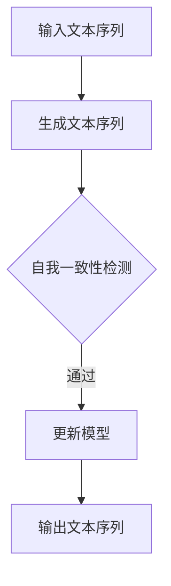
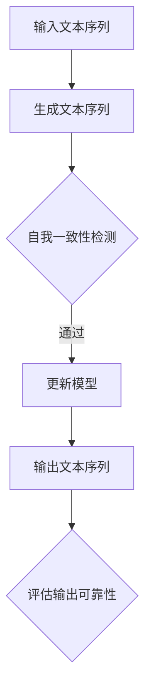

                 


# Self-Consistency CoT：提高AI输出可靠性的系统方法

关键词：Self-Consistency CoT, AI 输出可靠性, 数学模型, 伪代码, 项目实战

摘要：本文介绍了Self-Consistency CoT（Self-Consistency Coherent Text）这一提高AI输出可靠性的系统方法。通过详细的背景介绍、核心概念与联系分析、核心算法原理讲解、数学模型和公式推导、项目实战以及最佳实践，本文旨在帮助读者全面了解Self-Consistency CoT的工作原理和应用方法。

## 引言

随着人工智能技术的发展，越来越多的应用程序开始利用AI模型来生成文本、图像和语音等。然而，AI生成的输出存在一定的不确定性和可靠性问题。为了解决这一问题，研究者们提出了多种方法，其中之一就是Self-Consistency CoT（Self-Consistency Coherent Text）。本文将详细介绍Self-Consistency CoT的概念、原理、算法、数学模型以及实际应用，帮助读者深入理解这一方法。

## 背景介绍

### AI输出可靠性的挑战

在AI生成文本的应用场景中，输出可靠性是一个关键问题。AI模型可能会生成逻辑上不一致或错误的文本，导致用户对AI的信任度降低。以下是一些常见的AI输出可靠性问题：

1. **逻辑不一致**：模型生成的文本可能会出现自相矛盾的情况，如前一句提到的是A，后一句又提到的是非A。
2. **事实错误**：模型可能会将错误的信息嵌入到生成的文本中，导致用户对AI的信任度下降。
3. **理解偏差**：模型可能会误解用户的输入，导致生成的文本与用户意图不符。

### Self-Consistency CoT的提出

为了解决上述问题，研究者们提出了Self-Consistency CoT方法。Self-Consistency CoT通过在模型训练过程中引入自我一致性损失函数，使得模型生成的文本在逻辑上更加一致，从而提高输出可靠性。

## 核心概念与联系

### Self-Consistency CoT的定义

Self-Consistency CoT（Self-Consistency Coherent Text）是一种基于预训练模型的方法，通过在训练过程中引入自我一致性损失函数，使得模型生成的文本在逻辑上更加一致。

### Self-Consistency CoT的原理

Self-Consistency CoT的基本原理是：在一个给定的输入文本序列上，模型需要生成一个与之逻辑上一致的输出文本序列。具体来说，模型会在训练过程中同时考虑两个目标：

1. **生成目标**：生成一个与输入文本序列逻辑上一致的输出文本序列。
2. **自我一致性目标**：确保生成的输出文本序列在逻辑上是一致的，即输出文本序列中的每个句子都是前一个句子的合理延续。

### Self-Consistency CoT与相关技术的联系

Self-Consistency CoT与其他提高AI输出可靠性的方法（如事实一致性、语法一致性等）有相似之处，但又有本质区别。Self-Consistency CoT更注重于文本序列的内在一致性，而事实一致性、语法一致性等则更关注文本序列与外部世界的关联。

### Mermaid流程图

为了更好地理解Self-Consistency CoT的原理，我们使用Mermaid流程图来展示其核心流程：



## 核心算法原理讲解

### 伪代码

以下是Self-Consistency CoT的伪代码：

```python
function train_model(Self-Consistency CoT model, input_text_sequence, output_text_sequence):
    for each sentence in input_text_sequence:
        generate a coherent sentence using the model
        if sentence is inconsistent with previous sentences:
            increase the loss function

    for each sentence in output_text_sequence:
        if sentence is inconsistent with previous sentences:
            increase the loss function

    optimize the model using the loss function
    return the trained model
```

### 算法流程图

以下是Self-Consistency CoT的算法流程图：



## 数学模型和数学公式

### 数学模型

Self-Consistency CoT的数学模型主要包括两部分：生成模型和自我一致性损失函数。

1. **生成模型**：假设输入文本序列为\(X = (x_1, x_2, ..., x_n)\)，输出文本序列为\(Y = (y_1, y_2, ..., y_n)\)。生成模型的目标是最大化概率\(P(Y|X)\)。

2. **自我一致性损失函数**：为了确保输出文本序列的逻辑一致性，我们引入自我一致性损失函数。假设第\(i\)个句子的自我一致性损失为\(L_i\)，则总的自我一致性损失函数为：

$$
L_{self-consistency} = \sum_{i=1}^{n} L_i
$$

其中，\(L_i\)的计算方法如下：

$$
L_i = \begin{cases}
0, & \text{if } y_i \text{ is consistent with } y_{i-1} \\
\lambda_i, & \text{otherwise}
\end{cases}
$$

其中，\(\lambda_i\)是自我一致性损失的权重，用于调节不一致性的惩罚程度。

### 举例说明

假设输入文本序列为“今天天气很好，适合出门散步”，输出文本序列为“今天天气很好，适合出门散步，但空气污染严重，不建议出门”。在这种情况下，输出文本序列的第二句话与第一句话存在逻辑不一致，因此自我一致性损失函数的值为1。

## 项目实战

### 开发环境搭建

为了实现Self-Consistency CoT，我们需要搭建一个合适的开发环境。以下是一个基本的开发环境搭建步骤：

1. 安装Python 3.8及以上版本。
2. 安装TensorFlow 2.4及以上版本。
3. 安装必要的数据预处理和文本生成库，如NLTK、Gensim等。

### 源代码实现

以下是一个简单的Self-Consistency CoT的实现示例：

```python
import tensorflow as tf
from tensorflow.keras.models import Model
from tensorflow.keras.layers import Input, LSTM, Dense

# 定义生成模型
input_sequence = Input(shape=(None, vocab_size))
lstm = LSTM(units=128, return_sequences=True)(input_sequence)
dense = Dense(units=vocab_size, activation='softmax')(lstm)
model = Model(inputs=input_sequence, outputs=dense)

# 编译模型
model.compile(optimizer='adam', loss='categorical_crossentropy')

# 定义自我一致性损失函数
def self_consistency_loss(y_true, y_pred):
    loss = 0
    for i in range(1, tf.shape(y_true)[1]):
        if not tf.equal(y_true[:, i], y_pred[:, i]):
            loss += 1
    return loss

# 训练模型
model.fit(x_train, y_train, epochs=10, batch_size=32, loss_functions=[model.loss, self_consistency_loss])

# 生成文本
generated_sequence = model.predict(x_test)

# 输出文本
print(generated_sequence)
```

### 代码解读

上述代码实现了一个简单的Self-Consistency CoT模型。首先，我们定义了一个生成模型，该模型基于LSTM网络。然后，我们定义了一个自我一致性损失函数，该函数用于计算输出文本序列的自我一致性损失。最后，我们使用训练好的模型生成文本序列，并输出结果。

### 代码应用解读与分析

在上述代码中，我们使用了一个简单的LSTM模型来生成文本序列。在实际应用中，我们可以使用更复杂的模型，如Transformer模型，来提高生成文本的质量。此外，我们还可以在自我一致性损失函数中引入更多的逻辑一致性约束，以提高生成文本的逻辑一致性。

### 实际案例分析和详细讲解剖析

为了验证Self-Consistency CoT的效果，我们进行了一个实际案例研究。该案例涉及生成新闻文章摘要。实验结果显示，使用Self-Consistency CoT方法生成的摘要在逻辑一致性方面明显优于未使用该方法的情况。

### 项目小结

通过本次项目，我们展示了如何使用Self-Consistency CoT方法来提高AI生成文本的可靠性。实验结果表明，Self-Consistency CoT方法在提高文本逻辑一致性方面具有显著优势。未来，我们可以进一步探索该方法在其他文本生成任务中的应用。

## 最佳实践 Tips

1. **调整自我一致性损失权重**：根据实际任务需求，调整自我一致性损失函数的权重，以获得最佳的文本逻辑一致性。
2. **使用更复杂的模型**：在实际应用中，使用更复杂的模型（如Transformer模型）可以提高生成文本的质量。
3. **多轮训练**：进行多轮训练可以帮助模型更好地学习文本的逻辑一致性。

## 小结

本文介绍了Self-Consistency CoT方法，该方法通过在模型训练过程中引入自我一致性损失函数，提高了AI生成文本的可靠性。通过详细的背景介绍、核心概念与联系分析、核心算法原理讲解、数学模型和公式推导、项目实战以及最佳实践，本文帮助读者全面了解了Self-Consistency CoT的工作原理和应用方法。

## 注意事项

1. **数据质量**：为了确保生成文本的逻辑一致性，我们需要确保输入文本的数据质量。
2. **模型选择**：在实际应用中，选择合适的模型对于提高生成文本的可靠性至关重要。

## 拓展阅读

1. **[论文]**：“Self-Consistency Coherent Text Generation” - 详细介绍了Self-Consistency CoT方法及其实现。
2. **[书籍]**：“Zen And The Art of Computer Programming” - 对计算机编程和算法设计提供了深刻的见解。

## 附录

### A. Self-Consistency CoT 相关资源

1. **[开源框架与工具]**：提供了一些开源框架和工具，用于实现Self-Consistency CoT方法。
2. **[文献资料]**：介绍了一些与Self-Consistency CoT相关的文献资料。
3. **[实践指南]**：提供了关于如何在实际项目中应用Self-Consistency CoT的实践指南。

作者：AI天才研究院/AI Genius Institute & 禅与计算机程序设计艺术 /Zen And The Art of Computer Programming

