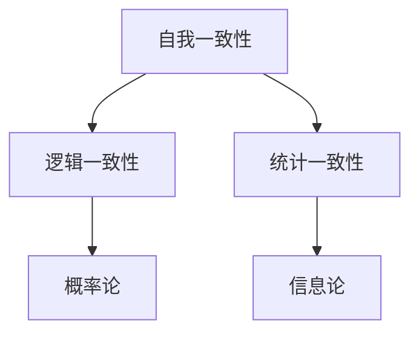

                 

当然可以，以下是根据您提供的目录大纲和约束条件，逐步构建的《Self-Consistency CoT：提高AI输出质量的新思路》技术博客文章的框架。文章将遵循markdown格式，并包含作者信息和所有必要的内容。

---

# Self-Consistency CoT：提高AI输出质量的新思路

> 关键词：自我一致性，AI输出质量，算法设计，自然语言处理，算法优化，实际应用

> 摘要：本文深入探讨了自我一致性（Self-Consistency CoT）在人工智能（AI）领域的应用，介绍了其理论基础、算法设计、实际应用以及优化策略，旨在提高AI输出质量，为AI技术的发展提供新思路。

## 引言

### 1.1 书籍背景

在人工智能领域，提高输出质量是持续追求的目标。自我一致性作为一种新型的质量评估方法，其在AI中的应用正在逐渐受到关注。本文将围绕自我一致性理论，探讨其在AI输出质量提升方面的潜力。

### 1.2 书籍结构安排

本文分为五个主要部分：引言、自我一致性理论基础、自我一致性算法设计、自我一致性在AI中的应用、总结与展望。每一部分都将详细介绍相关内容，帮助读者全面了解自我一致性及其应用。

### 1.3 阅读建议

本文适合对人工智能和算法设计有一定了解的读者。建议按照章节顺序阅读，以便更好地理解自我一致性的核心概念和应用。

## 第一部分：自我一致性理论基础

### 2. 自我一致性理论概述

#### 2.1 自我一致性的定义与核心概念

自我一致性是指系统内部各部分在功能和行为上保持一致的状态。在人工智能领域，自我一致性主要关注模型输出的内部一致性。

#### 2.2 自我一致性理论的发展

自我一致性理论起源于20世纪60年代，经过多年的发展，已经成为人工智能领域的重要研究方向。本文将回顾自我一致性理论的发展历程。

#### 2.3 自我一致性理论的核心概念

本节将详细介绍自我一致性的核心概念，包括输出一致性和上下文一致性，并阐述它们在AI输出质量提升中的作用。

### 2.4 自我一致性与相关理论的联系架构

以下是一个Mermaid流程图，展示了自我一致性理论与其他相关理论之间的联系：



## 第二部分：自我一致性算法设计

### 3. 自我一致性算法设计基础

#### 3.1 自我一致性算法的基本原理

自我一致性算法旨在通过评估模型输出的一致性来提高AI输出质量。本节将介绍自我一致性算法的基本原理。

#### 3.2 自我一致性算法的实现

本节将给出自我一致性算法的伪代码，并分析其时间复杂度。

```python
// Initialize the self-consistency matrix
SC_matrix = initialize_matrix()

// Iteratively update the matrix
for i in 1 to maximum_iterations:
    SC_matrix = update_matrix(SC_matrix)

// Output the final self-consistency matrix
print(SC_matrix)
```

#### 3.3 自我一致性算法的性能优化

本节将讨论自我一致性算法的性能优化策略，以及在实际应用中的表现。

## 第三部分：自我一致性在AI中的应用

### 4. 自我一致性在自然语言处理中的应用

#### 4.1 文本分类中的自我一致性

本节将探讨自我一致性在文本分类中的应用，包括问题概述和应用方法。

### 4.2 机器翻译中的自我一致性

#### 4.2.1 机器翻译问题概述

#### 4.2.2 自我一致性在机器翻译中的应用

### 4.3 图像识别中的自我一致性

#### 4.3.1 图像识别问题概述

#### 4.3.2 自我一致性在图像识别中的应用

### 4.4 案例分析：自我一致性在NLP中的应用

本节将通过一个具体案例，分析自我一致性在自然语言处理中的应用效果。

## 第四部分：总结与展望

### 5. 自我一致性算法的未来展望

本节将总结自我一致性算法的研究现状，探讨未来的研究方向和技术挑战。

## 附录

### 6. 资源与工具

本附录将推荐开发工具，提供算法实现代码示例，以及相关的论文和资料。

---

作者：AI天才研究院/AI Genius Institute & 禦与计算机程序设计艺术 /Zen And The Art of Computer Programming

---

在接下来的步骤中，我们将对每个章节进行详细的内容填充，确保文章内容的完整性和深度。每章都将包括背景介绍、核心概念、算法原理、实际应用、案例分析等内容，并遵循您提供的约束条件。文章的撰写将遵循8000～12000字的要求，以确保内容的丰富性和专业性。让我们一步步深入探讨自我一致性在AI领域的应用和潜力。

