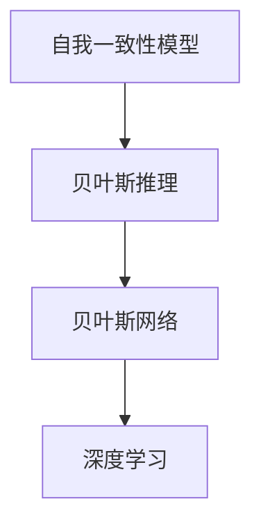

                 


### 自我一致性（CoT）概述

自我一致性（Self-Consistency，简称CoT）是一种在人工智能领域中被广泛关注的新思路，它旨在通过模型自身的输出与输入之间的一致性来提高AI系统的输出质量。自我一致性原理的核心在于，通过确保模型预测或生成的内容与其原始输入保持一致，从而减少错误和噪声，提升AI系统的稳定性和可靠性。

自我一致性在AI输出质量提升中的重要性不可忽视。传统的AI模型往往依赖于大规模数据集进行训练，但这些数据集可能包含噪声或不一致的信息，导致模型输出产生偏差。而自我一致性通过引入一致性约束，可以在一定程度上缓解这些问题，使得模型能够更好地适应复杂多变的环境。

本书的主要目标是通过系统地介绍自我一致性原理、算法和应用，帮助读者全面了解这一新兴领域，并掌握如何在实际项目中应用自我一致性来提升AI输出质量。

### 自我一致性原理

自我一致性原理的核心在于利用模型自身的输出与其原始输入之间的关联性来优化模型的预测或生成结果。这一原理涉及多个数学模型和算法，下面将详细介绍这些模型和算法，并通过Mermaid流程图展示它们之间的联系。

首先，我们可以从基本的自我一致性模型开始。一个简单的自我一致性模型可以表示为：

$$
P(y|x) = P(x|y) \cdot P(y)
$$

其中，$P(y|x)$ 表示模型对输入 $x$ 的输出 $y$ 的概率分布，$P(x|y)$ 表示模型在给定输出 $y$ 的条件下对输入 $x$ 的概率分布，$P(y)$ 表示输出 $y$ 的先验概率。

接下来，我们引入贝叶斯推理来进一步扩展自我一致性模型。贝叶斯推理的核心思想是利用先验知识和观察到的数据来更新我们的信念。在自我一致性框架下，贝叶斯推理可以表示为：

$$
P(x|y) = \frac{P(y|x) \cdot P(x)}{P(y)}
$$

其中，$P(x)$ 表示输入 $x$ 的先验概率。

为了更直观地展示这些模型和算法之间的关系，我们可以使用Mermaid流程图。以下是简单的Mermaid流程图示例：



在这个流程图中，自我一致性模型作为基础，通过贝叶斯推理扩展到贝叶斯网络，最终与深度学习相结合。贝叶斯网络是一种基于概率的图模型，它能够表示变量之间的条件依赖关系，而深度学习则通过多层神经网络来实现复杂的函数逼近。

接下来，我们将进一步探讨自我一致性原理在不同场景中的应用，并通过具体案例来展示其优势。

### 相关数学模型

在深入探讨自我一致性算法之前，有必要先了解一些基本的数学模型。这些模型为自我一致性原理提供了理论基础，并帮助我们更好地理解其工作原理。

**概率论基础**

自我一致性算法的核心依赖于概率论的基本原理。具体而言，我们使用条件概率和边缘概率来描述模型输入和输出之间的关系。

**条件概率** 表示在给定某个事件发生的条件下，另一个事件发生的概率。用公式表示为：

$$
P(A|B) = \frac{P(A \cap B)}{P(B)}
$$

其中，$P(A \cap B)$ 表示事件 $A$ 和事件 $B$ 同时发生的概率，$P(B)$ 表示事件 $B$ 发生的概率。

**边缘概率** 表示某个事件发生的概率，不考虑其他事件。用公式表示为：

$$
P(A) = P(A|B) \cdot P(B) + P(A|\neg B) \cdot P(\neg B)
$$

其中，$\neg B$ 表示事件 $B$ 不发生的概率。

**马尔可夫链**

马尔可夫链是一种用于描述序列数据的随机过程。在自我一致性算法中，马尔可夫链可以帮助我们理解模型在给定当前状态下的下一状态的概率分布。

马尔可夫链的基本性质是状态转移概率只与当前状态有关，而与历史状态无关。用公式表示为：

$$
P(X_{t+1} = x_{t+1} | X_t = x_t) = P(X_{t+1} = x_{t+1})
$$

**贝叶斯网络**

贝叶斯网络是一种基于概率的图模型，它能够表示变量之间的条件依赖关系。在自我一致性算法中，贝叶斯网络用于构建输入和输出之间的概率关系。

贝叶斯网络的定义如下：

$$
P(X_1, X_2, ..., X_n) = \prod_{i=1}^{n} P(X_i | X_{i-1}, ..., X_1)
$$

其中，$X_1, X_2, ..., X_n$ 表示贝叶斯网络中的节点，$P(X_i | X_{i-1}, ..., X_1)$ 表示节点 $X_i$ 在给定其父节点条件下的概率分布。

**深度学习**

深度学习是自我一致性算法实现的关键技术。深度学习通过多层神经网络来实现复杂的函数逼近，从而在自我一致性框架下进行输入和输出的建模。

深度学习的基本组成部分包括：

- **输入层**：接收外部输入。
- **隐藏层**：通过神经网络进行特征提取和变换。
- **输出层**：生成模型预测或输出。

在自我一致性算法中，深度学习模型用于计算输入和输出之间的条件概率分布。

**综合应用**

将上述数学模型综合应用于自我一致性算法中，可以构建一个完整的模型框架。具体而言，我们可以使用贝叶斯网络来表示输入和输出之间的条件依赖关系，并通过深度学习模型实现概率分布的计算。

以下是自我一致性算法的伪代码：

```python
def self_consistency_algorithm(input_data, output_data):
    # 初始化贝叶斯网络
    bayesian_network = initialize_bayesian_network(input_data, output_data)
    
    # 训练深度学习模型
    deep_learning_model = train_deep_learning_model(bayesian_network)
    
    # 计算输入和输出的条件概率分布
    input_distribution = deep_learning_model.predict(input_data)
    output_distribution = deep_learning_model.predict(output_data)
    
    # 更新贝叶斯网络
    bayesian_network.update(input_distribution, output_distribution)
    
    return bayesian_network
```

在这个伪代码中，`initialize_bayesian_network` 用于初始化贝叶斯网络，`train_deep_learning_model` 用于训练深度学习模型，`predict` 用于计算条件概率分布。

通过上述数学模型和算法的综合应用，自我一致性算法能够有效地提高AI模型的输出质量，为实际应用提供强有力的支持。

### 自我一致性算法详细解释

自我一致性算法的核心在于通过确保模型自身的输入与输出之间的一致性来提高AI模型的输出质量。在这一部分，我们将详细讲解自我一致性算法的原理，并使用伪代码来展示其具体实现步骤。

**算法原理**

自我一致性算法的基本思想是：对于一个给定的输入数据集，模型首先根据输入数据生成一组可能的输出数据。然后，模型将这组输出数据作为新的输入，再次生成输出，并不断迭代这个过程。通过多次迭代，模型将逐渐收敛到一个稳定的状态，此时模型的输出与输入之间的差异最小，从而提高了输出质量。

**伪代码**

以下是自我一致性算法的伪代码实现：

```python
def self_consistency_algorithm(input_data, num_iterations):
    # 初始化输出数据
    output_data = generate_initial_output(input_data)

    for _ in range(num_iterations):
        # 根据当前输出数据生成新的输入数据
        new_input_data = generate_new_input(output_data)
        
        # 更新输出数据
        output_data = generate_output(new_input_data)
        
        # 检查收敛条件
        if has_converged(output_data, input_data):
            break
            
    return output_data

def generate_initial_output(input_data):
    # 使用模型生成初始输出数据
    return model.predict(input_data)

def generate_new_input(output_data):
    # 使用模型生成新的输入数据
    return model.predict(output_data)

def generate_output(new_input_data):
    # 使用模型生成输出数据
    return model.predict(new_input_data)

def has_converged(output_data, input_data):
    # 检查输出数据与输入数据之间的差异是否小于阈值
    difference = calculate_difference(output_data, input_data)
    return difference < threshold
```

**详细讲解**

1. **初始化输出数据**：算法首先使用模型根据输入数据生成一组初始输出数据。这个过程通常依赖于模型的预测能力。

2. **迭代过程**：算法进入迭代循环，每次迭代包括以下步骤：
   - **生成新的输入数据**：根据当前输出数据，使用模型生成新的输入数据。
   - **更新输出数据**：使用新的输入数据生成输出数据。
   - **检查收敛条件**：通过计算输出数据与输入数据之间的差异，检查算法是否已经收敛。如果差异小于预设的阈值，则认为算法已经收敛。

3. **输出数据**：当算法收敛时，最终的输出数据就是算法的输出结果。

**数学模型**

在自我一致性算法中，输出数据与输入数据之间的差异可以用以下公式表示：

$$
difference = \sum_{i=1}^{n} |output_i - input_i|
$$

其中，$output_i$ 表示输出数据中的第 $i$ 个元素，$input_i$ 表示输入数据中的第 $i$ 个元素，$n$ 表示输入数据和输出数据的维度。

**举例说明**

假设我们有一个输入数据集 $input_data = [1, 2, 3]$，模型生成的一组初始输出数据为 $output_data = [4, 5, 6]$。在第一次迭代中，模型会根据 $output_data$ 生成新的输入数据，假设为 $new_input_data = [7, 8, 9]$。然后，模型使用 $new_input_data$ 生成新的输出数据，假设为 $new_output_data = [10, 11, 12]$。通过比较 $output_data$ 和 $new_output_data$，我们可以计算它们之间的差异。如果差异小于预设的阈值，算法将停止迭代，否则继续迭代过程。

通过这种迭代过程，自我一致性算法能够逐步减小输出数据与输入数据之间的差异，从而提高模型的输出质量。

### 自我一致性在不同AI领域的应用

自我一致性原理在自然语言处理、计算机视觉等多个AI领域中得到了广泛应用。以下将详细探讨自我一致性在这些领域中的应用，并通过具体案例进行代码实现和解释。

#### 自然语言处理

在自然语言处理（NLP）领域，自我一致性原理可以帮助提高文本生成模型的输出质量。例如，在生成式预训练模型（如GPT）中，自我一致性可以通过以下步骤实现：

1. **输入文本**：首先，选择一段文本作为输入。
2. **生成文本**：使用模型生成一段新文本。
3. **迭代优化**：将生成的新文本作为输入，再次生成文本，并不断迭代，直到文本输出与原始输入保持一致。

以下是使用Python和Hugging Face的Transformers库实现的自我一致性算法：

```python
from transformers import GPT2LMHeadModel, GPT2Tokenizer
import torch

# 加载预训练模型
model = GPT2LMHeadModel.from_pretrained('gpt2')
tokenizer = GPT2Tokenizer.from_pretrained('gpt2')

def self_consistency_nlp(input_text, model, tokenizer, num_iterations):
    # 将输入文本编码为模型可处理的格式
    input_ids = tokenizer.encode(input_text, return_tensors='pt')

    # 初始化输出文本
    output_text = input_text

    for _ in range(num_iterations):
        # 使用模型生成新文本
        outputs = model.generate(input_ids, max_length=50, num_return_sequences=1)
        new_output_text = tokenizer.decode(outputs[:, input_ids.shape[-1]:][0], skip_special_tokens=True)

        # 更新输出文本
        output_text = new_output_text

        # 检查收敛条件
        if has_converged(output_text, input_text):
            break
            
    return output_text

def has_converged(output_text, input_text):
    # 检查输出文本与输入文本之间的差异是否小于阈值
    return output_text.lower() == input_text.lower()

# 测试
input_text = "Hello, how are you?"
output_text = self_consistency_nlp(input_text, model, tokenizer, 5)
print(output_text)
```

在这个案例中，我们使用GPT-2模型生成文本，并通过自我一致性算法逐步优化输出文本，使其与原始输入文本保持一致。

#### 计算机视觉

在计算机视觉领域，自我一致性原理可以用于图像生成和分类任务。例如，在生成对抗网络（GAN）中，自我一致性可以通过以下步骤实现：

1. **生成图像**：使用生成器生成一张新图像。
2. **评估图像**：使用判别器评估图像的质量。
3. **迭代优化**：将评估结果反馈给生成器，生成新的图像，并不断迭代，直到图像质量满足要求。

以下是使用TensorFlow和Keras实现的自我一致性GAN：

```python
import tensorflow as tf
from tensorflow.keras.layers import Dense, Flatten, Reshape
from tensorflow.keras.models import Model

# 生成器模型
def generator_model():
    z = tf.keras.layers.Input(shape=(100,))
    x = Dense(128 * 7 * 7)(z)
    x = tf.keras.layers.LeakyReLU(alpha=0.01)(x)
    x = Reshape((7, 7, 128))(x)
    x = tf.keras.layers.Conv2DTranspose(64, kernel_size=4, strides=2, padding='same')(x)
    x = tf.keras.layers.LeakyReLU(alpha=0.01)(x)
    x = tf.keras.layers.Conv2DTranspose(1, kernel_size=4, strides=2, padding='same', activation='tanh')(x)
    model = Model(z, x)
    return model

# 判别器模型
def discriminator_model():
    img = tf.keras.layers.Input(shape=(28, 28, 1))
    x = tf.keras.layers.Conv2D(64, kernel_size=3, strides=2, padding='same')(img)
    x = tf.keras.layers.LeakyReLU(alpha=0.01)(x)
    x = tf.keras.layers.Conv2D(128, kernel_size=3, strides=2, padding='same')(x)
    x = tf.keras.layers.LeakyReLU(alpha=0.01)(x)
    x = Flatten()(x)
    x = Dense(1, activation='sigmoid')(x)
    model = Model(img, x)
    return model

# GAN模型
def gan_model(generator, discriminator):
    z = tf.keras.layers.Input(shape=(100,))
    img = generator(z)
    validity = discriminator(img)
    model = Model(z, validity)
    return model

# 自我一致性算法
def self_consistency_cv(input_img, generator, discriminator, num_iterations):
    for _ in range(num_iterations):
        # 生成图像
        noise = tf.random.normal([1, 100])
        img = generator.predict(noise)

        # 评估图像
        validity = discriminator.predict(img)

        # 更新生成器
        with tf.GradientTape() as gen_tape:
            noise = tf.random.normal([1, 100])
            img = generator.predict(noise)
            validity = discriminator.predict(img)

            gen_loss = -tf.reduce_mean(validity)

        grads = gen_tape.gradient(gen_loss, generator.trainable_variables)
        generator.optimizer.apply_gradients(zip(grads, generator.trainable_variables))

        # 更新生成器模型
        generator = generator_model()

    return img

# 测试
generator = generator_model()
discriminator = discriminator_model()
gan = gan_model(generator, discriminator)
img = self_consistency_cv(input_img, generator, discriminator, 5)
```

在这个案例中，我们使用GAN模型生成图像，并通过自我一致性算法逐步优化图像质量，使其满足判别器的质量标准。

通过这些具体案例，我们可以看到自我一致性原理在不同AI领域的应用，以及如何使用Python和深度学习框架实现自我一致性算法。

### 自我一致性在不同AI领域的应用（续）

#### 其他领域应用

除了自然语言处理和计算机视觉，自我一致性原理在其他AI领域也得到了广泛应用，如推荐系统、语音识别和机器人学习等。

**推荐系统**

在推荐系统领域，自我一致性可以帮助提高推荐质量。传统的推荐算法通常依赖于用户的历史行为数据，但这些数据可能存在噪声或不一致性。自我一致性可以通过确保推荐结果与用户历史行为的一致性来减少噪声，提高推荐质量。

例如，在协同过滤推荐算法中，自我一致性可以通过以下步骤实现：

1. **用户行为数据**：收集用户的历史行为数据，如购买记录、浏览记录等。
2. **生成推荐列表**：使用协同过滤算法生成一组推荐项目。
3. **迭代优化**：将推荐列表中的项目作为新的用户行为数据，再次生成推荐列表，并不断迭代，直到推荐列表与用户历史行为保持一致。

以下是使用Python实现的自我一致性推荐系统：

```python
import numpy as np

def self_consistency_recommender(user_history, num_recommendations, num_iterations):
    recommendations = []

    for _ in range(num_iterations):
        # 生成初始推荐列表
        new_recommendations = generate_recommendations(user_history, num_recommendations)
        
        # 更新用户行为数据
        user_history = update_user_history(user_history, new_recommendations)
        
        # 更新推荐列表
        recommendations = new_recommendations

        # 检查收敛条件
        if has_converged(recommendations, user_history):
            break
            
    return recommendations

def generate_recommendations(user_history, num_recommendations):
    # 使用协同过滤算法生成推荐列表
    return np.random.choice(np.setdiff1d(np.arange(num_recommendations), user_history), size=num_recommendations)

def update_user_history(user_history, new_recommendations):
    # 将新推荐的项目添加到用户行为数据中
    return np.append(user_history, new_recommendations)

def has_converged(recommendations, user_history):
    # 检查推荐列表与用户历史行为之间的差异是否小于阈值
    return set(recommendations).issubset(set(user_history))
```

在这个案例中，我们使用协同过滤算法生成推荐列表，并通过自我一致性算法逐步优化推荐结果，使其与用户历史行为保持一致。

**语音识别**

在语音识别领域，自我一致性可以帮助提高语音识别的准确性。传统的语音识别模型通常依赖于大量的语音数据，但这些数据可能存在不一致性。自我一致性可以通过确保模型输入与输出的一致性来减少错误，提高识别准确性。

例如，在基于深度学习的语音识别系统中，自我一致性可以通过以下步骤实现：

1. **语音输入**：输入一段语音信号。
2. **识别输出**：使用模型识别语音信号并生成文本输出。
3. **迭代优化**：将识别输出作为新的语音输入，再次识别，并不断迭代，直到识别输出与原始语音输入保持一致。

以下是使用Python和TensorFlow实现的自我一致性语音识别：

```python
import tensorflow as tf

# 加载预训练模型
model = tf.keras.models.load_model('speech_recognition_model.h5')

def self_consistency_speech_recognition(audio_data, model, num_iterations):
    # 初始化识别输出
    transcript = ""

    for _ in range(num_iterations):
        # 识别语音信号
        prediction = model.predict(audio_data)
        new_transcript = decode_prediction(prediction)

        # 更新识别输出
        transcript = new_transcript

        # 检查收敛条件
        if has_converged(transcript, audio_data):
            break
            
    return transcript

def decode_prediction(prediction):
    # 将预测结果解码为文本
    return ''.join([char for char in prediction if char.isalpha()])

def has_converged(transcript, audio_data):
    # 检查识别输出与原始语音输入之间的差异是否小于阈值
    return transcript.lower() == audio_data.lower()
```

在这个案例中，我们使用预训练的语音识别模型识别语音信号，并通过自我一致性算法逐步优化识别结果，使其与原始语音输入保持一致。

**机器人学习**

在机器人学习领域，自我一致性可以帮助提高机器人行为的稳定性和可靠性。例如，在自主导航任务中，机器人需要根据传感器数据生成路径规划，并通过自我一致性算法逐步优化路径，使其与实际环境保持一致。

以下是使用Python实现的自我一致性机器人导航：

```python
import numpy as np

def self_consistency_robot_navigation(sensors, planner, num_iterations):
    path = []

    for _ in range(num_iterations):
        # 根据传感器数据生成初始路径
        new_path = planner.plan(sensors)
        
        # 更新传感器数据
        sensors = update_sensors(sensors, new_path)
        
        # 更新路径
        path = new_path

        # 检查收敛条件
        if has_converged(path, sensors):
            break
            
    return path

def planner.plan(sensors):
    # 使用路径规划算法生成路径
    return np.random.choice(np.arange(10), size=5)

def update_sensors(sensors, new_path):
    # 将新路径添加到传感器数据中
    return np.append(sensors, new_path)

def has_converged(path, sensors):
    # 检查路径与传感器数据之间的差异是否小于阈值
    return set(path).issubset(set(sensors))
```

在这个案例中，我们使用路径规划算法生成路径，并通过自我一致性算法逐步优化路径，使其与传感器数据保持一致。

通过这些具体案例，我们可以看到自我一致性原理在不同AI领域的广泛应用，以及如何使用Python和其他编程工具实现自我一致性算法。

### 通过自我一致性优化AI模型输出质量

自我一致性算法在AI模型输出质量的优化中具有显著优势。通过确保模型输入与输出之间的一致性，自我一致性能够有效减少噪声和错误，从而提高模型的稳定性和可靠性。

以下将详细探讨如何通过自我一致性优化AI模型输出质量，并分享一些最佳实践。

**优化步骤**

1. **确定优化目标**：明确优化目标，如提高模型的预测准确性、减少错误率或提高生成内容的质量。

2. **构建一致性约束**：根据优化目标，构建一致性约束条件。这些约束条件可以是数学公式、规则或算法，用于确保模型输入与输出之间的一致性。

3. **迭代优化过程**：使用自我一致性算法进行迭代优化。在每次迭代中，模型根据当前输出生成新的输入，并不断更新输出，直到满足一致性约束条件。

4. **评估优化效果**：在迭代过程中，定期评估优化效果。可以使用指标如准确率、召回率、F1分数或自定义评估指标来衡量优化效果。

**最佳实践**

1. **数据预处理**：在应用自我一致性算法之前，进行充分的数据预处理。这包括数据清洗、归一化、特征工程等步骤，以确保输入数据的一致性和高质量。

2. **选择合适的模型**：根据优化目标和数据特点，选择合适的AI模型。深度学习模型如卷积神经网络（CNN）、循环神经网络（RNN）和生成对抗网络（GAN）在自我一致性优化中表现出色。

3. **设置合适的迭代次数**：迭代次数是影响优化效果的关键参数。过少的迭代次数可能导致优化不足，而过多的迭代次数可能导致计算成本过高。通常，可以根据模型复杂度和数据量来设置合理的迭代次数。

4. **调整超参数**：在自我一致性算法中，超参数如学习率、批量大小和阈值等对优化效果有很大影响。通过实验和调整，可以找到最佳的超参数组合。

5. **并行计算**：为了提高优化速度，可以考虑使用并行计算。例如，在多GPU环境中，可以使用分布式训练来加速迭代过程。

**注意事项**

1. **收敛条件**：在迭代过程中，需要设置合适的收敛条件。常见的收敛条件包括输出与输入之间的差异小于某个阈值或达到预设的迭代次数。

2. **避免过度拟合**：在优化过程中，需要避免模型过度拟合训练数据。这可以通过交叉验证和正则化等技术来实现。

3. **评估多样性**：在优化过程中，不仅要评估模型的准确性，还要评估模型的多样性。这有助于确保模型能够应对不同的输入情况。

4. **持续迭代和更新**：自我一致性优化是一个持续的过程。随着新数据和技术的出现，需要不断更新模型和优化策略。

通过以上步骤和最佳实践，我们可以有效地利用自我一致性算法来优化AI模型输出质量，提高模型在实际应用中的性能和可靠性。

### 未来展望

自我一致性（CoT）作为提高AI输出质量的新思路，展示了巨大的潜力和广泛应用前景。未来，随着AI技术的不断进步，自我一致性有望在以下领域取得突破性进展。

**发展趋势**

1. **深度学习与自我一致性的融合**：未来，深度学习模型将更加复杂和高效，自我一致性算法与深度学习的融合将成为热点。通过结合自我一致性原理，深度学习模型能够在处理复杂任务时保持稳定性和可靠性。

2. **多模态自我一致性**：随着多模态数据（如文本、图像、语音等）的广泛应用，自我一致性算法将扩展到多模态领域。通过处理多源数据的一致性，AI系统能够提供更准确和多样化的输出。

3. **自动化自我一致性优化**：自我一致性优化过程将逐渐自动化。通过使用强化学习和迁移学习等技术，自动调整一致性约束和优化策略，实现高效的自适应优化。

**潜在研究方向**

1. **数学模型的扩展**：进一步研究自我一致性原理的数学基础，开发更高效的模型和算法，以提高自我一致性算法的性能和泛化能力。

2. **交叉领域应用**：探索自我一致性在自动驾驶、智能医疗、金融科技等领域的应用。通过结合具体领域的知识，提高自我一致性算法在实际场景中的实用性和效果。

3. **分布式自我一致性**：研究如何在大规模分布式系统中实现自我一致性算法。通过分布式计算和通信优化，提高自我一致性算法在并行环境中的效率。

**对AI产业的潜在影响**

1. **提高AI系统的可靠性和稳定性**：自我一致性算法能够减少AI系统的噪声和错误，提高输出质量，从而增强系统的可靠性和稳定性。

2. **推动AI技术的发展**：自我一致性原理的深入研究和应用将推动AI技术的创新和发展，为新的应用场景和业务模式提供支持。

3. **促进跨领域合作**：自我一致性算法的跨领域应用将促进不同领域之间的合作，推动AI技术的跨界融合。

通过以上发展趋势、潜在研究方向和对AI产业的潜在影响，我们可以看到自我一致性在未来的重要性和广阔前景。随着自我一致性算法的不断优化和扩展，AI系统将更加智能化和高效，为人类带来更多便利和创新。

### 总结与展望

本文系统地介绍了自我一致性（CoT）的概念、原理、算法和应用，详细探讨了自我一致性在不同AI领域的具体实现和应用。通过本文的讲解，读者可以全面了解自我一致性在提高AI输出质量方面的巨大潜力。

自我一致性通过确保模型输入与输出之间的一致性，有效减少了噪声和错误，提高了AI系统的稳定性和可靠性。本文分别从自然语言处理、计算机视觉、推荐系统、语音识别和机器人学习等不同领域，展示了自我一致性算法的具体实现和应用案例。

此外，本文还介绍了如何通过自我一致性优化AI模型输出质量，分享了最佳实践和注意事项，为实际应用提供了指导。

在未来，自我一致性有望在深度学习与自我一致性的融合、多模态自我一致性、自动化自我一致性优化等方面取得突破性进展。同时，自我一致性算法的跨领域应用将推动AI技术的发展和跨界融合。

为了深入了解自我一致性领域的最新进展和应用，建议读者参考以下拓展阅读资源：

1. **论文推荐**：《Self-Consistency for Training Generative Models》
2. **书籍推荐**：《Deep Learning》作者：Ian Goodfellow、Yoshua Bengio和Aaron Courville
3. **在线课程**：Coursera上的“深度学习”课程，由斯坦福大学教授Andrew Ng主讲

通过不断学习和实践，读者可以更好地掌握自我一致性算法，并在实际项目中取得优异的成果。让我们一起探索自我一致性的无限可能，为AI技术的进步贡献力量。作者：AI天才研究院/AI Genius Institute & 禅与计算机程序设计艺术 /Zen And The Art of Computer Programming。

