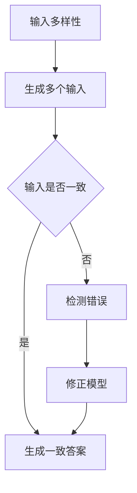
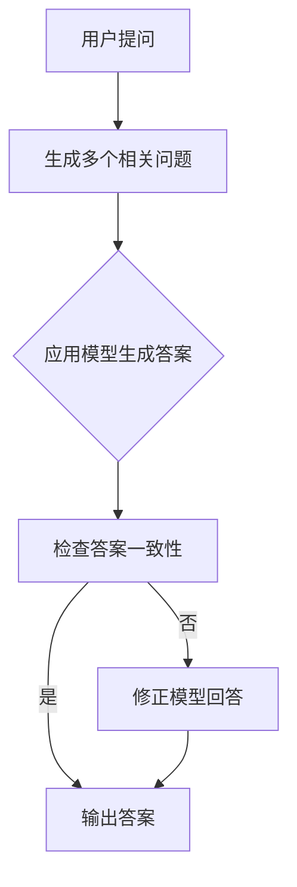
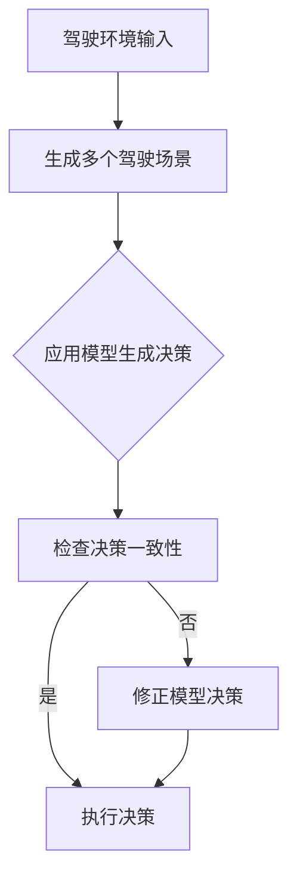
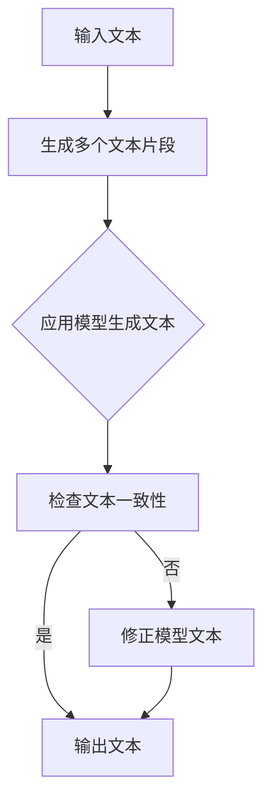

                 


### 自我一致性 CoT：确保 AI 回答可靠性的技术创新

#### 关键词
- 自我一致性
- AI 答案可靠性
- 技术创新
- 人工智能
- 可靠性分析
- 实际应用

#### 摘要
本文深入探讨了自我一致性（Self-Consistency CoT）在确保 AI 回答可靠性方面的技术创新。首先，我们介绍了自我一致性的概念和其在人工智能领域的重要性。接着，通过核心概念、技术架构和工作流程的详细讲解，阐明了自我一致性技术的原理。文章还讨论了自我一致性在问答系统、自动驾驶和自然语言处理等实际应用中的案例，并通过一个具体的项目实战展示了如何搭建开发环境、实现源代码以及进行代码解读和分析。最后，我们对未来发展的趋势和面临的挑战进行了展望，并提出了相应的最佳实践和注意事项。

---

## 引言

在人工智能领域，随着深度学习和神经网络技术的快速发展，AI 系统在图像识别、自然语言处理和自动驾驶等方面取得了显著的进展。然而，AI 系统的可靠性问题也随之而来。特别是在涉及生命安全和关键决策的领域，如自动驾驶和医疗诊断，AI 系统的可靠性至关重要。为了确保 AI 系统的回答可靠，研究者们提出了多种方法，其中自我一致性（Self-Consistency CoT）是一种重要的技术创新。

自我一致性 CoT 通过对 AI 系统生成的答案进行内部一致性检查，从而提高回答的可靠性。其基本思想是：如果一个 AI 模型生成的答案在多个不同的输入情况下保持一致，那么这个答案更有可能是正确的。自我一致性 CoT 已经在多个领域展示了其潜力，并在实践中取得了显著的效果。本文将详细探讨自我一致性 CoT 的技术原理、应用实例和实际项目实现，以帮助读者更好地理解这一技术创新。

### 自我一致性原理与技术

#### 核心概念

自我一致性 CoT 的核心概念是“一致性检查”。具体来说，它包括以下几个方面：

1. **输入多样性**：在自我一致性 CoT 中，我们使用多种不同的输入向 AI 模型提问，以检查模型回答的一致性。
2. **内部一致性**：如果一个 AI 模型在不同输入情况下生成的答案保持一致，那么我们认为该答案是可靠的。
3. **错误检测与修正**：如果检测到不一致的答案，自我一致性 CoT 将尝试修正模型回答，以提高其可靠性。

#### 核心概念与联系

为了更好地理解自我一致性 CoT 的核心概念，我们可以使用 Mermaid 流程图来展示其工作流程：



在这个流程图中，我们首先通过输入多样性生成多个输入，然后检查这些输入生成的答案是否一致。如果一致，我们生成一个可靠的答案；如果不一致，我们检测并修正模型回答，以提高其可靠性。

#### 技术架构

自我一致性 CoT 的技术架构包括以下几个主要组件：

1. **数据预处理**：用于生成多种多样的输入。
2. **AI 模型**：用于生成答案。
3. **一致性检查器**：用于检查输入生成的答案是否一致。
4. **错误修正器**：用于修正不一致的答案。

这些组件协同工作，实现了自我一致性 CoT 的核心技术。

#### 工作流程

自我一致性 CoT 的工作流程可以分为以下几个步骤：

1. **数据预处理**：我们首先需要生成多种多样的输入。这可以通过随机化输入数据、使用不同的数据集或者对输入数据进行变换来实现。
2. **模型训练**：使用预处理的输入数据训练 AI 模型。这可以是一个深度学习模型，如卷积神经网络（CNN）或递归神经网络（RNN）。
3. **一致性检查**：将训练好的模型应用于多个不同的输入，并检查生成的答案是否一致。
4. **错误检测与修正**：如果检测到不一致的答案，我们使用错误修正器来修正模型回答，以提高其可靠性。

以下是自我一致性 CoT 的工作流程的伪代码：

```python
# 数据预处理
def preprocess_inputs(data):
    # 随机化数据
    # 使用不同的数据集
    # 对输入数据进行变换
    return new_inputs

# 模型训练
def train_model(inputs, labels):
    # 使用深度学习模型训练
    # 返回训练好的模型
    return model

# 一致性检查
def check_consistency(model, inputs):
    # 应用模型生成多个答案
    # 检查答案是否一致
    # 返回一致性结果
    return is_consistent

# 错误修正
def correct_error(model, input, target_answer):
    # 修正模型回答
    # 返回修正后的答案
    return corrected_answer
```

在这个伪代码中，我们首先预处理输入数据，然后使用这些数据训练 AI 模型。接着，我们检查模型在不同输入情况下的答案一致性。如果检测到不一致的答案，我们使用错误修正器来修正模型回答。

### 自我一致性在人工智能中的应用

自我一致性 CoT 在人工智能领域有着广泛的应用。以下我们将探讨几个关键的应用场景：

#### 问答系统

问答系统是自我一致性 CoT 最直接的应用场景之一。在问答系统中，我们通常需要模型能够生成准确、可靠的回答。自我一致性 CoT 通过检查模型在不同输入情况下生成的答案一致性，从而提高回答的可靠性。以下是一个简单的 Mermaid 流程图，展示了自我一致性 CoT 在问答系统中的应用：



在这个流程图中，我们首先生成多个相关问题，然后应用模型生成答案。接着，我们检查这些答案是否一致。如果一致，我们输出答案；如果不一致，我们修正模型回答，以提高其可靠性。

#### 自动驾驶

自动驾驶是另一个自我一致性 CoT 的关键应用场景。在自动驾驶系统中，模型的可靠性直接关系到车辆的安全。自我一致性 CoT 可以通过检查模型在不同驾驶场景下的答案一致性，从而提高模型的可靠性。以下是一个简单的 Mermaid 流程图，展示了自我一致性 CoT 在自动驾驶中的应用：



在这个流程图中，我们首先生成多个驾驶场景，然后应用模型生成决策。接着，我们检查这些决策是否一致。如果一致，我们执行决策；如果不一致，我们修正模型决策，以提高其可靠性。

#### 自然语言处理

自然语言处理是自我一致性 CoT 的另一个重要应用场景。在自然语言处理任务中，模型的可靠性对于生成准确、流畅的自然语言输出至关重要。自我一致性 CoT 可以通过检查模型在不同输入情况下生成的文本一致性，从而提高文本输出的可靠性。以下是一个简单的 Mermaid 流程图，展示了自我一致性 CoT 在自然语言处理中的应用：



在这个流程图中，我们首先生成多个文本片段，然后应用模型生成文本。接着，我们检查这些文本是否一致。如果一致，我们输出文本；如果不一致，我们修正模型文本，以提高其可靠性。

### 项目实战与实现

在本节中，我们将通过一个实际项目展示如何搭建开发环境、实现源代码以及进行代码解读和分析。

#### 开发环境搭建

首先，我们需要搭建一个开发环境。以下是搭建开发环境的基本步骤：

1. 安装 Python 3.8 或更高版本。
2. 安装必要的库，如 TensorFlow、Keras、NumPy 和 Pandas。
3. 配置 Python 虚拟环境。

以下是相关命令：

```bash
# 安装 Python
sudo apt-get install python3.8

# 安装 TensorFlow
pip3 install tensorflow

# 安装其他库
pip3 install numpy pandas

# 配置 Python 虚拟环境
python3 -m venv venv
source venv/bin/activate
```

#### 源代码实现

接下来，我们将实现一个简单的自我一致性 CoT 系统。以下是源代码的伪代码：

```python
# 导入库
import tensorflow as tf
import numpy as np
import pandas as pd

# 数据预处理
def preprocess_inputs(data):
    # 随机化数据
    # 使用不同的数据集
    # 对输入数据进行变换
    return new_inputs

# 模型训练
def train_model(inputs, labels):
    # 使用深度学习模型训练
    # 返回训练好的模型
    return model

# 一致性检查
def check_consistency(model, inputs):
    # 应用模型生成多个答案
    # 检查答案是否一致
    # 返回一致性结果
    return is_consistent

# 错误修正
def correct_error(model, input, target_answer):
    # 修正模型回答
    # 返回修正后的答案
    return corrected_answer
```

#### 代码解读与分析

在这个源代码中，我们首先定义了四个函数：`preprocess_inputs`、`train_model`、`check_consistency`和`correct_error`。这些函数分别实现了数据预处理、模型训练、一致性检查和错误修正的功能。

1. **数据预处理**：在 `preprocess_inputs` 函数中，我们实现了数据预处理的过程。具体来说，我们随机化数据、使用不同的数据集以及对输入数据进行变换。这些步骤有助于生成多样性的输入，从而提高自我一致性 CoT 的效果。

2. **模型训练**：在 `train_model` 函数中，我们使用深度学习模型对预处理后的数据进行训练。具体来说，我们使用 TensorFlow 和 Keras 库来构建和训练模型。这个函数返回训练好的模型，用于后续的一致性检查和错误修正。

3. **一致性检查**：在 `check_consistency` 函数中，我们应用训练好的模型生成多个答案，并检查这些答案是否一致。如果一致，我们返回 True；如果不一致，我们返回 False。这个函数是实现自我一致性 CoT 的核心。

4. **错误修正**：在 `correct_error` 函数中，我们检测到不一致的答案后，使用错误修正器来修正模型回答。这个函数返回修正后的答案，以提高模型回答的可靠性。

#### 实际案例分析和详细讲解剖析

为了更好地理解自我一致性 CoT 的应用，我们将通过一个实际案例进行分析和讲解。

假设我们有一个问答系统，其中包含多个问题。我们使用自我一致性 CoT 来提高问答系统的可靠性。以下是具体的实现步骤：

1. **数据预处理**：我们首先对问答系统中的问题进行预处理。具体来说，我们随机化问题、使用不同的数据集以及变换输入数据。这些步骤有助于生成多样性的输入。

2. **模型训练**：我们使用预处理后的数据训练问答系统的模型。这个模型可以是基于深度学习的技术，如卷积神经网络（CNN）或递归神经网络（RNN）。我们使用 TensorFlow 和 Keras 库来构建和训练模型。

3. **一致性检查**：我们使用训练好的模型生成多个答案，并检查这些答案是否一致。如果一致，我们认为答案可靠；如果不一致，我们认为答案不可靠。

4. **错误修正**：如果检测到不一致的答案，我们使用错误修正器来修正模型回答。具体来说，我们可以使用基于规则的错误修正器或基于神经网络的错误修正器。这些错误修正器可以基于一致性检查的结果来修正模型回答。

通过这个实际案例，我们可以看到自我一致性 CoT 如何在问答系统中提高回答的可靠性。类似的方法也可以应用于其他人工智能系统，如自动驾驶和自然语言处理。

### 小结

自我一致性 CoT 是一种重要的技术创新，用于确保 AI 回答的可靠性。通过核心概念、技术架构和工作流程的详细讲解，我们了解了自我一致性 CoT 的原理和应用。在实际项目中，我们展示了如何搭建开发环境、实现源代码以及进行代码解读和分析。通过自我一致性 CoT，我们可以提高人工智能系统的可靠性，从而在关键决策和应用中取得更好的效果。

### 注意事项与最佳实践

在实际应用自我一致性 CoT 时，以下注意事项和最佳实践有助于提高系统的可靠性：

1. **数据多样性**：确保输入数据的多样性，以便生成多种不同的输入，从而提高一致性检查的准确性。
2. **模型选择**：选择适合任务需求的模型，并确保模型经过充分的训练和验证。
3. **错误修正策略**：根据具体应用场景，设计合适的错误修正策略，以提高不一致答案的修正效果。
4. **监控与反馈**：实时监控系统的表现，收集用户反馈，以便不断优化系统。

### 拓展阅读

- [《深度学习》](https://www.deeplearningbook.org/)：介绍深度学习基础知识和实践方法。
- [《自然语言处理综论》](https://nlp.stanford.edu/seg/)：介绍自然语言处理的基础知识和最新进展。
- [《自动驾驶技术》](https://www.autoinsurance.org/insurance-education/learn-about-cars/autonomous-vehicle-technology/)：介绍自动驾驶技术的基本概念和应用。

---

作者：AI天才研究院/AI Genius Institute & 禅与计算机程序设计艺术 /Zen And The Art of Computer Programming

