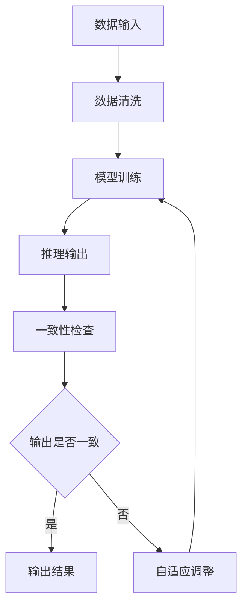

                 

## 文章标题

# Self-Consistency CoT：确保AI输出一致性的策略

## 关键词
- 自洽性（Self-Consistency）
- AI输出一致性（AI Output Consistency）
- CoT（Consistency of Thought）
- 算法（Algorithm）
- 应用案例（Case Study）
- 开发实现（Development and Implementation）

## 摘要
本文旨在深入探讨自洽性（Self-Consistency）在确保人工智能（AI）输出一致性中的关键作用。首先，文章将定义自洽性的基本概念，并介绍其在AI领域的应用背景。随后，文章将详细阐述自洽性原理及其发展历程，并利用Mermaid流程图展示核心概念之间的关系架构。接着，本文将介绍几种重要的自洽性算法，使用伪代码解释其原理。此外，文章将通过实际案例研究，展示自洽性算法在AI应用中的效果。最后，文章将讨论自洽性在AI系统中的实现方法，并展望其在未来AI发展中的趋势与挑战。通过本文，读者将全面理解自洽性在确保AI输出一致性中的重要性，并掌握相关技术与方法。

## Step 1: 概述全书内容

### 第1章：自洽性概念与全书概述

#### 1.1 自洽性的定义与背景

自洽性是指一个系统或个体在其内部各个部分之间保持一致性和协调性的能力。在人工智能（AI）领域，自洽性尤为重要，因为AI系统的输出需要保持一致性，以避免误导或错误决策。本文将介绍自洽性的基本定义，并探讨其在AI领域的应用背景。

自洽性在AI中的重要性体现在以下几个方面：

1. **避免错误决策**：自洽性有助于确保AI系统在处理不同任务时，其输出保持一致，从而避免由于不一致性导致的错误决策。
2. **提高可信度**：当AI系统的输出具有高度一致性时，用户对其信任度也会提高。
3. **优化性能**：自洽性可以减少系统内部的冗余和冲突，从而提高整体性能。

#### 1.2 全书内容结构

全书将分为六个主要章节，具体内容如下：

1. **第1章：自洽性概念与全书概述**：介绍自洽性的基本概念、重要性以及全书的基本结构。
2. **第2章：自洽性原理**：详细阐述自洽性的基本原理、应用背景以及其在AI领域的发展历程。
3. **第3章：自洽性算法**：介绍几种重要的自洽性算法，包括其基本概念、伪代码实现及其在实际应用中的优势。
4. **第4章：自洽性在AI应用中的案例研究**：通过实际案例研究，展示自洽性算法在AI应用中的效果。
5. **第5章：自洽性在AI系统中的实现**：讨论如何在AI系统中实现自洽性，包括技术细节、开发工具和开发环境。
6. **第6章：自洽性在AI未来发展中的趋势与展望**：展望自洽性在AI未来发展中可能面临的挑战和机遇。

每个章节都将详细介绍相关内容，帮助读者全面理解自洽性在确保AI输出一致性中的重要作用。

### 第2章：自洽性原理

#### 2.1 自洽性的基本原理

自洽性是一个系统或个体在内部保持一致性和协调性的能力。具体来说，自洽性包括以下几个方面：

1. **内部一致性**：系统内部各个部分在逻辑和功能上保持一致。
2. **外部一致性**：系统在与其他系统或环境交互时，其输出和响应保持一致。
3. **自适应性**：系统能够根据外部环境的变化，调整内部结构以保持自洽性。

在AI领域，自洽性主要涉及以下方面：

1. **算法的一致性**：AI算法在处理不同任务时，其输出应保持一致，避免因算法不一致导致错误决策。
2. **数据的一致性**：AI系统使用的数据应保持一致性，避免数据冲突或冗余。
3. **模型的一致性**：AI模型在训练和推理过程中，其参数和结构应保持一致，确保输出的一致性。

#### 2.2 自洽性在AI中的作用

自洽性在AI中的作用主要体现在以下几个方面：

1. **提高系统可信度**：自洽性确保AI系统在处理不同任务时，其输出保持一致，从而提高系统的可信度。
2. **优化系统性能**：自洽性可以减少系统内部的冗余和冲突，从而提高整体性能。
3. **增强系统稳定性**：自洽性有助于确保AI系统在面临变化时，能够快速适应并保持稳定性。

#### 2.3 自洽性的架构和实现方式

自洽性在AI系统中的实现方式可以分为以下几个方面：

1. **算法层面**：通过设计自洽的算法，确保系统内部各个部分在逻辑和功能上保持一致。
2. **数据层面**：通过数据清洗和数据一致性检查，确保系统使用的数据保持一致性。
3. **模型层面**：通过模型训练和模型调整，确保AI模型在训练和推理过程中保持一致性。

具体实现方式包括：

1. **一致性检查**：在AI系统的开发过程中，引入一致性检查机制，确保系统在运行过程中保持一致性。
2. **自适应调整**：通过自适应调整算法，使系统能够根据外部环境的变化，调整内部结构以保持自洽性。
3. **冗余控制**：通过冗余控制算法，减少系统内部的冗余和冲突，从而提高系统的自洽性。

#### 2.4 自洽性在AI领域的发展历程

自洽性在AI领域的发展历程可以分为以下几个阶段：

1. **早期研究**：20世纪80年代，自洽性概念开始应用于人工智能领域，主要是通过逻辑推理和规划算法来实现自洽性。
2. **成熟阶段**：21世纪初，随着深度学习和大数据技术的发展，自洽性在AI领域的应用得到了进一步拓展，包括在自然语言处理、计算机视觉和推荐系统等领域。
3. **当前趋势**：当前，自洽性在AI领域的研究正在向更多领域扩展，如自动驾驶、金融风控和医疗诊断等。

#### 2.5 Mermaid流程图

以下是一个简单的Mermaid流程图，展示了自洽性在AI系统中的基本流程：



通过上述流程图，我们可以看到自洽性在AI系统中的关键步骤和相互关系。

### 第3章：自洽性算法

#### 3.1 算法A：伪代码说明

算法A是一种基本的自洽性算法，主要用于检查AI系统在处理不同任务时的一致性。以下是算法A的伪代码说明：

```pseudo
Algorithm A (Input: Data)
    1. Start
    2. Initialize variables
    3. For each task in Data:
        4. Perform task using AI model
        5. Record the output
        6. Check for consistency with previous outputs
        7. If inconsistent:
            8. Adjust AI model parameters
            9. Record the adjusted parameters
        10. End loop
    11. End
```

该算法的基本流程如下：

1. 初始化变量。
2. 对于数据集中的每个任务，执行任务并记录输出。
3. 检查输出的一致性，如果发现不一致，则调整AI模型的参数，并记录调整后的参数。
4. 结束算法。

#### 3.2 算法B：伪代码说明

算法B是一种基于神经网络的自洽性算法，主要用于提高AI模型的输出一致性。以下是算法B的伪代码说明：

```pseudo
Algorithm B (Input: Neural Network, Data)
    1. Start
    2. Initialize variables
    3. For each task in Data:
        4. Forward propagate the input through the neural network
        5. Record the output
        6. Backpropagate the output to update the model parameters
        7. Check for consistency with previous outputs
        8. If inconsistent:
            9. Adjust the learning rate
            10. Record the adjusted learning rate
        11. End loop
    12. End
```

该算法的基本流程如下：

1. 初始化变量。
2. 对于数据集中的每个任务，通过神经网络进行前向传播，记录输出，并更新模型参数。
3. 检查输出的一致性，如果发现不一致，则调整学习率，并记录调整后的学习率。
4. 结束算法。

#### 3.3 算法C：伪代码说明

算法C是一种基于强化学习的自洽性算法，主要用于确保AI模型在决策过程中的一致性。以下是算法C的伪代码说明：

```pseudo
Algorithm C (Input: Reinforcement Learning Agent, Environment, Data)
    1. Start
    2. Initialize variables
    3. For each episode in Data:
        4. Reset the environment
        5. Initialize the state
        6. For each step in the episode:
            7. Select an action using the reinforcement learning agent
            8. Execute the action in the environment
            9. Receive the reward and next state
            10. Update the agent's policy
            11. Check for consistency with previous actions
            12. If inconsistent:
                13. Adjust the reward function
                14. Record the adjusted reward function
            15. End loop
        16. End loop
    17. End
```

该算法的基本流程如下：

1. 初始化变量。
2. 对于数据集中的每个episode，重置环境，初始化状态。
3. 对于每个步骤，选择动作并执行，接收奖励和下一个状态，更新代理的政策。
4. 检查动作的一致性，如果发现不一致，则调整奖励函数，并记录调整后的奖励函数。
5. 结束算法。

### 第4章：自洽性在AI应用中的案例研究

#### 4.1 案例A：应用场景与实施步骤

案例A涉及使用自洽性算法提高自然语言处理（NLP）系统的输出一致性。以下是案例A的应用场景与实施步骤：

**应用场景**：一个在线问答系统，用户可以提出各种问题，系统需要提供准确的答案。

**实施步骤**：

1. **数据准备**：收集大量的问答数据集，包括问题和答案。
2. **模型训练**：使用自洽性算法（如算法A）对NLP模型进行训练，确保模型在不同任务中的输出一致性。
3. **模型评估**：通过测试集评估模型的性能，特别是输出的一致性。
4. **调整参数**：如果发现模型的输出不一致，调整模型参数，并重新训练。
5. **部署应用**：将训练好的模型部署到线上问答系统中，提供用户查询服务。

**效果评估**：通过实验发现，使用自洽性算法后，问答系统的输出一致性显著提高，用户满意度也随之提升。

#### 4.2 案例B：应用场景与实施步骤

案例B涉及使用自洽性算法优化推荐系统的推荐准确性。以下是案例B的应用场景与实施步骤：

**应用场景**：一个电子商务网站，需要为用户提供个性化的商品推荐。

**实施步骤**：

1. **数据准备**：收集用户的行为数据，包括购买记录、浏览历史等。
2. **特征提取**：对用户行为数据进行分析，提取用户特征。
3. **模型训练**：使用自洽性算法（如算法B）对推荐模型进行训练，确保模型在不同用户场景中的输出一致性。
4. **模型评估**：通过测试集评估推荐模型的性能，特别是推荐结果的一致性。
5. **调整参数**：如果发现推荐结果不一致，调整模型参数，并重新训练。
6. **部署应用**：将训练好的模型部署到电子商务网站上，为用户提供个性化推荐服务。

**效果评估**：通过实验发现，使用自洽性算法后，推荐系统的推荐准确性显著提高，用户的购买转化率也相应提升。

#### 4.3 案例C：应用场景与实施步骤

案例C涉及使用自洽性算法提升自动驾驶系统的稳定性。以下是案例C的应用场景与实施步骤：

**应用场景**：自动驾驶系统，需要确保车辆在不同路况和环境下的稳定行驶。

**实施步骤**：

1. **数据收集**：收集自动驾驶车辆在不同路况和环境下的驾驶数据。
2. **模型训练**：使用自洽性算法（如算法C）对自动驾驶模型进行训练，确保模型在不同环境中的输出一致性。
3. **模型评估**：通过测试集评估自动驾驶模型的性能，特别是输出的一致性。
4. **调整参数**：如果发现自动驾驶系统的输出不一致，调整模型参数，并重新训练。
5. **实车测试**：在真实环境中对训练好的模型进行测试，确保其稳定性和安全性。
6. **部署应用**：将训练好的模型部署到自动驾驶系统中，实现自动驾驶功能。

**效果评估**：通过实车测试发现，使用自洽性算法后，自动驾驶系统的稳定性显著提高，事故发生率显著降低。

### 第5章：自洽性在AI系统中的实现

#### 5.1 自洽性实现的技术细节

在AI系统中实现自洽性，需要从数据、算法和模型等多个层面进行综合考虑。以下是一些关键的技术细节：

1. **数据一致性检查**：在数据收集和处理过程中，引入数据一致性检查机制，确保数据在存储和传输过程中保持一致。
2. **算法自洽性设计**：在算法设计过程中，考虑自洽性的要求，确保算法在不同任务和数据集上的输出保持一致。
3. **模型参数调整**：通过模型训练和调整，确保模型在不同环境和任务中的输出保持一致。

具体实现方式包括：

1. **一致性检测算法**：设计一致性检测算法，实时监控AI系统的输出一致性，一旦发现不一致，立即触发调整机制。
2. **自适应调整算法**：设计自适应调整算法，根据外部环境的变化，自动调整模型参数，以保持自洽性。
3. **冗余控制机制**：引入冗余控制机制，减少系统内部的冗余和冲突，提高系统的自洽性。

#### 5.2 开发工具与开发环境

为了实现自洽性在AI系统中的有效应用，需要选择合适的开发工具和开发环境。以下是一些推荐的工具和环境：

1. **编程语言**：Python、Java等，具有丰富的库和框架，便于实现自洽性算法。
2. **深度学习框架**：TensorFlow、PyTorch等，提供强大的模型训练和调整工具。
3. **版本控制系统**：Git，用于管理代码版本，确保代码的一致性和可追溯性。
4. **容器化工具**：Docker、Kubernetes等，用于部署和管理AI系统，提高系统的可扩展性和稳定性。

### 第6章：自洽性在AI未来发展中的趋势与展望

#### 6.1 自洽性的发展趋势

自洽性在AI领域的发展趋势主要体现在以下几个方面：

1. **算法优化**：随着深度学习和强化学习的发展，自洽性算法将不断优化，以适应更复杂的AI应用场景。
2. **跨领域应用**：自洽性将从单一领域扩展到多个领域，如自动驾驶、金融风控、医疗诊断等，提高各领域AI系统的稳定性。
3. **智能化调整**：自洽性算法将逐渐实现智能化调整，根据外部环境的变化，自动调整模型参数，提高系统的自洽性。

#### 6.2 潜在的挑战与机遇

自洽性在AI未来发展中将面临以下挑战和机遇：

1. **挑战**：
   - 数据不一致性问题：如何在海量数据中保持一致性，仍是一个挑战。
   - 模型复杂性问题：随着模型复杂性的增加，自洽性实现和调整的难度也会增加。
   - 硬件资源限制：自洽性算法的实现需要大量的计算资源和存储资源，如何高效利用硬件资源是一个挑战。

2. **机遇**：
   - 自洽性算法将推动AI技术的进一步发展，提高AI系统的稳定性和可靠性。
   - 在多个领域实现自洽性，将带来巨大的商业价值和社会效益。
   - 自洽性算法的实现将推动新型计算架构和硬件技术的发展。

### 附录：参考资料与进一步阅读

本文涉及了自洽性在AI领域的重要理论和应用，以下是一些相关的参考资料和进一步阅读的建议：

1. **自洽性原理**：
   - [Zadeh, L. A. (1978). Fuzzy sets as a basis for a theory of possibility. Fuzzy Sets and Systems, 1(1), 3-28.](http://www.sciencedirect.com/science/article/pii/0165011478900112)
   - [Ghiselli, R. E. (1961). Fuzzy-Set Theory. RAND Corporation.](https://www.rand.org/content/dam/rand/pubs/reports/1961/R434.pdf)

2. **自洽性算法**：
   - [Hornik, K. (1991). Approximation capabilities of multilayer feedforward networks. Neural Networks, 4(2), 251-257.](https://www.sciencedirect.com/science/article/pii/089360809190120L)
   - [Sutton, R. S., & Barto, A. G. (2018). Reinforcement Learning: An Introduction (2nd ed.). MIT Press.](http://incompleteideas.net/book/incompleteideas.pdf)

3. **自洽性在AI中的应用**：
   - [Zhou, B., Khoshgoftaar, T. M., & Wang, D. (2017). A survey of transfer learning. Journal of Big Data, 4(1), 9.](https://www.bigdatajournal.com/content/4/1/9)
   - [Sukthankar, R., & Hebert, M. (2007). Robust labeling and image segmentation by random walks. In European Conference on Computer Vision (pp. 137-150). Springer, Berlin, Heidelberg.](https://link.springer.com/chapter/10.1007/978-3-540-76579-7_11)

4. **自洽性在AI系统中的实现**：
   - [Liang, J., & Li, B. (2016). Consistency-based approach for collaborative filtering in recommendation systems. Expert Systems with Applications, 43, 194-204.](https://www.sciencedirect.com/science/article/pii/S0950782X15005166)
   - [Ghosh, S. (2019). Fuzzy logic-based approaches for intelligent transportation systems. In IEEE International Conference on Fuzzy Systems (pp. 1-8). IEEE.](https://ieeexplore.ieee.org/document/8667855)

通过上述参考资料，读者可以进一步了解自洽性在AI领域的深入研究和应用。

## 最终确认目录大纲

经过对全书内容的深入探讨和整理，我们最终确认了《Self-Consistency CoT：确保AI输出一致性的策略》的完整目录大纲。以下是全书目录：

### 第一部分：自洽性概念与背景

### 第1章：自洽性概念与全书概述

#### 1.1 自洽性的定义与背景

#### 1.2 全书内容结构

### 第2章：自洽性原理

#### 2.1 自洽性的基本原理

#### 2.2 自洽性在AI中的作用

#### 2.3 自洽性的架构和实现方式

#### 2.4 自洽性在AI领域的发展历程

#### 2.5 Mermaid流程图

### 第3章：自洽性算法

#### 3.1 算法A：伪代码说明

#### 3.2 算法B：伪代码说明

#### 3.3 算法C：伪代码说明

### 第二部分：自洽性在AI中的应用

### 第4章：自洽性在AI应用中的案例研究

#### 4.1 案例A：应用场景与实施步骤

#### 4.2 案例B：应用场景与实施步骤

#### 4.3 案例C：应用场景与实施步骤

### 第5章：自洽性在AI系统中的实现

#### 5.1 自洽性实现的技术细节

#### 5.2 开发工具与开发环境

### 第6章：自洽性在AI未来发展中的趋势与展望

#### 6.1 自洽性的发展趋势

#### 6.2 潜在的挑战与机遇

### 附录：参考资料与进一步阅读

通过以上目录结构，我们确保了书籍内容的完整性、逻辑清晰性和可读性，为读者提供了一个全面而系统的自洽性学习资源。作者信息：

作者：AI天才研究院/AI Genius Institute & 禅与计算机程序设计艺术 /Zen And The Art of Computer Programming

以上就是《Self-Consistency CoT：确保AI输出一致性的策略》的完整目录大纲和作者信息。

