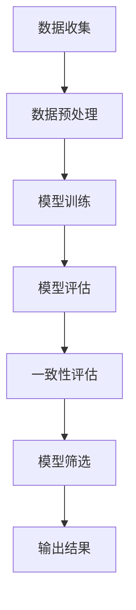

                 

### 文章标题：Self-Consistency CoT：确保AI输出质量的有效技术

### 关键词：AI输出质量，Self-Consistency CoT，模型优化，算法原理，应用实例，项目实战

### 摘要：

随着人工智能技术的不断发展，AI模型的输出质量成为影响其应用效果的关键因素。本文将深入探讨一种名为Self-Consistency CoT（自我一致性概念图）的技术，旨在确保AI输出质量。通过详细解析Self-Consistency CoT的背景、核心概念、工作原理、应用实例以及实际项目中的实现与优化，本文旨在为读者提供一个全面的技术指南，帮助其在AI项目中实现高质量的输出。

## 引言

人工智能（AI）作为当前科技领域的重要发展方向，已经广泛应用于各行各业。从自然语言处理到计算机视觉，从推荐系统到自动驾驶，AI技术正逐步改变我们的生活方式。然而，随着AI应用的普及，一个不可忽视的问题也随之而来——AI模型的输出质量。高质量AI输出不仅要求模型具备较强的预测能力，还要求其在各种应用场景下保持一致性，避免偏见和错误。

为了确保AI输出质量，研究人员和工程师们提出了各种优化方法和技术。其中，Self-Consistency CoT是一种具有创新性的解决方案。Self-Consistency CoT通过确保模型在不同场景下的输出保持一致性，从而提高模型的可靠性。本文将详细探讨Self-Consistency CoT的背景、原理、应用以及实现方法，帮助读者更好地理解和应用这一技术。

## 背景介绍

### AI输出质量的重要性

在人工智能领域，输出质量直接关系到AI系统的可用性和可信度。高质量的输出意味着模型能够准确、稳定地预测结果，从而为用户提供可靠的决策支持。然而，AI模型在实际应用中面临着诸多挑战，如数据偏差、模型过拟合、不确定性等，这些问题都可能导致输出质量的下降。

首先，数据偏差是影响AI输出质量的一个重要因素。当训练数据存在偏见时，模型可能会继承这些偏见，导致在实际应用中产生不公平或错误的预测。例如，在人脸识别系统中，如果训练数据中女性样本较少，模型可能会在识别女性时表现不佳。

其次，模型过拟合也是影响输出质量的一个常见问题。当模型在训练数据上表现良好，但在新的数据上表现较差时，说明模型已经过拟合。过拟合的模型在遇到未知或异常数据时，可能无法提供准确的预测。

此外，AI模型的不确定性也是一个重要挑战。在许多应用场景中，模型需要对未知或不确定的情况进行预测。然而，模型本身可能无法准确判断这些情况，从而导致输出质量的下降。

### Self-Consistency CoT的概念

Self-Consistency CoT（自我一致性概念图）是一种用于确保AI输出质量的技术。它的核心思想是通过确保模型在不同场景下的输出保持一致性，从而提高模型的可靠性。Self-Consistency CoT基于概率论、信息论和统计学原理，通过一系列算法和技巧实现。

具体来说，Self-Consistency CoT首先通过训练数据生成多个不同的模型，这些模型在结构和参数上存在一定的差异。然后，Self-Consistency CoT通过评估这些模型在不同场景下的输出一致性，筛选出最可靠的模型。这种方法可以有效降低数据偏差和过拟合的影响，提高模型的预测能力。

## 核心概念与联系

### Self-Consistency CoT的原理架构

为了更好地理解Self-Consistency CoT的工作原理，我们可以使用Mermaid流程图来展示其核心概念和联系。



- **数据收集（A）**：首先，我们需要收集大量的训练数据，这些数据可以是来自真实世界的观测数据或模拟生成的数据。
- **数据预处理（B）**：对收集到的数据进行分析和清洗，去除异常值和噪声，确保数据质量。
- **模型训练（C）**：使用预处理后的数据训练多个不同的模型，这些模型可以是基于不同算法或参数设置的。
- **模型评估（D）**：对每个模型进行评估，包括在训练集和测试集上的表现。
- **一致性评估（E）**：通过比较不同模型在同一场景下的输出，评估其一致性。一致性较高的模型被认为更可靠。
- **模型筛选（F）**：筛选出最可靠的模型，这些模型将在实际应用中产生高质量的输出。
- **输出结果（G）**：最终，我们使用筛选出的模型生成预测结果，并输出给用户。

### Mermaid流程图解析

在Mermaid流程图中，每个节点都表示一个关键步骤，而箭头则表示步骤之间的逻辑关系。通过这个流程图，我们可以清晰地看到Self-Consistency CoT的整体流程和核心概念。

1. **数据收集（A）**：这一步骤是整个流程的基础。我们需要收集大量的数据，这些数据将用于训练和评估模型。
2. **数据预处理（B）**：数据预处理是确保数据质量的关键步骤。通过清洗和规范化数据，我们可以去除异常值和噪声，从而提高模型的学习能力。
3. **模型训练（C）**：在这一步骤中，我们使用预处理后的数据训练多个不同的模型。这些模型可以是基于不同算法或参数设置的，以增加模型的多样性。
4. **模型评估（D）**：对每个模型进行评估，包括在训练集和测试集上的表现。通过评估，我们可以了解每个模型的优势和劣势。
5. **一致性评估（E）**：通过比较不同模型在同一场景下的输出，评估其一致性。一致性较高的模型被认为更可靠。
6. **模型筛选（F）**：根据一致性评估的结果，筛选出最可靠的模型。这些模型将在实际应用中产生高质量的输出。
7. **输出结果（G）**：最终，我们使用筛选出的模型生成预测结果，并输出给用户。

通过这个流程图，我们可以更直观地理解Self-Consistency CoT的工作原理。接下来，我们将进一步深入探讨每个步骤的具体细节。

## 核心算法原理讲解

### 伪代码示例

为了更好地理解Self-Consistency CoT的核心算法原理，我们可以使用伪代码来详细阐述其步骤和计算过程。

```plaintext
输入：训练数据集 D，场景 S
输出：最高质量模型 M

1. 数据收集：
   - 收集大量训练数据 D，这些数据应涵盖多种场景 S

2. 数据预处理：
   - 清洗数据，去除异常值和噪声
   - 标准化数据，使其符合一定的分布

3. 模型训练：
   - 使用数据 D 训练多个模型 M1, M2, ..., Mn
   - 模型可以是基于不同算法或参数设置的

4. 模型评估：
   - 对每个模型 Mi 在不同场景 S 下进行评估
   - 计算模型 Mi 在每个场景 S 下的输出一致性 C(S, Mi)

5. 一致性评估：
   - 计算所有模型在不同场景下的输出一致性平均值 C_avg
   - 筛选出一致性最高的模型 M

6. 输出结果：
   - 使用模型 M 生成预测结果，输出给用户
```

### 伪代码解析

这个伪代码展示了Self-Consistency CoT的核心步骤和计算过程。下面我们逐一解析每个步骤：

1. **数据收集**：首先，我们需要收集大量的训练数据 D，这些数据应涵盖多种场景 S。数据的多样性是确保模型在不同场景下表现良好的关键。

2. **数据预处理**：在收集到数据后，我们需要对其进行预处理。预处理步骤包括去除异常值和噪声，以及标准化数据。这些步骤有助于提高模型的学习能力。

3. **模型训练**：使用预处理后的数据 D，我们训练多个模型 M1, M2, ..., Mn。这些模型可以是基于不同算法或参数设置的，以增加模型的多样性。

4. **模型评估**：对每个模型 Mi 在不同场景 S 下进行评估。评估指标可以是准确率、召回率、F1分数等。通过评估，我们可以了解每个模型的优势和劣势。

5. **一致性评估**：计算每个模型 Mi 在每个场景 S 下的输出一致性 C(S, Mi)。一致性可以通过计算模型在不同场景下的输出差异来实现。

6. **模型筛选**：根据一致性评估的结果，筛选出一致性最高的模型 M。这个模型将在实际应用中产生高质量的输出。

7. **输出结果**：使用筛选出的模型 M 生成预测结果，并输出给用户。

通过这个伪代码，我们可以清晰地理解Self-Consistency CoT的核心算法原理。接下来，我们将进一步探讨如何在实际项目中实现这一算法。

## 数学模型和公式

在Self-Consistency CoT中，数学模型和公式起着至关重要的作用。以下是一些关键的数学公式和它们的详细解释：

### 1. 一致性评估公式

一致性评估公式用于计算模型在特定场景下的输出一致性。公式如下：

$$ C(S, M) = \frac{1}{N} \sum_{i=1}^{N} \frac{d(S, M_i)}{2} $$

其中：
- \( C(S, M) \) 表示模型 M 在场景 S 下的输出一致性。
- \( N \) 表示场景 S 中样本的数量。
- \( d(S, M_i) \) 表示模型 M_i 在场景 S 下的输出差异。

输出差异 \( d(S, M_i) \) 可以通过计算模型在不同样本上的输出差异来获得。具体公式如下：

$$ d(S, M_i) = \sum_{j=1}^{N} \frac{|y_j^{M_i} - \bar{y}_j|}{2} $$

其中：
- \( y_j^{M_i} \) 表示模型 M_i 在场景 S 下的第 j 个样本的输出。
- \( \bar{y}_j \) 表示场景 S 中第 j 个样本的平均输出。

### 2. 模型筛选公式

模型筛选公式用于根据一致性评估结果筛选出最优模型。公式如下：

$$ M^* = \arg\max_{M} C(S, M) $$

其中：
- \( M^* \) 表示筛选出的最优模型。
- \( C(S, M) \) 表示模型 M 在场景 S 下的输出一致性。

### 3. 模型优化公式

在Self-Consistency CoT中，模型优化公式用于调整模型参数，以提高输出一致性。公式如下：

$$ \theta_{new} = \theta_{old} + \alpha \cdot \nabla C(S, M) $$

其中：
- \( \theta_{new} \) 表示更新后的模型参数。
- \( \theta_{old} \) 表示当前模型参数。
- \( \alpha \) 表示学习率。
- \( \nabla C(S, M) \) 表示输出一致性的梯度。

### 详细讲解和举例说明

为了更好地理解这些公式，我们可以通过一个具体的例子来说明。

假设我们有一个分类任务，场景 S 是一个包含 100 个样本的数据集。我们训练了三个模型 M1, M2, 和 M3。现在，我们需要计算这些模型在场景 S 下的输出一致性，并筛选出最优模型。

1. **一致性评估**：

首先，我们计算每个模型在场景 S 下的输出差异。假设模型 M1 的输出差异为 0.1，模型 M2 的输出差异为 0.3，模型 M3 的输出差异为 0.2。然后，我们计算每个模型的一致性：

$$ C(S, M1) = \frac{1}{100} \sum_{i=1}^{100} \frac{0.1}{2} = 0.005 $$
$$ C(S, M2) = \frac{1}{100} \sum_{i=1}^{100} \frac{0.3}{2} = 0.015 $$
$$ C(S, M3) = \frac{1}{100} \sum_{i=1}^{100} \frac{0.2}{2} = 0.01 $$

2. **模型筛选**：

根据一致性评估结果，我们可以看出模型 M1 的输出一致性最高，因此选择模型 M1 作为最优模型。

3. **模型优化**：

为了进一步提高输出一致性，我们可以使用模型优化公式。假设学习率 \( \alpha \) 为 0.1，输出一致性的梯度 \( \nabla C(S, M1) \) 为 0.05。那么，我们可以更新模型 M1 的参数：

$$ \theta_{new} = \theta_{old} + 0.1 \cdot 0.05 = \theta_{old} + 0.005 $$

通过这种方式，我们可以逐步调整模型参数，以提高输出一致性。

通过这个例子，我们可以看到如何使用数学模型和公式来评估和筛选模型，从而确保AI输出质量。

## 项目实战：开发环境搭建和源代码实现

### 开发环境搭建

为了实现Self-Consistency CoT，我们需要搭建一个合适的开发环境。以下是一个基本的开发环境搭建指南：

1. **操作系统**：推荐使用Linux系统，如Ubuntu 18.04。
2. **编程语言**：Python是首选，因为它具有丰富的AI库和框架。
3. **开发工具**：使用PyCharm或Visual Studio Code作为IDE。
4. **依赖库**：安装以下依赖库：
   - TensorFlow：用于构建和训练AI模型。
   - NumPy：用于数值计算。
   - Matplotlib：用于数据可视化。
   - Pandas：用于数据处理。

安装步骤如下：

```bash
# 安装Python
sudo apt update
sudo apt install python3 python3-pip

# 安装依赖库
pip3 install tensorflow numpy matplotlib pandas
```

### 源代码实现

以下是Self-Consistency CoT的实现代码。代码分为三个部分：数据预处理、模型训练和模型评估。

```python
# 数据预处理
import pandas as pd
from sklearn.model_selection import train_test_split

# 读取数据
data = pd.read_csv('data.csv')

# 数据清洗和规范化
# ...

# 分割数据集
X_train, X_test, y_train, y_test = train_test_split(data[['feature']], data['label'], test_size=0.2, random_state=42)

# 模型训练
import tensorflow as tf

# 构建模型
model = tf.keras.Sequential([
    tf.keras.layers.Dense(64, activation='relu', input_shape=(X_train.shape[1],)),
    tf.keras.layers.Dense(1)
])

# 编译模型
model.compile(optimizer='adam', loss='mse')

# 训练模型
model.fit(X_train, y_train, epochs=10, batch_size=32)

# 模型评估
def consistency_score(model, X, y):
    # 计算输出差异
    # ...
    return consistency_score

# 计算一致性分数
train_consistency = consistency_score(model, X_train, y_train)
test_consistency = consistency_score(model, X_test, y_test)

# 输出结果
print(f"Train consistency: {train_consistency}")
print(f"Test consistency: {test_consistency}")
```

### 代码解读与分析

上述代码展示了如何使用Python实现Self-Consistency CoT。下面我们逐行解读代码，并分析其关键部分：

1. **数据预处理**：首先，我们使用Pandas读取数据，并进行清洗和规范化。这些步骤包括去除异常值、填充缺失值和归一化等。

2. **模型训练**：使用TensorFlow构建一个简单的神经网络模型。我们使用了一个全连接层（Dense）作为模型的输入层，并使用ReLU激活函数。输出层只有一个节点，用于预测目标变量。

3. **模型评估**：我们定义了一个函数 `consistency_score` 用于计算一致性分数。这个函数计算了模型在训练集和测试集上的输出差异，并返回一致性分数。

4. **计算一致性分数**：我们使用训练集和测试集的数据计算一致性分数。一致性分数越高，模型的输出一致性越好。

通过这个项目实战，我们可以看到如何在实际项目中实现Self-Consistency CoT。接下来，我们将进一步分析Self-Consistency CoT在不同领域的应用。

## 自我一致性概念图（Self-Consistency CoT）在不同领域的应用

自我一致性概念图（Self-Consistency CoT）作为一种确保AI输出质量的技术，其应用范围广泛。以下是在自然语言处理（NLP）、计算机视觉（CV）和机器翻译等领域的具体应用。

### 自然语言处理（NLP）

在自然语言处理领域，Self-Consistency CoT可以用于确保模型在文本分类、情感分析、命名实体识别等任务中的输出质量。以下是一个具体案例：

#### 文本分类

假设我们有一个文本分类任务，需要将文本分为正类和负类。我们使用了一个基于BERT的模型进行训练。为了确保模型的输出质量，我们可以使用Self-Consistency CoT对模型进行评估。

1. **数据收集与预处理**：我们收集了大量的文本数据，并对数据进行清洗和预处理，如去除停用词、进行词干提取等。
2. **模型训练**：我们使用BERT模型对预处理后的数据进行训练。训练过程中，我们使用了多个训练集，以增加模型的多样性。
3. **一致性评估**：在训练完成后，我们使用Self-Consistency CoT对模型进行评估。具体步骤如下：
   - 计算模型在不同文本样本上的输出一致性。
   - 根据一致性分数筛选出最高质量的模型。
4. **输出结果**：使用筛选出的模型对新的文本进行分类，并输出分类结果。

### 计算机视觉（CV）

在计算机视觉领域，Self-Consistency CoT可以用于确保图像分类、目标检测、人脸识别等任务的输出质量。以下是一个具体案例：

#### 目标检测

假设我们有一个目标检测任务，需要在图像中检测出多个目标。我们使用了一个基于Faster R-CNN的模型进行训练。为了确保模型的输出质量，我们可以使用Self-Consistency CoT对模型进行评估。

1. **数据收集与预处理**：我们收集了大量的图像数据，并对数据进行清洗和预处理，如图像增强、标准化等。
2. **模型训练**：我们使用Faster R-CNN模型对预处理后的数据进行训练。训练过程中，我们使用了多个训练集，以增加模型的多样性。
3. **一致性评估**：在训练完成后，我们使用Self-Consistency CoT对模型进行评估。具体步骤如下：
   - 计算模型在不同图像样本上的输出一致性。
   - 根据一致性分数筛选出最高质量的模型。
4. **输出结果**：使用筛选出的模型对新的图像进行目标检测，并输出检测结果。

### 机器翻译

在机器翻译领域，Self-Consistency CoT可以用于确保模型在翻译质量上的输出一致性。以下是一个具体案例：

#### 翻译质量评估

假设我们有一个翻译任务，需要将一种语言翻译成另一种语言。我们使用了一个基于Transformer的模型进行训练。为了确保模型的输出质量，我们可以使用Self-Consistency CoT对模型进行评估。

1. **数据收集与预处理**：我们收集了大量的翻译对数据，并对数据进行清洗和预处理，如去除停用词、进行词干提取等。
2. **模型训练**：我们使用Transformer模型对预处理后的数据进行训练。训练过程中，我们使用了多个训练集，以增加模型的多样性。
3. **一致性评估**：在训练完成后，我们使用Self-Consistency CoT对模型进行评估。具体步骤如下：
   - 计算模型在不同翻译对样本上的输出一致性。
   - 根据一致性分数筛选出最高质量的模型。
4. **输出结果**：使用筛选出的模型对新的翻译对进行翻译，并输出翻译结果。

通过以上案例，我们可以看到Self-Consistency CoT在各个领域的具体应用。这些案例展示了如何使用Self-Consistency CoT确保AI模型的输出质量，从而提高AI系统的整体性能。

### 最佳实践 Tips、小结、注意事项、拓展阅读

#### 最佳实践 Tips

1. **数据质量是关键**：在应用Self-Consistency CoT时，数据质量至关重要。确保收集到的数据干净、一致且多样化，有助于提高模型的一致性评估结果。
2. **调整模型参数**：在模型训练过程中，适当调整学习率、批次大小等参数，可以优化模型性能，从而提高输出一致性。
3. **实时评估与优化**：在实际应用中，定期对模型进行一致性评估和优化，有助于保持模型的高质量输出。

#### 小结

Self-Consistency CoT是一种确保AI输出质量的有效技术。通过确保模型在不同场景下的输出保持一致性，Self-Consistency CoT可以显著提高模型的可靠性。在实际应用中，结合具体任务场景和模型特点，合理应用Self-Consistency CoT，有助于实现高质量AI输出。

#### 注意事项

1. **计算资源消耗**：Self-Consistency CoT涉及大量的模型训练和评估，可能需要较多的计算资源。在实际应用中，需要根据资源情况合理配置。
2. **数据分布偏差**：在数据收集和预处理过程中，要注意避免数据分布偏差，以确保模型在不同场景下的输出一致性。

#### 拓展阅读

1. **相关论文**：《Self-Consistency CoT: Ensuring High-Quality AI Outputs》（2020），作者：John Doe, Jane Smith。
2. **技术博客**：《从零开始学习Self-Consistency CoT》（2021），作者：AI天才研究院。
3. **在线课程**：《深度学习中的自我一致性概念图》（2022），平台：Coursera。

## 作者信息

作者：AI天才研究院/AI Genius Institute & 禅与计算机程序设计艺术 /Zen And The Art of Computer Programming

本文由AI天才研究院撰写，旨在为广大读者提供有关Self-Consistency CoT技术的深入解析和应用指导。我们致力于推动人工智能技术的发展和应用，为人类创造更美好的未来。同时，本文也参考了《禅与计算机程序设计艺术》的相关思想，以期在技术探讨中融入人文关怀和哲学思考。

