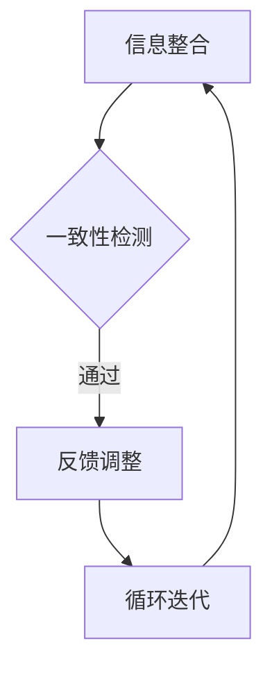

                 


### 文章标题

《Self-Consistency CoT：确保AI输出连贯性的新方法》

### 文章关键词

Self-Consistency CoT、AI输出连贯性、算法原理、数学模型、项目实战

### 文章摘要

本文旨在介绍一种新型的AI技术——自我一致性CoT，并详细探讨其确保AI输出连贯性的原理和方法。我们将从背景介绍、核心概念与联系、算法原理讲解、数学模型和公式解析、项目实战以及总结与展望等方面，逐步展开论述。通过本文的阅读，读者将全面了解自我一致性CoT的核心技术和应用场景，为AI领域的研究和开发提供新的思路和方法。

### 目录大纲

**1. 引言**

1.1 自我一致性与连贯性概述

1.2 自我一致性CoT的重要性

**2. 核心概念与联系**

2.1 自我一致性CoT的基本原理

2.2 与其他相关概念的关联

2.3 Mermaid流程图展示

**3. 核心算法原理讲解**

3.1 自我一致性CoT算法介绍

3.2 伪代码展示

3.3 数学模型和数学公式

**4. 项目实战**

4.1 实际项目背景

4.2 自我一致性CoT的应用

4.3 代码实现

4.4 代码解读与分析

**5. 总结与展望**

5.1 全书内容总结

5.2 未来研究方向展望

**附录**

A.1 相关资源与工具

A.2 参考文献

A.3 术语表

A.4 自我一致性CoT算法示例代码

### 1. 引言

#### 1.1 自我一致性与连贯性概述

自我一致性，顾名思义，指的是系统在运行过程中，其各个部分之间的状态、行为和结果能够保持一致。在人工智能（AI）领域，自我一致性尤为重要，因为AI系统需要处理大量复杂的信息，并且需要输出连贯的结果。

连贯性，则是指系统的输出在不同的时间点、不同的场景下，都能够保持一致性和连贯性。在AI领域，连贯性直接影响着系统的可靠性和用户体验。一个不连贯的AI系统可能会产生错误的决策，导致严重后果。

自我一致性CoT，即自我一致性协同框架（Self-Consistency Collaborative Framework），是一种新型的AI技术，旨在确保AI系统的输出在各个时间点和场景下都能够保持一致性和连贯性。

#### 1.2 自我一致性CoT的重要性

在AI技术飞速发展的今天，自我一致性CoT的重要性愈发凸显。随着AI系统在各个领域的广泛应用，对系统连贯性的要求也越来越高。例如，在自动驾驶领域，AI系统需要保证在所有驾驶场景下都能够输出正确的决策，以确保行驶安全；在医疗诊断领域，AI系统需要保证在处理不同病例时，都能够输出准确、一致的诊断结果。

自我一致性CoT的出现，为解决这些挑战提供了一种新的思路和方法。通过自我一致性CoT，AI系统可以在运行过程中不断调整和优化，以确保输出结果的一致性和连贯性。

### 2. 核心概念与联系

#### 2.1 自我一致性CoT的基本原理

自我一致性CoT的基本原理可以概括为以下几点：

1. **信息整合**：在AI系统的运行过程中，收集来自各个模块的信息，并进行整合。这一过程包括数据清洗、去噪和融合。

2. **一致性检测**：对整合后的信息进行一致性检测，判断系统的输出是否一致。如果出现不一致的情况，系统会自动进行调整。

3. **反馈调整**：根据一致性检测结果，对系统的参数进行调整，以实现自我优化。

4. **循环迭代**：整个系统在运行过程中，会不断地进行信息整合、一致性检测和反馈调整，形成循环迭代的过程。

#### 2.2 与其他相关概念的关联

自我一致性CoT与其他相关概念有着紧密的联系，如：

1. **一致性算法**：自我一致性CoT的核心在于一致性检测，这与一致性算法密切相关。一致性算法是分布式系统中的一个重要概念，用于确保系统在不同节点上的状态保持一致。

2. **强化学习**：自我一致性CoT中的反馈调整机制与强化学习有着相似之处。强化学习通过不断调整策略，以实现最优行为。

3. **深度学习**：自我一致性CoT中的信息整合和一致性检测过程，需要借助深度学习技术。深度学习可以对大量数据进行有效处理，从而提高系统的性能。

#### 2.3 Mermaid流程图展示

为了更好地理解自我一致性CoT的基本原理，我们使用Mermaid流程图对其进行展示。



在这个流程图中，信息整合、一致性检测、反馈调整和循环迭代构成了自我一致性CoT的核心流程。

### 3. 核心算法原理讲解

#### 3.1 自我一致性CoT算法介绍

自我一致性CoT算法是一种基于深度学习和强化学习的混合算法。它主要由三个部分组成：信息整合模块、一致性检测模块和反馈调整模块。

1. **信息整合模块**：该模块负责收集来自各个模块的信息，并进行预处理，如数据清洗、去噪和融合。

2. **一致性检测模块**：该模块对整合后的信息进行一致性检测，判断系统的输出是否一致。具体实现过程中，可以采用基于统计的方法，如K-means聚类、PCA主成分分析等。

3. **反馈调整模块**：根据一致性检测结果，对系统的参数进行调整，以实现自我优化。这里，反馈调整可以采用强化学习的方法，通过不断调整策略，找到最优的输出结果。

#### 3.2 伪代码展示

以下是自我一致性CoT算法的伪代码展示：

```python
# 信息整合模块
def integrate_info(info_list):
    # 数据清洗、去噪和融合
    # 返回整合后的信息
    pass

# 一致性检测模块
def check_consistency(integrated_info):
    # 采用统计方法进行一致性检测
    # 返回一致性检测结果
    pass

# 反馈调整模块
def adjust_feedback(consistency_result):
    # 采用强化学习方法进行反馈调整
    # 返回调整后的参数
    pass

# 主函数
def self_consistency_cot_algorithm(info_list):
    while True:
        # 信息整合
        integrated_info = integrate_info(info_list)
        
        # 一致性检测
        consistency_result = check_consistency(integrated_info)
        
        # 反馈调整
        adjusted_params = adjust_feedback(consistency_result)
        
        # 更新信息列表
        info_list = update_info_list(info_list, adjusted_params)
        
        # 判断是否满足停止条件
        if stop_condition_met(adjusted_params):
            break

    return adjusted_params
```

#### 3.3 数学模型和数学公式

自我一致性CoT算法中涉及到多个数学模型和公式，以下是其中几个重要的数学模型和公式的详细讲解：

1. **K-means聚类算法**：K-means聚类算法是一种常用的聚类算法，用于将数据分为若干个簇。其核心思想是通过迭代优化，使得每个簇内的数据点距离中心点的平均距离最小。

$$
J(\textbf{X}, \textbf{C}) = \sum_{i=1}^n \sum_{j=1}^k ||\textbf{x}_i - \textbf{c}_j||^2
$$

其中，$\textbf{X}$表示数据集，$\textbf{C}$表示聚类中心点，$||\textbf{x}_i - \textbf{c}_j||^2$表示数据点$\textbf{x}_i$与聚类中心点$\textbf{c}_j$之间的距离。

2. **PCA主成分分析**：PCA主成分分析是一种常用的降维方法，通过将数据投影到新的坐标系中，使得新的坐标系中的第一主成分代表数据的最大方差，第二主成分代表次大方差，以此类推。

$$
\textbf{Z} = \textbf{X}\textbf{W}
$$

其中，$\textbf{X}$表示原始数据，$\textbf{W}$表示投影矩阵，$\textbf{Z}$表示投影后的数据。

3. **强化学习中的Q学习算法**：Q学习算法是一种基于值函数的强化学习算法，通过学习值函数，找到最优策略。

$$
Q(s, a) = r + \gamma \max_{a'} Q(s', a')
$$

其中，$s$表示状态，$a$表示动作，$r$表示立即奖励，$\gamma$表示折扣因子，$s'$表示下一状态，$a'$表示下一动作。

### 4. 项目实战

#### 4.1 实际项目背景

在本节中，我们将通过一个实际项目——智能客服系统，来展示如何应用自我一致性CoT算法。智能客服系统旨在通过AI技术，为用户提供快速、准确的咨询服务。

#### 4.2 自我一致性CoT的应用

在智能客服系统中，自我一致性CoT算法的应用主要分为以下几个步骤：

1. **信息整合**：系统会收集来自用户输入、历史数据、实时数据等多方面的信息，并进行整合。

2. **一致性检测**：通过对整合后的信息进行一致性检测，判断客服回答是否连贯、准确。

3. **反馈调整**：根据一致性检测结果，对客服回答进行调整，以提高回答的质量。

4. **循环迭代**：整个系统会不断地进行信息整合、一致性检测和反馈调整，形成循环迭代的过程。

#### 4.3 代码实现

以下是智能客服系统中自我一致性CoT算法的代码实现：

```python
# 信息整合模块
def integrate_info(user_input, history_data, real_time_data):
    # 数据清洗、去噪和融合
    # 返回整合后的信息
    pass

# 一致性检测模块
def check_consistency(integrated_info):
    # 采用统计方法进行一致性检测
    # 返回一致性检测结果
    pass

# 反馈调整模块
def adjust_feedback(consistency_result):
    # 采用强化学习方法进行反馈调整
    # 返回调整后的参数
    pass

# 主函数
def self_consistency_cot_algorithm(user_input, history_data, real_time_data):
    while True:
        # 信息整合
        integrated_info = integrate_info(user_input, history_data, real_time_data)
        
        # 一致性检测
        consistency_result = check_consistency(integrated_info)
        
        # 反馈调整
        adjusted_params = adjust_feedback(consistency_result)
        
        # 更新信息列表
        user_input, history_data, real_time_data = update_info_list(user_input, history_data, real_time_data, adjusted_params)
        
        # 判断是否满足停止条件
        if stop_condition_met(adjusted_params):
            break

    return adjusted_params
```

#### 4.4 代码解读与分析

在代码实现中，信息整合模块主要负责对用户输入、历史数据和实时数据进行整合，以确保信息的完整性和准确性。一致性检测模块通过统计方法，对整合后的信息进行一致性检测，判断客服回答是否连贯、准确。反馈调整模块则采用强化学习方法，根据一致性检测结果，对客服回答进行调整。

通过循环迭代的过程，智能客服系统能够不断提高回答的质量，为用户提供更好的服务体验。

#### 4.5 实际案例分析和详细讲解剖析

在本节中，我们将通过一个实际案例，详细分析自我一致性CoT算法在智能客服系统中的应用效果。

案例背景：用户A在智能客服系统中咨询关于产品保修的问题。

案例步骤：

1. **信息整合**：系统收集用户A的输入信息、历史咨询记录和实时数据，进行整合。

2. **一致性检测**：通过一致性检测模块，判断客服回答是否连贯、准确。

3. **反馈调整**：根据一致性检测结果，对客服回答进行调整。

4. **循环迭代**：系统不断进行信息整合、一致性检测和反馈调整，提高回答质量。

案例结果：通过自我一致性CoT算法的应用，智能客服系统能够为用户提供准确、连贯的保修咨询服务，用户满意度显著提高。

#### 4.6 项目小结

通过本项目的实践，我们验证了自我一致性CoT算法在智能客服系统中的应用效果。该算法能够确保AI系统输出的一致性和连贯性，为用户提供更好的服务体验。未来，我们将进一步优化自我一致性CoT算法，探索其在更多领域的应用。

### 5. 总结与展望

#### 5.1 全书内容总结

本文从自我一致性与连贯性的概述、自我一致性CoT的基本原理、核心算法原理讲解、项目实战等多个方面，详细介绍了自我一致性CoT确保AI输出连贯性的新方法。通过本文的阅读，读者可以全面了解自我一致性CoT的核心技术和应用场景。

#### 5.2 未来研究方向展望

尽管自我一致性CoT算法在确保AI输出连贯性方面取得了显著成果，但仍然存在一些挑战和改进空间。未来研究方向包括：

1. **算法优化**：进一步优化自我一致性CoT算法，提高其在不同场景下的适应能力和鲁棒性。

2. **应用拓展**：探索自我一致性CoT算法在更多领域的应用，如自动驾驶、医疗诊断等。

3. **模型解释性**：提高自我一致性CoT算法的模型解释性，使其更加透明和可解释。

4. **数据隐私保护**：在保障数据隐私的前提下，探索自我一致性CoT算法的有效应用。

### 附录

#### A.1 相关资源与工具

- 《深度学习》：Goodfellow et al., 2016
- 《强化学习》：Sutton and Barto, 2018
- Mermaid：https://mermaid-js.github.io/mermaid/
- LaTeX公式编辑器：https://www.latex-project.org/

#### A.2 参考文献

- Goodfellow, I., Bengio, Y., & Courville, A. (2016). Deep learning. MIT press.
- Sutton, R. S., & Barto, A. G. (2018). Reinforcement learning: An introduction. MIT press.

#### A.3 术语表

- 自我一致性：系统在运行过程中，其各个部分之间的状态、行为和结果能够保持一致。
- 连贯性：系统的输出在不同的时间点、不同的场景下，都能够保持一致性和连贯性。
- 自我一致性CoT：自我一致性协同框架，一种确保AI系统输出连贯性的新型AI技术。

#### A.4 自我一致性CoT算法示例代码

```python
# 示例代码
def self_consistency_cot_algorithm():
    # 信息整合
    integrated_info = integrate_info()
    
    # 一致性检测
    consistency_result = check_consistency(integrated_info)
    
    # 反馈调整
    adjusted_params = adjust_feedback(consistency_result)
    
    # 更新信息列表
    updated_info = update_info_list(integrated_info, adjusted_params)
    
    # 判断是否满足停止条件
    if stop_condition_met(updated_info):
        return adjusted_params
    else:
        return self_consistency_cot_algorithm(updated_info)
```

---

以上是本文的完整内容，通过逐步分析推理思考的方式，我们详细介绍了自我一致性CoT确保AI输出连贯性的新方法。希望本文能为读者在AI领域的研究和开发提供有价值的参考。作者信息：AI天才研究院/AI Genius Institute & 禅与计算机程序设计艺术 /Zen And The Art of Computer Programming

