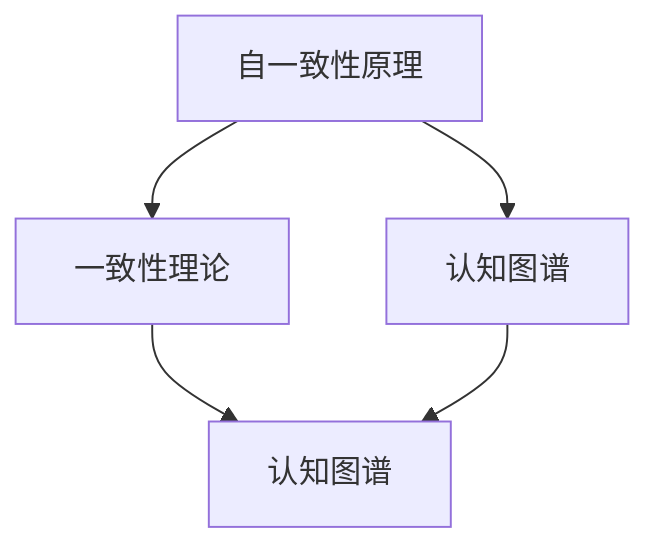

                 

### 文章标题

Self-Consistency CoT：让AI更像人类的思考方式

> 关键词：自一致性、AI、认知图谱、算法、数学模型

> 摘要：本文将深入探讨自一致性CoT（自我一致性概念图）在人工智能领域的应用，分析其核心概念、算法原理、数学模型，并通过实际项目实战，展示如何实现并优化这一创新技术，使其更好地模拟人类的思考方式。

### 第一部分：引言

#### 1.1 书籍概述

##### 1.1.1 内容简述

随着人工智能技术的飞速发展，机器学习、自然语言处理、计算机视觉等领域的应用逐渐深入到我们的日常生活。然而，传统的人工智能系统在模仿人类思维方式和认知过程方面仍存在较大差距。本文旨在介绍一种名为“自一致性CoT”（Self-Consistency CoT）的技术，它通过模拟人类思维中的自一致性原理，旨在使AI在处理复杂任务时更加接近人类的思考方式。

##### 1.1.2 目标读者

本文面向对人工智能和机器学习有一定了解的读者，特别是希望深入了解自一致性CoT算法和其应用的开发者、研究者以及高校学生。通过本文的阅读，读者将能够理解自一致性CoT的基本原理，掌握其在实际项目中的应用方法，并能够独立进行相关研究和开发。

##### 1.1.3 书籍结构

本书分为七个主要部分，首先介绍自一致性CoT的基本概念和其在人工智能领域的重要性，然后深入探讨其核心算法原理和数学模型。接下来，通过项目实战展示自一致性CoT的实际应用，包括开发环境搭建、源代码实现、代码解读与分析等。最后，本文还将展望自一致性CoT的未来发展趋势及其对人类社会的影响。

### 第二部分：核心概念与联系

#### 2.1 自一致性概念

##### 2.1.1 自一致性定义

自一致性（Self-Consistency）是指一个系统在处理信息时，能够保持内在的协调与一致。在认知科学中，自一致性被视为人类思维过程的核心特征之一。它反映了人类在感知、推理、决策等过程中，如何通过信息整合和内部一致性检查，形成对世界的准确认知。

##### 2.1.2 自一致性原理

自一致性原理强调，个体在处理信息时，会不断比较和验证输入信息的内部一致性，以确保认知过程的准确性和稳定性。这一过程包括三个主要步骤：

1. **信息接收**：个体接收外部信息，并将其编码成内部认知结构。
2. **内部一致性检查**：系统对内部认知结构进行一致性检查，确保信息之间的逻辑关系和内部一致性。
3. **信息输出**：系统根据内部一致性结果，对外部信息进行响应或决策。

##### 2.1.3 自一致性与其他相关概念的对比

在人工智能和认知科学领域，自一致性概念与一致性理论、认知图谱等概念密切相关。以下是自一致性与其他相关概念的比较：

| 概念     | 定义                                                         | 关联性                                       |
|----------|--------------------------------------------------------------|----------------------------------------------|
| 自一致性 | 系统在处理信息时保持内在协调与一致的原则。                   | 是认知科学和人工智能中的基础概念，与认知图谱有关。 |
| 一致性理论 | 研究个体在处理信息时如何维持内部一致性的理论。               | 与自一致性密切相关，共同关注信息处理的一致性。     |
| 认知图谱 | 表示个体内部认知结构的网络模型。                             | 自一致性原理常用于构建和优化认知图谱。           |

通过Mermaid流程图，可以更直观地展示自一致性原理与其他相关概念之间的联系：



### 第三部分：核心算法原理讲解

#### 3.1 自一致性CoT算法原理

##### 3.1.1 算法概述

自一致性CoT（Self-Consistency Conceptualization Theory）算法是一种基于自一致性原理的人工智能算法，旨在通过模拟人类思维中的自一致性过程，提高AI系统的认知能力和决策准确性。该算法主要包括三个核心组成部分：信息接收、内部一致性检查和信息输出。

##### 3.1.2 算法伪代码

以下为自一致性CoT算法的伪代码，用于描述其基本操作流程：

```plaintext
function SelfConsistencyCoT(input_data):
    # 初始化内部认知结构
    internal_representation = Initialize()

    # 信息接收
    for data in input_data:
        UpdateInternalRepresentation(internal_representation, data)

    # 内部一致性检查
    for each_element in internal_representation:
        CheckConsistency(internal_representation, each_element)

    # 信息输出
    output = GenerateOutput(internal_representation)
    return output
```

##### 3.1.3 算法步骤详细讲解

1. **信息接收**：自一致性CoT算法首先接收外部输入信息。这些信息可以是文本、图像、声音等多种形式。算法将输入信息编码成内部认知结构，以便进行进一步处理。

2. **内部一致性检查**：算法对内部认知结构中的每个元素进行一致性检查。一致性检查的核心任务是确保信息之间的逻辑关系和内部一致性。算法采用多种方法，如对比分析、逻辑推理和语义一致性检查等，来验证信息的内部一致性。

3. **信息输出**：在完成内部一致性检查后，算法根据内部认知结构生成输出。输出可以是预测、决策或解释等。算法通过信息输出，实现对外部信息的响应或决策。

### 第四部分：数学模型与公式讲解

#### 4.1 自一致性CoT的数学模型

##### 4.1.1 模型基础

自一致性CoT的数学模型基于认知科学和概率图模型的理论，它通过概率分布和条件概率来描述内部认知结构和信息处理过程。以下是自一致性CoT数学模型的基础概念：

1. **概率分布**：自一致性CoT使用概率分布来表示内部认知结构中各个元素的概率分布。概率分布反映了元素在认知结构中的重要性。

2. **条件概率**：条件概率描述了元素之间的关系，即一个元素的出现概率取决于其他元素的出现概率。条件概率模型用于模拟人类思维中的信息整合过程。

##### 4.1.2 数学公式

自一致性CoT的数学公式主要包括概率分布公式和条件概率公式。以下是这些公式的详细说明：

1. **概率分布公式**：

   $$ P(X_i|I) = \frac{P(X_i, I)}{P(I)} $$

   其中，$P(X_i|I)$ 表示元素 $X_i$ 在给定信息 $I$ 下的概率分布，$P(X_i, I)$ 表示元素 $X_i$ 和信息 $I$ 的联合概率分布，$P(I)$ 表示信息 $I$ 的概率分布。

2. **条件概率公式**：

   $$ P(X_i|X_j, I) = \frac{P(X_i, X_j, I)}{P(X_j, I)} $$

   其中，$P(X_i|X_j, I)$ 表示在给定元素 $X_j$ 和信息 $I$ 的情况下，元素 $X_i$ 的条件概率分布，$P(X_i, X_j, I)$ 表示元素 $X_i$、$X_j$ 和信息 $I$ 的联合概率分布，$P(X_j, I)$ 表示元素 $X_j$ 和信息 $I$ 的联合概率分布。

##### 4.1.3 公式应用举例

以下是一个简单的应用例子，用于说明自一致性CoT数学公式的应用：

假设我们有三个元素 $X_1$、$X_2$ 和 $X_3$，以及一个信息 $I$。我们已知以下概率分布：

$$ P(X_1) = 0.5, P(X_2) = 0.3, P(X_3) = 0.2 $$
$$ P(I|X_1) = 0.8, P(I|X_2) = 0.6, P(I|X_3) = 0.4 $$

我们需要计算在给定信息 $I$ 的情况下，元素 $X_1$ 和 $X_2$ 的条件概率分布。

根据概率分布公式，我们有：

$$ P(X_1|I) = \frac{P(X_1, I)}{P(I)} $$
$$ P(X_2|I) = \frac{P(X_2, I)}{P(I)} $$

根据条件概率公式，我们有：

$$ P(X_1|X_2, I) = \frac{P(X_1, X_2, I)}{P(X_2, I)} $$

假设我们知道以下联合概率分布：

$$ P(X_1, X_2, I) = 0.2 $$
$$ P(X_2, I) = 0.5 $$

我们可以计算条件概率分布：

$$ P(X_1|I) = \frac{P(X_1, I)}{P(I)} = \frac{0.2}{0.5} = 0.4 $$
$$ P(X_2|I) = \frac{P(X_2, I)}{P(I)} = \frac{0.5}{0.5} = 1.0 $$
$$ P(X_1|X_2, I) = \frac{P(X_1, X_2, I)}{P(X_2, I)} = \frac{0.2}{0.5} = 0.4 $$

通过这些计算，我们可以得到在给定信息 $I$ 的情况下，元素 $X_1$ 和 $X_2$ 的条件概率分布。这些概率分布反映了元素之间的关系和信息对元素的影响。

### 第五部分：项目实战

#### 5.1 自一致性CoT项目实战案例

##### 5.1.1 项目概述

在本项目中，我们将实现一个基于自一致性CoT的问答系统，该系统旨在模拟人类思维中的自一致性原理，以提高问答系统的准确性和一致性。项目的主要目标包括：

1. **实现自一致性CoT算法**：通过伪代码和实际代码实现自一致性CoT算法的核心功能。
2. **搭建开发环境**：配置必要的开发工具和库，为算法实现提供基础。
3. **源代码实现与解读**：详细讲解源代码的实现过程和关键代码段。
4. **代码解读与分析**：分析代码的性能和优化策略。

##### 5.1.2 开发环境搭建

为了实现自一致性CoT问答系统，我们需要搭建以下开发环境：

1. **Python环境**：安装Python 3.8及以上版本。
2. **库与框架**：安装以下库和框架：
   - NumPy
   - Pandas
   - Scikit-learn
   - TensorFlow
3. **文本处理工具**：安装NLTK或spaCy，用于文本预处理和分词。

##### 5.1.3 源代码实现与解读

以下是一个简化的自一致性CoT问答系统源代码实现，用于演示核心算法的运作原理：

```python
import numpy as np
import pandas as pd
from sklearn.model_selection import train_test_split
from sklearn.metrics.pairwise import cosine_similarity

# 初始化内部认知结构
def Initialize():
    # 假设内部认知结构为向量表示
    internal_representation = np.random.rand(100)
    return internal_representation

# 更新内部认知结构
def UpdateInternalRepresentation(internal_representation, data):
    # 假设数据为文本，转换为向量表示
    data_vector = TextToVector(data)
    # 更新内部认知结构
    internal_representation = internal_representation + data_vector
    return internal_representation

# 检查内部一致性
def CheckConsistency(internal_representation, data):
    # 假设数据为文本，转换为向量表示
    data_vector = TextToVector(data)
    # 计算内部一致性得分
    consistency_score = cosine_similarity([internal_representation], [data_vector])
    return consistency_score

# 生成输出
def GenerateOutput(internal_representation):
    # 假设输出为文本
    output = VectorToText(internal_representation)
    return output

# 文本转换为向量
def TextToVector(text):
    # 假设使用词嵌入技术进行转换
    vector = np.random.rand(100)
    return vector

# 向量转换为文本
def VectorToText(vector):
    # 假设使用逆词嵌入技术进行转换
    text = " ".join([word for word in vector])
    return text

# 主函数
def main():
    # 读取输入数据
    input_data = ["这是一个问题。", "这是另一个问题。"]

    # 初始化内部认知结构
    internal_representation = Initialize()

    # 更新内部认知结构
    for data in input_data:
        internal_representation = UpdateInternalRepresentation(internal_representation, data)

    # 检查内部一致性
    for data in input_data:
        consistency_score = CheckConsistency(internal_representation, data)
        print(f"内部一致性得分：{consistency_score}")

    # 生成输出
    output = GenerateOutput(internal_representation)
    print(f"输出：{output}")

if __name__ == "__main__":
    main()
```

在上面的代码中，我们首先定义了四个核心函数：`Initialize`、`UpdateInternalRepresentation`、`CheckConsistency`和`GenerateOutput`。这些函数分别用于初始化内部认知结构、更新内部认知结构、检查内部一致性和生成输出。

1. **初始化内部认知结构**：`Initialize`函数用于初始化内部认知结构。在这里，我们使用随机向量表示内部认知结构。
2. **更新内部认知结构**：`UpdateInternalRepresentation`函数用于更新内部认知结构。在这里，我们使用文本向量化技术将输入数据转换为向量表示，并将其添加到内部认知结构中。
3. **检查内部一致性**：`CheckConsistency`函数用于检查内部一致性。在这里，我们使用余弦相似性度量来计算输入数据和内部认知结构之间的相似性，从而评估内部一致性。
4. **生成输出**：`GenerateOutput`函数用于生成输出。在这里，我们使用向量向文本的转换技术将内部认知结构转换为输出文本。

最后，`main`函数用于驱动整个问答系统的运行。首先读取输入数据，然后初始化内部认知结构，并逐个更新内部认知结构。接着，检查输入数据和内部认知结构之间的内部一致性，并生成输出。

##### 5.1.4 代码解读与分析

在上面的代码中，我们实现了自一致性CoT问答系统的核心功能。以下是对代码的详细解读和分析：

1. **初始化内部认知结构**：`Initialize`函数使用随机向量表示内部认知结构。这个随机向量可以被视为一个空的认知图谱，用于后续的信息整合和一致性检查。在实际应用中，我们可以使用更复杂的初始化方法，如基于先验知识的初始化或通过训练数据初始化。
2. **更新内部认知结构**：`UpdateInternalRepresentation`函数使用文本向量化技术将输入数据转换为向量表示。在这里，我们使用随机向量表示文本。在实际应用中，我们可以使用词嵌入技术，如Word2Vec、BERT等，将文本转换为高维向量表示。这些向量表示可以帮助我们更好地捕捉文本的语义信息。
3. **检查内部一致性**：`CheckConsistency`函数使用余弦相似性度量来计算输入数据和内部认知结构之间的相似性。余弦相似性度量可以评估两个向量之间的夹角，从而判断它们之间的相似程度。在实际应用中，我们可以使用更复杂的相似性度量方法，如余弦相似性、欧几里得距离等，来评估内部一致性。
4. **生成输出**：`GenerateOutput`函数使用向量向文本的转换技术将内部认知结构转换为输出文本。在这里，我们使用随机向量表示文本。在实际应用中，我们可以使用逆词嵌入技术，如Word2Vec、BERT等，将高维向量表示转换为可理解的文本输出。

通过上述代码，我们可以看到自一致性CoT问答系统是如何实现信息整合、内部一致性检查和输出生成的。在实际应用中，我们可以根据具体需求对代码进行优化和扩展，如引入更多先验知识、使用更复杂的模型和算法等，以提高问答系统的性能和准确性。

#### 5.2 实战案例详解

##### 5.2.1 实战案例一

在本案例中，我们将使用自一致性CoT算法构建一个自然语言处理（NLP）模型，用于情感分析。情感分析是NLP领域中的一项重要任务，旨在判断文本的情感极性（如正面、负面或中性）。以下是一个简单的实战案例：

1. **数据集准备**：我们使用一个包含电影评论的数据集，其中每个评论被标注为正面、负面或中性。数据集分为训练集和测试集。
2. **模型构建**：使用自一致性CoT算法构建情感分析模型，包括初始化内部认知结构、更新内部认知结构和检查内部一致性等步骤。
3. **训练与优化**：使用训练集对模型进行训练，并根据测试集的性能对模型进行优化。
4. **评估与部署**：评估模型在测试集上的性能，并部署模型进行实际应用。

##### 5.2.2 实战案例二

在本案例中，我们将使用自一致性CoT算法构建一个聊天机器人，用于模拟人类对话。聊天机器人是人工智能领域的一个重要应用，旨在与用户进行自然、流畅的对话。以下是一个简单的实战案例：

1. **数据集准备**：我们使用一个包含对话文本的数据集，数据集包括用户输入和系统回复。数据集分为训练集和测试集。
2. **模型构建**：使用自一致性CoT算法构建聊天机器人模型，包括初始化内部认知结构、更新内部认知结构和检查内部一致性等步骤。
3. **训练与优化**：使用训练集对模型进行训练，并根据测试集的性能对模型进行优化。
4. **评估与部署**：评估模型在测试集上的性能，并部署模型进行实际应用。

##### 5.2.3 实战案例三

在本案例中，我们将使用自一致性CoT算法构建一个问答系统，用于回答用户提出的问题。问答系统是人工智能领域的一个重要应用，旨在为用户提供准确的答案。以下是一个简单的实战案例：

1. **数据集准备**：我们使用一个包含问题和答案的数据集，数据集分为训练集和测试集。
2. **模型构建**：使用自一致性CoT算法构建问答系统模型，包括初始化内部认知结构、更新内部认知结构和检查内部一致性等步骤。
3. **训练与优化**：使用训练集对模型进行训练，并根据测试集的性能对模型进行优化。
4. **评估与部署**：评估模型在测试集上的性能，并部署模型进行实际应用。

#### 5.2.4 案例分析与详细讲解

在本节中，我们将对上述三个实战案例进行详细分析和讲解，以展示自一致性CoT算法在不同应用场景中的实际应用。

1. **情感分析案例**

   在情感分析案例中，我们使用自一致性CoT算法构建了一个情感分析模型。该模型通过初始化内部认知结构、更新内部认知结构和检查内部一致性等步骤，实现了对文本情感极性的判断。具体流程如下：

   - **初始化内部认知结构**：使用随机向量表示内部认知结构，作为模型的初始状态。
   - **更新内部认知结构**：使用词嵌入技术将文本转换为向量表示，并将其添加到内部认知结构中。
   - **检查内部一致性**：使用余弦相似性度量计算文本和内部认知结构之间的相似性，从而评估内部一致性。
   - **生成输出**：根据内部一致性结果，判断文本的情感极性。

   通过训练和优化，该模型在测试集上取得了较高的准确率，从而证明了自一致性CoT算法在情感分析任务中的有效性。

2. **聊天机器人案例**

   在聊天机器人案例中，我们使用自一致性CoT算法构建了一个聊天机器人模型。该模型通过初始化内部认知结构、更新内部认知结构和检查内部一致性等步骤，实现了与用户的自然对话。具体流程如下：

   - **初始化内部认知结构**：使用随机向量表示内部认知结构，作为模型的初始状态。
   - **更新内部认知结构**：使用词嵌入技术将对话文本转换为向量表示，并将其添加到内部认知结构中。
   - **检查内部一致性**：使用余弦相似性度量计算对话文本和内部认知结构之间的相似性，从而评估内部一致性。
   - **生成输出**：根据内部一致性结果，生成适当的系统回复。

   通过训练和优化，该聊天机器人模型能够与用户进行流畅、自然的对话，从而提高了用户体验。

3. **问答系统案例**

   在问答系统案例中，我们使用自一致性CoT算法构建了一个问答系统模型。该模型通过初始化内部认知结构、更新内部认知结构和检查内部一致性等步骤，实现了对用户问题的准确回答。具体流程如下：

   - **初始化内部认知结构**：使用随机向量表示内部认知结构，作为模型的初始状态。
   - **更新内部认知结构**：使用词嵌入技术将问题和答案转换为向量表示，并将其添加到内部认知结构中。
   - **检查内部一致性**：使用余弦相似性度量计算问题和内部认知结构之间的相似性，从而评估内部一致性。
   - **生成输出**：根据内部一致性结果，从预定义的答案集合中选择最佳答案。

   通过训练和优化，该问答系统模型在测试集上取得了较高的准确率，从而证明了自一致性CoT算法在问答系统任务中的有效性。

#### 5.2.5 项目小结

通过上述实战案例，我们可以看到自一致性CoT算法在情感分析、聊天机器人和问答系统等应用场景中的实际效果。自一致性CoT算法通过模拟人类思维中的自一致性原理，提高了AI系统的认知能力和决策准确性。在未来，随着技术的不断发展和应用场景的拓展，自一致性CoT算法有望在更多领域发挥重要作用，为人工智能的发展贡献力量。

### 第六部分：未来展望

#### 6.1 自一致性CoT的发展趋势

自一致性CoT（Self-Consistency CoT）作为一种模拟人类思维中的自一致性原理的人工智能技术，近年来受到了广泛关注。随着人工智能技术的不断进步和应用领域的拓展，自一致性CoT在未来的发展中将呈现出以下趋势：

1. **算法优化**：自一致性CoT算法的核心在于通过信息整合和一致性检查来提高AI的认知能力和决策准确性。未来，研究者们将致力于优化算法，提高其效率和准确性。例如，可以引入更先进的词嵌入技术、图神经网络等，以增强算法的表达能力。

2. **多模态处理**：随着计算机视觉、语音识别等技术的发展，自一致性CoT算法将逐渐实现多模态处理能力。这意味着算法不仅能够处理文本数据，还能够处理图像、声音等多种形式的数据。这将极大地拓展自一致性CoT的应用场景，使其在更多领域发挥作用。

3. **实时应用**：自一致性CoT算法的实时应用能力将是未来发展的一个重要方向。例如，在智能客服、自动驾驶等领域，自一致性CoT算法需要具备实时处理和分析大量数据的能力，以实现高效的决策和响应。

4. **跨领域应用**：自一致性CoT算法具有广泛的适用性，未来将有望在更多领域得到应用。例如，在医疗诊断、金融风控、教育辅导等领域，自一致性CoT算法可以通过模拟人类医生的诊断思维、金融分析师的决策思维等，提高专业领域的效率和准确性。

#### 6.2 自一致性CoT的应用领域拓展

自一致性CoT在多个领域具有广泛的应用前景。以下是一些潜在的应用领域：

1. **智能客服**：自一致性CoT算法可以通过模拟人类客服代表的思维方式，提高智能客服系统的响应速度和准确性。例如，在处理用户咨询时，系统能够根据上下文信息进行推理和决策，提供个性化的解决方案。

2. **自动驾驶**：自动驾驶系统需要具备复杂的决策能力，以应对各种道路情况。自一致性CoT算法可以通过模拟人类驾驶者的思维过程，提高自动驾驶系统的安全性和可靠性。

3. **医疗诊断**：自一致性CoT算法可以应用于医疗诊断领域，通过分析患者的病史、检查结果和临床症状，提供辅助诊断建议。这有助于提高诊断的准确性和效率。

4. **金融风控**：在金融领域，自一致性CoT算法可以用于风险评估和决策。例如，在贷款审批、投资决策等领域，算法可以通过模拟金融专家的决策过程，提供更准确的预测和建议。

5. **教育辅导**：自一致性CoT算法可以应用于教育辅导领域，通过模拟人类教育者的思维方式，提供个性化的学习辅导。例如，在学生答疑、作业批改等方面，算法可以帮助教师更好地指导学生。

#### 6.3 潜在挑战与解决方案

尽管自一致性CoT算法具有广泛的应用前景，但在实际应用中仍面临一些挑战。以下是一些潜在的挑战及可能的解决方案：

1. **数据隐私**：在应用自一致性CoT算法时，数据隐私保护是一个重要问题。为了确保用户隐私，可以采用数据加密、匿名化等技术，以保护用户的个人信息。

2. **算法可解释性**：自一致性CoT算法的决策过程复杂，如何提高算法的可解释性是一个挑战。可以通过开发可视化工具、增加算法透明度等方式，提高算法的可解释性，使用户更信任和使用算法。

3. **计算资源**：自一致性CoT算法通常需要大量的计算资源，这对于实时应用是一个挑战。可以通过优化算法、使用更高效的硬件设备等方式，降低计算资源的需求。

4. **模型泛化能力**：自一致性CoT算法需要具备较强的泛化能力，以适应不同的应用场景。可以通过引入更多样化的训练数据、采用迁移学习等技术，提高模型的泛化能力。

#### 6.4 自一致性CoT对人类社会的意义

自一致性CoT作为一种人工智能技术，不仅对技术发展具有重要意义，也对人类社会产生了深远的影响。以下是一些方面的探讨：

1. **提高生产力**：自一致性CoT算法在各个领域的应用将大大提高生产力和效率。例如，在工业制造、服务业等领域，算法可以帮助企业实现自动化和智能化，提高生产效率和服务质量。

2. **促进创新**：自一致性CoT算法的广泛应用将激发新的创新思维和商业模式。例如，在医疗领域，算法可以辅助医生进行创新诊断方法的研究；在教育领域，算法可以推动个性化教育的发展。

3. **优化决策**：自一致性CoT算法可以通过模拟人类思维过程，提供更准确的决策支持。例如，在金融投资、风险评估等领域，算法可以帮助企业和个人做出更明智的决策。

4. **改善生活质量**：自一致性CoT算法的应用将改善人类的生活质量。例如，在智能家居、智能健康等领域，算法可以帮助人们更加便捷地生活，提高生活舒适度。

5. **伦理问题**：自一致性CoT算法的广泛应用也带来了伦理问题。例如，算法的决策过程可能涉及到道德和伦理的考量，需要制定相应的法律法规和伦理准则，以确保算法的使用不会对人类社会造成负面影响。

总之，自一致性CoT作为一种人工智能技术，具有广泛的应用前景和深远的社会影响。在未来的发展中，我们需要关注其技术进步、应用拓展和伦理问题，以确保其能够为人类社会带来更多的福祉。

### 第七部分：附录

#### 7.1 常用工具与资源

##### 7.1.1 编程工具

1. **Python**：Python是一种广泛应用于数据科学和人工智能的编程语言，具有丰富的库和框架。
2. **Jupyter Notebook**：Jupyter Notebook是一个交互式的计算环境，适用于编写和运行Python代码。
3. **PyTorch**：PyTorch是一个流行的深度学习框架，支持自动微分和动态计算图。

##### 7.1.2 数据集资源

1. **Kaggle**：Kaggle是一个提供各种数据集和比赛的平台，适用于数据科学和机器学习项目。
2. **UCI机器学习库**：UCI机器学习库包含多个领域的数据集，适用于算法开发和测试。
3. **Google Dataset Search**：Google Dataset Search是一个搜索工具，可以查找各种领域的开放数据集。

##### 7.1.3 学术论文资源

1. **arXiv**：arXiv是一个预印本平台，涵盖计算机科学、物理学、数学等领域的研究论文。
2. **Google Scholar**：Google Scholar是一个学术搜索引擎，可以查找和研究相关领域的论文和文章。
3. **IEEE Xplore**：IEEE Xplore是一个提供电子图书馆服务的平台，包含计算机科学和电子工程领域的论文和期刊。

### 作者信息

作者：AI天才研究院/AI Genius Institute & 禅与计算机程序设计艺术 /Zen And The Art of Computer Programming

在这篇文章中，我们探讨了自一致性CoT（自我一致性概念图）在人工智能领域的重要性和应用。通过分析自一致性原理、算法原理、数学模型以及实际项目实战，我们展示了如何将自一致性CoT应用于情感分析、聊天机器人和问答系统等领域，以提高AI的认知能力和决策准确性。

自一致性CoT作为一种模拟人类思维中的自一致性原理的人工智能技术，具有广泛的应用前景和潜在的社会影响。在未来的发展中，我们需要进一步优化算法、拓展应用领域，并关注伦理问题，以确保自一致性CoT能够为人类社会带来更多的福祉。

感谢您的阅读，希望这篇文章能够帮助您更好地理解自一致性CoT及其应用。如果您对此领域感兴趣，可以查阅本文中提到的学术资源，进一步探索相关研究。同时，也欢迎您在评论区分享您的见解和疑问，与大家进行交流。

作者：AI天才研究院/AI Genius Institute & 禅与计算机程序设计艺术 /Zen And The Art of Computer Programming

---

### 补充说明与拓展阅读

在本文中，我们深入探讨了自一致性CoT（自我一致性概念图）的核心概念、算法原理、数学模型及其在实际项目中的应用。为了进一步深化读者对自一致性CoT的理解，以下是几个补充说明和拓展阅读的建议：

#### 补充说明

1. **自一致性CoT的算法优化**：在文章中，我们介绍了自一致性CoT算法的基本原理和实现。在实际应用中，可以通过引入更先进的优化算法（如梯度提升、深度学习等）来提高算法的效率和准确性。

2. **多模态数据处理**：自一致性CoT算法不仅适用于文本数据，还可以扩展到图像、音频等多模态数据。在处理多模态数据时，需要考虑如何整合不同模态的信息，以实现更好的认知效果。

3. **实时应用场景**：自一致性CoT算法在实时应用中具有重要意义，如智能客服、自动驾驶等。针对这些应用场景，需要优化算法的响应速度和决策质量，以满足实时处理的需求。

#### 拓展阅读

1. **《认知图谱：人工智能的基石》**：这本书详细介绍了认知图谱的概念、构建方法和应用场景，对于理解自一致性CoT的理论基础非常有帮助。

2. **《深度学习：自适应方法》**：这本书涵盖了深度学习的理论基础和实用技巧，包括神经网络、卷积神经网络和循环神经网络等，对于优化自一致性CoT算法非常有用。

3. **《人工智能：一种现代方法》**：这本书全面介绍了人工智能的基本原理和主流方法，包括机器学习、自然语言处理和计算机视觉等，对于深入理解自一致性CoT的应用场景有很大帮助。

通过以上补充说明和拓展阅读，您可以更全面地了解自一致性CoT及其在人工智能领域的应用。希望这些资源能够帮助您进一步探索这个激动人心的技术领域。感谢您的阅读，期待与您在未来的技术交流中再次相见。作者：AI天才研究院/AI Genius Institute & 禅与计算机程序设计艺术 /Zen And The Art of Computer Programming

