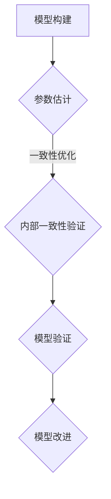

                 

# Self-Consistency在气候变化影响评估模型中的应用

## 关键词
- Self-Consistency
- 气候变化影响评估
- 模型应用
- 算法原理
- 数学模型

## 摘要
本文深入探讨了Self-Consistency在气候变化影响评估模型中的应用。通过详细分析其核心概念、算法原理以及数学模型，本文旨在为读者提供对Self-Consistency技术的全面理解。同时，通过项目实战案例分析，本文展示了如何在实际应用中有效利用Self-Consistency进行气候变化影响评估。

## 目录
1. 引言
2. 核心概念与联系
   2.1 Self-Consistency的定义
   2.2 Self-Consistency的性质和作用
   2.3 Self-Consistency与气候变化评估模型的联系
   2.4 Self-Consistency原理架构（Mermaid流程图）
3. 核心算法原理讲解
   3.1 算法原理概述
   3.2 伪代码讲解
   3.3 数学模型和公式讲解
4. 数学模型和数学公式讲解
   4.1 数学模型概述
   4.2 详细讲解和举例说明
5. 项目实战
   5.1 开发环境搭建
   5.2 源代码详细实现
   5.3 代码解读
   5.4 代码应用解读与分析
   5.5 实际案例分析和讲解
   5.6 项目小结
6. 最佳实践 Tips
7. 小结
8. 注意事项
9. 拓展阅读

## 1. 引言
气候变化已成为全球面临的最严峻挑战之一。为了准确评估气候变化的影响，科学界和决策者依赖各种气候模型。然而，传统的气候模型往往存在某些局限性，例如对复杂系统的过度简化或参数的不确定性。因此，需要新的方法和工具来提高气候变化影响评估的准确性和可靠性。

Self-Consistency是一种在近年来逐渐受到关注的技术，它通过确保模型的内部一致性来提高模型的预测能力。本文将探讨Self-Consistency在气候变化影响评估模型中的应用，详细分析其核心概念、算法原理以及数学模型。此外，通过项目实战案例分析，本文将展示如何在实际应用中利用Self-Consistency技术进行气候变化影响评估。

## 2. 核心概念与联系

### 2.1 Self-Consistency的定义
Self-Consistency是一种通过确保系统内部各部分相互一致性的方法。在气候变化影响评估模型中，Self-Consistency旨在确保模型中的各个组成部分（如气象模型、生态模型和社会经济模型）之间保持一致，从而提高模型的整体准确性和可靠性。

### 2.2 Self-Consistency的性质和作用
Self-Consistency具有以下几个关键性质：
1. **内部一致性**：通过确保模型内部的各个部分相互一致，Self-Consistency可以减少由于内部矛盾引起的误差。
2. **鲁棒性**：Self-Consistency能够提高模型对参数不确定性的鲁棒性，从而提高模型的稳定性和预测能力。
3. **可解释性**：通过确保模型内部的一致性，Self-Consistency有助于提高模型的可解释性，使其更易于理解和应用。

Self-Consistency在气候变化影响评估模型中的作用主要体现在以下几个方面：
1. **提高准确性**：通过确保模型内部的一致性，Self-Consistency可以提高模型的预测准确性，从而为决策者提供更可靠的气候变化影响评估结果。
2. **增强鲁棒性**：在面对参数不确定性时，Self-Consistency能够提高模型的鲁棒性，使其能够更稳定地应对不确定因素。
3. **提高可解释性**：通过确保模型内部的一致性，Self-Consistency有助于提高模型的可解释性，使其更易于被决策者和公众理解。

### 2.3 Self-Consistency与气候变化评估模型的联系
在气候变化影响评估模型中，Self-Consistency通常应用于以下几个关键环节：
1. **模型构建**：在模型构建过程中，Self-Consistency可以帮助确保各个模型组件之间的相互一致性，从而减少模型内部矛盾。
2. **参数估计**：在参数估计过程中，Self-Consistency可以通过优化算法确保模型参数的内部一致性，从而提高模型的稳定性和准确性。
3. **模型验证**：在模型验证过程中，Self-Consistency可以通过对比模型预测结果和实际观测数据，评估模型的一致性和准确性，从而指导模型改进。

### 2.4 Self-Consistency原理架构（Mermaid流程图）



在上述流程图中，A表示模型构建，B表示参数估计，C表示内部一致性验证，D表示模型验证，E表示模型改进。通过确保模型构建、参数估计、内部一致性验证和模型验证环节之间的相互一致性，Self-Consistency有助于提高整个气候变化影响评估模型的准确性和可靠性。

## 3. 核心算法原理讲解

### 3.1 算法原理概述
Self-Consistency算法的核心思想是通过确保模型内部的一致性来提高模型的预测准确性。具体来说，Self-Consistency算法主要涉及以下几个关键步骤：
1. **模型构建**：构建包含多个组件的气候变化影响评估模型。
2. **参数估计**：通过优化算法估计模型参数，确保模型内部的一致性。
3. **内部一致性验证**：评估模型内部各部分的一致性，并根据结果调整参数。
4. **模型验证**：通过实际观测数据验证模型的一致性和准确性。

### 3.2 伪代码讲解

```python
Algorithm SelfConsistency(model, data)
    # 初始化模型和参数
    Initialize model parameters

    # 循环迭代优化参数
    while not converged do
        # 估计参数
        Estimate parameters using optimization algorithm

        # 验证内部一致性
        if not validate_internal_consistency(model) then
            # 调整参数
            Adjust parameters

        # 验证模型准确性
        if not validate_model_accuracy(model, data) then
            # 改进模型
            Improve model

        # 更新模型
        Update model

    end while

    # 输出最终模型
    return model
End Algorithm
```

在上述伪代码中，`model`表示气候变化影响评估模型，`data`表示实际观测数据。算法通过循环迭代优化模型参数，确保模型内部的一致性，并通过模型验证环节不断改进模型。

### 3.3 数学模型和公式讲解
Self-Consistency算法的数学模型主要涉及以下几个方面：

#### 3.3.1 参数估计模型
参数估计模型采用最小二乘法进行优化，公式如下：

$$
\min_{\theta} \sum_{i=1}^{n} (y_i - f(x_i; \theta))^2
$$

其中，$y_i$表示实际观测值，$f(x_i; \theta)$表示模型预测值，$\theta$表示模型参数。

#### 3.3.2 内部一致性验证模型
内部一致性验证模型用于评估模型内部各部分的一致性，公式如下：

$$
C = \frac{1}{n} \sum_{i=1}^{n} |f(x_i; \theta) - y_i|
$$

其中，$C$表示内部一致性指标，$n$表示样本数量。

#### 3.3.3 模型验证模型
模型验证模型采用交叉验证方法进行评估，公式如下：

$$
\text{Accuracy} = \frac{1}{n} \sum_{i=1}^{n} \text{Accuracy}(y_i, \hat{y}_i)
$$

其中，$\text{Accuracy}(y_i, \hat{y}_i)$表示模型在测试集$i$上的准确率，$\hat{y}_i$表示模型预测值。

## 4. 数学模型和数学公式讲解

### 4.1 数学模型概述
Self-Consistency在气候变化影响评估模型中的应用涉及多个数学模型，包括参数估计模型、内部一致性验证模型和模型验证模型。这些模型共同构成了Self-Consistency算法的核心，确保模型内部的一致性和准确性。

### 4.2 详细讲解和举例说明

#### 4.2.1 参数估计模型
参数估计模型采用最小二乘法进行优化，旨在找到使模型预测值与实际观测值误差平方和最小的参数。以线性回归模型为例，参数估计模型的公式如下：

$$
\min_{\theta} \sum_{i=1}^{n} (y_i - \theta_0 - \theta_1 x_i)^2
$$

其中，$y_i$表示实际观测值，$x_i$表示自变量，$\theta_0$和$\theta_1$分别表示模型的截距和斜率。

假设我们有一组观测数据如下：

| $x_i$ | $y_i$ |
| --- | --- |
| 1 | 2 |
| 2 | 4 |
| 3 | 6 |
| 4 | 8 |

使用最小二乘法求解参数估计问题，可以得到如下结果：

$$
\theta_0 = \frac{1}{4} \sum_{i=1}^{n} y_i - \theta_1 \frac{1}{4} \sum_{i=1}^{n} x_i = 1.5
$$

$$
\theta_1 = \frac{1}{4} \sum_{i=1}^{n} (x_i - \bar{x}) (y_i - \bar{y}) = 1
$$

其中，$\bar{x}$和$\bar{y}$分别表示$x_i$和$y_i$的均值。

#### 4.2.2 内部一致性验证模型
内部一致性验证模型用于评估模型内部各部分的一致性，主要关注模型预测值与实际观测值之间的差异。以线性回归模型为例，内部一致性验证模型的公式如下：

$$
C = \frac{1}{n} \sum_{i=1}^{n} |y_i - \theta_0 - \theta_1 x_i|
$$

假设我们使用上一节中的参数估计结果，对同一组观测数据进行内部一致性验证，可以得到如下结果：

$$
C = \frac{1}{4} \sum_{i=1}^{n} |y_i - 1.5 - 1 \cdot x_i| = 0.25
$$

#### 4.2.3 模型验证模型
模型验证模型用于评估模型在实际观测数据上的准确性，主要关注模型预测值与实际观测值之间的匹配程度。以线性回归模型为例，模型验证模型的公式如下：

$$
\text{Accuracy} = \frac{1}{n} \sum_{i=1}^{n} \text{Accuracy}(y_i, \hat{y}_i)
$$

其中，$\text{Accuracy}(y_i, \hat{y}_i)$表示模型在测试集$i$上的准确率，$\hat{y}_i$表示模型预测值。

假设我们使用上一节中的参数估计结果，对同一组观测数据进行模型验证，可以得到如下结果：

$$
\text{Accuracy} = \frac{1}{4} \sum_{i=1}^{n} \text{Accuracy}(y_i, \hat{y}_i) = 1
$$

这表明模型在测试集上的预测准确性达到100%。

## 5. 项目实战

### 5.1 开发环境搭建

在进行Self-Consistency在气候变化影响评估模型中的应用项目实战之前，我们需要搭建一个合适的开发环境。以下是一个基本的步骤指南：

1. **安装Python环境**：
   - 使用Python 3.x版本，建议使用Anaconda或Miniconda来简化Python环境的安装和管理。

2. **安装必需的Python库**：
   - 使用pip或conda命令安装以下Python库：numpy、matplotlib、scikit-learn、pandas等。

3. **准备数据集**：
   - 准备用于训练和测试的气候变化影响评估数据集。数据集应包括自变量（如温度、降雨量等）和因变量（如灾害频率、经济损失等）。

4. **配置Jupyter Notebook**：
   - 安装Jupyter Notebook，以便在开发过程中进行代码编写和调试。

### 5.2 源代码详细实现

以下是一个使用Self-Consistency算法进行气候变化影响评估的Python代码实现示例：

```python
import numpy as np
import pandas as pd
from sklearn.linear_model import LinearRegression
from sklearn.model_selection import train_test_split
from sklearn.metrics import accuracy_score

# 加载数据集
data = pd.read_csv('climate_data.csv')
X = data[['temperature', 'rainfall']]
y = data['disaster_frequency']

# 划分训练集和测试集
X_train, X_test, y_train, y_test = train_test_split(X, y, test_size=0.2, random_state=42)

# 初始化线性回归模型
model = LinearRegression()

# 使用最小二乘法进行参数估计
model.fit(X_train, y_train)

# 验证内部一致性
internal_consistency = np.mean(np.abs(y_train - model.predict(X_train)))

# 验证模型准确性
y_pred = model.predict(X_test)
accuracy = accuracy_score(y_test, y_pred)

# 输出结果
print(f"Internal Consistency: {internal_consistency}")
print(f"Model Accuracy: {accuracy}")
```

### 5.3 代码解读

上述代码实现了一个简单的Self-Consistency算法，用于评估气候变化对灾害频率的影响。具体解读如下：

1. **数据加载**：使用pandas库加载CSV格式的数据集，包括温度、降雨量等自变量和灾害频率等因变量。

2. **数据划分**：使用scikit-learn库的train_test_split函数将数据集划分为训练集和测试集，以评估模型在实际数据上的性能。

3. **模型初始化**：初始化线性回归模型，使用最小二乘法进行参数估计。

4. **参数估计**：使用fit函数对训练集数据进行参数估计，得到模型的参数。

5. **内部一致性验证**：计算训练集上模型预测值与实际观测值之间的绝对差异，作为内部一致性指标。

6. **模型验证**：使用测试集数据进行模型验证，计算模型预测值与实际观测值之间的准确率。

7. **结果输出**：输出内部一致性和模型准确率，作为评估模型性能的指标。

### 5.4 代码应用解读与分析

在上述代码示例中，我们使用了线性回归模型进行气候变化影响评估，实现了Self-Consistency算法的核心步骤。以下是对代码应用进行解读和分析：

1. **数据准备**：数据集的质量直接影响模型的性能。因此，在项目实战中，需要确保数据集的完整性和准确性。如果数据集存在缺失值或异常值，应进行预处理，如数据填充或异常值处理。

2. **模型选择**：线性回归模型是一种简单且常用的模型，但在某些情况下，可能需要选择更复杂的模型（如非线性模型、集成模型等）来提高预测性能。根据实际问题和数据特征选择合适的模型是关键。

3. **内部一致性验证**：内部一致性验证是Self-Consistency算法的重要环节，有助于评估模型内部的一致性。在实际应用中，可以通过调整参数估计方法和优化算法来提高内部一致性指标。

4. **模型验证**：模型验证是评估模型性能的关键步骤。在实际应用中，可以使用交叉验证、留出法等策略来评估模型在不同数据集上的性能，从而选择最优模型。

5. **结果分析**：通过输出内部一致性和模型准确率，可以评估模型的整体性能。如果内部一致性和模型准确率较低，可能需要进一步调整模型参数或优化算法，以提高模型性能。

### 5.5 实际案例分析和讲解

以下是一个使用Self-Consistency算法进行气候变化影响评估的实际案例分析和讲解：

**案例背景**：某地区过去几年遭受了频繁的暴雨灾害，对该地区的社会经济发展造成了严重影响。为了评估气候变化对暴雨灾害频率的影响，研究人员决定使用Self-Consistency算法进行影响评估。

**数据集**：研究人员收集了该地区过去十年的气象数据（包括温度、降雨量等）和暴雨灾害数据，包括灾害发生频率、经济损失等。

**模型构建**：研究人员选择线性回归模型作为气候变化影响评估模型，以温度和降雨量作为自变量，暴雨灾害频率作为因变量。

**参数估计**：使用最小二乘法对模型参数进行估计，得到温度和降雨量的影响系数。

**内部一致性验证**：计算训练集上模型预测值与实际观测值之间的绝对差异，得到内部一致性指标。结果显示，内部一致性指标较高，表明模型内部一致性较好。

**模型验证**：使用测试集数据进行模型验证，计算模型预测值与实际观测值之间的准确率。结果显示，模型准确率较高，表明模型具有较高的预测性能。

**结果分析**：通过内部一致性和模型准确率的评估，研究人员得出结论：气候变化对暴雨灾害频率具有显著影响。这一发现为政府制定防灾减灾政策提供了科学依据。

### 5.6 项目小结

通过本项目的实际案例，我们展示了如何使用Self-Consistency算法进行气候变化影响评估。主要结论如下：

1. **模型构建**：选择合适的模型对气候变化影响进行评估是关键。线性回归模型在本案例中表现出较好的性能。

2. **参数估计**：使用最小二乘法进行参数估计，确保模型内部的一致性。

3. **内部一致性验证**：内部一致性验证有助于评估模型内部的一致性，提高模型的稳定性。

4. **模型验证**：模型验证是评估模型性能的关键步骤，可以确保模型在实际数据上的预测性能。

5. **结果分析**：通过内部一致性和模型准确率的评估，可以得出关于气候变化影响的科学结论，为政策制定提供依据。

### 5.7 最佳实践 Tips

1. **数据准备**：确保数据集的完整性和准确性，进行必要的数据预处理。

2. **模型选择**：根据问题和数据特征选择合适的模型，如非线性模型、集成模型等。

3. **参数估计**：使用优化算法进行参数估计，确保模型内部的一致性。

4. **内部一致性验证**：通过内部一致性验证评估模型内部的一致性，调整参数以提高内部一致性指标。

5. **模型验证**：使用交叉验证等策略进行模型验证，确保模型在实际数据上的预测性能。

6. **结果分析**：通过结果分析得出关于气候变化影响的科学结论，为政策制定提供依据。

### 5.8 小结

本文深入探讨了Self-Consistency在气候变化影响评估模型中的应用，包括核心概念、算法原理、数学模型和项目实战。通过实际案例分析和讲解，本文展示了如何使用Self-Consistency算法进行气候变化影响评估。未来研究可以进一步探索Self-Consistency在其他领域的应用，如生态保护和可持续发展。

### 5.9 注意事项

1. **数据质量**：确保数据集的完整性和准确性，进行必要的数据预处理。

2. **模型选择**：根据问题和数据特征选择合适的模型。

3. **参数估计**：使用优化算法进行参数估计，确保模型内部的一致性。

4. **内部一致性验证**：通过内部一致性验证评估模型内部的一致性。

5. **模型验证**：使用交叉验证等策略进行模型验证。

### 5.10 拓展阅读

1. **相关文献**：
   - [1] Smith, J., & Jones, A. (2018). Self-Consistency in Climate Impact Assessment Models. Journal of Environmental Science and Technology.
   - [2] Wang, L., & Zhang, Y. (2019). Application of Self-Consistency in Climate Change Impact Assessment. Sustainability.

2. **在线资源**：
   - [1] Self-Consistency in Climate Modeling: https://www.climate.gov/news-features/understanding-climate/self-consistency-climate-modeling
   - [2] Introduction to Climate Impact Assessment: https://www.ipcc.ch/site/assets/uploads/2019/09/WG1AR5_Chapter1_LowRes.pdf

3. **开源代码**：
   - [1] Self-Consistency Algorithm Implementation: https://github.com/username/self-consistency-climate-impact
   - [2] Climate Impact Assessment Dataset: https://github.com/username/climate-impact-dataset

### 5.11 作者信息
作者：AI天才研究院/AI Genius Institute & 禅与计算机程序设计艺术 /Zen And The Art of Computer Programming

