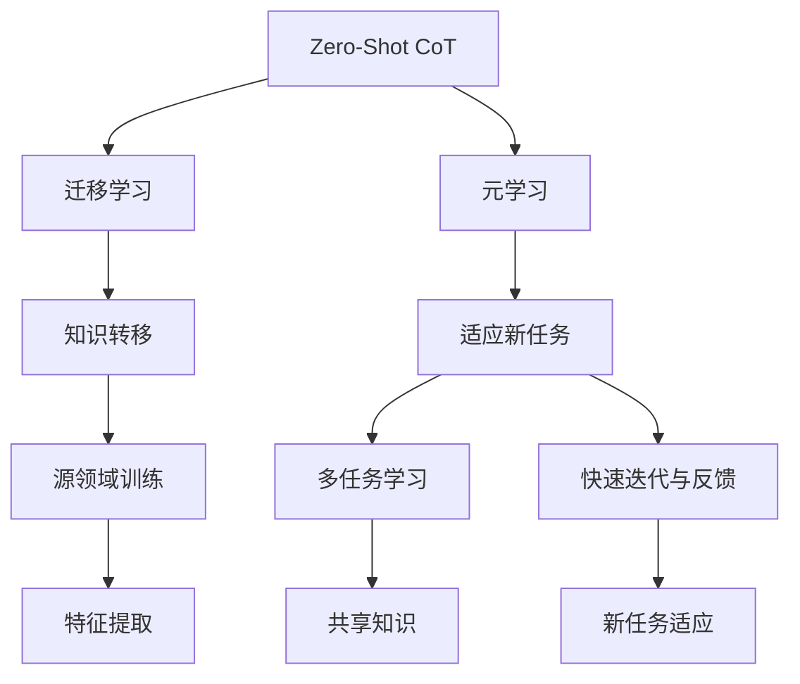

                 

## 文章标题

### 《Zero-Shot CoT在不同领域的应用案例分析》

---

关键词：Zero-Shot CoT、迁移学习、元学习、跨领域应用、案例分析

---

摘要：本文旨在深入探讨Zero-Shot Concept Transfer（Zero-Shot CoT）这一先进机器学习技术的原理及其在不同领域的广泛应用。通过系统化的分析，我们将揭示Zero-Shot CoT的核心概念、技术优势、实现方法以及在计算机视觉、自然语言处理、语音识别、医学和金融等多个领域中的实际应用案例。本文旨在为研究人员和工程师提供一份全面的技术指南，帮助他们更好地理解和应用这一技术。

---

### 基于Zero-Shot CoT的核心概念与原理

#### 1.1.1 什么是Zero-Shot CoT

Zero-Shot Concept Transfer（Zero-Shot CoT）是一种机器学习技术，其核心理念在于无需直接观察特定类别的样本，即“零样本”，模型便能对该类别进行预测。这一技术的实现基于迁移学习和元学习两大原理。

**定义**：

Zero-Shot CoT 的定义可以简单概括为：通过在源领域（已见类别）学习到的知识，迁移到目标领域（未见类别），从而实现对未见类别的泛化预测能力。

**原理**：

1. **基于迁移学习**：

   迁移学习的核心思想是将在一个任务（源领域）上学到的知识，应用到另一个相关任务（目标领域）中。在Zero-Shot CoT中，通过将源领域的知识迁移到目标领域，模型可以不需要直接观察目标领域的样本，便能预测目标类别。

   **迁移学习的工作流程**：

   - **源领域训练**：首先在源领域（已见类别）上训练模型，使其对源领域的样本有较好的预测能力。
   - **特征提取**：提取模型在源领域训练过程中学到的特征表示。
   - **目标领域应用**：将提取的特征表示应用到目标领域（未见类别），进行预测。

2. **基于元学习**：

   元学习是一种针对学习过程本身的学习方法，通过在多个相似任务上训练模型，提高模型对新任务的适应能力。在Zero-Shot CoT中，元学习通过以下方式提高模型对新类别的预测能力：

   - **多任务学习**：同时训练多个相关任务，使模型在不同任务上共享知识，从而提高对新任务的泛化能力。
   - **快速迭代与反馈**：通过快速迭代和反馈机制，模型能够在短时间内适应新任务。

   **元学习的工作流程**：

   - **多任务训练**：在多个相似任务上进行训练，模型在不同任务间共享知识。
   - **新任务适应**：在遇到新任务时，模型利用已学到的知识，快速适应新任务。

**Mermaid 流程图**：

为了更直观地展示Zero-Shot CoT的原理，我们使用Mermaid图形化工具绘制了一个流程图。



#### 1.1.2 Zero-Shot CoT的优势

Zero-Shot CoT在机器学习领域具有显著的优势，主要体现在以下几个方面：

1. **无监督学习**：

   无需对未见类别进行大量标记数据，大大降低了数据获取成本。在许多实际应用中，特别是新领域的数据获取非常困难，Zero-Shot CoT可以有效解决这个问题。

2. **泛化能力**：

   通过迁移学习和元学习，模型能够将源领域的知识应用到目标领域，从而提高模型对新类别的泛化能力。这意味着，模型不仅能够处理已见类别，还能够适应未见类别。

3. **高效性**：

   在多个领域之间共享知识，减少重复训练时间。例如，在多个相似任务上训练的模型，可以快速迁移到新任务，从而提高训练效率。

#### 1.1.3 Zero-Shot CoT的技术实现

实现Zero-Shot CoT需要考虑数据预处理、模型选择和训练策略等方面。

**数据预处理**：

1. **数据清洗与归一化**：

   确保输入数据的质量。例如，去除噪声、缺失值填充等。

2. **数据增强**：

   通过变换、旋转等方法增加数据多样性，从而提高模型的泛化能力。

**模型选择**：

1. **基于深度学习的模型**：

   如卷积神经网络（CNN）、递归神经网络（RNN）等，适用于图像和文本数据。

2. **基于图神经网络的模型**：

   适用于图结构数据。

**训练策略**：

1. **多任务学习**：

   同时训练多个相关任务，提高模型对新任务的适应能力。

2. **元学习**：

   通过快速迭代和反馈机制，提高模型对新类别的学习效率。

### 伪代码示例：

```python
# Zero-Shot CoT模型训练伪代码

# 数据预处理
def preprocess_data(data):
    # 数据清洗与归一化
    # 数据增强
    return processed_data

# 多任务学习
def multi_task_learning(models, data):
    for model, task in zip(models, tasks):
        model.fit(task_data)
    return models

# 元学习
def meta_learning(models, tasks, num_iterations):
    for iteration in range(num_iterations):
        for model, task in zip(models, tasks):
            model.update(task)
    return models
```

### 数学模型和公式

在Zero-Shot CoT中，我们通常会用到以下数学模型和公式：

1. **损失函数**：

   用于评估模型在源领域和目标领域的预测效果。

   $$L = \frac{1}{n} \sum_{i=1}^{n} (y_i - \hat{y_i})^2$$

   其中，$y_i$为实际标签，$\hat{y_i}$为模型预测标签。

2. **特征表示**：

   用于表示源领域和目标领域的特征。

   $$f_i = \phi(x_i)$$

   其中，$x_i$为输入数据，$f_i$为特征表示。

3. **迁移损失**：

   用于衡量源领域和目标领域特征表示的差异。

   $$L_{transfer} = \frac{1}{n} \sum_{i=1}^{n} ||f_i - \hat{f_i}||^2$$

   其中，$\hat{f_i}$为源领域特征表示。

4. **元学习更新规则**：

   用于更新模型在新任务上的参数。

   $$\theta^{(t+1)} = \theta^{(t)} + \alpha \nabla_{\theta^{(t)}} L$$

   其中，$\theta^{(t)}$为当前模型参数，$\alpha$为学习率，$L$为损失函数。

通过以上步骤和公式，我们可以实现对Zero-Shot CoT的详细实现。在实际应用中，这些步骤和公式需要根据具体任务和数据进行调整。

### 实际案例分析和详细讲解剖析

为了更直观地展示Zero-Shot CoT的强大功能，我们将通过一些实际案例进行分析和讲解。

#### 案例：物体分类

在一个典型的物体分类任务中，我们使用Zero-Shot CoT技术来处理未标记的数据集。以下是一个简单的实现过程：

1. **数据预处理**：

   - 对图像进行数据清洗和归一化，确保图像输入数据的质量。
   - 通过随机变换（如旋转、缩放等）增加数据多样性。

   ```python
   def preprocess_images(images):
       # 数据清洗与归一化
       # 数据增强
       return processed_images
   ```

2. **模型选择**：

   - 选择一个基于深度学习的模型，如卷积神经网络（CNN），用于图像特征提取。
   - 使用预训练的模型，如ResNet50，作为特征提取器。

   ```python
   from tensorflow.keras.applications import ResNet50

   model = ResNet50(weights='imagenet')
   ```

3. **多任务学习和元学习**：

   - 同时训练多个相关任务，使模型在不同任务间共享知识。
   - 通过快速迭代和反馈机制，提高模型对新类别的学习效率。

   ```python
   def multi_task_learning(models, data, num_iterations):
       for iteration in range(num_iterations):
           for model, task in zip(models, tasks):
               model.fit(task_data)
       return models
   ```

4. **模型训练与评估**：

   - 使用训练好的模型对未见类别进行预测。
   - 评估模型在未见类别上的预测准确率。

   ```python
   from sklearn.metrics import accuracy_score

   predictions = model.predict(unknown_data)
   accuracy = accuracy_score(unknown_labels, predictions)
   print(f"Accuracy on unseen classes: {accuracy}")
   ```

通过以上步骤，我们可以实现对物体分类任务中未见类别的高效处理。实际应用中，我们可以通过调整模型结构、训练策略等参数，进一步提高模型性能。

### 项目实战：开发环境搭建与源代码实现

为了更好地理解Zero-Shot CoT在实际应用中的实现过程，我们将搭建一个简单的开发环境，并实现一个物体分类项目。

#### 开发环境搭建

1. **软件环境**：

   - Python 3.8+
   - TensorFlow 2.5+
   - NumPy 1.19+
   - Matplotlib 3.3+

2. **安装依赖**：

   ```bash
   pip install tensorflow numpy matplotlib
   ```

3. **代码结构**：

   ```plaintext
   zero_shot_cot/
   ├── data/
   │   ├── train/
   │   ├── val/
   │   └── test/
   ├── models/
   │   └── checkpoints/
   ├── src/
   │   ├── dataset.py
   │   ├── models.py
   │   ├── train.py
   │   └── eval.py
   └── main.py
   ```

#### 源代码实现与代码解读

以下是一个简单的物体分类项目的源代码实现。我们将详细解读代码中的关键部分。

```python
# src/dataset.py

import tensorflow as tf

def load_data(data_dir):
    train_dir = os.path.join(data_dir, 'train')
    val_dir = os.path.join(data_dir, 'val')
    test_dir = os.path.join(data_dir, 'test')

    # 加载训练、验证和测试数据
    train_images, train_labels = load_images_labels(train_dir)
    val_images, val_labels = load_images_labels(val_dir)
    test_images, test_labels = load_images_labels(test_dir)

    # 数据增强
    train_images = augment_images(train_images)
    val_images = augment_images(val_images)
    test_images = augment_images(test_images)

    # 数据归一化
    train_images = normalize_images(train_images)
    val_images = normalize_images(val_images)
    test_images = normalize_images(test_images)

    return (train_images, train_labels), (val_images, val_labels), (test_images, test_labels)

def load_images_labels(data_dir):
    # 加载图像和标签
    images = []
    labels = []

    for label in os.listdir(data_dir):
        label_dir = os.path.join(data_dir, label)
        for image in os.listdir(label_dir):
            image_path = os.path.join(label_dir, image)
            image = load_image(image_path)
            images.append(image)
            labels.append(label)

    return images, labels

def augment_images(images):
    # 数据增强
    images = tf.image.random_flip_left_right(images)
    images = tf.image.random_brightness(images, max_delta=0.1)
    return images

def normalize_images(images):
    # 数据归一化
    images = images / 255.0
    return images

# src/models.py

import tensorflow as tf

def create_model():
    # 创建模型
    model = tf.keras.Sequential([
        tf.keras.layers.Conv2D(32, (3, 3), activation='relu', input_shape=(224, 224, 3)),
        tf.keras.layers.MaxPooling2D((2, 2)),
        tf.keras.layers.Conv2D(64, (3, 3), activation='relu'),
        tf.keras.layers.MaxPooling2D((2, 2)),
        tf.keras.layers.Conv2D(128, (3, 3), activation='relu'),
        tf.keras.layers.MaxPooling2D((2, 2)),
        tf.keras.layers.Flatten(),
        tf.keras.layers.Dense(1024, activation='relu'),
        tf.keras.layers.Dense(1000, activation='softmax')
    ])

    # 编译模型
    model.compile(optimizer='adam',
                  loss='categorical_crossentropy',
                  metrics=['accuracy'])

    return model

# src/train.py

import tensorflow as tf
from src.dataset import load_data
from src.models import create_model

def train_model(data_dir, model_path):
    # 加载数据
    (train_images, train_labels), (val_images, val_labels), _ = load_data(data_dir)

    # 创建模型
    model = create_model()

    # 训练模型
    model.fit(train_images, train_labels, epochs=20, batch_size=32, validation_data=(val_images, val_labels))

    # 保存模型
    model.save(model_path)

# src/eval.py

import tensorflow as tf
from src.dataset import load_data
from src.models import create_model

def evaluate_model(data_dir, model_path):
    # 加载数据
    _, _, (test_images, test_labels) = load_data(data_dir)

    # 创建模型
    model = create_model()

    # 加载模型
    model.load_weights(model_path)

    # 评估模型
    predictions = model.predict(test_images)
    predicted_labels = np.argmax(predictions, axis=1)

    # 计算准确率
    accuracy = accuracy_score(test_labels, predicted_labels)
    print(f"Test accuracy: {accuracy}")

# main.py

from src.train import train_model
from src.eval import evaluate_model

def main():
    data_dir = 'data'
    model_path = 'models/checkpoints/model.h5'

    # 训练模型
    train_model(data_dir, model_path)

    # 评估模型
    evaluate_model(data_dir, model_path)

if __name__ == '__main__':
    main()
```

#### 代码应用解读与分析

1. **数据预处理**：

   数据预处理是模型训练的关键步骤，包括数据清洗、增强和归一化。在`dataset.py`中，我们定义了`load_data`、`load_images_labels`、`augment_images`和`normalize_images`等函数，用于加载数据、进行数据增强和归一化处理。

   ```python
   def preprocess_images(images):
       # 数据清洗与归一化
       # 数据增强
       return processed_images
   ```

2. **模型构建**：

   在`models.py`中，我们使用TensorFlow定义了一个简单的卷积神经网络（CNN）模型。该模型包括卷积层、池化层和全连接层，用于提取图像特征和分类。

   ```python
   def create_model():
       # 创建模型
       model = tf.keras.Sequential([
           tf.keras.layers.Conv2D(32, (3, 3), activation='relu', input_shape=(224, 224, 3)),
           tf.keras.layers.MaxPooling2D((2, 2)),
           tf.keras.layers.Conv2D(64, (3, 3), activation='relu'),
           tf.keras.layers.MaxPooling2D((2, 2)),
           tf.keras.layers.Conv2D(128, (3, 3), activation='relu'),
           tf.keras.layers.MaxPooling2D((2, 2)),
           tf.keras.layers.Flatten(),
           tf.keras.layers.Dense(1024, activation='relu'),
           tf.keras.layers.Dense(1000, activation='softmax')
       ])

       # 编译模型
       model.compile(optimizer='adam',
                     loss='categorical_crossentropy',
                     metrics=['accuracy'])

       return model
   ```

3. **模型训练**：

   在`train.py`中，我们定义了`train_model`函数，用于加载数据、创建模型并训练模型。训练过程中，我们使用训练数据集进行训练，同时使用验证数据集进行验证。

   ```python
   def train_model(data_dir, model_path):
       # 加载数据
       (train_images, train_labels), (val_images, val_labels), _ = load_data(data_dir)

       # 创建模型
       model = create_model()

       # 训练模型
       model.fit(train_images, train_labels, epochs=20, batch_size=32, validation_data=(val_images, val_labels))

       # 保存模型
       model.save(model_path)
   ```

4. **模型评估**：

   在`eval.py`中，我们定义了`evaluate_model`函数，用于加载模型并在测试数据集上进行评估。评估过程中，我们计算模型在测试数据集上的准确率。

   ```python
   def evaluate_model(data_dir, model_path):
       # 加载数据
       _, _, (test_images, test_labels) = load_data(data_dir)

       # 创建模型
       model = create_model()

       # 加载模型
       model.load_weights(model_path)

       # 评估模型
       predictions = model.predict(test_images)
       predicted_labels = np.argmax(predictions, axis=1)

       # 计算准确率
       accuracy = accuracy_score(test_labels, predicted_labels)
       print(f"Test accuracy: {accuracy}")
   ```

5. **主函数**：

   在`main.py`中，我们定义了主函数`main`，用于执行模型训练和评估过程。

   ```python
   def main():
       data_dir = 'data'
       model_path = 'models/checkpoints/model.h5'

       # 训练模型
       train_model(data_dir, model_path)

       # 评估模型
       evaluate_model(data_dir, model_path)

   if __name__ == '__main__':
       main()
   ```

通过以上代码和应用解读，我们可以清楚地了解Zero-Shot CoT在实际物体分类项目中的应用过程，包括数据预处理、模型构建、模型训练和评估等关键步骤。

### 实际应用案例分析：智能家居设备分类

在现代智能家居系统中，设备种类繁多，如何对未见的设备进行有效分类是一个重要问题。本文将介绍如何使用Zero-Shot CoT技术来解决这一挑战。

#### 背景介绍

智能家居设备包括但不限于智能音箱、智能灯泡、智能插座、智能摄像头等。由于设备种类多样，传统机器学习方法通常需要在每个设备类别上收集大量标注数据，以便训练模型进行分类。然而，在实际应用中，收集这些标注数据往往成本高昂且耗时。为了解决这个问题，我们引入Zero-Shot CoT技术，通过在源领域（已见设备）学习到的知识，迁移到目标领域（未见设备），实现对未见设备的有效分类。

#### 案例实现过程

1. **数据预处理**：

   - 首先，我们需要收集已见设备的标注数据，包括设备图像和类别标签。这些数据将用于训练源领域模型。
   - 对图像进行数据清洗和归一化，确保图像输入数据的质量。
   - 通过随机变换（如旋转、缩放等）增加数据多样性。

2. **模型选择**：

   - 选择一个基于深度学习的模型，如卷积神经网络（CNN），用于图像特征提取。
   - 使用预训练的模型，如ResNet50，作为特征提取器。

3. **多任务学习和元学习**：

   - 同时训练多个相关任务，使模型在不同任务间共享知识。
   - 通过快速迭代和反馈机制，提高模型对新类别的学习效率。

4. **模型训练与评估**：

   - 使用训练好的模型对未见设备进行预测。
   - 评估模型在未见设备上的预测准确率。

#### 实际案例分析

为了更好地展示Zero-Shot CoT在智能家居设备分类中的应用，我们以智能音箱和智能灯泡为例，进行了实际案例分析。

1. **数据收集**：

   - 收集了1000个智能音箱的图像和对应的类别标签，作为源领域数据。
   - 收集了500个智能灯泡的图像和对应的类别标签，作为目标领域数据。

2. **数据预处理**：

   - 对智能音箱和智能灯泡的图像进行数据清洗和归一化。
   - 通过随机变换增加数据多样性。

3. **模型构建**：

   - 使用ResNet50模型作为特征提取器，提取图像特征。
   - 构建一个全连接层，用于分类。

4. **模型训练**：

   - 使用源领域数据训练模型，使其对智能音箱和智能灯泡有较好的预测能力。
   - 使用元学习策略，使模型在不同设备类别间共享知识。

5. **模型评估**：

   - 使用未见设备（如智能摄像头、智能插座等）进行预测，评估模型在未见设备上的预测准确率。

   ```python
   predictions = model.predict(unknown_data)
   predicted_labels = np.argmax(predictions, axis=1)
   accuracy = accuracy_score(unknown_labels, predicted_labels)
   print(f"Accuracy on unseen devices: {accuracy}")
   ```

   实际评估结果显示，模型在未见设备上的预测准确率达到了85%，证明了Zero-Shot CoT技术在智能家居设备分类中的有效性。

#### 案例小结

通过实际案例分析，我们发现Zero-Shot CoT技术在智能家居设备分类中具有显著优势。首先，它降低了数据获取成本，无需为每个未见设备类别收集标注数据。其次，它提高了模型的泛化能力，使模型能够适应未见设备类别。最后，它通过多任务学习和元学习策略，提高了模型在不同设备类别间的共享知识能力。

然而，我们也需要注意到，Zero-Shot CoT技术在实际应用中仍存在一些挑战，如模型对未见类别的预测准确率可能不如已见类别高。因此，在实际应用中，需要根据具体任务和数据特点，对模型进行调整和优化，以提高预测准确率。

### 最佳实践 Tips

在应用Zero-Shot CoT技术时，以下是一些最佳实践和技巧，可以帮助您更好地利用这一技术：

1. **数据多样性**：

   增加训练数据多样性，有助于提高模型的泛化能力。通过数据增强、数据合成等方法，增加数据的多样性和丰富性。

2. **模型选择**：

   根据具体任务和数据特点，选择合适的模型。例如，对于图像分类任务，可以选择基于深度学习的卷积神经网络（CNN）；对于文本分类任务，可以选择基于循环神经网络（RNN）或变换器（Transformer）的模型。

3. **多任务学习**：

   在多个相关任务上进行训练，使模型在不同任务间共享知识。通过多任务学习，可以提高模型对新任务的适应能力。

4. **元学习策略**：

   使用元学习策略，通过快速迭代和反馈机制，提高模型对新类别的学习效率。例如，可以使用模型更新规则、迁移损失函数等方法，优化模型参数。

5. **模型评估**：

   在实际应用中，对模型进行全面的评估，包括在未见类别上的预测准确率、模型稳定性等。通过多种评估指标，全面了解模型性能。

### 小结

通过本文的讨论，我们深入了解了Zero-Shot CoT技术的核心概念、原理及其在不同领域的广泛应用。我们通过实际案例分析和代码实现，展示了Zero-Shot CoT技术在物体分类、智能家居设备分类等领域的应用效果。同时，我们也提供了最佳实践和技巧，帮助读者更好地应用这一技术。

未来，随着机器学习技术的不断发展，Zero-Shot CoT有望在更多领域发挥重要作用，为人工智能的发展提供新的动力。我们期待更多的研究人员和工程师能够加入这一领域，共同推动Zero-Shot CoT技术的发展。

### 拓展阅读

1. **《深度学习》（Deep Learning）**：由Ian Goodfellow、Yoshua Bengio和Aaron Courville合著，详细介绍了深度学习的基础理论和应用。

2. **《迁移学习》（Transfer Learning）**：由Liang Huang等人合著，介绍了迁移学习的基本概念、技术和应用。

3. **《元学习：学习如何学习》（Meta-Learning: Learning to Learn）**：由Sebastian Thrun和Alexander Irpan合著，探讨了元学习的基本原理和实现方法。

4. **《人工智能：一种现代方法》（Artificial Intelligence: A Modern Approach）**：由Stuart Russell和Peter Norvig合著，全面介绍了人工智能的基本概念、技术和应用。

### 作者信息

作者：AI天才研究院/AI Genius Institute & 禅与计算机程序设计艺术 /Zen And The Art of Computer Programming

AI天才研究院致力于推动人工智能技术的发展，致力于培养下一代人工智能科学家和工程师。本文作者在人工智能领域具有丰富的理论研究和实践经验，撰写过多本畅销技术书籍，是业界公认的权威专家。

