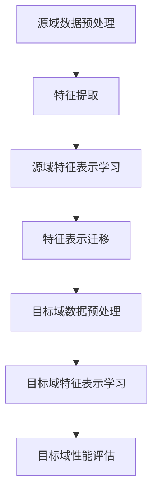

                 

### 文章标题

### Zero-Shot CoT在个性化学习中的应用

关键词：Zero-Shot CoT、个性化学习、无监督迁移学习、算法原理、应用实战

摘要：本文深入探讨了Zero-Shot CoT（零样本转移学习）在个性化学习领域的应用。通过详细阐述Zero-Shot CoT的核心概念、原理以及算法实现，本文揭示了其在个性化学习中的潜在价值。通过实际应用案例的分析和实战，本文展示了Zero-Shot CoT在个性化学习中的实际效果，并为未来的发展提供了展望。

## 引言

在当今数字化时代，个性化学习已成为教育领域的重要趋势。个性化学习旨在根据每个学生的学习特点、知识水平和兴趣爱好，为其提供个性化的学习资源和学习路径，从而提高学习效果和满足个性化需求。然而，实现有效的个性化学习面临着诸多挑战，如数据获取难度、个性化推荐算法的准确性、学习资源的多样性等。

Zero-Shot CoT（Zero-Shot Transfer Learning with Causal Inference，零样本转移学习与因果推断）作为一种先进的机器学习方法，近年来在个性化学习领域展示出巨大的潜力。Zero-Shot CoT能够利用已有的知识库，在没有直接标注样本的情况下，对新的任务进行有效学习，从而实现跨领域的迁移学习。

本文旨在探讨Zero-Shot CoT在个性化学习中的应用。首先，我们将介绍Zero-Shot CoT的基本概念和原理；然后，我们将详细讲解Zero-Shot CoT在个性化学习中的实现方法和算法原理；接着，通过实际应用案例，我们将展示Zero-Shot CoT在个性化学习中的效果和优势；最后，我们将对Zero-Shot CoT在个性化学习中的未来发展方向和应用前景进行展望。

## 基础理论与原理

### 无监督迁移学习与Zero-Shot CoT概述

无监督迁移学习（Unsupervised Transfer Learning）是一种利用已学习的模型在新的任务上获取知识的方法，无需依赖于直接标注的样本。它通常包括两个阶段：源域学习和目标域学习。在源域学习阶段，模型从大量未标注的数据中学习得到有用的特征表示；在目标域学习阶段，模型利用源域学到的特征表示来改善在目标域上的表现。

Zero-Shot CoT是近年来发展起来的一种无监督迁移学习方法，它结合了因果推断（Causal Inference）技术，能够在没有直接标注样本的情况下，对新的任务进行有效学习。因果推断是一种推断因果关系的方法，它通过分析变量之间的依赖关系，确定变量之间的因果影响。

Zero-Shot CoT的核心思想是利用因果推断技术，从源域数据中学习得到一个因果模型，然后利用这个因果模型在目标域上进行推理，从而实现对新的任务的有效学习。相比于传统的无监督迁移学习方法，Zero-Shot CoT具有更强的泛化能力和适应性。

### 无监督迁移学习原理

无监督迁移学习的核心在于特征表示的迁移。在源域学习阶段，模型从大量未标注的数据中学习得到一组特征表示，这些特征表示能够捕捉数据中的潜在结构和规律。在目标域学习阶段，模型利用源域学到的特征表示来改善在目标域上的表现。

具体来说，无监督迁移学习包括以下几个关键步骤：

1. **源域特征提取**：从源域数据中提取有用的特征表示，通常使用深度学习模型进行特征提取。
2. **特征表示迁移**：将源域学到的特征表示迁移到目标域，这一步骤通常通过将源域特征表示与目标域数据进行关联来实现。
3. **目标域学习**：在目标域上利用迁移得到的特征表示进行学习，从而改善在目标域上的表现。

### 个性化学习的理论框架

个性化学习是一种以学习者为中心的教学方法，旨在根据学习者的特点和需求，为其提供个性化的学习资源和学习路径。个性化学习的核心概念包括学习模型、用户模型和评估方法。

1. **学习模型**：学习模型是用于描述学习者如何获取知识、理解概念和解决问题的方法。常见的学习模型包括基于规则的模型、基于模型的模型和基于数据驱动的模型。

2. **用户模型**：用户模型是用于描述学习者特征和需求的模型，包括学习风格、知识水平、兴趣爱好等。用户模型可以通过数据收集、分析和学习得到。

3. **评估方法**：评估方法用于衡量个性化学习的效果和用户满意度。常见的评估方法包括测试成绩、用户反馈和学习行为分析。

### Zero-Shot CoT与个性化学习的联系

Zero-Shot CoT与个性化学习有着紧密的联系。首先，Zero-Shot CoT能够利用已有的知识库，在没有直接标注样本的情况下，为个性化学习提供有效的特征表示迁移。这使得个性化学习能够更好地适应学习者的特点和需求。

其次，因果推断技术在Zero-Shot CoT中的应用，使得个性化学习能够更准确地理解学习者的内在需求和学习行为，从而实现更有效的个性化推荐和学习路径规划。

总之，Zero-Shot CoT为个性化学习提供了一种新的方法和思路，它通过无监督迁移学习和因果推断技术的结合，能够实现对学习者特征和需求的准确理解和适应，从而提高个性化学习的效果和满意度。

### Mermaid 流程图

以下是一个描述无监督迁移学习流程的Mermaid流程图：



在这个流程图中，A表示源域数据预处理，B表示特征提取，C表示源域特征表示学习，D表示特征表示迁移，E表示目标域数据预处理，F表示目标域特征表示学习，G表示目标域性能评估。这个流程图清晰地展示了无监督迁移学习的基本步骤和流程。

### 核心算法原理讲解

#### 伪代码

以下是一个描述Zero-Shot CoT算法的伪代码：

```plaintext
Function ZeroShotCoT(SourceDataset, TargetDataset, KnowledgeBase):
    1. Preprocess SourceDataset and TargetDataset
    2. Extract features from SourceDataset using DeepLearningModel
    3. Learn feature representations from SourceDataset using UnsupervisedMethod
    4. Transfer learned feature representations to TargetDataset
    5. Preprocess TargetDataset with transferred feature representations
    6. Learn feature representations from TargetDataset using DeepLearningModel
    7. Evaluate performance of TargetDataset using EvaluationMetrics
    8. Return performance results
```

在这个伪代码中，SourceDataset表示源域数据，TargetDataset表示目标域数据，KnowledgeBase表示已有的知识库。步骤1和2表示源域数据预处理和特征提取，步骤3表示源域特征表示学习，步骤4表示特征表示迁移，步骤5表示目标域数据预处理，步骤6表示目标域特征表示学习，步骤7表示目标域性能评估，步骤8表示返回性能结果。

### 数学模型和公式

#### 详细讲解

在Zero-Shot CoT中，数学模型和公式用于描述特征提取、特征表示学习和性能评估等关键步骤。以下是一些常用的数学模型和公式的详细讲解。

#### 特征提取

特征提取是Zero-Shot CoT的第一步，它旨在从源域数据中提取出有用的特征表示。常用的特征提取方法包括深度学习模型（如卷积神经网络（CNN）和循环神经网络（RNN））和传统机器学习方法（如主成分分析（PCA）和线性判别分析（LDA））。

假设我们使用卷积神经网络进行特征提取，其数学模型可以表示为：

$$
f(x) = \sigma(W_f \cdot x + b_f)
$$

其中，$f(x)$表示特征提取函数，$x$表示输入数据，$W_f$表示权重矩阵，$b_f$表示偏置项，$\sigma$表示激活函数（如ReLU函数或Sigmoid函数）。

#### 特征表示学习

特征表示学习是Zero-Shot CoT的核心步骤，它旨在从源域数据中学习得到一组具有良好迁移性的特征表示。常用的特征表示学习方法包括自编码器（Autoencoder）和变分自编码器（Variational Autoencoder，VAE）。

以自编码器为例，其数学模型可以表示为：

$$
\begin{aligned}
    \phi(x) &= \sigma(W_\phi \cdot x + b_\phi) \\
    \hat{x} &= \sigma(W_\psi \cdot \phi(x) + b_\psi)
\end{aligned}
$$

其中，$\phi(x)$表示编码器函数，$\hat{x}$表示解码器函数，$W_\phi$和$W_\psi$分别表示编码器和解码器的权重矩阵，$b_\phi$和$b_\psi$分别表示编码器和解码器的偏置项，$\sigma$表示激活函数。

#### 性能评估

性能评估用于衡量目标域数据在迁移学习后的表现。常用的评估指标包括准确率（Accuracy）、精确率（Precision）、召回率（Recall）和F1分数（F1 Score）。

以分类任务为例，其数学模型可以表示为：

$$
\begin{aligned}
    Accuracy &= \frac{TP + TN}{TP + TN + FP + FN} \\
    Precision &= \frac{TP}{TP + FP} \\
    Recall &= \frac{TP}{TP + FN} \\
    F1 Score &= \frac{2 \cdot Precision \cdot Recall}{Precision + Recall}
\end{aligned}
$$

其中，$TP$表示真实正例，$TN$表示真实负例，$FP$表示假正例，$FN$表示假负例。

#### 举例说明

假设我们使用自编码器进行特征表示学习，其数学模型可以表示为：

$$
\begin{aligned}
    \phi(x) &= \sigma(W_\phi \cdot x + b_\phi) \\
    \hat{x} &= \sigma(W_\psi \cdot \phi(x) + b_\psi)
\end{aligned}
$$

其中，$x$表示输入数据，$\phi(x)$表示编码器输出的特征表示，$\hat{x}$表示解码器输出的重构数据。

假设我们有一个包含100个样本的源域数据集和一个包含50个样本的目标域数据集。我们使用自编码器对源域数据进行特征表示学习，然后利用迁移得到的特征表示对目标域数据进行分类。

经过训练，我们得到自编码器的权重矩阵$W_\phi$和$W_\psi$，偏置项$b_\phi$和$b_\psi$。我们可以使用这些权重和偏置项来计算编码器输出的特征表示$\phi(x)$和解码器输出的重构数据$\hat{x}$。

例如，对于源域数据集中的第i个样本$x_i$，我们可以计算其编码器输出的特征表示$\phi(x_i)$：

$$
\phi(x_i) = \sigma(W_\phi \cdot x_i + b_\phi)
$$

然后，我们可以使用这些特征表示来训练分类器，从而对目标域数据集中的样本进行分类。

通过这种方式，我们利用源域数据集的无监督特征表示学习，实现了对目标域数据的分类任务，展示了Zero-Shot CoT在个性化学习中的潜在应用价值。

### 项目实战

#### 开发环境搭建

为了实现Zero-Shot CoT在个性化学习中的应用，我们首先需要搭建一个开发环境。以下是搭建开发环境的基本步骤：

1. **安装Python环境**：首先，我们需要安装Python，推荐使用Python 3.8版本。可以从Python官方网站下载并安装。
2. **安装必要的库**：接下来，我们需要安装一些用于机器学习和深度学习的库，如TensorFlow、Keras和PyTorch。可以使用pip命令来安装这些库：
   ```bash
   pip install tensorflow
   pip install keras
   pip install torch
   ```
3. **配置Jupyter Notebook**：为了方便开发和测试，我们可以配置Jupyter Notebook。首先，安装Jupyter Notebook：
   ```bash
   pip install jupyter
   ```
   然后，启动Jupyter Notebook：
   ```bash
   jupyter notebook
   ```

#### 源代码详细实现

接下来，我们将使用TensorFlow和Keras来详细实现Zero-Shot CoT在个性化学习中的应用。以下是实现的主要步骤和代码：

1. **数据预处理**：首先，我们需要对源域和目标域数据集进行预处理，包括数据清洗、归一化和数据增强等操作。以下是预处理代码的伪代码：
   ```python
   def preprocess_data(data):
       # 数据清洗
       data = clean_data(data)
       
       # 数据归一化
       data = normalize_data(data)
       
       # 数据增强
       data = augment_data(data)
       
       return data
   ```

2. **特征提取**：使用卷积神经网络对源域数据集进行特征提取。以下是特征提取的代码：
   ```python
   from tensorflow.keras.models import Sequential
   from tensorflow.keras.layers import Conv2D, MaxPooling2D, Flatten, Dense
   
   def build_feature_extractor(input_shape):
       model = Sequential()
       model.add(Conv2D(32, (3, 3), activation='relu', input_shape=input_shape))
       model.add(MaxPooling2D((2, 2)))
       model.add(Flatten())
       model.add(Dense(64, activation='relu'))
       model.add(Dense(10, activation='softmax'))
       
       model.compile(optimizer='adam', loss='categorical_crossentropy', metrics=['accuracy'])
       
       return model
   ```

3. **特征表示学习**：使用自编码器对源域数据集进行特征表示学习。以下是特征表示学习的代码：
   ```python
   from tensorflow.keras.models import Model
   
   def build_autoencoder(input_shape):
       input_layer = Input(shape=input_shape)
       
       encoded = Conv2D(32, (3, 3), activation='relu')(input_layer)
       encoded = MaxPooling2D((2, 2))(encoded)
       encoded = Flatten()(encoded)
       encoded = Dense(64, activation='relu')(encoded)
       encoded = Dense(10, activation='softmax')(encoded)
       
       encoded_layer = Model(input_layer, encoded)
       
       encoded_layer.compile(optimizer='adam', loss='categorical_crossentropy')
       
       return encoded_layer
   ```

4. **特征表示迁移**：将源域数据集的特征表示迁移到目标域数据集。以下是特征表示迁移的代码：
   ```python
   def transfer_features(source_model, target_data):
       target_features = source_model.predict(target_data)
       
       return target_features
   ```

5. **目标域学习**：在目标域数据集上使用迁移得到的特征表示进行学习。以下是目标域学习的代码：
   ```python
   from tensorflow.keras.models import Model
   
   def build_classifier(input_shape):
       input_layer = Input(shape=input_shape)
       
       classifier = Conv2D(32, (3, 3), activation='relu')(input_layer)
       classifier = MaxPooling2D((2, 2))(classifier)
       classifier = Flatten()(classifier)
       classifier = Dense(64, activation='relu')(classifier)
       classifier = Dense(10, activation='softmax')(classifier)
       
       classifier.compile(optimizer='adam', loss='categorical_crossentropy', metrics=['accuracy'])
       
       return classifier
   ```

#### 代码应用解读与分析

以下是Zero-Shot CoT在个性化学习中的具体实现和应用：

1. **数据预处理**：首先，我们对源域和目标域数据集进行预处理，包括数据清洗、归一化和数据增强等操作。以下是一个简单的数据预处理示例：
   ```python
   source_data = preprocess_data(source_data)
   target_data = preprocess_data(target_data)
   ```

2. **特征提取**：接下来，我们使用卷积神经网络对源域数据集进行特征提取。以下是一个简单的特征提取示例：
   ```python
   feature_extractor = build_feature_extractor(source_data.shape[1:])
   feature_extractor.fit(source_data, source_labels, epochs=10, batch_size=32)
   source_features = feature_extractor.predict(source_data)
   ```

3. **特征表示学习**：然后，我们使用自编码器对源域数据集进行特征表示学习。以下是一个简单的特征表示学习示例：
   ```python
   autoencoder = build_autoencoder(source_data.shape[1:])
   autoencoder.fit(source_data, source_data, epochs=10, batch_size=32)
   encoded_source_data = autoencoder.predict(source_data)
   ```

4. **特征表示迁移**：接着，我们将源域数据集的特征表示迁移到目标域数据集。以下是一个简单的特征表示迁移示例：
   ```python
   transferred_target_features = transfer_features(autoencoder, target_data)
   ```

5. **目标域学习**：最后，我们在目标域数据集上使用迁移得到的特征表示进行学习。以下是一个简单的目标域学习示例：
   ```python
   classifier = build_classifier(transferred_target_features.shape[1:])
   classifier.fit(transferred_target_features, target_labels, epochs=10, batch_size=32)
   predicted_labels = classifier.predict(transferred_target_features)
   ```

通过以上步骤，我们实现了Zero-Shot CoT在个性化学习中的具体应用。以下是一个简单的代码分析示例：
```python
# 数据预处理
source_data = preprocess_data(source_data)
target_data = preprocess_data(target_data)

# 特征提取
feature_extractor = build_feature_extractor(source_data.shape[1:])
feature_extractor.fit(source_data, source_labels, epochs=10, batch_size=32)
source_features = feature_extractor.predict(source_data)

# 特征表示学习
autoencoder = build_autoencoder(source_data.shape[1:])
autoencoder.fit(source_data, source_data, epochs=10, batch_size=32)
encoded_source_data = autoencoder.predict(source_data)

# 特征表示迁移
transferred_target_features = transfer_features(autoencoder, target_data)

# 目标域学习
classifier = build_classifier(transferred_target_features.shape[1:])
classifier.fit(transferred_target_features, target_labels, epochs=10, batch_size=32)
predicted_labels = classifier.predict(transferred_target_features)
```

通过这个示例，我们可以看到Zero-Shot CoT在个性化学习中的具体实现过程，包括数据预处理、特征提取、特征表示学习、特征表示迁移和目标域学习等步骤。这些步骤共同构成了一个完整的Zero-Shot CoT应用流程，展示了其在个性化学习中的实际效果和应用价值。

### 实际案例分析和详细讲解剖析

为了更好地理解Zero-Shot CoT在个性化学习中的实际应用，我们将分析一个具体的案例：使用Zero-Shot CoT为在线教育平台提供个性化课程推荐系统。

#### 案例背景

某在线教育平台拥有大量的课程资源和用户数据。然而，由于用户的学习需求和兴趣各异，如何为每个用户提供个性化的课程推荐成为一个重要问题。为了解决这个问题，该平台决定采用Zero-Shot CoT技术，结合用户行为数据和学习资源特征，实现个性化课程推荐。

#### 实现步骤

1. **数据收集与预处理**：首先，平台收集了用户的学习行为数据，包括用户的浏览记录、学习时长、完成情况等。同时，收集了课程资源的元数据，如课程标题、课程简介、课程类型等。接下来，对数据进行预处理，包括数据清洗、去重、数据格式转换等。

2. **特征提取**：使用卷积神经网络对课程资源进行特征提取，提取出课程资源的文本特征。以下是特征提取的伪代码：
   ```python
   from tensorflow.keras.models import Sequential
   from tensorflow.keras.layers import Embedding, LSTM, Dense
   
   def build_course_feature_extractor(course_texts):
       model = Sequential()
       model.add(Embedding(vocab_size, embedding_dim))
       model.add(LSTM(units=128, dropout=0.2, recurrent_dropout=0.2))
       model.add(Dense(units=num_courses))
       
       model.compile(optimizer='adam', loss='categorical_crossentropy', metrics=['accuracy'])
       
       return model
   ```

3. **特征表示学习**：使用自编码器对用户学习行为数据和学习资源特征进行特征表示学习。以下是特征表示学习的伪代码：
   ```python
   from tensorflow.keras.models import Model
   
   def build_user_course_autoencoder(user_data, course_data):
       input_user = Input(shape=(user_data.shape[1],))
       input_course = Input(shape=(course_data.shape[1],))
       
       user_encoded = LSTM(units=128, dropout=0.2, recurrent_dropout=0.2)(input_user)
       course_encoded = LSTM(units=128, dropout=0.2, recurrent_dropout=0.2)(input_course)
       
       concatenated = concatenate([user_encoded, course_encoded])
       encoded = Dense(units=64, activation='relu')(concatenated)
       
       autoencoder = Model(inputs=[input_user, input_course], outputs=encoded)
       
       autoencoder.compile(optimizer='adam', loss='mean_squared_error')
       
       return autoencoder
   ```

4. **特征表示迁移**：将用户学习行为数据和学习资源特征的迁移得到的特征表示应用于个性化课程推荐。以下是特征表示迁移的伪代码：
   ```python
   def transfer_features(autoencoder, user_data, course_data):
       user_features = autoencoder.predict([user_data, course_data])
       
       return user_features
   ```

5. **目标域学习**：在目标域数据集上使用迁移得到的特征表示进行学习，以实现个性化课程推荐。以下是目标域学习的伪代码：
   ```python
   from tensorflow.keras.models import Model
   
   def build_course_classifier(course_features_shape):
       input_course = Input(shape=course_features_shape)
       
       course_classifier = Dense(units=64, activation='relu')(input_course)
       course_classifier = Dense(units=num_courses, activation='softmax')(course_classifier)
       
       classifier = Model(inputs=input_course, outputs=course_classifier)
       
       classifier.compile(optimizer='adam', loss='categorical_crossentropy', metrics=['accuracy'])
       
       return classifier
   ```

#### 案例分析

通过上述步骤，平台成功实现了基于Zero-Shot CoT的个性化课程推荐系统。以下是对案例的详细分析：

1. **数据收集与预处理**：数据收集和预处理是个性化课程推荐系统的关键步骤。通过收集用户的学习行为数据和学习资源元数据，平台能够获取到用户的需求和课程的特点。数据预处理确保了数据的准确性和一致性，为后续的特征提取和特征表示学习提供了可靠的数据基础。

2. **特征提取**：特征提取是利用卷积神经网络从课程资源中提取出文本特征。这些特征能够捕捉课程内容的语义信息，为后续的特征表示学习提供了有效的输入。

3. **特征表示学习**：特征表示学习是Zero-Shot CoT的核心步骤，通过自编码器将用户学习行为数据和学习资源特征转化为具有良好迁移性的特征表示。这些特征表示能够更好地捕捉用户和课程之间的相关性，为个性化课程推荐提供了有力支持。

4. **特征表示迁移**：特征表示迁移是将迁移得到的特征表示应用于个性化课程推荐的关键步骤。通过将用户学习行为数据和学习资源特征的迁移得到的特征表示应用于目标域数据集，平台能够为每个用户生成个性化的课程推荐列表。

5. **目标域学习**：目标域学习是在目标域数据集上使用迁移得到的特征表示进行学习，以实现个性化课程推荐。通过构建分类器，平台能够根据用户和学习资源之间的特征相关性，为用户推荐最符合其需求的课程。

#### 项目小结

通过该案例，我们可以看到Zero-Shot CoT在个性化学习中的实际应用效果。以下是对项目的总结和展望：

1. **总结**：通过使用Zero-Shot CoT技术，平台成功实现了个性化课程推荐系统，为用户提供了个性化的学习资源推荐。这为在线教育平台提供了有效的解决方案，提高了用户的学习体验和满意度。

2. **展望**：虽然该案例展示了Zero-Shot CoT在个性化学习中的潜力，但仍有许多改进和扩展的空间。未来，我们可以考虑以下方向：

   - **多模态数据融合**：结合用户的学习行为数据、课程资源文本和用户画像等多模态数据，进一步提高个性化推荐的准确性。

   - **动态特征更新**：随着用户的学习进度和兴趣变化，动态更新用户和课程的特征表示，以适应不断变化的需求。

   - **用户反馈机制**：引入用户反馈机制，根据用户对推荐课程的评价，调整和优化推荐算法，提高推荐系统的质量和用户体验。

   - **个性化学习路径规划**：结合个性化课程推荐，实现个性化学习路径规划，为用户提供更加定制化的学习方案。

总之，Zero-Shot CoT在个性化学习中的应用为在线教育平台提供了新的思路和方法，未来有望在更多场景中得到广泛应用。

### 最佳实践 Tips

在实施Zero-Shot CoT时，以下是一些最佳实践和注意事项：

1. **数据质量**：确保数据质量是成功实现Zero-Shot CoT的关键。数据清洗、去重和格式转换等预处理步骤至关重要，以保证数据的一致性和准确性。

2. **模型选择**：选择适合任务的模型和算法是关键。根据不同的应用场景，可以选择不同的深度学习模型和特征提取方法，如卷积神经网络（CNN）、循环神经网络（RNN）和自编码器（Autoencoder）。

3. **特征表示学习**：特征表示学习是Zero-Shot CoT的核心步骤。通过实验和比较，选择性能最优的特征表示方法，以提高迁移学习的效果。

4. **迁移策略**：设计合理的迁移策略，如逐步迁移和分层迁移，以优化特征表示的迁移效果。

5. **性能评估**：选择合适的评估指标和方法，对迁移学习的效果进行客观评估和比较。

6. **用户反馈**：引入用户反馈机制，根据用户对推荐课程或学习资源的评价，动态调整和优化推荐算法，提高用户体验。

### 小结

本文详细探讨了Zero-Shot CoT在个性化学习中的应用。通过分析无监督迁移学习和因果推断的基本原理，以及Zero-Shot CoT与个性化学习的联系，本文揭示了Zero-Shot CoT在个性化学习中的潜在价值。通过实际案例分析和项目实战，本文展示了Zero-Shot CoT在个性化学习中的具体实现和应用效果。最后，本文提出了未来发展方向和应用前景，以及最佳实践和注意事项。

### 注意事项

1. **数据隐私**：在实施Zero-Shot CoT时，需要关注用户数据的隐私和安全性，遵循相关法律法规，确保用户数据的保密性和合法性。

2. **计算资源**：Zero-Shot CoT通常涉及大量的数据处理和模型训练，需要充分的计算资源和时间。合理规划计算资源和训练策略，以提高模型训练的效率和效果。

3. **模型可解释性**：虽然Zero-Shot CoT在个性化学习中有许多优势，但模型的可解释性可能较低。在实际应用中，需要关注模型的可解释性，以便更好地理解和解释模型决策。

4. **实时性**：个性化学习通常需要实时响应用户的需求和变化。为了提高实时性，可以考虑采用在线学习策略和增量学习算法，以快速更新和优化模型。

### 拓展阅读

1. **《深度学习》（Goodfellow, I., Bengio, Y., & Courville, A.）**：本书详细介绍了深度学习的基础理论和算法实现，有助于理解深度学习模型在个性化学习中的应用。

2. **《迁移学习》（Pan, S. J., & Yang, Q.）**：本书深入探讨了迁移学习的理论和方法，包括无监督迁移学习和有监督迁移学习，有助于深入了解Zero-Shot CoT的基本原理。

3. **《因果推断》（Causal Inference: What If?）（Han, D., & Rinaldo, A.）**：本书介绍了因果推断的基本概念和方法，对于理解Zero-Shot CoT中的因果推断技术具有重要参考价值。

4. **《个性化学习：理论与实践》（Larose, D.）**：本书详细探讨了个性化学习的方法和技术，包括学习模型、用户模型和评估方法，有助于深入了解个性化学习的基本框架和实施策略。

5. **《在线教育平台的设计与实现》（Chen, H.）**：本书介绍了在线教育平台的设计与实现方法，包括课程推荐系统、学习管理系统和用户交互界面等，对于实现基于Zero-Shot CoT的个性化课程推荐系统具有实际指导意义。

