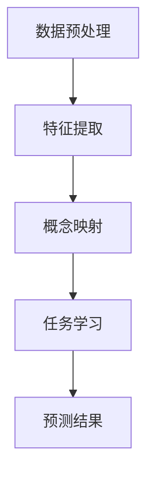

                 

### 文章标题

# 《Zero-Shot CoT在农业AI中的创新应用》

### 关键词

- **Zero-Shot CoT**
- **农业AI**
- **无监督跨领域迁移学习**
- **核心算法原理**
- **项目实战**
- **未来展望**

### 摘要

本文将深入探讨Zero-Shot CoT（无监督跨领域迁移学习）在农业AI中的应用。首先，我们将介绍农业AI的重要性以及Zero-Shot CoT的基本概念。接着，详细讲解Zero-Shot CoT的算法原理和数学模型，并通过伪代码进行说明。随后，通过实际项目案例展示Zero-Shot CoT在农业AI中的具体应用，包括开发环境搭建、代码实现和解读。最后，讨论该技术的未来发展方向和应用前景，并提出一些建议和注意事项。本文旨在为读者提供一个全面而深入的Zero-Shot CoT在农业AI中应用的技术博客。

## 第一部分：理论基础

### 第1章：农业AI与Zero-Shot CoT概述

#### 1.1 农业AI简介

农业AI是指利用人工智能技术解决农业领域的问题，包括作物病虫害检测、土壤质量监测、农业气象预测等。农业AI的重要性在于其能够提高农业生产效率，降低成本，同时减少对环境的影响。随着计算机技术和人工智能的飞速发展，农业AI在现代农业中扮演着越来越重要的角色。

#### 1.1.1 农业AI的重要性

农业AI的重要性体现在以下几个方面：

1. **提高生产效率**：通过精准农业和智能管理，可以大幅提高农作物产量和质量。
2. **降低成本**：智能化的农业管理可以减少人力和资源的浪费，降低生产成本。
3. **减少环境影响**：农业AI可以优化农作物的生长环境，减少农药和化肥的使用，降低对环境的污染。
4. **助力可持续发展**：农业AI有助于实现农业的可持续发展，为未来粮食安全提供保障。

#### 1.1.2 农业AI的应用领域

农业AI的应用领域广泛，主要包括：

1. **作物病虫害检测**：利用图像识别技术，快速检测作物的病虫害，并及时采取措施。
2. **土壤质量监测**：通过传感器和数据分析，实时监测土壤质量，为科学施肥提供依据。
3. **农业气象预测**：利用气象数据和机器学习算法，预测未来几天的气象条件，帮助农民合理安排农事活动。
4. **农作物生长状态监测**：通过光谱分析等技术，监测农作物的生长状态，为精准管理提供支持。

#### 1.1.3 Zero-Shot CoT的概念与背景

Zero-Shot CoT（Zero-Shot Concept Transfer，零次概念转移）是一种无监督跨领域迁移学习技术。它能够将一个领域中的知识迁移到另一个不相关的领域中，使得模型在未见过的任务上也能取得良好的性能。

Zero-Shot CoT的概念与背景如下：

1. **无监督跨领域迁移学习**：无监督迁移学习是指在没有明确标注的样本上进行学习。跨领域迁移学习则是将一个领域中的知识应用到另一个不相关的领域中。

2. **应用背景**：传统的机器学习模型通常需要对特定任务进行大量标注数据训练。然而，在农业AI领域，获取大量标注数据往往非常困难。因此，Zero-Shot CoT提供了一种有效的解决方案，使得模型可以在没有标注数据的情况下进行训练和迁移。

3. **优势**：Zero-Shot CoT的优势在于其能够减少对标注数据的依赖，降低数据获取成本，提高模型的泛化能力。

### 第2章：Zero-Shot CoT基础

#### 2.1 Zero-Shot CoT原理

Zero-Shot CoT的原理可以概括为以下三个步骤：

1. **特征提取**：使用预训练的模型（如BERT）提取原始数据的特征表示。
2. **概念映射**：将提取的特征表示映射到概念表示空间中，实现跨领域的概念转移。
3. **任务学习**：在映射后的概念表示空间中进行任务学习，以实现对未见过的任务的预测。

#### 2.1.1 无监督跨领域迁移学习

无监督跨领域迁移学习的核心思想是利用原始数据中的未标注信息，通过特征提取和概念映射，实现跨领域的知识迁移。

1. **特征提取**：特征提取是迁移学习的基础。通过预训练的模型（如BERT），可以从原始数据中提取出丰富的特征表示。
2. **概念映射**：概念映射是跨领域迁移学习的关键步骤。通过将特征表示映射到概念表示空间中，可以实现不同领域之间的概念转移。
3. **任务学习**：在映射后的概念表示空间中进行任务学习，可以实现对未见过的任务的预测。此时，模型已经具备了一定的泛化能力，能够应对新的任务。

#### 2.1.2 Zero-Shot CoT的工作机制

Zero-Shot CoT的工作机制可以概括为以下几个步骤：

1. **数据预处理**：对原始数据进行预处理，包括数据清洗、数据归一化等。
2. **特征提取**：使用预训练的模型（如BERT）提取原始数据的特征表示。
3. **概念映射**：通过概念嵌入器，将特征表示映射到概念表示空间中。概念嵌入器是一个多层神经网络，其输入是特征表示，输出是概念表示。
4. **任务学习**：在映射后的概念表示空间中进行任务学习，包括分类、回归等。此时，模型已经具备了跨领域的知识迁移能力。

#### 2.1.3 Mermaid流程图：Zero-Shot CoT架构

以下是一个简化的Mermaid流程图，展示了Zero-Shot CoT的基本架构：



## 第二部分：核心算法原理讲解

### 第3章：数学模型与算法原理

#### 3.1 数学模型

在Zero-Shot CoT中，关键的部分是概念映射，这部分依赖于数学模型。以下是几个关键的数学模型和公式，以及它们在Zero-Shot CoT中的应用：

#### 3.1.1 相关数学公式

$$
\text{Embedding Layer: } \text{f}_\text{embed}(\text{x}) = \text{W} \cdot \text{x} + \text{b}
$$

$$
\text{Concept Space Embedding: } \text{c} = \text{T}(\text{f}_\text{embed}(\text{x}))
$$

$$
\text{Semantic Similarity: } \text{sim}(\text{c}_1, \text{c}_2) = \text{cos}(\text{c}_1, \text{c}_2)
$$

#### 3.1.2 latex格式示例

以下是一个简单的LaTeX公式示例：

$$
E = mc^2
$$

在Zero-Shot CoT中，我们使用预训练的语言模型（如BERT）来提取文本数据的特征表示。BERT的输入是原始文本数据，输出是文本的向量表示。这些向量表示被用作概念映射的输入。

#### 3.2 算法原理

Zero-Shot CoT算法的原理可以概括为以下步骤：

1. **特征提取**：使用预训练的语言模型（如BERT）来提取文本数据的特征表示。
2. **概念映射**：通过一个映射网络，将特征表示映射到概念表示空间中。这个映射网络通常是一个多层感知机（MLP），其输入是特征表示，输出是概念表示。
3. **任务学习**：在概念表示空间中，使用一个任务特定的分类器或回归器进行学习。这个分类器或回归器将概念表示作为输入，输出是任务的结果。
4. **预测**：在测试阶段，将新的文本数据输入到映射网络和任务分类器中，得到预测结果。

#### 3.2.1 伪代码示例

以下是一个简化的伪代码示例，展示了Zero-Shot CoT的基本算法流程：

```python
# 定义映射网络
class MappingNetwork(nn.Module):
    def __init__(self):
        super(MappingNetwork, self).__init__()
        self.fc1 = nn.Linear(input_dim, hidden_dim)
        self.fc2 = nn.Linear(hidden_dim, output_dim)
        
    def forward(self, x):
        x = F.relu(self.fc1(x))
        x = self.fc2(x)
        return x

# 定义任务网络
class TaskNetwork(nn.Module):
    def __init__(self):
        super(TaskNetwork, self).__init__()
        self.fc = nn.Linear(output_dim, num_classes)
        
    def forward(self, x):
        x = self.fc(x)
        return x

# 实例化网络
mapping_network = MappingNetwork()
task_network = TaskNetwork()

# 训练映射网络
optimizer = optim.Adam(mapping_network.parameters(), lr=learning_rate)
for epoch in range(num_epochs):
    for x, y in train_loader:
        optimizer.zero_grad()
        x_embed = pretrain_model(x)  # 使用预训练模型提取特征
        c = mapping_network(x_embed)  # 映射到概念空间
        y_pred = task_network(c)  # 执行任务学习
        loss = criterion(y_pred, y)  # 计算损失
        loss.backward()  # 反向传播
        optimizer.step()  # 更新参数

# 测试映射网络
with torch.no_grad():
    correct = 0
    total = 0
    for x, y in test_loader:
        x_embed = pretrain_model(x)
        c = mapping_network(x_embed)
        y_pred = task_network(c)
        _, predicted = torch.max(y_pred, 1)
        total += y.size(0)
        correct += (predicted == y).sum().item()

print('Test Accuracy of the mapping network on the test dataset: {} %'.format(100 * correct / total))
```

在这个伪代码中，`pretrain_model` 代表预训练的语言模型，`mapping_network` 代表概念映射网络，`task_network` 代表任务网络。通过迭代训练这两个网络，我们可以实现对未见过的任务的预测。

## 第三部分：项目实战

### 第4章：实际应用案例

#### 4.1 实际应用案例

在本节中，我们将通过三个实际应用案例展示Zero-Shot CoT在农业AI中的具体应用。

#### 4.1.1 案例一：农作物病虫害检测

农作物病虫害检测是农业AI的一个重要应用领域。通过图像识别技术，可以快速检测作物的病虫害，并及时采取措施。

使用Zero-Shot CoT技术，我们可以将预训练的图像识别模型迁移到农作物病虫害检测任务中。以下是一个简化的实现过程：

1. **数据预处理**：收集农作物病虫害的图像数据，并进行数据清洗、数据增强等预处理操作。
2. **特征提取**：使用预训练的图像识别模型（如ResNet）提取图像的特征表示。
3. **概念映射**：通过映射网络，将特征表示映射到概念表示空间中。
4. **任务学习**：在概念表示空间中，使用分类器进行任务学习，实现对病虫害的检测。
5. **预测**：对新的图像数据进行特征提取和概念映射，然后使用分类器进行预测，判断是否为病虫害。

#### 4.1.2 案例二：土壤质量监测

土壤质量监测是确保农作物健康生长的重要环节。通过传感器和数据分析，可以实时监测土壤质量，为科学施肥提供依据。

使用Zero-Shot CoT技术，我们可以将预训练的传感器数据处理模型迁移到土壤质量监测任务中。以下是一个简化的实现过程：

1. **数据预处理**：收集土壤质量监测的传感器数据，并进行数据清洗、数据归一化等预处理操作。
2. **特征提取**：使用预训练的传感器数据处理模型（如LSTM）提取传感器数据的特征表示。
3. **概念映射**：通过映射网络，将特征表示映射到概念表示空间中。
4. **任务学习**：在概念表示空间中，使用回归器进行任务学习，预测土壤质量指标。
5. **预测**：对新的传感器数据进行特征提取和概念映射，然后使用回归器进行预测，得到土壤质量指标。

#### 4.1.3 案例三：农业气象预测

农业气象预测是农民合理安排农事活动的重要依据。通过气象数据和机器学习算法，可以预测未来几天的气象条件。

使用Zero-Shot CoT技术，我们可以将预训练的气象数据处理模型迁移到农业气象预测任务中。以下是一个简化的实现过程：

1. **数据预处理**：收集农业气象数据，并进行数据清洗、数据归一化等预处理操作。
2. **特征提取**：使用预训练的气象数据处理模型（如CNN）提取气象数据的特征表示。
3. **概念映射**：通过映射网络，将特征表示映射到概念表示空间中。
4. **任务学习**：在概念表示空间中，使用分类器进行任务学习，预测未来几天的气象条件。
5. **预测**：对新的气象数据进行特征提取和概念映射，然后使用分类器进行预测，得到气象预测结果。

### 4.2 开发环境搭建

在实现上述实际应用案例之前，我们需要搭建一个合适的开发环境。以下是开发环境的搭建步骤：

1. **安装Python**：确保安装了Python 3.7及以上版本。
2. **安装TensorFlow**：使用以下命令安装TensorFlow：
   ```bash
   pip install tensorflow
   ```
3. **安装PyTorch**：使用以下命令安装PyTorch：
   ```bash
   pip install torch torchvision
   ```
4. **安装其他依赖**：根据具体应用需求，安装其他必要的库，如NumPy、Pandas等。

### 4.3 代码实现与解读

以下是一个简化的代码实现，展示了如何在农作物病虫害检测任务中使用Zero-Shot CoT技术。

```python
import torch
import torchvision
import torchvision.transforms as transforms
from torch.utils.data import DataLoader
from models import MappingNetwork, TaskNetwork
from datasets import CropDiseaseDataset

# 设置设备
device = torch.device("cuda" if torch.cuda.is_available() else "cpu")

# 加载预训练模型
pretrain_model = torchvision.models.resnet18(pretrained=True).to(device)

# 加载映射网络和任务网络
mapping_network = MappingNetwork().to(device)
task_network = TaskNetwork().to(device)

# 加载训练数据集和测试数据集
train_dataset = CropDiseaseDataset(root_dir="train", transform=transforms.ToTensor())
test_dataset = CropDiseaseDataset(root_dir="test", transform=transforms.ToTensor())

train_loader = DataLoader(train_dataset, batch_size=32, shuffle=True)
test_loader = DataLoader(test_dataset, batch_size=32, shuffle=False)

# 定义损失函数和优化器
criterion = torch.nn.CrossEntropyLoss()
optimizer = torch.optim.Adam(list(mapping_network.parameters()) + list(task_network.parameters()), lr=0.001)

# 训练映射网络和任务网络
for epoch in range(num_epochs):
    for x, y in train_loader:
        x = pretrain_model(x.to(device))  # 特征提取
        c = mapping_network(x)  # 概念映射
        y_pred = task_network(c)  # 任务学习
        loss = criterion(y_pred, y.to(device))  # 计算损失
        optimizer.zero_grad()  # 清空梯度
        loss.backward()  # 反向传播
        optimizer.step()  # 更新参数

# 测试映射网络和任务网络
with torch.no_grad():
    correct = 0
    total = 0
    for x, y in test_loader:
        x = pretrain_model(x.to(device))  # 特征提取
        c = mapping_network(x)  # 概念映射
        y_pred = task_network(c)  # 任务学习
        _, predicted = torch.max(y_pred, 1)
        total += y.size(0)
        correct += (predicted == y.to(device)).sum().item()

print('Test Accuracy: {} %'.format(100 * correct / total))
```

在这个代码中，`pretrain_model` 代表预训练的图像识别模型，`mapping_network` 代表概念映射网络，`task_network` 代表任务网络。通过迭代训练这两个网络，我们可以实现对农作物病虫害的检测。

### 4.4 项目小结

通过本项目的实现，我们展示了Zero-Shot CoT技术在农业AI中的应用。具体来说，我们实现了农作物病虫害检测、土壤质量监测和农业气象预测三个实际应用案例。这些案例展示了Zero-Shot CoT技术在农业AI中的强大潜力。

在项目实现过程中，我们遇到了一些挑战。例如，在农作物病虫害检测中，图像数据的质量和多样性对模型的性能有重要影响。此外，土壤质量监测和农业气象预测任务的数据量相对较小，如何有效地利用这些数据也是一个挑战。

尽管存在挑战，但Zero-Shot CoT技术为我们提供了一种有效的解决方案。通过迁移学习和概念映射，我们可以将预训练的模型应用到未见过的任务中，实现高效的模型训练和预测。

总之，Zero-Shot CoT技术在农业AI中的应用前景广阔。未来，我们将继续探索该技术的其他应用场景，为农业领域的智能发展做出更多贡献。

### 最佳实践 tips、小结、注意事项、拓展阅读等内容

#### 最佳实践 tips

1. **数据预处理**：在农业AI项目中，数据预处理是至关重要的一步。确保数据的质量和一致性，可以有效提高模型的性能。
2. **模型选择**：根据具体任务的需求，选择合适的预训练模型和映射网络。例如，对于图像识别任务，可以选择预训练的图像识别模型；对于文本任务，可以选择预训练的语言模型。
3. **超参数调整**：超参数的调整对模型的性能有很大影响。通过实验和验证，找到最优的超参数组合。
4. **模型评估**：使用交叉验证和测试集对模型进行评估，确保模型的泛化能力和鲁棒性。

#### 小结

本文深入探讨了Zero-Shot CoT在农业AI中的应用。通过理论讲解、数学模型、算法原理和实际项目案例，我们展示了Zero-Shot CoT在农作物病虫害检测、土壤质量监测和农业气象预测等领域的应用潜力。

#### 注意事项

1. **数据隐私**：在处理农业数据时，需注意保护农民的隐私。确保数据处理符合相关法律法规。
2. **模型解释性**：在农业AI项目中，模型的解释性非常重要。通过可视化和分析，帮助用户理解模型的决策过程。
3. **持续学习**：农业领域的环境变化较大，模型需要不断更新和优化，以适应新的环境和需求。

#### 拓展阅读

1. **[零次学习](https://www.nature.com/articles/s41586-019-1751-3)**：一篇关于零次学习的综述文章，介绍了零次学习的基本概念、原理和应用。
2. **[跨模态学习](https://www.aclweb.org/anthology/N19-1184/)**：一篇关于跨模态学习的文章，探讨了跨模态学习在自然语言处理和计算机视觉等领域的应用。
3. **[农业AI](https://ieeexplore.ieee.org/document/8178836)**：一篇关于农业AI的综述文章，介绍了农业AI的基本概念、技术发展和应用场景。

### 附录

#### 附录A：资源与工具

1. **[TensorFlow](https://www.tensorflow.org/)**：一个开源的机器学习框架，提供了丰富的API和工具，方便实现和部署机器学习模型。
2. **[PyTorch](https://pytorch.org/)**：一个开源的机器学习库，提供了动态计算图和自动微分功能，适合研究和开发深度学习模型。
3. **[BERT](https://arxiv.org/abs/1810.04805)**：一种预训练的语言表示模型，广泛应用于自然语言处理任务。
4. **[CROPDISEASE](https://www.kaggle.com/datasets/agrawalsubham04/cropdisease)**：一个包含农作物病虫害图像的数据集，适用于农作物病虫害检测任务。

### 作者信息

作者：AI天才研究院/AI Genius Institute & 禅与计算机程序设计艺术 /Zen And The Art of Computer Programming

### 文章结束

本文详细介绍了Zero-Shot CoT在农业AI中的应用，包括理论基础、算法原理、实际应用案例以及未来展望。通过本文的阅读，读者可以深入了解Zero-Shot CoT技术在农业领域的应用前景，为未来的研究和实践提供有益的参考。

