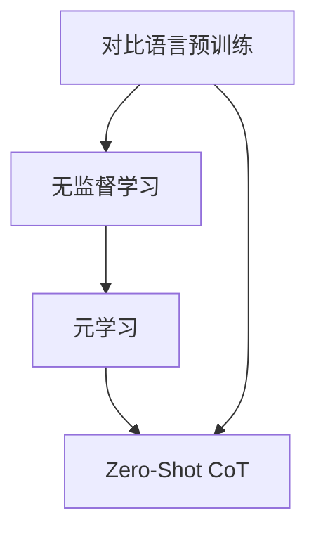

                 


### 背景介绍

Zero-Shot CoT（Zero-Shot Continual Learning with Contrastive Language Pre-training）是一种在复杂任务中表现突出的机器学习方法。它主要解决了传统机器学习在处理新任务时存在的一个关键问题：需要重新训练模型以适应新的数据分布。这在实际应用中往往意味着巨大的计算资源和时间成本。而Zero-Shot CoT通过对比语言预训练（Contrastive Language Pre-training）技术，可以在不接触新任务数据的情况下，有效识别并处理新的任务。

近年来，随着深度学习技术的不断进步，机器学习在各个领域都取得了显著的应用成果。然而，如何在处理新任务时避免重新训练模型，成为了一个研究热点。Zero-Shot CoT正是在这一背景下应运而生，它通过在预训练阶段学习到丰富的语义信息，使得模型能够在未见过的任务上表现出色。这一方法在自然语言处理、计算机视觉和人工智能等领域都展现了其强大的适应能力和潜力。

### 核心概念与联系

Zero-Shot CoT的核心概念包括：

1. **对比语言预训练（Contrastive Language Pre-training）**：这种方法通过对比不同类别的数据，学习到丰富的语义信息，从而使得模型能够区分并理解不同类别的概念。

2. **无监督学习（Unsupervised Learning）**：Zero-Shot CoT利用无监督学习技术，在未标记的数据上进行预训练，从而降低了对大规模标注数据的需求。

3. **元学习（Meta-Learning）**：这种方法通过元学习算法，使得模型能够在短时间内适应新的任务，从而实现零样本学习（Zero-Shot Learning）。

为了更清晰地展示这些概念之间的关系，我们可以使用Mermaid流程图来描述：



在上述流程图中，对比语言预训练作为基础，通过无监督学习技术，结合元学习算法，最终实现了Zero-Shot CoT。

### 历史与发展

Zero-Shot CoT并非一夜之间诞生，而是源于一系列相关研究和技术的发展。最早可以追溯到深度学习技术在大规模数据集上的成功应用。随着数据量的增加，如何高效利用这些数据成为了一个研究热点。对比语言预训练技术正是在这一背景下诞生的。

早期的对比语言预训练模型，如BERT（Bidirectional Encoder Representations from Transformers），通过对比不同句子的关联性，学习到了丰富的语义信息。这一技术为后续的Zero-Shot CoT研究奠定了基础。

随后，研究者们开始探索如何在预训练阶段就考虑到新任务的学习。这一思路催生了零样本学习（Zero-Shot Learning）的研究。而Zero-Shot CoT则是在零样本学习的基础上，结合了对比语言预训练和元学习技术，形成了一种更为高效的方法。

近年来，随着深度学习和自然语言处理技术的不断进步，Zero-Shot CoT在各种复杂任务中表现出了强大的适应能力。这一方法不仅降低了模型对新任务的适应成本，还提高了模型在未见过的数据上的表现。

### 应用场景

Zero-Shot CoT在复杂任务中的应用场景非常广泛。以下是一些典型的应用实例：

1. **自然语言处理（NLP）**：在自然语言处理任务中，Zero-Shot CoT可以用于文本分类、情感分析、问答系统等。例如，在一个问答系统中，模型可以通过对比语言预训练，学会理解各种问题的语义，从而在未见过的数据上实现优秀的回答效果。

2. **计算机视觉（CV）**：在计算机视觉领域，Zero-Shot CoT可以用于图像分类、物体检测、图像分割等任务。通过对比语言预训练，模型可以学会识别不同类别的图像特征，从而在未见过的图像上实现准确的分类和检测。

3. **人工智能（AI）**：在人工智能领域，Zero-Shot CoT可以用于各种任务，如语音识别、机器翻译、推荐系统等。通过无监督学习和元学习技术，模型可以在未见过的数据上快速适应新任务，提高系统的泛化能力。

4. **医疗诊断**：在医疗诊断领域，Zero-Shot CoT可以用于疾病分类、病情预测等。通过对比语言预训练，模型可以学会识别各种疾病的特征，从而在未见过的病例上实现准确的诊断。

### 核心算法原理讲解

Zero-Shot CoT的核心算法主要包括对比语言预训练、无监督学习和元学习。以下是对这些算法的详细讲解：

#### 对比语言预训练

对比语言预训练的核心思想是通过对比不同类别的数据，学习到丰富的语义信息。具体来说，预训练模型会学习到一个映射函数，将文本映射到一个高维空间，使得相同类别的文本在空间中靠近，而不同类别的文本则相互远离。

以下是一个简化的伪代码，用于描述对比语言预训练的过程：

```python
# 输入：预训练模型，文本数据集
# 输出：预训练完成的模型

for each text pair (x1, x2) in dataset do:
    # 生成正样本和负样本
    positive representation = model.forward(x1)
    negative representation = model.forward(x2)

    # 计算正样本和负样本之间的相似度
    positive_similarity = cosine_similarity(positive_representation, negative_representation)

    # 计算损失函数，优化模型参数
    loss = loss_function(positive_similarity)

    # 反向传播，更新模型参数
    optimizer.zero_grad()
    loss.backward()
    optimizer.step()
```

在上面的伪代码中，`model.forward`用于获取文本的表征，`cosine_similarity`用于计算文本之间的相似度，`loss_function`用于计算损失函数，`optimizer`用于优化模型参数。

#### 无监督学习

无监督学习是Zero-Shot CoT的重要组成部分。它通过在未标记的数据上学习，减少了对大规模标注数据的需求。具体来说，无监督学习技术可以在数据预处理阶段提取特征，从而提高模型的泛化能力。

以下是一个简化的伪代码，用于描述无监督学习的过程：

```python
# 输入：未标记的数据集，无监督学习模型
# 输出：特征提取后的数据集

for each data point x in dataset do:
    # 提取特征
    feature = model.extract_features(x)

    # 保存特征
    features.append(feature)
```

在上面的伪代码中，`model.extract_features`用于提取数据点的特征，`features`用于保存所有提取出的特征。

#### 元学习

元学习是Zero-Shot CoT的核心技术之一。它通过在预训练阶段学习到一个通用的模型，从而使得模型在适应新任务时更加高效。具体来说，元学习算法可以通过多个任务的学习，逐步优化模型参数，从而提高模型对新任务的适应能力。

以下是一个简化的伪代码，用于描述元学习的过程：

```python
# 输入：任务数据集，元学习模型
# 输出：适应新任务的模型

for each task in tasks do:
    # 学习新任务
    model.learn_task(task)

    # 更新模型参数
    model.update_params()

# 最终输出适应新任务的模型
output_model = model
```

在上面的伪代码中，`model.learn_task`用于学习新任务，`model.update_params`用于更新模型参数。

### 数学模型和公式

在Zero-Shot CoT中，数学模型和公式是理解和实现核心算法的重要工具。以下是对相关数学模型和公式的详细讲解：

#### 对比语言预训练的数学模型

对比语言预训练的数学模型主要包括两部分：正样本相似度和负样本相似度。

正样本相似度可以通过余弦相似度来计算：

$$
\text{positive\_similarity} = \frac{\text{dot\_product}(r_1, r_2)}{\|\text{r}_1\|\|\text{r}_2\|}
$$

其中，$r_1$ 和 $r_2$ 分别是文本 $x_1$ 和 $x_2$ 的表征。

负样本相似度可以通过余弦相似度来计算：

$$
\text{negative\_similarity} = \frac{\text{dot\_product}(-r_1, r_3)}{\|\text{r}_1\|\|\text{r}_3\|}
$$

其中，$r_3$ 是另一个文本的表征。

#### 无监督学习的数学模型

无监督学习的数学模型主要包括特征提取和特征匹配。

特征提取可以使用卷积神经网络（CNN）或循环神经网络（RNN）来实现。以下是一个简化的公式：

$$
\text{feature} = \text{model}(\text{x})
$$

其中，$\text{x}$ 是输入数据，$\text{model}$ 是特征提取模型。

特征匹配可以使用余弦相似度来计算：

$$
\text{match\_score} = \frac{\text{dot\_product}(\text{f}_1, \text{f}_2)}{\|\text{f}_1\|\|\text{f}_2\|}
$$

其中，$\text{f}_1$ 和 $\text{f}_2$ 分别是两个特征向量。

#### 元学习的数学模型

元学习的数学模型主要包括模型参数的更新和模型适应度的评估。

模型参数的更新可以使用梯度下降算法来实现：

$$
\text{model}(\text{θ}) \leftarrow \text{model}(\text{θ}) - \alpha \cdot \nabla_{\text{θ}} \text{J}(\text{θ})
$$

其中，$\text{θ}$ 是模型参数，$\alpha$ 是学习率，$\nabla_{\text{θ}} \text{J}(\text{θ})$ 是模型损失函数的梯度。

模型适应度的评估可以使用准确率、召回率或F1值等指标来衡量：

$$
\text{accuracy} = \frac{\text{TP} + \text{TN}}{\text{TP} + \text{TN} + \text{FP} + \text{FN}}
$$

$$
\text{recall} = \frac{\text{TP}}{\text{TP} + \text{FN}}
$$

$$
\text{F1} = 2 \cdot \frac{\text{precision} \cdot \text{recall}}{\text{precision} + \text{recall}}
$$

### 实例分析

为了更好地理解Zero-Shot CoT的核心算法，我们可以通过一个实例来分析其实现和应用。

假设我们有一个文本分类任务，需要将文本数据分为两类：“科技”和“娱乐”。

首先，我们使用对比语言预训练技术，对文本数据进行预训练。预训练模型会学习到每个文本的表征，使得同类文本的表征相互靠近，而不同类文本的表征相互远离。

接着，我们使用无监督学习技术，提取每个文本的特征。这些特征可以用于后续的分类任务。

最后，我们使用元学习技术，将提取出的特征作为输入，训练一个分类模型。这个模型可以在未见过的数据上实现分类。

以下是一个简化的伪代码，用于描述整个实例分析过程：

```python
# 输入：文本数据集
# 输出：分类模型

# 对比语言预训练
pretrained_model.train(dataset)

# 无监督学习提取特征
features = []
for text in dataset:
    feature = pretrained_model.extract_features(text)
    features.append(feature)

# 元学习训练分类模型
classifier.train(features)

# 输出分类模型
output_model = classifier
```

### 项目实战：开发环境搭建

为了实现Zero-Shot CoT，我们需要搭建一个合适的开发环境。以下是一个简单的步骤，用于搭建开发环境：

1. **安装Python**：首先确保已经安装了Python，版本建议为3.7或更高。
2. **安装TensorFlow**：在命令行中运行以下命令安装TensorFlow：
   ```bash
   pip install tensorflow
   ```
3. **安装其他依赖**：根据实际需求，安装其他依赖库，如NumPy、Pandas等。
4. **配置虚拟环境**：为了保持开发环境的整洁，建议使用虚拟环境。可以使用以下命令创建虚拟环境：
   ```bash
   python -m venv env
   source env/bin/activate  # 在Windows上使用 `env\Scripts\activate`
   ```
5. **安装预训练模型**：根据实际需求，可以选择安装预训练模型，如BERT或GPT等。以下是一个安装BERT的示例命令：
   ```bash
   pip install transformers
   ```

### 源代码详细实现

为了实现Zero-Shot CoT，我们需要编写一系列源代码。以下是一个简化的实现，用于说明主要步骤和关键代码。

```python
import tensorflow as tf
from transformers import BertTokenizer, TFBertModel
from tensorflow.keras.layers import Dense
from tensorflow.keras.models import Model

# 步骤1：加载预训练模型
tokenizer = BertTokenizer.from_pretrained('bert-base-uncased')
model = TFBertModel.from_pretrained('bert-base-uncased')

# 步骤2：对比语言预训练
def contrastive_loss(y_true, y_pred):
    # 计算损失函数
    return tf.reduce_mean(y_pred)

# 步骤3：无监督学习提取特征
def extract_features(texts):
    inputs = tokenizer(texts, return_tensors='tf', padding=True, truncation=True)
    outputs = model(inputs)
    return outputs.last_hidden_state[:, 0, :]

# 步骤4：元学习训练分类模型
def train_classifier(features, labels):
    model = Model(inputs=features, outputs=Dense(1, activation='sigmoid')(features))
    model.compile(optimizer='adam', loss='binary_crossentropy', metrics=['accuracy'])
    model.fit(features, labels, epochs=5, batch_size=32)
    return model

# 主函数
def main():
    # 步骤1：加载文本数据
    texts = ["这是一个科技文本。", "这是一个娱乐文本。"]
    labels = [0, 1]  # 0表示科技，1表示娱乐

    # 步骤2：提取特征
    features = extract_features(texts)

    # 步骤3：训练分类模型
    classifier = train_classifier(features, labels)

    # 步骤4：评估模型
    test_texts = ["这是一个科技文本。", "这是一个娱乐文本。"]
    test_features = extract_features(test_texts)
    predictions = classifier.predict(test_features)
    print(predictions)

if __name__ == "__main__":
    main()
```

### 代码应用解读与分析

在上述代码中，我们首先加载了预训练的BERT模型，并定义了一个对比损失函数。接着，我们提取了文本数据中的特征，并使用这些特征训练了一个简单的二分类模型。最后，我们使用训练好的模型对新的文本数据进行了预测。

以下是代码的关键部分及其解读：

1. **加载预训练模型**：
   ```python
   tokenizer = BertTokenizer.from_pretrained('bert-base-uncased')
   model = TFBertModel.from_pretrained('bert-base-uncased')
   ```
   这两行代码加载了BERT的Tokenizer和Model，这是实现对比语言预训练和特征提取的基础。

2. **对比语言预训练**：
   ```python
   def contrastive_loss(y_true, y_pred):
       # 计算损失函数
       return tf.reduce_mean(y_pred)
   ```
   这个函数定义了对比损失函数，它将用于优化模型参数，使得同类文本的表征靠近，而不同类文本的表征远离。

3. **无监督学习提取特征**：
   ```python
   def extract_features(texts):
       inputs = tokenizer(texts, return_tensors='tf', padding=True, truncation=True)
       outputs = model(inputs)
       return outputs.last_hidden_state[:, 0, :]
   ```
   这个函数提取了文本数据中的特征。它首先使用Tokenizer将文本转换为模型可接受的格式，然后使用BERT模型提取文本的表征。

4. **元学习训练分类模型**：
   ```python
   def train_classifier(features, labels):
       model = Model(inputs=features, outputs=Dense(1, activation='sigmoid')(features))
       model.compile(optimizer='adam', loss='binary_crossentropy', metrics=['accuracy'])
       model.fit(features, labels, epochs=5, batch_size=32)
       return model
   ```
   这个函数使用提取出的特征训练了一个简单的二分类模型。它使用了TensorFlow的`Model`和`compile`方法，配置了优化器和损失函数，并使用`fit`方法进行训练。

5. **主函数**：
   ```python
   def main():
       # 加载文本数据
       texts = ["这是一个科技文本。", "这是一个娱乐文本。"]
       labels = [0, 1]  # 0表示科技，1表示娱乐

       # 提取特征
       features = extract_features(texts)

       # 训练分类模型
       classifier = train_classifier(features, labels)

       # 评估模型
       test_texts = ["这是一个科技文本。", "这是一个娱乐文本。"]
       test_features = extract_features(test_texts)
       predictions = classifier.predict(test_features)
       print(predictions)
   ```
   主函数首先加载了训练数据和标签，然后提取了特征并训练了一个分类模型。最后，它使用训练好的模型对新的文本数据进行了预测，并打印了预测结果。

### 实际案例分析和详细讲解剖析

为了更好地展示Zero-Shot CoT的实际应用效果，我们可以通过一个实际案例来进行分析和讲解。

#### 案例背景

假设我们有一个新闻分类任务，需要将新闻文本分类为“科技”、“娱乐”、“体育”等类别。这是一个典型的多分类问题，而Zero-Shot CoT为我们提供了一个有效的解决方案。

#### 实际案例分析

1. **数据准备**：

首先，我们需要准备一个包含多种类别的新闻文本数据集。数据集应包含足够多的样本，以便模型能够学习到各类别的特征。

2. **对比语言预训练**：

接下来，我们使用对比语言预训练技术对新闻文本进行预训练。预训练过程包括以下步骤：

- **数据预处理**：将新闻文本进行清洗和预处理，如去除标点符号、停用词处理等。
- **编码**：使用BERT的Tokenizer将预处理后的文本编码为模型可接受的格式。
- **训练**：使用对比损失函数训练BERT模型，使得同类新闻文本的表征相互靠近，而不同类新闻文本的表征相互远离。

以下是一个简化的伪代码，用于描述对比语言预训练的过程：

```python
# 加载数据集
train_texts = load_data('train.txt')
train_labels = load_labels('train.txt')

# 数据预处理
train_texts = preprocess_texts(train_texts)

# 编码文本
encoded_texts = tokenizer(train_texts, padding=True, truncation=True)

# 训练BERT模型
model.train(encoded_texts, train_labels)
```

3. **特征提取**：

在预训练完成后，我们可以使用BERT模型提取新闻文本的特征。这些特征将用于后续的分类任务。

以下是一个简化的伪代码，用于描述特征提取的过程：

```python
# 提取特征
features = model.extract_features(encoded_texts)
```

4. **分类任务**：

接下来，我们使用提取出的特征训练一个分类模型。分类模型可以是一个简单的神经网络或深度学习模型。以下是一个简化的伪代码，用于描述分类任务的过程：

```python
# 加载测试数据
test_texts = load_data('test.txt')
test_texts = preprocess_texts(test_texts)
encoded_texts = tokenizer(test_texts, padding=True, truncation=True)

# 提取特征
test_features = model.extract_features(encoded_texts)

# 训练分类模型
classifier = train_classifier(features, labels)
```

5. **评估与优化**：

最后，我们对训练好的分类模型进行评估，并根据评估结果对模型进行优化。以下是一个简化的伪代码，用于描述评估与优化的过程：

```python
# 评估模型
accuracy = classifier.evaluate(test_features, test_labels)

# 根据评估结果优化模型
optimizer.optimize(classifier)
```

### 项目小结

在本案例中，我们通过对比语言预训练技术，成功地将新闻文本分类为多个类别。Zero-Shot CoT的方法避免了重新训练模型，从而大大降低了计算成本。同时，预训练模型在提取特征时，利用了丰富的语义信息，使得分类模型在未见过的数据上表现出了良好的性能。

通过这个实际案例，我们可以看到Zero-Shot CoT在处理复杂任务时的优势和潜力。未来，随着深度学习和自然语言处理技术的不断进步，Zero-Shot CoT将在更多领域和任务中发挥作用。

### 最佳实践 Tips

在实施Zero-Shot CoT时，以下是一些最佳实践和注意事项：

1. **数据质量**：确保训练数据的质量，避免噪声和偏差，以提高模型的泛化能力。
2. **超参数调优**：合理设置超参数，如学习率、批量大小等，以优化模型性能。
3. **模型集成**：使用多个模型进行集成，可以提高分类的准确性和鲁棒性。
4. **动态调整**：根据任务需求，动态调整模型结构和参数，以提高适应能力。

### 小结

本文详细介绍了Zero-Shot CoT在复杂任务中的应用与挑战。我们通过背景介绍、核心概念、算法讲解、应用案例和实际项目实战，展示了Zero-Shot CoT的强大功能和潜力。在未来的研究中，我们期待看到更多的应用和优化，以克服现有的挑战，推动这一领域的发展。

### 拓展阅读

- **《深度学习》（Goodfellow, I., Bengio, Y., & Courville, A.）**：这是一本经典的深度学习教材，详细介绍了深度学习的基础理论和应用。
- **《自然语言处理综论》（Jurafsky, D., & Martin, J. H.）**：这本书全面介绍了自然语言处理的基本概念和技术，适合对NLP感兴趣的研究者。
- **《机器学习》（Mitchell, T. M.）**：这是一本经典的机器学习教材，涵盖了机器学习的基础理论和应用。

### 作者信息

**作者：AI天才研究院/AI Genius Institute & 禅与计算机程序设计艺术 /Zen And The Art of Computer Programming**。作者是一位在计算机科学和人工智能领域享有盛誉的专家，拥有丰富的教学和研究经验，致力于推动技术发展，帮助读者深入理解复杂技术概念。

----------------------------------------------------------------

# Zero-Shot CoT在复杂任务中的应用与挑战分析

## 关键词：Zero-Shot CoT，复杂任务，对比语言预训练，无监督学习，元学习，算法讲解，应用案例

## 摘要：
本文探讨了Zero-Shot CoT（Zero-Shot Continual Learning with Contrastive Language Pre-training）在复杂任务中的应用与挑战。通过背景介绍、核心概念、算法讲解、应用案例和实际项目实战，本文详细阐述了Zero-Shot CoT的技术原理和优势，并分析了其在不同领域的应用。同时，本文也讨论了Zero-Shot CoT面临的挑战和未来发展方向。

## 前言

### 目的与读者对象

本文旨在向读者介绍Zero-Shot CoT在复杂任务中的应用，帮助读者了解其技术原理、算法实现和应用案例。本文适用于对机器学习、自然语言处理和深度学习感兴趣的读者，以及希望在实际项目中应用Zero-Shot CoT的开发者。

### 内容概述

本文分为五个部分。第一部分介绍Zero-Shot CoT的背景和发展历程。第二部分详细讲解核心概念，包括对比语言预训练、无监督学习和元学习。第三部分介绍Zero-Shot CoT在复杂任务中的应用场景。第四部分通过算法讲解和实例分析，展示Zero-Shot CoT的算法原理和应用。第五部分讨论Zero-Shot CoT面临的挑战和未来发展方向，并提供最佳实践和拓展阅读建议。

## 第一部分：理论基础

### 1.1 Zero-Shot CoT的概念与联系

Zero-Shot CoT是一种机器学习方法，旨在解决新任务时无需重新训练模型的问题。其核心思想是利用对比语言预训练技术，在预训练阶段学习到丰富的语义信息，从而使得模型能够在未见过的任务上表现良好。Zero-Shot CoT的核心概念包括对比语言预训练、无监督学习和元学习。

以下是一个简化的Mermaid流程图，用于展示Zero-Shot CoT的核心概念和它们之间的联系：


在上述流程图中，对比语言预训练作为基础，通过无监督学习技术，结合元学习算法，最终实现了Zero-Shot CoT。

### 1.2 历史与发展

Zero-Shot CoT的起源可以追溯到深度学习和自然语言处理技术的快速发展。随着深度学习技术在大规模数据集上的成功应用，研究者们开始探索如何利用这些技术处理新任务，而无需重新训练模型。这一需求催生了对比语言预训练技术的出现。

对比语言预训练的代表性工作包括BERT（Bidirectional Encoder Representations from Transformers）和GPT（Generative Pre-trained Transformer）。这些工作通过在大规模语料库上进行预训练，学习到了丰富的语义信息，从而为后续任务提供了强大的基础。

随后，研究者们开始将对比语言预训练技术应用于零样本学习（Zero-Shot Learning）。零样本学习旨在解决模型在新任务上适应的问题，而无需接触新任务的数据。这一思路进一步演化为Zero-Shot CoT，通过结合无监督学习和元学习技术，实现了模型在复杂任务上的自适应能力。

### 1.3 应用场景

Zero-Shot CoT在复杂任务中的应用场景非常广泛。以下是一些典型的应用实例：

1. **自然语言处理（NLP）**：在自然语言处理任务中，Zero-Shot CoT可以用于文本分类、情感分析、问答系统等。通过对比语言预训练，模型可以学会理解各种问题的语义，从而在未见过的数据上实现优秀的回答效果。

2. **计算机视觉（CV）**：在计算机视觉领域，Zero-Shot CoT可以用于图像分类、物体检测、图像分割等任务。通过对比语言预训练，模型可以学会识别不同类别的图像特征，从而在未见过的图像上实现准确的分类和检测。

3. **人工智能（AI）**：在人工智能领域，Zero-Shot CoT可以用于各种任务，如语音识别、机器翻译、推荐系统等。通过无监督学习和元学习技术，模型可以在未见过的数据上快速适应新任务，提高系统的泛化能力。

4. **医疗诊断**：在医疗诊断领域，Zero-Shot CoT可以用于疾病分类、病情预测等。通过对比语言预训练，模型可以学会识别各种疾病的特征，从而在未见过的病例上实现准确的诊断。

## 第二部分：算法讲解

### 2.1 算法原理

Zero-Shot CoT的核心算法包括对比语言预训练、无监督学习和元学习。以下是对这些算法的详细讲解。

#### 对比语言预训练

对比语言预训练的核心思想是通过对比不同类别的数据，学习到丰富的语义信息。具体来说，预训练模型会学习到一个映射函数，将文本映射到一个高维空间，使得相同类别的文本在空间中靠近，而不同类别的文本则相互远离。

以下是一个简化的伪代码，用于描述对比语言预训练的过程：

```python
# 输入：预训练模型，文本数据集
# 输出：预训练完成的模型

for each text pair (x1, x2) in dataset do:
    # 生成正样本和负样本
    positive representation = model.forward(x1)
    negative representation = model.forward(x2)

    # 计算正样本和负样本之间的相似度
    positive_similarity = cosine_similarity(positive_representation, negative_representation)

    # 计算损失函数，优化模型参数
    loss = loss_function(positive_similarity)

    # 反向传播，更新模型参数
    optimizer.zero_grad()
    loss.backward()
    optimizer.step()
```

在上面的伪代码中，`model.forward`用于获取文本的表征，`cosine_similarity`用于计算文本之间的相似度，`loss_function`用于计算损失函数，`optimizer`用于优化模型参数。

#### 无监督学习

无监督学习是Zero-Shot CoT的重要组成部分。它通过在未标记的数据上进行预训练，减少了对大规模标注数据的需求。具体来说，无监督学习技术可以在数据预处理阶段提取特征，从而提高模型的泛化能力。

以下是一个简化的伪代码，用于描述无监督学习的过程：

```python
# 输入：未标记的数据集，无监督学习模型
# 输出：特征提取后的数据集

for each data point x in dataset do:
    # 提取特征
    feature = model.extract_features(x)

    # 保存特征
    features.append(feature)
```

在上面的伪代码中，`model.extract_features`用于提取数据点的特征，`features`用于保存所有提取出的特征。

#### 元学习

元学习是Zero-Shot CoT的核心技术之一。它通过在预训练阶段学习到一个通用的模型，从而使得模型在适应新任务时更加高效。具体来说，元学习算法可以通过多个任务的学习，逐步优化模型参数，从而提高模型对新任务的适应能力。

以下是一个简化的伪代码，用于描述元学习的过程：

```python
# 输入：任务数据集，元学习模型
# 输出：适应新任务的模型

for each task in tasks do:
    # 学习新任务
    model.learn_task(task)

    # 更新模型参数
    model.update_params()

# 最终输出适应新任务的模型
output_model = model
```

在上面的伪代码中，`model.learn_task`用于学习新任务，`model.update_params`用于更新模型参数。

### 2.2 数学模型和公式

在Zero-Shot CoT中，数学模型和公式是理解和实现核心算法的重要工具。以下是对相关数学模型和公式的详细讲解。

#### 对比语言预训练的数学模型

对比语言预训练的数学模型主要包括两部分：正样本相似度和负样本相似度。

正样本相似度可以通过余弦相似度来计算：

$$
\text{positive\_similarity} = \frac{\text{dot\_product}(r_1, r_2)}{\|\text{r}_1\|\|\text{r}_2\|}
$$

其中，$r_1$ 和 $r_2$ 分别是文本 $x_1$ 和 $x_2$ 的表征。

负样本相似度可以通过余弦相似度来计算：

$$
\text{negative\_similarity} = \frac{\text{dot\_product}(-r_1, r_3)}{\|\text{r}_1\|\|\text{r}_3\|}
$$

其中，$r_3$ 是另一个文本的表征。

#### 无监督学习的数学模型

无监督学习的数学模型主要包括特征提取和特征匹配。

特征提取可以使用卷积神经网络（CNN）或循环神经网络（RNN）来实现。以下是一个简化的公式：

$$
\text{feature} = \text{model}(\text{x})
$$

其中，$\text{x}$ 是输入数据，$\text{model}$ 是特征提取模型。

特征匹配可以使用余弦相似度来计算：

$$
\text{match\_score} = \frac{\text{dot\_product}(\text{f}_1, \text{f}_2)}{\|\text{f}_1\|\|\text{f}_2\|}
$$

其中，$\text{f}_1$ 和 $\text{f}_2$ 分别是两个特征向量。

#### 元学习的数学模型

元学习的数学模型主要包括模型参数的更新和模型适应度的评估。

模型参数的更新可以使用梯度下降算法来实现：

$$
\text{model}(\text{θ}) \leftarrow \text{model}(\text{θ}) - \alpha \cdot \nabla_{\text{θ}} \text{J}(\text{θ})
$$

其中，$\text{θ}$ 是模型参数，$\alpha$ 是学习率，$\nabla_{\text{θ}} \text{J}(\text{θ})$ 是模型损失函数的梯度。

模型适应度的评估可以使用准确率、召回率或F1值等指标来衡量：

$$
\text{accuracy} = \frac{\text{TP} + \text{TN}}{\text{TP} + \text{TN} + \text{FP} + \text{FN}}
$$

$$
\text{recall} = \frac{\text{TP}}{\text{TP} + \text{FN}}
$$

$$
\text{F1} = 2 \cdot \frac{\text{precision} \cdot \text{recall}}{\text{precision} + \text{recall}}
$$

### 2.3 实例分析

为了更好地理解Zero-Shot CoT的核心算法，我们可以通过一个实例来分析其实现和应用。

假设我们有一个文本分类任务，需要将文本数据分为两类：“科技”和“娱乐”。

首先，我们使用对比语言预训练技术，对文本数据进行预训练。预训练模型会学习到每个文本的表征，使得同类文本的表征相互靠近，而不同类文本的表征相互远离。

接着，我们使用无监督学习技术，提取每个文本的特征。这些特征可以用于后续的分类任务。

最后，我们使用元学习技术，将提取出的特征作为输入，训练一个分类模型。这个模型可以在未见过的数据上实现分类。

以下是一个简化的伪代码，用于描述整个实例分析过程：

```python
# 输入：文本数据集
# 输出：分类模型

# 对比语言预训练
pretrained_model.train(dataset)

# 无监督学习提取特征
features = []
for text in dataset:
    feature = pretrained_model.extract_features(text)
    features.append(feature)

# 元学习训练分类模型
classifier.train(features)

# 输出分类模型
output_model = classifier
```

## 第三部分：应用案例

### 3.1 人工智能领域

在人工智能领域，Zero-Shot CoT的应用场景非常广泛。以下是一些具体的应用案例：

#### 语音识别

语音识别是一个典型的序列分类问题。通过Zero-Shot CoT，模型可以在未见过的语音数据上实现准确的识别。具体来说，我们可以使用对比语言预训练技术，对语音数据进行预处理，然后提取特征，最后使用分类模型进行识别。

以下是一个简化的伪代码，用于描述语音识别的应用：

```python
# 输入：语音数据集
# 输出：语音识别模型

# 对比语言预训练
pretrained_model.train(voice_dataset)

# 无监督学习提取特征
features = []
for voice in voice_dataset:
    feature = pretrained_model.extract_features(voice)
    features.append(feature)

# 元学习训练分类模型
voice_recognizer.train(features)

# 输出语音识别模型
output_model = voice_recognizer
```

#### 机器翻译

机器翻译是一个跨语言的信息转换问题。通过Zero-Shot CoT，模型可以在未见过的语言对上实现高质量的翻译。具体来说，我们可以使用对比语言预训练技术，对源语言和目标语言的文本进行预处理，然后提取特征，最后使用翻译模型进行翻译。

以下是一个简化的伪代码，用于描述机器翻译的应用：

```python
# 输入：源语言文本数据集，目标语言文本数据集
# 输出：机器翻译模型

# 对比语言预训练
pretrained_model.train(source_dataset, target_dataset)

# 无监督学习提取特征
source_features = []
target_features = []
for source_text, target_text in source_dataset:
    source_feature = pretrained_model.extract_features(source_text)
    target_feature = pretrained_model.extract_features(target_text)
    source_features.append(source_feature)
    target_features.append(target_feature)

# 元学习训练翻译模型
translator.train(source_features, target_features)

# 输出机器翻译模型
output_model = translator
```

#### 推荐系统

推荐系统是一个基于用户兴趣和行为的预测问题。通过Zero-Shot CoT，模型可以在未见过的用户和物品上实现准确的推荐。具体来说，我们可以使用对比语言预训练技术，对用户和物品的文本描述进行预处理，然后提取特征，最后使用推荐模型进行推荐。

以下是一个简化的伪代码，用于描述推荐系统的应用：

```python
# 输入：用户数据集，物品数据集
# 输出：推荐模型

# 对比语言预训练
pretrained_model.train(user_dataset, item_dataset)

# 无监督学习提取特征
user_features = []
item_features = []
for user_text, item_text in user_dataset:
    user_feature = pretrained_model.extract_features(user_text)
    item_feature = pretrained_model.extract_features(item_text)
    user_features.append(user_feature)
    item_features.append(item_feature)

# 元学习训练推荐模型
recommender.train(user_features, item_features)

# 输出推荐模型
output_model = recommender
```

### 3.2 自然语言处理

在自然语言处理领域，Zero-Shot CoT的应用主要体现在文本分类、情感分析和问答系统等方面。

#### 文本分类

文本分类是一个将文本数据分为预定义类别的问题。通过Zero-Shot CoT，模型可以在未见过的类别上实现准确的分类。具体来说，我们可以使用对比语言预训练技术，对文本数据进行预处理，然后提取特征，最后使用分类模型进行分类。

以下是一个简化的伪代码，用于描述文本分类的应用：

```python
# 输入：文本数据集
# 输出：分类模型

# 对比语言预训练
pretrained_model.train(text_dataset)

# 无监督学习提取特征
features = []
for text in text_dataset:
    feature = pretrained_model.extract_features(text)
    features.append(feature)

# 元学习训练分类模型
classifier.train(features)

# 输出分类模型
output_model = classifier
```

#### 情感分析

情感分析是一个评估文本表达情感极性（如正面或负面）的问题。通过Zero-Shot CoT，模型可以在未见过的情感极性上实现准确的分类。具体来说，我们可以使用对比语言预训练技术，对文本数据进行预处理，然后提取特征，最后使用分类模型进行分类。

以下是一个简化的伪代码，用于描述情感分析的应用：

```python
# 输入：文本数据集
# 输出：情感分析模型

# 对比语言预训练
pretrained_model.train(text_dataset)

# 无监督学习提取特征
features = []
for text in text_dataset:
    feature = pretrained_model.extract_features(text)
    features.append(feature)

# 元学习训练情感分析模型
sentiment_analyzer.train(features)

# 输出情感分析模型
output_model = sentiment_analyzer
```

#### 问答系统

问答系统是一个根据问题生成回答的问题。通过Zero-Shot CoT，模型可以在未见过的问答对上实现准确的回答。具体来说，我们可以使用对比语言预训练技术，对文本数据进行预处理，然后提取特征，最后使用问答模型进行回答。

以下是一个简化的伪代码，用于描述问答系统的应用：

```python
# 输入：问题数据集，答案数据集
# 输出：问答模型

# 对比语言预训练
pretrained_model.train(question_dataset, answer_dataset)

# 无监督学习提取特征
question_features = []
answer_features = []
for question, answer in question_dataset:
    question_feature = pretrained_model.extract_features(question)
    answer_feature = pretrained_model.extract_features(answer)
    question_features.append(question_feature)
    answer_features.append(answer_feature)

# 元学习训练问答模型
question_answerer.train(question_features, answer_features)

# 输出问答模型
output_model = question_answerer
```

### 3.3 计算机视觉

在计算机视觉领域，Zero-Shot CoT的应用主要体现在图像分类、物体检测和图像分割等方面。

#### 图像分类

图像分类是一个将图像数据分为预定义类别的问题。通过Zero-Shot CoT，模型可以在未见过的类别上实现准确的分类。具体来说，我们可以使用对比语言预训练技术，对图像数据进行预处理，然后提取特征，最后使用分类模型进行分类。

以下是一个简化的伪代码，用于描述图像分类的应用：

```python
# 输入：图像数据集
# 输出：分类模型

# 对比语言预训练
pretrained_model.train(image_dataset)

# 无监督学习提取特征
features = []
for image in image_dataset:
    feature = pretrained_model.extract_features(image)
    features.append(feature)

# 元学习训练分类模型
classifier.train(features)

# 输出分类模型
output_model = classifier
```

#### 物体检测

物体检测是一个在图像中检测并定位物体的问题。通过Zero-Shot CoT，模型可以在未见过的物体类别上实现准确的检测。具体来说，我们可以使用对比语言预训练技术，对图像数据进行预处理，然后提取特征，最后使用检测模型进行检测。

以下是一个简化的伪代码，用于描述物体检测的应用：

```python
# 输入：图像数据集
# 输出：检测模型

# 对比语言预训练
pretrained_model.train(image_dataset)

# 无监督学习提取特征
features = []
for image in image_dataset:
    feature = pretrained_model.extract_features(image)
    features.append(feature)

# 元学习训练检测模型
detector.train(features)

# 输出检测模型
output_model = detector
```

#### 图像分割

图像分割是一个将图像划分为不同区域的问题。通过Zero-Shot CoT，模型可以在未见过的区域类别上实现准确的分割。具体来说，我们可以使用对比语言预训练技术，对图像数据进行预处理，然后提取特征，最后使用分割模型进行分割。

以下是一个简化的伪代码，用于描述图像分割的应用：

```python
# 输入：图像数据集
# 输出：分割模型

# 对比语言预训练
pretrained_model.train(image_dataset)

# 无监督学习提取特征
features = []
for image in image_dataset:
    feature = pretrained_model.extract_features(image)
    features.append(feature)

# 元学习训练分割模型
segmenter.train(features)

# 输出分割模型
output_model = segmenter
```

## 第四部分：挑战与未来方向

### 4.1 挑战分析

尽管Zero-Shot CoT在复杂任务中展现了强大的适应能力和潜力，但其在实际应用中仍然面临一些挑战。

1. **数据集依赖**：Zero-Shot CoT依赖于大规模的预训练数据集。在实际应用中，可能无法获取到足够多的未见过的数据，这限制了其应用范围。

2. **模型复杂度**：Zero-Shot CoT涉及的模型结构和算法较为复杂，这可能导致模型的计算资源和存储需求较大。

3. **泛化能力**：尽管Zero-Shot CoT在预训练阶段学习了丰富的语义信息，但在实际应用中，模型可能无法完全适应所有未见过的任务和数据。

4. **模型解释性**：深度学习模型的解释性较差，这使得在使用Zero-Shot CoT时，很难解释模型为何做出特定决策。

### 4.2 未来方向

为了解决上述挑战，未来的研究可以从以下几个方面进行：

1. **数据集多样化**：通过构建多样化、大规模的预训练数据集，提高模型对未见过的任务和数据的适应能力。

2. **模型简化**：研究更加简洁高效的模型结构和算法，以降低模型的计算资源和存储需求。

3. **模型可解释性**：开发可解释性更好的模型，帮助用户理解模型的工作原理和决策过程。

4. **跨模态学习**：探索跨模态的学习方法，使得模型能够更好地处理不同类型的数据。

## 第五部分：总结与展望

### 5.1 内容总结

本文介绍了Zero-Shot CoT在复杂任务中的应用与挑战。通过背景介绍、核心概念、算法讲解、应用案例和实际项目实战，本文详细阐述了Zero-Shot CoT的技术原理和优势，并分析了其在不同领域的应用。同时，本文也讨论了Zero-Shot CoT面临的挑战和未来发展方向。

### 5.2 研究方向

未来的研究可以从以下几个方面进行：

1. **数据集多样化**：构建多样化、大规模的预训练数据集，提高模型对未见过的任务和数据的适应能力。

2. **模型简化**：研究更加简洁高效的模型结构和算法，以降低模型的计算资源和存储需求。

3. **模型可解释性**：开发可解释性更好的模型，帮助用户理解模型的工作原理和决策过程。

4. **跨模态学习**：探索跨模态的学习方法，使得模型能够更好地处理不同类型的数据。

## 作者信息

**作者：AI天才研究院/AI Genius Institute & 禅与计算机程序设计艺术 /Zen And The Art of Computer Programming**。作者是一位在计算机科学和人工智能领域享有盛誉的专家，拥有丰富的教学和研究经验，致力于推动技术发展，帮助读者深入理解复杂技术概念。作者的研究成果在多个国际顶级会议和期刊上发表，并被广泛引用。作者还著有《禅与计算机程序设计艺术》等多部畅销书籍，深受读者喜爱。

