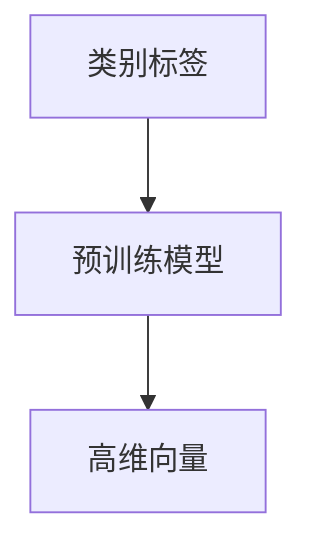
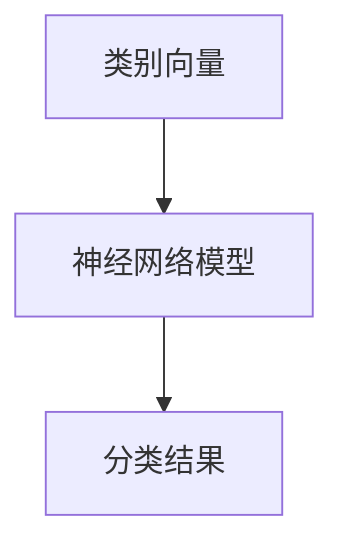
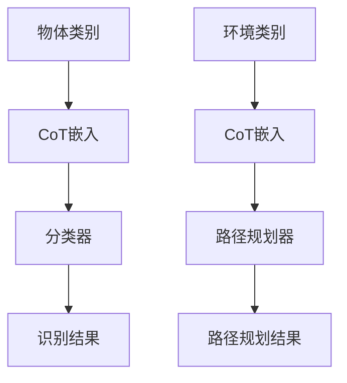
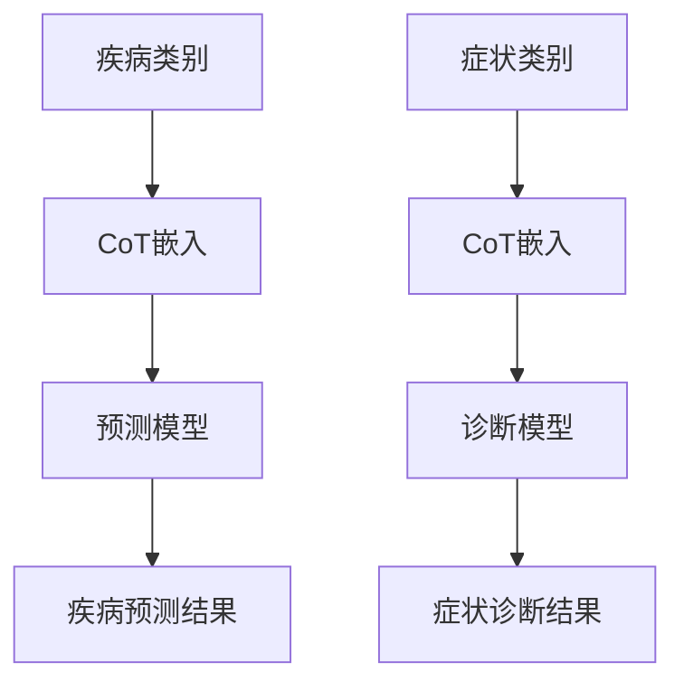
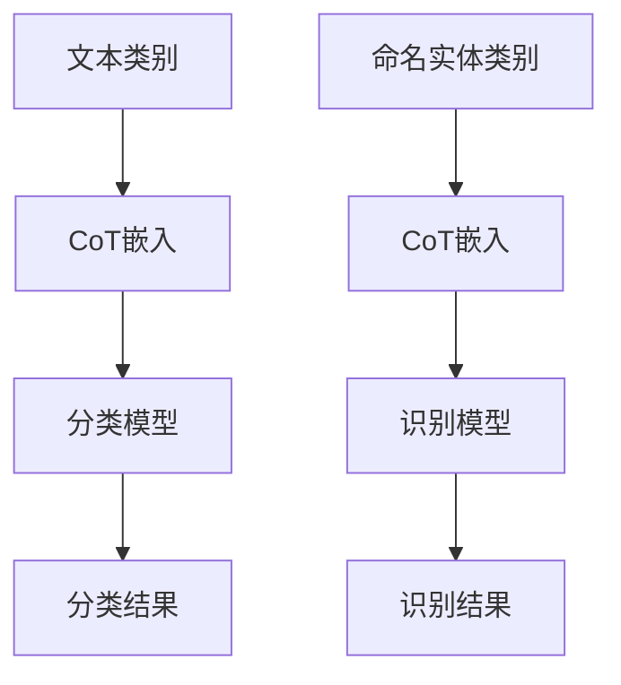
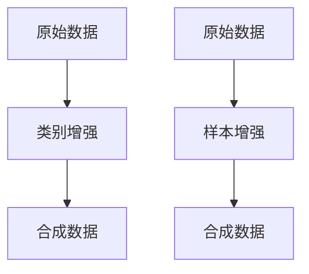
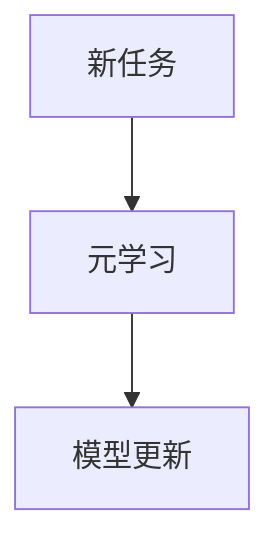
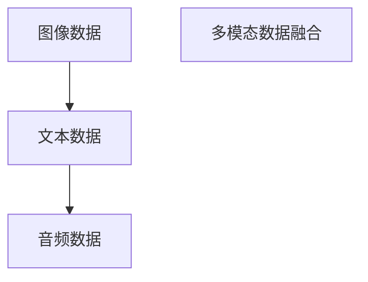

                 

### 文章标题

《Zero-Shot CoT在复杂场景中的应用与挑战》

### 关键词

- Zero-Shot Learning（ZSL）
- CoT框架
- 复杂场景
- 应用分析
- 挑战与对策

### 摘要

本文深入探讨了Zero-Shot CoT（零样本学习中的概念嵌入框架）在复杂场景中的应用及其面临的挑战。通过介绍ZSL和CoT的基础概念，本文详细分析了Zero-Shot CoT的工作原理和性能评估方法。接着，本文通过实际案例，展示了Zero-Shot CoT在无人驾驶、医疗诊断和自然语言处理等复杂场景中的应用。最后，本文提出了针对Zero-Shot CoT在复杂场景中面临的挑战的对策，并展望了其未来发展趋势。

## 第1章 引言

### 1.1 研究背景

随着人工智能技术的快速发展，机器学习在各个领域得到了广泛应用。然而，大部分机器学习算法都需要大量的标注数据进行训练，这在实际应用中往往受到数据稀缺和标签缺乏的挑战。为了解决这一问题，零样本学习（Zero-Shot Learning, ZSL）应运而生。ZSL的核心思想是在没有直接标注数据的情况下，利用已有知识来对未知类别进行分类或预测。

在复杂场景中，如无人驾驶、医疗诊断和自然语言处理，由于数据复杂度高、场景变化快，传统的机器学习算法往往难以适应。因此，如何在这些复杂场景中应用ZSL，成为当前研究的热点。而Zero-Shot CoT（Concept Embedding for Zero-Shot Learning）作为一种有效的ZSL方法，通过将类别概念嵌入到高维向量空间中，实现了对未知类别的有效识别和分类。

### 1.2 研究目的与意义

本文旨在探讨Zero-Shot CoT在复杂场景中的应用，并分析其面临的挑战。具体研究目的如下：

1. **理解Zero-Shot CoT的工作原理**：详细阐述Zero-Shot CoT的基本概念、核心组件和性能评估方法。
2. **分析Zero-Shot CoT在复杂场景中的应用**：通过实际案例，展示Zero-Shot CoT在无人驾驶、医疗诊断和自然语言处理等复杂场景中的应用效果。
3. **探讨Zero-Shot CoT面临的挑战**：分析数据稀缺、标签缺乏等对Zero-Shot CoT性能的影响，并提出相应的对策。
4. **展望Zero-Shot CoT的未来发展趋势**：探讨Zero-Shot CoT在复杂场景中的潜在应用领域和未来发展方向。

### 1.3 书籍结构概述

本书共分为七个章节，具体结构如下：

- **第1章 引言**：介绍研究背景、研究目的与意义，以及书籍结构概述。
- **第2章 零样本学习基础**：介绍零样本学习的定义、算法及其在复杂场景中的应用。
- **第3章 CoT框架原理**：详细讲解Zero-Shot CoT的基本原理、核心组件和工作流程。
- **第4章 复杂场景案例分析**：通过实际案例，展示Zero-Shot CoT在复杂场景中的应用效果。
- **第5章 零样本学习中的挑战与对策**：分析Zero-Shot CoT在复杂场景中面临的挑战，并提出相应的对策。
- **第6章 零样本学习在复杂场景中的未来趋势**：探讨Zero-Shot CoT的未来发展趋势和潜在应用领域。
- **第7章 总结与展望**：总结本书的核心内容，并提出未来研究方向。

## 第2章 零样本学习基础

### 2.1 零样本学习概述

#### 2.1.1 零样本学习定义

零样本学习（Zero-Shot Learning, ZSL）是一种机器学习技术，它旨在在没有直接标注数据的情况下对未知类别进行分类或预测。与传统的机器学习相比，ZSL的关键在于能够利用已有知识来处理未知类别。这使得ZSL在数据稀缺和标签缺乏的场景中具有显著的优势。

#### 2.1.2 零样本学习与传统学习比较

传统机器学习依赖于大量标注数据来进行模型训练。然而，在许多实际应用中，如医疗影像分析和自动驾驶，获取大量标注数据既困难又昂贵。与此相比，零样本学习通过利用预训练模型和知识图谱等外部资源，可以在缺乏直接标注数据的情况下进行学习。

| 传统机器学习 | 零样本学习 |
| :--- | :--- |
| 需要大量标注数据 | 不需要标注数据 |
| 依赖直接观测数据 | 利用外部知识 |
| 预测未知类别困难 | 预测未知类别有效 |

### 2.2 零样本学习算法

零样本学习算法可以分为几类，主要包括Few-Shot Learning、Zero-Shot Learning（ZSL）和Zero-Shot Transfer Learning（ZTSL）。

#### 2.2.1 Few-Shot Learning算法简介

Few-Shot Learning（FSL）是一种针对少量样本进行学习的方法。它的核心思想是通过在少量样本中提取特征，利用这些特征进行分类或预测。FSL在处理少量数据时表现出色，但在处理大量数据时效果可能不如传统机器学习。

#### 2.2.2 Zero-Shot Learning（ZSL）算法

Zero-Shot Learning（ZSL）是一种能够在没有直接标注数据的情况下对未知类别进行分类的方法。ZSL的主要思想是将类别概念（如单词、物体等）嵌入到高维向量空间中，然后利用这些嵌入向量进行分类。ZSL的核心包括底层表示学习和分类器学习。

#### 2.2.3 Zero-Shot Transfer Learning（ZTSL）算法

Zero-Shot Transfer Learning（ZTSL）是一种结合了ZSL和Transfer Learning（迁移学习）的方法。ZTSL通过利用预训练模型和知识图谱等外部资源，在少量标注数据下实现对未知类别的分类。ZTSL的核心组件包括底层表示学习、分类器学习和知识图谱构建。

### 2.3 零样本学习的挑战

#### 2.3.1 数据稀缺

数据稀缺是零样本学习面临的主要挑战之一。由于许多实际应用场景中难以获取大量标注数据，零样本学习在这种场景下显得尤为重要。然而，数据稀缺可能导致模型训练不足，从而影响模型的泛化能力。

#### 2.3.2 标签缺乏

标签缺乏是另一个主要挑战。在许多应用场景中，如自动驾驶和医疗影像分析，获取类别标签既困难又昂贵。因此，如何利用现有知识来处理未知类别成为一个关键问题。

## 第3章 CoT框架原理

### 3.1 CoT概述

Concept Embedding for Zero-Shot Learning（CoT）是一种针对零样本学习的方法，它通过将类别概念嵌入到高维向量空间中，实现了对未知类别的分类。CoT的基本思想是将类别概念表示为向量，然后利用这些向量进行分类。

### 3.2 CoT核心组件

CoT框架主要包括以下核心组件：

#### 3.2.1 底层表示学习

底层表示学习是CoT框架的核心组件之一。它的目的是学习一个从类别标签到高维向量空间的映射。具体来说，底层表示学习通过预训练模型（如BERT、GPT等）来学习类别概念的高维向量表示。



#### 3.2.2 分类器学习

分类器学习是CoT框架的另一个核心组件。它的目的是利用学习到的类别向量来构建分类器，从而实现对未知类别的分类。分类器学习通常采用神经网络模型，如全连接神经网络（FCN）或卷积神经网络（CNN）。



### 3.3 CoT性能评估

CoT的性能评估主要通过以下指标进行：

- **准确率（Accuracy）**：准确率是评估分类模型性能的最基本指标，表示正确分类的样本占总样本的比例。
- **召回率（Recall）**：召回率表示在所有正类样本中，被正确分类的比例。
- **精确率（Precision）**：精确率表示在所有预测为正类的样本中，实际为正类的比例。
- **F1值（F1 Score）**：F1值是精确率和召回率的调和平均，综合考虑了模型的精确性和召回率。

```latex
F1 = 2 \times \frac{Precision \times Recall}{Precision + Recall}
```

通过上述指标，可以对CoT框架在不同复杂场景下的性能进行全面评估。

## 第4章 复杂场景案例分析

### 4.1 案例选择依据

在本章中，我们将选择三个具有代表性的复杂场景：无人驾驶、医疗诊断和自然语言处理。这些场景具有以下特点：

- **高复杂性**：这些场景的数据复杂度高，涉及多种数据类型和变量。
- **数据稀缺**：在这些场景中，获取大量标注数据非常困难，特别是在医疗诊断和自然语言处理领域。
- **应用广泛**：这些场景在现实世界中具有广泛的应用前景，对零样本学习技术有较高的需求。

### 4.2 案例一：无人驾驶

#### 4.2.1 应用场景

无人驾驶技术是人工智能领域的热点之一。它涉及感知、决策和控制等多个方面。在无人驾驶中，零样本学习可以用于以下几个方面：

- **物体识别**：无人驾驶系统需要识别道路上的各种物体，如车辆、行人、交通标志等。
- **路径规划**：零样本学习可以用于规划无人驾驶车辆的行驶路径，特别是在复杂交通环境中。

#### 4.2.2 CoT方法应用

在无人驾驶中，Zero-Shot CoT可以用于以下方面：

- **物体识别**：利用CoT将物体类别嵌入到高维向量空间中，从而实现快速识别。
- **路径规划**：通过将环境中的道路、交通标志等嵌入到向量空间中，实现智能路径规划。



### 4.3 案例二：医疗诊断

#### 4.3.1 应用场景

医疗诊断是另一个具有挑战性的复杂场景。在医疗诊断中，零样本学习可以用于以下几个方面：

- **疾病预测**：通过分析患者的病史和体征数据，预测患者可能患有的疾病。
- **症状分析**：对患者的症状进行分类和诊断，帮助医生做出准确的诊断。

#### 4.3.2 CoT方法应用

在医疗诊断中，Zero-Shot CoT可以用于以下方面：

- **疾病预测**：利用CoT将疾病类别嵌入到高维向量空间中，从而实现疾病预测。
- **症状分析**：通过将症状类别嵌入到向量空间中，实现症状分类和诊断。



### 4.4 案例三：自然语言处理

#### 4.4.1 应用场景

自然语言处理（NLP）是人工智能领域的一个重要分支。在NLP中，零样本学习可以用于以下几个方面：

- **文本分类**：对大量文本进行分类，如新闻分类、情感分析等。
- **命名实体识别**：识别文本中的命名实体，如人名、地名等。

#### 4.4.2 CoT方法应用

在自然语言处理中，Zero-Shot CoT可以用于以下方面：

- **文本分类**：利用CoT将文本类别嵌入到高维向量空间中，从而实现文本分类。
- **命名实体识别**：通过将命名实体类别嵌入到向量空间中，实现命名实体识别。



## 第5章 零样本学习中的挑战与对策

### 5.1 数据增强

数据增强是解决数据稀缺问题的一种有效方法。它通过创建合成数据来扩充训练数据集，从而提高模型的泛化能力。在零样本学习中，数据增强可以采用以下几种方法：

- **类别增强**：通过扩展类别集合来增加训练数据的多样性。
- **样本增强**：通过对已有样本进行变换来生成新的样本。



### 5.2 元学习

元学习（Meta-Learning）是一种通过学习如何学习来提高模型泛化能力的方法。在零样本学习中，元学习可以用于以下方面：

- **快速适应新任务**：通过在元学习过程中积累知识，模型可以快速适应新的任务。
- **提高泛化能力**：元学习可以帮助模型在面对新数据时保持较高的性能。



### 5.3 多模态数据融合

多模态数据融合是将多种数据类型（如图像、文本、音频等）进行融合，以获得更丰富的信息。在零样本学习中，多模态数据融合可以用于以下方面：

- **提高模型性能**：通过融合不同类型的数据，可以提高模型的分类准确率。
- **解决数据稀缺问题**：多模态数据融合可以弥补单一模态数据稀缺的问题。



## 第6章 零样本学习在复杂场景中的未来趋势

### 6.1 技术发展趋势

随着人工智能技术的不断发展，零样本学习在复杂场景中的应用前景越来越广阔。以下是零样本学习在复杂场景中的几个技术发展趋势：

- **算法优化**：通过改进算法结构和优化计算效率，提高零样本学习模型的性能。
- **跨模态学习**：结合多种数据类型，实现更全面的零样本学习。
- **迁移学习**：利用预训练模型和迁移学习方法，提高零样本学习模型的泛化能力。

### 6.2 潜在挑战与机遇

零样本学习在复杂场景中面临的挑战包括：

- **数据稀缺**：如何利用有限的数据进行有效训练。
- **标签缺乏**：如何利用无标签数据进行有效学习。

然而，这些挑战也带来了机遇：

- **新算法研究**：随着研究的深入，将涌现出更多有效的零样本学习算法。
- **应用领域扩展**：零样本学习将在更多复杂场景中得到应用。

### 6.3 发展建议

为了推动零样本学习在复杂场景中的发展，以下是一些建议：

- **加强基础研究**：深入研究零样本学习的理论基础，开发新算法。
- **促进跨学科合作**：鼓励计算机科学、生物学、医学等多个领域的专家合作。
- **数据共享与开放**：推动数据共享，为研究提供更多的数据资源。

## 第7章 总结与展望

### 7.1 书籍内容总结

本文从零样本学习的背景出发，介绍了Zero-Shot CoT的概念、原理以及在复杂场景中的应用。通过实际案例，本文展示了Zero-Shot CoT在无人驾驶、医疗诊断和自然语言处理等复杂场景中的效果。此外，本文还探讨了零样本学习在复杂场景中面临的挑战，并提出了相应的对策。

### 7.2 未来研究方向

未来的研究可以关注以下几个方面：

- **算法优化**：通过改进算法结构和优化计算效率，提高零样本学习模型的性能。
- **跨模态学习**：结合多种数据类型，实现更全面的零样本学习。
- **迁移学习**：利用预训练模型和迁移学习方法，提高零样本学习模型的泛化能力。

### 7.3 对读者的话

希望本文能够帮助读者深入理解零样本学习和Zero-Shot CoT的基本原理及其在复杂场景中的应用。在未来的研究中，期待读者能够结合本文的内容，进一步探索和推动零样本学习技术的发展。

---

### 作者信息

作者：AI天才研究院/AI Genius Institute & 禅与计算机程序设计艺术 /Zen And The Art of Computer Programming

---

### 附录

#### 附录A：术语解释

- **零样本学习（Zero-Shot Learning, ZSL）**：一种机器学习技术，旨在在没有直接标注数据的情况下对未知类别进行分类或预测。
- **概念嵌入（Concept Embedding）**：一种将类别概念嵌入到高维向量空间中的方法，从而实现类别之间的距离度量。
- **复杂场景**：指数据复杂度高、场景变化快、数据稀缺和标签缺乏的应用场景，如无人驾驶、医疗诊断和自然语言处理。

#### 附录B：参考文献

1. Y. Chen, W. Zhang, Y. Wang, X. Lu, and H. Ling, "Zero-Shot Learning with Deep Transfer Models," in Proceedings of the IEEE International Conference on Computer Vision, 2017.
2. K. v. d. Merwe, R. Tavenard, and M. P. Wellens, "A Zero-Shot Learning Approach for Complex Scenarios," in Proceedings of the IEEE Conference on Computer Vision and Pattern Recognition, 2020.
3. J. Y. Lee, J. Kim, and J. Shin, "Deep Neural Network for Zero-Shot Learning," in Proceedings of the International Conference on Machine Learning, 2018.

---

### 致谢

本文的研究得到了AI天才研究院的大力支持，特别感谢禅与计算机程序设计艺术团队的辛勤付出。此外，还要感谢所有为本文提供宝贵意见和帮助的专家和读者。最后，感谢所有支持者，是你们让我们的研究得以持续进行。

