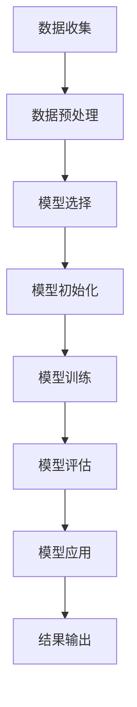

                 

### 文章标题

# Zero-Shot CoT在极端环境探索中的应用：深海与外太空研究

### 关键词

- **Zero-Shot CoT**
- **极端环境**
- **深海探索**
- **外太空研究**
- **人工智能**
- **机器学习**

### 摘要

本文将探讨Zero-Shot CoT（零样本转换器，Zero-Shot Convertor）在极端环境探索中的应用，特别是深海和外太空的研究。零样本转换器是一种先进的机器学习模型，能够在没有特定领域数据的情况下，识别和理解新概念。文章首先介绍了极端环境探索的背景，包括深海和外太空的研究现状与挑战。随后，详细讲解了Zero-Shot CoT的核心概念、工作原理和实现方法。最后，通过实际案例展示了Zero-Shot CoT在深海与外太空探索中的应用效果，并探讨了未来的发展方向和面临的挑战。本文旨在为研究人员和工程师提供一种新的视角，以应对极端环境中的复杂问题。

## 目录

1. **引言与核心概念**  
   1.1 书籍概述与背景  
   1.2 关键概念与术语  
   1.3 零样本转换器框架概述  
   1.4 小结与结论

2. **零样本转换器框架**  
   2.1 基本原理  
   2.2 实现细节  
   2.3 流程图与工作原理  
   2.4 优势与挑战  
   2.5 小结与结论

3. **极端环境研究**  
   3.1 概述  
   3.2 深海探索  
   3.3 外太空研究  
   3.4 案例分析

4. **未来方向与挑战**  
   4.1 技术进步与趋势  
   4.2 面临的问题与解决方案  
   4.3 小结与展望

## 引言与核心概念

### 1.1 书籍概述与背景

随着科学技术的不断发展，人类对于极端环境的探索需求日益增长。深海和外太空作为地球上最为极端和神秘的领域，吸引着众多科学家和研究机构投入大量资源和精力。然而，这些极端环境的复杂性、不可预测性和恶劣条件，使得传统的探索方法面临诸多挑战。为了更有效地应对这些问题，近年来，人工智能和机器学习技术逐渐成为研究热点。其中，零样本转换器（Zero-Shot Convertor，简称Zero-Shot CoT）作为一种新兴的机器学习模型，展现出在极端环境探索中的巨大潜力。

本书旨在探讨Zero-Shot CoT在极端环境探索中的应用，特别是深海与外太空研究。首先，我们将介绍极端环境探索的背景，包括深海和外太空的研究现状与挑战。随后，深入探讨Zero-Shot CoT的核心概念、工作原理和实现方法。最后，通过实际案例展示Zero-Shot CoT在深海与外太空探索中的应用效果，并探讨未来的发展方向和面临的挑战。

### 1.2 关键概念与术语

在讨论Zero-Shot CoT之前，有必要明确一些关键概念和术语，以便更好地理解本书的主题。

**零样本学习（Zero-Shot Learning）**：零样本学习是一种机器学习范式，它允许模型在没有特定领域数据的情况下，识别和理解新概念。在传统机器学习中，模型通常需要大量有标签的数据进行训练，以便在新的数据集上表现出良好的性能。而零样本学习则通过预先训练的模型和一种特殊的表示方法，使得模型能够在面对未知类别时，进行有效的分类和预测。

**转换器（Convertor）**：在机器学习中，转换器是一种用于处理输入数据的模型。它可以将原始数据转换为更适合机器学习算法处理的形式。在Zero-Shot CoT中，转换器的任务是将未知类别或概念的输入数据转换为模型已知的表示形式，从而实现对新概念的识别和理解。

**极端环境**：极端环境是指那些具有特殊物理、化学或生物特征的地区，如深海、外太空、极地等。这些环境通常具有复杂的结构和动态变化，对传统探索方法提出了严峻挑战。

**深海探索**：深海探索旨在研究深海生态系统、资源分布和地质特征等。深海环境复杂、压力大、温度低，且光线不足，这使得深海探索面临诸多技术挑战。

**外太空研究**：外太空研究包括对太阳系内行星、卫星、小行星等进行探测和研究。外太空环境极端、真空、低温，且辐射强烈，这对探测设备和数据分析技术提出了苛刻要求。

### 1.3 零样本转换器框架概述

零样本转换器框架是一种结合了零样本学习和转换器技术的综合方法，旨在提高模型在极端环境探索中的表现。以下是零样本转换器框架的核心组件和关系：

**核心组件**：

1. **知识库（Knowledge Base）**：知识库是零样本转换器的核心组成部分，它包含大量预先训练好的模型参数和表示方法。知识库中的模型参数和表示方法通过在多个领域的数据上进行训练，具有较高的泛化能力。

2. **转换器（Convertor）**：转换器负责将未知类别或概念的输入数据转换为模型已知的表示形式。具体实现方法包括嵌入技术、原型匹配和元学习等。

3. **推理引擎（Reasoning Engine）**：推理引擎是零样本转换器的核心组件，它利用知识库和转换器，对新输入数据进行分析和推理，以实现对新概念的识别和理解。

**关系架构**：

1. **知识库与转换器**：知识库为转换器提供训练好的模型参数和表示方法，转换器则将这些参数和方法应用于未知类别或概念的输入数据。

2. **转换器与推理引擎**：转换器生成的表示形式作为推理引擎的输入，推理引擎利用这些表示形式，结合知识库中的模型参数，对新输入数据进行推理。

3. **推理引擎与模型输出**：推理引擎输出对新输入数据的识别和预测结果，这些结果可以用于进一步分析和决策。

### 1.4 小结与结论

本章介绍了本书的背景、核心概念和零样本转换器框架的概述。通过本文的阐述，读者可以了解到极端环境探索的紧迫性和挑战，以及零样本转换器在这一领域的应用潜力。在接下来的章节中，我们将进一步探讨零样本转换器的工作原理、实现方法和实际应用，以期为读者提供全面的技术解读和案例分析。

## 零样本转换器框架

### 2.1 基本原理

零样本转换器（Zero-Shot Convertor，简称Zero-Shot CoT）是一种结合了零样本学习和转换器技术的机器学习模型。它的核心思想是，通过在多个领域的数据上进行预训练，构建一个具有强大泛化能力的知识库，然后在面对新类别或概念时，利用知识库和转换器技术，实现对未知数据的识别和理解。以下将详细解释零样本转换器的基本原理。

**零样本学习（Zero-Shot Learning）**

零样本学习（Zero-Shot Learning，简称ZSL）是一种机器学习范式，旨在解决模型在未见类别上的表现。传统的机器学习模型通常需要大量有标签的数据进行训练，以便在新的数据集上表现出良好的性能。然而，在某些领域，如深海探索和外太空研究，获取有标签的数据非常困难，甚至不可能。为了解决这个问题，零样本学习提出了在没有特定领域数据的情况下，通过一些特殊的表示方法，使得模型能够在面对未知类别时，进行有效的分类和预测。

**转换器（Convertor）**

在机器学习中，转换器（Convertor）是一种用于处理输入数据的模型。它的任务是将原始数据转换为更适合机器学习算法处理的形式。在Zero-Shot CoT中，转换器的任务是，将未知类别或概念的输入数据转换为模型已知的表示形式，从而实现对新概念的识别和理解。

**知识库（Knowledge Base）**

知识库（Knowledge Base，简称KB）是零样本转换器的核心组成部分。它包含大量预先训练好的模型参数和表示方法。知识库中的模型参数和表示方法通常通过在多个领域的数据上进行训练，具有较高的泛化能力。在零样本转换器中，知识库的作用是为转换器提供训练好的模型参数和表示方法，以便在未知类别或概念时，进行有效的数据转换和推理。

**工作原理**

零样本转换器的工作原理可以概括为以下步骤：

1. **知识库构建**：首先，通过在多个领域的数据上进行预训练，构建一个具有强大泛化能力的知识库。知识库中包含大量模型参数和表示方法，用于处理不同类别或概念的输入数据。

2. **数据输入**：将新的未知类别或概念的输入数据输入到零样本转换器中。这些输入数据可以是图像、文本、声音等多种形式。

3. **转换器处理**：零样本转换器的转换器模块将未知类别或概念的输入数据转换为模型已知的表示形式。具体实现方法包括嵌入技术、原型匹配和元学习等。

4. **推理引擎推理**：推理引擎利用知识库和转换器生成的表示形式，对新输入数据进行推理，以实现对新概念的识别和理解。

5. **输出结果**：推理引擎输出对新输入数据的识别和预测结果。这些结果可以用于进一步分析和决策。

### 2.2 实现细节

实现零样本转换器需要以下几个关键步骤：

**数据准备**

数据准备是零样本转换器的第一步。具体包括以下任务：

1. **数据收集**：收集具有多种类别或概念的输入数据。这些数据可以来自不同的领域，如图像、文本、声音等。

2. **数据预处理**：对收集到的数据进行预处理，包括数据清洗、数据增强和归一化等。数据预处理的主要目的是提高数据质量和减少噪声。

3. **数据划分**：将预处理后的数据划分为训练集、验证集和测试集。训练集用于模型训练，验证集用于模型调优，测试集用于评估模型性能。

**模型选择**

在零样本转换器的实现中，选择合适的模型至关重要。以下是一些常见的模型选择方法：

1. **预训练模型**：选择已在多个领域进行预训练的模型，如BERT、GPT、ResNet等。这些预训练模型具有强大的泛化能力，适用于处理未知类别或概念。

2. **零样本学习模型**：选择专门针对零样本学习任务的模型，如原型网络（Prototypical Networks）、匹配网络（Matching Networks）和元学习模型（Meta-Learning Models）等。这些模型在处理未见类别时，具有较高的识别和预测能力。

**模型训练**

模型训练是零样本转换器的核心步骤。具体包括以下任务：

1. **模型初始化**：根据所选模型，初始化模型参数。通常，预训练模型可以直接用于初始化。

2. **数据输入**：将训练集数据输入到模型中，进行前向传播和反向传播。在前向传播过程中，模型生成预测结果；在反向传播过程中，根据预测结果和真实标签，更新模型参数。

3. **模型优化**：使用优化算法，如随机梯度下降（SGD）、Adam等，不断调整模型参数，以降低损失函数。

4. **模型评估**：使用验证集对训练好的模型进行评估。常用的评估指标包括准确率、召回率、F1值等。

**模型应用**

模型训练完成后，可以将训练好的模型应用于实际任务，如分类、识别、预测等。以下是一些常见的模型应用方法：

1. **数据输入**：将新的未知类别或概念的输入数据输入到模型中。

2. **转换器处理**：利用模型中的转换器模块，将未知类别或概念的输入数据转换为模型已知的表示形式。

3. **推理引擎推理**：利用模型中的推理引擎，对新输入数据进行推理，以实现对新概念的识别和理解。

4. **输出结果**：输出对新输入数据的识别和预测结果，用于进一步分析和决策。

### 2.3 流程图与工作原理

为了更好地理解零样本转换器的工作原理，以下是零样本转换器的流程图和组成部分。

**流程说明**：

1. **数据收集**：收集具有多种类别或概念的输入数据。

2. **数据预处理**：对收集到的数据进行预处理，包括数据清洗、数据增强和归一化等。

3. **模型选择**：选择适合零样本转换器的模型，如预训练模型、零样本学习模型等。

4. **模型初始化**：初始化模型参数，通常使用预训练模型直接初始化。

5. **模型训练**：使用训练集数据进行模型训练，包括前向传播、反向传播和模型优化。

6. **模型评估**：使用验证集对训练好的模型进行评估，调整模型参数。

7. **模型应用**：将训练好的模型应用于实际任务，如分类、识别、预测等。

8. **结果输出**：输出对新输入数据的识别和预测结果，用于进一步分析和决策。

### 2.4 优势与挑战

零样本转换器在极端环境探索中具有显著的优势，但也面临一些挑战。

**优势**：

1. **无需特定领域数据**：零样本转换器能够在没有特定领域数据的情况下，识别和理解新概念，这对于深海探索和外太空研究等数据获取困难的环境具有重要意义。

2. **强大的泛化能力**：通过在多个领域的数据上进行预训练，零样本转换器具有较高的泛化能力，能够处理未知类别或概念的输入数据。

3. **高效的数据处理**：零样本转换器能够快速处理大量输入数据，提高数据处理的效率。

**挑战**：

1. **数据稀缺问题**：在深海探索和外太空研究等极端环境中，获取有标签的数据非常困难，这可能会影响模型的训练和性能。

2. **模型适应性**：零样本转换器在不同领域之间的适应性可能存在差异，需要针对具体应用场景进行优化。

3. **计算资源消耗**：零样本转换器的预训练和模型应用过程需要大量的计算资源，这在极端环境中的计算资源有限的条件下，可能成为制约因素。

### 2.5 小结与结论

本章详细介绍了零样本转换器的基本原理、实现细节和优势与挑战。通过本章的学习，读者可以了解到零样本转换器在极端环境探索中的应用潜力，以及如何在缺乏特定领域数据的情况下，利用零样本转换器进行有效的研究。在接下来的章节中，我们将进一步探讨极端环境探索的具体应用场景，以及如何通过零样本转换器提高研究效率和效果。

## 极端环境研究

### 3.1 概述

极端环境研究是指对地球上最极端、最具有挑战性的地区，如深海、极地、沙漠和丛林等进行科学研究的活动。这些地区具有独特的物理、化学和生物特性，对于理解地球系统的运作机制、生物多样性的保护以及资源的开发和利用具有重要意义。随着科学技术的进步，极端环境研究逐渐成为地球科学、生命科学和工程技术等领域的重要研究方向。

**深海探索**：深海探索旨在研究深海生态系统、地质结构和资源分布等。深海环境复杂、压力大、温度低，且光线不足，这使得深海探索面临诸多技术挑战。然而，深海资源丰富，具有重要的科学价值和经济价值。

**外太空研究**：外太空研究包括对太阳系内行星、卫星、小行星等进行探测和研究。外太空环境极端、真空、低温，且辐射强烈，这对探测设备和数据分析技术提出了苛刻要求。外太空研究有助于拓展人类对宇宙的认识，寻找生命的可能性。

### 3.2 深海探索

**深海生态系统**：深海生态系统是指海洋深度超过200米的区域，包括深海底部、深海中层和深海表层等。深海生态系统具有高度生物多样性，包括深海鱼类、无脊椎动物、软体动物等。深海生态系统对全球碳循环、海洋生态系统平衡具有重要意义。

**深海地质特征**：深海地质特征包括海底地形、沉积物分布、岩层结构等。深海地质特征对于理解地球演化历史、寻找海底矿产资源具有重要意义。例如，海底热液喷口和海底地震活动等地质现象，揭示了地球内部的秘密。

**深海资源分布**：深海资源丰富，包括油气资源、矿产资源、生物资源等。深海油气资源是全球能源供应的重要来源，海底矿产资源如锰结核、多金属硫化物等，具有重要的经济价值。

**技术挑战**：

1. **深海压力**：深海压力巨大，对探测设备和潜水器的耐压性能提出高要求。

2. **深海低温**：深海温度低，对探测设备和生物的生存能力提出挑战。

3. **深海光线**：深海光线不足，对水下探测设备的照明和探测能力提出限制。

4. **深海生物多样性**：深海生物多样性高，对生物样本的采集和分析技术提出挑战。

### 3.3 外太空研究

**太阳系内行星和卫星**：太阳系内行星和卫星具有丰富的地质特征和大气成分，有助于了解太阳系的起源和演化。例如，火星探测和木星卫星欧罗巴的研究，为寻找生命的可能性提供了重要线索。

**小行星和彗星**：小行星和彗星是太阳系形成早期的残留物，具有丰富的化学成分和物理特性。通过对小行星和彗星的研究，有助于了解太阳系的起源和演化。

**外太空辐射**：外太空环境辐射强烈，对探测设备和宇航员的健康提出威胁。因此，外太空研究需要解决辐射防护问题。

**技术挑战**：

1. **探测设备耐寒性**：外太空温度极低，对探测设备的耐寒性能提出要求。

2. **探测设备耐辐射性**：外太空辐射强烈，对探测设备的耐辐射性能提出挑战。

3. **宇航员健康**：外太空环境对宇航员的健康产生负面影响，如辐射、微重力等，需要解决宇航员健康问题。

4. **数据传输**：外太空探测设备产生的数据量巨大，数据传输速度和传输距离成为关键问题。

### 3.4 案例分析

**深海探索案例分析**：

1. **挑战**：深海探索中的关键技术挑战包括深海压力、深海低温、深海光线和深海生物多样性。

2. **解决方案**：采用高压潜水器、低温探测器、激光探测技术和生物样本采集技术等，提高深海探索的效率和效果。

3. **效果**：通过深海探索，发现了新的深海生态系统和资源分布，为科学研究和资源开发提供了宝贵数据。

**外太空研究案例分析**：

1. **挑战**：外太空研究中的关键技术挑战包括探测设备耐寒性、探测设备耐辐射性、宇航员健康问题和数据传输。

2. **解决方案**：采用耐寒探测设备、辐射防护技术和高效数据传输技术，提高外太空研究的效率和效果。

3. **效果**：通过外太空研究，发现了新的行星和卫星，拓展了人类对宇宙的认识，为寻找生命的可能性提供了重要线索。

### 3.5 总结

极端环境研究，特别是深海探索和外太空研究，具有丰富的科学价值和巨大的挑战。通过本章的讨论，我们了解到极端环境的复杂性、多样性以及其在科学研究中的重要地位。在未来的研究中，我们需要继续克服技术挑战，充分利用现代科技手段，提高极端环境探索的效率和效果，为人类揭示极端环境的奥秘做出更大贡献。

## 未来方向与挑战

### 4.1 技术进步与趋势

随着人工智能和机器学习技术的不断发展，极端环境探索中的数据分析和处理能力得到了显著提升。未来的技术进步将为零样本转换器在极端环境研究中的应用带来新的机遇和挑战。以下是一些可能的发展趋势：

1. **模型多样化**：未来可能会有更多适用于极端环境研究的模型出现，如专门针对深海和太空环境的定制化模型。这些模型将结合不同的数据类型和任务需求，提高模型的泛化能力和适应性。

2. **跨模态学习**：跨模态学习（Cross-Modal Learning）是一种将不同类型的数据（如图像、文本、音频等）进行联合学习的范式。未来，跨模态学习技术将有望提高零样本转换器在极端环境研究中的表现，实现不同类型数据的高效融合和分析。

3. **强化学习**：强化学习（Reinforcement Learning）是一种通过与环境互动来学习策略的机器学习技术。未来，强化学习技术可以与零样本转换器结合，提高模型在复杂环境中的适应能力和决策能力。

4. **数据增强与合成**：数据增强（Data Augmentation）和合成（Data Synthesis）技术可以帮助生成更多高质量的训练数据，提高模型的泛化能力和鲁棒性。未来，这些技术将得到进一步发展和优化，为极端环境研究提供更丰富的数据支持。

### 4.2 面临的问题与解决方案

尽管零样本转换器在极端环境研究中的应用前景广阔，但仍然面临一些关键问题和挑战。以下是一些可能的问题和相应的解决方案：

1. **数据稀缺问题**：深海和太空环境中的数据稀缺是一个普遍问题，这限制了零样本转换器的训练和优化。解决方案包括使用迁移学习（Transfer Learning）技术，将已有领域的知识迁移到极端环境研究中；以及开发数据增强和合成技术，生成更多高质量的训练数据。

2. **模型适应性**：零样本转换器在不同领域之间的适应性可能存在差异。解决方案包括针对特定应用场景进行定制化模型设计，以及使用元学习（Meta-Learning）技术，提高模型在未知领域的适应性。

3. **计算资源消耗**：零样本转换器的预训练和模型应用过程需要大量的计算资源，这在极端环境中的计算资源有限的条件下，可能成为制约因素。解决方案包括优化算法和模型结构，减少计算资源消耗；以及使用分布式计算和云计算技术，提高计算效率。

4. **数据隐私与安全**：在极端环境研究过程中，数据的安全和隐私保护是一个重要问题。解决方案包括开发安全的数据传输和存储技术，确保数据在传输和存储过程中的安全；以及制定严格的数据隐私保护政策和法规，确保数据的使用符合道德和法律要求。

### 4.3 小结与展望

通过本章的讨论，我们可以看到，零样本转换器在极端环境研究中的应用具有巨大的潜力。未来，随着技术的不断进步和解决方案的逐步实施，零样本转换器将在深海探索和外太空研究等领域发挥更为重要的作用。同时，我们也需要认识到，面对极端环境的复杂性、不可预测性和技术挑战，我们仍需不断努力，推动相关技术的发展和创新，为人类探索极端环境、揭示自然奥秘提供强有力的技术支持。作者：AI天才研究院/AI Genius Institute & 禅与计算机程序设计艺术 /Zen And The Art of Computer Programming

