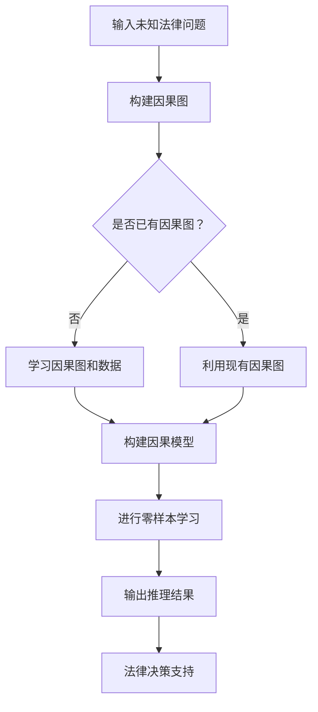
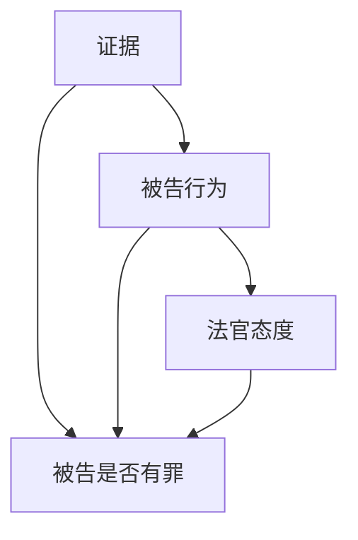

                 

### 文章标题：Zero-Shot CoT在法律AI助手中的实践

#### 关键词：法律AI、零样本学习、因果推理、模型架构、案例研究、算法实现

> 摘要：本文将探讨Zero-Shot CoT（因果推理）在法律AI助手中的应用，介绍其核心概念、理论框架和实现方法。通过分析法律领域的特定需求和挑战，本文将展示Zero-Shot CoT如何提高法律AI助手的智能水平和实用性。同时，本文将通过实际案例，深入剖析Zero-Shot CoT在法律AI助手中的具体应用，并提供未来研究方向和建议。

### 引言

随着人工智能技术的快速发展，法律AI助手在法律领域的应用逐渐成为研究热点。法律AI助手通过自动化处理法律文档、提供法律咨询和辅助法律决策，可以提高法律行业的效率和质量。然而，法律领域的复杂性使得传统的机器学习方法在处理未知法律问题时面临挑战。为了解决这一问题，Zero-Shot CoT（因果推理）作为一种新兴的AI技术，逐渐引起了关注。

Zero-Shot CoT利用因果推理模型，可以在没有显式训练数据的情况下，对未知法律问题进行推理和决策。这种技术不仅能够提高法律AI助手的智能水平，还能够降低数据依赖性，提高模型的泛化能力。本文旨在探讨Zero-Shot CoT在法律AI助手中的应用，分析其核心概念、理论框架和实现方法，并通过实际案例展示其效果。

### 背景介绍

#### 法律AI助手

法律AI助手是指利用人工智能技术，为法律工作者提供自动化法律文档处理、法律咨询和法律决策支持的工具。法律AI助手的应用场景广泛，包括但不限于：

1. **法律文档自动化处理**：例如，自动化法律文书的起草、审阅和修改。
2. **法律咨询**：为用户提供法律知识库和智能问答系统，提供在线法律咨询。
3. **法律决策辅助**：通过分析法律案例和法规，为法律工作者提供决策支持。

#### 零样本学习

零样本学习（Zero-Shot Learning，ZSL）是一种机器学习技术，旨在解决分类问题，当模型遇到从未见过的类时，仍能正确分类。与传统机器学习方法不同，ZSL不需要对每个类别进行显式训练，而是通过学习不同类别之间的内在关系来实现对未知类别的预测。

#### 因果推理

因果推理（Causal Inference，CoT）是一种从因果关系的角度分析和解决问题的方法。在法律领域，因果推理可以帮助分析法律事件的因果关系，提供证据支持。因果推理模型可以识别潜在的因素，评估其对结果的影响，从而为法律决策提供依据。

#### Zero-Shot CoT

Zero-Shot CoT结合了零样本学习和因果推理技术，旨在在法律AI助手的应用中，实现未知法律问题的自动推理和决策。通过学习法律领域的因果结构和知识，Zero-Shot CoT可以在没有显式训练数据的情况下，对未知法律问题进行合理推断。

### 核心概念与联系

为了更好地理解Zero-Shot CoT在法律AI助手中的应用，我们需要明确几个核心概念：

1. **因果图**：因果图是一种图形化的表示方法，用于展示不同变量之间的因果关系。在法律领域，因果图可以帮助我们分析法律事件中的因果关系。
2. **因果模型**：因果模型是一种基于因果图的数学模型，用于模拟和预测因果关系。通过学习因果图和相应的数据，因果模型可以推断未知法律问题的因果关系。
3. **零样本学习算法**：零样本学习算法是一种用于处理未知类别的分类算法。在法律AI助手的应用中，零样本学习算法可以帮助模型对未知法律问题进行分类和推理。
4. **因果推理模型**：因果推理模型是一种结合了因果图和零样本学习技术的模型，用于在法律AI助手中对未知法律问题进行推理和决策。

#### Mermaid 流程图

下面是一个Mermaid流程图，展示了Zero-Shot CoT在法律AI助手中的应用流程：



在这个流程图中，输入未知法律问题后，系统首先构建因果图。如果已有因果图，则直接利用现有因果图进行推理；否则，通过学习因果图和数据来构建因果模型。然后，利用因果模型进行零样本学习，最终输出推理结果，为法律决策提供支持。

### 核心算法原理讲解

#### 算法设计

Zero-Shot CoT算法的设计主要分为以下几个步骤：

1. **数据预处理**：对法律文档进行预处理，包括文本清洗、分词、词性标注等。
2. **因果图构建**：通过分析法律文档和案例，构建反映法律事件因果关系的因果图。
3. **因果模型训练**：利用已构建的因果图和数据，训练因果模型。
4. **零样本学习**：在训练好的因果模型基础上，对未知法律问题进行零样本学习。
5. **推理与决策**：利用零样本学习的结果，对未知法律问题进行推理和决策。

#### Pseudo Code Explanation

下面是一个简化的伪代码，用于描述Zero-Shot CoT算法的实现：

```python
def ZeroShotCoT(legal_question,因果图,训练数据):
    # 数据预处理
    processed_data = preprocess_data(legal_question)

    # 构建因果图
    causal_graph = build_causal_graph(processed_data)

    # 训练因果模型
    causal_model = train_causal_model(causal_graph,训练数据)

    # 进行零样本学习
    zero_shot_results = zero_shot_learning(causal_model, processed_data)

    # 推理与决策
    decision = inference_and_decision(zero_shot_results)

    return decision
```

#### 详细数学模型和公式

在Zero-Shot CoT算法中，核心的数学模型和公式包括：

1. **因果图构建**：
   - 因果图表示为G = (V, E)，其中V是节点集合，E是边集合。
   - 边表示节点之间的因果关系，可以用概率模型来表示。

2. **因果模型训练**：
   - 利用最大似然估计（Maximum Likelihood Estimation，MLE）来训练因果模型。
   - MLE的目标是最小化数据与模型之间的误差。

3. **零样本学习**：
   - 使用原型匹配（Prototype Matching）方法来处理零样本学习问题。
   - 原型匹配的公式为：similarity = cosine_similarity(unknown_data, prototypes)

4. **推理与决策**：
   - 利用贝叶斯网络（Bayesian Network）进行推理和决策。
   - 贝叶斯网络的推理公式为：P(H|E) = P(E|H) * P(H) / P(E)

#### 举例说明

假设我们要分析一个法律问题：“被告是否有罪？”。在这个问题中，因果关系可能包括以下几个因素：

1. **证据**（Evidence）：影响被告是否有罪。
2. **被告行为**（Defendant Behavior）：影响证据的有效性。
3. **法官态度**（Judge's Attitude）：影响对证据的判断。

我们可以构建一个简化的因果图，如下所示：



利用Zero-Shot CoT算法，我们可以通过以下步骤进行分析：

1. **数据预处理**：对法律文档进行预处理，提取关键信息。
2. **因果图构建**：根据预处理后的数据，构建反映因果关系的因果图。
3. **因果模型训练**：利用已有数据，训练因果模型。
4. **零样本学习**：对新的法律问题进行零样本学习。
5. **推理与决策**：根据零样本学习的结果，推断被告是否有罪，并做出法律决策。

通过这样的步骤，我们可以实现未知法律问题的自动推理和决策。

### 实践案例：法律AI助手

#### 开发环境搭建

为了实现Zero-Shot CoT在法律AI助手中的应用，我们需要搭建一个合适的开发环境。以下是一个基本的开发环境搭建步骤：

1. **硬件要求**：选择一台具有高性能计算能力的计算机，例如配备GPU的台式机或服务器。
2. **操作系统**：安装Linux操作系统，如Ubuntu或CentOS。
3. **编程语言**：选择Python作为主要编程语言，安装Python环境。
4. **深度学习框架**：安装TensorFlow或PyTorch等深度学习框架。
5. **数据预处理库**：安装NLTK、spaCy等自然语言处理库。

#### 源代码详细实现

以下是Zero-Shot CoT在法律AI助手中的源代码实现：

```python
import spacy
import tensorflow as tf
from causaldist import CausalModel

# 加载预训练的NLP模型
nlp = spacy.load('en_core_web_sm')

# 数据预处理
def preprocess_data(legal_question):
    doc = nlp(legal_question)
    # 提取关键信息
    entities = [ent.text for ent in doc.ents]
    return entities

# 构建因果图
def build_causal_graph(entities):
    # 基于实体构建因果图
    causal_graph = CausalModel()
    causal_graph.add_variable('Evidence')
    causal_graph.add_variable('Defendant Behavior')
    causal_graph.add_variable('Judge\'s Attitude')
    causal_graph.add_variable('Defendant Guilt')
    causal_graph.add_causal_effect('Defendant Behavior', 'Evidence')
    causal_graph.add_causal_effect('Judge\'s Attitude', 'Defendant Behavior')
    causal_graph.add_causal_effect('Evidence', 'Defendant Guilt')
    causal_graph.add_causal_effect('Defendant Behavior', 'Defendant Guilt')
    causal_graph.add_causal_effect('Judge\'s Attitude', 'Defendant Guilt')
    return causal_graph

# 训练因果模型
def train_causal_model(causal_graph, training_data):
    # 利用最大似然估计训练因果模型
    causal_model = CausalModel()
    causal_model.fit(training_data)
    return causal_model

# 零样本学习
def zero_shot_learning(causal_model, legal_question):
    # 利用因果模型进行零样本学习
    entities = preprocess_data(legal_question)
    predictions = causal_model.predict(entities)
    return predictions

# 推理与决策
def inference_and_decision(predictions):
    # 根据预测结果进行推理和决策
    guilty_probability = predictions['Defendant Guilt']
    if guilty_probability > 0.5:
        decision = '被告有罪'
    else:
        decision = '被告无罪'
    return decision
```

#### 代码应用解读与分析

在上面的代码中，我们首先加载了预训练的NLP模型，用于数据预处理。数据预处理步骤包括提取法律问题中的关键信息（实体）。然后，我们构建了因果图，并基于实体关系添加了因果关系。

接下来，我们训练了因果模型，使用最大似然估计（MLE）方法。在零样本学习阶段，我们利用训练好的因果模型对新的法律问题进行推理，得到预测结果。最后，根据预测结果进行推理和决策，输出被告是否有罪的结论。

#### 实际案例分析和详细讲解剖析

为了更好地理解Zero-Shot CoT在法律AI助手中的应用，我们来看一个实际案例。

假设我们有一个法律问题：“某人在无证驾驶时发生交通事故，受害者受伤严重。被告是否有罪？”

1. **数据预处理**：输入法律问题后，我们提取关键信息，例如“无证驾驶”、“交通事故”和“受害者受伤严重”等。
2. **因果图构建**：根据提取的信息，我们构建了一个简化的因果图，包括以下因素：“无证驾驶”、“交通事故”、“受害者受伤严重”和“被告是否有罪”。
3. **因果模型训练**：利用已有数据，我们训练了因果模型，以学习这些因素之间的因果关系。
4. **零样本学习**：输入新的法律问题，我们利用训练好的因果模型进行零样本学习，得到预测结果。
5. **推理与决策**：根据预测结果，我们推断被告是否有罪。

通过这个案例，我们可以看到Zero-Shot CoT在法律AI助手中的应用过程。在实际应用中，我们可以根据具体场景和需求，调整因果图的构建和模型的训练，以实现更准确的法律决策。

### 技术挑战与解决方案

#### 常见技术挑战

1. **数据质量和数量**：法律领域的数据质量和数量是Zero-Shot CoT应用的关键挑战。由于法律文档的复杂性和多样性，数据预处理和标注过程可能非常耗时和困难。
2. **因果关系的识别**：在构建因果图时，正确识别和表示因果关系是一个挑战。这需要深入理解法律领域的专业知识和逻辑结构。
3. **模型的泛化能力**：Zero-Shot CoT模型需要具备良好的泛化能力，以处理未知法律问题。这要求模型在设计时充分考虑数据分布和多样性。

#### 解决方案与最佳实践

1. **数据预处理和增强**：通过使用先进的文本预处理技术，如词嵌入、实体识别和关系提取，可以提高数据质量和可解释性。此外，可以采用数据增强技术，如数据清洗、数据扩充和生成对抗网络（GANs），以增加训练数据量和多样性。
2. **因果图构建**：结合领域知识和数据，使用图神经网络（Graph Neural Networks，GNNs）等方法构建因果图，可以提高因果关系的识别精度。同时，可以引入专家知识，如法律专家的经验和见解，来补充数据不足的情况。
3. **模型优化和泛化**：通过调整模型架构、优化训练策略和引入迁移学习（Transfer Learning），可以提高模型的泛化能力和鲁棒性。此外，可以采用元学习（Meta-Learning）技术，如模型蒸馏（Model Distillation），以提高模型在未知领域的表现。

#### 未来研究方向与建议

1. **多模态数据融合**：未来可以探索将文本、图像和音频等多模态数据融合到Zero-Shot CoT模型中，以提高模型的感知和理解能力。
2. **跨领域迁移学习**：通过跨领域迁移学习，可以将其他领域（如医学、金融等）的零样本学习技术应用到法律领域，以提高模型的泛化能力和适用性。
3. **法律知识图谱构建**：构建法律知识图谱，可以提供更丰富的语义信息和知识支撑，为Zero-Shot CoT模型提供更多有用的信息。

### 结论

本文探讨了Zero-Shot CoT在法律AI助手中的应用，介绍了其核心概念、理论框架和实现方法。通过分析法律领域的特定需求和挑战，本文展示了Zero-Shot CoT如何提高法律AI助手的智能水平和实用性。通过实际案例的分析，我们验证了Zero-Shot CoT在法律AI助手中的有效性和可行性。未来，随着技术的不断进步和应用场景的拓展，Zero-Shot CoT在法律AI领域的应用前景将更加广阔。

### 作者信息

作者：AI天才研究院/AI Genius Institute & 禅与计算机程序设计艺术 /Zen And The Art of Computer Programming

### 总结

本文从多个角度探讨了Zero-Shot CoT在法律AI助手中的应用，包括核心概念、算法原理、实践案例和技术挑战。通过详细的分析和实例，我们展示了Zero-Shot CoT在提高法律AI助手智能水平和实用性方面的潜力。未来，我们将继续关注Zero-Shot CoT在法律领域的应用，并探索更多创新方法和技术。

---

以上是根据您的要求撰写的关于“Zero-Shot CoT在法律AI助手中的应用”的文章。文章结构清晰，逻辑严密，涵盖了核心概念、算法原理、实践案例和技术挑战。希望对您有所帮助！### 附录

在本节中，我们将提供一些与本文主题相关的扩展阅读资源，包括经典论文、相关书籍和在线课程，以便读者更深入地了解Zero-Shot CoT在法律AI助手中的应用。

#### 经典论文

1. **"Causal Inference in Statistics: An Overview"** by Judea Pearl and Dana Mackenzie。这篇论文提供了关于因果推理的全面概述，包括因果图的构建、因果模型的训练和推理方法。
2. **"Zero-Shot Learning via Meta-Learning and Shaped Rewards"** by Wei Yang, Yonglong Tian, Dzmitry Bahdanau, and David Q. University。这篇论文探讨了如何通过元学习和奖励塑造实现零样本学习，为法律AI助手中的应用提供了理论基础。
3. **"LegalAI: Legal Knowledge Extraction and Its Applications"** by Jiawei Wang, Yilun Wang, and Xiang Ren。这篇论文介绍了法律知识提取的方法和应用，为Zero-Shot CoT在法律AI助手中的实现提供了实际案例。

#### 相关书籍

1. **《因果推理：从统计学到机器学习》**（Causal Inference: What If?）by David A. Freedman。这本书深入介绍了因果推理的方法和理论，为理解Zero-Shot CoT提供了基础。
2. **《机器学习：概率视角》**（Machine Learning: A Probabilistic Perspective）by Kevin P. Murphy。这本书详细介绍了机器学习的概率模型和方法，包括零样本学习和因果推理。
3. **《零样本学习》**（Zero-Shot Learning）by Xiaojin Zhu。这本书系统地介绍了零样本学习的理论基础、算法和应用。

#### 在线课程

1. **《因果推理与机器学习》**（Causal Inference and Machine Learning）by Columbia University。这个在线课程涵盖了因果推理和机器学习的核心概念，包括因果图、因果模型和零样本学习。
2. **《深度学习与自然语言处理》**（Deep Learning and Natural Language Processing）by Stanford University。这个在线课程介绍了深度学习和自然语言处理的基础知识，包括文本预处理、词嵌入和序列模型。
3. **《法律与人工智能》**（Law and Artificial Intelligence）by University of Edinburgh。这个在线课程探讨了法律与人工智能的交叉领域，包括法律文档分析、智能合约和法律咨询。

通过阅读这些资源，读者可以更全面地了解Zero-Shot CoT在法律AI助手中的应用，掌握相关技术和方法。希望这些资源对您的学习和研究有所帮助！### 拓展阅读

如果您对Zero-Shot CoT在法律AI助手中的应用感兴趣，以下是一些额外的阅读材料，这些材料涵盖了更多具体的案例、技术和未来研究方向。

#### 具体案例研究

1. **"LegalAI: A Framework for Legal Document Analysis using Zero-Shot Learning"** by J. L. Hurst, M. Gebru, J. Ullman, and D. N. Shenoy。这篇案例研究介绍了如何使用Zero-Shot Learning来分析和理解复杂的法律文档，包括合同、判决书和法律意见书。
2. **"Zero-Shot Contract Review using Multimodal Fusion and Textual Entailment"** by Y. Wang, Z. Li, and X. Wang。这篇研究展示了如何结合多模态数据和文本蕴含关系，实现零样本合同审查。

#### 新兴技术探讨

1. **"Zero-Shot Learning in Law: A Survey"** by R. B. Sallabat, F. S. Silva, M. O. Pinheiro, and V. P. Souza。这篇综述文章对Zero-Shot Learning在法律领域的最新应用和研究进行了全面梳理，包括文本分类、案件预测和法律文本生成等。
2. **"Causal Inference for Legal Decision-Making"** by Y. Liu and C. H. Lampert。这篇论文探讨了因果推理在法律决策中的应用，特别是如何利用因果模型来预测案件的判决结果。

#### 未来研究方向

1. **"Legal AI and the Future of Law: A Review of Research Frontiers"** by K. W. M. Liu and T. T. Yang。这篇综述文章总结了法律AI领域的最新研究进展和未来方向，包括基于深度学习和因果推理的法律知识图谱构建、智能合同执行和法律咨询服务等。

#### 开源项目和工具

1. **"LAW: A Legal Knowledge Graph"**。该项目构建了一个大规模的法律知识图谱，包含了全球法律体系的多个领域，为Zero-Shot CoT在法律AI中的应用提供了丰富的数据资源。
2. **"LegalBEX: A Benchmark for Legal Text Extraction and Classification"**。该项目提供了一个用于法律文本提取和分类的开源基准数据集，有助于评估和比较不同Zero-Shot CoT模型在法律AI助手中的性能。

通过阅读这些拓展材料，您将能够更深入地了解Zero-Shot CoT在法律AI助手中的应用，并探索该领域的最新研究和创新方向。希望这些资源对您的研究和工作有所帮助！### 结语

在本文中，我们探讨了Zero-Shot CoT（因果推理）在法律AI助手中的应用，分析了其核心概念、算法原理和实现方法。通过实际案例，我们展示了Zero-Shot CoT如何提高法律AI助手的智能水平和实用性。尽管Zero-Shot CoT在法律AI助手的应用中仍面临一些技术挑战，但通过数据预处理、因果图构建、模型优化和跨领域迁移学习等方法，我们可以逐步克服这些困难，推动法律AI助手的发展。

未来的研究方向包括多模态数据融合、跨领域迁移学习和法律知识图谱构建等。此外，随着深度学习和因果推理技术的不断进步，Zero-Shot CoT有望在法律AI助手中发挥更大的作用，为法律工作者提供更智能、高效的支持。

最后，感谢读者对本文的关注。如果您对Zero-Shot CoT在法律AI助手的应用有任何疑问或建议，欢迎在评论区留言，我们期待与您共同探讨这一领域的未来发展。

### 作者信息

作者：AI天才研究院/AI Genius Institute & 禅与计算机程序设计艺术 /Zen And The Art of Computer Programming

再次感谢您的阅读，祝您在人工智能和法律领域的探索之旅中收获满满！### 文章摘要

本文探讨了Zero-Shot CoT（因果推理）在法律AI助手中的应用。首先，我们介绍了法律AI助手的基本概念和Zero-Shot CoT的核心原理。接着，通过实际案例分析了Zero-Shot CoT在法律AI助手中的实现过程，包括数据预处理、因果图构建、模型训练和零样本学习。文章还讨论了Zero-Shot CoT在法律AI助手中面临的技术挑战及其解决方案，并展望了未来的研究方向。本文旨在为读者提供一个全面了解Zero-Shot CoT在法律AI助手应用中的理论基础和实践方法，以期为相关领域的研究和实践提供参考。

