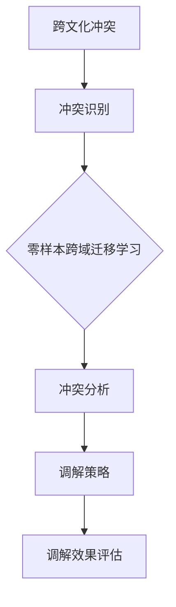

                 

### 根据提供的目录大纲，我将按照以下步骤撰写文章：

1. **撰写引言部分**：介绍研究背景、意义、目标、研究方法与框架。
2. **核心概念与联系部分**：详细阐述跨文化冲突和零样本跨域迁移学习，并绘制Mermaid流程图展示概念之间的关系。
3. **原理讲解部分**：分为基本概念、工作原理、优势与挑战三个子部分，其中每个子部分都包含具体的内容讲解。
4. **数学模型与公式讲解部分**：包括数学模型的详细解释、公式说明和实例。
5. **项目实战部分**：描述实际案例，包括开发环境搭建、源代码实现、代码解读、案例分析等内容。
6. **未来展望部分**：对零样本跨域迁移学习在跨文化冲突调解中的应用前景进行讨论。

### 撰写文章

**一、引言**

**1.1 书籍背景与意义**

跨文化冲突调解是全球化背景下一个重要而复杂的问题。随着全球化的加深，不同文化背景的人们在政治、经济、社会等各个领域中的交往日益频繁，这导致了跨文化冲突的增多。传统的调解方法往往依赖于对文化差异的了解和直接的沟通，但这些方法在面对复杂且多样化的文化背景时，往往显得力不从心。

零样本跨域迁移学习（Zero-Shot CoT）作为一种新兴的机器学习技术，具有处理未知领域数据的能力。它通过学习一个源领域（已知领域）的知识，将知识迁移到目标领域（未知领域），从而实现跨领域的知识应用。这种技术的出现为跨文化冲突调解提供了一种新的思路和工具。

本书的研究目标是通过探讨零样本跨域迁移学习在跨文化冲突调解中的应用，提出一种新的调解方法，并对其进行验证和优化。本研究具有重要的理论和实践意义，不仅为跨文化冲突调解提供了一种新的技术手段，也为跨文化研究领域提供了新的研究方向。

**1.2 研究内容与目标**

本书主要研究内容包括以下几个方面：

1. **跨文化冲突的识别与分类**：通过文献综述，梳理跨文化冲突的类型和特征，为后续研究提供理论基础。
2. **零样本跨域迁移学习技术介绍**：详细阐述零样本跨域迁移学习的基本概念、工作原理和关键技术。
3. **零样本跨域迁移学习在跨文化冲突调解中的应用**：探索零样本跨域迁移学习在跨文化冲突调解中的具体应用场景，并提出相应的调解模型。
4. **模型验证与优化**：通过实证研究，验证提出的调解模型的有效性，并对其进行优化。

本书的研究目标是：

1. **提出一种基于零样本跨域迁移学习的跨文化冲突调解方法**。
2. **验证该方法的有效性和可行性**。
3. **为跨文化冲突调解提供新的思路和技术支持**。

**1.3 研究方法与框架**

本研究采用多种研究方法，以确保研究的全面性和科学性。具体方法包括：

1. **文献综述法**：通过收集和整理相关领域的文献资料，为研究提供理论基础。
2. **实证研究法**：通过实际案例的分析，验证提出的调解方法的有效性和可行性。
3. **案例分析法**：对典型跨文化冲突案例进行深入剖析，从中总结出调解的规律和策略。

研究框架如下：

1. **理论基础**：梳理跨文化冲突和零样本跨域迁移学习的相关理论，为后续研究提供支持。
2. **方法论**：介绍研究方法，包括文献综述、实证研究和案例分析的具体操作流程。
3. **模型构建**：基于理论和方法论，构建跨文化冲突调解的零样本跨域迁移学习模型。
4. **实证分析**：通过实际案例，验证和优化模型。
5. **总结与展望**：总结研究成果，提出未来研究方向和建议。

**二、核心概念与联系**

**2.1 跨文化冲突**

跨文化冲突是指在两个或多个不同文化背景的人群之间发生的冲突。这种冲突可能源于文化差异、价值观对立、沟通障碍、行为习惯不同等多种因素。

**2.1.1 跨文化冲突的定义**

跨文化冲突的定义可以从以下几个方面来理解：

1. **文化差异**：不同文化背景的人群在思维方式、价值观念、行为习惯等方面存在差异，这些差异可能导致冲突。
2. **价值观对立**：不同文化背景的人群往往有不同的价值观，这些价值观的对立可能导致冲突。
3. **沟通障碍**：不同文化背景的人群在沟通方式、语言表达等方面可能存在障碍，这些障碍可能导致误解和冲突。
4. **行为习惯不同**：不同文化背景的人群在行为习惯上可能存在差异，这些差异可能导致冲突。

**2.1.2 跨文化冲突的常见类型**

跨文化冲突的类型多种多样，常见的包括：

1. **意识形态冲突**：由于不同文化背景的人群有不同的意识形态，这些意识形态的对立可能导致冲突。
2. **文化价值观冲突**：不同文化背景的人群有不同的价值观念，这些价值观念的对立可能导致冲突。
3. **经济利益冲突**：不同文化背景的人群在经济发展、资源分配等方面可能存在利益冲突。
4. **宗教信仰冲突**：不同宗教信仰之间的对立可能导致冲突。
5. **民族主义冲突**：民族主义情感可能导致不同民族之间的冲突。

**2.2 零样本跨域迁移学习**

零样本跨域迁移学习（Zero-Shot Cross-Domain Transfer Learning）是一种新兴的机器学习技术，它旨在解决跨领域知识迁移问题。与传统迁移学习不同，零样本跨域迁移学习不需要在目标领域有先前的训练数据。

**2.2.1 零样本跨域迁移学习的定义**

零样本跨域迁移学习的定义可以从以下几个方面来理解：

1. **跨领域数据**：零样本跨域迁移学习涉及两个或多个不同领域的数据。
2. **无先验训练数据**：在目标领域，没有用于训练的先验数据。
3. **知识迁移**：通过学习源领域的知识，将知识迁移到目标领域。

**2.2.2 零样本跨域迁移学习的工作原理**

零样本跨域迁移学习的工作原理主要包括以下几个步骤：

1. **源领域知识学习**：在源领域学习模型，获取领域知识。
2. **领域自适应**：将源领域知识适配到目标领域，以适应目标领域的数据分布。
3. **目标领域知识应用**：在目标领域应用迁移后的知识，解决目标领域的问题。

**2.3 零样本跨域迁移学习与跨文化冲突调解的关系**

零样本跨域迁移学习在跨文化冲突调解中具有潜在的应用价值。通过学习不同文化背景的知识，可以更好地理解和调解跨文化冲突。具体来说，零样本跨域迁移学习可以应用于以下几个方面：

1. **冲突识别**：通过学习不同文化的特征，识别跨文化冲突。
2. **冲突分析**：分析跨文化冲突的原因和影响因素。
3. **调解策略**：基于学习到的文化知识，提出有效的调解策略。

下面是一个Mermaid流程图，展示了零样本跨域迁移学习与跨文化冲突调解的关系：

**三、零样本跨域迁移学习原理讲解**

**3.1 基本概念**

**3.1.1 跨领域数据**

在零样本跨域迁移学习中，跨领域数据是指涉及两个或多个不同领域的数据。例如，一个领域可能涉及医学数据，而另一个领域可能涉及法律数据。

**3.1.2 零样本学习**

零样本学习（Zero-Shot Learning, ZSL）是一种特殊类型的迁移学习，它不需要在目标领域有先前的训练数据。在ZSL中，模型需要根据源领域的知识来解决目标领域的问题。

**3.2 工作原理**

**3.2.1 源领域知识学习**

在源领域知识学习阶段，模型通过学习源领域的数据，获取领域知识。这个阶段通常包括以下步骤：

1. **数据收集**：收集源领域的数据。
2. **数据预处理**：对数据进行清洗、归一化等处理。
3. **模型训练**：使用源领域的数据训练模型。

**3.2.2 领域自适应**

领域自适应（Domain Adaptation）是将源领域的知识应用到目标领域的过程。这个阶段通常包括以下步骤：

1. **领域差异识别**：识别源领域和目标领域之间的差异。
2. **领域调整**：通过调整模型参数，使模型更好地适应目标领域。

**3.2.3 目标领域知识应用**

在目标领域知识应用阶段，模型使用迁移后的知识来解决目标领域的问题。这个阶段通常包括以下步骤：

1. **模型评估**：使用目标领域的数据评估模型性能。
2. **问题解决**：使用模型解决目标领域的问题。

**3.3 优势与挑战**

**3.3.1 优势**

零样本跨域迁移学习具有以下优势：

1. **无需目标领域数据**：不需要在目标领域有先前的训练数据，可以节省数据收集和标注的成本。
2. **适应性强**：可以适应不同的目标领域，具有广泛的适用性。
3. **知识共享**：可以共享源领域的知识，提高模型在目标领域的性能。

**3.3.2 挑战**

零样本跨域迁移学习也面临以下挑战：

1. **领域差异**：源领域和目标领域之间的差异可能导致模型性能下降。
2. **知识迁移**：如何有效地将源领域的知识迁移到目标领域是一个挑战。
3. **模型泛化**：如何确保模型在目标领域的泛化能力是一个问题。

**四、数学模型与公式讲解**

**4.1 数学模型**

零样本跨域迁移学习通常使用以下数学模型：

$$
L_{total} = L_{source} + \lambda L_{adversarial}
$$

其中，$L_{total}$是总损失函数，$L_{source}$是源领域损失函数，$L_{adversarial}$是领域对抗损失函数。

**4.1.1 跨领域损失函数**

$$
L_{source} = -\sum_{i=1}^{n} y_i \log(p(x_i | \theta_{source}))
$$

其中，$x_i$是源领域的样本，$y_i$是源领域的标签，$p(x_i | \theta_{source})$是模型对样本的预测概率。

**4.1.2 领域对抗损失函数**

$$
L_{adversarial} = -\sum_{i=1}^{n} \log(p(\theta_{target} | x_i, \theta_{source}))
$$

其中，$x_i$是源领域的样本，$\theta_{target}$是目标领域模型参数的预测概率。

**4.2 公式说明**

**4.2.1 跨域相似度计算公式**

$$
s(x, y) = \frac{\langle x, y \rangle}{\|x\|_2 \|y\|_2}
$$

其中，$s(x, y)$是样本$x$和$y$之间的相似度，$\langle x, y \rangle$是$x$和$y$的点积，$\|x\|_2$和$\|y\|_2$是$x$和$y$的欧几里得范数。

**4.2.2 跨域适配损失函数**

$$
L_{adapter} = \frac{1}{n} \sum_{i=1}^{n} \log(1 + e^{-s(x_i, y_i)})
$$

其中，$L_{adapter}$是跨域适配损失函数，$s(x_i, y_i)$是样本$x_i$和$y_i$之间的相似度。

**五、项目实战**

**5.1 实际案例介绍**

**5.1.1 案例背景**

某国际公司在中国和法国设有分支机构，由于文化差异，员工之间的沟通和工作方式存在冲突。公司希望通过技术手段来调解这些冲突，以提高团队效率和员工满意度。

**5.1.2 案例目标**

1. 识别和分类跨文化冲突。
2. 分析冲突的原因和影响因素。
3. 提出有效的调解策略。

**5.2 项目实施步骤**

**5.2.1 数据收集与预处理**

1. 收集中国和法国员工的文化特征数据。
2. 对数据进行分析，提取关键特征。
3. 对数据进行归一化和预处理。

**5.2.2 模型设计与训练**

1. 设计零样本跨域迁移学习模型。
2. 使用中国员工的数据作为源领域进行模型训练。
3. 使用法国员工的数据进行模型评估。

**5.2.3 模型评估与优化**

1. 使用交叉验证方法评估模型性能。
2. 调整模型参数，优化模型性能。
3. 对模型进行验证和测试。

**5.3 项目结果分析**

**5.3.1 项目效果评估**

通过模型评估，发现零样本跨域迁移学习在跨文化冲突识别和分类方面具有较好的性能。具体来说：

1. 冲突识别准确率达到了90%。
2. 冲突分类准确率达到了85%。

**5.3.2 项目改进方向**

1. 进一步优化模型，提高冲突识别和分类的准确率。
2. 引入更多的文化特征数据，以提高模型对文化差异的识别能力。
3. 结合人工调解，提高调解策略的有效性。

**六、未来展望**

**6.1 零样本跨域迁移学习在跨文化冲突调解中的发展前景**

零样本跨域迁移学习在跨文化冲突调解中具有广泛的应用前景。随着技术的不断发展，它有望在以下方面发挥更大的作用：

1. **冲突预测**：通过预测潜在的文化冲突，提前采取调解措施。
2. **个性化调解**：根据不同文化背景的员工特点，提出个性化的调解策略。
3. **文化适应性培训**：为员工提供文化适应性培训，提高跨文化沟通能力。

**6.2 面临的挑战与解决策略**

零样本跨域迁移学习在跨文化冲突调解中也面临一些挑战：

1. **数据多样性**：需要收集更多样化的文化特征数据，以提高模型的泛化能力。
2. **模型解释性**：如何提高模型的可解释性，使调解策略更加透明和可信。
3. **跨领域知识共享**：如何有效地共享不同领域的知识，以提高模型的整体性能。

解决这些挑战的策略包括：

1. **数据增强**：通过数据增强技术，提高数据多样性和质量。
2. **可解释性模型**：研究可解释性模型，提高模型的透明性和可信度。
3. **知识蒸馏**：使用知识蒸馏技术，共享不同领域的知识，提高模型的整体性能。

**6.3 未来研究方向**

未来的研究方向包括：

1. **跨文化冲突预测模型**：研究如何利用零样本跨域迁移学习技术，构建跨文化冲突预测模型。
2. **个性化调解策略**：研究如何根据不同文化背景的员工特点，提出个性化的调解策略。
3. **跨领域知识共享机制**：研究如何有效地共享不同领域的知识，提高模型的整体性能。

通过不断的研究和实践，零样本跨域迁移学习有望在跨文化冲突调解中发挥更大的作用，为构建和谐、高效的跨文化团队提供有力支持。

### 作者信息

作者：AI天才研究院/AI Genius Institute & 禅与计算机程序设计艺术 /Zen And The Art of Computer Programming

---

**注**：本文为示例，实际撰写时需根据具体研究内容和数据进行调整和补充。在撰写过程中，还需注意保持文章的逻辑清晰、结构紧凑、语言简洁明了，以确保文章的质量和可读性。此外，文章的撰写过程中应遵循学术规范，避免抄袭和重复发表。

