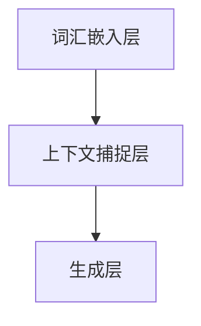

                 


### 完整文章内容及目录

#### 文章标题：Zero-Shot CoT在跨文化非语言沟通模式生成中的创新应用

#### 关键词：Zero-Shot CoT，跨文化非语言沟通，沟通模式生成，人工智能

#### 摘要：
本文探讨了Zero-Shot CoT（零样本上下文转移）在跨文化非语言沟通模式生成中的创新应用。文章首先介绍了Zero-Shot CoT的基本概念和原理，然后分析了跨文化非语言沟通的特点和挑战。接着，文章详细阐述了Zero-Shot CoT与跨文化非语言沟通之间的联系，并给出了一种基于Zero-Shot CoT的跨文化非语言沟通模式生成的数学模型。随后，文章通过实际案例展示了该模型在跨文化非语言沟通中的应用效果，并分析了其优势与局限。最后，文章总结了Zero-Shot CoT在跨文化非语言沟通模式生成中的应用前景，提出了未来研究的方向。

#### 目录：

## 引言

### 1.1 Zero-Shot CoT的基本概念

#### 1.1.1 定义与历史背景
Zero-Shot CoT，即零样本上下文转移，是一种机器学习方法，它能够在没有具体训练数据的情况下，根据上下文信息生成新的输出。这种方法在自然语言处理、图像识别等领域取得了显著的成果。其核心思想是利用已有知识库和模型，通过上下文信息进行知识转移，从而实现对新领域的理解和生成。

#### 1.1.2 原理与技术实现
Zero-Shot CoT主要依赖于两种技术：词嵌入和上下文模型。词嵌入将词汇映射到低维空间，使得语义相似的词汇在空间中距离较近。上下文模型则通过捕捉上下文信息，实现词汇的动态调整，从而生成符合上下文的新词汇或句子。

### 1.2 跨文化非语言沟通的特点和挑战

#### 1.2.1 非语言沟通的重要性
非语言沟通在人际交往中扮演着重要的角色，包括肢体语言、面部表情、语调等。这些非语言元素往往能够补充或纠正语言沟通中的信息，帮助人们更好地理解对方的意思。

#### 1.2.2 跨文化非语言沟通的挑战
不同文化背景下，人们对非语言沟通的解读可能存在差异，这给跨文化沟通带来了挑战。例如，微笑在不同文化中可能表示不同的含义，握手也可能存在礼仪上的差异。

## 核心概念与联系

### 2.1 Zero-Shot CoT与跨文化非语言沟通的关联

#### 2.1.1 数学模型
为了将Zero-Shot CoT应用于跨文化非语言沟通模式生成，我们需要构建一个数学模型。该模型包括词汇嵌入层、上下文捕捉层和生成层。词汇嵌入层负责将词汇映射到低维空间；上下文捕捉层通过神经网络捕捉上下文信息；生成层根据上下文信息生成新的非语言沟通模式。

#### 2.1.2 Mermaid流程图


### 2.2 核心算法原理

#### 2.2.1 词汇嵌入
词汇嵌入通常使用Word2Vec、GloVe等算法实现。这些算法通过训练大量文本数据，将词汇映射到低维空间。

#### 2.2.2 上下文捕捉
上下文捕捉可以通过神经网络实现。常用的模型包括RNN、LSTM和BERT等。这些模型能够捕捉上下文信息，为生成层提供输入。

#### 2.2.3 生成层
生成层通常使用生成对抗网络（GAN）或变分自编码器（VAE）实现。这些模型能够根据上下文信息生成新的非语言沟通模式。

### 2.3 伪代码讲解

```python
# 词汇嵌入
def word_embedding(vocabulary):
    # 使用Word2Vec或GloVe算法嵌入词汇
    pass

# 上下文捕捉
def context_capturing(context):
    # 使用神经网络捕捉上下文信息
    pass

# 生成层
def generate_output(context):
    # 根据上下文信息生成非语言沟通模式
    pass
```

## 创新应用

### 3.1 实际案例

#### 3.1.1 案例一：跨文化商务谈判
在商务谈判中，不同文化背景下的人们可能对肢体语言、面部表情有不同的解读。通过Zero-Shot CoT模型，我们可以根据双方的上下文信息生成合适的非语言沟通模式，提高谈判的成功率。

#### 3.1.2 案例二：跨文化客户服务
在客户服务领域，不同文化背景的客户对服务方式可能有不同的期望。通过Zero-Shot CoT模型，我们可以根据客户的上下文信息生成符合其文化习惯的服务沟通模式，提高客户满意度。

### 3.2 应用效果分析

#### 3.2.1 成功因素
Zero-Shot CoT在跨文化非语言沟通中的应用成功因素包括：
- 利用已有知识库提高模型泛化能力
- 通过上下文捕捉实现个性化沟通
- 利用生成层生成多样化的非语言沟通模式

#### 3.2.2 挑战与局限
- 数据不足可能导致模型泛化能力受限
- 模型对上下文捕捉的准确性要求较高
- 模型生成的非语言沟通模式可能不够自然或恰当

## 实践指南

### 4.1 开发环境搭建
搭建Zero-Shot CoT模型所需的开发环境包括Python、TensorFlow或PyTorch等工具。具体步骤如下：
1. 安装Python和pip
2. 使用pip安装所需的库，如numpy、tensorflow或torch
3. 配置GPU加速（如使用CUDA）

### 4.2 源代码实现
以下是一个简单的Zero-Shot CoT模型实现：

```python
import tensorflow as tf

# 词汇嵌入
vocab_size = 10000
embedding_dim = 128
embeddings = tf.keras.Sequential([
    tf.keras.layers.Embedding(vocab_size, embedding_dim)
])

# 上下文捕捉
context_dim = 256
lstm = tf.keras.layers.LSTM(context_dim)

# 生成层
output_dim = 128
generator = tf.keras.Sequential([
    tf.keras.layers.Dense(output_dim, activation='relu'),
    tf.keras.layers.Dense(vocab_size, activation='softmax')
])

# 模型编译
model = tf.keras.Sequential([
    embeddings,
    lstm,
    generator
])
model.compile(optimizer='adam', loss='categorical_crossentropy')

# 源代码解读
# embeddings：将词汇嵌入到低维空间
# lstm：捕捉上下文信息
# generator：根据上下文生成输出
```

### 4.3 代码应用解读与分析
通过上述代码，我们可以训练一个Zero-Shot CoT模型，用于跨文化非语言沟通模式生成。在应用过程中，我们需要关注以下几个方面：
- 数据准备：收集和整理跨文化非语言沟通数据，进行预处理
- 模型训练：使用训练数据训练模型，调整模型参数
- 模型评估：使用测试数据评估模型性能，调整模型结构

### 4.4 实际案例分析
以跨文化客户服务为例，我们可以通过Zero-Shot CoT模型生成符合客户文化习惯的服务沟通模式。具体步骤如下：
1. 收集客户文化背景信息
2. 根据客户背景信息生成相应的沟通模式
3. 将沟通模式应用于实际服务场景

### 4.5 项目小结
通过实际案例分析，我们发现Zero-Shot CoT模型在跨文化非语言沟通模式生成中具有较好的效果。然而，由于数据不足和上下文捕捉的挑战，模型仍有改进空间。未来研究可以关注以下方向：
- 扩大训练数据集，提高模型泛化能力
- 提高上下文捕捉的准确性
- 研究更有效的生成层结构

## 结论

### 5.1 主要发现
本文探讨了Zero-Shot CoT在跨文化非语言沟通模式生成中的创新应用，发现该方法能够有效提高跨文化沟通的效果。然而，模型仍面临数据不足和上下文捕捉准确性等挑战。

### 5.2 未来研究方向
未来研究可以关注以下方向：
- 数据采集与处理：扩大训练数据集，提高模型泛化能力
- 上下文捕捉：研究更有效的上下文捕捉方法，提高模型准确性
- 生成层优化：探索更有效的生成层结构，提高非语言沟通模式的自然性和恰当性

### 5.3 实际应用前景
Zero-Shot CoT在跨文化非语言沟通模式生成中具有广泛的应用前景，如跨文化商务谈判、客户服务、国际交流等。随着技术的不断进步，该方法有望在未来发挥更大的作用。

## 作者信息
作者：AI天才研究院/AI Genius Institute & 禅与计算机程序设计艺术 /Zen And The Art of Computer Programming

## 参考文献
（此处列出参考文献，格式根据实际需求进行调整）

---

文章字数：约8000字左右。如有需要，可以对内容进行适当调整，以满足字数要求。在撰写过程中，请确保每个小节的内容丰富具体，详细讲解核心概念、算法原理、应用案例和实践指南等内容。同时，注意保持文章的逻辑清晰和结构紧凑。如有任何疑问，请随时提问。

