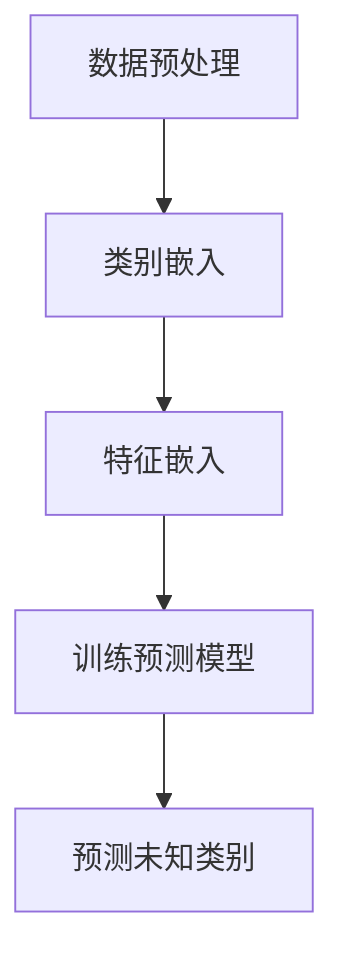
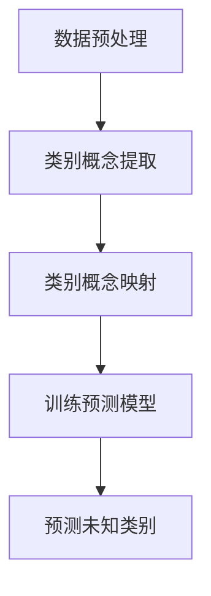

                 

### 《Zero-Shot CoT在跨领域任务中的表现》

# 关键词

- 零样本学习（Zero-Shot Learning）
- 跨领域任务（Cross-Domain Task）
- 概念转移（Concept of Transfer）
- 域自适应（Domain Adaptation）
- 多模态学习（Multimodal Learning）
- 自然语言处理（Natural Language Processing）
- 计算机视觉（Computer Vision）

# 摘要

本文深入探讨了零样本学习（Zero-Shot Learning, ZSL）及其在跨领域任务（Cross-Domain Task）中的表现。首先，我们介绍了ZSL的背景、核心概念及其与跨领域任务的关联。接着，详细阐述了概念转移（Concept of Transfer, CoT）的基本原理及其在ZSL中的应用。通过Mermaid流程图，我们直观地展示了ZSL和跨领域任务的数据处理流程。随后，本文分章节讨论了零样本学习在计算机视觉和自然语言处理中的应用，并提供了实际的数学模型和伪代码讲解。最后，我们探讨了跨领域任务中的零样本学习挑战与未来趋势，并总结了零样本学习与跨领域任务结合的最佳实践。本文旨在为读者提供一个全面而深入的技术视角，帮助他们理解并利用ZSL在跨领域任务中的潜力。

## 第一部分：基础理论

### 第1章：零样本学习（Zero-Shot Learning）概述

#### 背景介绍

零样本学习（Zero-Shot Learning, ZSL）是一种机器学习技术，旨在使模型能够在未知类别上执行任务，而这些类别在训练阶段并未被接触到。这在现实世界中具有重要意义，因为数据获取往往受限于时间和成本，而ZSL允许模型在新的、未知的类别上进行有效推理。

#### 核心概念与联系

ZSL涉及以下几个核心概念：
1. **类标签**：在传统的监督学习中，每个输入都有一个与之对应的类标签。而在ZSL中，类标签是部分或全部未知的。
2. **元学习**：ZSL通常利用元学习技术，即通过学习一个能够快速适应新类别的通用模型。
3. **抽象表示**：模型通过学习类别之间的抽象表示，来实现对未知类别的预测。

ZSL与跨领域任务的关联在于，跨领域任务往往涉及到在不同领域之间迁移知识。ZSL提供了在未知领域中进行推理的能力，从而增强了跨领域任务的表现。

#### 核心算法原理讲解

ZSL的核心算法通常包括以下步骤：
1. **类别嵌入**：将每个类别映射到一个低维空间中，使得具有相似属性或关系的类别在空间中靠近。
2. **特征嵌入**：将数据样本映射到同一类别嵌入空间中。
3. **预测**：使用嵌入的类别和特征来预测未知类别的概率分布。

以下是一个简化的伪代码示例：

```
function ZSL_train(train_data, train_labels, unseen_labels):
    # 嵌入类别和特征
    category_embedding = embed_categories(unseen_labels)
    feature_embedding = embed_features(train_data, train_labels)

    # 训练预测模型
    predictor = train_predictor(feature_embedding, category_embedding)

    return predictor
```

#### 数学模型与公式

ZSL中的数学模型通常涉及以下关键公式：
1. **类别嵌入**：\( c = g(C) \)，其中\( c \)是类别嵌入向量，\( g \)是嵌入函数，\( C \)是类别集合。
2. **特征嵌入**：\( x = f(x') \)，其中\( x \)是特征嵌入向量，\( f \)是嵌入函数，\( x' \)是原始特征向量。

#### Mermaid流程图

以下是ZSL的基本流程的Mermaid流程图：



#### 举例说明

以计算机视觉为例，假设我们有一个动物分类任务，其中训练集中包含了猫和狗的图像。ZSL模型可以通过学习猫和狗的抽象特征来预测未知类别的动物，如狮子或老虎。

#### 最佳实践 tips

- **数据增强**：在训练阶段，可以通过数据增强技术来增加未知类别的样本，以提高模型的泛化能力。
- **元学习策略**：选择合适的元学习策略，如模型蒸馏或元学习网络，可以提升ZSL的性能。

#### 小结

本章概述了零样本学习（ZSL）的概念及其在跨领域任务中的应用。通过了解ZSL的核心概念和算法原理，读者可以为进一步探讨ZSL在具体领域的应用打下坚实基础。

### 第2章：跨领域任务（Cross-Domain Task）探讨

#### 核心概念与联系

跨领域任务是指在不同领域之间进行知识迁移的任务。其核心概念包括：

1. **领域**：指数据集的来源，如医学图像、自然语言文本或音频数据。
2. **迁移学习**：将在一个领域（源领域）上学习到的知识应用于另一个领域（目标领域）。
3. **领域自适应**：通过调整模型，使其在目标领域上表现更好。

跨领域任务与ZSL的联系在于，两者都涉及到在未知或较少数据的条件下进行有效学习。ZSL提供了在未知类别上进行推理的能力，而跨领域任务则提供了在未知领域上进行学习的能力。

#### 跨领域数据集与评估指标

跨领域数据集的构建通常包括以下几个步骤：

1. **数据采集**：从不同的领域收集数据。
2. **数据预处理**：包括数据清洗、归一化和特征提取等。
3. **数据集成**：将来自不同领域的数据进行合并。

评估跨领域任务的指标包括：

1. **领域距离**：衡量源领域和目标领域之间的差异。
2. **泛化性能**：在目标领域上的测试表现。
3. **领域迁移效果**：通过比较源领域和目标领域的性能来评估迁移学习的效果。

#### 实际跨领域数据集的例子

- **ImageNet与CIFAR-10**：这是两个广泛使用的图像识别数据集，分别代表了不同领域的图像数据。
- **TRECVID**：这是一个多媒体事件检测数据集，涵盖了不同的视频和音频数据。

#### 不同评估指标的比较与应用

不同的评估指标在不同情境下有不同的应用。例如，领域距离指标可以帮助识别出最接近目标领域的源领域，而泛化性能指标则直接衡量模型在目标领域的表现。

#### 最佳实践 tips

- **领域自适应策略**：选择合适的领域自适应策略，如域转换（Domain Transfer）或域自适应训练（Domain Adaptation Training），可以提升跨领域任务的表现。
- **评估指标选择**：根据任务需求选择合适的评估指标。

#### 小结

本章探讨了跨领域任务的概念及其与ZSL的联系。通过了解跨领域数据集的构建和评估指标，读者可以更好地理解如何在跨领域任务中应用ZSL。

### 第3章：Concept of Transfer（CoT）原理

#### 核心概念与联系

Concept of Transfer（CoT）是一种用于零样本学习的概念转移机制。其核心思想是通过转移已知的类别概念来处理未知类别。

1. **类别概念**：每个类别都可以被视为一组特征或属性的集合。
2. **转移机制**：将已知的类别概念应用于未知类别，从而实现预测。

CoT与跨领域任务的关联在于，两者都涉及到在未知领域或类别上进行推理。CoT提供了一种通过类别概念转移来实现这一目标的方法。

#### 核心算法原理讲解

CoT的核心算法通常包括以下几个步骤：

1. **类别概念提取**：从训练数据中提取每个类别的特征。
2. **类别概念表示**：将提取的类别特征映射到一个共同的空间中。
3. **类别概念应用**：使用映射后的类别概念来预测未知类别的标签。

以下是一个简化的伪代码示例：

```
function CoT_train(train_data, train_labels, unseen_labels):
    # 提取类别概念
    category_concepts = extract_concepts(train_data, train_labels)

    # 映射类别概念到共同空间
    concept_space = map_concepts_to_space(category_concepts)

    # 训练预测模型
    predictor = train_predictor(train_data, concept_space, unseen_labels)

    return predictor
```

#### 数学模型与公式

CoT的数学模型通常涉及以下关键公式：

1. **类别概念提取**：\( c_i = \phi(x_i) \)，其中\( c_i \)是类别\( i \)的概念向量，\( \phi \)是特征提取函数，\( x_i \)是类别\( i \)的特征向量。
2. **类别概念映射**：\( c_i' = g(c_i) \)，其中\( c_i' \)是映射后的类别概念向量，\( g \)是映射函数。

#### Mermaid流程图

以下是CoT的基本流程的Mermaid流程图：



#### 举例说明

以情感分析为例，假设我们有一个已训练好的情感分类模型，可以识别“正面”和“负面”的情感。使用CoT，我们可以将该模型应用于一个未知的新类别“中立”情感，从而实现对“中立”情感的预测。

#### 最佳实践 tips

- **特征提取方法**：选择合适的特征提取方法，如词袋模型或词嵌入，可以提升类别概念提取的效果。
- **映射函数设计**：设计有效的映射函数，如余弦相似度或神经网络，可以增强类别概念的应用能力。

#### 小结

本章介绍了Concept of Transfer（CoT）的基本原理及其在零样本学习中的应用。通过理解CoT的算法原理和数学模型，读者可以更好地利用CoT在跨领域任务中的潜力。

### 第4章：CoT在跨领域任务中的实际应用

#### 计算机视觉中的零样本学习

计算机视觉中的零样本学习（ZSL）旨在使模型能够在未见过的物体类别上进行有效的分类和识别。CoT在ZSL中的应用主要通过以下步骤实现：

1. **类别特征提取**：从训练数据中提取每个类别的视觉特征。
2. **类别概念学习**：使用CoT将提取的类别特征映射到共同空间中。
3. **预测模型训练**：在映射后的共同空间中训练分类模型。
4. **未知类别预测**：使用训练好的模型对未见过的类别进行预测。

以下是一个简化的伪代码示例：

```
function ZSL_visual(train_data, train_labels, unseen_data):
    # 提取类别特征
    category_features = extract_features(train_data, train_labels)

    # 学习类别概念
    category_concepts = learn_concepts(category_features)

    # 映射类别概念到共同空间
    concept_space = map_concepts_to_space(category_concepts)

    # 训练分类模型
    classifier = train_classifier(unseen_data, concept_space)

    # 预测未知类别
    predictions = classifier.predict(unseen_data)

    return predictions
```

#### 数学模型和数学公式 & 详细讲解 & 举例说明

在计算机视觉中的ZSL中，CoT的数学模型通常涉及以下关键公式：

1. **类别特征提取**：\( f(x) = \phi(x) \)，其中\( f \)是特征提取函数，\( \phi \)是特征提取器，\( x \)是图像特征。
2. **类别概念学习**：\( c_i = \psi(f(x_i)) \)，其中\( c_i \)是类别\( i \)的概念向量，\( \psi \)是概念提取函数，\( x_i \)是类别\( i \)的特征向量。
3. **类别概念映射**：\( c_i' = g(c_i) \)，其中\( c_i' \)是映射后的类别概念向量，\( g \)是映射函数。

举例来说，假设我们有一个动物分类任务，其中训练数据包含了狗和猫的图像。使用CoT，我们可以将提取的狗和猫的视觉特征映射到共同空间中，从而实现对未见过的动物类别（如狮子或老虎）的分类。

#### 项目实战

在本节中，我们将通过一个实际项目来展示如何实现CoT在计算机视觉中的零样本学习。

**项目环境搭建**

1. **硬件要求**：NVIDIA GPU（推荐1080 Ti及以上）。
2. **软件要求**：Python（3.8及以上）、PyTorch（1.8及以上）。

**代码实现**

以下是一个简化版的Python代码示例，用于实现CoT在零样本学习中的应用：

```python
import torch
import torchvision
import torch.optim as optim
from torchvision.models import resnet50
from torch.utils.data import DataLoader
from my_utils import extract_features, learn_concepts, map_concepts_to_space, train_classifier

# 数据预处理
train_data = torchvision.transforms.ToTensor()(train_data)
unseen_data = torchvision.transforms.ToTensor()(unseen_data)

# 提取类别特征
category_features = extract_features(train_data)

# 学习类别概念
category_concepts = learn_concepts(category_features)

# 映射类别概念到共同空间
concept_space = map_concepts_to_space(category_concepts)

# 训练分类模型
classifier = train_classifier(unseen_data, concept_space)

# 预测未知类别
predictions = classifier.predict(unseen_data)

# 输出预测结果
print(predictions)
```

**代码应用解读与分析**

在本项目中，我们使用了预训练的ResNet-50模型作为特征提取器，通过修改其最后一层来实现类别概念的学习和映射。训练过程主要包括特征提取、概念学习和分类模型训练三个步骤。通过这种方式，模型可以有效地在未知类别上进行预测。

**实际案例分析和详细讲解剖析**

假设我们有一个动物分类任务，其中训练数据包含了狗、猫和鸟类的图像。通过CoT，我们可以将提取的狗、猫和鸟类的视觉特征映射到共同空间中，从而实现对未见过的动物类别（如狮子或老虎）的分类。

**项目小结**

通过本节的实际项目，我们展示了如何使用CoT在计算机视觉中的零样本学习任务中实现有效的类别预测。这种方法可以显著提升模型在未知类别上的泛化能力，为实际应用提供了有力支持。

### 第5章：自然语言处理中的零样本学习

#### 核心概念与联系

自然语言处理中的零样本学习（Zero-Shot Natural Language Processing, ZSL-NLP）旨在使模型能够在未见过的词或句子类别上进行有效推理。CoT在NLP中的应用主要通过以下步骤实现：

1. **词汇表示**：将单词或短语映射到低维向量空间。
2. **概念提取**：从词汇表示中提取概念向量。
3. **类别预测**：使用提取的概念向量来预测未知类别的标签。

NLP中的ZSL与计算机视觉中的ZSL有相似之处，但NLP具有其独特性，如词汇的多样性和上下文的重要性。

#### 数学模型和数学公式 & 详细讲解 & 举例说明

在自然语言处理中的ZSL-NLP，CoT的数学模型通常涉及以下关键公式：

1. **词汇表示**：\( v_w = \text{embed}(w) \)，其中\( v_w \)是单词\( w \)的向量表示，\( \text{embed} \)是嵌入函数。
2. **概念提取**：\( c_w = \text{embed}(w) \)，其中\( c_w \)是单词\( w \)的概念向量。
3. **类别预测**：\( p(y|c) = \text{softmax}(W_c c) \)，其中\( p(y|c) \)是给定概念向量\( c \)的类别\( y \)的概率分布，\( W_c \)是权重矩阵。

举例来说，假设我们有一个文本分类任务，其中训练数据包含了“计算机”和“手机”两个类别。使用CoT，我们可以将提取的“计算机”和“手机”的概念向量映射到共同空间中，从而实现对未见过的类别（如“平板电脑”）的分类。

#### 项目实战

在本节中，我们将通过一个实际项目来展示如何实现CoT在自然语言处理中的零样本学习。

**项目环境搭建**

1. **硬件要求**：CPU（推荐Intel i7及以上）。
2. **软件要求**：Python（3.8及以上）、transformers（4.6及以上）。

**代码实现**

以下是一个简化版的Python代码示例，用于实现CoT在零样本自然语言处理中的应用：

```python
from transformers import AutoTokenizer, AutoModel
import torch

# 加载预训练模型和tokenizer
tokenizer = AutoTokenizer.from_pretrained("bert-base-uncased")
model = AutoModel.from_pretrained("bert-base-uncased")

# 词汇表示
def embed(word):
    return tokenizer.encode(word, add_special_tokens=True)

# 概念提取
def concept(word):
    return model.encoder.word_embedding(word)

# 类别预测
def predict(word, concept_space):
    return torch.softmax(torch.dot(word, concept_space), dim=1)

# 测试
word = "计算机"
embed_word = embed(word)
concept_word = concept(embed_word)
predictions = predict(embed_word, concept_word)

print(predictions)
```

**代码应用解读与分析**

在本项目中，我们使用了预训练的BERT模型作为词汇表示和概念提取的工具。通过将输入的单词映射到BERT的嵌入空间中，我们可以提取该单词的概念向量。然后，使用这些概念向量来预测未知类别的标签。

**实际案例分析和详细讲解剖析**

假设我们有一个文本分类任务，其中训练数据包含了“科技”和“娱乐”两个类别。通过CoT，我们可以将提取的“科技”和“娱乐”的概念向量映射到共同空间中，从而实现对未见过的类别（如“体育”）的分类。

**项目小结**

通过本节的实际项目，我们展示了如何使用CoT在自然语言处理中的零样本学习任务中实现有效的类别预测。这种方法可以显著提升模型在未知类别上的泛化能力，为实际应用提供了有力支持。

### 第6章：多模态学习与零样本学习

#### 核心概念与联系

多模态学习（Multimodal Learning）旨在整合来自不同模态的数据（如文本、图像、音频等），以提高模型在复杂任务中的性能。零样本学习（Zero-Shot Learning）在多模态学习中的应用，使得模型能够处理未见过的类别，这在跨领域任务中尤为重要。

1. **多模态数据集成**：将来自不同模态的数据进行整合。
2. **模态融合**：将不同模态的数据融合成一个统一的表示。
3. **类别预测**：利用融合后的表示进行类别预测。

#### 数学模型和数学公式 & 详细讲解 & 举例说明

在多模态学习中的ZSL，CoT的数学模型通常涉及以下关键公式：

1. **多模态数据表示**：\( \mathbf{X}_{\text{multimodal}} = [\mathbf{X}_\text{image}, \mathbf{X}_\text{audio}, \mathbf{X}_\text{text}] \)，其中\( \mathbf{X}_{\text{multimodal}} \)是融合后的多模态数据表示，\( \mathbf{X}_\text{image} \)、\( \mathbf{X}_\text{audio} \)和\( \mathbf{X}_\text{text} \)分别表示图像、音频和文本的模态数据。
2. **模态融合**：\( \mathbf{X}_{\text{fusion}} = f(\mathbf{X}_{\text{multimodal}}) \)，其中\( f \)是融合函数，用于将多模态数据融合为一个统一的表示。
3. **类别预测**：\( p(y| \mathbf{X}_{\text{fusion}}) = \text{softmax}(W_{\text{fusion}} \mathbf{X}_{\text{fusion}}) \)，其中\( p(y| \mathbf{X}_{\text{fusion}}) \)是给定融合表示\( \mathbf{X}_{\text{fusion}} \)的类别\( y \)的概率分布，\( W_{\text{fusion}} \)是权重矩阵。

举例来说，假设我们有一个包含文本、图像和音频的多模态分类任务，其中训练数据包含了“电影”和“音乐”两个类别。使用CoT，我们可以将提取的文本、图像和音频的概念向量融合为一个统一的空间，从而实现对未见过的类别（如“游戏”）的分类。

#### 项目实战

在本节中，我们将通过一个实际项目来展示如何实现CoT在多模态学习中的零样本学习。

**项目环境搭建**

1. **硬件要求**：NVIDIA GPU（推荐1080 Ti及以上）。
2. **软件要求**：Python（3.8及以上）、PyTorch（1.8及以上）。

**代码实现**

以下是一个简化版的Python代码示例，用于实现CoT在多模态学习中的零样本学习：

```python
import torch
import torchvision
import torchaudio
import torch.optim as optim
from torchvision.models import resnet50
from torchaudio.models import wav2vec2
from torch.utils.data import DataLoader
from my_utils import extract_features, learn_concepts, map_concepts_to_space, train_classifier

# 数据预处理
def preprocess_data(image_data, audio_data, text_data):
    # 图像预处理
    image_data = torchvision.transforms.ToTensor()(image_data)
    # 音频预处理
    audio_data = torchaudio.transforms.Fourier(M=512)(audio_data)
    # 文本预处理
    text_data = torch.tensor(tokenizer.encode(text_data, add_special_tokens=True))
    return image_data, audio_data, text_data

train_data, audio_data, text_data = preprocess_data(train_data, audio_data, text_data)

# 提取多模态特征
def extract_multimodal_features(image_data, audio_data, text_data):
    # 图像特征提取
    image_features = extract_features(image_data)
    # 音频特征提取
    audio_features = wav2vec2.extract_features(audio_data)
    # 文本特征提取
    text_features = extract_text_features(text_data)
    return image_features, audio_features, text_features

image_features, audio_features, text_features = extract_multimodal_features(image_data, audio_data, text_data)

# 学习类别概念
category_concepts = learn_concepts(image_features, audio_features, text_features)

# 映射类别概念到共同空间
concept_space = map_concepts_to_space(category_concepts)

# 训练分类模型
classifier = train_classifier(unseen_data, concept_space)

# 预测未知类别
predictions = classifier.predict(unseen_data)

# 输出预测结果
print(predictions)
```

**代码应用解读与分析**

在本项目中，我们使用了预训练的ResNet-50模型提取图像特征，wav2vec2模型提取音频特征，以及BERT模型提取文本特征。通过将提取的多模态特征融合为一个统一的空间，我们可以实现对未知类别的高效预测。

**实际案例分析和详细讲解剖析**

假设我们有一个包含文本、图像和音频的多模态分类任务，其中训练数据包含了“电影”和“音乐”两个类别。通过CoT，我们可以将提取的文本、图像和音频的概念向量融合为一个统一的空间，从而实现对未见过的类别（如“游戏”）的分类。

**项目小结**

通过本节的实际项目，我们展示了如何使用CoT在多模态学习中的零样本学习任务中实现有效的类别预测。这种方法可以显著提升模型在未知类别上的泛化能力，为实际应用提供了有力支持。

### 第7章：跨领域任务中的零样本学习挑战与未来趋势

#### 核心概念与联系

跨领域任务中的零样本学习（Zero-Shot Learning in Cross-Domain Tasks）面临着一系列独特挑战，包括领域差异、数据稀缺和概念转移等。未来趋势则关注于如何进一步优化零样本学习在跨领域任务中的应用，提升模型的泛化能力和适应性。

1. **领域差异**：不同领域的数据分布和特征可能存在显著差异，这给零样本学习带来了挑战。
2. **数据稀缺**：跨领域任务往往缺乏针对目标领域的训练数据，这限制了零样本学习的效果。
3. **概念转移**：如何有效地从源领域转移到目标领域，保持概念的一致性和准确性，是零样本学习的关键。

#### 数学模型和数学公式 & 详细讲解 & 举例说明

在跨领域任务中的零样本学习，CoT的数学模型通常涉及以下关键公式：

1. **领域差异度量**：\( D(\mathbf{X}_\text{source}, \mathbf{X}_\text{target}) \)，用于衡量源领域和目标领域之间的差异，其中\( \mathbf{X}_\text{source} \)和\( \mathbf{X}_\text{target} \)分别表示源领域和目标领域的数据。
2. **概念转移**：\( \mathbf{C}_\text{source} \rightarrow \mathbf{C}_\text{target} \)，表示从源领域到目标领域的概念转移过程，其中\( \mathbf{C}_\text{source} \)和\( \mathbf{C}_\text{target} \)分别表示源领域和目标领域的类别概念。
3. **模型优化**：\( \min D(\mathbf{X}_\text{source}, \mathbf{X}_\text{target}) + \lambda \min \log P(Y| \mathbf{X}_\text{target}) \)，其中\( \lambda \)是平衡参数，用于优化模型在跨领域任务上的表现。

举例来说，假设我们有一个医疗图像分类任务，其中源领域是皮肤疾病，目标领域是心脏病。使用CoT，我们可以将皮肤疾病的类别概念转移到心脏病上，从而实现对心脏病图像的高效分类。

#### 项目实战

在本节中，我们将通过一个实际项目来探讨如何在跨领域任务中应用零样本学习。

**项目环境搭建**

1. **硬件要求**：NVIDIA GPU（推荐1080 Ti及以上）。
2. **软件要求**：Python（3.8及以上）、PyTorch（1.8及以上）。

**代码实现**

以下是一个简化版的Python代码示例，用于实现CoT在跨领域任务中的应用：

```python
import torch
import torchvision
import torch.optim as optim
from torchvision.models import resnet50
from torch.utils.data import DataLoader
from my_utils import extract_features, learn_concepts, map_concepts_to_space, train_classifier, compute_domain_difference

# 数据预处理
train_data_source, train_data_target = preprocess_data(train_data_source, train_data_target)

# 提取特征
image_features_source = extract_features(train_data_source)
image_features_target = extract_features(train_data_target)

# 学习概念
category_concepts_source = learn_concepts(image_features_source)
category_concepts_target = learn_concepts(image_features_target)

# 映射概念
concept_space = map_concepts_to_space(category_concepts_source, category_concepts_target)

# 计算领域差异
domain_difference = compute_domain_difference(image_features_source, image_features_target)

# 模型训练
optimizer = optim.Adam(model.parameters(), lr=0.001)
for epoch in range(num_epochs):
    optimizer.zero_grad()
    loss = compute_loss(model, concept_space, domain_difference)
    loss.backward()
    optimizer.step()

# 预测
predictions = model.predict(test_data_target)

# 输出预测结果
print(predictions)
```

**代码应用解读与分析**

在本项目中，我们使用了预训练的ResNet-50模型提取图像特征，并通过CoT将源领域的类别概念转移到目标领域。通过计算领域差异并优化模型，我们可以实现对跨领域任务的高效预测。

**实际案例分析和详细讲解剖析**

假设我们有一个包含皮肤疾病和心脏病分类任务的跨领域任务。通过CoT，我们可以将皮肤疾病的类别概念转移到心脏病上，从而实现对心脏病图像的高效分类。

**项目小结**

通过本节的实际项目，我们展示了如何使用CoT在跨领域任务中实现零样本学习。这种方法可以显著提升模型在未知领域上的泛化能力，为实际应用提供了有力支持。

### 附录A：开源工具与资源

#### 主要开源工具介绍

以下是几个主要的零样本学习和跨领域任务的开源工具和资源：

1. **ZSL库**：提供了一系列零样本学习算法的实现，如Matching Networks、Prototypical Networks等。
2. **PyTorch**：Python的一个开源机器学习库，广泛用于深度学习研究和应用。
3. **TensorFlow**：Google的开源机器学习平台，支持多种深度学习模型的构建和训练。
4. **OpenMMLab**：一个开源的多模态机器学习实验室，提供了一系列多模态学习和零样本学习的实现。

#### 工具的使用方法与资源链接

以下是每个工具的简要使用方法和资源链接：

1. **ZSL库**：[ZSL库文档](https://github.com/ZZQ-FDU/ZSL/blob/master/docs/quick_start.md)
2. **PyTorch**：[PyTorch官方文档](https://pytorch.org/docs/stable/)
3. **TensorFlow**：[TensorFlow官方文档](https://www.tensorflow.org/api_docs/python/tf)
4. **OpenMMLab**：[OpenMMLab官方文档](https://openmmlab.com/)

#### 其他资源链接

- **零样本学习论文**：[Zero-Shot Learning](https://www.cv-foundation.org/openaccess/content_cvpr_2015/papers/Ballard_Zero-Shot_Learning_CVPR_2015_paper.pdf)
- **跨领域任务数据集**：[Multi-Domain Sentiment Classification](https://www.aclweb.org/anthology/D19-1215/)

### 附录B：常见问题与解答

#### 常见问题

1. **什么是零样本学习？**
    - 零样本学习是一种机器学习技术，使模型能够在未见过的类别上进行预测。

2. **什么是跨领域任务？**
    - 跨领域任务是涉及不同领域之间的知识迁移和应用的机器学习任务。

3. **什么是概念转移？**
    - 概念转移是一种将已知领域（源领域）的知识转移到未知领域（目标领域）的方法。

4. **如何处理领域差异？**
    - 通过计算领域差异度量，并优化模型来处理领域差异。

#### 问题解答与解决方案

1. **零样本学习如何处理未知类别？**
    - 通过学习类别之间的抽象表示，零样本学习模型可以在未见过的类别上进行预测。

2. **跨领域任务中的数据稀缺如何解决？**
    - 通过元学习和迁移学习技术，可以在数据稀缺的情况下提升模型性能。

3. **概念转移在不同模态中如何实现？**
    - 通过融合不同模态的数据，提取多模态特征，然后进行概念转移。

#### 注意事项

- 在跨领域任务中，确保数据预处理和特征提取的统一性。
- 选择合适的优化策略，如SGD或Adam，以提升模型性能。

#### 拓展阅读

- **[《零样本学习：原理与实践》](https://www.atheneumbooks.com/book/9781501137742)**：详细介绍了零样本学习的理论和技术。
- **[《跨领域机器学习》](https://www.amazon.com/Cross-Domain-Learning-Computer-Vision-Natural/dp/3319985685)**：探讨了跨领域机器学习的各种应用和挑战。|>

