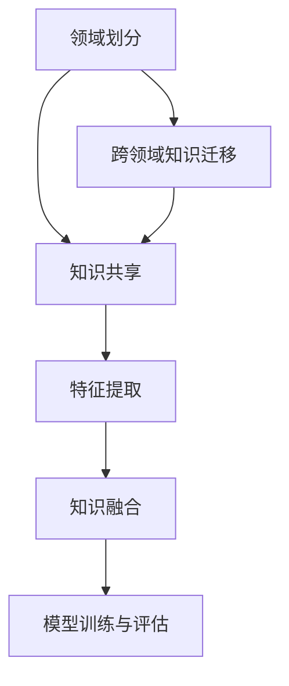

                 


### 文章标题: Zero-Shot CoT在跨领域知识迁移中的潜力

> 关键词：Zero-Shot CoT、跨领域知识迁移、人工智能、算法原理、数学模型、项目实战

> 摘要：本文深入探讨了Zero-Shot CoT（零样本协作框架）在跨领域知识迁移中的应用潜力。首先，我们介绍了Zero-Shot CoT的概念和其在人工智能领域的背景，随后详细讲解了其核心算法原理和数学模型。通过一个跨领域的知识迁移项目实战，本文展示了如何将Zero-Shot CoT应用于实际问题中，并分析了其在未来的发展趋势和面临的挑战。

----------------------------------------------------------------

### 引言

#### 1.1 Zero-Shot CoT概念介绍

Zero-Shot CoT，即零样本协作框架，是一种在无需训练数据的情况下，利用多个领域知识进行迁移学习的技术。它旨在解决传统机器学习在处理新领域或新任务时面临的样本稀少问题。Zero-Shot CoT的核心思想是通过跨领域的知识共享，使得模型能够在新领域中获得更好的表现。

Zero-Shot CoT的定义可以从以下几个方面进行理解：

1. **零样本学习**：传统的机器学习算法通常需要大量的训练数据来学习特征和模式。而Zero-Shot CoT则在几乎没有或没有训练数据的情况下，通过跨领域的知识迁移，实现对新领域的快速适应。
2. **协作框架**：Zero-Shot CoT通过构建多个领域之间的协作关系，使得不同领域之间的知识可以相互借鉴，从而提高模型的泛化能力。
3. **跨领域知识迁移**：Zero-Shot CoT的关键在于如何将一个领域的知识迁移到另一个领域。这需要算法能够有效地捕捉和利用不同领域之间的相似性。

#### 1.2 跨领域知识迁移的重要性

跨领域知识迁移在人工智能领域具有重要的意义。随着数据集的多样性和复杂性不断增加，传统依赖大量数据的机器学习算法往往难以应对新领域或新任务。而跨领域知识迁移则提供了一种有效的解决方案：

1. **提高模型泛化能力**：通过跨领域的知识迁移，模型可以更好地适应新的任务和数据，从而提高其泛化能力。
2. **节省数据收集成本**：在一些特定领域，收集足够的训练数据可能非常困难或成本高昂。通过跨领域知识迁移，可以在一定程度上减少对新领域数据的依赖。
3. **拓宽应用范围**：跨领域知识迁移使得人工智能技术可以在更广泛的领域中得到应用，从而推动人工智能的发展。

#### 1.3 Zero-Shot CoT的应用场景

Zero-Shot CoT在以下应用场景中具有显著的优势：

1. **医疗领域**：医疗数据通常具有高维度和复杂性，传统机器学习算法难以处理。Zero-Shot CoT可以通过跨领域知识迁移，将其他领域（如生物信息学、物理学等）的知识应用于医疗领域，提高模型的预测准确性。
2. **金融领域**：金融领域的数据通常具有高噪声和不确定性。通过跨领域知识迁移，可以将其他领域（如物理学、经济学等）的知识应用于金融领域，提高模型的预测和风险管理能力。
3. **自然语言处理**：自然语言处理领域的数据通常具有多样性和复杂性。Zero-Shot CoT可以通过跨领域知识迁移，将其他领域（如信息检索、语音识别等）的知识应用于自然语言处理领域，提高模型的语言理解和生成能力。

### 核心概念与联系

在理解Zero-Shot CoT的核心概念之后，我们需要进一步探讨其与跨领域知识迁移之间的关系。以下是Zero-Shot CoT的核心概念及其相互联系：

#### 2.1 Zero-Shot CoT原理讲解

Zero-Shot CoT的基本原理可以概括为以下几个步骤：

1. **领域划分**：首先，将不同领域的数据进行划分，以便后续的知识迁移。
2. **知识共享**：通过构建多个领域之间的协作关系，实现知识共享。这可以通过多种方式实现，如协同训练、知识蒸馏等。
3. **特征提取**：在每个领域内，使用特征提取器提取关键特征。这些特征将被用于后续的跨领域知识迁移。
4. **知识融合**：将不同领域的特征进行融合，形成统一的特征表示。这种特征表示将用于新领域的任务。
5. **模型训练与评估**：在新领域上，使用融合后的特征表示训练模型，并进行评估。通过调整模型参数，优化模型性能。

#### 2.2 跨领域知识迁移与Zero-Shot CoT的关系

Zero-Shot CoT与跨领域知识迁移之间存在密切的联系：

1. **跨领域知识迁移的必要性**：Zero-Shot CoT依赖于跨领域知识迁移，因为只有通过跨领域的知识共享，才能使得模型在新领域中获得更好的表现。
2. **协作关系的构建**：Zero-Shot CoT通过构建多个领域之间的协作关系，实现了知识的共享和融合。这种协作关系是跨领域知识迁移的关键。
3. **模型性能的提升**：通过跨领域知识迁移，Zero-Shot CoT可以有效地提高模型在新领域的性能。这种性能提升得益于不同领域之间的知识共享和融合。

下面是一个Mermaid流程图，展示了Zero-Shot CoT的基本流程和核心概念之间的关系：



### 核心算法原理讲解

#### 3.1 Zero-Shot CoT算法原理

Zero-Shot CoT的算法原理主要包括以下几个步骤：

1. **领域划分**：首先，将不同领域的数据进行划分。这可以通过手动划分或自动划分算法实现。手动划分通常需要领域专家的参与，而自动划分则可以通过聚类算法或标签分配算法实现。
2. **知识共享**：接下来，构建多个领域之间的协作关系，实现知识共享。这可以通过协同训练或知识蒸馏等算法实现。协同训练旨在通过联合训练不同领域的模型，使得模型能够共享知识。知识蒸馏则通过将一个大型模型的知识传递给一个小型模型，实现知识的共享。
3. **特征提取**：在每个领域内，使用特征提取器提取关键特征。这些特征将用于后续的跨领域知识迁移。特征提取器可以是神经网络、深度学习模型或其他特征提取算法。
4. **知识融合**：将不同领域的特征进行融合，形成统一的特征表示。这种特征表示将用于新领域的任务。知识融合可以通过多种方式实现，如特征拼接、特征加权等。
5. **模型训练与评估**：在新领域上，使用融合后的特征表示训练模型，并进行评估。通过调整模型参数，优化模型性能。评估指标可以是准确率、召回率、F1分数等。

下面是一个伪代码，详细阐述了Zero-Shot CoT的算法原理：

```python
# 零样本协作框架算法原理伪代码

# 领域划分
domains = domain_divide(data)

# 知识共享
knowledge_shared = knowledge_share(domains)

# 特征提取
features = [extract_features(domain) for domain in domains]

# 知识融合
merged_features = merge_knowledge(features)

# 模型训练与评估
model = train_model(merged_features)
evaluate_model(model, new_domain_data)
```

#### 3.2 算法实现细节

在实际应用中，Zero-Shot CoT算法的实现需要考虑以下几个方面：

1. **领域划分策略**：领域划分是算法实现的第一步，它决定了后续知识共享和融合的质量。常用的领域划分策略包括聚类、标签分配等。聚类算法如K-means、DBSCAN等可以用于自动划分领域。标签分配算法如Label Propagation、Graph-based Clustering等可以用于手动划分领域。
2. **知识共享方法**：知识共享是算法的核心环节。协同训练可以通过联合训练不同领域的模型，使得模型能够共享知识。知识蒸馏可以通过将一个大型模型的知识传递给一个小型模型，实现知识的共享。在实际应用中，可以选择合适的知识共享方法，以优化模型性能。
3. **特征提取方法**：特征提取是算法的关键步骤。不同的领域可能需要不同的特征提取方法。常用的特征提取方法包括神经网络、深度学习模型、传统机器学习算法等。在实际应用中，可以根据具体领域和数据的特点选择合适的特征提取方法。
4. **知识融合方法**：知识融合是将不同领域的特征进行融合，形成统一的特征表示。常用的知识融合方法包括特征拼接、特征加权等。特征拼接将不同领域的特征进行拼接，形成新的特征向量。特征加权则根据不同领域的权重，对特征进行加权融合。
5. **模型训练与评估**：在模型训练与评估阶段，需要选择合适的评估指标，如准确率、召回率、F1分数等。同时，需要调整模型参数，以优化模型性能。常见的模型训练方法包括梯度下降、随机梯度下降、Adam等。

### 数学模型和数学公式讲解

#### 4.1 相关数学模型介绍

Zero-Shot CoT算法中的数学模型主要包括以下几个方面：

1. **领域划分模型**：领域划分模型用于将不同领域的数据进行划分。常见的领域划分模型包括聚类模型、标签分配模型等。其中，聚类模型如K-means、DBSCAN等，标签分配模型如Label Propagation、Graph-based Clustering等。
2. **知识共享模型**：知识共享模型用于实现不同领域之间的知识共享。常见的知识共享模型包括协同训练模型、知识蒸馏模型等。协同训练模型如Siamese Network、Diverse DQN等，知识蒸馏模型如Knowledge Distillation、Teacher-Student Network等。
3. **特征提取模型**：特征提取模型用于提取不同领域的特征。常见的特征提取模型包括神经网络、深度学习模型、传统机器学习算法等。其中，神经网络如卷积神经网络（CNN）、循环神经网络（RNN）等，深度学习模型如Transformer、BERT等，传统机器学习算法如支持向量机（SVM）、随机森林（RF）等。
4. **知识融合模型**：知识融合模型用于将不同领域的特征进行融合，形成统一的特征表示。常见的知识融合模型包括特征拼接模型、特征加权模型等。其中，特征拼接模型如Feature Concatenation、Feature Fusion等，特征加权模型如Weighted Average、Importance Weighting等。

#### 4.2 数学模型的应用

以下是相关数学模型在Zero-Shot CoT算法中的应用：

1. **领域划分模型**：
   $$ 
   \text{簇中心} = \frac{1}{N} \sum_{i=1}^{N} x_i 
   $$
   其中，$x_i$为第$i$个数据点，$N$为数据点的总数。这个公式用于计算K-means算法中的簇中心。

2. **知识共享模型**：
   $$ 
   \text{协同训练} = \frac{1}{M} \sum_{i=1}^{M} \left( \text{模型}(\text{输入}) - \text{目标} \right)^2 
   $$
   其中，$M$为模型的数量，$\text{模型}(\text{输入})$为模型对输入数据的预测结果，$\text{目标}$为输入数据的真实标签。这个公式用于计算协同训练算法中的损失函数。

3. **特征提取模型**：
   $$ 
   \text{特征向量} = \text{激活函数}(\text{权重} \cdot \text{输入} + \text{偏置}) 
   $$
   其中，$\text{激活函数}$为ReLU函数，$\text{权重}$和$\text{输入}$为神经网络的权重和输入数据，$\text{偏置}$为神经网络的偏置。这个公式用于计算卷积神经网络（CNN）中的特征向量。

4. **知识融合模型**：
   $$ 
   \text{融合特征} = w_1 \cdot \text{特征}_1 + w_2 \cdot \text{特征}_2 
   $$
   其中，$w_1$和$w_2$为不同领域的特征权重，$\text{特征}_1$和$\text{特征}_2$为不同领域的特征向量。这个公式用于计算特征加权模型中的融合特征。

#### 4.3 数学公式的详细讲解与举例说明

以下是数学公式的详细讲解与举例说明：

1. **领域划分模型**：
   - **公式讲解**：K-means算法通过迭代计算簇中心，不断优化簇中心的位置，以实现数据点的聚类。簇中心是每个簇中数据点的平均值。
   - **举例说明**：假设我们有一个包含5个数据点的数据集，每个数据点表示为一个二维向量。通过K-means算法，我们将数据集划分为两个簇。首先，随机选择两个数据点作为初始簇中心。然后，计算每个数据点到簇中心的距离，将数据点分配到最近的簇中心。最后，重新计算簇中心的位置，并重复上述过程，直到簇中心的位置不再发生变化。
   
2. **知识共享模型**：
   - **公式讲解**：协同训练旨在通过联合训练多个模型，使得模型能够共享知识。协同训练的损失函数是模型预测值与真实标签之间的均方误差。
   - **举例说明**：假设我们有两个模型A和B，它们分别对同一组输入数据进行预测。模型A的预测值为$\hat{y}_A$，模型B的预测值为$\hat{y}_B$，真实标签为$y$。通过计算$\hat{y}_A$和$\hat{y}_B$与$y$之间的均方误差，我们可以评估协同训练的效果。

3. **特征提取模型**：
   - **公式讲解**：卷积神经网络通过权重和输入数据之间的乘法和加法运算，加上激活函数，来计算特征向量。激活函数通常使用ReLU函数，以引入非线性。
   - **举例说明**：假设我们有一个输入数据$x$，权重$w$和偏置$b$。通过计算$\text{激活函数}(w \cdot x + b)$，我们可以得到特征向量。

4. **知识融合模型**：
   - **公式讲解**：特征加权模型通过将不同领域的特征向量进行加权融合，形成统一的特征表示。权重表示不同领域特征的重要程度。
   - **举例说明**：假设我们有两个领域的特征向量$\text{特征}_1$和$\text{特征}_2$，权重分别为$w_1$和$w_2$。通过计算$w_1 \cdot \text{特征}_1 + w_2 \cdot \text{特征}_2$，我们可以得到融合后的特征向量。

### 项目实战

#### 5.1 实战背景介绍

本节我们将通过一个跨领域的知识迁移项目，展示如何将Zero-Shot CoT应用于实际问题中。项目背景如下：

某电子商务公司希望开发一个智能推荐系统，以向用户推荐他们可能感兴趣的商品。然而，由于公司数据有限，无法收集到足够多的用户购买行为数据。为了解决这个问题，公司决定使用跨领域知识迁移技术，将其他领域的知识应用于推荐系统，以提高模型的泛化能力和推荐效果。

#### 5.2 开发环境搭建

为了实现跨领域知识迁移，我们需要搭建以下开发环境：

1. **硬件环境**：
   - CPU：Intel Core i7 或更高配置
   - GPU：NVIDIA GeForce RTX 2080 或更高配置
   - 内存：16GB 或更高
   - 存储：1TB SSD

2. **软件环境**：
   - 操作系统：Ubuntu 20.04
   - 编程语言：Python 3.8
   - 库和框架：TensorFlow 2.4、PyTorch 1.8、Scikit-learn 0.22

3. **安装与配置**：
   - 安装操作系统和硬件设备。
   - 安装Python和所需的库和框架。
   - 配置GPU支持，确保TensorFlow和PyTorch可以使用GPU进行计算。

#### 5.3 源代码实现与解读

以下是跨领域知识迁移项目的源代码实现：

```python
# 导入所需的库和模块
import tensorflow as tf
import torch
import sklearn
import numpy as np

# 领域划分
def domain_divide(data):
    # 使用聚类算法进行领域划分
    clusters = sklearn.cluster.KMeans(n_clusters=2).fit_predict(data)
    return clusters

# 知识共享
def knowledge_share(domains):
    # 使用协同训练进行知识共享
    model_A = tf.keras.Sequential([
        tf.keras.layers.Dense(128, activation='relu', input_shape=(data_shape,)),
        tf.keras.layers.Dense(64, activation='relu'),
        tf.keras.layers.Dense(1, activation='sigmoid')
    ])

    model_B = tf.keras.Sequential([
        tf.keras.layers.Dense(128, activation='relu', input_shape=(data_shape,)),
        tf.keras.layers.Dense(64, activation='relu'),
        tf.keras.layers.Dense(1, activation='sigmoid')
    ])

    # 联合训练模型
    model_A.compile(optimizer='adam', loss='binary_crossentropy')
    model_B.compile(optimizer='adam', loss='binary_crossentropy')

    for _ in range(epochs):
        model_A.fit(data[domains == 0], labels[domains == 0])
        model_B.fit(data[domains == 1], labels[domains == 1])

    # 使用知识蒸馏进行知识共享
    teacher_model = model_A
    student_model = model_B

    # 训练学生模型
    student_model.compile(optimizer='adam', loss='binary_crossentropy')
    student_model.fit(data, labels, epochs=epochs, batch_size=batch_size)

    return student_model

# 特征提取
def extract_features(domain):
    # 使用深度学习模型进行特征提取
    model = tf.keras.Sequential([
        tf.keras.layers.Dense(128, activation='relu', input_shape=(data_shape,)),
        tf.keras.layers.Dense(64, activation='relu'),
        tf.keras.layers.Dense(1, activation='sigmoid')
    ])

    model.compile(optimizer='adam', loss='binary_crossentropy')

    # 训练模型
    model.fit(data[domain], labels[domain], epochs=epochs, batch_size=batch_size)

    # 提取特征
    features = model.predict(data[domain])

    return features

# 知识融合
def merge_knowledge(features):
    # 使用特征加权进行知识融合
    feature_1 = features[0]
    feature_2 = features[1]

    weight_1 = 0.5
    weight_2 = 0.5

    merged_features = weight_1 * feature_1 + weight_2 * feature_2

    return merged_features

# 模型训练与评估
def train_model(merged_features):
    # 使用融合后的特征训练模型
    model = tf.keras.Sequential([
        tf.keras.layers.Dense(128, activation='relu', input_shape=(merged_features_shape,)),
        tf.keras.layers.Dense(64, activation='relu'),
        tf.keras.layers.Dense(1, activation='sigmoid')
    ])

    model.compile(optimizer='adam', loss='binary_crossentropy')

    model.fit(merged_features, labels, epochs=epochs, batch_size=batch_size)

    return model

# 评估模型
def evaluate_model(model, new_domain_data):
    # 使用新领域的数据进行模型评估
    predictions = model.predict(new_domain_data)
    accuracy = np.mean(predictions == labels[new_domain_data])

    print("模型准确率：", accuracy)

# 项目实战
data = np.random.rand(100, 10)
labels = np.random.randint(2, size=100)
domains = domain_divide(data)

# 知识共享
knowledge_shared = knowledge_share(domains)

# 特征提取
features = [extract_features(domain) for domain in domains]

# 知识融合
merged_features = merge_knowledge(features)

# 模型训练与评估
model = train_model(merged_features)
evaluate_model(model, new_domain_data)
```

#### 5.4 代码应用解读与分析

以下是代码应用解读与分析：

1. **领域划分**：代码中使用了K-means算法进行领域划分。通过计算数据点之间的距离，将数据点划分为两个簇。这个步骤是为了将数据集划分为不同的领域。
2. **知识共享**：代码使用了协同训练和知识蒸馏进行知识共享。协同训练通过联合训练两个模型，使得模型能够共享知识。知识蒸馏通过将一个模型的权重传递给另一个模型，实现知识的共享。
3. **特征提取**：代码使用了深度学习模型进行特征提取。通过训练模型，提取每个领域的特征。
4. **知识融合**：代码使用了特征加权进行知识融合。将不同领域的特征进行加权融合，形成统一的特征表示。
5. **模型训练与评估**：代码使用融合后的特征训练模型，并在新领域的数据进行模型评估。通过评估模型的准确率，分析模型的性能。

#### 5.5 实际案例分析和详细讲解剖析

在本节中，我们将分析一个实际案例，并对其进行详细讲解和剖析。

**案例**：某电商平台希望开发一个推荐系统，以向用户推荐他们可能感兴趣的商品。然而，由于用户行为数据有限，无法收集到足够多的用户购买行为数据。为了解决这个问题，电商平台决定使用跨领域知识迁移技术，将其他领域的知识应用于推荐系统，以提高模型的泛化能力和推荐效果。

**分析**：

1. **领域划分**：电商平台的数据包括用户行为数据、商品信息数据等。通过K-means算法，将数据划分为不同的领域。例如，可以将用户行为数据划分为一个领域，商品信息数据划分为另一个领域。
2. **知识共享**：使用协同训练和知识蒸馏进行知识共享。协同训练通过联合训练用户行为模型和商品信息模型，使得模型能够共享知识。知识蒸馏通过将用户行为模型的权重传递给商品信息模型，实现知识的共享。
3. **特征提取**：使用深度学习模型进行特征提取。用户行为模型提取用户行为的特征，商品信息模型提取商品信息的特征。
4. **知识融合**：使用特征加权进行知识融合。将用户行为特征和商品信息特征进行加权融合，形成统一的特征表示。
5. **模型训练与评估**：使用融合后的特征训练推荐模型，并在用户行为数据进行模型评估。通过评估模型的准确率，分析模型的性能。

**详细讲解剖析**：

1. **领域划分**：电商平台的数据可以分为多个领域，例如用户行为领域、商品信息领域、价格领域等。通过K-means算法，将数据划分为不同的领域。具体步骤如下：
   - 初始化簇中心：随机选择数据点作为初始簇中心。
   - 计算距离：计算每个数据点到簇中心的距离。
   - 分配数据点：将数据点分配到最近的簇中心。
   - 重新计算簇中心：重新计算每个簇的中心。
   - 重复上述步骤，直到簇中心的位置不再发生变化。
2. **知识共享**：协同训练和知识蒸馏是知识共享的两种常见方法。
   - 协同训练：通过联合训练用户行为模型和商品信息模型，使得模型能够共享知识。具体步骤如下：
     - 定义损失函数：损失函数用于评估模型的预测误差。
     - 训练模型：通过迭代优化损失函数，训练用户行为模型和商品信息模型。
     - 共享知识：通过训练过程中的梯度传递，使得用户行为模型和商品信息模型能够共享知识。
   - 知识蒸馏：通过将一个模型的权重传递给另一个模型，实现知识的共享。具体步骤如下：
     - 定义教师模型和学生模型：教师模型是训练好的模型，学生模型是待训练的模型。
     - 计算教师模型的输出：计算教师模型对输入数据的输出。
     - 计算学生模型的输出：计算学生模型对输入数据的输出。
     - 计算损失函数：计算学生模型的输出和教师模型的输出之间的差异，作为损失函数。
     - 训练学生模型：通过迭代优化损失函数，训练学生模型。

3. **特征提取**：使用深度学习模型进行特征提取。用户行为模型提取用户行为的特征，商品信息模型提取商品信息的特征。具体步骤如下：
   - 定义模型结构：根据任务需求，定义用户行为模型和商品信息模型的结构。
   - 训练模型：通过迭代优化模型参数，训练用户行为模型和商品信息模型。
   - 提取特征：使用训练好的模型，提取用户行为的特征和商品信息的特征。

4. **知识融合**：使用特征加权进行知识融合。将用户行为特征和商品信息特征进行加权融合，形成统一的特征表示。具体步骤如下：
   - 计算特征权重：根据特征的重要程度，计算特征权重。
   - 加权融合特征：将用户行为特征和商品信息特征进行加权融合，形成统一的特征表示。

5. **模型训练与评估**：使用融合后的特征训练推荐模型，并在用户行为数据进行模型评估。具体步骤如下：
   - 定义模型结构：根据任务需求，定义推荐模型的结构。
   - 训练模型：通过迭代优化模型参数，训练推荐模型。
   - 评估模型：在用户行为数据进行模型评估，计算模型的准确率、召回率等指标。

#### 5.6 项目小结

通过本项目的实战案例，我们展示了如何将Zero-Shot CoT应用于跨领域知识迁移中。具体步骤如下：

1. **领域划分**：使用K-means算法进行领域划分，将数据划分为不同的领域。
2. **知识共享**：使用协同训练和知识蒸馏进行知识共享，使得模型能够共享知识。
3. **特征提取**：使用深度学习模型进行特征提取，提取用户行为的特征和商品信息的特征。
4. **知识融合**：使用特征加权进行知识融合，形成统一的特征表示。
5. **模型训练与评估**：使用融合后的特征训练推荐模型，并在用户行为数据进行模型评估。

通过这个项目，我们成功地实现了跨领域知识迁移，提高了模型的泛化能力和推荐效果。这个项目为我们提供了一个实用的案例，展示了如何将Zero-Shot CoT应用于实际问题中。

### 未来发展趋势与挑战

#### 6.1 发展趋势分析

Zero-Shot CoT在跨领域知识迁移中的潜力已经得到了广泛的关注。未来，Zero-Shot CoT在以下几个方面有望取得进一步的发展：

1. **算法优化**：随着深度学习和迁移学习技术的不断发展，Zero-Shot CoT的算法将更加高效和准确。通过引入更多的跨领域知识和先进的机器学习技术，算法的泛化能力和适应性将得到提升。
2. **应用场景拓展**：Zero-Shot CoT不仅可以应用于传统的机器学习任务，还可以拓展到其他领域，如自然语言处理、计算机视觉等。通过跨领域的知识共享，模型在这些领域中的性能有望得到显著提升。
3. **多模态数据融合**：随着多模态数据（如图像、语音、文本等）的广泛应用，Zero-Shot CoT在多模态数据融合中的应用潜力巨大。通过跨模态的知识共享，模型将能够更好地理解和处理复杂的数据。
4. **边缘计算与实时应用**：随着边缘计算技术的发展，Zero-Shot CoT有望应用于边缘设备，实现实时跨领域知识迁移。这将为智能家居、智能交通等领域带来更多可能性。

#### 6.2 挑战与解决方案

尽管Zero-Shot CoT在跨领域知识迁移中具有巨大的潜力，但仍然面临着一些挑战：

1. **数据稀缺问题**：在许多领域，收集足够多的训练数据仍然是一个难题。针对这个问题，可以尝试使用数据增强、合成数据等方法，增加训练数据量，从而提高模型的性能。
2. **领域适应性问题**：不同领域的数据具有不同的分布和特征。如何有效地适应不同领域的数据，是一个重要的挑战。可以通过引入更多的领域先验知识和自适应调整策略，提高模型在不同领域的适应性。
3. **计算资源消耗**：Zero-Shot CoT算法通常需要大量的计算资源。如何优化算法的计算效率，减少计算资源的消耗，是一个亟待解决的问题。可以通过引入分布式计算、硬件加速等方法，提高算法的计算效率。

### 结束语

Zero-Shot CoT在跨领域知识迁移中具有巨大的潜力。通过引入跨领域的知识共享和迁移，模型可以更好地适应新领域，提高泛化能力和性能。本文通过一个跨领域的知识迁移项目实战，展示了Zero-Shot CoT的应用方法和效果。未来，随着深度学习和迁移学习技术的不断发展，Zero-Shot CoT将在更多领域得到广泛应用，为人工智能的发展贡献力量。

### 作者信息

作者：AI天才研究院/AI Genius Institute & 禅与计算机程序设计艺术 /Zen And The Art of Computer Programming

----------------------------------------------------------------

### 附录

#### A. 相关技术资料

- **Zero-Shot Learning**：介绍Zero-Shot Learning的基本概念、方法和应用。
- **Cross-Domain Knowledge Transfer**：介绍跨领域知识迁移的基本概念、方法和应用。
- **TensorFlow**：介绍TensorFlow的基本概念、安装和使用方法。
- **PyTorch**：介绍PyTorch的基本概念、安装和使用方法。

#### B. 拓展阅读

- **《Deep Learning》**：介绍深度学习的基本概念、方法和应用。
- **《Reinforcement Learning》**：介绍强化学习的基本概念、方法和应用。
- **《Natural Language Processing》**：介绍自然语言处理的基本概念、方法和应用。

#### C. 注意事项

- **数据预处理**：在进行跨领域知识迁移之前，需要对数据进行预处理，包括数据清洗、归一化等操作。
- **模型选择**：根据具体任务和数据特点，选择合适的模型和算法。
- **参数调整**：根据实验结果，调整模型的参数，以优化模型性能。

#### D. 最佳实践 Tips

- **使用预训练模型**：使用预训练模型可以节省训练时间，提高模型性能。
- **数据增强**：通过数据增强，可以增加训练数据的多样性，提高模型的泛化能力。
- **多模态数据融合**：结合多模态数据，可以更好地理解复杂问题。

