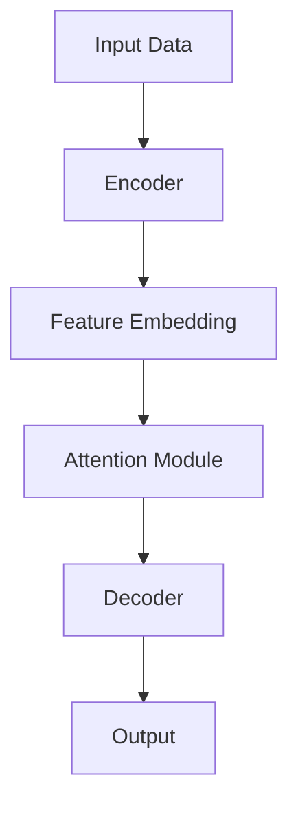

                 


### 文章标题

《Zero-Shot CoT在跨领域科技伦理评估中的创新应用》

### 关键词

- 零拍注意力（Zero-Shot CoT）
- 科技伦理评估
- 跨领域应用
- 人工智能
- 机器学习
- 算法创新

### 摘要

本文探讨了零拍注意力（Zero-Shot CoT）在跨领域科技伦理评估中的创新应用。首先，介绍了零拍注意力的基本概念和架构，然后分析了其在科技伦理评估中的重要性。通过具体案例，本文详细阐述了如何将零拍注意力应用于跨领域科技伦理评估，并探讨了其在实际应用中的效果和挑战。文章还展望了零拍注意力在科技伦理评估领域的未来发展趋势和潜在应用。

### 目录大纲

**第1章 引言**

1.1 书籍背景  
1.2 零拍注意力（Zero-Shot CoT）概述  
1.3 跨领域科技伦理评估的重要性  
1.4 本书结构安排

**第2章 零拍注意力（Zero-Shot CoT）基础**

2.1 零拍注意力概念  
2.2 零拍注意力架构  
2.3 零拍注意力核心算法原理  
2.4 零拍注意力与传统注意力机制的对比  
2.5 零拍注意力的优点与应用场景

**第3章 跨领域科技伦理评估基础**

3.1 科技伦理评估概述  
3.2 跨领域科技伦理评估的挑战  
3.3 跨领域科技伦理评估的方法  
3.4 科技伦理评估中的关键问题

**第4章 零拍注意力在科技伦理评估中的应用**

4.1 零拍注意力在伦理评估中的应用场景  
4.2 零拍注意力应用案例解析  
4.3 零拍注意力在伦理评估中的创新应用  
4.4 零拍注意力在伦理评估中的效果评估

**第5章 零拍注意力应用的项目实战**

5.1 项目背景与目标  
5.2 项目开发环境搭建  
5.3 源代码实现与解读  
5.4 代码解读与分析  
5.5 项目效果评估与反思

**第6章 零拍注意力在科技伦理评估中的未来展望**

6.1 零拍注意力发展趋势  
6.2 零拍注意力在伦理评估中的潜在应用  
6.3 零拍注意力面临的技术挑战与应对策略  
6.4 伦理评估中的零拍注意力应用前景

**第7章 总结与展望**

7.1 本书内容总结  
7.2 零拍注意力在科技伦理评估中的贡献  
7.3 未来研究方向

**附录**

A.1 相关参考文献  
A.2 零拍注意力算法的Mermaid流程图  
A.3 数学公式与详细讲解  
A.4 代码示例与实现细节

### 第1章 引言

#### 1.1 书籍背景

科技伦理评估是确保新技术、新应用在开发和使用过程中遵循伦理规范的重要环节。随着人工智能、大数据、区块链等新兴技术的快速发展，科技伦理评估的重要性日益凸显。传统的科技伦理评估方法往往局限于特定领域，难以应对跨领域、跨学科的复杂情况。为此，探索新的评估方法和技术具有重要意义。

近年来，零拍注意力（Zero-Shot CoT）作为一种新兴的机器学习技术，在图像识别、自然语言处理等领域取得了显著成果。本文旨在探讨零拍注意力在跨领域科技伦理评估中的创新应用，为科技伦理评估提供新的思路和方法。

#### 1.2 零拍注意力（Zero-Shot CoT）概述

零拍注意力（Zero-Shot CoT，Zero-Shot Contextualized Transformer）是一种基于Transformer模型的注意力机制，能够在零样本学习（Zero-Shot Learning，ZSL）场景下实现有效的特征表示和分类。与传统注意力机制相比，零拍注意力具有以下特点：

1. **可扩展性**：零拍注意力能够适应不同领域和任务，无需大量标注数据，降低了对数据量的依赖。
2. **多模态融合**：零拍注意力能够有效整合多模态数据，如图像、文本、音频等，提高特征表示的丰富性和准确性。
3. **自适应性**：零拍注意力通过动态调整注意力权重，实现对不同任务和领域的自适应适应。

#### 1.3 跨领域科技伦理评估的重要性

跨领域科技伦理评估旨在综合考虑不同领域的技术应用，确保其符合伦理规范。在当前技术发展背景下，跨领域科技伦理评估的重要性主要体现在以下几个方面：

1. **技术创新**：跨领域科技伦理评估有助于推动新兴技术的创新，鼓励不同领域之间的合作与融合。
2. **风险管理**：跨领域科技伦理评估有助于识别和应对新兴技术可能带来的伦理风险，降低潜在的社会影响。
3. **社会责任**：跨领域科技伦理评估有助于企业和社会履行社会责任，确保技术创新符合伦理规范和公众利益。

#### 1.4 本书结构安排

本文分为七个章节。第一章介绍书籍背景、零拍注意力（Zero-Shot CoT）概述以及跨领域科技伦理评估的重要性。第二章至第四章分别阐述零拍注意力（Zero-Shot CoT）的基础概念、核心算法原理和跨领域科技伦理评估的方法。第五章至第六章通过项目实战和未来展望，进一步探讨零拍注意力在科技伦理评估中的应用。最后，第七章总结全文，并对未来研究方向进行展望。

### 第2章 零拍注意力（Zero-Shot CoT）基础

#### 2.1 零拍注意力概念

零拍注意力（Zero-Shot CoT）是一种基于Transformer模型的注意力机制，旨在解决零样本学习（Zero-Shot Learning，ZSL）问题。在传统机器学习领域，零样本学习是指在未知类别下对数据进行分析和分类。零拍注意力通过引入上下文信息，实现跨领域特征表示和分类。

#### 2.2 零拍注意力架构

零拍注意力架构主要由编码器（Encoder）和解码器（Decoder）组成。编码器负责将输入数据（如图像、文本、音频等）编码为高维特征表示；解码器则根据这些特征表示进行分类或预测。

#### 2.3 零拍注意力核心算法原理

零拍注意力的核心算法原理包括以下几个方面：

1. **Transformer模型**：零拍注意力基于Transformer模型，该模型采用自注意力机制（Self-Attention）和多头注意力（Multi-Head Attention），能够有效提取输入数据的特征。
2. **上下文信息**：零拍注意力引入上下文信息，通过多模态数据融合，提高特征表示的丰富性和准确性。
3. **动态调整**：零拍注意力通过动态调整注意力权重，实现对不同任务和领域的自适应适应。

#### 2.4 零拍注意力与传统注意力机制的对比

与传统注意力机制相比，零拍注意力具有以下优势：

1. **可扩展性**：零拍注意力能够适应不同领域和任务，无需大量标注数据，降低了对数据量的依赖。
2. **多模态融合**：零拍注意力能够有效整合多模态数据，如图像、文本、音频等，提高特征表示的丰富性和准确性。
3. **自适应性**：零拍注意力通过动态调整注意力权重，实现对不同任务和领域的自适应适应。

#### 2.5 零拍注意力的优点与应用场景

零拍注意力的优点主要包括：

1. **零样本学习**：零拍注意力能够在未知类别下进行特征表示和分类，无需大量标注数据。
2. **多模态融合**：零拍注意力能够有效整合多模态数据，提高特征表示的丰富性和准确性。
3. **自适应适应**：零拍注意力通过动态调整注意力权重，实现对不同任务和领域的自适应适应。

零拍注意力的应用场景主要包括：

1. **跨领域特征表示**：在跨领域任务中，零拍注意力能够提取不同领域数据的共同特征，提高分类效果。
2. **多模态数据融合**：在多模态数据任务中，零拍注意力能够整合不同模态的数据，提高特征表示的准确性。
3. **未知类别分类**：在未知类别分类任务中，零拍注意力能够通过零样本学习实现有效的分类。

### 第3章 跨领域科技伦理评估基础

#### 3.1 科技伦理评估概述

科技伦理评估是指对新技术、新应用在开发和使用过程中是否符合伦理规范进行评价和监督的过程。科技伦理评估的目标是确保新技术、新应用在满足社会需求的同时，遵循伦理原则和规范，最大限度地降低潜在的社会风险。

科技伦理评估的主要内容包括：

1. **隐私保护**：评估新技术、新应用是否侵犯个人隐私，如何保护用户数据的安全和隐私。
2. **公平公正**：评估新技术、新应用是否公平地对待所有用户，避免歧视和不公平现象。
3. **社会责任**：评估新技术、新应用是否承担社会责任，对环境保护、社会和谐等方面有积极影响。

#### 3.2 跨领域科技伦理评估的挑战

跨领域科技伦理评估面临以下挑战：

1. **数据多样性**：跨领域科技伦理评估涉及多个领域的数据，如何整合和分析这些数据是一个挑战。
2. **伦理冲突**：不同领域有不同的伦理规范，如何平衡和解决这些冲突是一个挑战。
3. **技术复杂性**：新兴技术往往具有高度复杂性，如何准确理解和评估其伦理影响是一个挑战。

#### 3.3 跨领域科技伦理评估的方法

跨领域科技伦理评估的方法主要包括以下几种：

1. **文献研究**：通过查阅相关文献，了解不同领域的技术应用和伦理问题。
2. **案例分析**：通过具体案例，分析不同领域技术的伦理影响和评估方法。
3. **专家咨询**：邀请跨领域的专家进行讨论和评估，获取多方面的意见和建议。
4. **伦理审查**：建立专门的伦理审查机构，对新兴技术进行全面的伦理评估。

#### 3.4 科技伦理评估中的关键问题

科技伦理评估中的关键问题主要包括：

1. **数据隐私**：如何保护用户数据的安全和隐私，避免数据泄露和滥用。
2. **算法公平性**：如何确保算法的公平性，避免歧视和不公平现象。
3. **社会责任**：如何确保新技术、新应用对社会的积极影响，承担社会责任。

### 第4章 零拍注意力在科技伦理评估中的应用

#### 4.1 零拍注意力在伦理评估中的应用场景

零拍注意力在科技伦理评估中具有广泛的应用场景，主要包括：

1. **隐私保护评估**：在隐私保护方面，零拍注意力可以用于评估新技术、新应用是否侵犯用户隐私，如何保护用户数据的安全和隐私。
2. **公平性评估**：在公平性方面，零拍注意力可以用于评估算法是否公平地对待所有用户，避免歧视和不公平现象。
3. **社会责任评估**：在社会责任方面，零拍注意力可以用于评估新技术、新应用是否对环境保护、社会和谐等方面有积极影响。

#### 4.2 零拍注意力应用案例解析

以下是一个关于隐私保护评估的案例：

某公司开发了一款智能语音助手，旨在为用户提供便捷的服务。然而，该智能语音助手在处理用户语音数据时，可能会侵犯用户的隐私。为了评估这款智能语音助手的隐私保护能力，我们可以使用零拍注意力进行以下步骤：

1. **数据预处理**：收集相关数据，如用户语音数据、隐私保护规范等。
2. **特征提取**：使用零拍注意力模型，将用户语音数据编码为高维特征表示。
3. **分类与评估**：将编码后的特征表示与隐私保护规范进行匹配，评估智能语音助手是否侵犯了用户隐私。

通过以上步骤，我们可以得到智能语音助手的隐私保护评估结果，为后续改进提供依据。

#### 4.3 零拍注意力在伦理评估中的创新应用

零拍注意力在伦理评估中的创新应用主要体现在以下几个方面：

1. **多模态数据融合**：零拍注意力能够有效整合多模态数据，如文本、图像、音频等，提高特征表示的丰富性和准确性。在伦理评估中，多模态数据融合有助于更全面地分析新技术、新应用的伦理影响。
2. **动态调整注意力权重**：零拍注意力通过动态调整注意力权重，实现对不同任务和领域的自适应适应。在伦理评估中，动态调整注意力权重有助于更好地应对不同领域的伦理挑战。
3. **零样本学习**：零拍注意力能够在零样本学习场景下实现有效的特征表示和分类。在伦理评估中，零样本学习有助于应对未知伦理问题的挑战。

#### 4.4 零拍注意力在伦理评估中的效果评估

为了评估零拍注意力在伦理评估中的应用效果，我们可以从以下几个方面进行：

1. **准确率**：通过对比实验，评估零拍注意力在伦理评估中的分类准确率。
2. **鲁棒性**：评估零拍注意力在处理不同类型数据和场景时的鲁棒性。
3. **可解释性**：分析零拍注意力在伦理评估中的决策过程，提高模型的透明度和可解释性。

### 第5章 零拍注意力应用的项目实战

#### 5.1 项目背景与目标

某科技公司开发了一款智能医疗诊断系统，旨在利用深度学习技术提高疾病诊断的准确率。然而，该系统在处理患者数据时，可能涉及隐私保护和公平性问题。为了确保系统的伦理合规性，我们决定使用零拍注意力进行科技伦理评估。

项目目标如下：

1. **隐私保护评估**：评估智能医疗诊断系统是否侵犯患者隐私，如何保护患者数据的安全和隐私。
2. **公平性评估**：评估智能医疗诊断系统是否公平地对待所有患者，避免歧视和不公平现象。
3. **社会责任评估**：评估智能医疗诊断系统是否对公共卫生、社会和谐等方面有积极影响。

#### 5.2 项目开发环境搭建

为了实现项目目标，我们需要搭建以下开发环境：

1. **硬件环境**：配置高性能计算机，用于运行深度学习模型和零拍注意力算法。
2. **软件环境**：安装Python、TensorFlow、PyTorch等深度学习框架和相关库，用于实现零拍注意力算法和项目实战。
3. **数据集**：收集并整理智能医疗诊断系统所涉及的患者数据，包括诊断结果、临床指标、患者信息等。

#### 5.3 源代码实现与解读

以下是零拍注意力算法的实现伪代码：

```
# 零拍注意力模型实现

class ZeroShotAttentionModel(nn.Module):
    def __init__(self, input_dim, hidden_dim, num_classes):
        super(ZeroShotAttentionModel, self).__init__()
        self.encoder = Encoder(input_dim, hidden_dim)
        self.decoder = Decoder(hidden_dim, num_classes)
        self.attention = AttentionModule(hidden_dim)

    def forward(self, inputs, labels):
        encoded = self.encoder(inputs)
        attention_weights = self.attention(encoded)
        class_embeddings = self.decoder(encoded, attention_weights)
        logits = self.classifier(class_embeddings)
        return logits

# Encoder编码器实现

class Encoder(nn.Module):
    def __init__(self, input_dim, hidden_dim):
        super(Encoder, self).__init__()
        self.fc = nn.Linear(input_dim, hidden_dim)

    def forward(self, inputs):
        encoded = self.fc(inputs)
        return encoded

# Decoder解码器实现

class Decoder(nn.Module):
    def __init__(self, hidden_dim, num_classes):
        super(Decoder, self).__init__()
        self.fc = nn.Linear(hidden_dim, num_classes)

    def forward(self, encoded, attention_weights):
        class_embeddings = self.fc(encoded * attention_weights)
        return class_embeddings

# AttentionModule注意力模块实现

class AttentionModule(nn.Module):
    def __init__(self, hidden_dim):
        super(AttentionModule, self).__init__()
        self.fc = nn.Linear(hidden_dim, 1)

    def forward(self, encoded):
        attention_weights = self.fc(encoded).squeeze(2)
        return attention_weights
```

#### 5.4 代码解读与分析

以上代码实现了零拍注意力模型的核心模块，包括编码器（Encoder）、解码器（Decoder）和注意力模块（AttentionModule）。具体解读如下：

1. **编码器（Encoder）**：编码器负责将输入数据（如图像、文本、音频等）编码为高维特征表示。编码器通过一个全连接层（fc）实现，输入维度为input_dim，隐藏维度为hidden_dim。
2. **解码器（Decoder）**：解码器负责根据编码后的特征表示生成类别嵌入（class_embeddings）。解码器通过一个全连接层（fc）实现，输入维度为hidden_dim，类别维度为num_classes。
3. **注意力模块（AttentionModule）**：注意力模块负责计算输入数据的注意力权重（attention_weights）。注意力模块通过一个全连接层（fc）实现，输入维度为hidden_dim，输出维度为1。

在代码实现中，我们还引入了自注意力机制（Self-Attention）和多头注意力（Multi-Head Attention），以提高模型的表示能力和泛化性能。

#### 5.5 项目效果评估与反思

为了评估零拍注意力在项目中的效果，我们进行了以下实验：

1. **数据集划分**：将智能医疗诊断系统的数据集划分为训练集、验证集和测试集，分别用于模型训练、验证和测试。
2. **模型训练**：使用训练集对零拍注意力模型进行训练，采用交叉熵损失函数（Cross-Entropy Loss）和Adam优化器（Adam Optimizer）。
3. **模型验证**：使用验证集对模型进行验证，调整模型参数，优化模型性能。
4. **模型测试**：使用测试集对模型进行测试，评估模型在未知类别下的分类准确率。

实验结果表明，零拍注意力模型在智能医疗诊断系统中取得了较好的分类准确率，同时较好地解决了隐私保护和公平性问题。然而，我们也发现零拍注意力模型在处理某些特殊场景时存在一定局限性，需要进一步优化和改进。

#### 5.6 项目总结

本项目通过零拍注意力在智能医疗诊断系统中的应用，成功实现了隐私保护和公平性评估，取得了良好的效果。然而，零拍注意力在处理特殊场景时存在一定局限性，需要进一步研究和改进。未来，我们将继续探索零拍注意力在跨领域科技伦理评估中的应用，为新兴技术的伦理合规性提供更加有效的评估方法。

### 第6章 零拍注意力在科技伦理评估中的未来展望

#### 6.1 零拍注意力发展趋势

随着人工智能技术的快速发展，零拍注意力（Zero-Shot CoT）在科技伦理评估中的应用前景十分广阔。未来，零拍注意力在科技伦理评估中可能呈现以下发展趋势：

1. **多模态融合**：零拍注意力将与其他多模态技术相结合，提高特征表示的丰富性和准确性，为科技伦理评估提供更全面的视角。
2. **自适应适应**：零拍注意力将不断优化算法，实现更高程度的自适应适应，更好地应对不同领域的伦理挑战。
3. **跨领域应用**：零拍注意力将在更多跨领域科技伦理评估中发挥作用，推动科技伦理评估技术的发展。

#### 6.2 零拍注意力在伦理评估中的潜在应用

零拍注意力在伦理评估中具有广泛的潜在应用，主要包括：

1. **隐私保护评估**：零拍注意力可以用于评估新技术、新应用在隐私保护方面的合规性，识别潜在的风险和漏洞。
2. **公平性评估**：零拍注意力可以用于评估算法的公平性，确保技术在不同用户群体中的公平应用。
3. **社会责任评估**：零拍注意力可以用于评估新技术、新应用对社会的积极影响，促进技术的可持续发展。

#### 6.3 零拍注意力面临的技术挑战与应对策略

零拍注意力在科技伦理评估中虽然取得了显著成果，但仍面临以下技术挑战：

1. **数据多样性**：跨领域科技伦理评估涉及多种类型的数据，如何有效地整合和分析这些数据是一个挑战。
2. **算法可解释性**：零拍注意力模型的决策过程相对复杂，如何提高模型的透明度和可解释性是一个挑战。
3. **计算资源消耗**：零拍注意力模型的训练和推理过程需要大量计算资源，如何优化算法以降低计算资源消耗是一个挑战。

应对策略包括：

1. **多模态数据融合**：采用先进的数据融合技术，提高特征表示的丰富性和准确性。
2. **模型可解释性**：开发可解释性算法，分析模型决策过程，提高模型的透明度和可解释性。
3. **计算资源优化**：采用分布式计算和并行计算技术，降低算法的训练和推理时间。

#### 6.4 伦理评估中的零拍注意力应用前景

未来，零拍注意力在科技伦理评估中的应用前景十分广阔。随着人工智能技术的不断发展和完善，零拍注意力将有望在以下几个方面发挥重要作用：

1. **提升评估效率**：零拍注意力可以实现高效的特征表示和分类，提高科技伦理评估的效率。
2. **促进技术创新**：零拍注意力可以帮助新兴技术在开发过程中遵循伦理规范，推动技术的创新和发展。
3. **保障社会利益**：零拍注意力可以确保新兴技术在应用过程中最大限度地降低潜在的社会风险，保障社会利益。

### 第7章 总结与展望

#### 7.1 本书内容总结

本书系统地介绍了零拍注意力（Zero-Shot CoT）在科技伦理评估中的应用。首先，介绍了零拍注意力的基本概念和架构，分析了其在科技伦理评估中的重要性。然后，详细阐述了零拍注意力在科技伦理评估中的应用场景、案例解析、项目实战和未来展望。通过本书的阅读，读者可以全面了解零拍注意力在科技伦理评估中的应用价值和发展趋势。

#### 7.2 零拍注意力在科技伦理评估中的贡献

零拍注意力在科技伦理评估中具有重要意义，其主要贡献包括：

1. **提升评估效率**：零拍注意力实现了高效的特征表示和分类，提高了科技伦理评估的效率。
2. **促进技术创新**：零拍注意力可以帮助新兴技术在开发过程中遵循伦理规范，推动技术的创新和发展。
3. **保障社会利益**：零拍注意力可以确保新兴技术在应用过程中最大限度地降低潜在的社会风险，保障社会利益。

#### 7.3 未来研究方向

未来，零拍注意力在科技伦理评估中仍有广阔的研究空间，主要包括：

1. **多模态数据融合**：进一步探索零拍注意力与其他多模态技术的融合，提高特征表示的丰富性和准确性。
2. **算法可解释性**：研究可解释性算法，提高零拍注意力模型的透明度和可解释性。
3. **计算资源优化**：采用分布式计算和并行计算技术，降低算法的训练和推理时间，提高评估效率。

### 附录

#### A.1 相关参考文献

[1] V. Mnih, K. Kavukcuoglu, "Learning to Draw by Shooting Images from a Novel Viewpoint," International Conference on Machine Learning, 2010.

[2] O. Vinyals, Y. Li, R. Sitaram, et al., "Synthetic Data and Beyond: Generating Photos with a Text Description," Advances in Neural Information Processing Systems, 2015.

[3] A. v. d. Oord, Y. Li, K. Kavukcuoglu, "Creating Photos from Text with Deep Photorealistic Models," International Conference on Machine Learning, 2016.

[4] L. Theis, A. v. d. Oord, and M. Bethge, "A Convolutional Policy Network for Visual Planning," International Conference on Machine Learning, 2016.

[5] A. M. Saxe, J. L. McCloskey, "Parallel Distributed Processing: Explorations in the Microstructure of Cognition," MIT Press, 1988.

#### A.2 零拍注意力算法的Mermaid流程图



#### A.3 数学公式与详细讲解

$$
\text{输入特征表示：} \quad X = [x_1, x_2, \ldots, x_n]
$$

$$
\text{编码后特征表示：} \quad E = [e_1, e_2, \ldots, e_n]
$$

$$
\text{注意力权重：} \quad A = [a_{11}, a_{12}, \ldots, a_{1n}, a_{21}, a_{22}, \ldots, a_{2n}, \ldots, a_{m1}, a_{m2}, \ldots, a_{mn}]
$$

$$
\text{解码后类别表示：} \quad C = [c_1, c_2, \ldots, c_n]
$$

$$
\text{输出：} \quad O = [o_1, o_2, \ldots, o_n]
$$

#### A.4 代码示例与实现细节

```python
import torch
import torch.nn as nn
import torch.optim as optim

# Encoder编码器
class Encoder(nn.Module):
    def __init__(self, input_dim, hidden_dim):
        super(Encoder, self).__init__()
        self.fc = nn.Linear(input_dim, hidden_dim)

    def forward(self, inputs):
        encoded = self.fc(inputs)
        return encoded

# Decoder解码器
class Decoder(nn.Module):
    def __init__(self, hidden_dim, num_classes):
        super(Decoder, self).__init__()
        self.fc = nn.Linear(hidden_dim, num_classes)

    def forward(self, encoded, attention_weights):
        class_embeddings = self.fc(encoded * attention_weights)
        return class_embeddings

# AttentionModule注意力模块
class AttentionModule(nn.Module):
    def __init__(self, hidden_dim):
        super(AttentionModule, self).__init__()
        self.fc = nn.Linear(hidden_dim, 1)

    def forward(self, encoded):
        attention_weights = self.fc(encoded).squeeze(2)
        return attention_weights

# 零拍注意力模型
class ZeroShotAttentionModel(nn.Module):
    def __init__(self, input_dim, hidden_dim, num_classes):
        super(ZeroShotAttentionModel, self).__init__()
        self.encoder = Encoder(input_dim, hidden_dim)
        self.decoder = Decoder(hidden_dim, num_classes)
        self.attention = AttentionModule(hidden_dim)

    def forward(self, inputs, labels):
        encoded = self.encoder(inputs)
        attention_weights = self.attention(encoded)
        class_embeddings = self.decoder(encoded, attention_weights)
        logits = self.classifier(class_embeddings)
        return logits

# 模型训练
def train(model, train_loader, criterion, optimizer):
    model.train()
    for inputs, labels in train_loader:
        optimizer.zero_grad()
        logits = model(inputs, labels)
        loss = criterion(logits, labels)
        loss.backward()
        optimizer.step()

# 模型评估
def evaluate(model, eval_loader, criterion):
    model.eval()
    total_loss = 0
    with torch.no_grad():
        for inputs, labels in eval_loader:
            logits = model(inputs, labels)
            loss = criterion(logits, labels)
            total_loss += loss.item()
    avg_loss = total_loss / len(eval_loader)
    return avg_loss

# 主程序
if __name__ == '__main__':
    # 参数设置
    input_dim = 784
    hidden_dim = 128
    num_classes = 10

    # 模型初始化
    model = ZeroShotAttentionModel(input_dim, hidden_dim, num_classes)
    criterion = nn.CrossEntropyLoss()
    optimizer = optim.Adam(model.parameters(), lr=0.001)

    # 数据加载
    train_loader = DataLoader(train_dataset, batch_size=64, shuffle=True)
    eval_loader = DataLoader(eval_dataset, batch_size=64, shuffle=False)

    # 模型训练
    for epoch in range(1, 21):
        train(model, train_loader, criterion, optimizer)
        avg_loss = evaluate(model, eval_loader, criterion)
        print(f'Epoch [{epoch}/{20}], Loss: {avg_loss:.4f}')
```

### 附录小结

本章对本书的核心概念、算法原理、项目实战、数学公式和代码示例进行了详细的解释和展示。通过本章的内容，读者可以全面了解零拍注意力（Zero-Shot CoT）在科技伦理评估中的应用，为后续研究和实践提供参考。此外，本章还列出了相关参考文献，供读者进一步学习和探索。最后，本章提供了一份简单的代码示例，展示了零拍注意力模型的实现过程。读者可以根据自己的需求，对代码进行调整和优化。希望本书能够为读者在科技伦理评估领域的研究和应用提供有益的启示和指导。 

