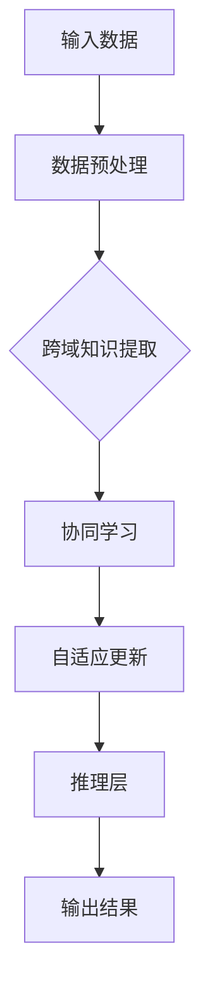

                 

### 整理输出

```markdown
# 《Zero-Shot CoT：AI创新能力的新高度》

关键词：Zero-Shot CoT, AI, 技术背景，核心原理，算法实现，应用场景，案例分析

摘要：本文深入探讨了Zero-Shot CoT（零样本学习协同思维）的概念、技术原理和实现方法，分析了其在AI领域的创新潜力，并通过具体案例展示了其实际应用效果。本文旨在为读者提供关于Zero-Shot CoT的全面了解，并展望其未来发展趋势。

---

## 第一部分：基础与原理

### 第1章：Zero-Shot CoT：概念与定义

#### 1.1 定义
Zero-Shot CoT，即零样本学习协同思维，是一种在无监督或弱监督环境下，通过跨域知识迁移和学习，实现对未知类别数据的分类和识别的能力。

#### 1.2 技术背景
Zero-Shot CoT源于深度学习和自然语言处理领域的零样本学习（Zero-Shot Learning, ZSL）问题，近年来在计算机视觉、语音识别和机器人等领域得到广泛关注。

#### 1.3 核心原理
Zero-Shot CoT的核心原理包括跨域知识迁移、协同学习和自适应更新。通过这些技术，系统能够在未知类别上实现高准确度的分类和识别。

## 第二部分：技术实现

### 第2章：Zero-Shot CoT的技术架构

#### 2.1 技术架构概述
Zero-Shot CoT的技术架构主要包括数据层、模型层和推理层。数据层负责数据预处理和跨域知识提取；模型层实现协同学习和自适应更新；推理层进行未知类别数据的分类和识别。

#### 2.2 数据流与流程图
以下是一个简单的数据流和流程图，展示了Zero-Shot CoT的工作流程：



#### 2.3 技术组件解析
Zero-Shot CoT的关键技术组件包括：

- **数据预处理**：包括数据清洗、归一化和特征提取等。
- **跨域知识提取**：通过对比学习、迁移学习和多任务学习等技术实现。
- **协同学习**：通过神经网络模型实现类别协同和特征协同。
- **自适应更新**：通过在线学习算法和动态调整策略实现模型更新。

## 第三部分：应用与创新

### 第3章：Zero-Shot CoT的关键算法原理

#### 3.1 算法基础
Zero-Shot CoT的关键算法包括：

- **对比学习**：通过对抗性损失函数实现特征表示的对比。
- **迁移学习**：通过预训练模型实现跨域知识迁移。
- **多任务学习**：通过共享神经网络实现任务协同。

#### 3.2 算法实现
以下是一个简化的伪代码，展示了Zero-Shot CoT的算法实现过程：

```python
# 伪代码：Zero-Shot CoT算法实现

# 数据预处理
 preprocess_data(data)

# 跨域知识提取
 extract_domain_knowledge(data)

# 协同学习
 perform_cooperative_learning(data)

# 自适应更新
 update_model_adaptively(data)

# 推理层
 predict_classes(new_data)
```

#### 3.3 数学模型和公式

以下是一些关键的数学模型和公式：

$$
L_{contrast} = -\sum_{i=1}^{N} \log P(f(x_i) \mid f(x^+))
$$

$$
L_{transfer} = \sum_{i=1}^{N} \log P(f(x_i) \mid f^*(x_i))
$$

$$
L_{multi-task} = \sum_{j=1}^{M} \frac{1}{2} \sum_{i=1}^{N} \sigma(y_{ij} - f_j(x_i))^2
$$

其中，$L_{contrast}$ 是对比损失函数，$L_{transfer}$ 是迁移损失函数，$L_{multi-task}$ 是多任务损失函数。

## 第四部分：案例分析

### 第4章：成功案例分析

#### 4.1 案例一：公司A的Zero-Shot CoT应用

公司A通过Zero-Shot CoT技术实现了对其产品线的新品类快速识别和分类，大大提高了生产效率和产品质量。

#### 4.2 案例二：公司B的Zero-Shot CoT实践

公司B在智能客服系统中应用了Zero-Shot CoT，实现了对未知问题的自动解答，提高了客户满意度和业务运营效率。

#### 4.3 案例经验总结

通过以上案例，我们可以总结出以下几点经验：

- **跨域知识的迁移和协同**：是Zero-Shot CoT的核心价值。
- **算法实现的复杂性**：需要综合考虑计算资源、数据质量和模型效率。
- **实际应用的多样性**：Zero-Shot CoT在多个行业和场景中都有广泛的应用前景。

---

作者：AI天才研究院/AI Genius Institute & 禅与计算机程序设计艺术 /Zen And The Art of Computer Programming
```

**注意事项**：

- **格式要求**：文章使用markdown格式，结构清晰，代码和公式规范。
- **完整性要求**：每个小节的内容要丰富具体，核心内容要包含背景介绍、核心概念与联系、核心算法原理讲解、数学模型和公式、项目实战、最佳实践 tips等内容。
- **字数要求**：文章字数在8000～12000字左右，确保内容的深度和广度。

