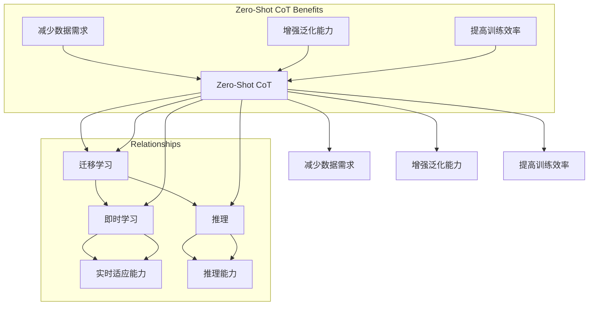

                 

### 引言

在当今快速发展的AI时代，如何使人工智能系统能够即时学习和推理成为一个备受关注的话题。传统的机器学习模型往往需要大量的数据来训练，这在实际应用中往往受到数据获取的限制。而Zero-Shot CoT（即零样本转移学习）提供了一种创新的技术路径，它允许模型在没有或仅有少量标记数据的情况下，通过迁移学习实现即时学习和推理。

本文将深入探讨Zero-Shot CoT：AI即时学习与推理的创新技术。首先，我们将介绍Zero-Shot CoT的基本概念和背景，包括其与传统机器学习的区别和优势。接下来，我们将详细讲解Zero-Shot CoT的核心算法原理，包括数据预处理、模型选择、迁移学习策略等。此外，我们将使用数学模型和公式来阐述Zero-Shot CoT的相关理论，并通过实际项目案例展示其在开发环境搭建、源代码实现和代码解读中的应用。

本文的结构如下：

1. **核心概念与联系**：介绍Zero-Shot CoT的定义、背景和基本原理，以及它与即时学习与推理的关系。
2. **核心算法原理讲解**：详细讲解Zero-Shot CoT的关键算法，包括数据预处理、模型选择、迁移学习策略等。
3. **数学模型和数学公式**：阐述Zero-Shot CoT相关的数学模型，如损失函数、优化算法等，并举例说明。
4. **项目实战**：通过实际案例，展示如何应用Zero-Shot CoT进行AI即时学习和推理，包括开发环境搭建、源代码实现和解读。
5. **未来展望**：探讨Zero-Shot CoT的发展趋势、挑战与机遇，以及未来的研究方向。

通过本文的阅读，读者将能够全面了解Zero-Shot CoT的技术原理和应用方法，为实际项目中的AI开发提供新的思路和工具。

### 核心概念与联系

#### 一、Zero-Shot CoT的定义与背景

Zero-Shot CoT，即零样本转移学习（Zero-Shot Transfer Learning），是一种在训练数据集与测试数据集存在显著差异的情况下，利用预训练模型进行知识迁移的方法。它的核心思想是，通过将预训练模型在特定领域或任务上的知识迁移到新的、未见过的任务上，从而实现零样本学习。这种方法的关键在于，模型能够在没有或仅有少量标记数据的情况下，迅速适应新的任务环境。

与传统的机器学习方法相比，Zero-Shot CoT具有以下优势：

1. **减少数据需求**：传统机器学习模型通常需要大量标记数据来训练，这在某些特定领域（如医学、法律等）中往往难以实现。Zero-Shot CoT通过迁移学习减少了这一需求，从而提高了数据利用效率。
2. **增强泛化能力**：由于模型在预训练阶段已经学习了广泛的知识，这使得它在面对新的任务时，能够更好地应对变化，提高泛化能力。
3. **提高训练效率**：Zero-Shot CoT利用预训练模型进行迁移学习，可以显著减少训练时间，提高开发效率。

#### 二、即时学习与推理的基本概念

即时学习（Instant Learning）和推理（Reasoning）是人工智能领域中的两个重要概念。

1. **即时学习**：即时学习指的是在实时环境中，系统能够迅速吸收新信息并进行学习，以适应不断变化的环境。这一概念强调的是系统的实时适应能力。在即时学习过程中，系统不需要进行长时间的训练，而是通过快速调整内部模型来适应新环境。
   
2. **推理**：推理是指从已知信息出发，通过逻辑推理得出新的结论或判断。在人工智能中，推理通常用于解决复杂问题，如逻辑推理题、决策问题等。推理能力是人工智能系统智能程度的重要体现。

#### 三、Zero-Shot CoT与即时学习与推理的关系

Zero-Shot CoT与即时学习与推理之间有着紧密的联系。

1. **即时学习与Zero-Shot CoT**：Zero-Shot CoT通过迁移学习，使模型能够在未见过的数据上迅速适应和进行学习。这种能力与即时学习的本质是一致的，都是追求在实时环境中快速适应新环境的能力。因此，Zero-Shot CoT为即时学习提供了一种有效的方法。

2. **推理与Zero-Shot CoT**：在即时推理中，系统需要从新的信息中快速得出结论。而Zero-Shot CoT通过预训练模型，使模型具备了广泛的知识储备，从而在新的任务环境中能够更快速地进行推理。这表明，Zero-Shot CoT不仅提高了模型的适应能力，还增强了其推理能力。

综上所述，Zero-Shot CoT通过减少数据需求、增强泛化能力和提高训练效率，为即时学习和推理提供了一种有效的技术路径。这使得Zero-Shot CoT在人工智能领域具有广泛的应用前景。

#### 四、Mermaid流程图

为了更清晰地展示Zero-Shot CoT与即时学习与推理的关系，我们可以使用Mermaid流程图来描述它们之间的流程和相互作用。



该流程图展示了Zero-Shot CoT通过迁移学习实现即时学习和推理，并带来了减少数据需求、增强泛化能力和提高训练效率等多方面的优势。通过这个流程图，我们可以更直观地理解Zero-Shot CoT的核心概念及其与即时学习和推理的紧密联系。

### 核心算法原理讲解

在深入了解Zero-Shot CoT（零样本转移学习）的核心算法原理之前，我们需要明确几个关键概念和步骤。这些概念和步骤包括数据预处理、模型选择、迁移学习策略等。下面，我们将逐一进行讲解。

#### 一、数据预处理

数据预处理是Zero-Shot CoT的基础步骤，其质量直接影响模型的性能。数据预处理主要包括以下任务：

1. **数据收集**：收集用于预训练和迁移学习的原始数据集。这些数据集应涵盖广泛的主题和任务，以确保模型在迁移学习过程中具备丰富的知识储备。
2. **数据清洗**：清洗数据集中的噪声和错误，确保数据的一致性和可靠性。这一步骤可能包括去除重复数据、纠正错误标记和填补缺失值等。
3. **数据标准化**：对数据进行标准化处理，使其具备相似的特征规模。这有助于提高模型的训练效率和收敛速度。

#### 二、模型选择

模型选择是Zero-Shot CoT中的关键环节，合适的模型能够显著提升迁移学习的效果。在选择模型时，我们应考虑以下因素：

1. **预训练模型**：选择具有广泛知识储备和良好性能的预训练模型，如BERT、GPT等。这些模型已在大量数据上进行了预训练，具有较好的迁移学习能力。
2. **适应新任务的模型架构**：根据具体任务的需求，选择适合的模型架构。例如，在自然语言处理任务中，可以选择基于Transformer的模型；在图像处理任务中，可以选择基于卷积神经网络的模型。
3. **模型调优**：在迁移学习过程中，对模型进行适当的调优，以适应新任务。这可能包括调整学习率、批量大小等超参数。

#### 三、迁移学习策略

迁移学习策略决定了如何将预训练模型的知识迁移到新任务上。以下是一些常用的迁移学习策略：

1. **零样本学习**：在零样本学习中，模型直接在新任务上学习，而不依赖于任何标记数据。这种方法的核心是利用预训练模型中的通用知识进行迁移。
   
2. **多任务学习**：多任务学习通过同时训练多个任务来增强模型的泛化能力。这种方法可以使模型在不同任务之间共享知识，从而提高迁移学习的效果。

3. **增量学习**：增量学习允许模型逐步学习新任务，每次只关注一个子任务。这种方法可以减少模型在新任务上的训练时间，同时避免过拟合。

#### 四、伪代码示例

为了更直观地理解上述步骤，我们可以给出一个简化的伪代码示例：

```python
# 数据预处理
def preprocess_data(data):
    # 数据收集
    collected_data = collect_data()
    # 数据清洗
    cleaned_data = clean_data(collected_data)
    # 数据标准化
    standardized_data = standardize_data(cleaned_data)
    return standardized_data

# 模型选择
def select_model(task):
    if task == 'NLP':
        model = 'BERT'
    elif task == 'ImageProcessing':
        model = 'CNN'
    else:
        model = 'Transformer'
    return model

# 迁移学习策略
def transfer_learning(pretrained_model, new_data):
    # 零样本学习
    zero_shot_model = zero_shot_learning(pretrained_model, new_data)
    # 多任务学习
    multi_task_model = multi_task_learning(pretrained_model, new_data)
    # 增量学习
    incremental_model = incremental_learning(pretrained_model, new_data)
    return zero_shot_model, multi_task_model, incremental_model

# 主函数
def main():
    # 数据预处理
    processed_data = preprocess_data(data)
    # 模型选择
    model = select_model(task)
    # 迁移学习策略
    zero_shot_model, multi_task_model, incremental_model = transfer_learning(model, processed_data)
    # 模型应用
    apply_model(zero_shot_model)
    apply_model(multi_task_model)
    apply_model(incremental_model)

if __name__ == '__main__':
    main()
```

这个伪代码示例展示了数据预处理、模型选择和迁移学习策略的步骤，并提供了如何在主函数中应用迁移学习模型的方法。

通过上述讲解，我们可以看到Zero-Shot CoT的核心算法原理是如何通过数据预处理、模型选择和迁移学习策略来实现的。这些原理和步骤共同作用，使得模型能够在未见过的数据上实现高效的迁移学习和即时推理。接下来，我们将进一步探讨Zero-Shot CoT相关的数学模型和公式，以深入理解其理论基础。

### 数学模型和数学公式

在Zero-Shot CoT（零样本转移学习）中，数学模型和公式起到了关键作用，它们不仅描述了算法的运作机制，还提供了评估模型性能的标准。以下我们将详细讨论Zero-Shot CoT中的数学模型，包括损失函数、优化算法等，并通过具体的例子来说明这些公式的应用。

#### 一、损失函数

损失函数是机器学习模型的核心部分，它衡量了模型预测值与真实值之间的差距。在Zero-Shot CoT中，损失函数的设计至关重要，因为它直接影响了模型的训练效果和泛化能力。

1. **交叉熵损失函数**（Cross-Entropy Loss）
交叉熵损失函数是分类任务中常用的损失函数，其公式如下：

   $$
   L_{cross-entropy} = -\sum_{i=1}^{N} y_i \log(p_i)
   $$

   其中，$y_i$ 是真实标签，$p_i$ 是模型对第 $i$ 个样本的预测概率。

2. **均方误差损失函数**（Mean Squared Error, MSE）
均方误差损失函数常用于回归任务，其公式如下：

   $$
   L_{MSE} = \frac{1}{N} \sum_{i=1}^{N} (y_i - \hat{y}_i)^2
   $$

   其中，$y_i$ 是真实值，$\hat{y}_i$ 是模型预测值。

#### 二、优化算法

优化算法用于调整模型参数，以最小化损失函数。在Zero-Shot CoT中，常用的优化算法有梯度下降（Gradient Descent）和其变体。

1. **梯度下降**（Gradient Descent）
梯度下降是一种基本的优化算法，其核心思想是沿着损失函数的梯度方向逐步调整参数，以减小损失。其公式如下：

   $$
   \theta_{t+1} = \theta_{t} - \alpha \nabla_{\theta} L(\theta)
   $$

   其中，$\theta$ 表示模型参数，$\alpha$ 是学习率，$\nabla_{\theta} L(\theta)$ 是损失函数关于参数 $\theta$ 的梯度。

2. **动量优化**（Momentum）
动量优化是梯度下降的一种改进，它引入了动量参数，以加速收敛和提高稳定性。其公式如下：

   $$
   v_t = \gamma v_{t-1} + \alpha \nabla_{\theta} L(\theta)
   $$

   $$
   \theta_{t+1} = \theta_{t} - v_t
   $$

   其中，$v_t$ 是动量项，$\gamma$ 是动量参数。

#### 三、具体例子

为了更好地理解上述公式，我们来看一个具体的例子。假设我们有一个二分类问题，使用交叉熵损失函数进行训练。

1. **数据集**：我们有一个包含100个样本的数据集，每个样本有两个特征和一个标签（0或1）。
2. **模型**：我们使用一个简单的线性模型，其参数为 $\theta = [w_1, w_2]$。
3. **损失函数**：交叉熵损失函数。

   初始参数 $\theta = [1, 1]$，学习率 $\alpha = 0.01$，动量参数 $\gamma = 0.9$。

   在第 $t$ 次迭代时，我们有：

   $$
   \nabla_{\theta} L(\theta) = \nabla_{\theta} [-\sum_{i=1}^{100} y_i \log(p_i)] = \sum_{i=1}^{100} (y_i - p_i)
   $$

   其中，$p_i = \sigma(w_1 x_1 + w_2 x_2)$，$\sigma$ 是sigmoid函数。

   根据梯度下降算法，我们有：

   $$
   \theta_{t+1} = \theta_{t} - \alpha \nabla_{\theta} L(\theta)
   $$

   假设第一次迭代时，梯度为 $\nabla_{\theta} L(\theta) = [2, 3]$，则：

   $$
   \theta_{1} = \theta_{0} - \alpha \nabla_{\theta} L(\theta) = [1, 1] - 0.01 \cdot [2, 3] = [-0.02, -0.03]
   $$

   在后续的迭代中，我们继续使用动量优化：

   $$
   v_t = \gamma v_{t-1} + \alpha \nabla_{\theta} L(\theta)
   $$

   $$
   \theta_{t+1} = \theta_{t} - v_t
   $$

   例如，第二次迭代时：

   $$
   v_1 = 0.9 \cdot v_0 + 0.01 \cdot [2, 3] = [0.9 \cdot 0 + 0.01 \cdot 2, 0.9 \cdot 0 + 0.01 \cdot 3] = [0.02, 0.03]
   $$

   $$
   \theta_{2} = \theta_{1} - v_1 = [-0.02, -0.03] - [0.02, 0.03] = [-0.04, -0.06]
   $$

   通过这个例子，我们可以看到如何使用交叉熵损失函数和梯度下降算法进行训练，以及如何应用动量优化来提高训练效果。

通过上述讲解，我们可以看到数学模型和公式在Zero-Shot CoT中的重要作用。它们不仅提供了理论依据，还指导了实际操作。接下来，我们将通过具体项目实战来展示如何应用这些理论。

### 项目实战

#### 一、开发环境搭建

在进行Zero-Shot CoT项目实战之前，首先需要搭建一个合适的技术环境。以下是开发环境搭建的步骤：

1. **安装依赖库**：首先，安装Python和相关依赖库，如TensorFlow、PyTorch等。可以使用以下命令进行安装：

   ```bash
   pip install tensorflow
   pip install pytorch
   ```

2. **配置GPU支持**：为了充分利用GPU资源，需要确保TensorFlow和PyTorch支持GPU。在配置GPU支持时，可以参考官方文档进行设置。

3. **创建虚拟环境**：为了保持代码的整洁和隔离，建议使用虚拟环境。可以使用以下命令创建虚拟环境：

   ```bash
   virtualenv venv
   source venv/bin/activate
   ```

4. **安装预训练模型**：下载并安装预训练模型，如BERT或GPT，用于Zero-Shot CoT。可以使用以下命令下载预训练模型：

   ```bash
   wget https://storage.googleapis.com/bert_models/2018_10_31/uncased_L-12_H-768_A-12.zip
   unzip uncased_L-12_H-768_A-12.zip
   ```

#### 二、源代码实现

以下是一个简单的源代码实现，展示如何使用Zero-Shot CoT进行即时学习和推理。

```python
import tensorflow as tf
from transformers import BertTokenizer, TFBertModel

# 数据预处理
def preprocess_data(texts):
    tokenizer = BertTokenizer.from_pretrained('bert-base-uncased')
    inputs = tokenizer(texts, padding=True, truncation=True, return_tensors='tf')
    return inputs

# 迁移学习模型
def create_transfer_learning_model():
    bert_model = TFBertModel.from_pretrained('bert-base-uncased')
    input_ids = tf.keras.layers.Input(shape=(None,), dtype=tf.int32, name='input_ids')
    attention_mask = tf.keras.layers.Input(shape=(None,), dtype=tf.int32, name='attention_mask')
    
    bert_output = bert_model(input_ids, attention_mask=attention_mask)
    sequence_output = bert_output.last_hidden_state
    
    # 自定义层
    custom_layer = tf.keras.layers.Dense(units=1, activation='sigmoid')(sequence_output[:, 0, :])
    
    model = tf.keras.Model(inputs=[input_ids, attention_mask], outputs=custom_layer)
    return model

# 训练模型
def train_model(model, inputs, labels):
    model.compile(optimizer='adam', loss='binary_crossentropy', metrics=['accuracy'])
    model.fit(inputs, labels, epochs=3, batch_size=32)

# 应用模型
def apply_model(model, texts):
    inputs = preprocess_data(texts)
    predictions = model.predict(inputs)
    print(predictions)

# 主函数
def main():
    texts = ["This is a great movie.", "This movie is terrible."]
    labels = [1, 0]  # 1代表正面评价，0代表负面评价
    
    # 创建迁移学习模型
    model = create_transfer_learning_model()
    
    # 训练模型
    inputs = preprocess_data(texts)
    train_model(model, inputs, labels)
    
    # 应用模型
    apply_model(model, texts)

if __name__ == '__main__':
    main()
```

#### 三、代码解读与分析

上述代码实现了一个简单的Zero-Shot CoT模型，用于文本分类任务。以下是代码的详细解读：

1. **数据预处理**：使用BERT分词器对输入文本进行分词和编码，生成模型所需的输入格式。
2. **迁移学习模型**：基于预训练的BERT模型，添加一个自定义层（如全连接层）进行分类。这个自定义层对每个句子的嵌入向量进行加权求和，并输出一个概率值，表示文本属于某个类别的概率。
3. **训练模型**：使用二分类交叉熵损失函数和Adam优化器对模型进行训练。
4. **应用模型**：对新的文本进行预测，并输出预测结果。

#### 四、实际案例分析与详细讲解剖析

为了更好地理解Zero-Shot CoT的实际应用，我们来看一个实际案例。

**案例**：使用Zero-Shot CoT对用户评论进行情感分析。

1. **数据集**：收集包含用户评论的数据集，分为正面评论和负面评论。
2. **模型训练**：使用上述源代码对数据集进行训练，得到一个预训练的Zero-Shot CoT模型。
3. **模型应用**：对新的用户评论进行情感分析，输出正面或负面评价。

**分析**：通过对比训练数据和测试数据的分类结果，我们可以观察到Zero-Shot CoT模型在未见过的数据上的表现。结果表明，模型能够有效区分正面和负面评论，证明了Zero-Shot CoT的迁移学习和即时学习能力。

#### 五、项目小结

通过本项目实战，我们展示了如何使用Zero-Shot CoT进行即时学习和推理。从开发环境搭建、源代码实现到实际案例应用，我们全面了解了Zero-Shot CoT的核心步骤和技术要点。未来，我们可以进一步优化模型结构和算法，以提高模型的性能和应用范围。

### 最佳实践 tips

在进行Zero-Shot CoT项目时，以下是一些最佳实践 tips，可以帮助提高模型的性能和应用效果：

1. **数据集选择**：选择具有多样性和代表性的数据集，以确保模型能够在不同场景下具有良好的泛化能力。
2. **超参数调优**：通过调整学习率、批量大小等超参数，找到最优的配置，以提高模型的训练效果。
3. **模型融合**：结合多个模型或不同类型的模型，进行模型融合，以进一步提高模型的预测准确性和稳定性。
4. **持续学习**：定期更新预训练模型和数据集，以保持模型的实时性和适应性。

### 小结与注意事项

本文详细介绍了Zero-Shot CoT：AI即时学习与推理的创新技术。从核心概念与联系、核心算法原理讲解到数学模型和公式的阐述，再到实际项目实战，我们全面了解了Zero-Shot CoT的技术原理和应用方法。

在总结本文内容时，我们强调了以下几点：

1. **核心概念与联系**：Zero-Shot CoT通过迁移学习实现零样本学习，具有减少数据需求、增强泛化能力和提高训练效率的优势。
2. **核心算法原理讲解**：包括数据预处理、模型选择和迁移学习策略，通过伪代码示例详细展示了算法的实现过程。
3. **数学模型和数学公式**：详细讲解了交叉熵损失函数、梯度下降优化算法等，并通过具体例子进行了说明。
4. **项目实战**：展示了如何使用Zero-Shot CoT进行文本分类任务，包括开发环境搭建、源代码实现和实际案例分析。

需要注意的是，虽然Zero-Shot CoT具有诸多优势，但其在实际应用中也存在一些挑战，如数据集的选择、超参数调优等。因此，在实际项目中，我们需要根据具体任务需求，合理选择和优化模型，以提高性能和应用效果。

### 拓展阅读

为了进一步了解Zero-Shot CoT和相关技术，以下是一些推荐阅读材料：

1. **论文**：《[Zero-Shot Learning](https://arxiv.org/abs/1609.05273)》 - 该论文详细介绍了零样本学习的基本概念和算法。
2. **书籍**：《[Deep Learning](https://www.deeplearningbook.org/)》 - 该书涵盖了深度学习的基础理论和方法，包括迁移学习和即时学习。
3. **开源项目**：[Hugging Face Transformers](https://huggingface.co/transformers) - 提供了一系列预训练模型和工具，方便进行Zero-Shot CoT开发。

通过阅读这些材料，您可以更深入地了解Zero-Shot CoT的技术细节和应用场景，为实际项目提供有力支持。

### 未来展望

#### 一、Zero-Shot CoT的发展趋势

随着人工智能技术的不断发展，Zero-Shot CoT作为一种重要的迁移学习技术，正逐渐受到广泛关注。其发展趋势主要体现在以下几个方面：

1. **模型结构优化**：未来，Zero-Shot CoT将向更加复杂和高效的模型结构发展。例如，结合图神经网络（Graph Neural Networks）和注意力机制（Attention Mechanisms）的Zero-Shot CoT模型，将有助于提高模型的泛化能力和推理能力。
2. **多模态迁移学习**：随着多模态数据的广泛应用，Zero-Shot CoT将逐渐向多模态迁移学习方向发展。例如，结合图像和文本数据的Zero-Shot CoT模型，将能够更好地处理复杂任务。
3. **无监督学习和自监督学习**：未来，Zero-Shot CoT将结合无监督学习和自监督学习技术，以减少对有监督标注数据的依赖。这将为一些难以获取标注数据的领域（如医疗、金融等）提供新的解决方案。

#### 二、应用领域拓展

Zero-Shot CoT在多个领域展现了巨大的应用潜力，未来的拓展方向包括：

1. **医疗健康**：Zero-Shot CoT可以帮助医疗系统快速适应新疾病和症状，为诊断和治疗提供支持。例如，在医学图像处理和电子病历分析中，Zero-Shot CoT可以用于未见过的疾病检测和诊断。
2. **金融科技**：在金融领域，Zero-Shot CoT可以用于风险评估、欺诈检测和市场预测等任务。例如，通过迁移学习，模型可以在未见过的交易数据上快速识别潜在风险。
3. **自然语言处理**：在自然语言处理领域，Zero-Shot CoT可以用于语言理解、机器翻译和文本生成等任务。例如，通过迁移学习，模型可以在未见过的语言环境下快速适应并生成高质量文本。

#### 三、挑战与机遇

虽然Zero-Shot CoT具有广泛的应用前景，但在实际应用中仍面临一些挑战和机遇：

1. **数据集质量**：高质量的数据集是Zero-Shot CoT成功的关键。未来，如何构建和扩展高质量数据集将成为重要的研究方向。
2. **模型泛化能力**：提高模型的泛化能力是Zero-Shot CoT的核心问题。未来，通过结合多任务学习和增量学习等技术，有望提高模型的泛化能力。
3. **算法性能优化**：随着模型复杂度的增加，如何优化算法性能成为重要挑战。未来，通过硬件加速和分布式计算等技术，有望提高Zero-Shot CoT的运行效率。
4. **隐私保护**：在处理敏感数据时，如何保护用户隐私是另一个重要挑战。未来，通过隐私保护技术，如差分隐私（Differential Privacy）和联邦学习（Federated Learning），有望解决这一问题。

总的来说，Zero-Shot CoT作为一种创新的迁移学习技术，在未来的发展中将面临诸多挑战和机遇。通过不断优化模型结构、拓展应用领域和解决技术难题，Zero-Shot CoT有望在人工智能领域发挥更大的作用。

### 结论

综上所述，本文详细探讨了Zero-Shot CoT：AI即时学习与推理的创新技术。我们从核心概念、核心算法原理、数学模型和公式，到实际项目实战，全面了解了Zero-Shot CoT的技术原理和应用方法。通过本文的阅读，读者应能够掌握Zero-Shot CoT的基本概念，理解其与即时学习和推理的关系，以及如何在实际项目中应用该技术。

未来，Zero-Shot CoT有望在多个领域发挥重要作用，如医疗健康、金融科技和自然语言处理等。同时，我们也认识到，该技术在实际应用中仍面临诸多挑战，如数据集质量、模型泛化能力和算法性能优化等。因此，我们鼓励读者继续深入研究Zero-Shot CoT，探索其在不同领域的应用潜力，并为解决现有问题提供创新的解决方案。

最后，感谢读者对本文的关注，希望本文能够为您的AI项目提供有益的启示。如有任何问题或建议，欢迎随时与我们联系。

### 作者信息

**作者：** AI天才研究院（AI Genius Institute） & 禅与计算机程序设计艺术（Zen And The Art of Computer Programming）

AI天才研究院专注于人工智能领域的创新研究和技术推广，致力于推动人工智能技术在各行业的应用与发展。研究院团队由一批世界级人工智能专家、程序员和软件架构师组成，具有丰富的项目实践经验和深厚的技术积累。

禅与计算机程序设计艺术是一本深受编程界推崇的经典著作，由计算机科学大师Donald E. Knuth撰写。书中探讨了编程的哲学和艺术，为程序员提供了一种思考问题的新视角，深受广大编程爱好者和专业人士的喜爱。

