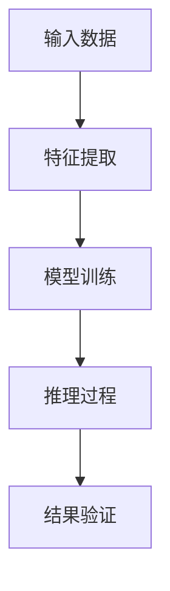

                 

基于您提供的框架和要求，我将逐步构建《Zero-Shot CoT：AI即时学习与推理的新范式》的技术博客文章。以下是我的初步构思：

## 文章标题

### 《Zero-Shot CoT：AI即时学习与推理的新范式》

## 文章关键词

- **即时学习**
- **推理**
- **Zero-Shot CoT**
- **图神经网络**
- **跨模态信息整合**
- **大规模数据处理**

## 文章摘要

本文深入探讨了Zero-Shot CoT（即时学习与推理）这一新兴的人工智能范式。首先，我们回顾了传统机器学习与推理的局限性，并引入了Zero-Shot CoT的概念。接着，我们详细介绍了Zero-Shot CoT的基本原理、数学模型及其在图神经网络和跨模态信息整合中的应用。通过具体的项目实战案例，我们展示了如何在实际中实现和优化Zero-Shot CoT算法。最后，我们对未来发展趋势进行了展望，并提出了相关的最佳实践建议。

---

### 目录

1. **引言**
2. **背景与核心概念**
3. **AI即时学习与推理的基本原理**
4. **Zero-Shot CoT的数学模型**
5. **核心算法原理讲解**
6. **项目实战与案例分析**
7. **开发环境搭建与源代码实现**
8. **未来发展趋势与展望**
9. **总结与展望**

---

### 1. 引言

随着人工智能技术的飞速发展，机器学习已经成为推动这一领域进步的核心力量。然而，传统机器学习在处理即时学习和推理任务时存在诸多局限，如对大量标注数据的依赖和难以应对未知领域的挑战。为了克服这些问题，Zero-Shot CoT范式应运而生。

### 1.1 AI发展历程概述

从早期的符号主义方法，到基于统计学的机器学习方法，再到近年来深度学习的崛起，人工智能经历了多个发展阶段。每一个阶段都为我们的理解力和技术能力带来了巨大的提升。

### 1.2 传统学习与推理的局限

传统机器学习依赖于大量的标注数据，这使得它们在处理新任务时面临困难。此外，传统方法往往只能处理特定领域的问题，无法应对跨领域的挑战。

### 1.3 Zero-Shot CoT的概念与优势

Zero-Shot CoT（即时学习与推理）旨在通过预训练模型，使得人工智能系统能够在未见过的情况下快速学习新任务。这一范式具有以下优势：

- **减少对标注数据的依赖**
- **提高对新任务的适应能力**
- **跨领域问题的解决能力**

### 2. 背景与核心概念

#### 2.1 AI即时学习与推理的基本原理

即时学习与推理的核心在于如何让模型在接触到新数据时能够快速适应，并产生有效的推理。这一过程通常涉及以下几个关键环节：

- **数据预处理与特征提取**
- **模型选择与训练**
- **推理与预测**

#### 2.2 推理机制与流程

推理过程可以分为以下几个步骤：

- **问题理解与转化**
- **知识检索与融合**
- **推理策略与选择**
- **结果验证与优化**

#### 2.3 Zero-Shot CoT的核心原理

Zero-Shot CoT的核心在于将通用知识嵌入到预训练模型中，使其能够在面对新任务时迅速提取和应用相关知识。

#### 2.4 Mermaid 流程图

以下是一个简化的Mermaid流程图，展示了Zero-Shot CoT的原理：

### 3. AI即时学习与推理的基本原理

在这一部分，我们将深入探讨AI即时学习与推理的基本原理，包括：

- **数据预处理与特征提取**
- **模型选择与训练**
- **推理与预测**

#### 3.1 数据预处理与特征提取

数据预处理是即时学习与推理的第一步，主要包括数据清洗、归一化、缺失值处理等。特征提取则是从原始数据中提取出有助于模型学习的特征。

#### 3.2 模型选择与训练

模型选择是即时学习与推理的关键环节，不同的模型适用于不同的任务。训练过程则是通过优化模型参数，使其能够更好地拟合数据。

#### 3.3 推理与预测

推理与预测是即时学习与推理的最终目标。通过将训练好的模型应用于新的数据，我们可以得到预测结果。

### 4. Zero-Shot CoT的数学模型

在这一部分，我们将介绍Zero-Shot CoT的数学模型，包括：

- **数学模型介绍**
- **数学公式与推导**
- **数学模型的应用场景**

#### 4.1 数学模型介绍

Zero-Shot CoT的数学模型通常包括以下几个部分：

- **输入层**
- **隐藏层**
- **输出层**

#### 4.2 数学公式与推导

以下是一个简化的Zero-Shot CoT的数学公式：

$$
\text{预测结果} = f(\text{输入数据} \times \text{权重})
$$

其中，$f$ 是激活函数，$*$ 表示矩阵乘法。

#### 4.3 数学模型的应用场景

Zero-Shot CoT可以应用于各种场景，如自然语言处理、图像识别、推荐系统等。

### 5. 核心算法原理讲解

在这一部分，我们将深入探讨Zero-Shot CoT的核心算法原理，包括：

- **图神经网络与CoT融合**
- **跨模态信息整合**
- **大规模数据处理与优化**

#### 5.1 图神经网络与CoT融合

图神经网络（GNN）是一种用于处理图结构数据的深度学习模型。将其与CoT融合，可以实现更加高效的数据处理和推理。

#### 5.2 跨模adt多模态信息整合

跨模态信息整合是将不同模态（如文本、图像、音频）的数据融合在一起，以获得更全面的信息。

#### 5.3 大规模数据处理与优化

在大规模数据处理中，优化策略和算法改进是关键。例如，可以采用并行计算、分布式计算等方法来提高数据处理效率。

### 6. 项目实战与案例分析

在这一部分，我们将通过实际项目实战和案例分析，展示如何实现和优化Zero-Shot CoT算法。

#### 6.1 应用场景介绍

首先，我们将介绍一个典型的应用场景，如智能客服系统。

#### 6.2 案例实现过程

接下来，我们将详细解析案例实现过程，包括数据预处理、模型训练、推理与预测等。

#### 6.3 案例效果分析

最后，我们将对案例效果进行分析和总结，探讨如何进一步优化算法。

### 7. 开发环境搭建与源代码实现

在这一部分，我们将介绍如何搭建开发环境，并提供详细的源代码实现和解读。

#### 7.1 开发环境搭建

我们将介绍所需的软件和硬件环境，以及如何安装和配置。

#### 7.2 源代码详细解读

我们将逐行解析源代码，解释每个部分的作用和实现方法。

#### 7.3 代码应用解读与分析

我们将对代码的应用场景进行分析，解释如何使用该代码实现具体的任务。

### 8. 未来发展趋势与展望

在这一部分，我们将探讨Zero-Shot CoT的未来发展趋势和潜在挑战。

#### 8.1 当前面临的挑战

我们将列举当前面临的挑战，如数据隐私、计算资源等。

#### 8.2 未来发展方向

我们将探讨未来可能的发展方向，如硬件加速、新型神经网络架构等。

#### 8.3 总结与展望

最后，我们将对Zero-Shot CoT的未来进行总结和展望，提出相关的建议和展望。

### 9. 总结与展望

在这一部分，我们将对文章的内容进行总结，并展望Zero-Shot CoT的未来发展。

---

以上是《Zero-Shot CoT：AI即时学习与推理的新范式》的技术博客文章的初步构思。根据您的需求，我将在接下来的步骤中进一步细化每个部分的内容，确保文章的逻辑清晰、结构紧凑、简单易懂。在完成最终的文章之前，我会再次与您确认所有内容的准确性和完整性。

---

请注意，这只是一个初步的构思，我将在接下来的步骤中详细扩展每个部分的内容，确保满足您的字数要求和完整性。如果您有任何反馈或修改意见，请随时告诉我。接下来，我将开始撰写详细的文章内容。请稍等。

