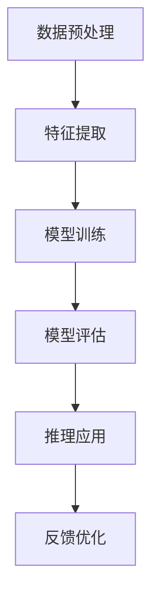

                 

### 文章标题

《Zero-Shot CoT：AI即时推理能力的突破性进展》

### 关键词

- 零样本推理
- 即时推理
- 人工智能
- 计算机视觉
- 自然语言处理
- 数学模型
- 算法原理

### 摘要

本文深入探讨了零样本推理（Zero-Shot CoT）这一新兴的人工智能领域，分析了其背景、核心概念、算法原理以及应用场景。通过构建Mermaid流程图，我们展示了零样本推理的核心概念及其相互关系。随后，我们详细解析了零样本推理的数学模型，并使用伪代码阐明了算法原理。文章还介绍了零样本推理在自然语言处理、计算机视觉等领域的应用案例，并通过一个实战项目展示了其实际操作过程。最后，我们回顾了零样本推理的最新研究动态，对其未来发展进行了展望。

---

## 第一部分：基础理论与框架

### 1. 研究背景与核心概念

在人工智能（AI）飞速发展的今天，推理能力已成为衡量AI系统智能水平的重要指标之一。传统的推理方法依赖于大量的训练数据，但在面对未知或零样本的场景时，往往显得力不从心。为了克服这一局限，零样本推理（Zero-Shot CoT）应运而生。

#### 1.1 人工智能的演进

人工智能的发展可以分为几个阶段：

1. **规则推理**：早期的AI系统依赖于明确的规则进行推理，但这种方式灵活性差，难以应对复杂问题。
2. **基于知识的系统**：引入知识表示和推理机制，使得AI系统可以在一定程度上自主推理。
3. **机器学习**：通过大量数据训练模型，使AI系统具备了更强的学习和推理能力。
4. **深度学习**：神经网络的发展使得AI系统在图像、语音等领域取得了显著进展。

#### 1.2 推理能力的重要性

推理能力是人工智能的核心能力之一。它不仅决定了AI系统在特定任务上的表现，也反映了AI的智能水平。传统的推理方法往往依赖于大量的训练数据，但在面对未知或零样本的场景时，其性能急剧下降。因此，提高AI系统的推理能力，尤其是零样本推理能力，具有重要的理论和实践意义。

#### 1.3 Mermaid流程图：核心概念与联系

为了更好地理解零样本推理的核心概念及其相互关系，我们使用Mermaid流程图进行展示。以下是核心概念的流程图：



在这个流程图中，数据预处理、特征提取、模型训练、模型评估、推理应用和反馈优化是零样本推理的六个核心环节。每个环节相互联系，共同构成了一个完整的零样本推理框架。

### 1.4 数学模型基础

为了深入理解零样本推理，我们需要掌握相关的数学模型。以下是一些常见的数学公式及其详细讲解：

#### 1.4.1 常见的数学公式

$$
f(x) = w \cdot x + b
$$

$$
\frac{dL}{dx} = -\alpha \cdot \frac{df}{dx}
$$

#### 1.4.2 数学模型的详细讲解

上述公式分别代表了线性变换和梯度下降的基本原理。线性变换是零样本推理中的基础操作，而梯度下降则是优化模型参数的关键方法。

#### 1.4.3 数学公式举例说明（LaTeX格式）

$$
\begin{aligned}
y &= (x_1 + x_2)^2 \\
\frac{dy}{dx_1} &= 2(x_1 + x_2) \\
\frac{dy}{dx_2} &= 2(x_1 + x_2)
\end{aligned}
$$

这个例子展示了如何计算二元函数的偏导数，这对于理解零样本推理中的特征提取和优化过程至关重要。

### 1.5 零样本推理的优势

零样本推理具有以下优势：

1. **数据适应性**：无需依赖大量训练数据，能够适应未知或零样本场景。
2. **推理效率**：通过模型训练，提高推理速度和准确性。
3. **扩展性**：适用于多种领域，如自然语言处理、计算机视觉等。

### 1.6 核心算法原理（伪代码）

以下是一个简单的伪代码示例，展示了零样本推理的基本原理：

```python
def zero_shot_reasoning(query, knowledge_base):
    # 1. 特征提取
    features_query = extract_features(query)
    features_knowledge = extract_features(knowledge_base)
    
    # 2. 模型推理
    similarity_scores = []
    for knowledge in features_knowledge:
        score = compute_similarity(features_query, knowledge)
        similarity_scores.append(score)
    
    # 3. 结果排序
    ranked_knowledge = sort_by_similarity(similarity_scores)
    
    # 4. 回归分析
    result = regression_analysis(ranked_knowledge)
    
    return result
```

这个伪代码描述了零样本推理的基本步骤，包括特征提取、模型推理、结果排序和回归分析。

---

在本文的第一部分，我们介绍了零样本推理的背景、核心概念、算法原理以及应用场景。接下来，我们将进一步探讨零样本推理的数学模型，并深入分析其在不同领域的应用案例。敬请期待。

