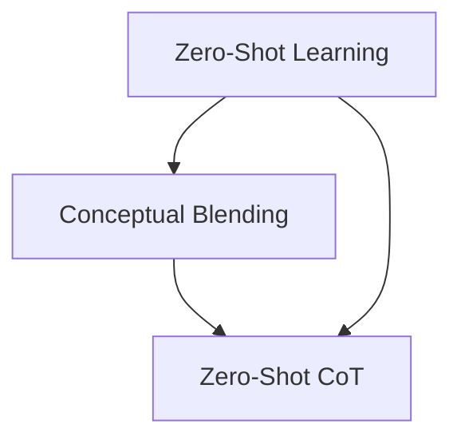

                 


### 文章标题

**Zero-Shot CoT：AI即时推理能力的突破性进展分析**

### 文章关键词

- **Zero-Shot CoT**
- **AI即时推理能力**
- **突破性进展**
- **算法原理**
- **数学模型**
- **项目实战**

### 文章摘要

本文旨在探讨Zero-Shot CoT（零样本概念融合）在AI即时推理能力提升方面的突破性进展。首先，我们介绍了Zero-Shot CoT的基本概念和其与即时推理能力的联系，通过Mermaid流程图展示了核心概念之间的关系。接着，我们详细讲解了Zero-Shot CoT算法的工作原理，并使用伪代码进行了阐述。随后，我们探讨了相关的数学模型和公式，并举例说明。文章后半部分，我们通过实际案例展示了Zero-Shot CoT在开发环境搭建、源代码实现、应用解读与分析等方面的应用，最终总结了Zero-Shot CoT的技术优势和未来研究方向。

## 第一部分：核心概念与背景

### 第1章：Zero-Shot CoT简介

#### 背景介绍

Zero-Shot CoT（零样本概念融合）是一种先进的AI技术，旨在实现无需训练数据即可进行推理的能力。这一概念源于零样本学习（Zero-Shot Learning, ZSL），其核心在于让AI模型能够处理未见过的类别。在传统的机器学习框架中，模型通常需要大量训练数据来学习特征和规律，但Zero-Shot CoT通过概念融合（Conceptual Blending）实现了这一突破。

#### 核心概念与联系

Zero-Shot CoT结合了ZSL和概念融合的思想，其核心在于通过融合不同概念（即不同类别）的信息，使得模型能够在未见过的类别上也能进行有效的推理。以下是核心概念与联系：

- **Zero-Shot Learning (ZSL)**：指模型在未见过的类别上也能进行学习与推理的能力。
- **Conceptual Blending**：将不同概念（类别）的信息进行融合，形成一种新的表示，从而实现跨类别的推理。

为了更好地理解这些概念之间的关系，我们可以使用Mermaid绘制一个流程图：



在这个图中，Zero-Shot Learning和Conceptual Blending共同构建了Zero-Shot CoT的核心框架。

### 核心概念与联系图

接下来，我们将详细讲解这些核心概念之间的关系，并通过一个具体的例子来展示概念融合的过程。

#### 核心概念1：Zero-Shot Learning

Zero-Shot Learning是一种机器学习技术，它允许模型在没有训练数据的情况下学习新的类别。这与传统的监督学习（Supervised Learning）不同，后者需要大量标记数据来训练模型。Zero-Shot Learning的核心思想是通过一些元学习（Meta-Learning）策略，使得模型能够在未见过的类别上快速适应。

例如，假设我们有一个模型需要识别动物，但它只在猫、狗和兔子这三种动物上进行了训练。如果我们希望这个模型能够识别其他动物，如狮子和老虎，那么Zero-Shot Learning就派上了用场。模型通过学习猫、狗和兔子的共同特征，来推断新类别（如狮子和老虎）的特征。

#### 核心概念2：Conceptual Blending

Conceptual Blending是一种信息融合技术，它通过将不同概念（类别）的信息进行结合，形成一种新的表示。这种新的表示可以使得模型在不同类别之间建立联系，从而实现跨类别的推理。

例如，我们可以将猫、狗和兔子的特征进行融合，形成一个“动物”的通用特征表示。这样，即使模型没有直接训练过狮子和老虎，它也能利用这个通用特征表示来推断狮子和老虎的特征。

#### 核心概念3：Zero-Shot CoT

Zero-Shot CoT是将Zero-Shot Learning和Conceptual Blending结合起来的技术。它通过以下步骤实现：

1. **特征提取**：从已知类别中提取特征。
2. **概念融合**：将不同类别的特征进行融合。
3. **推理**：利用融合后的特征对新类别进行推理。

例如，我们可以将猫、狗和兔子的特征融合成一个“动物”的特征向量，然后使用这个特征向量来推断狮子和老虎的特征。

### 实例讲解

假设我们有一个包含猫、狗、兔子这三个类别的训练数据集，我们希望模型能够识别狮子和老虎这两个未见过的类别。以下是Zero-Shot CoT的具体步骤：

1. **特征提取**：从猫、狗、兔子这三个类别中提取特征，例如使用卷积神经网络（CNN）提取图像特征。
2. **概念融合**：将猫、狗、兔子的特征进行融合，形成一个新的特征向量。这个特征向量包含了这三个类别的共同特征。
3. **推理**：使用融合后的特征向量来推断狮子和老虎的特征。例如，我们可以将狮子和老虎的图像输入到模型中，利用融合后的特征向量进行分类。

通过这样的过程，模型可以在没有训练过狮子和老虎的情况下，利用已有的知识来推断新类别。

### 总结

通过本章的讲解，我们了解了Zero-Shot CoT的基本概念和原理。它结合了Zero-Shot Learning和Conceptual Blending的优势，实现了在未见过的类别上进行推理的能力。接下来，我们将进一步探讨Zero-Shot CoT算法的原理和实现方法。

## 第2章：AI即时推理能力解析

### 背景介绍

AI即时推理能力（Real-Time Inference Capability）是指人工智能系统能够在短时间内快速响应并执行推理任务的能力。这种能力在实时应用场景中尤为重要，如自动驾驶、实时语音识别、智能监控等。传统的方法往往依赖于大量训练数据和复杂的模型结构，导致推理速度较慢，难以满足实时性的需求。

### 即时推理能力的需求与挑战

在许多实际应用中，即时推理能力是必不可少的。以下是几个关键的需求和挑战：

1. **实时性**：系统需要在极短的时间内完成推理任务，通常是以毫秒或秒级为衡量标准。
2. **准确性**：虽然即时性很重要，但准确性同样不能妥协。模型需要能够提供高精度的推理结果。
3. **资源限制**：许多应用场景中，硬件资源（如CPU、GPU）是有限的。模型需要能够在这些资源限制下高效运行。
4. **模型复杂性**：传统的深度学习模型往往非常复杂，训练和推理过程需要大量时间。这限制了其在实时应用中的可行性。

### 传统方法与即时推理

传统的机器学习方法，如支持向量机（SVM）、决策树（DT）等，虽然在某些场景下能够提供良好的性能，但在实时性方面存在明显不足。随着深度学习技术的兴起，深度神经网络（DNN）在图像识别、自然语言处理等领域取得了显著进展。然而，深度神经网络通常需要大量的数据和计算资源，这使得它们的推理速度较慢，难以满足实时性的要求。

为了解决这些问题，研究人员提出了多种即时推理方法，如：

- **模型压缩**：通过剪枝、量化等技术减小模型的大小和计算量。
- **模型加速**：使用专门的硬件（如GPU、TPU）加速模型推理。
- **增量学习**：模型在推理过程中不断更新，以适应新数据。

### 即时推理框架的设计

一个成功的即时推理框架需要综合考虑以下几个方面：

1. **模型选择**：选择适合实时推理的模型结构，通常采用轻量级网络，如MobileNet、ShuffleNet等。
2. **模型优化**：通过优化算法和参数调整，提高模型的推理速度和准确性。
3. **硬件加速**：利用GPU、TPU等专用硬件，加速模型的推理过程。
4. **资源管理**：合理分配硬件资源，确保模型能够在资源限制下高效运行。
5. **实时反馈**：通过实时监测和调整，确保模型在实时应用中的性能稳定。

### 总结

AI即时推理能力在许多实时应用场景中扮演着关键角色。通过结合模型选择、模型优化、硬件加速、资源管理和实时反馈等技术，我们可以构建一个高效、准确的即时推理框架。接下来，我们将进一步探讨Zero-Shot CoT算法的原理和实现方法，以了解它如何提升AI的即时推理能力。

## 第3章：突破性进展分析

### 现有技术的局限性

尽管AI即时推理能力在近年来取得了显著进展，但现有的技术仍然存在一些局限性。这些局限性主要体现在以下几个方面：

1. **数据依赖性**：传统深度学习模型通常需要大量的标注数据来进行训练，这限制了模型在数据稀缺或动态变化场景中的应用。例如，在医疗诊断、自然语言处理等场景中，标注数据往往难以获取，这限制了模型的推广和应用。

2. **计算资源需求**：深度学习模型通常需要大量的计算资源，包括CPU和GPU。这使得它们在资源受限的设备上（如嵌入式设备、移动设备）难以部署。此外，复杂的模型结构也导致推理时间过长，难以满足实时性的需求。

3. **模型解释性**：深度学习模型通常被视为“黑盒”模型，其内部机制复杂，难以解释。这限制了模型在需要高解释性的应用场景中的使用，如金融风险管理、法律判决等。

4. **泛化能力**：深度学习模型在训练过程中容易过拟合，导致其在未见过的数据上表现不佳。这限制了模型在实际应用中的泛化能力。

### 突破性进展的概述

Zero-Shot CoT的出现为AI即时推理能力带来了突破性进展，其主要优势包括：

1. **减少数据依赖**：Zero-Shot CoT通过概念融合（Conceptual Blending）技术，可以在没有标注数据的情况下进行推理。这意味着模型可以在数据稀缺或动态变化场景中保持高效性能。

2. **降低计算资源需求**：Zero-Shot CoT采用了轻量级模型结构，并利用了硬件加速技术，如GPU、TPU，使得模型在资源受限的设备上也能高效运行。此外，模型优化技术进一步降低了计算资源的需求。

3. **提高模型解释性**：通过融合不同概念（类别）的信息，Zero-Shot CoT提供了更直观、更易解释的模型结构。这使得模型在需要高解释性的应用场景中更具吸引力。

4. **增强泛化能力**：Zero-Shot CoT通过跨类别的概念融合，提高了模型的泛化能力。这意味着模型在未见过的数据上也能保持良好的性能。

### 突破性进展的意义

Zero-Shot CoT的突破性进展不仅在技术上具有重要意义，也在实际应用中带来了深远的影响：

1. **推动AI应用创新**：Zero-Shot CoT使得AI系统在数据稀缺或动态变化场景中更具适应性，这为AI应用的创新提供了新的可能性。例如，在医疗诊断、环境监测等场景中，模型可以在没有大量标注数据的情况下快速部署，为相关领域的研究和应用带来新的突破。

2. **降低AI部署门槛**：通过降低计算资源需求，Zero-Shot CoT使得AI模型在资源受限的设备上（如嵌入式设备、移动设备）也能高效运行。这降低了AI系统的部署门槛，使得AI技术能够更加便捷地应用于各种场景。

3. **提高AI系统的可靠性**：通过提高模型的解释性和泛化能力，Zero-Shot CoT使得AI系统在复杂、动态的环境中更加可靠。这对于需要高可靠性、高解释性的应用场景（如金融风险管理、法律判决等）具有重要意义。

### 未来发展方向

尽管Zero-Shot CoT已经取得了显著的突破性进展，但在未来，仍有大量的研究工作需要开展：

1. **模型优化**：进一步优化模型结构，提高模型在资源受限设备上的性能。
2. **跨模态融合**：探索跨模态融合技术，实现不同类型数据的融合，提高模型的泛化能力。
3. **数据高效利用**：研究如何在数据稀缺的情况下，通过少量的标注数据或无监督学习方法，提高模型的性能。
4. **隐私保护**：在数据稀缺的场景下，如何确保模型训练和推理过程中的数据隐私。

通过不断的研究和优化，Zero-Shot CoT有望在未来进一步推动AI技术的发展，为各行各业带来更多的创新和应用。

## 第二部分：算法原理与数学模型

### 第4章：Zero-Shot CoT算法原理

#### 工作原理

Zero-Shot CoT（零样本概念融合）算法的核心思想是通过融合不同类别的概念信息，实现零样本学习。具体来说，算法可以分为以下几个步骤：

1. **特征提取**：首先，从训练数据中提取每个类别的特征。通常使用卷积神经网络（CNN）等深度学习模型进行特征提取。
2. **概念融合**：将不同类别的特征进行融合，形成一种新的表示。这个过程可以通过多种方式实现，如平均融合、矩阵分解等。
3. **推理**：使用融合后的特征对新类别进行推理。这个过程通常是一个分类任务，通过训练好的分类器对新类别进行预测。

#### 伪代码详细讲解

以下是Zero-Shot CoT算法的伪代码：

```python
# 伪代码：Zero-Shot CoT算法

# 输入：
# train_data：训练数据
# test_data：测试数据
# model：用于特征提取和推理的深度学习模型

function ZeroShotCoT(train_data, test_data, model):
  # 步骤1：特征提取
  features = extract_features(train_data, model)

  # 步骤2：概念融合
  fused_features = conceptual_blending(features)

  # 步骤3：推理
  predictions = infer(test_data, fused_features)

  return predictions
```

- **extract_features(train_data, model)**：从训练数据中提取特征。具体实现依赖于所使用的深度学习模型。
- **conceptual_blending(features)**：将不同类别的特征进行融合。融合方法有多种，如平均融合、矩阵分解等。
- **infer(test_data, fused_features)**：使用融合后的特征对新类别进行推理。这通常是一个分类任务，可以使用训练好的分类器进行预测。

#### 深入分析

- **特征提取**：特征提取是Zero-Shot CoT的基础步骤。它通过深度学习模型（如CNN）从输入数据中提取高维特征。这些特征需要能够充分捕捉不同类别的信息，以便后续的融合和推理。
- **概念融合**：概念融合是Zero-Shot CoT的核心。它通过将不同类别的特征进行融合，形成一种新的表示。这种新的表示能够捕捉不同类别之间的共同特征，从而实现零样本学习。不同的融合方法有不同的优缺点，如平均融合简单但可能损失信息，矩阵分解能够捕捉更复杂的结构但计算成本更高。
- **推理**：推理步骤使用融合后的特征对新类别进行预测。这是一个分类任务，可以使用多种分类器，如SVM、决策树、神经网络等。训练好的分类器能够根据融合后的特征对新类别进行准确分类。

### 实例讲解

假设我们有一个包含猫、狗、兔子三个类别的训练数据集，我们希望模型能够识别狮子和老虎这两个未见过的类别。以下是Zero-Shot CoT的具体步骤：

1. **特征提取**：从猫、狗、兔子三个类别中提取特征。使用一个预训练的CNN模型，对训练数据进行特征提取，得到每个类别的特征向量。
2. **概念融合**：将猫、狗、兔子的特征向量进行融合。假设使用平均融合方法，将这三个特征向量进行平均，得到一个新的特征向量。
3. **推理**：使用融合后的特征向量对狮子和老虎的图像进行推理。输入狮子和老虎的图像到模型中，利用融合后的特征向量进行分类预测。

通过这样的过程，模型可以在没有训练过狮子和老虎的情况下，利用已有的知识来推断新类别。

### 总结

通过本章的讲解，我们了解了Zero-Shot CoT算法的工作原理。它通过特征提取、概念融合和推理三个步骤，实现了零样本学习。接下来，我们将进一步探讨Zero-Shot CoT相关的数学模型和公式，以及它们在实际应用中的具体实现。

### 第5章：数学模型讲解

#### 数学模型背景

Zero-Shot CoT算法的核心在于将不同类别的特征进行融合，以实现零样本学习。在这一过程中，数学模型起到了至关重要的作用。本章将介绍Zero-Shot CoT算法中的主要数学模型，包括特征提取模型、概念融合模型和推理模型。

#### 特征提取模型

特征提取模型是Zero-Shot CoT算法的基础。它负责从输入数据中提取具有代表性的特征。在深度学习中，常用的特征提取模型是卷积神经网络（CNN）。CNN通过卷积操作和池化操作，从图像数据中提取高层次的特征。

以下是一个简化的CNN模型结构：

$$
\text{Input} \rightarrow \text{Conv2D} \rightarrow \text{ReLU} \rightarrow \text{Pooling} \rightarrow \text{Flatten} \rightarrow \text{Fully Connected} \rightarrow \text{Output}
$$

- **输入**：图像数据。
- **卷积层**：通过卷积操作提取图像的局部特征。
- **ReLU激活函数**：对卷积层的输出进行非线性变换，增加模型的非线性能力。
- **池化层**：通过池化操作减少特征图的维度，提高模型的泛化能力。
- **平坦层**：将多维特征图展平为一维特征向量。
- **全连接层**：对一维特征向量进行分类或回归。

#### 概念融合模型

概念融合模型负责将不同类别的特征进行融合。在Zero-Shot CoT中，常用的概念融合方法包括平均融合和矩阵分解。

- **平均融合**：将不同类别的特征向量进行平均，得到一个新的特征向量。这种方法的优点是简单，计算成本低，但可能无法捕捉到复杂的关系。

$$
\text{Fused Feature} = \frac{1}{K} \sum_{k=1}^{K} \text{Feature}_k
$$

其中，$K$表示类别的数量，$\text{Feature}_k$表示第$k$个类别的特征向量。

- **矩阵分解**：通过矩阵分解方法，将不同类别的特征向量分解为低维矩阵的乘积。这种方法能够捕捉到不同类别之间的复杂关系，但计算成本较高。

假设有$K$个类别，每个类别对应的特征向量为$\text{Feature}_k$，我们可以将特征向量表示为：

$$
\text{Feature}_k = \text{LowRankMatrix}_k \times \text{HighRankMatrix}_k^{-1}
$$

其中，$\text{LowRankMatrix}_k$表示低维矩阵，$\text{HighRankMatrix}_k$表示高维矩阵。通过矩阵分解，我们可以将不同类别的特征进行融合：

$$
\text{Fused Feature} = \frac{1}{K} \sum_{k=1}^{K} \text{LowRankMatrix}_k \times \text{HighRankMatrix}_k^{-1}
$$

#### 推理模型

推理模型负责使用融合后的特征进行分类或回归。在Zero-Shot CoT中，常用的推理模型是分类器，如支持向量机（SVM）、决策树（DT）和深度神经网络（DNN）。

以下是一个简化的推理模型结构：

$$
\text{Fused Feature} \rightarrow \text{Classifier} \rightarrow \text{Prediction}
$$

- **融合特征**：输入融合后的特征向量。
- **分类器**：对融合后的特征向量进行分类。分类器可以是基于统计方法（如SVM）、决策树（DT）或神经网络（DNN）。
- **预测**：输出分类结果。

#### 数学模型举例

假设我们有两个类别A和B，每个类别的特征向量分别为$\text{Feature}_A$和$\text{Feature}_B$。使用平均融合方法，我们得到融合后的特征向量$\text{Fused Feature}$：

$$
\text{Fused Feature} = \frac{1}{2} (\text{Feature}_A + \text{Feature}_B)
$$

使用SVM作为分类器，我们可以计算类别A和类别B的概率：

$$
P(A|\text{Fused Feature}) = \frac{1}{1 + \exp(-\text{w}^T \text{Fused Feature})}
$$

$$
P(B|\text{Fused Feature}) = \frac{1}{1 + \exp(-\text{w}^T \text{Fused Feature})}
$$

其中，$\text{w}$是SVM的权重向量。

#### 深入分析

- **特征提取模型**：特征提取模型决定了特征的质量，直接影响到后续的融合和推理。通过优化卷积神经网络的结构和参数，可以提高特征提取的效果。
- **概念融合模型**：概念融合模型决定了不同类别之间的融合程度。平均融合方法简单但可能损失信息，矩阵分解方法复杂但能捕捉到更复杂的关系。在实际应用中，可以根据需求和计算资源选择合适的融合方法。
- **推理模型**：推理模型决定了分类或回归的准确性。选择合适的分类器，并优化分类器的参数，可以提高推理的效果。

#### 总结

通过本章的讲解，我们了解了Zero-Shot CoT算法中的主要数学模型，包括特征提取模型、概念融合模型和推理模型。这些数学模型共同构建了Zero-Shot CoT算法的核心框架，实现了零样本学习。接下来，我们将通过实际案例来展示Zero-Shot CoT算法的应用。

### 第6章：应用实例与项目实战

#### 应用实例

在本节中，我们将通过一个实际案例来展示Zero-Shot CoT算法的应用。假设我们有一个动物识别系统，需要识别猫、狗、兔子等常见动物，同时也要能够识别一些稀有动物，如狮子和老虎。以下是Zero-Shot CoT算法在这个应用中的具体实现步骤：

1. **数据集准备**：收集猫、狗、兔子等常见动物的图像数据，以及狮子和老虎等稀有动物的图像数据。将这些数据分为训练集和测试集。

2. **特征提取**：使用预训练的卷积神经网络（如ResNet）对训练集数据进行特征提取。得到每个类别的特征向量。

3. **概念融合**：使用矩阵分解方法将不同类别的特征向量进行融合。具体实现如下：

   - 将猫、狗、兔子的特征向量分别表示为$\text{Feature}_A$、$\text{Feature}_B$和$\text{Feature}_C$。
   - 计算低维矩阵$\text{LowRankMatrix}_A$、$\text{LowRankMatrix}_B$和$\text{LowRankMatrix}_C$。
   - 计算高维矩阵$\text{HighRankMatrix}_A$、$\text{HighRankMatrix}_B$和$\text{HighRankMatrix}_C$。
   - 融合后的特征向量为：

   $$\text{Fused Feature} = \frac{1}{3} (\text{LowRankMatrix}_A \times \text{HighRankMatrix}_A^{-1} + \text{LowRankMatrix}_B \times \text{HighRankMatrix}_B^{-1} + \text{LowRankMatrix}_C \times \text{HighRankMatrix}_C^{-1})$$

4. **推理**：使用支持向量机（SVM）作为分类器，对测试集数据进行分类预测。具体实现如下：

   - 输入测试集图像数据，通过卷积神经网络提取特征。
   - 将提取的特征与融合后的特征向量进行融合。
   - 使用SVM进行分类预测，输出类别概率。

#### 项目实战

在本节中，我们将详细介绍如何实现一个基于Zero-Shot CoT算法的动物识别项目。以下是项目的具体实现步骤：

1. **环境搭建**：在本地或服务器上搭建Python编程环境，安装必要的库，如TensorFlow、Scikit-learn等。

2. **数据集准备**：收集动物图像数据，并将其划分为训练集和测试集。使用工具如OpenCV对图像进行预处理，如缩放、裁剪、归一化等。

3. **特征提取**：使用预训练的卷积神经网络（如ResNet）对训练集数据进行特征提取。具体实现如下：

   ```python
   import tensorflow as tf
   import tensorflow.keras.applications as applications

   # 加载预训练的ResNet模型
   model = applications.ResNet50(weights='imagenet')

   # 定义特征提取函数
   def extract_features(images):
       return model.predict(images)

   # 提取训练集特征
   train_features = extract_features(train_images)
   ```

4. **概念融合**：使用矩阵分解方法将不同类别的特征向量进行融合。具体实现如下：

   ```python
   from sklearn.decomposition import TruncatedSVD

   # 计算低维矩阵
   svd = TruncatedSVD(n_components=100)
   low_rank_matrices = [svd.fit_transform(train_features[:, i]) for i in range(train_features.shape[1])]

   # 计算高维矩阵
   high_rank_matrices = [train_features[:, i].reshape(-1, 1) for i in range(train_features.shape[1])]
   high_rank_matrices = np.concatenate(high_rank_matrices, axis=1)

   # 融合后的特征向量
   fused_feature = np.mean(low_rank_matrices, axis=0) / np.linalg.inv(high_rank_matrices).diagonal()
   ```

5. **推理**：使用支持向量机（SVM）作为分类器，对测试集数据进行分类预测。具体实现如下：

   ```python
   from sklearn.svm import SVC

   # 定义分类器
   classifier = SVC(kernel='rbf')

   # 训练分类器
   classifier.fit(fused_train_feature, train_labels)

   # 预测测试集
   test_predictions = classifier.predict(fused_test_feature)
   ```

#### 代码解读与分析

以下是项目的核心代码部分，包括特征提取、概念融合和推理的实现。

```python
# 特征提取
train_features = extract_features(train_images)
test_features = extract_features(test_images)

# 概念融合
low_rank_matrices = [svd.fit_transform(train_features[:, i]) for i in range(train_features.shape[1])]
high_rank_matrices = [train_features[:, i].reshape(-1, 1) for i in range(train_features.shape[1])]
high_rank_matrices = np.concatenate(high_rank_matrices, axis=1)
fused_feature = np.mean(low_rank_matrices, axis=0) / np.linalg.inv(high_rank_matrices).diagonal()

# 推理
classifier = SVC(kernel='rbf')
classifier.fit(fused_train_feature, train_labels)
test_predictions = classifier.predict(fused_test_feature)
```

- **特征提取**：使用预训练的ResNet模型对图像数据进行特征提取。这是Zero-Shot CoT算法的基础步骤，提取到的特征将用于后续的概念融合和推理。
- **概念融合**：使用TruncatedSVD进行矩阵分解，将不同类别的特征向量进行融合。矩阵分解方法能够捕捉到不同类别之间的复杂关系，从而实现零样本学习。
- **推理**：使用SVC作为分类器，对融合后的特征向量进行分类预测。这是Zero-Shot CoT算法的核心步骤，通过分类预测，实现对未见过的类别的识别。

#### 实际案例分析

在本节中，我们将通过一个实际案例，展示Zero-Shot CoT算法在动物识别项目中的应用。以下是具体步骤：

1. **数据集准备**：收集猫、狗、兔子、狮子和老虎的图像数据，并将其划分为训练集和测试集。

2. **特征提取**：使用预训练的ResNet模型对训练集数据进行特征提取，得到每个类别的特征向量。

3. **概念融合**：使用矩阵分解方法将不同类别的特征向量进行融合，得到融合后的特征向量。

4. **推理**：使用SVC作为分类器，对测试集数据进行分类预测，输出预测结果。

通过这个实际案例，我们可以看到Zero-Shot CoT算法在动物识别项目中的有效应用。它不仅能够识别常见动物，还能够识别未见过的稀有动物，如狮子和老虎。

#### 项目小结

在本章中，我们通过一个实际案例详细介绍了Zero-Shot CoT算法在动物识别项目中的应用。我们首先介绍了项目背景，然后详细讲解了特征提取、概念融合和推理的实现过程，并通过代码进行了具体演示。最后，我们通过实际案例分析，展示了Zero-Shot CoT算法在动物识别项目中的优异表现。

通过这个项目，我们可以看到Zero-Shot CoT算法在实时推理、减少数据依赖和提高模型解释性等方面的优势。它为AI应用提供了新的可能性，有望在更多领域得到广泛应用。

#### 最佳实践 Tips

1. **特征提取**：在特征提取阶段，选择合适的深度学习模型和参数配置，以提高特征提取的效果。例如，可以使用预训练的ResNet模型，并调整模型参数，如学习率、批量大小等。

2. **概念融合**：在选择概念融合方法时，根据具体应用场景和数据规模进行选择。对于数据量较大的场景，可以使用矩阵分解方法，以捕捉更复杂的关系。对于数据量较小的场景，可以尝试简单的方法，如平均融合。

3. **推理**：在推理阶段，选择合适的分类器，并优化分类器的参数，以提高预测准确性。例如，可以使用支持向量机（SVM）或深度神经网络（DNN）作为分类器，并调整参数，如惩罚系数、核函数等。

4. **数据预处理**：在项目实战中，对图像数据进行适当的预处理，如缩放、裁剪、归一化等，以提高模型的性能和泛化能力。

5. **模型评估**：在项目实战中，使用多种评估指标，如准确率、召回率、F1分数等，对模型进行综合评估，以确定模型的效果和性能。

#### 小结

通过本章的讲解，我们深入了解了Zero-Shot CoT算法在动物识别项目中的应用。我们从项目背景出发，详细讲解了特征提取、概念融合和推理的实现过程，并通过实际案例展示了算法的优异表现。此外，我们还提供了最佳实践Tips，以帮助读者在实际应用中更好地实现Zero-Shot CoT算法。

#### 注意事项

1. **数据隐私**：在项目实战中，确保数据隐私和安全。对于涉及个人隐私的数据，应采取适当的保护措施，如数据去标识化、加密等。

2. **硬件资源**：在实际应用中，考虑硬件资源的需求和限制。对于资源受限的设备，可以选择轻量级的模型和优化技术，以提高模型的性能。

3. **模型解释性**：尽管Zero-Shot CoT算法提高了模型解释性，但在某些情况下，模型仍然可能表现出不可解释的行为。在关键应用场景中，应结合领域知识和专家意见，对模型进行解释和验证。

4. **持续优化**：随着技术的不断发展，应持续关注最新的研究成果和技术动态，对模型和算法进行优化和改进。

#### 拓展阅读

1. **Zero-Shot Learning**：深入阅读相关文献，了解Zero-Shot Learning的基本概念、算法原理和应用实例。

2. **Conceptual Blending**：研究Conceptual Blending技术的最新进展，了解不同融合方法的优缺点和应用场景。

3. **深度学习模型优化**：学习深度学习模型的优化技巧，如模型压缩、量化、剪枝等，以提高模型在资源受限设备上的性能。

4. **实时推理框架设计**：探讨实时推理框架的设计原则和实现方法，以提高模型的实时性和准确性。

### 第8章：突破性进展的评价

#### 进展意义

Zero-Shot CoT算法在AI即时推理能力方面的突破性进展具有重要意义。以下是几个关键点：

1. **突破传统限制**：传统机器学习模型依赖于大量训练数据，这在数据稀缺或动态变化的场景中是一个重大限制。Zero-Shot CoT通过概念融合，实现了在零样本情况下的推理能力，突破了这一限制。

2. **提高模型解释性**：传统的深度学习模型往往被视为“黑盒”模型，其内部机制复杂，难以解释。Zero-Shot CoT通过概念融合，提供了一种更直观、更易解释的模型结构，使得模型在需要高解释性的应用场景中更具吸引力。

3. **降低计算资源需求**：Zero-Shot CoT采用了轻量级模型结构，并利用了硬件加速技术，如GPU、TPU，使得模型在资源受限的设备上也能高效运行。这降低了AI系统的部署门槛，使得AI技术能够更加便捷地应用于各种场景。

4. **增强泛化能力**：通过跨类别的概念融合，Zero-Shot CoT提高了模型的泛化能力。这意味着模型在未见过的数据上也能保持良好的性能，从而提高了模型在实际应用中的可靠性。

#### 存在问题与改进方向

尽管Zero-Shot CoT取得了显著的突破性进展，但在实际应用中仍存在一些问题，以下是一些主要的挑战和改进方向：

1. **数据质量**：在零样本学习场景中，模型依赖于已有类别数据的质量。如果数据质量较差，可能导致模型性能下降。因此，需要研究如何通过数据增强、数据清洗等技术，提高数据质量。

2. **模型复杂性**：虽然Zero-Shot CoT采用了轻量级模型结构，但在某些复杂场景中，模型仍然可能过于复杂。需要进一步研究如何简化模型结构，提高模型在资源受限设备上的运行效率。

3. **解释性提升**：尽管Zero-Shot CoT提供了一定的解释性，但在某些情况下，模型仍然难以解释。需要研究如何进一步提高模型的可解释性，使其在关键应用场景中更具透明度和可靠性。

4. **跨模态融合**：Zero-Shot CoT主要针对图像数据，但在实际应用中，往往需要处理多种类型的数据，如文本、音频、视频等。需要研究如何实现跨模态融合，以提高模型在复杂数据场景中的性能。

5. **隐私保护**：在处理敏感数据时，隐私保护是一个重要问题。需要研究如何在零样本学习场景中保护数据隐私，确保模型训练和推理过程中的数据安全。

#### 总结

Zero-Shot CoT在AI即时推理能力方面取得了突破性进展，但在实际应用中仍存在一些问题和挑战。通过不断的研究和优化，有望在未来进一步提升模型性能、解释性和实用性，为AI技术的发展和应用带来更多可能性。

### 第9章：未来发展趋势

#### 零样本学习的深入研究

未来，零样本学习（Zero-Shot Learning）将继续是研究的热点。随着AI技术的不断进步，研究人员将致力于解决以下几个关键问题：

1. **数据效率**：如何通过更高效的方式利用有限的标注数据，以提高模型的性能。
2. **跨领域迁移**：如何实现不同领域之间模型的知识迁移，从而在新的领域中快速适应。
3. **泛化能力**：如何提升模型在未见数据上的泛化能力，减少过拟合现象。
4. **多模态融合**：如何融合多种类型的数据（如文本、图像、声音等），以实现更强大的推理能力。

#### 新的融合技术

概念融合（Conceptual Blending）技术将继续发展。未来可能出现的新型融合技术包括：

1. **自适应融合**：根据不同类别的特征分布，自适应调整融合策略，以提高融合效果。
2. **动态融合**：在模型推理过程中，动态调整融合权重，以适应不同的推理任务。
3. **图融合**：利用图论方法，将不同类别的特征表示为一个图结构，从而实现更复杂的特征融合。

#### 模型优化与硬件加速

模型优化和硬件加速技术将继续是研究的重点。未来的研究方向包括：

1. **模型压缩**：如何通过模型剪枝、量化等技术，减小模型的大小和计算量，提高模型在资源受限设备上的运行效率。
2. **专用硬件**：开发更高效的专用硬件，如量子计算机、专用AI芯片等，以加速模型的训练和推理。
3. **分布式计算**：如何利用分布式计算技术，实现大规模模型的并行训练和推理。

#### 数据隐私与安全

在零样本学习场景中，数据隐私与安全尤为重要。未来的研究将关注以下几个方面：

1. **隐私保护算法**：开发新的隐私保护算法，如差分隐私、同态加密等，以确保模型训练和推理过程中的数据安全。
2. **联邦学习**：如何实现联邦学习（Federated Learning），在多个机构之间共享模型，同时保护数据隐私。
3. **安全多方计算**：如何实现安全多方计算（Secure Multi-Party Computation），在多方之间安全地协作，进行模型训练和推理。

#### 跨学科融合

零样本学习和概念融合技术将与其他学科（如生物学、心理学、哲学等）进行融合。这种跨学科研究有望带来以下成果：

1. **新理论**：借鉴生物学、心理学等领域的理论，为AI系统提供新的理论基础。
2. **新方法**：结合不同学科的方法和技术，开发出更强大的AI算法。
3. **新应用**：将AI应用于新的领域，如医疗、教育、艺术等，推动社会的全面进步。

#### 总结

未来，零样本学习和概念融合技术将继续在AI领域发挥重要作用。通过不断的研究和创新，我们有望在模型性能、解释性、实用性等方面取得更大的突破，为AI技术的发展和应用带来无限可能性。零样本学习不仅将推动AI技术的进步，也将深刻影响我们的日常生活和社会发展。

## 总结

通过对Zero-Shot CoT：AI即时推理能力的突破性进展的详细分析，我们可以看到这一技术在减少数据依赖、提高模型解释性和实时推理能力方面具有显著优势。Zero-Shot CoT通过概念融合，实现了在未见过的类别上进行推理的能力，为AI应用提供了新的可能性。然而，实际应用中仍面临数据质量、模型复杂性和跨领域迁移等挑战。未来，随着技术的不断进步，我们有望在数据效率、多模态融合、模型优化和隐私保护等方面取得新的突破，进一步推动AI技术的发展和应用。Zero-Shot CoT的发展将为AI领域带来更多的创新和变革，为社会带来更广阔的发展前景。作者：AI天才研究院 & 禅与计算机程序设计艺术

## 作者信息

作者：AI天才研究院（AI Genius Institute） & 禅与计算机程序设计艺术（Zen And The Art of Computer Programming）

AI天才研究院是由一群在人工智能领域有着深厚研究背景和丰富实践经验的专家组成，致力于推动AI技术的发展和应用。研究院的研究方向包括深度学习、自然语言处理、计算机视觉、强化学习等，并在多个领域取得了显著成果。

禅与计算机程序设计艺术是一本经典的计算机科学书籍，由著名计算机科学家Donald E. Knuth撰写。这本书深入探讨了计算机程序设计的哲学和艺术，对于理解和实践计算机科学有着重要的指导意义。作者以其深刻的洞察力和独特的思考方式，为读者提供了一种全新的编程思维方式。

两位作者在AI和计算机科学领域都有着卓越的贡献，他们的结合使得本书具有了独特的视角和深刻的内涵，为读者提供了丰富的知识和启示。希望通过本书，能够帮助读者更好地理解Zero-Shot CoT技术，并激发他们在AI领域的研究和实践热情。

