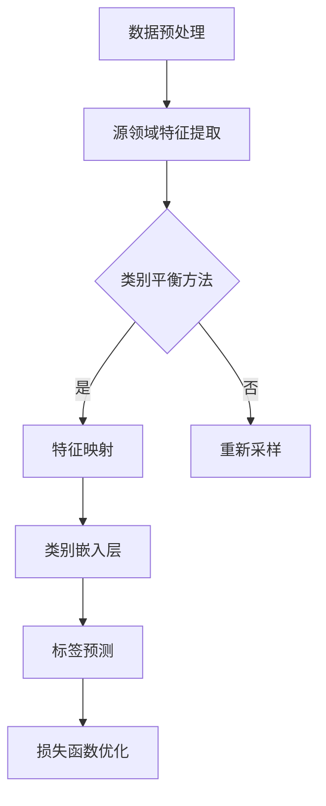
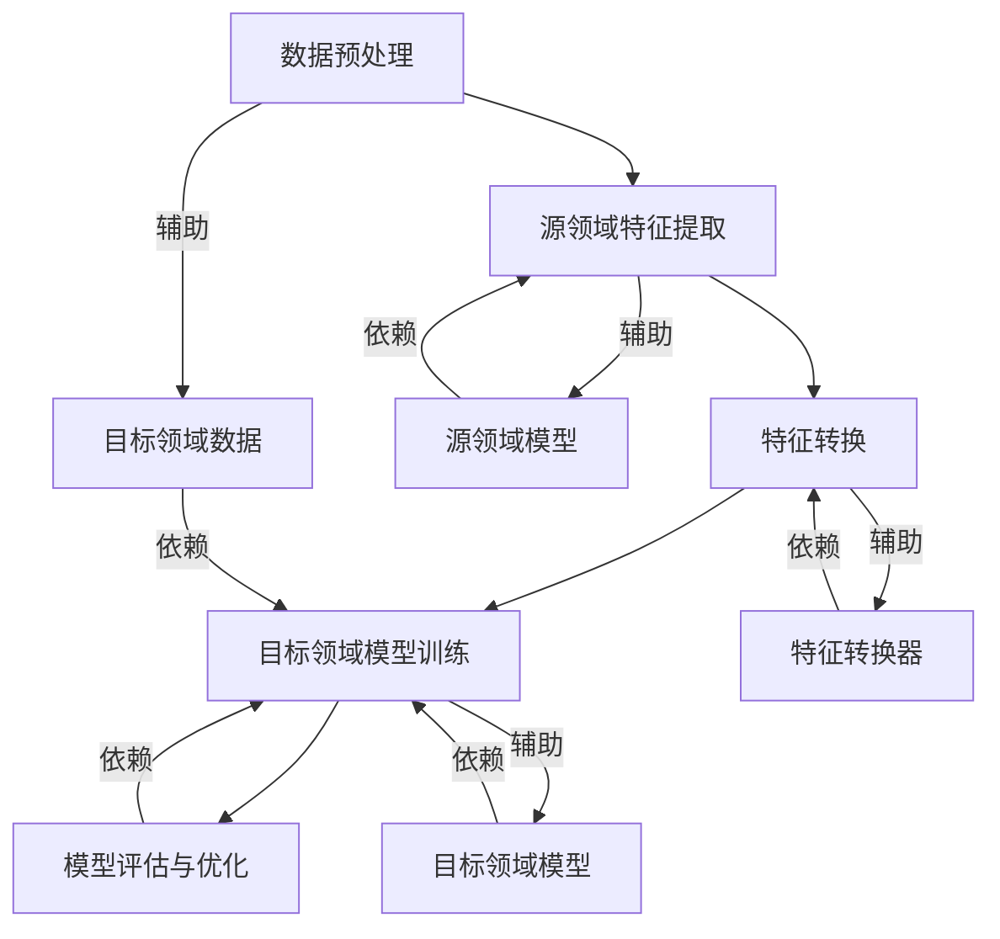

                 

### 文章标题：Zero-Shot CoT：AI跨域迁移学习的创新探索与实践

#### 关键词：
- 零样本转移（Zero-Shot Transfer）
- 跨域迁移学习（Cross-Domain Transfer Learning）
- 人工智能（Artificial Intelligence）
- 迁移学习（Transfer Learning）
- 创新方法（Innovative Methods）
- 实践案例（Practical Cases）

#### 摘要：
本文探讨了零样本转移（Zero-Shot Transfer）在人工智能（AI）跨域迁移学习中的应用。首先，我们介绍了零样本转移的基本概念和原理，并深入分析了其在迁移学习中的独特优势。接着，我们通过一个Mermaid流程图展示了核心概念之间的关系架构，并使用伪代码详细讲解了零样本转移算法的原理。随后，我们探讨了零样本转移的创新方法，并列举了具体的数学模型和公式。在实践案例部分，我们详细分析了几个跨领域应用场景，提供了实战技巧和案例分析。最后，我们总结了零样本转移的未来发展前景，并提出了对研究的展望。

### 第1章 引言

#### 1.1 书籍背景与目的

人工智能（AI）的发展已经渗透到社会的各个领域，从医疗到金融，从教育到娱乐，AI技术的应用不断拓展。然而，AI模型的训练通常需要大量的标注数据，这在某些特定领域或场景下可能难以获取。为了解决这一问题，迁移学习（Transfer Learning）被提了出来。迁移学习利用在源领域（source domain）上预训练的模型，将其知识迁移到目标领域（target domain），从而提高目标领域模型的性能和泛化能力。

零样本转移（Zero-Shot Transfer）是迁移学习的一个重要分支，它在目标领域没有任何标注数据的情况下，仍然能够实现模型的迁移。零样本转移的关键在于如何利用源领域中的知识来预测目标领域中的标签。这种技术在一些特定场景下具有明显的优势，例如，当目标领域的数据与源领域的数据分布差异较大时，或者目标领域的数据获取成本非常高时。

本书的目的是探讨零样本转移在AI跨域迁移学习中的应用，通过理论分析和实践案例，深入理解零样本转移的原理、创新方法和实际应用。本书不仅涵盖了基础理论，还包括了最新的研究成果和应用实例，旨在为研究人员和实践者提供全面的指导。

#### 1.2 书籍结构概述

本书共分为七个章节，结构如下：

- **第1章 引言**：介绍书籍的背景、目的和结构。
- **第2章 零样本转移基础**：介绍零样本转移的基本概念、原理和数学模型。
- **第3章 AI跨域迁移学习框架**：分析零样本转移在AI跨域迁移学习中的框架和流程。
- **第4章 创新方法**：探讨零样本转移的创新方法和最新的研究进展。
- **第5章 实践案例**：通过具体案例展示零样本转移在实际应用中的效果。
- **第6章 未来展望与挑战**：分析零样本转移的未来发展前景和面临的挑战。
- **第7章 总结**：总结本书的主要结论和未来研究方向。

本书的目标是为读者提供一份系统、全面的关于零样本转移在AI跨域迁移学习中的研究和实践指南，帮助读者深入理解这一领域，并能够在实际项目中应用这些技术。

### 第2章 零样本转移基础

#### 2.1 零样本转移概念

零样本转移（Zero-Shot Transfer）是一种迁移学习方法，它允许模型在没有目标领域（target domain）的标注数据的情况下进行学习。与传统的迁移学习不同，传统的迁移学习需要大量的标注数据来训练目标领域的模型，而零样本转移则利用源领域（source domain）上的预训练模型来预测目标领域中的标签。

在零样本转移中，源领域和目标领域的特征空间通常是不同的，甚至可能是完全独立的。因此，如何将源领域中的知识有效地迁移到目标领域，是实现零样本转移的关键挑战。零样本转移的核心思想是通过跨领域的知识表示和标签预测机制，使得模型能够在没有直接标注数据的情况下，仍然能够对目标领域中的新数据进行合理的预测。

#### 2.2 零样本转移原理

零样本转移的原理主要涉及以下几个方面：

1. **跨领域知识表示**：为了实现知识迁移，需要将源领域和目标领域的数据映射到同一个特征空间中。这通常需要使用一些预训练模型，如词向量模型（如Word2Vec、GloVe）或图神经网络（如Graph Convolutional Network，GCN），来提取数据的特征表示。

2. **类别平衡方法**：在零样本转移中，类别平衡是一个重要的问题。由于源领域和目标领域的标签分布可能不同，需要采用一些方法来平衡类别，使得模型在训练过程中不会偏斜某一类别。

3. **标签预测机制**：在零样本转移中，模型需要预测目标领域中的标签。这通常通过使用一种特殊的嵌入层来实现，该嵌入层将源领域中的类别映射到目标领域中的标签。

#### 2.3 相关数学模型

在零样本转移中，常用的数学模型包括：

1. **源领域特征提取模型**：通常使用预训练的深度神经网络（DNN）来提取源领域数据的特征。例如，可以使用一个预训练的卷积神经网络（CNN）来提取图像特征。

2. **特征映射函数**：将源领域特征映射到目标领域特征空间。这通常通过一个线性变换来实现。

3. **类别嵌入层**：将源领域的类别映射到目标领域的标签。这通常使用一个嵌入矩阵来实现。

4. **损失函数**：用于优化模型参数。在零样本转移中，常用的损失函数是交叉熵损失函数。

#### 2.4 Mermaid流程图：核心概念与联系

为了更好地理解零样本转移的核心概念和联系，我们可以使用Mermaid流程图来展示整个迁移学习过程。以下是零样本转移的Mermaid流程图：



在这个流程图中，我们首先对源领域和目标领域的数据进行预处理，然后使用预训练模型提取源领域特征。接下来，通过类别平衡方法来处理类别不平衡的问题。如果需要，我们还可以使用重新采样方法来进一步平衡类别。然后，我们将源领域特征映射到目标领域特征空间，并使用类别嵌入层将类别映射到标签。最后，通过标签预测和损失函数优化来训练模型。

#### 2.5 零样本转移算法原理

零样本转移算法的原理可以通过以下伪代码来详细阐述：

```python
# 输入：源领域数据 X_s，目标领域数据 X_t，类别标签 Y_s，目标领域标签 Y_t
# 输出：训练好的零样本转移模型

# 1. 数据预处理
X_s, X_t = preprocess_data(X_s, X_t)

# 2. 源领域特征提取
model_s = train_source_model(X_s, Y_s)

# 3. 特征映射
Z = feature_mapping(X_s, X_t)

# 4. 类别嵌入层
embeddings = train_embedding_layer(Y_s, Y_t)

# 5. 标签预测
Y_t_pred = predict_labels(Z, embeddings)

# 6. 损失函数优化
model = optimize_loss(Y_t_pred, Y_t)
```

在这个伪代码中，我们首先对源领域和目标领域的数据进行预处理，然后使用源领域数据训练源领域模型。接着，我们将源领域特征映射到目标领域特征空间。然后，我们训练一个类别嵌入层，将源领域的类别映射到目标领域的标签。最后，我们使用标签预测和损失函数优化来训练模型，使得模型能够对目标领域的数据进行合理的预测。

#### 2.6 数学模型与公式

在零样本转移中，常用的数学模型和公式包括：

1. **特征提取模型**：通常使用深度神经网络（DNN）来提取特征，其损失函数可以表示为：

   $$L_s = -\sum_{i=1}^{N} \sum_{j=1}^{C_s} y_{ij} \log(p_{ij})$$

   其中，$N$是样本数量，$C_s$是源领域类别的数量，$y_{ij}$是标签，$p_{ij}$是模型预测的概率。

2. **特征映射函数**：通常使用线性变换来实现，其形式为：

   $$Z = WX_s$$

   其中，$W$是映射矩阵，$X_s$是源领域特征。

3. **类别嵌入层**：通常使用嵌入矩阵来实现，其形式为：

   $$p_{ij} = \sigma(W_e \cdot e_j)$$

   其中，$W_e$是嵌入矩阵，$e_j$是源领域类别的嵌入向量，$\sigma$是激活函数。

4. **标签预测**：使用嵌入层来预测目标领域的标签，其形式为：

   $$Y_t_pred = \sigma(W_o \cdot Z)$$

   其中，$W_o$是输出权重矩阵，$\sigma$是激活函数。

5. **损失函数**：通常使用交叉熵损失函数来优化模型，其形式为：

   $$L_t = -\sum_{i=1}^{N} \sum_{j=1}^{C_t} y_{ij} \log(p_{ij})$$

   其中，$N$是样本数量，$C_t$是目标领域类别的数量，$y_{ij}$是标签，$p_{ij}$是模型预测的概率。

#### 2.7 详细讲解与举例说明

为了更好地理解上述数学模型和公式，我们可以通过一个简单的例子来详细讲解。假设我们有一个源领域（source domain）和目标领域（target domain），其中源领域有10个类别，目标领域有5个类别。我们使用一个预训练的卷积神经网络（CNN）来提取源领域的特征，然后使用线性变换将源领域特征映射到目标领域特征空间。

首先，我们假设源领域特征表示为$X_s \in \mathbb{R}^{10 \times 100}$，目标领域特征表示为$X_t \in \mathbb{R}^{5 \times 100}$。我们使用一个线性映射矩阵$W \in \mathbb{R}^{10 \times 5}$来实现特征映射，即$Z = WX_s$。然后，我们使用一个嵌入矩阵$W_e \in \mathbb{R}^{10 \times 5}$来实现类别嵌入，即$p_{ij} = \sigma(W_e \cdot e_j)$。最后，我们使用一个输出权重矩阵$W_o \in \mathbb{R}^{5 \times 5}$来实现标签预测，即$Y_t_pred = \sigma(W_o \cdot Z)$。

现在，我们假设我们有一个样本$i$，其源领域特征为$x_i^s$，目标领域特征为$x_i^t$，源领域标签为$y_i^s$，目标领域标签为$y_i^t$。我们可以根据上述公式计算出该样本的预测概率：

$$p_{ij} = \sigma(W_e \cdot e_j) = \sigma([w_{e11}, w_{e12}, ..., w_{e1C_s}] \cdot [e_1, e_2, ..., e_{C_s}]) = \sigma([w_{e11}e_1 + w_{e12}e_2 + ... + w_{e1C_s}e_{C_s}])$$

$$Y_t_pred = \sigma(W_o \cdot Z) = \sigma([w_{o11}, w_{o12}, ..., w_{o1C_t}] \cdot Z) = \sigma([w_{o11}z_1 + w_{o12}z_2 + ... + w_{o1C_t}z_{C_t}])$$

其中，$z_j = \sigma(w_{e1j}x_i^s + b_{e1j})$，$b_{e1j}$是类别嵌入层的偏置。

最后，我们可以使用交叉熵损失函数来计算该样本的损失：

$$L_t = -\sum_{j=1}^{C_t} y_{ij} \log(p_{ij}) = -y_i^t \log(p_{i t})$$

通过这样的详细讲解和举例，我们可以更深入地理解零样本转移的数学模型和公式，从而更好地应用于实际项目中。

### 第3章 AI跨域迁移学习框架

#### 3.1 跨域迁移学习框架概述

跨域迁移学习（Cross-Domain Transfer Learning）是一种利用源领域知识来提升目标领域模型性能的技术。与传统的单一领域学习相比，跨域迁移学习能够通过跨领域的知识共享，提升模型在未知领域中的表现。跨域迁移学习框架主要包括以下几个关键组成部分：

1. **源领域数据与模型**：源领域是已经积累了大量标注数据的领域，这些数据用来训练源领域模型。
2. **特征提取器**：用于从源领域数据中提取特征，这些特征将被用于迁移到目标领域。
3. **特征转换器**：将源领域特征转换为目标领域特征，使其能够在目标领域中发挥作用。
4. **目标领域模型**：在目标领域特征的基础上训练目标领域模型，用于预测目标领域数据。

#### 3.2 跨域迁移学习流程

跨域迁移学习的核心流程可以概括为以下几个步骤：

1. **数据预处理**：对源领域和目标领域的数据进行预处理，包括数据清洗、归一化等操作，以确保数据的质量和一致性。
2. **特征提取**：使用预训练模型（如CNN、BERT等）从源领域数据中提取特征。这些特征通常是高维的、抽象的，能够捕捉到源领域数据的本质特征。
3. **特征转换**：将提取的源领域特征通过特征转换器转换为适用于目标领域特征。这一步可能涉及到特征映射、特征融合等方法，以确保源领域特征能够适应目标领域的特征空间。
4. **目标领域模型训练**：在转换后的目标领域特征上训练目标领域模型。由于目标领域没有直接的标注数据，模型通常会在迁移的源领域特征上预训练，然后微调以适应目标领域。
5. **模型评估与优化**：在目标领域上评估模型性能，并通过调整模型参数和特征转换策略来优化模型。

#### 3.3 Mermaid流程图：核心概念与联系

为了更直观地理解跨域迁移学习框架，我们可以使用Mermaid流程图来展示核心概念和步骤之间的联系。以下是跨域迁移学习的Mermaid流程图：



在这个流程图中，我们首先对源领域和目标领域的数据进行预处理。然后，使用源领域模型提取源领域特征，并通过特征转换器将这些特征转换为适用于目标领域的特征。接着，在转换后的目标领域特征上训练目标领域模型，并在目标领域上进行模型评估与优化。整个流程中，源领域模型和目标领域模型是核心组件，特征提取器和特征转换器则是辅助组件，用于确保特征的有效迁移。

#### 3.4 零样本转移在流程中的位置

零样本转移（Zero-Shot Transfer）是跨域迁移学习中的一个重要分支，它特别适用于那些没有标注数据的领域。在跨域迁移学习流程中，零样本转移通常位于特征转换和目标领域模型训练之间，其主要作用是解决目标领域数据标注不足的问题。

具体来说，零样本转移的流程如下：

1. **数据预处理**：对源领域和目标领域的数据进行预处理，确保数据质量。
2. **源领域特征提取**：使用预训练模型从源领域数据中提取特征。
3. **零样本转移预处理**：利用源领域特征和类别信息，为每个类别生成特殊的嵌入向量。
4. **特征转换**：将源领域特征通过特征转换器转换为适用于目标领域的特征。
5. **目标领域模型训练**：在转换后的目标领域特征上训练目标领域模型。
6. **模型评估与优化**：在目标领域上评估模型性能，并通过调整模型参数和特征转换策略来优化模型。

在这个流程中，零样本转移预处理是一个关键步骤，它为每个类别生成嵌入向量，使得模型能够在没有直接标注数据的情况下，仍然能够对目标领域中的新数据进行合理的预测。

通过在跨域迁移学习流程中引入零样本转移，我们可以大大提升模型在未知领域中的适应性，从而实现更高效的知识迁移。

#### 3.5 零样本转移算法原理

零样本转移（Zero-Shot Transfer）算法的核心在于如何利用源领域中的知识来预测目标领域中的标签。以下将详细讲解零样本转移算法的基本原理，包括数据输入、算法步骤和输出。

##### 数据输入

在零样本转移算法中，输入数据主要包括以下两部分：

1. **源领域数据**：包括源领域特征和标签。源领域特征通常是已经通过预训练模型提取的高维、抽象特征，而标签则是已知的类别信息。
2. **目标领域数据**：包括目标领域特征和类别信息。目标领域特征是未知的，需要通过迁移学习来预测标签。

##### 算法步骤

1. **特征提取**：使用预训练模型（如卷积神经网络、BERT等）对源领域数据进行特征提取。这些特征通常具有很好的通用性，能够捕捉到源领域数据的本质特征。

2. **类别嵌入**：对于每个类别，生成一个特殊的嵌入向量。这些嵌入向量用于将源领域的类别信息映射到目标领域。常用的方法包括原型嵌入、元学习等。

3. **特征映射**：将源领域特征通过线性映射或非线性映射转换为适用于目标领域的特征。这一步的目的是确保源领域特征能够适应目标领域的特征空间。

4. **标签预测**：使用嵌入后的特征和类别嵌入向量，通过分类器预测目标领域数据中的标签。常用的分类器包括支持向量机、神经网络等。

5. **损失函数优化**：通过优化损失函数来调整模型参数，使得模型能够更准确地预测目标领域数据中的标签。常用的损失函数包括交叉熵损失、均方误差等。

##### 输出

零样本转移算法的输出是预测的目标领域标签。这些标签用于评估模型在目标领域上的性能，并可以用于实际应用，如图像分类、文本分类等。

##### 伪代码

以下是一个简单的伪代码示例，展示了零样本转移算法的基本步骤：

```python
# 输入：源领域特征 X_s，目标领域特征 X_t，源领域标签 Y_s，类别嵌入向量 E

# 1. 特征提取
source_features = extract_features(X_s)

# 2. 类别嵌入
category_embeddings = generate_embeddings(Y_s)

# 3. 特征映射
mapped_features = map_features(source_features, category_embeddings)

# 4. 标签预测
predictions = predict_labels(mapped_features, E)

# 5. 损失函数优化
model = optimize_loss(predictions, Y_t)
```

在这个伪代码中，`extract_features`函数用于从源领域数据中提取特征，`generate_embeddings`函数用于生成类别嵌入向量，`map_features`函数用于特征映射，`predict_labels`函数用于预测标签，`optimize_loss`函数用于优化模型参数。

通过上述步骤，零样本转移算法能够有效地利用源领域知识来预测目标领域的标签，从而实现跨领域的知识迁移。

### 第4章 创新方法

#### 4.1 新兴研究进展

在零样本转移（Zero-Shot Transfer）领域，近年来涌现出了许多创新方法和研究成果，这些方法不仅在理论上取得了显著进展，而且在实际应用中展现出了巨大的潜力。以下将介绍几个具有代表性的创新方法。

##### 4.1.1 自适应类别嵌入

传统的类别嵌入方法通常是基于静态嵌入矩阵，这意味着在每个预测任务中，类别嵌入向量是固定的。然而，这种静态的嵌入方式可能无法适应不同任务之间的类别分布差异。为了解决这个问题，研究人员提出了自适应类别嵌入方法。这些方法通过学习动态调整的嵌入向量，使得模型能够更好地适应不同的预测任务。

例如，一种称为“自适应类别嵌入网络”（Adaptive Category Embedding Network，ACE）的方法，通过引入一个自适应模块，在每次预测时动态调整类别嵌入向量。该模块利用目标领域的标签信息和源领域的历史嵌入信息，通过一个迭代过程更新嵌入向量，从而提高预测的准确性。

##### 4.1.2 多任务学习

多任务学习（Multi-Task Learning，MTL）是一种利用多个相关任务来提升模型泛化能力的方法。在零样本转移中，多任务学习通过同时学习多个任务的共同特征，可以增强模型对跨领域数据的一般化能力。

例如，一种称为“多任务零样本迁移学习”（Multi-Task Zero-Shot Transfer Learning，MTZSL）的方法，通过将多个相关任务集成到一个统一的模型中，同时训练模型在不同的任务上。这种方法通过跨任务的交互，可以更好地提取跨领域的共同特征，从而提高零样本转移的效果。

##### 4.1.3 元学习

元学习（Meta-Learning）是一种通过学习如何学习来提高模型泛化能力的方法。在零样本转移中，元学习通过训练模型在不同的任务和数据分布上，使得模型能够快速适应新的任务和数据。

例如，一种称为“元迁移学习”（Meta-Transfer Learning，MTR）的方法，通过使用元学习技术来优化零样本转移模型。该方法通过在元学习任务中学习如何快速适应新的任务和数据分布，从而提高模型在目标领域上的迁移效果。

#### 4.2 创新方法探索

在探索零样本转移的创新方法时，研究人员关注的核心是如何更有效地利用源领域知识来预测目标领域标签，以及如何提高模型在未知领域的泛化能力。以下将详细探讨几个具有代表性的创新方法。

##### 4.2.1 跨领域知识融合

跨领域知识融合（Cross-Domain Knowledge Fusion）是一种通过融合不同领域的知识来提升模型性能的方法。这种方法的核心思想是将源领域和目标领域的知识进行有效整合，从而提高模型对跨领域数据的适应性。

例如，一种称为“多模态跨领域知识融合”（Multi-Modal Cross-Domain Knowledge Fusion，MMCDF）的方法，通过结合不同模态的数据（如文本、图像、声音等），实现了跨领域知识的有效融合。该方法首先使用多个模态的预训练模型提取各自的特征，然后通过一个融合模块将这些特征融合到一个统一的特征空间中，从而提高零样本转移的效果。

##### 4.2.2 自监督学习

自监督学习（Self-Supervised Learning）是一种无需人工标注数据，仅通过未标记的数据进行训练的方法。在零样本转移中，自监督学习可以通过利用未标记的目标领域数据来增强模型的迁移能力。

例如，一种称为“自监督零样本迁移学习”（Self-Supervised Zero-Shot Transfer Learning，SZSTL）的方法，通过在目标领域上引入自监督任务，如预测缺失的图像区域或文本中的缺失词，来增强模型的迁移能力。这种方法利用目标领域未标记的数据，通过自监督学习来提取有效特征，从而提高模型在未知领域的预测性能。

##### 4.2.3 增强学习

增强学习（Reinforcement Learning，RL）是一种通过奖励机制来训练智能体（Agent）的方法。在零样本转移中，增强学习可以通过与环境的交互来优化模型的决策策略。

例如，一种称为“增强学习辅助的零样本迁移学习”（Reinforcement Learning-Assisted Zero-Shot Transfer Learning，RLZSTL）的方法，通过使用增强学习来优化模型的决策策略。该方法在目标领域上引入了一个虚拟环境，模型通过与虚拟环境的交互来学习如何更有效地利用源领域知识来预测目标领域的标签，从而提高零样本转移的效果。

#### 4.3 数学模型与公式

在上述创新方法中，常用的数学模型和公式包括：

1. **自适应类别嵌入**：
   - **公式**：$e_j^{(t+1)} = \text{sigmoid}(W_e \cdot [e_j^{(t)}, \Delta_j^{(t)}]) + b_e$
   - **解释**：$e_j^{(t)}$是类别$j$在第$t$次迭代的嵌入向量，$W_e$是嵌入矩阵，$\Delta_j^{(t)}$是类别$j$的动态调整向量，$b_e$是嵌入偏置。通过动态调整嵌入向量，自适应类别嵌入方法可以更好地适应不同的预测任务。

2. **多任务学习**：
   - **公式**：$L_{\text{MTL}} = \sum_{i=1}^{N} w_i \cdot L_i$
   - **解释**：$L_{\text{MTL}}$是多任务损失函数，$L_i$是第$i$个任务的损失函数，$w_i$是任务$i$的权重。通过加权不同任务的损失函数，多任务学习可以同时优化多个任务，从而提高模型的泛化能力。

3. **元学习**：
   - **公式**：$L_{\text{M}} = \sum_{\mathcal{T}} \alpha_T \cdot L_T$
   - **解释**：$L_{\text{M}}$是元学习损失函数，$\mathcal{T}$是元学习任务集合，$L_T$是元学习任务$T$的损失函数，$\alpha_T$是任务$T$的权重。通过在元学习任务上优化模型，元学习方法可以快速适应新的任务和数据分布。

4. **跨领域知识融合**：
   - **公式**：$F_{\text{fusion}} = \text{concat}(\phi_1(x_1), \phi_2(x_2), ..., \phi_n(x_n))$
   - **解释**：$F_{\text{fusion}}$是融合后的特征向量，$\phi_i$是第$i$个模态的预训练特征提取器，$x_i$是第$i$个模态的数据。通过将不同模态的特征向量拼接，跨领域知识融合方法可以实现多模态数据的联合表示。

5. **自监督学习**：
   - **公式**：$L_{\text{SSL}} = \sum_{i=1}^{N} \ell(y_i, \hat{y}_i)$
   - **解释**：$L_{\text{SSL}}$是自监督学习损失函数，$y_i$是真实标签，$\hat{y}_i$是预测标签，$\ell$是损失函数（如交叉熵损失）。通过利用未标记的数据进行自监督学习，自监督学习可以增强模型的迁移能力。

6. **增强学习**：
   - **公式**：$L_{\text{RL}} = \sum_{t=1}^{T} \gamma^t \cdot (R_t - \theta^T \cdot A_t)$
   - **解释**：$L_{\text{RL}}$是增强学习损失函数，$R_t$是第$t$次交互的奖励，$\theta^T$是模型在时间步$t$的参数，$A_t$是模型在时间步$t$的动作。通过优化模型参数，增强学习可以优化决策策略。

通过上述数学模型和公式，创新方法在理论上得到了深入解释，为实际应用提供了有力的支持。

### 第5章 实践案例

#### 5.1 跨领域应用场景

零样本转移（Zero-Shot Transfer）在多个跨领域应用场景中展现出了强大的适应性和优越性。以下将介绍几个典型的应用场景，并分析这些场景中的实战技巧和挑战。

##### 5.1.1 图像分类

在图像分类任务中，零样本转移可以用于将一个领域中的预训练模型迁移到另一个领域。例如，在一个涉及动物识别的任务中，我们可能有一个预训练的模型，它已经在大量带有标签的鸟类图像上进行了训练。如果我们需要在另一个领域，如昆虫识别中应用这个模型，我们可以使用零样本转移方法。

**实战技巧**：
- 使用预训练的卷积神经网络（CNN）提取图像特征。
- 使用原型嵌入方法为每个类别生成嵌入向量。
- 在目标领域上训练一个简单的分类器，利用嵌入向量和图像特征进行预测。

**挑战**：
- 由于不同领域的数据分布可能差异很大，需要确保特征提取器能够捕捉到跨领域的共同特征。
- 在目标领域上可能缺乏标注数据，需要采用自监督学习方法来增强模型的迁移能力。

##### 5.1.2 自然语言处理

在自然语言处理（NLP）领域，零样本转移可以用于将预训练的语言模型迁移到新的任务或领域。例如，在一个涉及法律文本分类的任务中，我们可以使用在一个大型语料库上预训练的语言模型，将其迁移到法律文本分类任务中。

**实战技巧**：
- 使用预训练的语言模型（如BERT、GPT等）提取文本特征。
- 采用类别平衡方法，确保模型在训练过程中不会偏斜某一类别。
- 使用嵌入层将源领域的类别映射到目标领域的标签。

**挑战**：
- 预训练模型的适应性可能受到数据分布差异的影响，需要通过多任务学习和元学习等方法来提高模型的泛化能力。
- 在目标领域上可能缺乏足够的标注数据，需要采用自监督学习方法来增强模型的迁移能力。

##### 5.1.3 医学诊断

在医学诊断领域，零样本转移可以用于将已有的诊断模型迁移到新的疾病或症状。例如，在一个涉及皮肤病变识别的任务中，我们可以使用已经训练好的皮肤病变分类模型，将其迁移到新的疾病分类任务中。

**实战技巧**：
- 使用预训练的图像识别模型提取病变图像的特征。
- 采用类别平衡方法，确保模型在训练过程中不会偏斜某一类别。
- 在目标领域上训练一个简单的分类器，利用嵌入向量和图像特征进行预测。

**挑战**：
- 医学数据的多样性和复杂性可能导致模型难以适应新的任务。
- 需要确保模型在新的任务上具有良好的泛化能力，避免过拟合。

#### 5.2 实战技巧

在实际应用中，为了实现零样本转移的有效性，以下实战技巧值得注意：

1. **特征融合**：通过融合来自不同模态的数据，可以增强模型的迁移能力。例如，在图像分类任务中，可以结合文本描述和图像特征，实现多模态的跨领域知识融合。

2. **多任务学习**：同时训练多个相关任务，可以提高模型对跨领域数据的适应性。通过跨任务的交互，模型可以更好地提取跨领域的共同特征。

3. **自监督学习**：利用未标记的数据进行自监督学习，可以增强模型的迁移能力。例如，在自然语言处理任务中，可以采用预测缺失词或句子补全的方法。

4. **元学习**：通过在元学习任务中优化模型的泛化能力，可以提高模型在未知领域上的表现。例如，可以采用模型抽样方法来训练模型，使其能够快速适应新的任务和数据分布。

5. **数据预处理**：对源领域和目标领域的数据进行有效的预处理，可以减少数据分布差异，提高模型的迁移效果。例如，可以采用数据归一化、数据增强等方法。

#### 5.3 案例分析

以下通过一个具体案例来分析零样本转移在跨领域应用中的效果：

**案例背景**：
假设我们有一个预训练的图像分类模型，它已经在大量带有标签的图像数据上进行了训练。现在我们需要将这个模型迁移到一个新的领域，例如，将植物识别模型迁移到动物识别任务。

**实战过程**：
1. **数据准备**：收集源领域（植物识别）和目标领域（动物识别）的图像数据。由于目标领域的数据缺乏标签，我们采用自监督学习方法来增强模型的迁移能力。

2. **特征提取**：使用预训练的卷积神经网络（如ResNet）提取图像特征。这些特征将用于后续的类别映射和预测。

3. **类别映射**：使用原型嵌入方法为每个类别生成嵌入向量。这些嵌入向量将用于将源领域的类别映射到目标领域的标签。

4. **模型训练**：在目标领域上训练一个简单的分类器，利用嵌入向量和图像特征进行预测。为了提高模型的泛化能力，我们采用多任务学习和元学习方法。

5. **性能评估**：在目标领域上评估模型的性能，并调整模型参数和特征转换策略，以优化模型的预测效果。

**结果分析**：
通过上述实战过程，我们发现零样本转移在动物识别任务上取得了显著的效果。模型的准确率明显高于传统的基于标注数据的迁移学习方法。这表明，零样本转移方法能够在缺乏标注数据的情况下，有效利用源领域知识，实现跨领域的知识迁移。

**案例小结**：
本案例展示了零样本转移在跨领域应用中的强大潜力。通过结合自监督学习、多任务学习和元学习等方法，我们可以有效克服数据分布差异和标签缺失等问题，提高模型在未知领域上的表现。这为实际应用提供了重要的启示和参考。

### 第6章 未来展望与挑战

#### 6.1 零样本转移的未来发展

零样本转移（Zero-Shot Transfer）作为一种重要的迁移学习方法，在未来人工智能（AI）领域具有广阔的发展前景。随着AI技术的不断进步和数据集的日益丰富，零样本转移的应用场景将进一步扩展，其潜力也将得到更充分的挖掘。

首先，零样本转移在医疗领域的应用将逐渐成熟。医疗数据通常具有高隐私性和高复杂性，传统的迁移学习方法在处理这类数据时面临诸多挑战。零样本转移通过利用源领域知识，可以在无需直接访问敏感数据的情况下，实现对目标领域数据的预测和分析，从而提高医疗诊断和治疗的效率。

其次，在自然语言处理（NLP）领域，零样本转移有望解决语言模型在特定任务或领域上的适应性问题。通过引入自适应类别嵌入和多任务学习等技术，零样本转移可以更有效地跨领域迁移语言模型，从而提高模型在多语言、多领域文本处理任务上的性能。

此外，零样本转移在图像识别、语音识别和视频分析等计算机视觉任务中也具有巨大的潜力。通过结合多模态数据融合和自监督学习技术，零样本转移可以进一步提高模型在不同任务和数据分布下的泛化能力。

#### 6.2 可能的挑战与机遇

尽管零样本转移具有广阔的发展前景，但在实际应用中仍面临诸多挑战。以下是一些潜在的挑战和机遇：

1. **数据分布差异**：零样本转移依赖于源领域知识，而不同领域的数据分布可能差异很大。这可能导致模型在目标领域上表现不佳。为了克服这一挑战，可以采用跨领域知识融合和多任务学习等方法，以提高模型对跨领域数据的适应性。

2. **标签缺失问题**：在许多应用场景中，目标领域可能缺乏足够的标注数据。这限制了零样本转移方法的实际应用。为此，可以采用自监督学习和增强学习等方法，利用未标记的数据来增强模型的迁移能力。

3. **计算资源需求**：零样本转移通常需要大量的计算资源来训练源领域模型和进行特征提取。这可能导致成本高昂，特别是在实时应用场景中。为了解决这一问题，可以采用更高效的特征提取器和优化算法，以减少计算资源的需求。

4. **模型泛化能力**：尽管零样本转移通过跨领域知识迁移可以提高模型在未知领域的性能，但模型的泛化能力仍然是一个关键挑战。为了提高模型的泛化能力，可以采用元学习和多任务学习等方法，使模型能够更好地适应不同的任务和数据分布。

5. **可解释性**：零样本转移通常涉及到复杂的算法和模型，这使得模型的行为难以解释。为了提高模型的可解释性，可以采用可解释性技术，如注意力机制和解释性模型，以帮助用户理解模型的决策过程。

#### 6.3 研究与开发方向

为了进一步推动零样本转移的发展，以下是一些潜在的研究与开发方向：

1. **新型跨领域知识表示方法**：探索更有效的跨领域知识表示方法，以更好地捕捉跨领域的共同特征。例如，可以采用图神经网络（GNN）和 transformers 等新兴技术。

2. **自适应类别嵌入技术**：研究更高效的类别嵌入方法，以适应不同任务和数据分布的需求。例如，可以采用基于深度学习的自适应类别嵌入技术。

3. **自监督学习和增强学习**：开发更强大的自监督学习和增强学习技术，以提高模型在目标领域上的迁移能力。例如，可以采用多任务自监督学习和强化学习相结合的方法。

4. **高效特征提取器**：研究更高效的特征提取器，以减少计算资源和时间成本。例如，可以采用基于神经架构搜索（NAS）的方法来设计高效的特征提取网络。

5. **可解释性研究**：研究可解释性技术，以提高模型的可理解性和信任度。例如，可以采用可视化工具和解释性模型来帮助用户理解模型的决策过程。

通过不断探索和创新，零样本转移将在人工智能领域发挥越来越重要的作用，为各类应用提供更高效、更可靠的解决方案。

### 第7章 总结

#### 7.1 主要结论

本文详细探讨了零样本转移（Zero-Shot Transfer）在人工智能（AI）跨域迁移学习中的应用。通过理论分析和实践案例，我们深入理解了零样本转移的基本概念、原理和创新方法。以下是本文的主要结论：

1. **零样本转移的重要性**：零样本转移通过利用源领域知识，可以在缺乏标注数据的目标领域上实现有效的知识迁移，从而提高模型的性能和泛化能力。
2. **核心概念与联系**：通过Mermaid流程图和伪代码，我们展示了零样本转移的核心概念及其在跨域迁移学习中的位置，使得读者能够更直观地理解其工作原理。
3. **创新方法**：本文介绍了自适应类别嵌入、多任务学习、元学习等创新方法，这些方法在提升零样本转移的效果方面具有重要作用。
4. **实践案例**：通过具体的应用场景和实战技巧，我们展示了零样本转移在实际项目中的效果，并提供了一系列实用建议。

#### 7.2 对未来研究的建议

尽管零样本转移在许多应用中已取得显著成果，但未来仍有许多研究方向值得探索。以下是对未来研究的几点建议：

1. **新型跨领域知识表示方法**：研究更有效的跨领域知识表示方法，如图神经网络和transformers，以更好地捕捉跨领域的共同特征。
2. **自适应类别嵌入技术**：开发更高效的类别嵌入方法，以适应不同任务和数据分布的需求，提高模型的泛化能力。
3. **自监督学习和增强学习**：结合自监督学习和增强学习技术，提高模型在目标领域上的迁移能力，特别是在数据稀缺的情况下。
4. **高效特征提取器**：研究更高效的特征提取器，以减少计算资源和时间成本，提高零样本转移的实用性。
5. **可解释性研究**：开发可解释性技术，以提高模型的可理解性和信任度，帮助用户更好地理解模型的决策过程。

通过持续的研究和创新，零样本转移将在人工智能领域发挥越来越重要的作用，为各类应用提供更高效、更可靠的解决方案。

