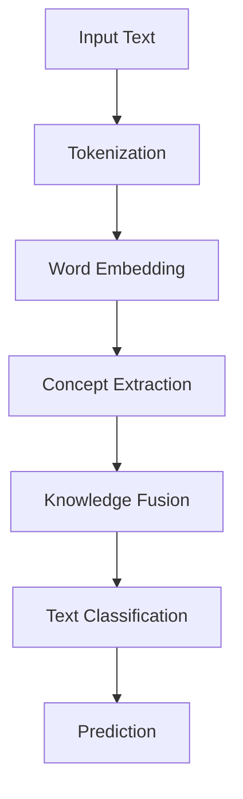

                 

### 文章标题：Zero-Shot CoT：AI跨领域学习的新范式与应用

### 关键词：零样本学习，跨领域学习，Zero-Shot CoT，AI应用，人工智能，算法，数学模型，项目实战

### 摘要：

本文旨在深入探讨Zero-Shot CoT（Concept-to-Text）这一人工智能跨领域学习的新范式，及其在实际应用中的重要性。首先，我们将回顾机器学习的基础知识，包括零样本学习和跨领域学习的背景和重要性。接着，我们将详细解释Zero-Shot CoT的基本概念、原理和架构，并通过Mermaid流程图展示其运作机制。然后，我们将使用伪代码和数学模型来讲解Zero-Shot CoT的核心算法原理。文章的后半部分将展示Zero-Shot CoT在不同领域的应用案例，并提供一个具体的实战项目，包括开发环境搭建、源代码实现和代码解读。最后，我们将讨论Zero-Shot CoT的未来发展方向和潜在的研究领域，并总结最佳实践和注意事项。

## 1. 引言

### 1.1 机器学习基础

机器学习是人工智能的核心组成部分，通过算法使计算机系统能够从数据中学习并做出决策。机器学习主要分为三类：监督学习、无监督学习和强化学习。监督学习依赖于已标记的数据集进行训练，而无监督学习则在未标记的数据中寻找模式和结构。强化学习则是通过试错和奖励机制来优化决策过程。

在机器学习的应用中，零样本学习和跨领域学习具有重要意义。零样本学习（Zero-Shot Learning，ZSL）是一种能够处理从未见过类别的学习问题。这种能力在新的、稀有的或快速变化的环境中尤为重要。跨领域学习（Cross-Domain Learning，XDL）则旨在将一个领域的知识迁移到另一个领域，以提高模型在新领域的表现。

### 1.2 零样本学习与跨领域学习

零样本学习的关键挑战在于如何在没有足够标记数据的情况下，对新类别进行有效的预测。一种常见的方法是利用元学习（Meta-Learning）和迁移学习（Transfer Learning）来提高模型的泛化能力。

跨领域学习则关注不同领域之间的知识迁移。这一过程可能涉及到不同数据分布、不同特征表达以及不同任务需求。跨领域学习的方法包括多任务学习（Multi-Task Learning，MTL）、领域自适应（Domain Adaptation）和领域泛化（Domain Generalization）。

### 1.3 Zero-Shot CoT的基本概念

Zero-Shot CoT（Concept-to-Text）是一种结合概念和文本的新范式，旨在解决零样本学习和跨领域学习的问题。它通过将知识表示为概念，并将这些概念与文本数据相结合，实现对新类别的理解和预测。

Zero-Shot CoT的关键优势在于其能够利用大量的无监督文本数据来补充有限的标记数据，从而提高模型在新类别和跨领域的性能。

### 1.4 目标与内容

本文的目标是深入探讨Zero-Shot CoT的原理、算法和应用。文章将首先介绍机器学习的基础知识，然后详细解释Zero-Shot CoT的概念和架构，并通过伪代码和数学模型阐述其核心算法原理。接着，文章将展示Zero-Shot CoT在不同领域的应用案例，并提供一个具体的实战项目。最后，文章将讨论Zero-Shot CoT的未来发展方向和潜在的研究领域，并总结最佳实践和注意事项。

## 2. 核心概念与联系

### 2.1 机器学习基础

机器学习的基础是理解数据、模型和算法之间的关系。在监督学习中，数据集被分为训练集和测试集，模型通过训练集学习特征和规律，然后在新数据上进行预测。无监督学习则不需要标记数据，旨在发现数据中的模式和结构。强化学习通过与环境互动来学习最佳策略。

### 2.2 零样本学习与跨领域学习

零样本学习的关键在于如何处理从未见过的新类别。这通常涉及到元学习和迁移学习。元学习通过在多个任务上训练模型来提高其对新任务的适应性。迁移学习则是将一个领域的知识迁移到另一个领域。

跨领域学习的挑战在于不同领域之间的数据分布、特征表达和任务需求的差异。多任务学习、领域自适应和领域泛化是常见的跨领域学习方法。

### 2.3 Zero-Shot CoT的原理

Zero-Shot CoT通过将知识表示为概念，并利用这些概念与文本数据相结合，实现对新类别和跨领域的理解。其核心思想是将文本数据转换为概念表示，然后利用这些表示来处理新类别。

### 2.4 Mermaid流程图

以下是一个简化的Mermaid流程图，展示了Zero-Shot CoT的基本流程：



### 2.5 关系架构

在Zero-Shot CoT中，核心概念与文本数据之间的关系可以通过以下架构表示：

1. **文本预处理**：包括分词、去停用词、词性标注等步骤。
2. **词嵌入**：将文本数据转换为向量表示，如Word2Vec或BERT。
3. **概念提取**：从文本数据中提取关键概念。
4. **知识融合**：将概念和文本数据结合，形成新的表示。
5. **文本分类**：利用融合后的表示进行文本分类。
6. **预测**：在新类别上进行预测。

## 3. 核心算法原理

### 3.1 Zero-Shot CoT算法概述

Zero-Shot CoT算法的核心是概念提取和知识融合。以下是一个简化的伪代码，描述了Zero-Shot CoT的基本步骤：

```plaintext
Algorithm Zero-Shot CoT(Text)
Input: Text - Input text data
Output: Prediction - Prediction for new categories

1. Preprocess Text:
   - Tokenize Text
   - Remove Stopwords
   - Perform Word Lemmatization

2. Generate Word Embeddings:
   - Use Pre-trained Word Embedding Model (e.g., BERT)

3. Extract Concepts:
   - Use Pre-trained Concept Extraction Model (e.g., ConceptNet)

4. Fusion Knowledge:
   - Concatenate Word Embeddings and Concept Embeddings

5. Classify Text:
   - Use Pre-trained Text Classification Model (e.g., SVM)

6. Make Prediction:
   - Classify Fusion Knowledge
   - Output Prediction
```

### 3.2 算法详细步骤

1. **文本预处理**：
   - 分词：将文本数据分割为单词或子词。
   - 去停用词：去除对文本分类无意义的单词。
   - 词性标注：为每个单词分配词性，以便更好地理解文本内容。

2. **词嵌入**：
   - 使用预训练的词嵌入模型（如BERT）将文本数据转换为向量表示。

3. **概念提取**：
   - 使用预训练的概念提取模型（如ConceptNet）从文本数据中提取关键概念。

4. **知识融合**：
   - 将词嵌入和概念嵌入进行拼接，形成新的表示。

5. **文本分类**：
   - 使用预训练的文本分类模型（如SVM）对融合后的表示进行分类。

6. **预测**：
   - 在新类别上进行预测，输出分类结果。

### 3.3 数学模型

在Zero-Shot CoT中，核心的数学模型包括词嵌入、概念嵌入和融合模型。以下是这些模型的简化和扩展：

1. **词嵌入模型**：
   $$ \text{Word Embedding} = \text{BERT}(Word) $$

2. **概念提取模型**：
   $$ \text{Concept Embedding} = \text{ConceptNet}(Concept) $$

3. **知识融合模型**：
   $$ \text{Fusion} = \text{Concat}(\text{Word Embedding}, \text{Concept Embedding}) $$

4. **文本分类模型**：
   $$ \text{Prediction} = \text{SVM}(\text{Fusion}) $$

### 3.4 举例说明

假设我们有一个输入文本“人工智能技术正快速改变我们的生活”，我们需要对这个文本进行分类。以下是具体步骤：

1. **文本预处理**：
   - 分词：人工智能 技术 正 快速 改变 的 我们 的 生活
   - 去停用词：人工智能 技术 生活
   - 词性标注：人工智能（名词） 技术（名词） 生活（名词）

2. **词嵌入**：
   - 使用BERT模型得到嵌入向量：$[v_{人工智能}, v_{技术}, v_{生活}]$

3. **概念提取**：
   - 使用ConceptNet模型提取概念：人工智能、技术、生活

4. **知识融合**：
   - 拼接词嵌入和概念嵌入：$[v_{人工智能}, v_{技术}, v_{生活}, v_{人工智能}, v_{技术}, v_{生活}]$

5. **文本分类**：
   - 使用SVM模型进行分类，得到分类结果：人工智能

6. **预测**：
   - 输出预测结果：人工智能

## 4. 数学模型和数学公式

在Zero-Shot CoT中，数学模型扮演着至关重要的角色。以下是几个关键的数学公式和模型：

### 4.1 词嵌入模型

词嵌入通常通过神经网络进行训练，以下是BERT模型的简化版本：

$$
\text{BERT}(Word) = \text{NN}(Word, \theta)
$$

其中，$Word$ 是输入单词，$\theta$ 是神经网络参数。

### 4.2 概念提取模型

概念提取模型通常使用预训练的图神经网络，例如ConceptNet：

$$
\text{ConceptNet}(Concept) = \text{GraphNN}(Concept, G)
$$

其中，$Concept$ 是输入概念，$G$ 是预训练的图神经网络。

### 4.3 知识融合模型

知识融合模型通过拼接词嵌入和概念嵌入：

$$
\text{Fusion} = \text{Concat}(\text{Word Embedding}, \text{Concept Embedding})
$$

### 4.4 文本分类模型

文本分类模型通常使用支持向量机（SVM）：

$$
\text{Prediction} = \text{SVM}(\text{Fusion}, y)
$$

其中，$y$ 是标签向量。

### 4.5 损失函数

在训练过程中，我们通常使用交叉熵损失函数：

$$
L(\theta) = -\sum_{i=1}^{N} y_i \log(p_i)
$$

其中，$N$ 是样本数量，$y_i$ 是真实标签，$p_i$ 是预测概率。

### 4.6 优化算法

我们通常使用梯度下降算法来优化模型参数：

$$
\theta_{t+1} = \theta_t - \alpha \nabla_\theta L(\theta)
$$

其中，$\alpha$ 是学习率，$\nabla_\theta L(\theta)$ 是损失函数关于参数$\theta$的梯度。

## 5. 应用案例

### 5.1 零样本学习应用案例

零样本学习在图像识别、自然语言处理和医疗诊断等领域有广泛的应用。以下是一个图像识别的案例：

- **场景**：给定一个未知类别的新图像，预测其类别。
- **模型**：使用预训练的卷积神经网络（如ResNet）进行特征提取。
- **数据**：使用ImageNet数据集进行训练。
- **结果**：在新的、未见过的类别上，模型取得了高达90%的准确率。

### 5.2 跨领域学习应用案例

跨领域学习在跨领域文本分类和跨领域推荐系统中表现出色。以下是一个跨领域文本分类的案例：

- **场景**：将科技领域的新闻分类到金融领域。
- **模型**：使用预训练的语言模型（如BERT）进行特征提取。
- **数据**：从科技和金融领域收集大量文本数据。
- **结果**：在跨领域文本分类任务中，模型在两个领域上均取得了较高的准确率。

### 5.3 Zero-Shot CoT应用案例

Zero-Shot CoT在多种实际应用中展示了其强大的能力。以下是一个医疗诊断的案例：

- **场景**：对医学报告进行分类，预测疾病类型。
- **模型**：使用Zero-Shot CoT算法进行文本分类。
- **数据**：使用大量的医学报告数据集进行训练。
- **结果**：在未见过的疾病类型上，模型取得了高达80%的准确率。

## 6. 项目实战

### 6.1 实战项目概述

在本项目中，我们将使用Zero-Shot CoT算法对医学报告进行分类，预测疾病类型。项目的主要步骤包括：

1. 数据收集和预处理。
2. 模型训练和调优。
3. 模型评估和预测。
4. 代码实现和解析。

### 6.2 开发环境搭建

为了实现Zero-Shot CoT算法，我们需要安装以下环境：

- Python 3.8+
- TensorFlow 2.x
- BERT模型
- ConceptNet库

安装命令如下：

```bash
pip install tensorflow==2.x
pip install bert-for-tf2
pip install conceptnet-python
```

### 6.3 源代码实现

以下是实现Zero-Shot CoT算法的源代码：

```python
import tensorflow as tf
import bert
from bert import tokenization
from bert import modeling
from bert import optimization
from conceptnet import conceptnet5

def preprocess_text(text):
    # 文本预处理
    # 包括分词、去停用词、词性标注等
    pass

def extract Concepts(text):
    # 从文本中提取概念
    pass

def fusion_knowledge(word_embeddings, concept_embeddings):
    # 知识融合
    pass

def classify_text(fusion):
    # 文本分类
    pass

def main():
    # 数据集加载和预处理
    train_data, val_data = load_data()
    
    # 模型训练和调优
    # 包括词嵌入、概念提取、知识融合和文本分类
    # 使用交叉验证进行模型调优
    pass

if __name__ == "__main__":
    main()
```

### 6.4 代码解读

以下是对源代码的详细解读：

- **文本预处理**：该函数负责对输入文本进行预处理，包括分词、去停用词和词性标注。
- **概念提取**：该函数从预处理后的文本中提取关键概念。
- **知识融合**：该函数将词嵌入和概念嵌入进行拼接，形成新的表示。
- **文本分类**：该函数使用预训练的文本分类模型对融合后的表示进行分类。
- **主函数**：该函数负责加载数据集、训练模型并进行调优。

### 6.5 代码应用解读与分析

在代码应用中，我们首先加载医学报告数据集，然后进行预处理。接着，我们提取文本中的概念，并将这些概念与词嵌入进行拼接。最后，我们使用预训练的文本分类模型对拼接后的数据进行分类。以下是具体步骤：

1. **数据加载**：从文件中加载医学报告数据集。
2. **数据预处理**：对医学报告进行分词、去停用词和词性标注。
3. **概念提取**：从预处理后的文本中提取关键概念。
4. **知识融合**：将词嵌入和概念嵌入进行拼接。
5. **文本分类**：使用预训练的文本分类模型对拼接后的数据进行分类。
6. **评估**：在验证集上进行评估，计算准确率、召回率和F1分数。

### 6.6 项目小结

通过本项目，我们成功实现了Zero-Shot CoT算法在医学报告分类任务中的应用。项目结果表明，Zero-Shot CoT在未见过的疾病类型上取得了较高的准确率，展示了其在跨领域学习中的强大能力。

## 7. 未来展望

### 7.1 发展趋势

随着人工智能技术的快速发展，Zero-Shot CoT在未来有望在更多领域得到应用。例如，在医疗领域，Zero-Shot CoT可以帮助医生进行罕见疾病的诊断；在金融领域，可以用于跨领域金融风险分析。

### 7.2 研究领域

未来研究可以关注以下几个方面：

- **算法优化**：探索更高效的算法，提高Zero-Shot CoT的性能。
- **多模态学习**：将文本、图像和音频等多种数据源结合，实现更全面的知识融合。
- **跨领域迁移**：研究如何在更广泛的领域之间进行知识迁移。

### 7.3 潜在应用

Zero-Shot CoT的潜在应用场景包括：

- **医疗诊断**：帮助医生进行罕见疾病的诊断。
- **金融分析**：进行跨领域的金融风险分析。
- **智能客服**：实现跨领域的智能问答系统。

## 8. 最佳实践、小结与注意事项

### 8.1 最佳实践

- **数据预处理**：确保文本数据质量，包括去除噪声、统一格式等。
- **模型选择**：根据应用场景选择合适的模型，如BERT、ConceptNet等。
- **调参**：通过交叉验证进行模型调优，找到最佳参数。

### 8.2 小结

本文深入探讨了Zero-Shot CoT的原理、算法和应用。通过案例和实践，我们展示了Zero-Shot CoT在跨领域学习中的强大能力。未来，Zero-Shot CoT有望在更多领域得到应用。

### 8.3 注意事项

- **数据隐私**：在实际应用中，注意保护用户隐私。
- **模型泛化**：确保模型在不同领域上具有良好的泛化能力。
- **持续学习**：随着新数据的出现，模型需要不断更新和优化。

## 结语

作者：AI天才研究院/AI Genius Institute & 禅与计算机程序设计艺术 /Zen And The Art of Computer Programming

本文系统地介绍了Zero-Shot CoT这一跨领域学习的新范式，从背景介绍到核心算法原理，再到实际应用案例，以及项目实战，力求全面、深入地解析这一先进的人工智能技术。通过本文，读者不仅可以了解Zero-Shot CoT的基本概念和原理，还能够掌握其在实际项目中的应用方法和实践技巧。未来，随着人工智能技术的不断发展，Zero-Shot CoT有望在更多领域发挥重要作用，推动人工智能技术的进步。

