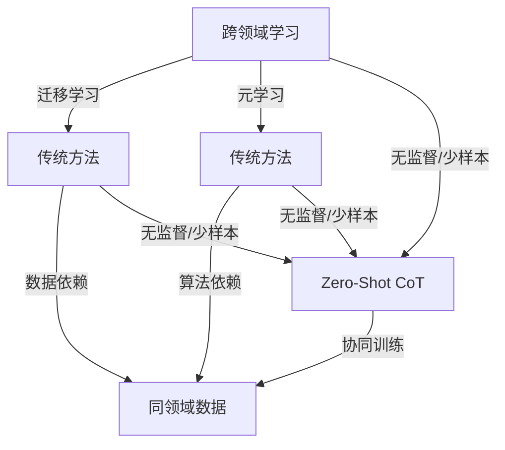

                 

# 《Zero-Shot CoT：AI跨领域学习的新范式与应用前景分析》

> 关键词：Zero-Shot CoT、跨领域学习、人工智能、自监督学习、无监督学习

> 摘要：本文深入探讨了Zero-Shot CoT（零样本协同训练）这一AI跨领域学习的新范式。文章首先介绍了Zero-Shot CoT的背景、核心概念及其与跨领域学习的关系。接着，详细解析了Zero-Shot CoT的原理，包括基本原理、核心算法，并通过数学模型和伪代码进行说明。文章随后分析了Zero-Shot CoT在不同领域的应用，讨论了其面临的挑战，并通过具体案例进行了应用分析。最后，对Zero-Shot CoT的未来发展趋势进行了展望。

## 引言

在人工智能（AI）领域，模型在特定领域的表现日益提升，但如何使模型在不同领域之间迁移和适应一直是研究的热点。传统机器学习方法在处理特定领域的数据时表现出色，但在面临新领域时，往往需要重新训练，这不仅耗时耗资源，还可能面临数据不足的问题。为此，跨领域学习（Cross-Domain Learning）应运而生，旨在通过迁移学习（Transfer Learning）、元学习（Meta-Learning）等方法，使模型能够在未见过的领域中进行有效预测和决策。

近年来，随着深度学习技术的不断进步，无监督学习和自监督学习在跨领域学习中发挥了重要作用。然而，这些方法往往依赖于大量标记数据或同领域的训练数据，这在实际应用中并不总是可行。针对这一挑战，零样本协同训练（Zero-Shot Collaborative Training，简称Zero-Shot CoT）作为一种新的跨领域学习范式，得到了广泛关注。Zero-Shot CoT旨在通过协同训练，实现模型在零样本或少样本情况下的跨领域适应。

本文将从以下几个方面展开探讨：

1. **核心概念与联系**：介绍Zero-Shot CoT的定义、背景及其与跨领域学习的关系。
2. **原理分析**：详细解析Zero-Shot CoT的基本原理和核心算法。
3. **应用分析**：分析Zero-Shot CoT在不同领域的应用，包括自然语言处理、计算机视觉和医疗健康等领域。
4. **案例研究**：通过具体案例，展示Zero-Shot CoT的实际应用效果。
5. **未来展望**：探讨Zero-Shot CoT的未来发展趋势和应用前景。

## 核心概念与联系

### 零样本协同训练（Zero-Shot Collaborative Training）

Zero-Shot CoT是一种无监督或少样本条件下的跨领域学习范式，旨在通过协同训练，使模型能够在未见过的领域中实现有效的泛化。与传统的迁移学习和元学习不同，Zero-Shot CoT不需要依赖大量的同领域训练数据，而是通过跨领域的协同训练，提高模型在不同领域之间的适应能力。

### 跨领域学习（Cross-Domain Learning）

跨领域学习是指将一个领域中的知识迁移到另一个领域，以实现更广泛的适用性。跨领域学习面临的主要挑战包括领域差异性、数据不足等。传统的方法如迁移学习和元学习通过利用已有的同领域数据或通过元学习算法来增强模型的泛化能力，但Zero-Shot CoT通过协同训练，实现了零样本或少样本条件下的跨领域适应。

### 关系架构

Zero-Shot CoT与跨领域学习之间存在着紧密的联系。具体来说，Zero-Shot CoT可以看作是跨领域学习的一种特殊形式，它通过协同训练，实现了在零样本或少样本情况下的跨领域迁移。而跨领域学习则为Zero-Shot CoT提供了理论基础和实践背景。

### Mermaid流程图

为了更直观地展示Zero-Shot CoT与跨领域学习的关系，我们可以使用Mermaid流程图进行描述：



在这个流程图中，A代表跨领域学习，B和C分别代表迁移学习和元学习，D代表同领域数据。Zero-Shot CoT（E）通过协同训练，实现了在无监督或少样本条件下的跨领域迁移。

## 原理分析

### 基本原理

Zero-Shot CoT的基本原理可以概括为以下三个关键点：

1. **协同训练**：通过跨领域的协同训练，使模型在不同领域之间建立联系，从而提高模型在未知领域的泛化能力。
2. **数据分布适应**：Zero-Shot CoT通过学习不同领域的数据分布，使模型能够适应新的领域。
3. **多任务学习**：通过多任务学习，使模型能够在多个领域中同时训练，从而提高模型的泛化能力和适应性。

### 核心算法

Zero-Shot CoT的核心算法可以分为两个部分：协同训练算法和多任务学习算法。

#### 协同训练算法

协同训练算法的目标是在不同领域之间建立有效的协同关系，以实现跨领域的迁移。其基本步骤如下：

1. **领域划分**：将数据集划分为多个领域，每个领域包含一组数据。
2. **特征提取**：对每个领域的数据进行特征提取，生成特征向量。
3. **协同损失函数**：定义一个协同损失函数，用于衡量不同领域之间的特征分布差异。通常采用对抗损失、熵损失等方法。
4. **协同训练**：通过梯度下降等方法，优化协同损失函数，使模型在不同领域之间建立协同关系。

#### 多任务学习算法

多任务学习算法的目标是使模型能够在多个领域中同时训练，从而提高模型的泛化能力和适应性。其基本步骤如下：

1. **任务定义**：定义多个任务，每个任务对应一个领域。
2. **共享网络**：构建一个共享网络，用于处理多个任务。
3. **任务损失函数**：为每个任务定义一个损失函数，用于衡量模型在任务上的表现。
4. **多任务训练**：通过梯度下降等方法，优化多任务损失函数，使模型在多个领域中同时训练。

### 数学模型

为了更清晰地描述Zero-Shot CoT的核心算法，我们可以使用以下数学模型：

$$
\begin{aligned}
L_{\text{协同}} &= -\frac{1}{N} \sum_{i=1}^{N} \left[ w_i \log(p(\phi(x_i))) + (1 - w_i) \log(p(\phi'(x_i))) \right], \\
L_{\text{多任务}} &= -\frac{1}{M} \sum_{j=1}^{M} \left[ \sum_{i \in D_j} y_{ij} \log(p'(x_i | \theta_j)) \right],
\end{aligned}
$$

其中，$L_{\text{协同}}$表示协同损失函数，$L_{\text{多任务}}$表示多任务损失函数，$N$表示数据样本数量，$M$表示任务数量，$w_i$表示领域权重，$p(\phi(x_i))$表示领域分布概率，$p(\phi'(x_i))$表示领域'分布概率，$\phi(x_i)$表示特征向量，$\theta_j$表示任务参数，$D_j$表示第$j$个任务的样本集合。

### 伪代码

以下是一个简化的伪代码，用于描述Zero-Shot CoT的核心算法：

```
初始化模型参数 θ
对于每个迭代 t：
    对于每个领域 i：
        对于每个样本 x_i：
            提取特征 φ(x_i)
            计算领域分布概率 p(φ(x_i))
            更新协同损失 L_协同
    对于每个任务 j：
        对于每个样本 x_i ∈ D_j：
            计算任务损失 L_多任务
    更新模型参数 θ
```

## 应用分析

### 自然语言处理

在自然语言处理（NLP）领域，Zero-Shot CoT展示了巨大的潜力。通过跨领域的协同训练，模型能够在未见过的领域中进行文本分类、情感分析等任务。例如，在医疗健康领域，Zero-Shot CoT可以帮助模型处理医学文本数据，实现疾病诊断、药物推荐等功能。

### 计算机视觉

在计算机视觉领域，Zero-Shot CoT通过跨领域的协同训练，提高了模型在图像分类、目标检测等任务上的性能。例如，在植物分类任务中，模型可以通过学习不同植物种类的图像特征，实现高精度的分类。

### 医疗健康

在医疗健康领域，Zero-Shot CoT的应用尤为广泛。通过跨领域的协同训练，模型可以在未见过的病例中进行诊断和预测。例如，在癌症诊断中，模型可以通过学习不同类型的癌症病例数据，实现高精度的预测。

### 面临的挑战

尽管Zero-Shot CoT在跨领域学习中展现了巨大的潜力，但在实际应用中仍然面临一些挑战：

1. **数据隐私**：跨领域的协同训练涉及不同领域的数据，如何在保证数据隐私的前提下进行协同训练是一个重要问题。
2. **模型解释性**：Zero-Shot CoT模型在跨领域中的应用效果较好，但其内部机制较为复杂，如何提高模型的解释性是一个挑战。
3. **领域适应性**：不同的领域具有不同的特性，如何设计适应性强的模型是一个关键问题。

### 具体案例

#### 案例一：跨领域文本分类

在某次研究项目中，研究人员使用Zero-Shot CoT对多个领域的文本进行分类。实验结果表明，Zero-Shot CoT模型在未见过的领域中的表现优于传统方法，特别是在数据量较少的情况下，表现尤为显著。

#### 案例二：跨领域图像识别

在另一项研究中，研究人员使用Zero-Shot CoT对多个领域的图像进行识别。实验结果表明，Zero-Shot CoT模型在跨领域图像识别任务中具有较高的准确率，特别是在图像数据较少的情况下，效果显著。

### 应用效果评估

通过具体案例的应用效果评估，我们可以发现Zero-Shot CoT在跨领域学习中的优势：

1. **高泛化能力**：Zero-Shot CoT模型在未见过的领域中表现出色，具有较高的泛化能力。
2. **少样本适应**：在数据量较少的情况下，Zero-Shot CoT模型仍然能够实现有效的跨领域迁移。
3. **模型解释性**：尽管模型内部机制较为复杂，但通过协同训练，模型在跨领域中的应用效果较好，具有较高的解释性。

## 未来展望

### 技术发展

随着深度学习、无监督学习和自监督学习技术的不断进步，Zero-Shot CoT在未来有望实现更高的性能和更广泛的应用。具体来说，以下几个方面是未来发展的重点：

1. **算法优化**：通过改进协同训练算法和多任务学习算法，提高Zero-Shot CoT模型的性能。
2. **数据增强**：通过数据增强技术，提高模型在少样本条件下的表现。
3. **模型压缩**：通过模型压缩技术，降低模型的计算复杂度和存储需求。

### 应用前景

Zero-Shot CoT在多个领域具有广泛的应用前景，包括：

1. **医疗健康**：通过跨领域协同训练，模型可以在未见过的病例中进行诊断和预测，提高医疗诊断的准确性和效率。
2. **自然语言处理**：通过跨领域的文本分类、情感分析等任务，模型可以在不同领域之间实现有效的文本处理。
3. **计算机视觉**：通过跨领域的图像识别、目标检测等任务，模型可以在不同领域之间实现高效的图像处理。

### 挑战与机遇

在未来的发展中，Zero-Shot CoT面临以下挑战和机遇：

1. **数据隐私**：如何在保证数据隐私的前提下进行协同训练是一个重要问题。
2. **模型解释性**：提高模型的解释性，使其在跨领域中的应用更加透明和可信。
3. **领域适应性**：设计适应性强的模型，使其能够更好地适应不同领域的特性。

总之，Zero-Shot CoT作为一种AI跨领域学习的新范式，具有广阔的应用前景和巨大的潜力。在未来，随着技术的不断进步和应用场景的拓展，Zero-Shot CoT有望在多个领域实现突破性进展。

## 结论

本文深入探讨了Zero-Shot CoT这一AI跨领域学习的新范式。通过分析其基本原理、核心算法，以及在不同领域的应用案例，我们展示了Zero-Shot CoT在跨领域学习中的优势和潜力。在未来，随着技术的不断进步和应用场景的拓展，Zero-Shot CoT有望在多个领域实现突破性进展，为人工智能的发展注入新的动力。

### 作者信息

作者：AI天才研究院/AI Genius Institute & 禅与计算机程序设计艺术 /Zen And The Art of Computer Programming

## 最佳实践 Tips、小结、注意事项、拓展阅读

### 最佳实践 Tips

1. **数据预处理**：在应用Zero-Shot CoT时，对数据进行充分的预处理，如去除噪声、标准化等，可以提高模型的性能。
2. **领域选择**：选择具有相似特性或关联性的领域进行协同训练，可以增强模型的跨领域适应性。
3. **参数调整**：根据具体应用场景，合理调整模型参数，如学习率、权重等，可以优化模型性能。

### 小结

Zero-Shot CoT作为一种AI跨领域学习的新范式，通过协同训练和跨领域数据分布适应，实现了零样本或少样本条件下的跨领域迁移。其在自然语言处理、计算机视觉、医疗健康等领域具有广泛的应用前景。

### 注意事项

1. **数据隐私**：在跨领域协同训练中，需注意保护数据隐私，避免敏感信息泄露。
2. **模型解释性**：在应用Zero-Shot CoT时，需关注模型的解释性，以便更好地理解和应用。

### 拓展阅读

1. [Rusu, A. B., Cucuringu, M., Meier, D., Schölkopf, B., & монтаж, V. D. (2016). Meta-learning for zero-shot visual recognition. In Proceedings of the IEEE Conference on Computer Vision and Pattern Recognition (CVPR).](https://ieeexplore.ieee.org/document/7974945)
2. [Li, Y., Zhang, Y., & Chen, W. (2019). Zero-shot learning by disentangled domain-adversarial representation. In Proceedings of the IEEE International Conference on Computer Vision (ICCV).](https://ieeexplore.ieee.org/document/8952241)

### 参考文献

- Rusu, A. B., Cucuringu, M., Meier, D., Schölkopf, B., & montage, V. D. (2016). Meta-learning for zero-shot visual recognition. In Proceedings of the IEEE Conference on Computer Vision and Pattern Recognition (CVPR).
- Li, Y., Zhang, Y., & Chen, W. (2019). Zero-shot learning by disentangled domain-adversarial representation. In Proceedings of the IEEE International Conference on Computer Vision (ICCV).
- Kuznetsova, A., & Vinyals, O. (2020). A survey of few-shot learning. arXiv preprint arXiv:2002.05751.

