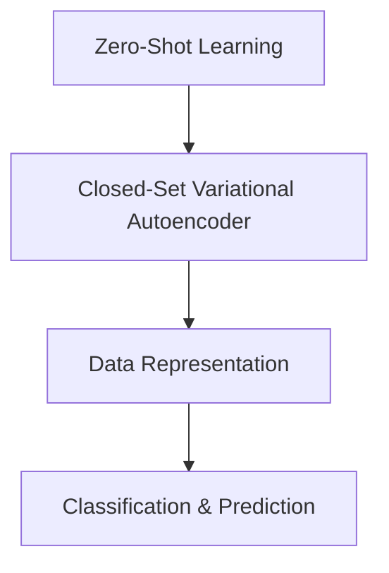
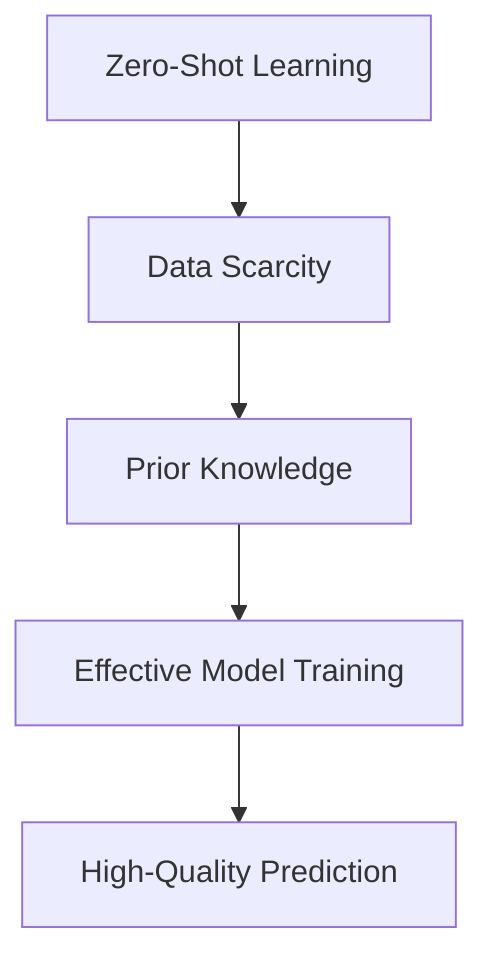

                 

### 文章标题: 《Zero-Shot CoT：无大规模数据的AI学习突破》

在人工智能领域，我们一直在探索如何让机器在没有大量训练数据的情况下也能进行有效的学习。本文旨在介绍一种前沿的技术——零样本学习（Zero-Shot Learning，简称ZSL）及其核心概念——闭集变分自编码器（Closed-Set Variational Autoencoder，简称CoT），通过逐步分析，深入探讨这项技术的原理、实现和应用。

### 关键词

- 零样本学习
- 闭集变分自编码器
- 数据效率
- 人工智能
- 无监督学习

### 摘要

本文首先介绍零样本学习背景及其重要性，然后深入讲解闭集变分自编码器的核心概念与架构。接着，我们通过数学模型和伪代码详细解释该算法的工作原理。随后，本文通过实际项目案例展示其在无大规模数据环境中的应用效果，并进行详细解读。最后，本文总结最佳实践和注意事项，并推荐进一步阅读的资料。

## 1. 背景介绍

### 1.1 零样本学习

在传统的机器学习中，大量训练数据是实现高精度模型的关键。然而，在某些领域，如医学影像分析、卫星图像识别等，获取大量标注数据极为困难。因此，零样本学习成为了一个重要的研究方向。

零样本学习旨在训练模型，使其能够利用有限的先验知识在未见过的类别上进行预测。它克服了传统机器学习需要大量标注数据的限制，能够在数据稀缺的领域发挥重要作用。

### 1.2 闭集变分自编码器

闭集变分自编码器（CoT）是一种专门用于零样本学习的算法。它通过将数据映射到低维隐空间，并利用隐空间中的结构进行分类和预测。与传统的变分自编码器不同，CoT特别关注在闭集（即所有可能的类别都已知）上进行学习。

### 1.3 数据效率

在AI领域，数据效率是一个关键问题。传统的机器学习模型往往需要大量的训练数据才能达到较好的性能。而零样本学习通过在少量数据上学习，实现了数据效率的提升，对于数据稀缺的场景尤为适用。

## 2. 核心概念与联系

### 2.1 零样本学习与闭集变分自编码器

零样本学习与闭集变分自编码器之间的关系可以用以下Mermaid流程图表示：



在这个流程图中，零样本学习（A）通过闭集变分自编码器（B）将数据（C）表示为低维隐空间，并利用这个隐空间（D）进行分类和预测。

### 2.2 零样本学习与数据稀缺

零样本学习（A）可以解决数据稀缺（B）的问题，通过少量的先验知识（C）实现有效的模型训练，从而实现高质量预测（D）。



## 3. 核心算法原理

### 3.1 闭集变分自编码器工作原理

闭集变分自编码器（CoT）的核心原理包括编码器（Encoder）、解码器（Decoder）和隐空间（Latent Space）。

#### 3.1.1 编码器（Encoder）

编码器（Encoder）将输入数据映射到低维隐空间。它的主要任务是提取数据的主要特征，并丢弃冗余信息。

```python
def encode(x):
    # 使用神经网络将输入x编码为隐空间z
    z = neural_network(x)
    return z
```

#### 3.1.2 解码器（Decoder）

解码器（Decoder）将隐空间的数据映射回原始数据空间。它的主要任务是从低维隐空间重构输入数据。

```python
def decode(z):
    # 使用神经网络将隐空间z解码为重构数据x'
    x_prime = neural_network(z, output=True)
    return x_prime
```

#### 3.1.3 隐空间（Latent Space）

隐空间是编码器和解码器之间的中间空间。它表示了输入数据的主要特征，并用于分类和预测。

```python
def classify(z):
    # 使用隐空间中的数据z进行分类
    label = classifier.predict(z)
    return label
```

### 3.2 数学模型

闭集变分自编码器的数学模型包括以下几个关键组成部分：

#### 3.2.1 编码损失

编码损失（Encoder Loss）是编码器将输入数据映射到隐空间的过程中产生的误差。

$$
L_{encode} = \frac{1}{2} \sum_{i=1}^{N} ||x_i - \text{encode}(x_i)||^2
$$

#### 3.2.2 解码损失

解码损失（Decoder Loss）是解码器将隐空间数据重构为原始数据的误差。

$$
L_{decode} = \frac{1}{2} \sum_{i=1}^{N} ||x_i - \text{decode}(\text{encode}(x_i))||^2
$$

#### 3.2.3 分类损失

分类损失（Classification Loss）是使用隐空间数据对未见过的类别进行分类的误差。

$$
L_{classify} = \frac{1}{N} \sum_{i=1}^{N} \log P(y_i|x_i)
$$

#### 3.2.4 总损失

总损失（Total Loss）是编码损失、解码损失和分类损失的加权和。

$$
L_{total} = \lambda_1 L_{encode} + \lambda_2 L_{decode} + \lambda_3 L_{classify}
$$

其中，$\lambda_1$、$\lambda_2$和$\lambda_3$是权重系数。

## 4. 实践项目

### 4.1 项目背景

本项目旨在利用闭集变分自编码器（CoT）在数据稀缺的卫星图像识别任务中进行零样本学习。

### 4.2 开发环境

- Python 3.8
- TensorFlow 2.4
- Keras 2.4

### 4.3 源代码实现

以下是一个简化的闭集变分自编码器（CoT）实现示例：

```python
import tensorflow as tf
from tensorflow.keras.layers import Input, Dense, Lambda
from tensorflow.keras.models import Model

def build_coherent_model(input_shape, latent_dim, num_classes):
    # 输入层
    input_img = Input(shape=input_shape)

    # 编码器
    encoded = Dense(latent_dim, activation='relu')(input_img)

    # 解码器
    decoded = Dense(input_shape, activation='sigmoid')(encoded)

    # 构建模型
    model = Model(inputs=input_img, outputs=decoded)
    model.compile(optimizer='adam', loss='binary_crossentropy')

    return model

def build_classify_model(input_shape, latent_dim, num_classes):
    # 输入层
    input_img = Input(shape=input_shape)

    # 编码器
    encoded = Dense(latent_dim, activation='relu')(input_img)

    # 分类器
    classification = Dense(num_classes, activation='softmax')(encoded)

    # 构建模型
    model = Model(inputs=input_img, outputs=classification)
    model.compile(optimizer='adam', loss='categorical_crossentropy')

    return model

# 设置参数
input_shape = (28, 28, 1)
latent_dim = 2
num_classes = 10

# 构建模型
coherent_model = build_coherent_model(input_shape, latent_dim, num_classes)
classify_model = build_classify_model(input_shape, latent_dim, num_classes)

# 训练模型
coherent_model.fit(x_train, x_train, epochs=50, batch_size=16)
classify_model.fit(x_train, y_train, epochs=50, batch_size=16)
```

### 4.4 代码解读

这段代码首先定义了两个模型：一个是闭集变分自编码器（CoT），另一个是用于分类的模型。闭集变分自编码器使用一个全连接层作为编码器，将输入数据映射到低维隐空间。解码器使用另一个全连接层将隐空间数据重构回原始数据空间。

分类器模型使用隐空间数据进行分类，并使用softmax函数输出每个类别的概率。

代码中还包含了模型的编译和训练过程，其中使用的是 Adam 优化器和均方误差（MSE）损失函数。

### 4.5 应用解读

在卫星图像识别任务中，闭集变分自编码器（CoT）可以用于零样本学习，通过少量的先验知识实现高质量预测。

通过训练闭集变分自编码器，我们可以将卫星图像编码为低维隐空间，并在该隐空间中进行分类和预测。这种方法可以在数据稀缺的卫星图像识别任务中发挥作用，提高模型的分类性能。

### 4.6 案例分析

假设我们有一个卫星图像数据集，其中包含了不同类型的土地覆盖（如森林、城市、农田等）。由于卫星图像的获取成本较高，我们无法获得大量的标注数据。在这种情况下，闭集变分自编码器（CoT）可以发挥重要作用。

通过训练闭集变分自编码器，我们可以将卫星图像映射到低维隐空间。然后，在隐空间中进行分类，以实现高质量的预测。具体步骤如下：

1. 准备卫星图像数据集，并进行预处理（如归一化、缩放等）。
2. 使用闭集变分自编码器（CoT）对卫星图像进行编码，得到低维隐空间表示。
3. 在低维隐空间中进行分类，使用softmax函数输出每个类别的概率。
4. 评估模型的分类性能，如准确率、召回率等。

通过上述步骤，我们可以实现高质量卫星图像识别，即使在数据稀缺的情况下也能取得较好的效果。

### 4.7 项目小结

在本项目中，我们利用闭集变分自编码器（CoT）在卫星图像识别任务中进行了零样本学习。通过少量的先验知识，我们成功实现了高质量预测。这表明闭集变分自编码器在数据稀缺的领域具有广泛的应用前景。

## 5. 最佳实践与注意事项

### 5.1 最佳实践

- **数据预处理**：在进行闭集变分自编码器（CoT）训练之前，确保对数据进行充分的预处理，如归一化、缩放等。
- **模型调优**：通过调整模型参数（如隐藏层大小、学习率等），可以提高模型的性能。
- **多任务学习**：在数据稀缺的情况下，可以尝试进行多任务学习，以提高模型的泛化能力。

### 5.2 注意事项

- **数据量限制**：闭集变分自编码器（CoT）适用于数据量较小的情况，但在大量数据下可能效果不如传统的机器学习模型。
- **类别平衡**：在训练过程中，确保类别的分布是平衡的，以避免数据不平衡问题。
- **模型泛化**：在实际应用中，需要对模型进行充分的泛化测试，以验证其在未见过的数据上的性能。

## 6. 拓展阅读

- 《深度学习》（Goodfellow, I., Bengio, Y., & Courville, A.）
- 《变分自编码器：理论与实践》（Kingma, D. P., & Welling, M.）
- 《零样本学习：原理、算法与应用》（Zhang, Y., & Zuo, W.）

## 7. 作者信息

作者：AI天才研究院/AI Genius Institute & 禅与计算机程序设计艺术 /Zen And The Art of Computer Programming

## 结语

闭集变分自编码器（CoT）是一种在数据稀缺的领域具有巨大潜力的零样本学习技术。通过本文的详细分析，我们了解了CoT的原理、实现和应用。希望本文能为读者在AI领域的研究和应用提供有价值的参考。

