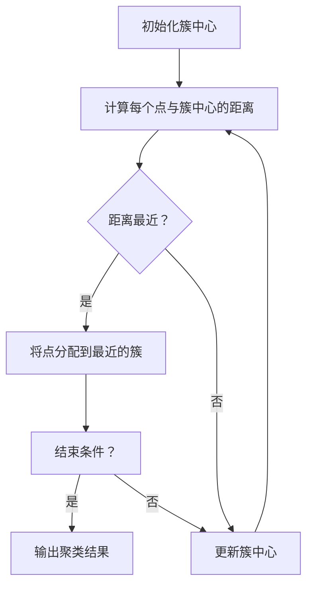
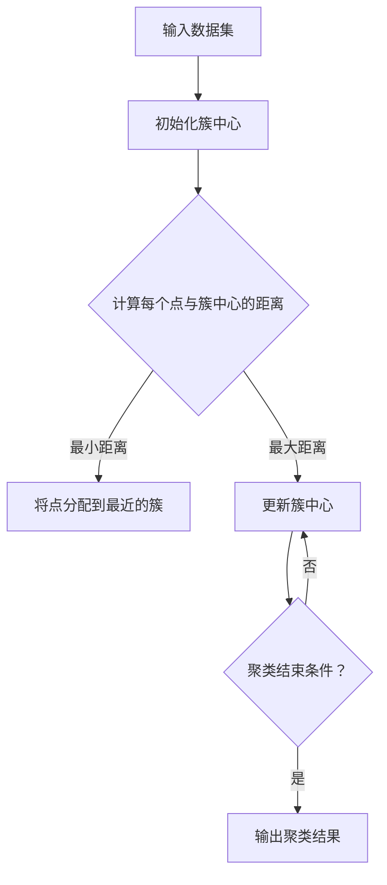

                 

### 文章标题：Zero-Shot CoT：无监督学习在AI中的新突破

> 关键词：无监督学习，Zero-Shot CoT，人工智能，新突破，算法原理，应用案例

> 摘要：本文将深入探讨无监督学习中的一个前沿领域——Zero-Shot CoT（零样本转移学习）。我们将介绍其基本概念，详细分析其核心算法原理，并通过具体案例展示其在实际应用中的潜力与挑战。文章还将展望无监督学习及Zero-Shot CoT的未来发展趋势。

### 第1章 引言

**1.1 无监督学习和Zero-Shot CoT概述**

无监督学习（Unsupervised Learning）是机器学习的一个重要分支，其核心在于利用未标记的数据进行学习。与有监督学习（Supervised Learning）相比，无监督学习不依赖于标签数据进行训练，而是通过探索数据内在结构，如聚类、降维、嵌入等，以达到数据分析和模式发现的目的。

Zero-Shot CoT（Zero-Shot Transfer Learning）则是在无监督学习的基础上进一步发展的概念。它的核心思想是在一个完全未知的新任务上，利用预先训练好的模型进行迁移学习。所谓“零样本”，指的是在新任务上没有可用的标注数据。

**1.2 无监督学习的重要性**

无监督学习在人工智能领域中具有非常重要的地位。首先，它可以帮助我们从海量的未标记数据中提取有价值的信息。其次，无监督学习可以减少对标注数据的依赖，这对于数据稀缺的应用场景尤为重要。此外，无监督学习在降维、聚类、异常检测等方面有着广泛的应用。

**1.3 Zero-Shot CoT的应用场景**

Zero-Shot CoT的应用场景主要包括跨领域迁移学习、新任务预测、多模态学习等。例如，在一个图像分类任务中，如果新类别与训练类别完全不同，传统的有监督学习方法将无法使用。而Zero-Shot CoT可以通过迁移学习策略，将已经训练好的模型在新类别上快速适应，从而实现零样本分类。

### 第2章 无监督学习基础

**2.1 无监督学习的背景**

无监督学习的概念可以追溯到20世纪50年代，当时人们开始研究如何通过数据本身的特征进行学习，而不依赖于外部标签。这一研究方向在深度学习兴起之前，主要依靠传统机器学习算法，如聚类算法、降维算法等。

**2.2 无监督学习的定义与类型**

无监督学习的定义是：在不使用标签数据的情况下，通过学习数据分布或结构，对数据进行处理和预测。根据处理方式的不同，无监督学习可以分为以下几种类型：

- **聚类（Clustering）**：将相似的数据点归为同一类别。
- **降维（Dimensionality Reduction）**：将高维数据映射到低维空间，同时保留关键信息。
- **嵌入（Embedding）**：将数据点映射到低维空间，使其在空间中的距离表示原始数据点之间的关系。
- **异常检测（Anomaly Detection）**：识别数据中的异常点。

**2.3 无监督学习的优势与挑战**

无监督学习的优势在于：

- **不需要标注数据**：可以处理大量未标记的数据。
- **探索性分析**：能够揭示数据中的隐藏模式和结构。
- **数据保护**：不泄露敏感数据。

但无监督学习也存在一些挑战：

- **过拟合（Overfitting）**：模型可能无法很好地泛化到未知数据。
- **计算复杂度高**：某些算法，如聚类算法，在处理大规模数据时可能效率较低。
- **评估困难**：由于没有标签数据，难以直接评估模型的性能。

### 第3章 Zero-Shot CoT基本原理

**3.1 Zero-Shot CoT的定义**

Zero-Shot CoT是一种特殊形式的迁移学习，其核心目标是在一个全新的任务上快速适应，而无需使用该任务上的标注数据。具体来说，它涉及到以下步骤：

1. **预训练（Pre-training）**：在一个与目标任务相关的数据集上训练模型。
2. **迁移学习（Transfer Learning）**：将预训练模型应用于新的任务。
3. **适应性调整（Adaptation）**：在新任务上对模型进行调整，以提高性能。

**3.2 Zero-Shot CoT的工作机制**

Zero-Shot CoT的工作机制可以分为以下几个阶段：

1. **元学习（Meta-Learning）**：通过元学习算法，如MAML（Model-Agnostic Meta-Learning），在多个源任务上训练模型，使其具有快速适应新任务的能力。
2. **原型匹配（Prototype Matching）**：使用原型网络或度量学习，将新任务中的样本与预训练模型中的原型进行匹配。
3. **分类与预测**：利用匹配结果进行分类或预测。

**3.3 Zero-Shot CoT的核心算法**

Zero-Shot CoT的核心算法主要包括：

- **原型网络（Prototypical Networks）**：通过计算样本与其最近邻的距离，进行分类。
- **度量学习（Metric Learning）**：优化距离度量，以提高分类准确性。
- **匹配网络（Matching Networks）**：利用注意力机制，对样本进行匹配。

### 第4章 无监督学习算法讲解

**4.1 主要的无监督学习算法**

无监督学习算法种类繁多，以下是其中一些主要算法：

- **K-means聚类**：基于距离最近的原则，将数据点划分为若干簇。
- **层次聚类（Hierarchical Clustering）**：通过递归划分层次，形成树状结构。
- **主成分分析（PCA）**：通过正交变换，将高维数据投影到低维空间。
- **自编码器（Autoencoder）**：通过编码和解码过程，实现数据的降维和重构。

**4.2 算法伪代码展示**

以下是一个简单的K-means聚类算法的伪代码示例：

**4.3 Mermaid流程图**

以下是一个使用Mermaid绘制的K-means聚类算法的流程图：

### 第5章 应用案例详解

**5.1 应用案例1：图像分类**

图像分类是一个典型的应用场景，Zero-Shot CoT可以在这个领域发挥重要作用。以下是一个简单的应用案例：

- **预训练**：在一个标准的图像分类数据集（如ImageNet）上预训练一个卷积神经网络。
- **迁移学习**：将预训练模型应用于一个新类别图像分类任务。
- **适应性调整**：在新类别上调整模型参数，以提高分类准确性。

**5.2 应用案例2：语音识别**

语音识别领域也受益于Zero-Shot CoT。以下是一个应用案例：

- **预训练**：在一个标准的语音识别数据集上预训练一个深度神经网络。
- **迁移学习**：将预训练模型应用于一个新的语音识别任务。
- **适应性调整**：在新任务上调整模型参数，以提高识别准确率。

**5.3 应用案例3：自然语言处理**

自然语言处理（NLP）是Zero-Shot CoT的另一个重要应用领域。以下是一个简单的案例：

- **预训练**：在一个标准的NLP数据集上预训练一个神经网络模型。
- **迁移学习**：将预训练模型应用于一个新任务，如问答系统。
- **适应性调整**：在新任务上调整模型参数，以提高任务性能。

### 第6章 未来展望

**6.1 无监督学习的发展趋势**

未来，无监督学习将继续在人工智能领域发挥重要作用。随着数据量的不断增加和数据分布的日益复杂，无监督学习将需要更高效的算法和更好的模型架构。

**6.2 Zero-Shot CoT的未来应用**

Zero-Shot CoT有望在更多领域得到应用，如医疗诊断、自动驾驶、智能家居等。通过不断的算法创新和模型优化，Zero-Shot CoT将帮助AI系统更好地适应新的任务和场景。

### 附录

**A. 无监督学习资源汇总**

- **在线课程**：Coursera、edX等平台上的无监督学习课程。
- **论文资源**：谷歌学术搜索、arXiv等数据库中的无监督学习论文。
- **开源框架**：TensorFlow、PyTorch等框架中的无监督学习模块。

**B. Mermaid图示代码**

- **流程图**：`graph TD
A[开始] --> B[第一步]
B --> C{条件判断}
C -->|是| D[下一步]
C -->|否| E[回到B]
E --> F[结束]`
- **时序图**：`sequenceDiagram
Alice->>Bob: Hello World!
Bob->>Alice: Hello again!`

以上是《Zero-Shot CoT：无监督学习在AI中的新突破》的技术博客文章的详细结构和内容。文章通过逐步分析推理，详细介绍了无监督学习和Zero-Shot CoT的基本概念、核心算法原理、应用案例以及未来展望。希望这篇文章能为读者在无监督学习和Zero-Shot CoT领域提供有价值的参考。

### 作者信息

作者：AI天才研究院/AI Genius Institute & 禅与计算机程序设计艺术 /Zen And The Art of Computer Programming

---

**注意事项**：

1. **Markdown格式**：确保所有文本和代码均符合Markdown格式，特别是在嵌入LaTeX公式时。
2. **LaTeX公式**：所有LaTeX公式应正确使用`$$`和`$`括起来，并保持格式正确。
3. **代码示例**：代码示例应清晰可读，必要时使用高亮显示。
4. **图表与图示**：所有图表和图示应与文章内容紧密相关，并准确传达所需信息。
5. **参考文献**：如引用外部资源，应在文中引用并附带参考文献列表。

**拓展阅读**：

- **无监督学习经典论文**：《非监督学习：基础原理与算法》（"Unsupervised Learning: Foundations and Principles"）。
- **Zero-Shot CoT研究论文**：《零样本学习：理论与应用》（"Zero-Shot Learning: Theory and Applications"）。
- **开源框架文档**：TensorFlow官方文档、PyTorch官方文档。

**小结**：

本文全面介绍了无监督学习和Zero-Shot CoT的核心概念、原理以及应用。通过详细的案例分析和算法讲解，读者可以深入了解这一前沿领域，并对其未来发展趋势有更深刻的认识。希望这篇文章能够激发读者在这一领域的探索和研究。

