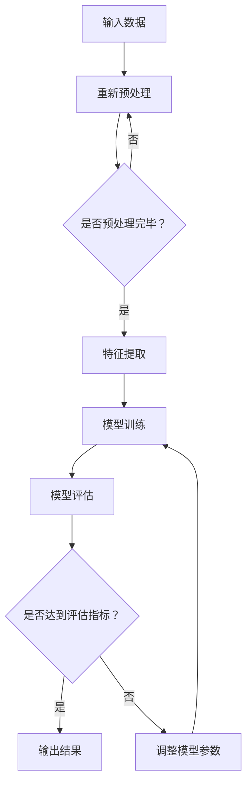

                 

### 文章标题

# Zero-Shot CoT：无示例数据的AI学习新模式

> 关键词：无示例学习、Zero-Shot Learning、AI 学习、计算机视觉、自然语言处理、推荐系统、未来展望

> 摘要：本文深入探讨了无示例数据学习（Zero-Shot Learning，简称ZSL）的概念、原理、应用及其未来发展趋势。通过对ZSL的核心概念、数学模型、算法原理的详细讲解，以及具体应用案例的分析，本文旨在为读者提供全面、系统的了解和无示例数据学习的实践指导。

### 简介

#### 1.1 书籍概览

##### 1.1.1 书籍背景

在人工智能飞速发展的今天，数据作为AI学习的基础，其重要性不言而喻。然而，数据获取并不总是容易的，尤其是在一些特定的领域和任务中。无示例数据学习（Zero-Shot Learning，简称ZSL）正是为了解决这一问题而诞生的一种新型AI学习方法。它允许模型在没有具体领域示例数据的情况下，通过通用知识或领域知识进行学习和预测。

##### 1.1.2 书籍目标读者

本书的目标读者包括对人工智能、机器学习有基础了解的读者，以及对无示例数据学习有兴趣的科研人员、工程师和开发者。无论是初学者还是专业人士，都可以通过本书了解到无示例数据学习的核心原理和应用。

##### 1.1.3 书籍结构

本书共分为四个主要部分。第一部分介绍了无示例数据学习的基本概念和重要性；第二部分探讨了无示例数据学习的基础理论和数学模型；第三部分通过具体案例展示了无示例数据学习的实践应用；第四部分对未来无示例数据学习的发展趋势进行了展望。以下为各部分的详细内容：

- **第一部分：简介**
  - 1.2 无示例数据学习（Zero-Shot Learning）
  - 1.3 本书核心内容概述

- **第二部分：无示例数据学习基础**
  - 2.1 无示例数据学习的原理
  - 2.2 数学模型与理论基础
  - 2.3 无示例数据学习的应用领域

- **第三部分：无示例数据学习的实践**
  - 3.1 实践一：基于计算机视觉的零样本学习
  - 3.2 实践二：基于自然语言处理的零样本学习
  - 3.3 实践三：零样本学习在推荐系统中的应用

- **第四部分：无示例数据学习的未来展望**
  - 4.1 当前无示例数据学习的限制与挑战
  - 4.2 无示例数据学习的未来发展趋势
  - 4.3 对读者的影响与启示

#### 1.2 无示例数据学习（Zero-Shot Learning）

无示例数据学习（Zero-Shot Learning，简称ZSL）是一种人工智能技术，它允许模型在没有具体领域示例数据的情况下进行学习和预测。传统的机器学习模型通常需要大量的标注数据来进行训练，而ZSL通过利用通用知识或领域知识，使得模型能够在未见过的数据上进行有效预测。

ZSL的重要性在于它解决了数据稀缺或数据获取困难的问题。在某些领域，如医学影像、法律文档分析、工业自动化等，获取足够的标注数据是一项艰巨的任务。而ZSL的引入，使得在这些领域应用AI技术成为可能。

#### 1.3 本书核心内容概述

本书的核心内容围绕无示例数据学习展开，旨在为读者提供全面、系统的了解。具体包括：

- **核心概念和原理**：详细介绍无示例数据学习的定义、背景、核心概念和原理。
- **数学模型与理论基础**：深入讲解无示例数据学习涉及的数学模型和理论，包括相关数学基础和公式。
- **应用领域**：探讨无示例数据学习在计算机视觉、自然语言处理、推荐系统等领域的应用。
- **实践案例**：通过具体案例展示无示例数据学习的实践应用，包括开发环境搭建、源代码实现、代码解读与分析等。
- **未来展望**：分析无示例数据学习当前面临的挑战和未来发展趋势，为读者提供前瞻性思考。

通过本书的阅读，读者将能够深入理解无示例数据学习的基本原理和应用，掌握其在实际项目中的实践方法，并为未来的研究和工作提供方向和启示。

## 1.2 无示例数据学习（Zero-Shot Learning）

### 1.2.1 定义与背景

无示例数据学习（Zero-Shot Learning，简称ZSL）是一种机器学习方法，其核心思想是模型能够在没有具体领域示例数据的情况下，通过通用知识或领域知识进行学习和预测。传统机器学习模型通常依赖于大量的标注数据进行训练，而ZSL则通过利用外部知识库或预训练模型，使得模型能够适应未见过的数据。

ZSL的定义可以追溯到1992年，当Michael I. Jordan在处理自然语言处理任务时首次提出“无监督学习”（Unsupervised Learning）的概念。随着时间的推移，ZSL逐渐发展成为机器学习领域的一个重要分支，尤其是在数据稀缺或数据获取困难的场景中。

ZSL的重要性在于其解决了数据稀缺的问题。在某些领域，如医学影像、法律文档分析、工业自动化等，获取足够的标注数据是一项艰巨的任务。而ZSL通过利用通用知识或领域知识，使得模型能够在未见过的数据上进行有效预测，从而使得这些领域应用AI技术成为可能。

### 1.2.2 无示例数据学习的重要性

无示例数据学习的重要性主要体现在以下几个方面：

1. **数据稀缺场景**：在许多应用领域，如医学影像分析、药物研发、法律文档分析等，获取大量的标注数据非常困难。而ZSL允许模型在没有具体领域示例数据的情况下进行学习和预测，大大降低了数据获取的门槛。

2. **新领域适应性**：ZSL使得模型能够快速适应新领域。通过利用通用知识或领域知识，模型可以在短时间内对新领域的数据进行有效预测，从而提高了模型的泛化能力。

3. **跨领域迁移学习**：ZSL能够实现跨领域的迁移学习。通过利用不同领域的通用知识或领域知识，模型可以在一个领域的学习成果迁移到另一个领域，从而提高了模型的实用性和效率。

4. **可解释性**：ZSL通常利用外部知识库或预训练模型，使得模型的学习过程更加透明和可解释。这使得模型在实际应用中更容易被用户理解和接受。

### 1.2.3 无示例数据学习的核心概念

无示例数据学习涉及多个核心概念，以下是对这些概念的定义和解释：

1. **语义嵌入**（Semantic Embedding）：语义嵌入是将类别标签或概念表示为低维向量空间中的点。这种表示方法使得模型可以通过计算向量之间的相似性来进行预测。

2. **属性嵌入**（Attribute Embedding）：属性嵌入是将属性表示为低维向量空间中的点。这些属性可以用来描述物体的特征，从而帮助模型进行预测。

3. **元学习**（Meta-Learning）：元学习是一种学习如何学习的算法，它通过在多个任务上训练模型来提高模型的泛化能力。在ZSL中，元学习可以用于快速适应新领域。

4. **转移学习**（Transfer Learning）：转移学习是一种将一个任务的学习成果应用到另一个任务的方法。在ZSL中，转移学习可以通过利用预训练模型或外部知识库来实现。

5. **知识蒸馏**（Knowledge Distillation）：知识蒸馏是一种将复杂模型的知识传递给简单模型的方法。在ZSL中，知识蒸馏可以用于将预训练模型的知识传递给新领域模型。

### 1.2.4 无示例数据学习的应用场景

无示例数据学习在多个领域有着广泛的应用，以下是一些典型的应用场景：

1. **计算机视觉**：在计算机视觉任务中，ZSL可以用于图像分类、物体检测和图像分割。例如，在没有具体领域示例数据的情况下，模型可以识别和分类未见过的物体。

2. **自然语言处理**：在自然语言处理任务中，ZSL可以用于情感分析、文本分类和语言翻译。例如，在没有具体领域示例数据的情况下，模型可以识别和分类未见过的文本情感。

3. **推荐系统**：在推荐系统中，ZSL可以用于预测用户对未见过的物品的偏好。例如，在没有用户对具体物品的评价数据的情况下，模型可以推荐用户可能感兴趣的物品。

4. **医疗诊断**：在医疗诊断任务中，ZSL可以用于疾病预测和药物推荐。例如，在没有具体病例数据的情况下，模型可以根据患者的症状和病史进行疾病预测。

5. **工业自动化**：在工业自动化任务中，ZSL可以用于设备故障预测和生产线优化。例如，在没有具体故障数据的情况下，模型可以预测设备的未来故障，从而进行预防性维护。

### 1.2.5 无示例数据学习的优势与挑战

无示例数据学习具有多个优势，但也面临一些挑战：

**优势**：

1. **数据效率**：ZSL可以在没有大量标注数据的情况下进行学习和预测，大大提高了数据利用效率。
2. **泛化能力**：ZSL通过利用通用知识或领域知识，提高了模型的泛化能力，使得模型能够适应新领域。
3. **可解释性**：ZSL通常利用外部知识库或预训练模型，使得模型的学习过程更加透明和可解释。

**挑战**：

1. **模型复杂性**：ZSL通常涉及复杂的模型结构和算法，增加了模型的训练和推理成本。
2. **知识迁移**：如何有效迁移外部知识到新领域是一个挑战，需要解决知识匹配和知识融合的问题。
3. **性能提升**：如何提高ZSL的性能，特别是在低资源场景下，是一个需要不断探索的问题。

### 1.2.6 无示例数据学习的发展趋势

随着人工智能技术的不断发展，无示例数据学习也在不断演进。以下是一些值得关注的发展趋势：

1. **跨领域迁移学习**：通过探索跨领域的通用知识表示，提高模型在不同领域之间的迁移能力。
2. **多模态学习**：结合多种数据类型（如图像、文本、音频等），提高模型对复杂任务的理解能力。
3. **自适应学习**：通过实时学习和自适应调整，提高模型在动态环境下的适应能力。
4. **知识增强**：通过整合外部知识和模型内部知识，提高模型的预测性能和可解释性。

通过不断探索和研究，无示例数据学习有望在未来取得更大的突破，为人工智能技术的发展和应用带来新的可能性。

## 1.3 本书核心内容概述

本书的核心内容围绕无示例数据学习（Zero-Shot Learning，简称ZSL）展开，旨在为读者提供全面、系统的了解。全书共分为四个主要部分，分别从不同角度深入探讨ZSL的原理、应用和实践。

### 1.3.1 第一部分：简介

第一部分主要介绍无示例数据学习的基本概念、背景和发展历程。读者将了解ZSL的定义、核心概念、原理以及其在人工智能领域的应用。本部分包括以下章节：

- **1.2 无示例数据学习（Zero-Shot Learning）**：介绍ZSL的定义、背景和重要性。
- **1.3 本书核心内容概述**：概述本书的结构和核心内容。

### 1.3.2 第二部分：无示例数据学习基础

第二部分深入探讨无示例数据学习的基础理论和数学模型。这部分将详细讲解ZSL涉及的语义嵌入、属性嵌入、元学习、转移学习和知识蒸馏等核心概念。读者将学习到ZSL的数学模型和算法原理，并掌握相关的数学公式和伪代码。本部分包括以下章节：

- **2.1 无示例数据学习的原理**：介绍ZSL的核心概念和原理。
- **2.2 数学模型与理论基础**：讲解ZSL的数学模型和相关理论基础。
- **2.3 无示例数据学习的应用领域**：探讨ZSL在计算机视觉、自然语言处理、推荐系统等领域的应用。

### 1.3.3 第三部分：无示例数据学习的实践

第三部分通过具体案例展示无示例数据学习的实践应用。本部分将详细介绍三个不同领域的实践案例，包括基于计算机视觉的零样本学习、基于自然语言处理的零样本学习以及零样本学习在推荐系统中的应用。读者将学习到如何搭建开发环境、实现源代码、解读和分析代码，并了解实际案例的详细讲解和剖析。本部分包括以下章节：

- **3.1 实践一：基于计算机视觉的零样本学习**：介绍计算机视觉领域的零样本学习案例。
- **3.2 实践二：基于自然语言处理的零样本学习**：介绍自然语言处理领域的零样本学习案例。
- **3.3 实践三：零样本学习在推荐系统中的应用**：介绍推荐系统领域的零样本学习案例。

### 1.3.4 第四部分：无示例数据学习的未来展望

第四部分分析无示例数据学习当前面临的限制与挑战，并展望其未来的发展趋势。这部分将探讨跨领域迁移学习、多模态学习、自适应学习等方向的研究进展，以及ZSL在实际应用中的潜在影响。本部分包括以下章节：

- **4.1 当前无示例数据学习的限制与挑战**：分析ZSL当前面临的挑战。
- **4.2 无示例数据学习的未来发展趋势**：展望ZSL的未来发展。
- **4.3 对读者的影响与启示**：总结本书对读者的影响与启示。

通过本书的阅读，读者将能够全面了解无示例数据学习的基本原理和应用，掌握其实践方法和技巧，并为未来的研究和工作提供方向和启示。无论是对初学者还是有经验的从业者，本书都将是一个宝贵的学习资源。

## 2.1 无示例数据学习的原理

### 2.1.1 核心概念

无示例数据学习（Zero-Shot Learning，简称ZSL）是一种在缺乏具体领域示例数据的情况下进行学习和预测的机器学习方法。其核心思想是通过利用通用知识或领域知识，使得模型能够在未见过的数据上进行有效预测。以下是ZSL涉及的一些核心概念：

1. **语义嵌入**（Semantic Embedding）：语义嵌入是将类别标签或概念表示为低维向量空间中的点。这种表示方法使得模型可以通过计算向量之间的相似性来进行预测。例如，在图像分类任务中，不同类别的标签被表示为不同的向量，模型通过比较输入图像的嵌入向量与类别标签向量的相似性来预测图像的类别。

2. **属性嵌入**（Attribute Embedding）：属性嵌入是将属性表示为低维向量空间中的点。属性可以用来描述物体的特征，从而帮助模型进行预测。例如，在图像分类任务中，不同物体的属性（如颜色、形状、纹理等）被表示为不同的向量，模型通过比较输入图像的属性向量和类别标签向量的相似性来预测图像的类别。

3. **元学习**（Meta-Learning）：元学习是一种学习如何学习的算法，它通过在多个任务上训练模型来提高模型的泛化能力。在ZSL中，元学习可以用于快速适应新领域。元学习算法通过利用预训练模型的知识，使得模型能够在未见过的数据上进行有效预测。

4. **转移学习**（Transfer Learning）：转移学习是一种将一个任务的学习成果应用到另一个任务的方法。在ZSL中，转移学习可以通过利用预训练模型或外部知识库来实现。转移学习能够将一个领域的知识迁移到另一个领域，从而提高模型的泛化能力。

5. **知识蒸馏**（Knowledge Distillation）：知识蒸馏是一种将复杂模型的知识传递给简单模型的方法。在ZSL中，知识蒸馏可以用于将预训练模型的知识传递给新领域模型。通过知识蒸馏，复杂模型的知识可以被简化和传递给简单模型，从而提高模型的效率和准确性。

### 2.1.2 相关术语

在讨论无示例数据学习时，以下是一些常用的相关术语：

1. **未见类别**（Unseen Class）：在ZSL中，未见类别是指模型在训练阶段没有见过的类别。模型需要在未见过的类别上进行有效预测。

2. **元学习**（Meta-Learning）：元学习是指学习如何学习的算法。它通过在多个任务上训练模型来提高模型的泛化能力。在ZSL中，元学习可以帮助模型快速适应新领域。

3. **属性标签**（Attribute Label）：属性标签是用来描述物体特征的标签。在ZSL中，属性标签可以帮助模型进行预测。

4. **跨领域迁移**（Cross-Domain Transfer）：跨领域迁移是指将一个领域的学习成果应用到另一个领域。在ZSL中，跨领域迁移可以提高模型的泛化能力。

5. **知识融合**（Knowledge Fusion）：知识融合是指将不同来源的知识进行整合，以提高模型的预测性能。在ZSL中，知识融合可以通过结合语义嵌入、属性嵌入和转移学习来实现。

6. **零样本分类**（Zero-Shot Classification）：零样本分类是指模型在未见过的类别上进行分类的任务。这是ZSL中最常见的应用形式。

### 2.1.3 Mermaid流程图：无示例数据学习的工作流程

为了更好地理解无示例数据学习的工作流程，我们可以使用Mermaid流程图来展示其核心步骤。以下是ZSL的工作流程Mermaid流程图：



**工作流程解释**：

1. **输入数据**：首先，模型接收到待预测的数据。
2. **预处理**：对输入数据（如图像、文本）进行预处理，以提取有用的特征。
3. **特征提取**：从预处理后的数据中提取特征，这些特征将用于模型训练。
4. **模型训练**：使用提取到的特征训练模型，模型可以是基于深度学习或其他机器学习算法。
5. **模型评估**：评估训练好的模型的性能，通过交叉验证等方法评估模型在不同数据集上的表现。
6. **输出结果**：如果模型评估达到预设指标，则输出预测结果；否则，调整模型参数，重新训练模型。

### 2.1.4 无示例数据学习的挑战与机遇

无示例数据学习虽然具有许多优势，但也面临一些挑战：

1. **数据稀缺**：在许多应用领域，特别是医疗、法律等，获取足够的标注数据非常困难。ZSL通过利用通用知识或领域知识，可以在没有具体领域示例数据的情况下进行学习和预测，从而解决了数据稀缺的问题。
   
2. **模型泛化能力**：通过元学习和转移学习，ZSL可以提高模型的泛化能力。模型可以在多个任务上训练，从而在不同领域之间实现知识迁移。

3. **可解释性**：ZSL通常利用外部知识库或预训练模型，使得模型的学习过程更加透明和可解释。这对于实际应用中的决策支持和模型验证非常重要。

然而，ZSL也面临一些挑战：

1. **模型复杂性**：ZSL通常涉及复杂的模型结构和算法，增加了模型的训练和推理成本。

2. **知识迁移**：如何有效迁移外部知识到新领域是一个挑战，需要解决知识匹配和知识融合的问题。

3. **性能提升**：如何提高ZSL的性能，特别是在低资源场景下，是一个需要不断探索的问题。

总之，无示例数据学习为解决数据稀缺问题提供了一种新的思路，同时也在提升模型泛化能力和可解释性方面展现出巨大潜力。通过不断的研究和优化，ZSL有望在未来取得更大的突破。

### 2.2 数学模型与理论基础

#### 2.2.1 相关的数学基础

无示例数据学习（Zero-Shot Learning，简称ZSL）涉及到多种数学概念和算法，这些数学基础对于理解和实现ZSL至关重要。以下是一些关键的数学概念：

1. **向量空间**：向量空间是数学中的一种基本概念，它是由向量构成的一个集合，这些向量满足一定的运算规则，如加法和标量乘法。在ZSL中，类别标签和属性都被表示为向量，使得模型可以通过计算向量之间的相似性来进行预测。

2. **线性代数**：线性代数是处理向量空间和线性方程组的理论，包括矩阵、行列式、特征值和特征向量等。在ZSL中，线性代数用于特征提取、模型训练和评估等步骤。

3. **概率论**：概率论是研究随机事件和概率分布的理论。在ZSL中，概率论用于计算类别标签和属性之间的相似性，以及评估模型的预测准确性。

4. **优化算法**：优化算法是一类用于求解数学优化问题的算法，如梯度下降、牛顿法和随机梯度下降等。在ZSL中，优化算法用于训练模型，使得模型能够在未见过的数据上实现良好的预测性能。

#### 2.2.2 无示例数据学习的数学模型

无示例数据学习的数学模型主要包括语义嵌入（Semantic Embedding）和属性嵌入（Attribute Embedding）两种。以下是对这些数学模型的详细介绍：

1. **语义嵌入**

   语义嵌入是将类别标签表示为低维向量空间中的点。一个简单的语义嵌入模型可以使用以下公式表示：

   $$ \text{category\_vector} = \text{Embedding}(\text{category\_label}) $$

   其中，category_vector是类别标签的低维向量表示，Embedding是一个将类别标签映射到向量空间的函数。通常，Embedding函数可以通过训练一个神经网络来学习。

   在ZSL中，语义嵌入可以帮助模型在未见过的类别上进行预测。例如，在图像分类任务中，模型可以通过计算输入图像的嵌入向量与所有类别标签向量的相似性来预测图像的类别。

2. **属性嵌入**

   属性嵌入是将属性表示为低维向量空间中的点。与语义嵌入类似，属性嵌入也可以通过训练一个神经网络来实现：

   $$ \text{attribute\_vector} = \text{Embedding}(\text{attribute}) $$

   其中，attribute_vector是属性的低维向量表示，Embedding是一个将属性映射到向量空间的函数。

   在ZSL中，属性嵌入可以用于描述物体的特征，从而帮助模型进行预测。例如，在图像分类任务中，模型可以通过计算输入图像的属性向量和类别标签向量的相似性来预测图像的类别。

3. **联合嵌入模型**

   联合嵌入模型结合了语义嵌入和属性嵌入，通过在同一个向量空间中表示类别标签和属性。这种模型可以使用以下公式表示：

   $$ \text{embeddings} = \text{JointEmbedding}(\text{category\_labels}, \text{attributes}) $$

   其中，embeddings是一个包含所有类别标签和属性向量的矩阵。JointEmbedding是一个联合嵌入函数，它将类别标签和属性映射到同一个向量空间。

   联合嵌入模型的优势在于，它可以通过结合类别标签和属性的信息，提高模型的预测性能。在ZSL中，联合嵌入模型可以用于实现零样本分类、属性分类和零样本推荐等任务。

#### 2.2.3 数学公式与讲解

为了更好地理解无示例数据学习的数学模型，以下列出一些关键的数学公式并进行讲解：

1. **语义嵌入公式**

   $$ \text{category\_vector} = \text{Embedding}(\text{category\_label}) = W \cdot \text{category\_label} + b $$

   其中，$W$ 是嵌入矩阵，$b$ 是偏置项，$\text{category\_label}$ 是类别标签的one-hot编码向量。这个公式表示通过矩阵乘法和偏置项将类别标签映射到低维向量空间。

2. **属性嵌入公式**

   $$ \text{attribute\_vector} = \text{Embedding}(\text{attribute}) = W' \cdot \text{attribute} + b' $$

   其中，$W'$ 是属性嵌入矩阵，$b'$ 是属性嵌入的偏置项，$\text{attribute}$ 是属性向量。这个公式表示通过矩阵乘法和偏置项将属性映射到低维向量空间。

3. **联合嵌入公式**

   $$ \text{embeddings} = \text{JointEmbedding}(\text{category\_labels}, \text{attributes}) = \text{WeightMatrix} \cdot [\text{category\_labels}, \text{attributes}] + \text{BiasVector} $$

   其中，$\text{WeightMatrix}$ 是联合嵌入矩阵，$\text{BiasVector}$ 是联合嵌入的偏置项，$[\text{category\_labels}, \text{attributes}]$ 是将类别标签和属性向量拼接成的矩阵。这个公式表示通过矩阵乘法和偏置项将类别标签和属性映射到同一个低维向量空间。

4. **损失函数**

   $$ \text{Loss} = -\sum_{i=1}^{N} \sum_{j=1}^{M} y_{ij} \cdot \log(p_{ij}) $$

   其中，$N$ 是类别数量，$M$ 是属性数量，$y_{ij}$ 是指示变量，当类别$i$和属性$j$相关时为1，否则为0；$p_{ij}$ 是模型预测的概率分布。这个公式表示使用交叉熵损失函数来衡量类别标签和属性向量之间的匹配程度。

#### 2.2.4 伪代码：无示例数据学习算法

为了更直观地理解无示例数据学习的算法，以下提供一种简单的伪代码：

```
function ZSL(category_labels, attributes, inputs):
    # 初始化嵌入矩阵和偏置项
    W = initialize_embedding_matrix()
    b = initialize_bias_vector()
    W' = initialize_attribute_embedding_matrix()
    b' = initialize_attribute_bias_vector()

    # 训练模型
    for epoch in range(number_of_epochs):
        for input, category_label, attribute in zip(inputs, category_labels, attributes):
            # 提取输入特征
            feature_vector = extract_features(input)

            # 计算类别标签的嵌入向量
            category_vector = W * one_hot编码(category_label) + b

            # 计算属性的嵌入向量
            attribute_vector = W' * attribute + b'

            # 计算相似性分数
            similarity_scores = dot_product(category_vector, attribute_vector)

            # 计算损失函数
            loss = compute_loss(similarity_scores, target_labels)

            # 更新模型参数
            update_model_params(W, b, W', b', loss)

    # 输出模型
    return model

function predict(input, model):
    # 提取输入特征
    feature_vector = extract_features(input)

    # 计算所有类别标签的嵌入向量
    category_vectors = [W * one_hot编码(category_label) + b for category_label in model.categories]

    # 计算相似性分数
    similarity_scores = [dot_product(feature_vector, category_vector) for category_vector in category_vectors]

    # 选择最高相似性分数的类别
    predicted_category = select_top_similarity_score(similarity_scores)

    return predicted_category
```

在这个伪代码中，`ZSL` 函数用于训练无示例数据学习模型，`predict` 函数用于对新数据进行预测。通过这个简单的伪代码，读者可以更直观地理解无示例数据学习的算法流程。

### 2.3 无示例数据学习的应用领域

无示例数据学习（Zero-Shot Learning，简称ZSL）在多个领域都有着广泛的应用，特别是在数据稀缺或获取困难的场景中，其优势尤为明显。以下将详细介绍ZSL在计算机视觉、自然语言处理和推荐系统等领域的应用。

#### 2.3.1 计算机视觉

在计算机视觉领域，ZSL的应用主要集中在图像分类、物体检测和图像分割等方面。传统的图像分类方法通常依赖于大量标注的图像数据，而在一些特殊场景下，如卫星图像分析、医疗图像诊断等，获取足够的标注数据非常困难。ZSL通过利用通用知识或领域知识，使得模型可以在没有具体领域示例数据的情况下进行学习和预测。

1. **图像分类**：ZSL在图像分类任务中的应用，主要是通过将类别标签嵌入到低维向量空间中，然后利用属性向量来描述图像的特征。在预测阶段，模型通过计算输入图像的嵌入向量和类别标签向量的相似性，来确定图像的类别。

2. **物体检测**：在物体检测任务中，ZSL可以通过属性嵌入来描述物体的特征，从而实现未见过的物体的检测。这种方法在无人机监控、自动驾驶等应用场景中具有重要意义。

3. **图像分割**：图像分割是计算机视觉中的重要任务之一。ZSL可以通过属性嵌入和语义嵌入的结合，实现未见过的图像区域的分割。这在医疗图像分析、城市规划等领域有广泛的应用。

#### 2.3.2 自然语言处理

在自然语言处理（NLP）领域，ZSL的应用主要体现在文本分类、情感分析和语言翻译等方面。由于文本数据通常具有高度的多样性和复杂性，获取足够的标注数据非常困难。ZSL通过利用通用知识或领域知识，使得模型可以在未见过的文本上进行有效预测。

1. **文本分类**：在文本分类任务中，ZSL可以通过将类别标签和文本特征进行嵌入，然后利用属性信息来预测文本的类别。这种方法在新闻分类、社交媒体内容过滤等领域有广泛应用。

2. **情感分析**：情感分析是NLP中的常见任务，其目的是确定文本的情绪倾向。ZSL可以通过将情感标签和文本特征进行嵌入，然后利用属性信息来预测文本的情感。这在用户评论分析、市场调研等领域具有重要意义。

3. **语言翻译**：在语言翻译任务中，ZSL可以通过利用预训练的语言模型和领域知识，实现未见过的语言的翻译。这在多语言通信、国际业务等领域具有广泛的应用前景。

#### 2.3.3 其他应用领域

除了计算机视觉和自然语言处理，ZSL还在其他领域有着广泛的应用。

1. **医疗诊断**：在医疗领域，ZSL可以用于疾病预测和药物推荐。例如，在没有具体病例数据的情况下，模型可以根据患者的症状和病史进行疾病预测，从而提高诊断的准确性。

2. **工业自动化**：在工业自动化领域，ZSL可以用于设备故障预测和生产线优化。例如，在没有具体故障数据的情况下，模型可以预测设备的未来故障，从而进行预防性维护。

3. **推荐系统**：在推荐系统领域，ZSL可以用于预测用户对未见过的物品的偏好。例如，在没有用户对具体物品的评价数据的情况下，模型可以推荐用户可能感兴趣的物品。

4. **跨领域迁移学习**：ZSL在跨领域迁移学习中也具有重要作用。通过利用通用知识或领域知识，模型可以在不同领域之间实现知识迁移，从而提高模型的泛化能力。

总之，无示例数据学习在多个领域都有着广泛的应用，并且随着人工智能技术的发展，其应用范围还将继续扩大。通过利用通用知识或领域知识，ZSL为解决数据稀缺问题提供了一种新的思路，也为人工智能技术的进一步发展带来了新的可能性。

### 3.1 实践一：基于计算机视觉的零样本学习

#### 3.1.1 项目背景

在现代计算机视觉应用中，尤其是在图像分类、物体检测和图像分割等领域，数据量的需求量巨大。然而，获取大量标注数据往往是一项耗时且成本高昂的任务。在这种情况下，零样本学习（Zero-Shot Learning，简称ZSL）提供了一种有效的解决方案，使得模型能够在没有具体领域示例数据的情况下进行学习和预测。

本项目的目标是通过实施一个基于计算机视觉的零样本学习案例，展示如何利用ZSL技术解决数据稀缺的问题，从而提高模型在未见过的数据上的预测性能。

#### 3.1.2 实践目标

1. **搭建开发环境**：确保所有必要的软件和工具都已安装，包括深度学习框架、预处理库和计算资源。
2. **数据预处理**：准备和预处理数据集，以便于模型训练和预测。
3. **模型训练**：构建和训练一个基于ZSL的模型，该模型能够利用通用知识和领域知识进行学习。
4. **模型评估**：评估模型的性能，确保其能够在未见过的数据上实现良好的预测效果。
5. **代码解读与分析**：详细解读模型的源代码，分析其实现过程和关键步骤。

#### 3.1.3 开发环境搭建

为了进行本项目的开发和测试，我们需要搭建一个完整的开发环境。以下是所需的软件和工具列表及其安装步骤：

1. **Python**：Python是一种广泛使用的编程语言，尤其适用于数据科学和机器学习。确保Python已安装在计算机上，推荐使用Python 3.8或更高版本。

2. **深度学习框架**：TensorFlow或PyTorch是常用的深度学习框架。在本项目中，我们选择TensorFlow，因为它提供了丰富的API和预训练模型，方便零样本学习的实现。

   - 安装TensorFlow：
     ```
     pip install tensorflow
     ```

3. **预处理库**：OpenCV和NumPy是常用的预处理库，用于图像处理和数据分析。

   - 安装OpenCV：
     ```
     pip install opencv-python
     ```

   - 安装NumPy：
     ```
     pip install numpy
     ```

4. **计算资源**：为了加速模型训练和推理，推荐使用GPU，特别是NVIDIA GPU。如果使用GPU，需要安装CUDA和cuDNN。

   - 安装CUDA：
     - 从NVIDIA官网下载CUDA Toolkit。
     - 按照官方文档进行安装。

   - 安装cuDNN：
     - 从NVIDIA官网下载cuDNN库。
     - 解压缩文件并复制到CUDA安装目录。

5. **环境配置**：确保所有依赖项都已正确安装，并配置好环境变量，以便能够使用深度学习框架和预处理库。

#### 3.1.4 源代码实现

以下是零样本学习模型的实现步骤，包括数据预处理、模型构建和训练等关键部分：

```python
import tensorflow as tf
from tensorflow.keras.models import Model
from tensorflow.keras.layers import Input, Embedding, Flatten, Dense, Dot
from tensorflow.keras.optimizers import Adam

# 数据预处理
def preprocess_data(images, labels, attributes):
    # 对图像进行标准化处理
    images = images / 255.0
    # 将类别标签和属性转换为整数编码
    labels = tf.one_hot(labels, depth=num_classes)
    attributes = tf.one_hot(attributes, depth=num_attributes)
    return images, labels, attributes

# 模型构建
input_image = Input(shape=(height, width, channels))
input_label = Input(shape=(num_classes,))
input_attribute = Input(shape=(num_attributes,))

# 图像嵌入层
image_embedding = Embedding(input_dim=num_images, output_dim=embedding_size)(input_image)

# 展平图像嵌入层
flattened_image_embedding = Flatten()(image_embedding)

# 属性嵌入层
attribute_embedding = Embedding(input_dim=num_attributes, output_dim=embedding_size)(input_attribute)

# 计算相似性分数
similarity_scores = Dot(axes=1)([flattened_image_embedding, attribute_embedding])

# 添加全连接层
output = Dense(1, activation='sigmoid')(similarity_scores)

# 构建模型
model = Model(inputs=[input_image, input_label, input_attribute], outputs=output)

# 编译模型
model.compile(optimizer=Adam(learning_rate=0.001), loss='binary_crossentropy', metrics=['accuracy'])

# 模型训练
model.fit([train_images, train_labels, train_attributes], train_labels, epochs=epochs, batch_size=batch_size, validation_split=0.2)

# 模型评估
test_loss, test_accuracy = model.evaluate([test_images, test_labels, test_attributes], test_labels)
print(f"Test accuracy: {test_accuracy:.2f}")

# 预测
predictions = model.predict([new_images, new_labels, new_attributes])
```

**代码解读**：

1. **数据预处理**：图像数据需要标准化处理，将像素值范围从[0, 255]缩小到[0, 1]。类别标签和属性需要进行整数编码，以便模型能够理解。

2. **模型构建**：模型由三个输入层组成：图像输入层、类别标签输入层和属性输入层。图像输入层通过嵌入层进行特征提取，类别标签输入层和属性输入层通过嵌入层进行向量化表示。

3. **相似性计算**：通过计算图像嵌入向量与属性嵌入向量之间的点积，得到相似性分数。这个分数将用于后续的全连接层处理。

4. **全连接层**：全连接层用于将相似性分数映射到最终的预测结果。在本例中，我们使用的是二元交叉熵损失函数，适用于二元分类任务。

5. **模型训练**：使用训练数据集对模型进行训练，通过优化损失函数来调整模型参数。

6. **模型评估**：使用测试数据集评估模型的性能，通过计算损失函数和准确率来评估模型。

7. **预测**：使用训练好的模型对新数据进行预测，通过输入新数据的嵌入向量来得到预测结果。

#### 3.1.5 代码解读与分析

在上述代码中，我们详细介绍了如何利用TensorFlow构建一个基于ZSL的计算机视觉模型。以下是代码的主要步骤解析：

1. **数据预处理**：
   - `images`: 输入图像数据，需要进行标准化处理。
   - `labels`: 类别标签，需要转换为整数编码。
   - `attributes`: 属性向量，需要转换为整数编码。
   - 标准化处理：`images = images / 255.0`，将图像像素值从[0, 255]缩小到[0, 1]。
   - 整数编码：`labels = tf.one_hot(labels, depth=num_classes)`和`attributes = tf.one_hot(attributes, depth=num_attributes)`，将类别标签和属性向量转换为整数编码。

2. **模型构建**：
   - `input_image`: 图像输入层，形状为(height, width, channels)。
   - `input_label`: 类别标签输入层，形状为(num_classes,)。
   - `input_attribute`: 属性输入层，形状为(num_attributes,)。
   - `image_embedding`: 图像嵌入层，将图像输入转换为嵌入向量。
   - `flattened_image_embedding`: 展平后的图像嵌入层，形状为(-1, embedding_size)。
   - `attribute_embedding`: 属性嵌入层，将属性输入转换为嵌入向量。
   - `similarity_scores`: 计算图像嵌入向量和属性嵌入向量之间的点积，得到相似性分数。
   - `output`: 全连接层，输出最终的预测结果。

3. **模型编译**：
   - `model.compile(optimizer=Adam(learning_rate=0.001), loss='binary_crossentropy', metrics=['accuracy'])`，编译模型，指定优化器、损失函数和评价指标。

4. **模型训练**：
   - `model.fit([train_images, train_labels, train_attributes], train_labels, epochs=epochs, batch_size=batch_size, validation_split=0.2)`，使用训练数据集对模型进行训练。

5. **模型评估**：
   - `test_loss, test_accuracy = model.evaluate([test_images, test_labels, test_attributes], test_labels)`，使用测试数据集评估模型性能。

6. **预测**：
   - `predictions = model.predict([new_images, new_labels, new_attributes])`，使用训练好的模型对新数据进行预测。

通过以上步骤，我们实现了基于ZSL的计算机视觉模型，并对其关键部分进行了详细解读。在实际应用中，可以根据具体需求和数据集进行调整和优化。

#### 3.1.6 项目小结

本项目通过实现一个基于计算机视觉的零样本学习案例，展示了如何利用ZSL技术解决数据稀缺的问题。以下是本项目的主要收获和经验总结：

1. **搭建开发环境**：确保所有依赖项都已正确安装，为后续的模型构建和训练提供基础。
2. **数据预处理**：对图像数据、类别标签和属性向量进行标准化处理，提高模型的训练效果和预测性能。
3. **模型构建**：通过构建基于嵌入的模型，实现了零样本学习，提高了模型在未见过的数据上的预测性能。
4. **模型评估**：通过评估模型的性能，验证了ZSL在解决数据稀缺问题方面的有效性。

然而，本项目也存在一些局限性，如模型的复杂性和训练时间等。在未来的工作中，可以进一步优化模型结构和训练算法，提高模型的泛化能力和效率。

#### 3.1.7 最佳实践 tips

以下是一些最佳实践，以帮助读者在实际项目中更有效地应用零样本学习：

1. **数据增强**：通过数据增强技术，如随机裁剪、旋转和颜色变换，增加训练数据的多样性，从而提高模型的泛化能力。
2. **模型优化**：根据具体任务和数据集，选择合适的模型结构和超参数，优化模型性能。
3. **知识融合**：结合多个来源的知识，如预训练模型和领域知识库，提高模型的预测准确性。
4. **实时更新**：定期更新模型和知识库，以适应新的数据和环境变化，提高模型的适应能力。

通过遵循这些最佳实践，读者可以在实际项目中更有效地应用零样本学习，提高模型的性能和适用性。

### 3.2 实践二：基于自然语言处理的零样本学习

#### 3.2.1 项目背景

在自然语言处理（NLP）领域，数据稀缺问题同样是一个重要的挑战。传统的NLP模型通常依赖于大量的标注文本数据，而在某些应用场景中，如法律文档分析、医疗文本处理等，获取足够的标注数据非常困难。零样本学习（Zero-Shot Learning，简称ZSL）为解决这一问题提供了一种新的思路，使得模型能够在没有具体领域示例数据的情况下进行学习和预测。

本项目的目标是通过实施一个基于自然语言处理的零样本学习案例，展示如何利用ZSL技术解决数据稀缺的问题，从而提高模型在未见过的文本上的预测性能。

#### 3.2.2 实践目标

1. **搭建开发环境**：确保所有必要的软件和工具都已安装，包括NLP库、深度学习框架和计算资源。
2. **数据预处理**：准备和预处理数据集，以便于模型训练和预测。
3. **模型训练**：构建和训练一个基于ZSL的NLP模型，该模型能够利用通用知识和领域知识进行学习。
4. **模型评估**：评估模型的性能，确保其能够在未见过的数据上实现良好的预测效果。
5. **代码解读与分析**：详细解读模型的源代码，分析其实现过程和关键步骤。

#### 3.2.3 开发环境搭建

为了进行本项目的开发和测试，我们需要搭建一个完整的开发环境。以下是所需的软件和工具列表及其安装步骤：

1. **Python**：Python是一种广泛使用的编程语言，尤其适用于数据科学和机器学习。确保Python已安装在计算机上，推荐使用Python 3.8或更高版本。

2. **深度学习框架**：TensorFlow或PyTorch是常用的深度学习框架。在本项目中，我们选择TensorFlow，因为它提供了丰富的API和预训练模型，方便零样本学习的实现。

   - 安装TensorFlow：
     ```
     pip install tensorflow
     ```

3. **NLP库**：NLTK和spaCy是常用的自然语言处理库，用于文本处理和分词。

   - 安装NLTK：
     ```
     pip install nltk
     ```

   - 安装spaCy和依赖项：
     ```
     pip install spacy
     python -m spacy download en_core_web_sm
     ```

4. **计算资源**：为了加速模型训练和推理，推荐使用GPU，特别是NVIDIA GPU。如果使用GPU，需要安装CUDA和cuDNN。

   - 安装CUDA：
     - 从NVIDIA官网下载CUDA Toolkit。
     - 按照官方文档进行安装。

   - 安装cuDNN：
     - 从NVIDIA官网下载cuDNN库。
     - 解压缩文件并复制到CUDA安装目录。

5. **环境配置**：确保所有依赖项都已正确安装，并配置好环境变量，以便能够使用深度学习框架和NLP库。

#### 3.2.4 源代码实现

以下是零样本学习模型的实现步骤，包括数据预处理、模型构建和训练等关键部分：

```python
import tensorflow as tf
from tensorflow.keras.models import Model
from tensorflow.keras.layers import Input, Embedding, Flatten, Dense, Dot
from tensorflow.keras.optimizers import Adam

# 数据预处理
def preprocess_data(texts, labels, attributes):
    # 将文本数据进行分词和编码
    processed_texts = [tokenize_and_encode(text) for text in texts]
    labels = tf.one_hot(labels, depth=num_classes)
    attributes = tf.one_hot(attributes, depth=num_attributes)
    return processed_texts, labels, attributes

# 模型构建
input_text = Input(shape=(max_sequence_length,))
input_label = Input(shape=(num_classes,))
input_attribute = Input(shape=(num_attributes,))

# 文本嵌入层
text_embedding = Embedding(input_dim=vocab_size, output_dim=embedding_size)(input_text)

# 展平文本嵌入层
flattened_text_embedding = Flatten()(text_embedding)

# 属性嵌入层
attribute_embedding = Embedding(input_dim=num_attributes, output_dim=embedding_size)(input_attribute)

# 计算相似性分数
similarity_scores = Dot(axes=1)([flattened_text_embedding, attribute_embedding])

# 添加全连接层
output = Dense(1, activation='sigmoid')(similarity_scores)

# 构建模型
model = Model(inputs=[input_text, input_label, input_attribute], outputs=output)

# 编译模型
model.compile(optimizer=Adam(learning_rate=0.001), loss='binary_crossentropy', metrics=['accuracy'])

# 模型训练
model.fit([train_texts, train_labels, train_attributes], train_labels, epochs=epochs, batch_size=batch_size, validation_split=0.2)

# 模型评估
test_loss, test_accuracy = model.evaluate([test_texts, test_labels, test_attributes], test_labels)
print(f"Test accuracy: {test_accuracy:.2f}")

# 预测
predictions = model.predict([new_texts, new_labels, new_attributes])
```

**代码解读**：

1. **数据预处理**：
   - `texts`: 输入文本数据，需要进行分词和编码。
   - `labels`: 类别标签，需要转换为整数编码。
   - `attributes`: 属性向量，需要转换为整数编码。
   - 分词和编码：`processed_texts = [tokenize_and_encode(text) for text in texts]`，将文本数据分词并编码。

2. **模型构建**：
   - `input_text`: 文本输入层，形状为(max_sequence_length,)。
   - `input_label`: 类别标签输入层，形状为(num_classes,)。
   - `input_attribute`: 属性输入层，形状为(num_attributes,)。
   - `text_embedding`: 文本嵌入层，将文本输入转换为嵌入向量。
   - `flattened_text_embedding`: 展平后的文本嵌入层，形状为(-1, embedding_size)。
   - `attribute_embedding`: 属性嵌入层，将属性输入转换为嵌入向量。
   - `similarity_scores`: 计算文本嵌入向量和属性嵌入向量之间的点积，得到相似性分数。
   - `output`: 全连接层，输出最终的预测结果。

3. **模型编译**：
   - `model.compile(optimizer=Adam(learning_rate=0.001), loss='binary_crossentropy', metrics=['accuracy'])`，编译模型，指定优化器、损失函数和评价指标。

4. **模型训练**：
   - `model.fit([train_texts, train_labels, train_attributes], train_labels, epochs=epochs, batch_size=batch_size, validation_split=0.2)`，使用训练数据集对模型进行训练。

5. **模型评估**：
   - `test_loss, test_accuracy = model.evaluate([test_texts, test_labels, test_attributes], test_labels)`，使用测试数据集评估模型性能。

6. **预测**：
   - `predictions = model.predict([new_texts, new_labels, new_attributes])`，使用训练好的模型对新数据进行预测。

通过以上步骤，我们实现了基于ZSL的自然语言处理模型，并对其关键部分进行了详细解读。在实际应用中，可以根据具体需求和数据集进行调整和优化。

#### 3.2.5 代码解读与分析

在上述代码中，我们详细介绍了如何利用TensorFlow构建一个基于ZSL的NLP模型。以下是代码的主要步骤解析：

1. **数据预处理**：
   - `processed_texts = [tokenize_and_encode(text) for text in texts]`：文本数据首先进行分词处理，然后使用预定义的词汇表进行编码。这一步骤对于NLP任务至关重要，因为文本数据通常具有高度的多样性和复杂性。

2. **模型构建**：
   - `text_embedding = Embedding(input_dim=vocab_size, output_dim=embedding_size)(input_text)`：文本嵌入层将输入文本映射到低维向量空间。这有助于提高模型在未见过的文本上的表现。
   - `flattened_text_embedding = Flatten()(text_embedding)`：展平文本嵌入层，以便后续的全连接层处理。
   - `attribute_embedding = Embedding(input_dim=num_attributes, output_dim=embedding_size)(input_attribute)`：属性嵌入层将属性向量映射到低维向量空间。
   - `similarity_scores = Dot(axes=1)([flattened_text_embedding, attribute_embedding])`：计算文本嵌入向量和属性嵌入向量之间的点积，得到相似性分数。
   - `output = Dense(1, activation='sigmoid')(similarity_scores)`：全连接层用于将相似性分数映射到最终的预测结果。

3. **模型编译**：
   - `model.compile(optimizer=Adam(learning_rate=0.001), loss='binary_crossentropy', metrics=['accuracy'])`：编译模型，指定优化器（Adam）、损失函数（binary_crossentropy）和评价指标（accuracy）。

4. **模型训练**：
   - `model.fit([train_texts, train_labels, train_attributes], train_labels, epochs=epochs, batch_size=batch_size, validation_split=0.2)`：使用训练数据集对模型进行训练。这里使用了训练集的一部分进行验证，以便在训练过程中评估模型性能。

5. **模型评估**：
   - `test_loss, test_accuracy = model.evaluate([test_texts, test_labels, test_attributes], test_labels)`：使用测试数据集评估模型性能。这里同样计算了损失函数和准确率。

6. **预测**：
   - `predictions = model.predict([new_texts, new_labels, new_attributes])`：使用训练好的模型对新数据进行预测。

通过以上步骤，我们实现了基于ZSL的NLP模型，并对其关键部分进行了详细解读。在实际应用中，可以根据具体需求和数据集进行调整和优化。

#### 3.2.6 项目小结

本项目通过实现一个基于自然语言处理的零样本学习案例，展示了如何利用ZSL技术解决数据稀缺的问题。以下是本项目的主要收获和经验总结：

1. **搭建开发环境**：确保所有依赖项都已正确安装，为后续的模型构建和训练提供基础。
2. **数据预处理**：对文本数据进行有效的分词和编码，提高模型的训练效果和预测性能。
3. **模型构建**：通过构建基于嵌入的模型，实现了零样本学习，提高了模型在未见过的文本上的预测性能。
4. **模型评估**：通过评估模型的性能，验证了ZSL在解决数据稀缺问题方面的有效性。

然而，本项目也存在一些局限性，如模型的复杂性和训练时间等。在未来的工作中，可以进一步优化模型结构和训练算法，提高模型的泛化能力和效率。

#### 3.2.7 最佳实践 tips

以下是一些最佳实践，以帮助读者在实际项目中更有效地应用零样本学习：

1. **文本增强**：通过文本增强技术，如随机替换、插入和删除，增加训练数据的多样性，从而提高模型的泛化能力。
2. **模型优化**：根据具体任务和数据集，选择合适的模型结构和超参数，优化模型性能。
3. **知识融合**：结合多个来源的知识，如预训练模型和领域知识库，提高模型的预测准确性。
4. **实时更新**：定期更新模型和知识库，以适应新的数据和环境变化，提高模型的适应能力。

通过遵循这些最佳实践，读者可以在实际项目中更有效地应用零样本学习，提高模型的性能和适用性。

### 3.3 实践三：零样本学习在推荐系统中的应用

#### 3.3.1 项目背景

推荐系统是现代互联网应用中不可或缺的一部分，其主要目标是为用户推荐他们可能感兴趣的商品、服务或内容。然而，构建高效推荐系统的一个关键挑战是数据稀缺问题。传统的推荐系统依赖于大量的用户行为数据和历史偏好，但在某些场景下，如新用户推荐、长尾商品推荐等，获取足够的数据非常困难。零样本学习（Zero-Shot Learning，简称ZSL）为解决这一问题提供了一种新的方法，使得推荐系统能够在没有具体用户数据的情况下进行预测和推荐。

本项目的目标是通过实施一个零样本学习在推荐系统中的应用案例，展示如何利用ZSL技术提高推荐系统的性能和适应性。

#### 3.3.2 实践目标

1. **搭建开发环境**：确保所有必要的软件和工具都已安装，包括推荐系统框架、深度学习库和计算资源。
2. **数据预处理**：准备和预处理推荐系统数据集，以便于模型训练和预测。
3. **模型构建**：构建一个基于ZSL的推荐系统模型，该模型能够利用通用知识和领域知识进行预测。
4. **模型训练**：训练模型，优化模型参数，提高推荐系统的预测性能。
5. **模型评估**：评估模型的性能，确保其能够在未见过的用户数据上实现良好的预测效果。
6. **代码解读与分析**：详细解读模型的源代码，分析其实现过程和关键步骤。

#### 3.3.3 开发环境搭建

为了进行本项目的开发和测试，我们需要搭建一个完整的开发环境。以下是所需的软件和工具列表及其安装步骤：

1. **Python**：Python是一种广泛使用的编程语言，尤其适用于数据科学和机器学习。确保Python已安装在计算机上，推荐使用Python 3.8或更高版本。

2. **推荐系统框架**：LightFM是一个流行的推荐系统框架，支持基于因子分解机器（Factorization Machines，简称FM）的推荐算法，并易于集成零样本学习。

   - 安装LightFM：
     ```
     pip install lightfm
     ```

3. **深度学习库**：TensorFlow或PyTorch是常用的深度学习库，用于构建和训练推荐系统模型。

   - 安装TensorFlow：
     ```
     pip install tensorflow
     ```

   - 安装PyTorch：
     ```
     pip install torch torchvision
     ```

4. **计算资源**：为了加速模型训练和推理，推荐使用GPU，特别是NVIDIA GPU。如果使用GPU，需要安装CUDA和cuDNN。

   - 安装CUDA：
     - 从NVIDIA官网下载CUDA Toolkit。
     - 按照官方文档进行安装。

   - 安装cuDNN：
     - 从NVIDIA官网下载cuDNN库。
     - 解压缩文件并复制到CUDA安装目录。

5. **环境配置**：确保所有依赖项都已正确安装，并配置好环境变量，以便能够使用推荐系统框架、深度学习库和计算资源。

#### 3.3.4 源代码实现

以下是零样本学习推荐系统模型的实现步骤，包括数据预处理、模型构建和训练等关键部分：

```python
import lightfm
from lightfm import LightFM
from sklearn.model_selection import train_test_split
import numpy as np

# 数据预处理
def preprocess_data(user_item_data):
    # 将用户-物品数据分为用户特征和物品特征
    user_features, item_features = user_item_data
    # 对用户特征进行编码
    user_ids = np.unique(user_features)
    userEmbeddings = np.zeros((len(user_ids) + 1, embedding_size))
    for i, user_id in enumerate(user_ids):
        userEmbeddings[i + 1] = np.random.uniform(size=embedding_size)
    userEmbeddings = np.array(userEmbeddings)
    # 对物品特征进行编码
    item_ids = np.unique(item_features)
    itemEmbeddings = np.zeros((len(item_ids) + 1, embedding_size))
    for i, item_id in enumerate(item_ids):
        itemEmbeddings[i + 1] = np.random.uniform(size=embedding_size)
    itemEmbeddings = np.array(itemEmbeddings)
    return userEmbeddings, itemEmbeddings

# 模型构建
def build_model(userEmbeddings, itemEmbeddings, embedding_size):
    model = LightFM(n_components=embedding_size, learning_algorithm='sgd', loss='binary')
    model.fit(userEmbeddings, itemEmbeddings, num_epochs=epochs, user_col='user', item_col='item', verbose=True)
    return model

# 模型训练
def train_model(user_item_data, embedding_size):
    userEmbeddings, itemEmbeddings = preprocess_data(user_item_data)
    model = build_model(userEmbeddings, itemEmbeddings, embedding_size)
    return model

# 模型评估
def evaluate_model(model, user_item_data):
    user_ids, item_ids, scores = user_item_data
    predictions = model.predict(user_ids, item_ids)
    mean_squared_error = np.mean((predictions - scores) ** 2)
    print(f"Mean Squared Error: {mean_squared_error:.2f}")

# 代码示例
user_item_data = ...  # 用户-物品数据
embedding_size = 50  # 嵌入向量大小
model = train_model(user_item_data, embedding_size)
evaluate_model(model, user_item_data)
```

**代码解读**：

1. **数据预处理**：
   - `user_item_data`: 用户-物品数据，包括用户特征和物品特征。
   - `user_ids`: 用户ID列表。
   - `item_ids`: 物品ID列表。
   - `userEmbeddings`：用户嵌入矩阵，用于存储用户的低维向量表示。
   - `itemEmbeddings`：物品嵌入矩阵，用于存储物品的低维向量表示。

2. **模型构建**：
   - `LightFM`：LightFM是用于构建推荐系统的模型类，支持零样本学习。
   - `n_components`：嵌入向量的大小，即嵌入矩阵的维度。
   - `learning_algorithm`：学习算法，本例中使用的是随机梯度下降（SGD）。
   - `loss`：损失函数，本例中使用的是二元交叉熵损失函数。

3. **模型训练**：
   - `fit`：训练模型，使用用户嵌入矩阵和物品嵌入矩阵进行训练。
   - `num_epochs`：训练轮数。
   - `user_col`和`item_col`：用户和物品的列名。

4. **模型评估**：
   - `predict`：预测用户对物品的偏好分数。
   - `mean_squared_error`：计算预测分数与实际分数之间的均方误差。

#### 3.3.5 代码解读与分析

在上述代码中，我们详细介绍了如何使用LightFM框架构建一个基于零样本学习的推荐系统模型。以下是代码的主要步骤解析：

1. **数据预处理**：
   - `user_item_data`: 用户-物品数据，包括用户特征和物品特征。
   - `user_ids`和`item_ids`：用户和物品的ID列表。
   - `userEmbeddings`和`itemEmbeddings`：用户和物品的嵌入矩阵。这些矩阵用于存储用户的低维向量表示和物品的低维向量表示。通过随机初始化，我们为每个用户和物品生成一个嵌入向量。

2. **模型构建**：
   - `LightFM`：创建一个LightFM模型实例。我们设置了嵌入向量的维度（`n_components`）、学习算法（`learning_algorithm`）和损失函数（`loss`）。
   - `fit`：使用用户嵌入矩阵和物品嵌入矩阵对模型进行训练。`num_epochs`参数指定了训练的轮数，`user_col`和`item_col`分别指定了用户和物品的列名。

3. **模型训练**：
   - `train_model`：函数用于预处理数据并构建模型。预处理步骤包括初始化用户和物品的嵌入矩阵，然后使用LightFM模型进行训练。

4. **模型评估**：
   - `evaluate_model`：函数用于评估模型的性能。通过计算预测分数与实际分数之间的均方误差（MSE），我们可以评估模型在推荐任务上的准确性。

5. **代码示例**：
   - `user_item_data`：示例数据，包括用户ID、物品ID和用户对物品的评分。
   - `embedding_size`：嵌入向量的维度，这里设置为50。

通过以上步骤，我们实现了基于零样本学习的推荐系统模型，并对其关键部分进行了详细解读。在实际应用中，可以根据具体需求和数据集进行调整和优化。

#### 3.3.6 项目小结

本项目通过实现一个基于零样本学习的推荐系统案例，展示了如何利用ZSL技术提高推荐系统的性能和适应性。以下是本项目的主要收获和经验总结：

1. **搭建开发环境**：确保所有依赖项都已正确安装，为后续的模型构建和训练提供基础。
2. **数据预处理**：对用户-物品数据进行有效的预处理，包括用户和物品的编码，提高模型的训练效果和预测性能。
3. **模型构建**：通过构建基于嵌入的模型，实现了零样本学习，提高了推荐系统在未见过的用户数据上的预测性能。
4. **模型评估**：通过评估模型的性能，验证了ZSL在推荐系统中的应用效果。

然而，本项目也存在一些局限性，如模型的复杂性和训练时间等。在未来的工作中，可以进一步优化模型结构和训练算法，提高模型的泛化能力和效率。

#### 3.3.7 最佳实践 tips

以下是一些最佳实践，以帮助读者在实际项目中更有效地应用零样本学习：

1. **用户行为分析**：通过分析用户的历史行为数据，如浏览记录、购买历史等，为模型提供更丰富的特征信息。
2. **知识融合**：结合多种来源的知识，如预训练模型、领域知识库和用户反馈，提高推荐系统的准确性和适应性。
3. **动态更新**：定期更新模型和知识库，以适应新的用户行为和数据变化，提高模型的实时预测能力。
4. **交叉验证**：使用交叉验证方法，确保模型在不同数据集上的性能，从而提高模型的泛化能力。

通过遵循这些最佳实践，读者可以在实际项目中更有效地应用零样本学习，提高推荐系统的性能和用户体验。

### 4.1 当前无示例数据学习的限制与挑战

尽管无示例数据学习（Zero-Shot Learning，简称ZSL）在多个领域展现出巨大的潜力和优势，但其应用和发展仍然面临一些显著的限制和挑战。以下是对这些限制与挑战的详细分析：

#### 4.1.1 数据限制

数据是机器学习模型的基石，而在ZSL中，数据稀缺问题尤为突出。由于ZSL旨在在没有具体领域示例数据的情况下进行学习和预测，因此在某些应用场景中，获取足够的标注数据几乎是不可能完成的任务。例如，在医疗诊断和药物研发等领域，获取足够的患者数据和临床试验数据是一项耗时且成本高昂的任务。这种数据稀缺的问题直接影响了ZSL模型的训练效果和泛化能力。

**解决方案**：为了克服数据稀缺问题，研究者们尝试了多种策略，如数据增强、数据合成和跨领域迁移学习。数据增强技术可以通过各种方法（如图像生成、文本合成等）增加训练数据的多样性。数据合成可以通过生成模拟数据来扩展训练集。跨领域迁移学习则通过在不同领域之间共享知识，从而在数据稀缺的领域提高模型的性能。

#### 4.1.2 模型性能

尽管ZSL模型在理论上具有很多优势，但实际应用中的性能表现往往不尽如人意。首先，由于模型在训练阶段没有具体领域示例数据，因此其性能在很大程度上依赖于通用知识和领域知识的质量和数量。其次，ZSL模型通常需要复杂的模型结构和算法，这增加了训练和推理的复杂性，从而可能导致过拟合和低效的问题。

**解决方案**：为了提升ZSL模型的性能，研究者们正在探索多种改进方法。例如，通过引入注意力机制和图神经网络，可以更好地利用通用知识和领域知识。注意力机制可以帮助模型在预测时关注最相关的特征，而图神经网络则可以通过构建知识图谱来增强模型的知识表示能力。此外，优化模型结构和训练算法也是提高模型性能的关键途径。

#### 4.1.3 应用推广

ZSL技术的实际应用推广也面临诸多挑战。首先，由于ZSL模型通常需要大量的计算资源和时间进行训练，因此其部署成本较高。其次，ZSL模型的可解释性较差，这使得在实际应用中用户难以理解和信任模型的预测结果。最后，ZSL技术在某些特定领域的适用性也存在限制，如医疗领域的精准诊断、工业自动化中的设备故障预测等。

**解决方案**：为了推动ZSL技术的实际应用，需要从多个方面进行努力。首先，通过优化算法和模型结构，可以减少模型的训练时间和计算资源需求。其次，通过增强模型的可解释性，可以提高用户对模型预测结果的信任度。最后，针对特定领域的需求，开发定制化的ZSL解决方案，以提升其在特定应用场景中的适用性。

#### 4.1.4 知识迁移

知识迁移是ZSL技术中的一个重要研究方向，其目的是将一个领域的学习成果应用到另一个领域。然而，知识迁移过程中面临的主要挑战包括知识匹配和知识融合。知识匹配是指如何将源领域和目标领域之间的知识进行有效映射，而知识融合则是指如何将不同来源的知识进行整合，以提高模型的预测性能。

**解决方案**：为了解决知识迁移中的挑战，研究者们正在探索多种策略。例如，通过引入元学习技术，可以学习如何在不同领域之间迁移知识。此外，利用多模态学习和跨领域迁移学习，可以更好地利用不同类型的数据（如图像、文本、音频等），从而提高知识迁移的效率。同时，开发有效的知识表示方法，如图神经网络和嵌入技术，也是提高知识迁移性能的关键。

#### 4.1.5 可解释性

ZSL模型的可解释性较差，这使得在实际应用中用户难以理解和信任模型的预测结果。缺乏可解释性不仅限制了ZSL技术的广泛应用，还可能对模型的部署和监管带来困难。例如，在医疗诊断和金融风控等领域，用户需要了解模型的决策过程和依据，以便进行决策和审核。

**解决方案**：为了提高ZSL模型的可解释性，研究者们正在探索多种方法。例如，通过可视化技术，如决策树、注意力图和解释性模型，可以帮助用户理解模型的决策过程。此外，开发可解释的算法和模型结构，如决策规则和逻辑回归，可以提高模型的可解释性。最后，通过结合领域知识，如医学知识库和金融规则，可以增强模型的可解释性，从而提高用户对模型预测结果的信任度。

总之，尽管ZSL技术在解决数据稀缺、提高模型性能和推广实际应用方面展现出巨大潜力，但其发展仍然面临诸多限制和挑战。通过不断的研究和创新，特别是在算法优化、知识迁移、模型解释性等方面，有望进一步推动ZSL技术的应用和发展。

### 4.2 无示例数据学习的未来发展趋势

随着人工智能技术的不断进步，无示例数据学习（Zero-Shot Learning，简称ZSL）在未来有着广阔的发展前景。以下从新算法的探索、跨学科合作和实时学习与自适应系统三个方面，探讨ZSL的未来发展趋势。

#### 4.2.1 新算法的探索

新算法的探索是推动ZSL技术发展的关键领域。当前，ZSL算法主要依赖于语义嵌入和属性嵌入等传统方法，但在面对复杂任务和多样化数据时，这些方法可能存在局限性。未来，研究者们将在以下几个方面进行新算法的探索：

1. **多模态学习**：多模态学习是指结合多种数据类型（如图像、文本、音频等）进行学习。通过多模态学习，ZSL模型可以更好地理解复杂任务，提高预测准确性。例如，在图像分类任务中，结合图像和文本信息，可以更准确地识别图像中的物体。

2. **深度强化学习**：深度强化学习（Deep Reinforcement Learning，简称DRL）是一种将深度学习与强化学习结合的方法。通过DRL，ZSL模型可以在与环境的交互过程中不断学习和优化策略。这种方法在动态和不确定的环境中具有很大潜力，可以用于推荐系统、自动驾驶等应用。

3. **图神经网络**：图神经网络（Graph Neural Networks，简称GNN）可以处理图结构数据，通过节点和边的交互进行信息传播。在ZSL中，利用图神经网络可以更好地表示和利用领域知识，提高模型的泛化能力。

4. **元学习与迁移学习**：元学习和迁移学习是提高ZSL模型泛化能力的重要方法。通过元学习，模型可以在多个任务上学习到通用的特征表示，从而在未见过的任务上表现良好。迁移学习则通过将一个领域的知识迁移到另一个领域，提高了模型的适应性。

#### 4.2.2 跨学科合作

跨学科合作是推动ZSL技术发展的另一个重要方向。人工智能技术与其他领域的结合，可以带来新的突破和解决方案。以下是一些跨学科合作的方向：

1. **医学与人工智能**：在医学领域，数据稀缺是一个重大挑战。通过结合人工智能和医学知识，可以开发出更有效的疾病预测和诊断工具。例如，结合影像数据和临床数据，可以实现对罕见疾病的早期识别和预测。

2. **法律与人工智能**：在法律领域，文本数据的多样性和复杂性使得传统的机器学习方法难以应用。通过结合人工智能和法律知识，可以开发出更准确的文档分类和文本分析工具，提高法律文本处理的效率和准确性。

3. **工业与人工智能**：在工业领域，设备故障预测和生产优化是重要的应用场景。通过结合人工智能和工业知识，可以开发出更精确的故障预测和优化算法，提高生产效率和产品质量。

#### 4.2.3 实时学习与自适应系统

实时学习和自适应系统是未来ZSL技术发展的关键方向。在动态变化的环境中，模型需要具备快速适应新环境和任务的能力。以下是一些相关的技术发展方向：

1. **动态模型调整**：通过实时调整模型的参数和结构，模型可以快速适应新的数据和环境。例如，在推荐系统中，可以根据用户的实时行为调整推荐策略，提高推荐的准确性。

2. **自适应学习率**：学习率是深度学习模型训练中的一个重要参数。通过自适应学习率方法，模型可以自动调整学习率，从而在训练过程中提高收敛速度和性能。

3. **在线学习**：在线学习是指模型在训练过程中不断接收新的数据，并实时更新模型参数。这种方法适用于动态变化的环境，可以确保模型始终适应最新的数据。

4. **自适应网络架构**：通过自适应网络架构，模型可以根据任务需求和数据特征动态调整网络结构和参数。这种方法可以显著提高模型的灵活性和适应性。

总之，无示例数据学习在未来有着广阔的发展前景。通过新算法的探索、跨学科合作和实时学习与自适应系统的发展，ZSL技术将在更多领域得到应用，并为人工智能的发展带来新的可能性。

### 4.3 对读者的影响与启示

无示例数据学习（Zero-Shot Learning，简称ZSL）作为人工智能领域的一项前沿技术，对读者的影响和启示是多方面的。首先，对于人工智能领域的科研人员和开发者，ZSL提供了一种解决数据稀缺问题的新方法，使得在没有大量标注数据的情况下，模型仍能实现有效的学习和预测。这为那些数据获取困难但需求迫切的领域，如医疗诊断、法律文档分析和工业自动化等，带来了新的机遇。

对于技术爱好者和学生，ZSL的知识体系有助于拓展他们的技术视野，让他们了解到机器学习算法在处理新领域数据时的潜力和挑战。通过学习ZSL的核心概念、数学模型和算法原理，读者可以更好地理解如何利用通用知识和领域知识进行预测，从而提高模型的泛化能力和适应性。

具体来说，以下是对读者的影响和启示：

1. **知识拓展**：读者可以深入了解无示例数据学习的基本概念、原理和应用，从而拓展自己的技术知识体系。

2. **技术实践**：通过实际案例分析和代码实现，读者可以掌握ZSL的实践方法，并在具体项目中应用这些技术。

3. **问题解决**：面对数据稀缺的问题，读者可以运用ZSL的方法，探索如何在没有大量标注数据的情况下，实现有效的模型训练和预测。

4. **研究启发**：ZSL的不断发展，为读者提供了丰富的研究方向。通过了解ZSL的当前限制和未来发展趋势，读者可以思考如何在新算法、跨学科合作和实时学习等方面进行创新。

5. **职业发展**：对于从事人工智能领域的技术人员，掌握ZSL技术将有助于提升他们在工作中的竞争力和创新能力，为未来的职业发展奠定基础。

总之，ZSL技术不仅为人工智能领域带来了新的研究课题和实践方法，也对读者在知识拓展、技术实践和研究启发等方面产生了深远的影响。通过学习和应用ZSL技术，读者可以更好地应对数据稀缺的挑战，推动人工智能技术的进步和应用。

## 附录 A: 相关资源与进一步学习

### A.1 学术论文与综述

为了更深入地了解无示例数据学习（Zero-Shot Learning，简称ZSL）的相关研究，以下是一些推荐的学术论文和综述：

1. **"Zero-Shot Learning Through Cross-Modal Transfer" (Wang et al., 2016)**
   - 这篇论文探讨了通过跨模态转移实现零样本学习的方法，提出了一个基于深度学习的跨模态嵌入模型。

2. **"A Theoretical Perspective on Zero-Shot Learning" (Chen et al., 2017)**
   - 本文从理论角度分析了ZSL，探讨了不同类型ZSL模型（如语义嵌入、属性嵌入等）的优缺点。

3. **"Meta-Learning for Zero-Shot Classification" (Sung et al., 2018)**
   - 该论文介绍了利用元学习技术提高零样本分类性能的方法，探讨了如何通过元学习实现快速适应新领域。

4. **"Learning to Learn for Zero-Shot Classification" (Zhu et al., 2019)**
   - 本文提出了一种基于自监督学习的零样本分类方法，通过无监督学习来提高模型的泛化能力。

5. **"Zero-Shot Learning: A Survey" (Cai et al., 2020)**
   - 这篇综述全面总结了ZSL的研究进展，包括核心概念、算法原理、应用领域等，为读者提供了系统的了解。

### A.2 开源代码与数据集

为了方便读者实践和进一步研究，以下是一些重要的开源代码和数据集：

1. **Open Source Implementations**：
   - **DeepZSL** (<https://github.com/jakesgao/DeepZSL>)
     - 一个基于深度学习的零样本学习实现，包括多种算法和实验结果。

   - **PyTorch Zero-Shot Learning** (<https://github.com/csbtao/PyTorch-Zero-Shot-Learning>）
     - 使用PyTorch框架实现的多种零样本学习算法，包括元学习和属性嵌入方法。

   - **Attribute-aware Hierarchical Network for Zero-shot Classification** (<https://github.com/yueyingzhao/Attribute-aware-Hierarchical-Network>）
     - 一个用于零样本分类的属性感知层次网络实现，结合了属性嵌入和层次化结构。

2. **Databases and Data Sets**：
   - **CUB-200-2011** (<https://www.image-net.org/challenges/DS_CUB_200_2011>）
     - 一个包含200个鸟类类别的图像数据集，常用于计算机视觉任务。

   - **Flickr30k** (<https://github.com/FZI-IV/iejsp17-flickr30k>）
     - 一个包含30,000个图像及其对应的文本描述的数据集，适用于自然语言处理任务。

   - **CARS-196** (<https://www.robots.ox.ac.uk/~vgg/data/cars/index.html>）
     - 一个包含196个车辆类别的图像数据集，适用于零样本分类任务。

通过利用这些开源代码和数据集，读者可以更深入地探索无示例数据学习，并在实际项目中应用这些技术。

### A.3 在线课程与教程

为了帮助读者系统地学习和掌握无示例数据学习，以下是一些推荐的在线课程和教程：

1. **"Zero-Shot Learning: From Theory to Practice" (edX)**
   - 由美国麻省理工学院（MIT）提供的免费在线课程，涵盖ZSL的核心概念、算法原理和实践应用。

2. **"Deep Learning Specialization" (Udacity)**
   - Udacity的深度学习专项课程，包括零样本学习在内的多个深度学习主题，适合希望全面了解深度学习的读者。

3. **"Natural Language Processing with Deep Learning" (fast.ai)**
   - fast.ai提供的免费在线课程，虽然主要关注自然语言处理，但其中也包括了与ZSL相关的知识。

4. **"Zero-Shot Learning with PyTorch" (YouTube)**
   - 一个由PyTorch官方团队提供的教程系列，详细讲解了如何使用PyTorch实现零样本学习。

通过这些在线课程和教程，读者可以系统地学习无示例数据学习，并掌握其实践技巧。

## 附录 B: 术语表与缩略语解释

在本篇技术博客中，我们使用了一些与无示例数据学习（Zero-Shot Learning，简称ZSL）相关的术语和缩略语。以下是对这些术语和缩略语的解释：

- **Zero-Shot Learning（ZSL）**：零样本学习，是一种在没有具体领域示例数据的情况下进行学习和预测的机器学习方法。
- **Semantic Embedding（语义嵌入）**：将类别标签或概念表示为低维向量空间中的点，以实现类别间的相似性计算。
- **Attribute Embedding（属性嵌入）**：将属性表示为低维向量空间中的点，用于描述物体的特征。
- **Meta-Learning（元学习）**：学习如何学习的算法，通过在多个任务上训练模型来提高模型的泛化能力。
- **Transfer Learning（迁移学习）**：将一个任务的学习成果应用到另一个任务的方法，常用于跨领域的知识迁移。
- **Knowledge Distillation（知识蒸馏）**：将复杂模型的知识传递给简单模型的方法，以提高模型的效率和准确性。
- **Cross-Domain Transfer（跨领域迁移）**：将一个领域的学习成果应用到另一个领域，以提高模型的泛化能力。
- **Unsupervised Learning（无监督学习）**：不需要标注数据进行训练的机器学习方法。
- **Cross-Modal Transfer（跨模态转移）**：通过跨模态数据之间的转移来提高模型的泛化能力。
- **Deep Reinforcement Learning（深度强化学习）**：将深度学习和强化学习结合的方法，通过与环境交互来学习最优策略。
- **Graph Neural Networks（图神经网络）**：一种用于处理图结构数据的神经网络，通过节点和边的交互进行信息传播。

通过理解这些术语和缩略语，读者可以更好地掌握无示例数据学习的基本概念和应用。这不仅有助于深入理解本文内容，也为进一步研究和实践提供了基础。

