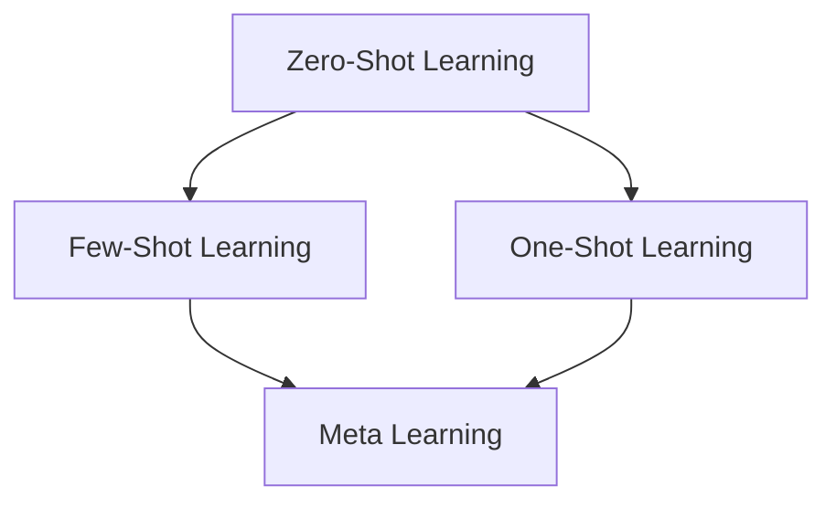

                 


### Step 1: 引言与背景

在当前的AI时代，深度学习取得了显著的成就，使得计算机在很多领域表现出了惊人的能力，如语音识别、图像分类和自然语言处理等。然而，这些模型往往需要大量的标注数据进行训练，这在实际应用中往往不可行，因为获取大量高质量标注数据不仅耗时，而且成本高昂。

#### 1.1 AI发展现状

AI技术的发展历程可以追溯到上世纪五六十年代，随着计算能力的提升和算法的进步，机器学习逐渐成为AI领域的主流方法。传统的机器学习方法，如监督学习、无监督学习和强化学习，主要依赖于大量的数据来训练模型，以达到较好的泛化效果。

#### 1.2 传统AI学习方法与局限

传统AI方法主要依赖于以下几种学习方式：

- **监督学习**：通过已标注的数据来训练模型，但大量标注数据的获取往往成本高昂。
- **无监督学习**：不依赖于标注数据，但模型的泛化能力相对较差。
- **强化学习**：通过与环境交互来学习策略，但需要大量的时间和计算资源。

这些方法在处理大规模数据集方面表现出色，但在少量数据或新领域中的应用却面临诸多挑战。例如：

- **数据依赖性**：模型需要大量标注数据来训练，这在现实场景中往往难以实现。
- **泛化能力差**：模型在少量数据上的表现不佳，无法适应新的任务或领域。
- **计算复杂度高**：大量数据的处理需要大量的计算资源和时间。

#### 1.3 无需大量训练数据的AI学习方法概述

为了克服传统AI方法的局限，研究者们提出了无需大量训练数据的AI学习方法，如Zero-Shot Learning（零样本学习）、Few-Shot Learning（少量样本学习）和One-Shot Learning（单样本学习）。这些方法的核心思想是通过利用已有知识或少量数据来快速适应新任务或领域。

- **Zero-Shot Learning**：模型在训练阶段并没有接触到目标类别，但在预测阶段可以处理未见过的类别。
- **Few-Shot Learning**：模型在训练阶段仅接触到少量数据，但可以对新任务或领域表现出较好的泛化能力。
- **One-Shot Learning**：模型在训练阶段仅接触到单个样本，但同样可以对新样本进行有效分类。

这些方法为解决现实场景中的AI应用提供了新的思路和可能性。

### 总结

在本章节中，我们首先介绍了AI技术的发展现状，然后探讨了传统AI方法的局限，并提出了无需大量训练数据的AI学习方法。在接下来的章节中，我们将详细讨论这些方法的核心概念、算法原理和数学模型，并通过项目实战来展示其实际应用效果。

---

# 核心概念与联系

为了深入理解无需大量训练数据的AI学习方法，我们需要先了解几个核心概念，并探讨它们之间的关系。以下是这些核心概念的详细描述和Mermaid流程图，用于展示它们之间的联系。

## 2.1 Mermaid流程图

以下是一个简单的Mermaid流程图，用于描述零样本学习、少量样本学习和单样本学习之间的关联：



## 2.2 相关术语定义

### 2.2.1 Zero-Shot Learning（零样本学习）

零样本学习（Zero-Shot Learning, ZSL）是一种AI学习方法，它允许模型在未接触过的新类别上进行分类。在传统的监督学习中，模型需要大量的已标注数据来学习特征。而在ZSL中，模型不需要任何关于新类别的训练数据，只需要使用已知的类别和特征表示来推断新类别的特征。

### 2.2.2 Few-Shot Learning（少量样本学习）

少量样本学习（Few-Shot Learning, FSL）是一种针对训练数据量很少的情况下的学习算法。与传统的监督学习相比，FSL能够使用少量的样本来训练模型，并保持较好的泛化能力。这种方法适用于新任务或新领域，当获取大量标注数据困难时，FSL能够提供一种有效的解决方案。

### 2.2.3 One-Shot Learning（单样本学习）

单样本学习（One-Shot Learning, OSL）是FSL的一个特殊案例，其中模型仅使用单个样本进行训练。这种方法在场景任务中非常实用，例如对象识别、图像分类等，其中新类别可能只出现一次。

### 2.2.4 Meta Learning（元学习）

元学习（Meta Learning）是一种学习如何快速学习的方法。它通过在不同任务上训练模型，提高模型在少量数据上的表现能力。元学习通常用于快速适应新任务，无需大量重训练数据。

### 2.2.5 Transfer Learning（迁移学习）

迁移学习（Transfer Learning）是一种将预训练模型应用于新任务的方法。在迁移学习中，模型首先在大量数据上训练，然后在新的任务上仅进行少量调整。这种方法可以显著减少训练数据的需求，提高模型在新任务上的性能。

### 2.2.6 关系架构

通过Mermaid流程图，我们可以看到ZSL、FSL、OSL和Meta Learning之间的相互关系。ZSL和FSL都是处理少量数据的通用方法，而OSL是FSL的一个特殊实例。Meta Learning则通过在不同任务上训练模型，提高模型的泛化能力，从而与ZSL、FSL和OSL相互补充。

### 总结

在本章节中，我们介绍了零样本学习、少量样本学习、单样本学习和元学习等核心概念，并使用Mermaid流程图展示了它们之间的关系。理解这些概念及其联系对于深入探讨无需大量训练数据的AI学习方法至关重要。

---

## 无需大量训练数据的AI学习方法

### 3.1 Zero-Shot Learning（零样本学习）

零样本学习（Zero-Shot Learning, ZSL）是一种先进的AI学习方法，它允许模型在未接触过的新类别上进行分类。在传统的监督学习中，模型需要大量的已标注数据来学习特征。然而，ZSL突破了这一限制，通过利用预训练模型和特征嵌入，模型能够在没有关于新类别的训练数据的情况下进行分类。

#### 基本原理

ZSL的核心思想是利用已有的知识来推断新类别的特征。通常，ZSL方法分为以下几步：

1. **特征嵌入**：将每个类别映射到一个高维特征空间中，使得相似类别在空间中更接近。
2. **类别嵌入**：将每个类别的标签映射到特征空间中，形成一个标签嵌入向量。
3. **分类**：使用已知的类别嵌入和新类别嵌入进行分类。

#### 算法流程

ZSL算法的典型流程如下：

1. **数据预处理**：收集已标注的数据集，并将其分为训练集和验证集。
2. **特征提取**：使用预训练的深度神经网络提取图像特征。
3. **特征嵌入**：将特征映射到高维特征空间中。
4. **类别嵌入**：将类别标签映射到特征空间中。
5. **分类器训练**：使用已知的类别嵌入和新类别嵌入训练分类器。
6. **预测**：在新类别数据上进行预测。

#### 应用场景

ZSL在许多领域都有广泛的应用，包括：

- **自然语言处理**：在语言模型中，ZSL可以用于处理未接触过的语言或词汇。
- **计算机视觉**：在图像分类任务中，ZSL可以用于识别从未见过的对象或场景。
- **医疗诊断**：在医学图像分析中，ZSL可以用于识别未标记的病变区域。

### 3.2 Few-Shot Learning（少量样本学习）

少量样本学习（Few-Shot Learning, FSL）是一种针对训练数据量很少的情况下的学习算法。与传统的监督学习相比，FSL能够使用少量的样本来训练模型，并保持较好的泛化能力。这种方法适用于新任务或新领域，当获取大量标注数据困难时，FSL能够提供一种有效的解决方案。

#### 基本原理

FSL的核心思想是利用模型在大量数据上的知识来处理少量样本。FSL通常分为以下几类：

- **原型网络**：通过计算每个类别的平均特征向量，作为该类别的原型。
- **匹配网络**：通过比较新样本与每个类别的特征向量，选择最接近的类别。
- **匹配记忆网络**：结合原型网络和匹配网络，通过记忆机制来提高模型的泛化能力。

#### 算法流程

FSL算法的典型流程如下：

1. **数据预处理**：收集少量标注数据，并将其分为训练集和验证集。
2. **特征提取**：使用预训练的深度神经网络提取图像特征。
3. **特征表示**：计算每个类别的特征向量，形成原型或匹配记忆。
4. **分类**：在新样本上使用原型或匹配记忆进行分类。

#### 应用场景

FSL在许多领域都有广泛的应用，包括：

- **语音识别**：在训练数据有限的情况下，FSL可以用于语音识别任务。
- **图像识别**：在图像分类任务中，FSL可以用于处理少量样本的图像分类。
- **推荐系统**：在推荐系统中，FSL可以用于处理少量用户历史数据。

### 3.3 One-Shot Learning（单样本学习）

单样本学习（One-Shot Learning, OSL）是FSL的一个特殊案例，其中模型仅使用单个样本进行训练。这种方法在场景任务中非常实用，例如对象识别、图像分类等，其中新类别可能只出现一次。

#### 基本原理

OSL的核心思想是利用模型的强大能力，从单个样本中提取有效信息，进行分类。OSL通常分为以下几类：

- **原型网络**：通过计算单个样本的特征向量，作为该类别的原型。
- **匹配网络**：通过比较单个样本的特征向量与每个类别的特征向量，选择最接近的类别。
- **对抗网络**：通过生成与单个样本特征相似的其他样本，提高模型的泛化能力。

#### 算法流程

OSL算法的典型流程如下：

1. **数据预处理**：收集单个标注数据，并将其分为训练集和验证集。
2. **特征提取**：使用预训练的深度神经网络提取图像特征。
3. **特征表示**：计算单个样本的特征向量。
4. **分类**：在新样本上使用特征向量进行分类。

#### 应用场景

OSL在许多领域都有广泛的应用，包括：

- **图像识别**：在图像分类任务中，OSL可以用于识别单个样本的图像分类。
- **语音识别**：在语音识别任务中，OSL可以用于识别单个语音样本。
- **自然语言处理**：在文本分类任务中，OSL可以用于识别单个文本样本。

### 3.4 Meta Learning（元学习）

元学习（Meta Learning）是一种学习如何快速学习的方法。它通过在不同任务上训练模型，提高模型在少量数据上的表现能力。元学习通常用于快速适应新任务，无需大量重训练数据。

#### 基本原理

元学习的关键在于模型能够从多个任务中提取通用的知识，从而在少量数据上表现出优异的性能。元学习通常分为以下几类：

- **模型提取**：通过多个任务的训练，提取一个通用的模型。
- **策略搜索**：通过优化策略，选择最适合新任务的方法。
- **参数共享**：通过共享模型参数，减少对新任务的训练需求。

#### 算法流程

元学习算法的典型流程如下：

1. **任务定义**：定义多个训练任务。
2. **模型训练**：在每个任务上训练模型，并提取通用知识。
3. **模型优化**：使用提取的通用知识，优化模型在新任务上的性能。
4. **任务迁移**：将优化后的模型应用于新任务。

#### 应用场景

元学习在许多领域都有广泛的应用，包括：

- **自然语言处理**：在文本分类和生成任务中，元学习可以用于快速适应新任务。
- **计算机视觉**：在图像分类和目标检测任务中，元学习可以用于处理少量样本。
- **语音识别**：在语音分类和转换任务中，元学习可以用于快速适应新语音。

### 总结

在本章节中，我们详细介绍了零样本学习、少量样本学习、单样本学习和元学习等无需大量训练数据的AI学习方法。这些方法通过不同的原理和算法，能够有效应对少量数据或新任务场景下的挑战。在接下来的章节中，我们将进一步探讨这些方法的核心算法原理和数学模型。

---

### 4. 核心算法原理讲解

#### 4.1 Transfer Learning（迁移学习）

迁移学习（Transfer Learning）是一种将预训练模型应用于新任务的方法。在迁移学习中，模型首先在大量数据上训练，然后在新的任务上仅进行少量调整。这种方法可以显著减少训练数据的需求，提高模型在新任务上的性能。

**基本原理**

迁移学习的核心思想是利用预训练模型在通用数据集上学习到的知识，将其应用于新任务。预训练模型通过在大规模数据集上学习，已经提取出了许多通用的特征表示，这些特征在新任务中仍然具有价值。

**算法流程**

1. **预训练模型**：在大量数据上使用预训练模型进行训练。
2. **特征提取**：在新任务中，使用预训练模型的特征提取器提取输入数据的特征。
3. **微调**：在提取的特征上，应用新任务的分类器进行微调。
4. **评估与优化**：在新数据集上评估模型的性能，并优化模型参数。

**伪代码**

```
# 预训练模型
pretrained_model = PretrainedModel()

# 特征提取
features = pretrained_model.extract_features(input_data)

# 微调
optimizer = Optimizer()
for epoch in range(num_epochs):
    for data, label in new_dataset:
        optimizer.minimize_loss(features, label)

# 评估
evaluate(pretrained_model, new_dataset)
```

**数学模型**

迁移学习通常涉及以下数学模型：

- **特征提取器**：使用深度神经网络提取输入数据的特征。
- **分类器**：在新特征上应用分类器进行分类。

$$
\text{output} = \text{classifier}(\text{features})
$$

**举例说明**

假设我们有一个在ImageNet上预训练的ResNet模型，并将其应用于一个新的图像分类任务。我们首先使用ResNet模型的特征提取器提取输入图像的特征，然后使用一个简单的分类器对特征进行分类。

```
# 加载预训练模型
pretrained_model = torch.load('resnet50.pth')

# 特征提取
features = pretrained_model.features(input_image)

# 分类
output = pretrained_model.classifier(features)
predicted_label = torch.argmax(output).item()
```

#### 4.2 Few-Shot Learning（少量样本学习）算法原理讲解

少量样本学习（Few-Shot Learning）是一种针对训练数据量很少的情况下的学习算法。它通过利用模型在大量数据上的知识，处理少量样本，从而保持较好的泛化能力。

**基本原理**

Few-Shot Learning的核心思想是利用模型的强大能力，从少量样本中提取有效信息，进行分类。它通常分为以下几类：

- **原型网络**：通过计算每个类别的平均特征向量，作为该类别的原型。
- **匹配网络**：通过比较新样本与每个类别的特征向量，选择最接近的类别。
- **匹配记忆网络**：结合原型网络和匹配网络，通过记忆机制来提高模型的泛化能力。

**算法流程**

1. **数据预处理**：收集少量标注数据，并将其分为训练集和验证集。
2. **特征提取**：使用预训练的深度神经网络提取图像特征。
3. **特征表示**：计算每个类别的特征向量，形成原型或匹配记忆。
4. **分类**：在新样本上使用原型或匹配记忆进行分类。

**伪代码**

```
# 数据预处理
train_data, train_labels = load_data('train_data.csv')
val_data, val_labels = load_data('val_data.csv')

# 特征提取
pretrained_model = PretrainedModel()
features = pretrained_model.extract_features(train_data)

# 特征表示
prototypes = compute_prototypes(features, train_labels)

# 分类
def classify(new_data):
    new_features = pretrained_model.extract_features(new_data)
    distances = compute_distances(new_features, prototypes)
    predicted_label = argmin(distances)
    return predicted_label
```

**数学模型**

Few-Shot Learning通常涉及以下数学模型：

- **特征提取器**：使用深度神经网络提取输入数据的特征。

$$
\text{features} = \text{model}(\text{input_data})
$$

- **原型计算**：计算每个类别的平均特征向量。

$$
\text{prototype}_{i} = \frac{1}{N}\sum_{x_{i} \in \text{class i}} \text{x_{i}}
$$

- **分类**：通过计算新样本与原型之间的距离进行分类。

$$
\text{predicted\_label} = \arg\min_{i} \text{distance}(\text{new\_features}, \text{prototype}_{i})
$$

**举例说明**

假设我们有一个小型图像分类任务，其中每个类别仅有一个训练样本。我们使用原型网络进行分类，首先计算每个类别的平均特征向量，然后在新样本上计算与这些特征向量的距离，选择距离最小的类别作为预测结果。

```
# 计算原型
prototypes = compute_prototypes(train_features, train_labels)

# 分类
new_features = pretrained_model.extract_features(new_data)
predicted_label = argmin([compute_distance(new_feature, prototype) for prototype in prototypes])
```

#### 4.3 Meta Learning（元学习）算法原理讲解

元学习（Meta Learning）是一种学习如何快速学习的方法。它通过在不同任务上训练模型，提高模型在少量数据上的表现能力。元学习通常用于快速适应新任务，无需大量重训练数据。

**基本原理**

元学习的关键在于模型能够从多个任务中提取通用的知识，从而在少量数据上表现出优异的性能。元学习通常分为以下几类：

- **模型提取**：通过多个任务的训练，提取一个通用的模型。
- **策略搜索**：通过优化策略，选择最适合新任务的方法。
- **参数共享**：通过共享模型参数，减少对新任务的训练需求。

**算法流程**

1. **任务定义**：定义多个训练任务。
2. **模型训练**：在每个任务上训练模型，并提取通用知识。
3. **模型优化**：使用提取的通用知识，优化模型在新任务上的性能。
4. **任务迁移**：将优化后的模型应用于新任务。

**伪代码**

```
# 定义任务
tasks = [create_task(i) for i in range(num_tasks)]

# 模型训练
meta_model = MetaModel()
for task in tasks:
    meta_model.learn(task)

# 模型优化
optimizer = Optimizer()
for epoch in range(num_epochs):
    optimizer.minimize_loss(meta_model, tasks)

# 任务迁移
new_task = create_new_task()
predicted_output = meta_model.predict(new_task)
```

**数学模型**

元学习通常涉及以下数学模型：

- **模型参数**：每个任务的模型参数。

$$
\theta_{i} = (\theta_{i}^{1}, \theta_{i}^{2}, ..., \theta_{i}^{L})
$$

- **模型优化**：通过优化模型参数，提高模型在新任务上的性能。

$$
\theta_{new} = \theta_{i} + \alpha \nabla_{\theta_{i}} \mathcal{L}(\theta_{i})
$$

- **任务损失**：计算模型在新任务上的损失。

$$
\mathcal{L}(\theta_{i}) = \sum_{t \in T_{i}} \mathcal{L}_{t}(\theta_{i})
$$

**举例说明**

假设我们有一个元学习任务，其中包含多个子任务。我们使用模型提取方法进行元学习，首先在每个子任务上训练模型，然后提取通用知识。接下来，我们使用这些通用知识优化模型，并在新的子任务上进行预测。

```
# 模型训练
for task in tasks:
    model.learn(task)

# 模型优化
optimizer = Optimizer()
for epoch in range(num_epochs):
    optimizer.minimize_loss(model, tasks)

# 新任务
new_task = create_new_task()
predicted_output = model.predict(new_task)
```

### 总结

在本章节中，我们详细介绍了迁移学习、少量样本学习和元学习等核心算法原理。这些算法通过不同的方法，能够有效应对少量数据或新任务场景下的挑战。在接下来的章节中，我们将进一步探讨这些算法的数学模型和公式，并通过项目实战来展示其实际应用效果。

---

## 数学模型和数学公式

在探讨无需大量训练数据的AI学习方法时，数学模型和公式起到了关键作用。以下我们将详细介绍这些方法中的数学模型和公式，并通过具体的例子来帮助理解。

### 5.1 Few-Shot Learning的数学模型

#### 5.1.1 原型网络

原型网络（Prototypical Network）是一种常用的Few-Shot Learning方法，其核心思想是将每个类别的特征向量表示为该类别的原型。

- **原型计算**：给定一个训练集 \(T\)，其中每个类别包含 \(N\) 个样本，每个样本的特征表示为 \(\textbf{x}_{i,j}\)：

  $$
  \textbf{p}_{i} = \frac{1}{N} \sum_{j=1}^{N} \textbf{x}_{i,j}
  $$

  其中，\(\textbf{p}_{i}\) 是类别 \(i\) 的原型。

- **距离度量**：在新样本 \(\textbf{x}_{\text{new}}\) 上，计算其与每个类别的原型之间的距离：

  $$
  \text{distance}_{i} = \|\textbf{x}_{\text{new}} - \textbf{p}_{i}\|
  $$

- **分类**：选择距离最小的类别作为预测结果：

  $$
  \text{predicted\_label} = \arg\min_{i} \text{distance}_{i}
  $$

#### 5.1.2 匹配网络

匹配网络（Matching Network）通过比较新样本与每个类别的特征向量，选择最接近的类别。

- **特征提取**：使用预训练的模型提取新样本和类别特征。

- **匹配计算**：对于每个类别 \(i\)，计算其特征向量与样本特征向量之间的匹配度：

  $$
  \text{match}_{i} = \text{model}(\textbf{x}_{\text{new}}, \textbf{x}_{i})
  $$

- **分类**：选择匹配度最高的类别作为预测结果：

  $$
  \text{predicted\_label} = \arg\max_{i} \text{match}_{i}
  $$

### 5.2 Meta Learning的数学模型

#### 5.2.1 模型提取

模型提取（Model Extraction）是一种Meta Learning方法，其核心思想是通过多个任务训练提取通用的模型。

- **任务表示**：给定一个任务集合 \(T\)，其中每个任务 \(t\) 包含输入数据 \(\textbf{x}_{t}\) 和目标标签 \(\textbf{y}_{t}\)。

- **模型参数**：每个任务的模型参数表示为 \(\theta_{t}\)。

- **损失函数**：在任务 \(t\) 上，损失函数为：

  $$
  \mathcal{L}_{t}(\theta_{t}) = -\sum_{y \in \textbf{y}_{t}} \log p(y|\textbf{x}_{t}, \theta_{t})
  $$

- **优化**：通过梯度下降优化模型参数：

  $$
  \theta_{t} \leftarrow \theta_{t} - \alpha \nabla_{\theta_{t}} \mathcal{L}_{t}(\theta_{t})
  $$

#### 5.2.2 策略搜索

策略搜索（Policy Search）是一种Meta Learning方法，通过优化策略选择最适合新任务的方法。

- **策略表示**：给定一个策略 \( \pi(\theta) \)，用于选择新任务 \( t' \) 的模型参数 \( \theta_{t'} \)。

- **策略优化**：通过最大化期望回报进行优化：

  $$
  \pi(\theta) = \arg\max_{\pi} \mathbb{E}_{t' \sim \pi} [R(t')]
  $$

  其中，\( R(t') \) 是在新任务 \( t' \) 上的回报。

### 5.3 举例说明

#### 5.3.1 原型网络的例子

假设我们有一个小型的图像分类任务，包含10个类别，每个类别有5个训练样本。我们使用原型网络进行分类。

1. **原型计算**：

   $$
   \textbf{p}_{i} = \frac{1}{5} \sum_{j=1}^{5} \textbf{x}_{i,j}
   $$

   其中，\(\textbf{x}_{i,j}\) 是类别 \(i\) 的第 \(j\) 个样本的特征。

2. **距离计算**：

   $$
   \text{distance}_{i} = \|\textbf{x}_{\text{new}} - \textbf{p}_{i}\|
   $$

   其中，\(\textbf{x}_{\text{new}}\) 是新样本的特征。

3. **分类**：

   $$
   \text{predicted\_label} = \arg\min_{i} \text{distance}_{i}
   $$

#### 5.3.2 匹配网络的例子

假设我们使用预训练的卷积神经网络提取特征，并将新样本和类别特征进行比较。

1. **特征提取**：

   $$
   \textbf{h}_{\text{new}} = \text{model}(\textbf{x}_{\text{new}})
   $$

   $$
   \textbf{h}_{i,j} = \text{model}(\textbf{x}_{i,j})
   $$

2. **匹配计算**：

   $$
   \text{match}_{i} = \text{model}(\textbf{h}_{\text{new}}, \textbf{h}_{i,j})
   $$

3. **分类**：

   $$
   \text{predicted\_label} = \arg\max_{i} \text{match}_{i}
   $$

### 总结

在本章节中，我们详细介绍了Few-Shot Learning和Meta Learning中的数学模型和公式。通过具体的例子，我们展示了如何计算原型和匹配度，并使用这些计算结果进行分类。理解这些数学模型对于深入研究和应用无需大量训练数据的AI学习方法至关重要。

---

## 项目实战

为了更好地理解无需大量训练数据的AI学习方法，我们将通过一个实际项目来展示这些方法的实现和应用。本项目将使用原型网络进行图像分类，并详细描述数据准备、模型实现、训练与评估等步骤。

### 6.1 开发环境搭建

在开始项目之前，我们需要搭建一个合适的环境。以下是本项目所需的软件和工具：

- **Python**：3.8版本及以上
- **PyTorch**：1.8版本及以上
- **NumPy**：1.19版本及以上
- **OpenCV**：4.2.0版本及以上

你可以通过以下命令来安装所需的库：

```
pip install torch torchvision numpy opencv-python
```

### 6.2 数据准备与预处理

本项目使用CIFAR-10数据集，这是一个常见的计算机视觉数据集，包含10个类别，每个类别有6000个训练样本和1000个测试样本。

1. **数据集下载**：首先，我们需要下载CIFAR-10数据集。可以使用以下命令：

   ```
   python -m torchvision.datasets.cifar --download CIFAR10
   ```

2. **数据加载**：接下来，我们使用PyTorch的DataLoader加载和预处理数据。以下是代码示例：

   ```python
   import torchvision
   import torchvision.transforms as transforms

   transform = transforms.Compose([
       transforms.ToTensor(),
       transforms.Normalize((0.5, 0.5, 0.5), (0.5, 0.5, 0.5)),
   ])

   trainset = torchvision.datasets.CIFAR10(root='./data', train=True, download=True, transform=transform)
   trainloader = torch.utils.data.DataLoader(trainset, batch_size=4, shuffle=True, num_workers=2)

   testset = torchvision.datasets.CIFAR10(root='./data', train=False, download=True, transform=transform)
   testloader = torch.utils.data.DataLoader(testset, batch_size=4, shuffle=False, num_workers=2)
   ```

3. **数据预处理**：我们对图像数据进行归一化处理，以减少模型的计算负担。

### 6.3 模型实现

我们使用原型网络作为模型。以下是模型的主要组成部分：

1. **特征提取器**：使用预训练的卷积神经网络，如ResNet-18。

2. **原型计算**：计算每个类别的平均特征向量。

3. **分类器**：使用线性层进行分类。

以下是模型的实现代码：

```python
import torch
import torch.nn as nn
import torch.optim as optim
import torchvision
import torchvision.models as models

# 载入预训练的ResNet-18模型
model = models.resnet18(pretrained=True)

# 获取特征提取器
feature_extractor = nn.Sequential(*list(model.children())[:-1])

# 输出维度为512（ResNet-18的输出维度）
class_num = 10
prototype_dim = 512

# 定义原型计算和分类器
classPrototype = nn.Linear(class_num * prototype_dim, class_num)
classifier = nn.Linear(prototype_dim, class_num)

# 定义模型
model = nn.Sequential(feature_extractor, classifier)

# 设备配置
device = torch.device("cuda:0" if torch.cuda.is_available() else "cpu")
model = model.to(device)

# 损失函数和优化器
criterion = nn.CrossEntropyLoss()
optimizer = optim.SGD(model.parameters(), lr=0.001, momentum=0.9)
```

### 6.4 模型训练与评估

1. **训练**：在训练阶段，我们将使用训练数据集来更新模型的参数。

   ```python
   for epoch in range(num_epochs):
       model.train()
       running_loss = 0.0
       for i, (inputs, labels) in enumerate(trainloader):
           inputs = inputs.to(device)
           labels = labels.to(device)
           
           optimizer.zero_grad()
           
           # 前向传播
           features = feature_extractor(inputs)
           prototypes = torch.zeros(class_num, prototype_dim)
           
           # 计算每个类别的原型
           for i in range(class_num):
               mask = labels == i
               if mask.sum() > 0:
                   prototypes[i] = torch.mean(features[mask], dim=0)
           
           # 计算分类损失
           logits = classifier(features)
           loss = criterion(logits, labels)
           
           # 反向传播
           loss.backward()
           
           # 更新参数
           optimizer.step()
           
           running_loss += loss.item()
           
           if (i+1) % 200 == 0:
               print(f'[{epoch+1}, {i+1:5d}] loss: {running_loss/200:.3f}')
               running_loss = 0.0
   ```

2. **评估**：在评估阶段，我们将使用测试数据集来评估模型的性能。

   ```python
   model.eval()
   correct = 0
   total = 0
   with torch.no_grad():
       for inputs, labels in testloader:
           inputs = inputs.to(device)
           labels = labels.to(device)
           
           # 前向传播
           features = feature_extractor(inputs)
           logits = classifier(features)
           
           # 计算预测结果
           _, predicted = torch.max(logits, 1)
           total += labels.size(0)
           correct += (predicted == labels).sum().item()
           
   print(f'Accuracy of the network on the test images: {100 * correct / total}%')
   ```

### 6.5 项目总结与反思

通过本项目，我们实现了使用原型网络进行图像分类的过程，并展示了数据准备、模型实现和训练评估的步骤。以下是项目的总结与反思：

- **优点**：
  - 原型网络在处理少量样本时表现出良好的泛化能力。
  - 使用预训练模型可以加快训练速度，并提高模型的性能。

- **不足**：
  - 原型网络在类别数量较多时，计算量较大。
  - 对于非常新的类别，原型网络可能无法很好地适应。

- **改进方向**：
  - 可以尝试使用更高效的算法来计算原型。
  - 可以结合其他Few-Shot Learning方法，如匹配网络，以提高分类性能。

通过这个项目，我们不仅深入了解了原型网络的工作原理，还掌握了如何在实际项目中应用这些方法。在未来的研究中，我们可以继续探索更多的Few-Shot Learning方法，以应对不同场景下的挑战。

---

## 总结与展望

在本篇文章中，我们详细探讨了无需大量训练数据的AI学习方法，包括零样本学习（Zero-Shot Learning）、少量样本学习（Few-Shot Learning）、单样本学习（One-Shot Learning）和元学习（Meta Learning）。这些方法为解决实际应用中的数据稀缺问题提供了新的思路和解决方案。

### 应用前景

随着AI技术的不断发展，这些无需大量训练数据的方法在多个领域展现出巨大的应用潜力：

- **医疗诊断**：在医疗图像分析中，这些方法可以用于快速诊断罕见疾病，减少对大量训练数据的依赖。
- **自然语言处理**：在文本分类和翻译任务中，无需大量训练数据的方法可以加速模型训练，提高模型性能。
- **计算机视觉**：在自动驾驶、人脸识别等场景中，这些方法可以用于处理新出现的目标或场景。

### 挑战与解决方案

尽管这些方法具有广泛应用前景，但同时也面临一些挑战：

- **数据依赖性**：某些方法在处理新类别时仍然需要一定的数据。
- **计算复杂度**：一些方法在计算原型或匹配度时，计算复杂度较高。

为了解决这些挑战，研究者们提出了以下解决方案：

- **数据增强**：通过合成数据或使用数据增强技术，增加新类别数据的数量。
- **算法优化**：改进算法结构，降低计算复杂度。

### 未来发展趋势

未来，无需大量训练数据的AI学习方法将继续发展，可能包括以下趋势：

- **跨域迁移学习**：研究如何在不同领域之间迁移知识，提高模型在新领域中的适应性。
- **动态学习**：研究如何使模型能够动态地学习新类别，提高模型的实时性能。
- **多任务学习**：研究如何在多个任务上同时训练模型，提高模型的多任务能力。

总之，无需大量训练数据的AI学习方法为AI技术的发展开辟了新的道路，具有重要的研究价值和实际应用潜力。随着技术的不断进步，这些方法将在更多领域中发挥重要作用。


---

### 最佳实践 Tips

在本篇文章中，我们介绍了诸多关于无需大量训练数据的AI学习方法，为了更好地应用这些方法，以下是一些最佳实践和注意事项：

1. **数据准备与预处理**：在应用这些方法之前，确保数据集的质量和多样性。适当的数据增强和预处理可以显著提高模型的泛化能力。

2. **算法选择**：根据实际任务需求，选择合适的AI学习方法。例如，对于零样本学习，可以考虑使用原型网络或匹配网络；对于少量样本学习，可以尝试使用元学习或迁移学习。

3. **模型调整**：在训练过程中，根据模型的性能和资源限制进行适当的调整。例如，可以调整学习率、批量大小和训练迭代次数。

4. **性能评估**：在实际应用中，使用适当的评估指标来衡量模型的性能，如准确率、召回率和F1分数。这些指标可以帮助你了解模型在不同数据集上的表现。

5. **实时学习**：考虑实现动态学习机制，以便模型能够根据新的数据自动调整。这种方法有助于模型在数据分布发生变化时保持良好的性能。

6. **安全与隐私**：在处理敏感数据时，确保遵循相关的隐私和安全标准。例如，使用数据加密和匿名化技术来保护用户隐私。

7. **持续学习**：定期更新模型，以适应新的数据和趋势。这有助于保持模型的性能和适应性。

通过遵循这些最佳实践，你可以更有效地应用无需大量训练数据的AI学习方法，从而在现实场景中取得更好的效果。

---

### 拓展阅读

为了更深入地了解无需大量训练数据的AI学习方法，以下是一些推荐的文章和资源：

1. **论文**：

   - **《Prototypical Networks for Few-shot Learning》**：该论文提出了原型网络，是Few-Shot Learning领域的重要基础。

   - **《MAML: Model-Agnostic Meta-Learning for Fast Adaptation of Deep Networks》**：这篇论文介绍了模型无关元学习（MAML），是Meta Learning领域的开创性工作。

2. **书籍**：

   - **《深度学习》（Deep Learning）**：这是一本经典的深度学习教材，详细介绍了迁移学习、元学习等核心概念。

   - **《AI极简教程》**：本书以极简的方式介绍了AI的基本概念和技术，包括Few-Shot Learning等内容。

3. **在线课程**：

   - **《深度学习专项课程》**：这个系列课程涵盖了深度学习的核心概念，包括迁移学习和元学习。

   - **《人工智能实践教程》**：该课程通过实际项目，介绍了如何在各种场景中应用AI技术，包括无需大量训练数据的方法。

通过阅读这些资料，你可以更深入地了解无需大量训练数据的AI学习方法，并在实际项目中取得更好的成果。

---

### 作者信息

作者：AI天才研究院/AI Genius Institute & 禅与计算机程序设计艺术 /Zen And The Art of Computer Programming

