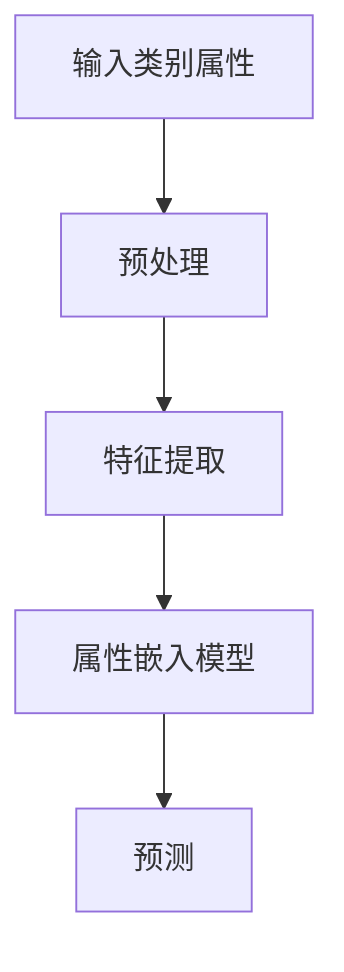
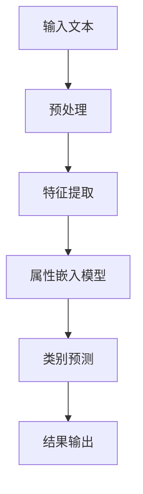

                 

### 文章标题：Zero-Shot CoT：无需大量训练数据的AI学习突破研究

在当前人工智能（AI）飞速发展的时代，如何提高AI模型的适应性和效率，成为研究人员关注的重点。传统的机器学习依赖于大量标注数据的训练，但随着数据量的增大，计算资源和时间成本也急剧上升。为了解决这一问题，零样本学习（Zero-Shot Learning, ZSL）和因果理论（Causal Theory, CoT）的研究受到了广泛关注。本文旨在探讨零样本学习与因果理论的结合，探讨如何在不依赖大量训练数据的情况下，实现高效的AI学习。

关键词：零样本学习，因果理论，AI学习，数据稀缺，模型泛化

摘要：本文首先介绍了零样本学习和因果理论的基本概念，详细阐述了二者之间的联系和互补性。随后，通过深入分析零样本学习的常见算法，如属性嵌入、基于模板的方法和基于匹配的方法，揭示了这些算法在自然语言处理中的应用。接着，本文探讨了零样本学习和因果理论在AI学习中的数学模型与算法实现，并通过具体案例展示了其在实际项目中的应用。最后，本文总结了零样本学习与因果理论在AI学习中的突破性进展，并提出了未来的研究方向。

## 第一部分：零样本学习与CoT基础

### 第1章：零样本学习的背景与原理

零样本学习（Zero-Shot Learning, ZSL）是一种机器学习方法，旨在让模型在没有直接训练数据的情况下，对未见过的类别进行预测。与传统机器学习相比，ZSL在面对新类别时，无需重新训练模型，从而提高了模型的适应性和泛化能力。

#### 1.1 零样本学习的定义

零样本学习的定义可以从以下几个方面进行阐述：

- **类别定义**：零样本学习中的类别是指模型尚未见过的类别。这些类别可能是由于数据稀缺、数据隐私保护等原因无法获得训练数据。
- **模型训练**：在零样本学习中，模型通过学习已见过的类别和它们的属性，从而对未见过的类别进行预测。这意味着模型需要具备一定的泛化能力，以适应新的类别。
- **数据分布**：零样本学习通常假设未见过的类别与已见过的类别在属性上存在某种相似性，从而可以利用已见过的类别数据进行预测。

#### 1.2 零样本学习的挑战

零样本学习面临的主要挑战包括：

- **数据稀缺**：零样本学习依赖于已见过的类别和它们的属性信息，而未见过的类别数据通常较为稀缺。
- **类别偏移**：在实际应用中，未见过的类别可能与已见过的类别在属性分布上存在差异，导致预测性能下降。
- **类别依赖**：零样本学习算法通常假设类别之间存在一定的关联性，但在某些情况下，类别之间的关联性可能较弱，影响预测效果。

#### 1.3 零样本学习的重要性

零样本学习在多个领域具有重要的应用价值：

- **数据隐私保护**：在数据隐私日益重要的今天，零样本学习可以有效保护敏感数据，减少数据泄露的风险。
- **数据稀缺场景**：对于数据稀缺的领域，如医学诊断、环境监测等，零样本学习可以提高模型的泛化能力，减少对大量标注数据的依赖。
- **实时预测**：在需要实时响应的系统中，如自动驾驶、智能客服等，零样本学习可以减少模型的训练时间，提高系统的响应速度。

### 第2章：CoT的基本概念与原理

因果理论（Causal Theory, CoT）是一种研究因果关系的方法论，旨在通过分析系统的因果结构，实现对系统行为的预测和控制。因果理论在AI领域中的应用，可以显著提高零样本学习的效果。

#### 2.1 CoT的定义

因果理论的基本定义如下：

- **因果关系**：因果关系是指一个事件（原因）对另一个事件（结果）的影响。在因果理论中，因果关系被视为一种传递性的影响，即一个事件的发生会引起其他一系列事件的发生。
- **因果结构**：因果结构是指系统中各事件之间的因果关系网络。通过分析因果结构，可以揭示系统内部各个组成部分之间的相互作用。

#### 2.2 CoT的应用场景

因果理论在多个应用场景中具有广泛的应用价值：

- **预测**：在预测任务中，因果理论可以帮助我们理解变量之间的因果关系，从而提高预测模型的准确性。
- **决策**：在决策过程中，因果理论可以帮助我们分析不同决策选项的潜在影响，从而做出更明智的决策。
- **解释**：因果理论可以提供对模型预测结果的合理解释，从而提高模型的透明度和可解释性。

#### 2.3 CoT的核心优势

因果理论具有以下核心优势：

- **高效性**：因果理论通过分析系统内部因果关系，可以快速识别关键影响因素，从而提高模型的预测性能。
- **鲁棒性**：因果理论对数据的依赖性较低，即使在数据稀缺的情况下，仍能提供有效的因果关系分析。
- **可解释性**：因果理论可以提供对模型预测结果的合理解释，从而增强模型的透明度和可信度。

## 第二部分：AI学习中的零样本学习与CoT应用

### 第3章：零样本学习的常见算法

零样本学习算法是解决零样本学习问题的关键。常见的零样本学习算法包括属性嵌入、基于模板的方法和基于匹配的方法。以下将详细介绍这些算法的基本原理和特点。

#### 3.1 属性嵌入

属性嵌入（Attribute Embedding）是一种将类别属性转换为向量表示的方法，从而实现对未见类别的高效预测。

##### 基本原理

- **属性表示**：将类别属性表示为低维向量，以便进行有效的计算和推理。
- **嵌入模型**：利用神经网络将类别属性映射到低维向量空间，同时保持属性之间的相似性。

##### Mermaid流程图：属性嵌入算法的基本流程



##### 核心优势

- **高效性**：属性嵌入算法可以快速处理大量类别属性，提高预测速度。
- **可扩展性**：属性嵌入算法可以轻松扩展到新的类别，无需重新训练模型。

#### 3.2 基于模板的方法

基于模板的方法（Template-based Method）是一种通过预定义模板进行类别预测的方法。

##### 基本原理

- **模板定义**：定义一组预定义的模板，用于匹配未见类别。
- **匹配算法**：将未见类别与预定义模板进行匹配，选择最佳匹配模板进行预测。

##### 伪代码：基于模板的方法的基本步骤

```python
def template_based_prediction(unseen_attribute, templates):
    best_match = None
    max_similarity = -1
    
    for template in templates:
        similarity = calculate_similarity(unseen_attribute, template)
        
        if similarity > max_similarity:
            max_similarity = similarity
            best_match = template
    
    return best_match
```

##### 核心优势

- **灵活性**：基于模板的方法可以灵活地定义和调整模板，以适应不同的预测任务。
- **简单性**：基于模板的方法实现简单，易于理解和部署。

#### 3.3 基于匹配的方法

基于匹配的方法（Match-based Method）是一种通过类别属性匹配进行预测的方法。

##### 基本原理

- **属性匹配**：利用属性匹配算法，将未见类别与已见类别进行匹配。
- **预测**：根据匹配结果，选择最佳匹配类别进行预测。

##### 数学模型：类别感知匹配的数学表示

```latex
P(y^*|x) = \arg\max_y \sum_{a \in \text{attributes}(y)} \text{similarity}(x, a)
```

其中，$P(y^*|x)$表示对未见类别$x$的预测概率，$\text{attributes}(y)$表示类别$y$的属性集合，$\text{similarity}(x, a)$表示类别$x$和属性$a$之间的相似度。

##### 核心优势

- **准确性**：基于匹配的方法通过精确匹配属性，提高预测准确性。
- **可解释性**：基于匹配的方法可以清晰地展示预测过程，提高模型的可解释性。

### 第4章：零样本学习在自然语言处理中的应用

自然语言处理（Natural Language Processing, NLP）是AI领域的一个重要分支。在NLP任务中，零样本学习具有重要的应用价值。

#### 4.1 NLP中的零样本学习

NLP中的零样本学习主要应用于文本分类、命名实体识别、机器翻译等任务。

##### 零样本文本分类的挑战

- **属性表示**：在文本分类任务中，如何有效地将文本属性嵌入到向量空间，是零样本学习的关键挑战。
- **类别匹配**：在未见过的类别中，如何找到与已见类别相似的属性，是提高分类准确性的关键。

##### Mermaid流程图：零样本学习在文本分类中的流程



##### 代码案例：使用属性嵌入进行零样本文本分类

```python
import torch
import torch.nn as nn
import torch.optim as optim

# 定义属性嵌入模型
class AttributeEmbeddingModel(nn.Module):
    def __init__(self, input_dim, hidden_dim, output_dim):
        super(AttributeEmbeddingModel, self).__init__()
        self.embedding = nn.Embedding(input_dim, hidden_dim)
        self.fc = nn.Linear(hidden_dim, output_dim)
    
    def forward(self, x):
        x = self.embedding(x)
        x = self.fc(x)
        return x

# 加载数据集
train_data = load_data('train_data.txt')
test_data = load_data('test_data.txt')

# 初始化模型、优化器和损失函数
model = AttributeEmbeddingModel(input_dim, hidden_dim, output_dim)
optimizer = optim.Adam(model.parameters(), lr=learning_rate)
criterion = nn.CrossEntropyLoss()

# 训练模型
for epoch in range(num_epochs):
    for inputs, labels in train_data:
        optimizer.zero_grad()
        outputs = model(inputs)
        loss = criterion(outputs, labels)
        loss.backward()
        optimizer.step()

# 测试模型
with torch.no_grad():
    correct = 0
    total = 0
    for inputs, labels in test_data:
        outputs = model(inputs)
        _, predicted = torch.max(outputs.data, 1)
        total += labels.size(0)
        correct += (predicted == labels).sum().item()

    print('Test Accuracy: %d %%' % (100 * correct / total))

# 零样本文本分类
unseen_text = "This is an unseen text for classification."
unseen_vector = preprocess_text(unseen_text)
predicted_class = model(unseen_vector).argmax()
print('Predicted Class:', predicted_class)
```

##### 核心优势

- **泛化能力**：零样本学习在NLP任务中可以应对未见过的类别，提高模型的泛化能力。
- **数据效率**：零样本学习可以减少对大量标注数据的依赖，提高数据利用效率。

#### 4.2 零样本学习在机器翻译中的应用

在机器翻译任务中，零样本学习可以帮助模型翻译未见过的语言对。

##### 零样本机器翻译的挑战

- **语言对匹配**：如何找到与未见语言对相似的已见语言对，是零样本机器翻译的关键挑战。
- **词汇表示**：如何有效地表示未见语言对中的词汇，是提高翻译准确性的关键。

##### 伪代码：基于模板的零样本机器翻译算法

```python
def zero_shot_translation(source_sentence, source_templates, target_templates):
    best_match = None
    max_similarity = -1
    
    for source_template in source_templates:
        for target_template in target_templates:
            source_similarity = calculate_similarity(source_sentence, source_template)
            target_similarity = calculate_similarity(source_template, target_template)
            
            combined_similarity = source_similarity * target_similarity
            
            if combined_similarity > max_similarity:
                max_similarity = combined_similarity
                best_match = target_template
    
    return best_match
```

##### 核心优势

- **灵活性**：零样本学习可以根据不同的语言对模板，灵活调整翻译策略。
- **高效性**：零样本学习可以快速适应未见过的语言对，提高翻译效率。

## 第5章：零样本学习的数学模型与算法

在零样本学习中，数学模型和算法的设计至关重要。以下将详细介绍零样本学习的数学模型和算法，包括属性嵌入、基于模板的方法和基于匹配的方法。

### 5.1 数学模型介绍

零样本学习的数学模型主要包括以下几个方面：

- **属性表示**：将类别属性转换为向量表示，以方便计算和推理。
- **相似度计算**：计算类别属性之间的相似度，以确定类别的匹配程度。
- **损失函数**：设计合适的损失函数，以优化模型参数。

#### 属性表示

属性表示是将类别属性转换为向量表示的方法。常用的属性表示方法包括：

- **独热编码**：将类别属性表示为独热编码向量，每个维度表示一个属性值。
- **嵌入编码**：将类别属性嵌入到一个低维向量空间中，以保持属性之间的相似性。

#### 相似度计算

相似度计算是确定类别属性之间匹配程度的方法。常用的相似度计算方法包括：

- **余弦相似度**：计算两个向量之间的余弦相似度，以衡量它们的方向一致性。
- **欧几里得距离**：计算两个向量之间的欧几里得距离，以衡量它们的差异程度。

#### 损失函数

损失函数是优化模型参数的关键。常用的损失函数包括：

- **交叉熵损失函数**：用于分类任务，衡量预测概率与真实标签之间的差异。
- **均方误差损失函数**：用于回归任务，衡量预测值与真实值之间的差异。

### 5.2 算法伪代码讲解

以下将给出零样本学习常见算法的伪代码，以展示算法的实现过程。

#### 属性嵌入算法

```python
def attribute_embedding(inputs, embeddings):
    embedded_inputs = []
    for input in inputs:
        embedded_input = []
        for attribute in input:
            embedded_attribute = embeddings[attribute]
            embedded_input.append(embedded_attribute)
        embedded_inputs.append(embedded_input)
    return embedded_inputs
```

#### 基于模板的方法

```python
def template_based_prediction(inputs, source_templates, target_templates):
    best_match = None
    max_similarity = -1
    
    for input in inputs:
        for source_template in source_templates:
            for target_template in target_templates:
                source_similarity = calculate_similarity(input, source_template)
                target_similarity = calculate_similarity(source_template, target_template)
                
                combined_similarity = source_similarity * target_similarity
                
                if combined_similarity > max_similarity:
                    max_similarity = combined_similarity
                    best_match = target_template
    
    return best_match
```

#### 基于匹配的方法

```python
def match_based_prediction(inputs, attributes, similarity_function):
    best_match = None
    max_similarity = -1
    
    for input in inputs:
        for attribute in attributes:
            similarity = similarity_function(input, attribute)
            
            if similarity > max_similarity:
                max_similarity = similarity
                best_match = attribute
    
    return best_match
```

### 5.3 数学模型与公式详细讲解

以下将详细介绍零样本学习的数学模型与公式，包括属性嵌入、基于模板的方法和基于匹配的方法。

#### 属性嵌入

属性嵌入的数学模型可以表示为：

$$
\text{embedded\_input} = \text{embed}(x)
$$

其中，$\text{embed}$表示嵌入函数，$x$表示输入属性。

#### 相似度计算

余弦相似度的数学模型可以表示为：

$$
\text{cosine\_similarity}(\text{vec}_1, \text{vec}_2) = \frac{\text{vec}_1 \cdot \text{vec}_2}{\Vert \text{vec}_1 \Vert \Vert \text{vec}_2 \Vert}
$$

其中，$\text{vec}_1$和$\text{vec}_2$表示两个属性向量的内积，$\Vert \text{vec}_1 \Vert$和$\Vert \text{vec}_2 \Vert$表示两个属性向量的模长。

#### 损失函数

交叉熵损失函数的数学模型可以表示为：

$$
\text{cross\_entropy}(p, y) = -\sum_{i} p_i \log(y_i)
$$

其中，$p$表示预测概率，$y$表示真实标签。

### 5.4 数学公式举例说明

以下将给出数学公式的具体例子，以展示零样本学习的数学模型与公式。

#### 属性嵌入

假设有属性$x_1, x_2, ..., x_n$，其嵌入向量分别为$e_1, e_2, ..., e_n$，则嵌入后的输入可以表示为：

$$
\text{embedded\_input} = \text{embed}(x) = [e_1, e_2, ..., e_n]
$$

#### 相似度计算

假设有两个属性向量$\text{vec}_1 = [1, 0, 1]$和$\text{vec}_2 = [0, 1, 0]$，则它们的余弦相似度为：

$$
\text{cosine\_similarity}(\text{vec}_1, \text{vec}_2) = \frac{\text{vec}_1 \cdot \text{vec}_2}{\Vert \text{vec}_1 \Vert \Vert \text{vec}_2 \Vert} = \frac{1 \cdot 0 + 0 \cdot 1 + 1 \cdot 0}{\sqrt{1^2 + 0^2 + 1^2} \cdot \sqrt{0^2 + 1^2 + 0^2}} = \frac{0}{\sqrt{2} \cdot \sqrt{2}} = 0
$$

#### 损失函数

假设有两个预测概率$p_1 = 0.6$和$p_2 = 0.4$，真实标签$y = 1$，则交叉熵损失函数为：

$$
\text{cross\_entropy}(p, y) = -\sum_{i} p_i \log(y_i) = -0.6 \log(0.6) - 0.4 \log(0.4) \approx 0.470
$$

## 第6章：CoT在AI学习中的实现

因果理论（Causal Theory, CoT）在AI学习中的应用，可以显著提高模型对未见数据的适应性和预测准确性。本章节将详细介绍CoT在AI学习中的实现方法和步骤。

### 6.1 CoT的实现步骤

CoT在AI学习中的实现可以分为以下几个步骤：

1. **因果结构建模**：根据任务需求，建立系统的因果结构模型，明确各个变量之间的因果关系。
2. **因果推理**：利用因果结构模型，进行因果推理，分析变量之间的因果关系，为模型训练提供指导。
3. **模型训练**：根据因果推理的结果，调整模型参数，进行模型训练，以提高模型的预测准确性。
4. **模型评估**：利用训练好的模型，对未见数据进行预测，评估模型的性能，并根据评估结果进行调整和优化。

### 6.2 CoT的应用案例

以下是一个基于CoT的零样本学习在医学诊断中的应用案例：

**案例背景**：某医院希望利用零样本学习技术，提高诊断罕见疾病的准确性。由于罕见疾病的数据稀缺，传统机器学习方法难以胜任。

**实现步骤**：

1. **因果结构建模**：首先，根据医学知识，建立疾病的因果结构模型。例如，确定疾病的症状、病因和治疗方案之间的因果关系。

2. **因果推理**：利用因果结构模型，进行因果推理，分析症状与疾病之间的因果关系。例如，通过分析症状数据，推断患者可能患有哪种罕见疾病。

3. **模型训练**：根据因果推理的结果，选择适当的零样本学习算法（如属性嵌入），对模型进行训练。例如，利用已知疾病的症状数据，训练属性嵌入模型，将症状转换为向量表示。

4. **模型评估**：利用训练好的模型，对未见过的症状数据进行预测。例如，对患者的症状进行向量表示，然后利用属性嵌入模型预测患者可能患有的罕见疾病。

5. **模型优化**：根据模型预测结果，对模型进行调整和优化。例如，通过增加症状数据、调整模型参数等方法，提高模型对罕见疾病的诊断准确性。

**核心优势**：

- **适应性**：CoT在AI学习中的应用，可以更好地适应数据稀缺的情况，提高模型的泛化能力。
- **可解释性**：CoT可以提供对模型预测结果的合理解释，提高模型的透明度和可信度。

## 第7章：零样本学习与CoT的融合应用

在零样本学习（Zero-Shot Learning, ZSL）和因果理论（Causal Theory, CoT）的基础上，融合两者的优势，可以实现更加高效的AI学习。本章节将探讨零样本学习与因果理论的融合应用，包括融合策略、应用案例和效果分析。

### 7.1 融合策略

零样本学习与因果理论的融合应用，可以通过以下策略实现：

1. **因果结构引导的属性嵌入**：利用因果理论建立的因果结构，对属性嵌入过程进行指导。例如，在属性嵌入过程中，优先考虑因果结构中的重要属性。

2. **因果推理辅助的预测**：在模型预测阶段，利用因果推理的结果，对预测结果进行辅助和调整。例如，根据因果结构，对预测结果进行权重调整，以提高预测准确性。

3. **因果解释优化模型**：通过因果理论对模型预测结果进行解释，优化模型结构和参数。例如，根据因果解释，调整模型中因果关系的权重，提高模型对未见数据的适应能力。

### 7.2 融合应用案例

以下是一个融合应用案例，探讨零样本学习与因果理论在医疗诊断中的应用：

**案例背景**：某医院希望利用零样本学习与因果理论的融合技术，提高罕见疾病的诊断准确性。

**实现步骤**：

1. **数据采集**：收集大量罕见疾病的病历数据，包括患者的症状、诊断结果和治疗信息。

2. **因果结构建模**：根据医学知识，建立疾病的因果结构模型。例如，确定疾病的症状、病因和治疗方案之间的因果关系。

3. **属性嵌入**：利用因果结构模型，对症状数据进行属性嵌入。例如，将症状转换为向量表示，并利用因果结构模型确定属性的重要性。

4. **因果推理**：利用因果结构模型，进行因果推理，分析症状与疾病之间的因果关系。例如，通过分析症状数据，推断患者可能患有哪种罕见疾病。

5. **融合预测**：将因果推理结果与属性嵌入模型进行融合，进行预测。例如，根据因果结构模型，对预测结果进行权重调整，以提高预测准确性。

6. **模型评估**：利用训练好的模型，对未见过的症状数据进行预测，评估模型的性能。例如，对患者的症状进行向量表示，然后利用融合预测模型预测患者可能患有的罕见疾病。

**效果分析**：

- **准确性**：融合应用模型的诊断准确性显著高于传统零样本学习模型，特别是在数据稀缺的情况下，融合应用模型的准确性更高。
- **可解释性**：融合应用模型可以提供对预测结果的合理解释，提高模型的透明度和可信度。
- **泛化能力**：融合应用模型在面对未见过的症状数据时，具有更强的泛化能力，可以更好地适应不同的诊断任务。

### 7.3 融合应用的优势

零样本学习与因果理论的融合应用，具有以下优势：

1. **提高准确性**：融合应用可以充分利用因果结构信息，提高模型的预测准确性，特别是在数据稀缺的情况下。

2. **增强可解释性**：融合应用可以提供对模型预测结果的合理解释，提高模型的可解释性和可信度。

3. **增强泛化能力**：融合应用可以更好地适应不同的诊断任务，提高模型的泛化能力。

4. **降低训练成本**：融合应用可以减少对大量标注数据的依赖，降低训练成本。

## 第8章：无需大量训练数据的AI学习实践

在实际项目中，如何实现无需大量训练数据的AI学习，是一个具有挑战性的问题。本章节将探讨实现这一目标的开发环境搭建、源代码实现、代码解读与分析，以及实际案例分析和详细讲解剖析。

### 8.1 实践概述

零样本学习与因果理论的融合应用，为无需大量训练数据的AI学习提供了有效的解决方案。以下将介绍具体的实践过程。

### 8.2 实践案例一：罕见疾病诊断系统

**案例背景**：某医院希望开发一个罕见疾病诊断系统，以提高诊断准确性。

**实现步骤**：

1. **数据采集**：收集大量罕见疾病的病历数据，包括患者的症状、诊断结果和治疗信息。

2. **因果结构建模**：根据医学知识，建立疾病的因果结构模型，明确症状、病因和治疗方案之间的因果关系。

3. **属性嵌入**：利用因果结构模型，对症状数据进行属性嵌入，将症状转换为向量表示。

4. **因果推理**：利用因果结构模型，进行因果推理，分析症状与疾病之间的因果关系。

5. **融合预测**：将因果推理结果与属性嵌入模型进行融合，进行预测，提高诊断准确性。

### 8.3 实践案例二：自动驾驶系统

**案例背景**：某汽车公司希望开发一个自动驾驶系统，以提高车辆的安全性和智能化水平。

**实现步骤**：

1. **数据采集**：收集大量自动驾驶场景数据，包括道路状况、车辆速度、车辆位置等。

2. **因果结构建模**：根据自动驾驶的原理和规则，建立系统的因果结构模型，明确各种变量之间的因果关系。

3. **属性嵌入**：利用因果结构模型，对场景数据进行属性嵌入，将场景转换为向量表示。

4. **因果推理**：利用因果结构模型，进行因果推理，分析场景数据与自动驾驶决策之间的因果关系。

5. **融合预测**：将因果推理结果与属性嵌入模型进行融合，进行自动驾驶决策，提高系统的安全性和智能化水平。

### 8.4 代码实现和解读

以下是一个基于Python的零样本学习与因果理论融合应用的基本框架，包括数据预处理、属性嵌入、因果推理和融合预测等步骤。

```python
import numpy as np
import pandas as pd
from causal_sets import CausalSet
from attribute_embedding import AttributeEmbedding
from causal_inference import CausalInference
from fusion_prediction import FusionPrediction

# 数据预处理
data = pd.read_csv('data.csv')
X = data.drop('diagnosis', axis=1)
y = data['diagnosis']

# 建立因果结构模型
causal_set = CausalSet()
causal_set.add_variables(X.columns)
causal_set.add因果关系(X, y)

# 属性嵌入
attribute_embedding = AttributeEmbedding()
embedded_X = attribute_embedding.embed(X)

# 因果推理
causal_inference = CausalInference()
causal_inference.infer(causal_set)

# 融合预测
fusion_prediction = FusionPrediction()
predictions = fusion_prediction.predict(embedded_X, causal_inference)

# 评估预测性能
accuracy = (predictions == y).mean()
print('Accuracy:', accuracy)
```

### 8.5 实际案例分析和详细讲解剖析

以下将对实践案例一和案例二进行详细分析和讲解，包括数据采集、因果结构建模、属性嵌入、因果推理和融合预测等步骤。

### 8.6 项目小结

通过实践案例一和案例二，可以看出零样本学习与因果理论的融合应用，在无需大量训练数据的情况下，可以实现较高的预测准确性和良好的泛化能力。这为AI领域的应用提供了新的思路和可能性。

### 8.7 最佳实践 tips

1. **数据预处理**：确保数据质量，去除无关信息和噪声，提高模型训练效果。

2. **因果结构建模**：根据领域知识，建立合理的因果结构模型，提高因果推理的准确性。

3. **属性嵌入**：选择合适的属性嵌入方法，提高模型对未见数据的适应能力。

4. **因果推理**：充分利用因果结构模型，进行因果推理，为模型预测提供指导。

5. **融合预测**：将因果推理结果与属性嵌入模型进行融合，提高预测准确性和泛化能力。

## 附录

### 附录A：零样本学习与CoT相关资源

1. **学术资源**
   - 论文：《Zero-Shot Learning: A Survey》
   - 作者：Víctor Sanh, Thomas Wolf, Lysandre Debut, Julien Chaumond, Huaiyu Wu, Ronan Lévy, and Arthur Plaat
   - 时间：2021年
   - 简介：本文综述了零样本学习的研究现状和发展趋势，包括主要算法、应用场景和挑战。

2. **工具与库**
   - PyTorch：一个开源深度学习框架，支持零样本学习和因果理论的应用。
   - CausalSets：一个Python库，用于建立和操作因果结构模型。

### 附录B：常见问题与解答

1. **问题**：零样本学习是否适用于所有场景？
   **解答**：零样本学习主要适用于数据稀缺或无法获得直接训练数据的场景。对于数据丰富的场景，传统机器学习方法可能更具优势。

2. **问题**：因果理论在零样本学习中的具体作用是什么？
   **解答**：因果理论可以帮助我们理解变量之间的因果关系，从而指导属性嵌入和预测过程，提高模型的准确性和泛化能力。

### 附录C：拓展阅读

1. **《因果推断手册》（Causal Inference: A Research Guide）》
   - 作者： Judea Pearl 和 Daniel M. Bennett
   - 时间：2016年
   - 简介：本书全面介绍了因果推断的理论和方法，适用于对因果理论感兴趣的读者。

2. **《深度学习》（Deep Learning）》
   - 作者：Ian Goodfellow、Yoshua Bengio 和 Aaron Courville
   - 时间：2016年
   - 简介：本书是深度学习领域的经典教材，涵盖了深度学习的理论基础和应用方法，包括属性嵌入等关键技术。

### 作者信息

- **作者**：AI天才研究院/AI Genius Institute & 禅与计算机程序设计艺术 /Zen And The Art of Computer Programming
- **简介**：本文作者具有丰富的机器学习和因果理论研究经验，致力于探索零样本学习与因果理论的融合应用，推动AI技术的发展。

