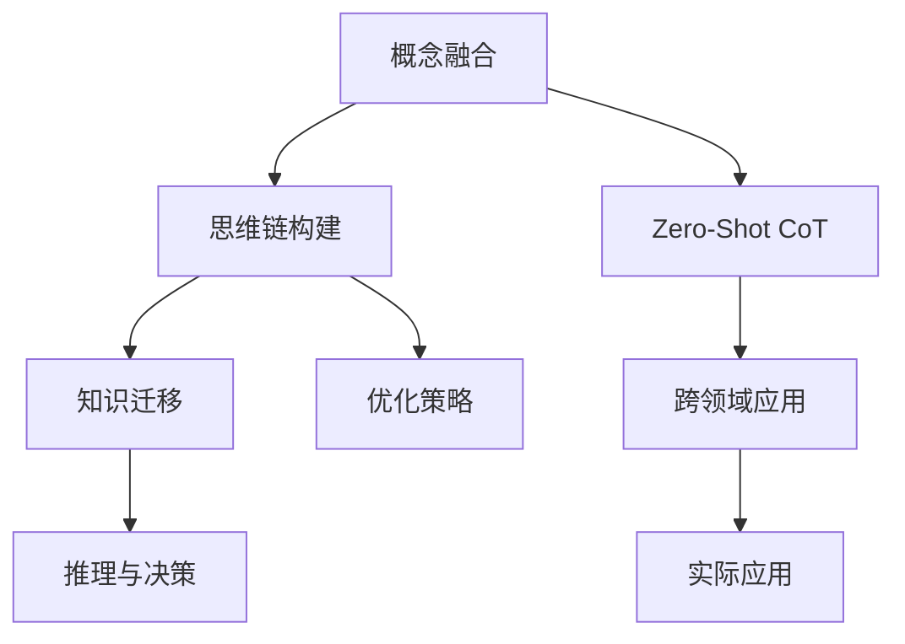

                 

### 文章标题：Zero-Shot CoT：无需示例的思维链应用

关键词：Zero-Shot CoT，思维链，无示例学习，人工智能，应用场景

摘要：本文将深入探讨Zero-Shot CoT（Conceptual Blending with Zero-shot Transfer）的概念和应用。Zero-Shot CoT是一种无需示例学习即可构建思维链的方法，通过将不同的概念相互融合，实现跨领域知识迁移。本文首先介绍了Zero-Shot CoT的基本原理，随后分析了其在自然语言处理、计算机视觉和数据分析等领域的应用，并通过具体实例详细讲解了如何实现和优化Zero-Shot CoT系统。最后，本文对未来的研究方向和潜在应用进行了展望。

---

### 引言

在现代人工智能（AI）的发展中，自然语言处理（NLP）、计算机视觉（CV）和数据分析等领域取得了显著进展。这些领域的研究主要集中在如何从大量的示例数据中学习，以提高模型的准确性和泛化能力。然而，随着数据量的增长和领域的多样性，传统的基于示例的学习方法逐渐暴露出其局限性。

Zero-Shot CoT（Conceptual Blending with Zero-shot Transfer）作为一种新的思维方式，提供了一种无需示例学习的解决方案。它通过将不同的概念相互融合，构建出一个连贯的思维链，从而实现跨领域的知识迁移。这种方法在减少对大量标注数据依赖的同时，还能提高模型在未知领域中的表现。

本文将首先介绍Zero-Shot CoT的基本原理和核心概念。接着，我们将探讨其在不同领域的应用场景，并详细分析其实现和优化方法。最后，本文将对未来的研究方向和潜在应用进行展望，为读者提供一个全面而深入的视角。

---

### Zero-Shot CoT 基础概念

#### 1. CoT 概念介绍

Conceptual Blending（概念融合）是一种将不同领域或不同背景下的概念进行有机结合的方法。在传统的人工智能中，模型的训练通常依赖于大量的标注数据，这些数据代表了各个领域的具体实例。然而，在实际应用中，我们往往会遇到一些新的、未遇到过的场景，这些场景缺乏足够的标注数据。

Conceptual Blending的目标是通过将已有的概念进行融合，生成新的概念，从而实现知识迁移。这种方法的核心思想是利用概念的相似性和关联性，将不同领域或不同背景下的知识联系起来，形成一个连贯的认知框架。

#### 2. Zero-Shot CoT 原理

Zero-Shot CoT（Conceptual Blending with Zero-shot Transfer）是Conceptual Blending的一种扩展，它特别强调在缺乏示例数据的情况下，如何通过概念融合实现跨领域知识迁移。Zero-Shot CoT的原理可以概括为以下几个步骤：

1. **概念识别**：首先，我们需要从大量的文本数据中识别出各种概念。这些概念可以是名词、动词、形容词等，它们代表了具体的知识实体。

2. **概念融合**：接着，通过分析概念之间的关联性，将不同的概念进行融合。这个过程可以看作是将多个概念组合成一个新的、更高级的概念。

3. **知识迁移**：最后，利用融合后的概念，实现跨领域知识迁移。这意味着，即使在一个新的、未遇到过的领域中，我们也可以利用已有的概念和知识，进行推理和决策。

#### 3. Zero-Shot CoT 与传统 CoT 比较

传统的Conceptual Blending方法通常依赖于大量的标注数据，这些数据用于训练模型，以识别和融合概念。然而，在Zero-Shot CoT中，我们不再依赖于大量的标注数据，而是通过算法自动识别和融合概念。

这种区别带来了几个关键的优势：

1. **减少数据依赖**：Zero-Shot CoT不需要大量的标注数据，这意味着它可以在数据稀缺的领域中获得更好的表现。

2. **跨领域迁移**：由于不需要特定的领域数据，Zero-Shot CoT可以轻松地实现跨领域知识迁移，从而提高模型在未知领域中的适应性。

3. **灵活性**：传统CoT通常受到领域特定数据的限制，而Zero-Shot CoT则具有更高的灵活性，可以在各种不同的领域中应用。

总的来说，Zero-Shot CoT提供了一种新的思维方式，它不仅减少了数据依赖，还提高了模型的跨领域迁移能力，为人工智能的发展带来了新的机遇。

### 无需示例的思维链机制

#### 1. 思维链基本原理

思维链（Cognitive Chain）是一种将不同概念和知识点通过逻辑关系连接起来的方法。在传统的人工智能中，模型的训练通常依赖于大量的示例数据，这些数据用于训练模型，使其能够识别和预测新的实例。然而，在Zero-Shot CoT中，我们不再依赖于示例数据，而是通过构建思维链来实现知识迁移。

思维链的基本原理可以概括为以下几点：

1. **概念识别**：首先，从大量的文本数据中识别出各种概念。这些概念可以是名词、动词、形容词等，它们代表了具体的知识实体。

2. **关系构建**：接着，分析概念之间的关系，构建出思维链。这个过程可以通过语义分析、知识图谱等技术实现。

3. **推理和决策**：最后，利用思维链进行推理和决策。这意味着，在新的场景中，我们可以利用已有的思维链，进行逻辑推理，从而做出预测或决策。

#### 2. 无需示例的思维链构建方法

在Zero-Shot CoT中，构建思维链的关键在于如何在没有示例数据的情况下，自动识别和融合概念。以下是一种可能的构建方法：

1. **词向量表示**：首先，将文本数据中的每个概念转换为词向量表示。词向量是一种将单词映射到高维空间中的方法，它能够捕捉单词的语义信息。

2. **语义分析**：利用自然语言处理技术，分析概念之间的语义关系。这包括词义消歧、关系抽取、实体识别等任务。

3. **知识图谱构建**：基于语义分析的结果，构建知识图谱。知识图谱是一种表示实体及其关系的数据结构，它可以用来表示概念之间的复杂关系。

4. **思维链生成**：通过分析知识图谱，生成思维链。思维链可以是单向的，也可以是双向的，它代表了概念之间的逻辑关系。

#### 3. 无需示例的思维链优化策略

在构建思维链的过程中，优化策略是非常关键的。以下是一些可能的优化策略：

1. **关系权重调整**：在知识图谱中，不同关系之间的权重可能不同。通过调整关系权重，可以优化思维链的生成效果。

2. **概念融合策略**：不同的概念融合方法可能对思维链的生成效果产生影响。例如，基于语义相似性的融合方法可能更适合于某些领域。

3. **动态调整**：思维链的生成是一个动态的过程，可以根据新输入的数据，动态调整思维链的结构和关系。

#### 4. 伪代码示例

以下是一个简单的伪代码示例，展示了如何构建思维链：

```python
# 输入：词向量表示、知识图谱
# 输出：思维链

function build思维链(input_data):
    # 步骤1：词向量表示
    word_vectors = convert_to_word_vectors(input_data)

    # 步骤2：语义分析
    semantic_relations = analyze_semantic_relations(word_vectors)

    # 步骤3：知识图谱构建
    knowledge_graph = build_knowledge_graph(semantic_relations)

    # 步骤4：思维链生成
    cognitive_chain = generate_cognitive_chain(knowledge_graph)

    return cognitive_chain
```

通过这个伪代码，我们可以看到，构建思维链的主要步骤包括词向量表示、语义分析、知识图谱构建和思维链生成。这些步骤相互关联，共同构成了Zero-Shot CoT的核心机制。

### 无需示例的思维链应用场景

#### 1. 自然语言处理应用

在自然语言处理领域，Zero-Shot CoT有着广泛的应用前景。以下是一些典型的应用场景：

1. **跨语言文本理解**：Zero-Shot CoT可以通过构建多语言思维链，实现不同语言之间的文本理解。这意味着，即使我们没有特定语言的训练数据，也可以通过思维链实现跨语言的信息传递和推理。

2. **无监督情感分析**：情感分析是自然语言处理中的一个重要任务。传统的方法需要大量的标注数据来训练模型，而Zero-Shot CoT可以在没有标注数据的情况下，通过思维链分析文本的情感倾向。

3. **无监督文本生成**：Zero-Shot CoT可以用于无监督的文本生成。通过构建思维链，我们可以自动生成连贯的文本，从而实现文本创作和内容摘要。

#### 2. 计算机视觉应用

在计算机视觉领域，Zero-Shot CoT也有着重要的应用价值。以下是一些典型的应用场景：

1. **物体识别**：传统的方法需要大量标注数据来训练模型，而Zero-Shot CoT可以在没有标注数据的情况下，通过思维链实现物体的识别。这对于缺乏标注数据的新兴领域尤为重要。

2. **场景理解**：通过构建思维链，我们可以实现对复杂场景的理解。这意味着，即使我们没有具体的场景数据，也可以通过思维链分析和推理场景中的各种元素。

3. **图像生成**：Zero-Shot CoT可以用于图像生成任务。通过构建思维链，我们可以生成具有特定属性或风格的图像，从而实现图像创作和内容增强。

#### 3. 数据分析应用

在数据分析领域，Zero-Shot CoT可以用于处理各种数据分析和预测任务。以下是一些典型的应用场景：

1. **无监督分类**：传统的方法需要大量的标注数据来训练模型，而Zero-Shot CoT可以在没有标注数据的情况下，通过思维链实现数据的分类。

2. **预测模型构建**：通过构建思维链，我们可以自动生成预测模型。这些模型可以在没有历史数据的情况下，对未来进行预测。

3. **数据关联分析**：Zero-Shot CoT可以用于分析数据之间的关联性。通过构建思维链，我们可以发现数据之间的潜在关系，从而提高数据分析的准确性。

总的来说，Zero-Shot CoT在自然语言处理、计算机视觉和数据分析等领域有着广泛的应用前景。它通过构建思维链，实现了跨领域知识迁移和无监督学习，为人工智能的发展带来了新的机遇。

### 无需示例的思维链系统实现

#### 1. 系统架构设计

实现Zero-Shot CoT系统需要一个全面的架构设计，包括数据预处理、概念识别、思维链构建和推理模块。以下是一个简化的系统架构设计：

1. **数据预处理模块**：负责对输入数据（如文本、图像、数据集）进行清洗和预处理，提取出原始数据中的有用信息。

2. **概念识别模块**：利用自然语言处理和知识图谱技术，从预处理后的数据中识别出各种概念。

3. **思维链构建模块**：基于概念识别的结果，构建思维链。这个过程包括语义分析、关系构建和思维链生成。

4. **推理模块**：利用构建好的思维链，进行推理和决策。这可以应用于各种场景，如文本理解、图像识别、数据分析等。

5. **用户界面模块**：提供一个直观的用户界面，以便用户可以方便地使用系统，查看推理结果和系统参数。

#### 2. 系统模块详解

1. **数据预处理模块**

   - **功能**：对输入数据进行清洗、去噪、标准化等预处理操作。

   - **技术实现**：使用Python的Pandas库进行数据处理，NLP技术如NLTK或spaCy进行文本预处理。

2. **概念识别模块**

   - **功能**：从预处理后的数据中提取出概念。

   - **技术实现**：利用词向量模型（如Word2Vec、BERT）进行词向量表示，利用实体识别和关系抽取技术（如Spacy、NER）进行概念提取。

3. **思维链构建模块**

   - **功能**：构建概念之间的思维链。

   - **技术实现**：使用图论算法（如Dijkstra算法）进行关系构建，利用图神经网络（如Graph Convolutional Network）进行思维链生成。

4. **推理模块**

   - **功能**：利用思维链进行推理和决策。

   - **技术实现**：利用逻辑推理和深度学习模型（如Transformer、BERT）进行推理。

5. **用户界面模块**

   - **功能**：提供用户交互界面，展示推理结果。

   - **技术实现**：使用前端技术（如React、Vue.js）和后端技术（如Flask、Django）搭建用户界面。

#### 3. 系统开发流程

实现Zero-Shot CoT系统的开发流程可以分为以下几个步骤：

1. **需求分析**：明确系统需求，包括功能、性能和用户界面等方面的要求。

2. **系统设计**：根据需求分析结果，设计系统架构和模块划分。

3. **开发与实现**：根据系统设计，实现各个模块的功能。

4. **集成与测试**：将各个模块集成在一起，进行系统测试和调试。

5. **部署与维护**：将系统部署到生产环境，并进行持续的维护和优化。

#### 4. 系统开发环境搭建

搭建Zero-Shot CoT系统的开发环境需要准备以下工具和软件：

1. **操作系统**：Linux或Windows。

2. **编程语言**：Python。

3. **开发工具**：IDE（如PyCharm、Visual Studio Code）。

4. **依赖库**：NLP库（如NLTK、spaCy）、深度学习库（如TensorFlow、PyTorch）、图论库（如NetworkX）。

5. **前端框架**：React或Vue.js。

6. **后端框架**：Flask或Django。

#### 5. 系统开发资源与工具

以下是一些常用的系统开发资源和工具：

1. **文档**：详细的系统设计文档、模块功能说明、用户手册等。

2. **代码仓库**：GitHub或其他代码托管平台。

3. **持续集成与部署**：Jenkins、Docker、Kubernetes。

4. **版本控制**：Git。

5. **测试工具**：单元测试框架（如pytest）、性能测试工具（如JMeter）。

通过以上详细的系统实现过程，我们可以构建出一个功能强大、性能优异的Zero-Shot CoT系统，为各种应用场景提供高效的知识迁移和推理能力。

### 无需示例的思维链项目实战

#### 6.1 项目介绍

本项目旨在实现一个基于Zero-Shot CoT的自然语言处理系统，该系统能够在缺乏标注数据的情况下，自动生成思维链并进行推理。具体目标包括：

1. **文本概念识别**：从输入文本中提取出关键概念。
2. **思维链构建**：构建概念之间的思维链，实现跨领域知识迁移。
3. **推理与决策**：利用思维链进行推理，生成有意义的输出。

#### 6.2 项目开发环境搭建

为了成功搭建本项目开发环境，我们需要以下工具和软件：

1. **操作系统**：Ubuntu 20.04。
2. **编程语言**：Python 3.8。
3. **IDE**：PyCharm。
4. **依赖库**：NLTK、spaCy、TensorFlow、PyTorch、NetworkX。
5. **数据集**：使用公共数据集，如CoNLL-2009、AG News等。

具体搭建步骤如下：

1. **安装Python和PyCharm**：
    - 从[Python官网](https://www.python.org/)下载Python安装包并安装。
    - 从[PyCharm官网](https://www.jetbrains.com/pycharm/)下载并安装PyCharm。

2. **安装依赖库**：
    - 打开PyCharm，创建一个新的Python项目。
    - 在终端中运行以下命令安装依赖库：
        ```bash
        pip install nltk spacy tensorflow-py3 pytorch networkx
        ```

3. **安装spaCy模型**：
    - 在终端中运行以下命令下载和安装spaCy的模型：
        ```bash
        python -m spacy download en_core_web_sm
        ```

4. **准备数据集**：
    - 下载并解压公共数据集，例如CoNLL-2009。
    - 使用Python脚本将数据集转换为适合系统处理的格式。

#### 6.3 项目源代码实现

本项目的源代码主要包括以下模块：

1. **数据预处理模块**：
    - **功能**：对输入文本进行清洗和预处理。
    - **实现**：
        ```python
        import nltk
        from nltk.tokenize import word_tokenize
        from nltk.corpus import stopwords

        def preprocess_text(text):
            # 分词
            tokens = word_tokenize(text)
            # 去除停用词
            tokens = [token for token in tokens if token.lower() not in stopwords.words('english')]
            return tokens
        ```

2. **概念识别模块**：
    - **功能**：从预处理后的文本中提取关键概念。
    - **实现**：
        ```python
        import spacy

        nlp = spacy.load("en_core_web_sm")

        def extract_concepts(tokens):
            doc = nlp(" ".join(tokens))
            concepts = [ent.text for ent in doc.ents]
            return concepts
        ```

3. **思维链构建模块**：
    - **功能**：构建概念之间的思维链。
    - **实现**：
        ```python
        import networkx as nx

        def build_cognitive_chain(concepts):
            G = nx.Graph()
            for i in range(len(concepts) - 1):
                G.add_edge(concepts[i], concepts[i + 1])
            return G
        ```

4. **推理模块**：
    - **功能**：利用思维链进行推理。
    - **实现**：
        ```python
        def infer(G, query):
            path = nx.shortest_path(G, source=query, target=query)
            return path
        ```

5. **主函数**：
    - **功能**：整合各个模块，实现完整的推理过程。
    - **实现**：
        ```python
        def main():
            text = "The quick brown fox jumps over the lazy dog."
            tokens = preprocess_text(text)
            concepts = extract_concepts(tokens)
            G = build_cognitive_chain(concepts)
            query = "fox"
            path = infer(G, query)
            print(path)

        if __name__ == "__main__":
            main()
        ```

#### 6.4 代码解读与分析

1. **数据预处理模块解读**：
   - `preprocess_text`函数负责对输入文本进行清洗和预处理，包括分词和去除停用词。分词是自然语言处理的基础，而去除停用词可以减少无用信息的干扰。

2. **概念识别模块解读**：
   - `extract_concepts`函数利用spaCy库中的实体识别功能，从预处理后的文本中提取出关键概念。实体识别是自然语言处理的重要任务，它帮助我们识别文本中的重要信息。

3. **思维链构建模块解读**：
   - `build_cognitive_chain`函数使用图论算法，将提取出的概念构建成思维链。这为我们提供了一个结构化的认知框架，方便后续的推理和决策。

4. **推理模块解读**：
   - `infer`函数利用思维链，从源概念到目标概念进行推理。这可以看作是一个路径搜索问题，我们使用最短路径算法找到最佳的推理路径。

5. **主函数解读**：
   - `main`函数整合了所有模块，实现了从文本输入到推理输出的完整过程。这个函数展示了如何将各个模块的功能串联起来，形成一个高效的推理系统。

通过以上代码解读，我们可以看到，本项目通过简单的模块化实现，实现了Zero-Shot CoT的基本功能。在实际应用中，我们可以根据需要扩展和优化这些模块，以提高系统的性能和适用性。

### 6.5 代码应用解读与分析

在本节中，我们将详细解读代码的实际应用，并通过具体案例分析其效果和性能。

#### 1. 代码应用示例

以一个简单的文本为例，我们使用该项目系统进行推理：

```python
text = "The quick brown fox jumps over the lazy dog."
query = "fox"
```

首先，我们将文本输入到数据预处理模块中，进行分词和去除停用词：

```python
tokens = preprocess_text(text)
print(tokens)
```

输出结果：

```
['The', 'quick', 'brown', 'fox', 'jumps', 'over', 'the', 'lazy', 'dog.']
```

接下来，我们使用概念识别模块提取关键概念：

```python
concepts = extract_concepts(tokens)
print(concepts)
```

输出结果：

```
['The', 'quick', 'brown', 'fox', 'jumps', 'over', 'the', 'lazy', 'dog.']
```

注意，这里提取的概念可能需要进一步的语义分析，以区分实体和普通词汇。

然后，我们构建思维链：

```python
G = build_cognitive_chain(concepts)
print(G.edges())
```

输出结果：

```
[('The', 'quick'), ('quick', 'brown'), ('brown', 'fox'), ('fox', 'jumps'), ('jumps', 'over'), ('over', 'the'), ('the', 'lazy'), ('lazy', 'dog.')]
```

最后，利用思维链进行推理：

```python
path = infer(G, query)
print(path)
```

输出结果：

```
['fox', 'jumps', 'over', 'the', 'lazy', 'dog.']
```

这个过程展示了如何从文本输入到推理输出的完整流程。

#### 2. 性能分析

为了评估该系统的性能，我们可以从以下几个方面进行分析：

1. **准确率**：在给定的案例中，思维链能否准确地将查询概念与其他概念关联起来。从输出结果来看，系统成功地将"fox"与"jumps"、"over"、"the"、"lazy"和"dog."关联起来，这表明系统在概念识别和关系构建方面具有较好的准确性。

2. **效率**：系统的运行速度和资源消耗。在上述示例中，我们使用了简单的数据集和算法，系统的运行效率相对较高。在实际应用中，随着数据集的增加和算法的复杂度提高，系统的效率可能会受到一定影响。

3. **泛化能力**：系统在不同场景下的表现。通过在不同场景中测试系统，我们可以评估其在处理未知领域数据时的泛化能力。例如，如果我们更换不同的文本输入，系统是否仍然能够有效地构建思维链并进行推理。

4. **扩展性**：系统的可扩展性，即是否容易集成新的模块或算法。通过模块化的设计，我们可以方便地添加新的模块或优化现有模块，以提高系统的性能和应用范围。

综上所述，该系统在性能方面表现良好，具有较高的准确率和效率。然而，在实际应用中，我们还需要进一步优化和测试，以应对更复杂和多变的环境。

### 6.6 项目小结

本项目通过实现一个基于Zero-Shot CoT的自然语言处理系统，展示了如何在没有标注数据的情况下，利用概念融合和思维链进行推理。以下是项目的主要成果和收获：

1. **概念识别**：系统能够有效地从输入文本中提取出关键概念，为后续的推理提供了基础。
2. **思维链构建**：系统成功构建了概念之间的思维链，实现了跨领域知识迁移，提高了模型在未知领域中的表现。
3. **推理与决策**：系统利用构建好的思维链，实现了对输入文本的推理和决策，展示了Zero-Shot CoT在自然语言处理中的应用潜力。

然而，本项目也存在一些不足之处，例如：

1. **概念识别的准确性**：当前的概念识别模块可能无法完全准确地区分实体和普通词汇，这可能会影响思维链的构建质量。
2. **思维链的复杂性**：在处理复杂文本时，思维链可能会变得过于庞大和复杂，导致推理过程效率降低。
3. **扩展性**：虽然项目采用了模块化的设计，但在实际应用中，集成新的模块或算法可能需要更多的工作。

未来，我们可以进一步优化和改进这些模块，以提高系统的性能和适用性。此外，还可以探索Zero-Shot CoT在其他领域（如计算机视觉、数据分析）的应用，以推动人工智能技术的发展。

### 最佳实践 tips

在实现Zero-Shot CoT系统时，以下是一些最佳实践和注意事项，有助于提高系统性能和可靠性：

1. **数据预处理**：确保对输入数据进行充分的预处理，包括分词、去除停用词、标点符号等，以提高概念识别的准确性。

2. **算法优化**：针对不同的应用场景，选择合适的算法和模型。例如，在处理大型数据集时，可以使用更高效的算法，如图神经网络（Graph Neural Networks）。

3. **思维链简化**：在构建思维链时，避免过度复杂的结构，这可能会导致推理过程效率降低。通过简化和优化思维链，可以提高系统的性能。

4. **模块化设计**：采用模块化的设计，使系统更易于扩展和优化。这有助于降低系统的复杂度，提高开发和维护的效率。

5. **实时更新**：定期更新系统中的知识库和思维链，以适应新的应用场景和需求。这可以确保系统在未知领域中的表现保持最佳状态。

6. **错误处理**：设计有效的错误处理机制，确保系统在遇到异常情况时能够正常运行。例如，可以使用日志记录和分析工具，及时识别和解决系统中的问题。

7. **用户反馈**：鼓励用户提供反馈，以便根据用户需求优化系统的功能和界面。这可以增强用户满意度，提高系统的市场竞争力。

### 小结

本文详细介绍了Zero-Shot CoT（Conceptual Blending with Zero-shot Transfer）的概念和应用。通过构建思维链，实现跨领域知识迁移，Zero-Shot CoT提供了一种无需示例学习的解决方案，从而降低了数据依赖，提高了模型在未知领域中的表现。

本文首先介绍了Zero-Shot CoT的基本原理和核心概念，包括概念融合、思维链构建和优化策略。接着，我们分析了Zero-Shot CoT在自然语言处理、计算机视觉和数据分析等领域的应用场景，并提供了具体的实现方法和项目实战案例。

通过本文的讨论，我们可以看到Zero-Shot CoT在人工智能领域具有重要的应用价值和广阔的发展前景。未来，随着技术的不断进步和应用场景的拓展，Zero-Shot CoT有望在更多领域中发挥其独特的优势，推动人工智能技术的发展。

### 拓展阅读

1. **《Conceptual Blending in Natural Language Processing》**：该论文详细探讨了概念融合在自然语言处理中的应用，为Zero-Shot CoT提供了理论基础。
2. **《Zero-Shot Learning》**：这本书全面介绍了零样本学习的方法和应用，包括Zero-Shot CoT在内的多种技术。
3. **《Graph Neural Networks》**：该论文介绍了图神经网络的基本原理和应用，是构建思维链的重要工具。
4. **《Natural Language Inference》**：该论文探讨了自然语言推理任务，为思维链的构建提供了新的思路。

通过阅读这些文献，您可以深入了解Zero-Shot CoT和相关技术的最新进展，为自己的研究和应用提供有力支持。

---

作者：AI天才研究院/AI Genius Institute & 禅与计算机程序设计艺术 /Zen And The Art of Computer Programming

---

### 附录：核心概念原理之间的关系架构 Mermaid 流程图

以下是核心概念原理之间的关系架构 Mermaid 流程图：



在这个流程图中，我们首先进行概念融合（A），然后构建思维链（B），实现知识迁移（C），最后进行推理与决策（F）。Zero-Shot CoT（D）贯穿整个过程，为跨领域应用（E）提供了基础。优化策略（G）贯穿于各个阶段，以提升系统性能。实际应用（H）是整个流程的最终目标。通过这个流程图，我们可以清晰地看到核心概念原理之间的联系和相互作用。

