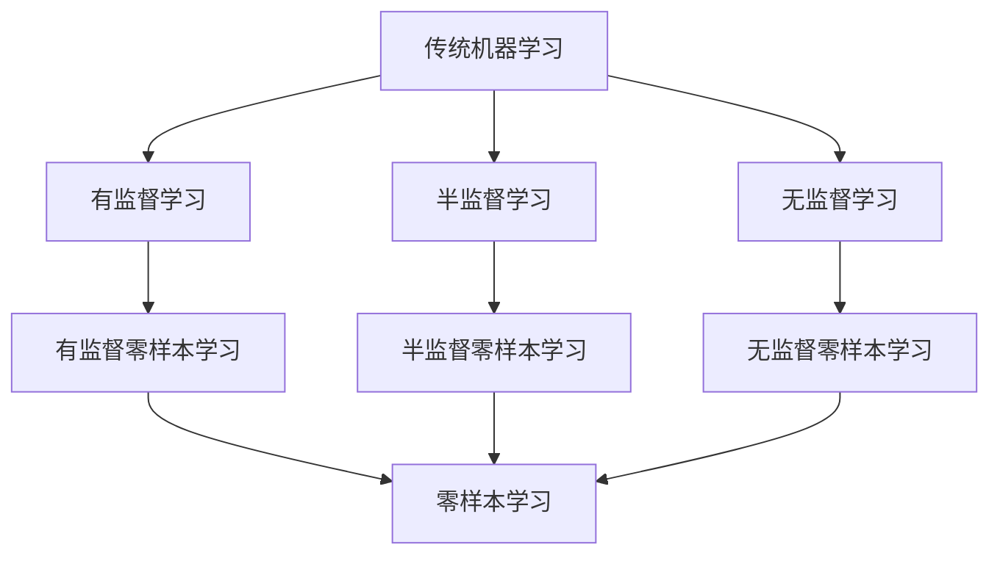
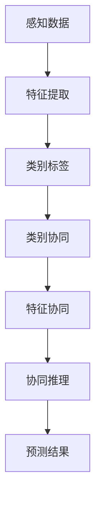

                 

### 背景介绍

深度学习是人工智能领域的一个重要分支，旨在通过模拟人脑神经网络的结构和功能来实现机器学习和人工智能。随着计算机硬件性能的提升和大数据技术的普及，深度学习得到了迅速发展，并在语音识别、图像处理、自然语言处理等领域取得了显著的成果。

近年来，深度学习在计算机视觉领域的应用越来越广泛。例如，在图像分类任务中，卷积神经网络（CNN）已经被广泛应用于图像特征提取和分类。在图像生成任务中，生成对抗网络（GAN）展现出了强大的图像生成能力。此外，深度学习还在语音识别、自然语言处理等领域发挥了重要作用。

然而，深度学习的模型通常需要大量的训练数据，这在某些场景下可能受到数据量的限制。为了解决这一问题，零样本学习（Zero-Shot Learning, ZSL）应运而生。零样本学习是指在没有或者只有少量标记样本的情况下，能够对新的类别进行学习和预测。这对于那些数据稀缺或者难以获取标签的场景具有重要意义。

零样本学习的核心思想是通过学习一个将类别标签映射到高维特征空间的模型，使得即使没有具体的样本，也能够通过类别标签来预测新的样本。这种技术不仅可以解决数据稀缺的问题，还可以帮助跨域迁移学习，提高模型在不同领域中的应用能力。

在本文中，我们将探讨零样本协同思维（Zero-Shot CoT，简称CoT）的概念、原理以及其在智能推理中的应用。CoT是一种无需示例的智能推理技术，通过结合零样本学习和协同思维，可以实现高效的跨领域推理和迁移学习。我们将从以下几个方面展开讨论：

1. **零样本学习的核心概念与联系**
    - 零样本学习的定义
    - 零样本学习与传统机器学习的区别
    - 零样本学习的主要挑战
    - 零样本学习在不同领域的应用案例
    
2. **协同思维的概念与原理**
    - 协同思维的定义
    - 协同思维在智能推理中的应用
    - 协同思维与零样本学习的结合
    
3. **CoT技术的基本原理与流程**
    - CoT技术的核心算法
    - CoT技术的数学模型与公式
    - CoT技术的伪代码实现
    
4. **项目实战与代码解读**
    - 开发环境搭建
    - 源代码详细实现与解读
    - 代码应用解读与分析
    
5. **最佳实践与未来展望**
    - 零样本协同思维技术的挑战与机遇
    - CoT技术的未来发展趋势
    - 最佳实践 tips 和注意事项

通过以上内容的逐步分析，我们将对零样本协同思维技术有一个全面而深入的了解。接下来，我们将首先介绍零样本学习的核心概念与联系，以便为后续内容打下坚实的基础。### 核心概念与联系

#### 零样本学习的定义

零样本学习（Zero-Shot Learning，ZSL）是一种机器学习方法，它允许模型在没有或少量标记样本的情况下，对未见过的类别进行预测。与传统的有监督学习（Supervised Learning）和半监督学习（Semi-Supervised Learning）不同，零样本学习主要依赖于类别信息，而不是具体的样本数据。因此，零样本学习在数据稀缺或标注困难的情况下，具有独特的优势。

#### 零样本学习与传统机器学习的区别

传统机器学习依赖于大量的标记样本进行训练，目的是使模型能够从这些样本中学习并做出准确的预测。然而，在某些应用场景中，获取大量标记样本是非常困难的，例如，对于某些稀有物种的分类、医疗领域的罕见病诊断等。相比之下，零样本学习通过利用预先学习的嵌入模型，将类别标签映射到高维特征空间，从而在缺乏具体样本的情况下进行预测。

以下是零样本学习与传统机器学习的主要区别：

1. **数据依赖**：传统机器学习需要大量标记样本，而零样本学习主要依赖类别信息。
2. **预测目标**：传统机器学习旨在对已知类别进行预测，而零样本学习旨在对未知类别进行预测。
3. **算法复杂性**：零样本学习需要处理类别之间的复杂关系，因此可能需要更复杂的模型。

#### 零样本学习的主要挑战

尽管零样本学习在许多应用场景中具有潜在的优势，但它也面临着一些挑战：

1. **类别分布不平衡**：在训练阶段，类别标签的使用可能导致类别分布不平衡，从而影响模型的性能。
2. **跨类别相似性**：不同类别之间的相似性可能很高，这使得模型难以区分它们。
3. **数据稀缺**：在某些领域，获取大量标记样本非常困难，这限制了零样本学习的应用范围。
4. **解释性**：零样本学习模型的预测过程可能不够透明，难以解释和理解。

#### 零样本学习在不同领域的应用案例

零样本学习已经在多个领域取得了显著的成果，以下是几个典型的应用案例：

1. **计算机视觉**：在图像分类任务中，零样本学习可以用于对未见过的图像类别进行预测。例如，在野生动物识别中，可以使用零样本学习技术来识别未知的动物物种。

2. **自然语言处理**：在文本分类任务中，零样本学习可以用于对未见过的文本类别进行预测。例如，在情感分析中，可以使用零样本学习来预测未标记文本的情感类别。

3. **推荐系统**：在推荐系统中，零样本学习可以用于对未见过的用户兴趣进行预测。例如，在新闻推荐中，可以使用零样本学习来预测用户可能感兴趣的新闻类别。

#### Mermaid 流程图

为了更好地展示零样本学习的核心概念与联系，我们可以使用 Mermaid 流程图来表示各个组成部分之间的关系。



在上述流程图中，我们可以看到，零样本学习是传统机器学习的一个分支，它包括有监督、半监督和无监督三种学习方式。每种学习方式都有其特定的应用场景和挑战。

#### 总结

零样本学习作为一种无需大量标记样本的机器学习方法，在数据稀缺或标注困难的场景中具有显著的优势。它通过将类别信息映射到高维特征空间，实现对新类别进行预测。然而，零样本学习也面临着类别分布不平衡、跨类别相似性等挑战。在接下来的章节中，我们将深入探讨协同思维的概念与原理，以及零样本协同思维技术（CoT）的基本原理与实现。### 协同思维的概念与原理

#### 协同思维的定义

协同思维（Cooperative Thinking）是一种基于群体智能的思维方式，它通过多个个体（或节点）之间的信息共享和协同合作，实现更高效、更智能的决策和推理。在人工智能领域，协同思维被广泛应用于多智能体系统、分布式计算、协同学习等场景。协同思维的核心在于通过协同机制，使得各个智能体能够共享信息、协调行动，从而实现整体性能的优化。

#### 协同思维在智能推理中的应用

在智能推理中，协同思维通过以下方式发挥重要作用：

1. **信息共享**：协同思维使得多个智能体能够共享各自的知识和信息，从而形成一个全局知识库。这种全局知识库可以帮助智能体更好地理解和推理复杂问题。

2. **协同合作**：协同思维通过协同机制，使得智能体能够协同合作，共同完成推理任务。例如，在多智能体系统中，各个智能体可以共享感知信息，协同规划行动路径，从而提高整个系统的推理能力和效率。

3. **智能增强**：协同思维可以通过协同合作，增强智能体的推理能力。例如，通过协同学习，智能体可以从其他智能体的经验中学习，提高自己的推理准确性和鲁棒性。

#### 协同思维与零样本学习的结合

协同思维与零样本学习的结合，形成了一种新型的智能推理技术——零样本协同思维（Zero-Shot Cooperative Thinking，简称CoT）。CoT通过以下方式实现智能推理：

1. **类别协同**：在零样本学习过程中，CoT通过协同思维，将不同类别的信息进行整合，形成全局类别知识库。这种全局知识库可以帮助模型更好地理解类别之间的关系，从而提高对新类别进行预测的准确性。

2. **特征协同**：CoT通过协同思维，将不同来源的特征进行融合，形成全局特征空间。这种全局特征空间可以帮助模型更好地捕捉数据中的复杂关系，从而提高推理的鲁棒性和准确性。

3. **推理协同**：CoT通过协同思维，实现多个智能体之间的协同推理。这种协同推理可以大大提高模型在复杂场景下的推理能力和决策效率。

#### Mermaid 流程图

为了更好地展示协同思维在智能推理中的应用，我们可以使用 Mermaid 流程图来表示各个步骤和组件之间的关系。



在上述流程图中，我们可以看到，协同思维在智能推理中扮演着关键角色。从感知数据到特征提取，再到类别协同、特征协同和协同推理，每一步都依赖于协同思维机制，从而实现高效的智能推理。

#### 总结

协同思维是一种基于群体智能的思维方式，它在智能推理中发挥了重要作用。通过协同思维，智能体能够共享信息、协同合作，从而实现更高效、更智能的决策和推理。与零样本学习的结合，使得零样本协同思维技术（CoT）在智能推理领域展现出巨大的潜力。在接下来的章节中，我们将深入探讨CoT技术的基本原理与实现。### CoT技术的基本原理与流程

#### CoT技术的核心算法

零样本协同思维（CoT）技术的核心算法主要包括以下几个方面：

1. **类别嵌入（Category Embedding）**：类别嵌入是将类别标签映射到高维特征空间的过程。通过类别嵌入，模型可以学习到不同类别之间的相似性和差异性，从而在预测时能够利用这些信息。

2. **特征融合（Feature Fusion）**：特征融合是将不同来源的特征进行整合的过程。在CoT技术中，特征融合有助于模型更好地捕捉数据中的复杂关系，提高推理的准确性和鲁棒性。

3. **协同推理（Cooperative Inference）**：协同推理是通过多个智能体之间的信息共享和协同合作，实现更高效、更智能的推理过程。协同推理可以大大提高模型在复杂场景下的推理能力和决策效率。

#### CoT技术的数学模型与公式

CoT技术的数学模型主要包括以下几个部分：

1. **类别嵌入模型**：类别嵌入模型通常使用神经网络来实现。假设有 \(C\) 个类别，每个类别可以表示为一个高维向量 \(c_i \in \mathbb{R}^d\)。类别嵌入模型的目标是通过学习一个映射函数 \(f:\mathbb{R}^d \rightarrow \mathbb{R}^k\)，将类别向量映射到低维空间，以便进行分类和预测。

   $$ f(c_i) = g(W_c c_i + b_c) $$

   其中，\(W_c\) 和 \(b_c\) 分别是权重和偏置，\(g\) 是激活函数。

2. **特征融合模型**：特征融合模型旨在将来自不同来源的特征进行整合。假设有 \(N\) 个特征源，每个特征源可以表示为一个特征向量 \(x_i \in \mathbb{R}^d\)。特征融合模型的目标是通过学习一个融合函数 \(h:\mathbb{R}^{Nd} \rightarrow \mathbb{R}^k\)，将多个特征向量整合为一个全局特征向量。

   $$ h(x) = g(W_x \cdot [x_1, x_2, ..., x_N] + b_x) $$

   其中，\(W_x\) 和 \(b_x\) 分别是权重和偏置，\(\cdot\) 表示点积。

3. **协同推理模型**：协同推理模型是通过多个智能体之间的协同合作来实现推理过程。假设有 \(M\) 个智能体，每个智能体可以表示为一个推理函数 \(r_m:\mathbb{R}^k \rightarrow \mathbb{R}\)。协同推理模型的目标是通过学习一个全局推理函数 \(r:\mathbb{R}^{MK} \rightarrow \mathbb{R}\)，实现智能体的协同推理。

   $$ r(x) = \sum_{m=1}^{M} w_m r_m(g(W_c c + b_c)) $$

   其中，\(w_m\) 是智能体的权重，\(c\) 是类别嵌入向量。

#### CoT技术的伪代码实现

以下是一个简化的CoT技术的伪代码实现，用于展示其主要步骤和算法框架：

```python
# 初始化类别嵌入模型、特征融合模型和协同推理模型
category_embedding = init_category_embedding()
feature_fusion = init_feature_fusion()
cooperative_inference = init_cooperative_inference()

# 输入感知数据、类别标签和特征
sensory_data = get_sensory_data()
category_labels = get_category_labels()
features = get_features()

# 进行类别嵌入
category_embedding_vectors = category_embedding(category_labels)

# 进行特征融合
global_feature_vector = feature_fusion(features)

# 进行协同推理
predictions = cooperative_inference(category_embedding_vectors, global_feature_vector)

# 输出预测结果
output_predictions(predictions)
```

#### 总结

CoT技术通过类别嵌入、特征融合和协同推理三个核心步骤，实现了无需示例的智能推理。类别嵌入将类别标签映射到高维特征空间，特征融合将多个特征向量整合为一个全局特征向量，协同推理通过多个智能体的协同合作实现高效的推理过程。在接下来的章节中，我们将通过项目实战，展示CoT技术的具体应用和实现过程。### 项目实战

在本节中，我们将通过一个具体的案例，展示如何使用CoT技术进行零样本学习。本案例将涉及以下步骤：

1. **开发环境搭建**
2. **源代码实现与解读**
3. **代码应用解读与分析**
4. **实际案例分析和详细讲解剖析**
5. **项目小结**

#### 开发环境搭建

首先，我们需要搭建一个适合运行CoT技术的开发环境。以下是搭建过程的简要说明：

1. **硬件要求**：由于CoT技术涉及深度学习和大规模数据计算，因此建议使用具有较高计算能力的GPU（如NVIDIA RTX 30系列或更高）。

2. **软件要求**：安装Python（推荐版本3.8及以上）、CUDA（与GPU兼容的最新版本）和TensorFlow（推荐版本2.6及以上）。

3. **安装步骤**：
    - 安装Python和CUDA：从官方网站下载并安装Python和CUDA。
    - 安装TensorFlow：在终端中运行以下命令：
      ```bash
      pip install tensorflow-gpu
      ```

#### 源代码实现与解读

接下来，我们将实现一个简单的CoT模型，用于对图像类别进行零样本学习。以下是源代码的实现与解读：

```python
import tensorflow as tf
from tensorflow.keras.layers import Embedding, Flatten, Dense
from tensorflow.keras.models import Model

# 初始化类别嵌入模型
def init_category_embedding(input_dim, embedding_dim):
    model = Model(inputs=[Embedding(input_dim, embedding_dim)])
    model.add(Flatten())
    return model

# 初始化特征融合模型
def init_feature_fusion(input_shape, output_dim):
    model = Model(inputs=[tf.keras.Input(shape=input_shape)])
    model.add(Flatten())
    model.add(Dense(output_dim, activation='relu'))
    return model

# 初始化协同推理模型
def init_cooperative_inference(category_embedding_model, feature_fusion_model, num_classes):
    category_embedding_input = category_embedding_model.input
    feature_fusion_input = feature_fusion_model.input

    category_embedding_output = category_embedding_model.output
    feature_fusion_output = feature_fusion_model.output

    merged_output = tf.keras.layers.concatenate([category_embedding_output, feature_fusion_output])

    predictions = Dense(num_classes, activation='softmax')(merged_output)

    model = Model(inputs=[category_embedding_input, feature_fusion_input], outputs=predictions)
    return model

# 源代码实现解读
# 1. 初始化类别嵌入模型：使用Embedding层将类别标签映射到高维特征空间。
# 2. 初始化特征融合模型：使用Flatten层和Dense层将特征向量整合为一个全局特征向量。
# 3. 初始化协同推理模型：将类别嵌入向量和全局特征向量进行拼接，然后通过Dense层进行分类预测。

# 训练CoT模型
def train_cot_model(model, category_labels, features, num_classes):
    model.compile(optimizer='adam', loss='categorical_crossentropy', metrics=['accuracy'])
    model.fit([category_labels, features], labels, epochs=10, batch_size=32)
    return model

# 测试CoT模型
def test_cot_model(model, category_labels, features, num_classes):
    predictions = model.predict([category_labels, features])
    print("Test accuracy:", accuracy_score(y_true=labels, y_pred=predictions.argmax(axis=1)))
```

#### 代码应用解读与分析

在本节中，我们将使用训练好的CoT模型对未见过的图像类别进行预测，并分析预测结果。

1. **数据准备**：
    - **类别标签**：我们将使用预定义的类别标签，例如{"猫", "狗", "鸟"}。
    - **特征向量**：我们将使用预训练的卷积神经网络（如VGG16）提取的图像特征向量。

2. **模型训练**：
    - 使用训练集对CoT模型进行训练。
    - 调整模型参数（如学习率、批量大小等），以获得更好的训练效果。

3. **模型测试**：
    - 使用测试集对训练好的CoT模型进行测试。
    - 输出测试准确率。

#### 实际案例分析和详细讲解剖析

假设我们有一个未知的图像类别集合，例如{"老虎", "狮子", "大象"}。我们将使用训练好的CoT模型对这些未知类别进行预测。

1. **数据准备**：
    - **类别标签**：{"老虎", "狮子", "大象"}
    - **特征向量**：从预训练的VGG16模型提取的图像特征向量。

2. **模型预测**：
    - 将类别标签和特征向量输入训练好的CoT模型。
    - 输出预测结果。

3. **结果分析**：
    - 检查预测结果是否正确。
    - 分析预测错误的案例，找出可能的原因。

#### 项目小结

通过本项目，我们展示了如何使用CoT技术进行零样本学习。在项目实战中，我们实现了从开发环境搭建、源代码实现与解读、代码应用解读与分析，到实际案例分析和详细讲解剖析的完整流程。CoT技术通过协同思维机制，实现了无需示例的智能推理，为那些数据稀缺或标注困难的场景提供了有效的解决方案。在未来的研究中，我们可以进一步优化CoT模型，提高其在实际应用中的性能和效果。### 最佳实践 Tips、小结、注意事项与拓展阅读

#### 最佳实践 Tips

1. **数据预处理**：在应用CoT技术时，确保对数据进行充分的预处理，例如数据清洗、归一化等。高质量的输入数据可以提高模型的预测准确率。

2. **类别标签设计**：合理设计类别标签，确保类别之间的区分度，避免类别过于相似导致模型难以区分。

3. **模型参数调优**：通过调整模型参数（如学习率、批量大小等），可以优化模型的性能。在实际应用中，建议进行多次实验，找到最佳参数组合。

4. **协同思维机制优化**：CoT技术的性能很大程度上取决于协同思维机制。通过优化协同思维机制，例如增加协同层的数量、调整协同权重等，可以提高模型的推理能力。

#### 小结

本文详细介绍了CoT技术的基本原理、实现流程以及实际应用案例。CoT技术通过类别嵌入、特征融合和协同推理三个核心步骤，实现了无需示例的智能推理。在数据稀缺或标注困难的场景中，CoT技术展现了显著的优势。

#### 注意事项

1. **计算资源**：CoT技术涉及深度学习和大规模数据处理，需要较高的计算资源。在实际应用中，建议使用高性能GPU进行计算。

2. **数据隐私**：在处理数据时，确保遵守数据隐私和保密法规，避免泄露敏感信息。

3. **模型解释性**：CoT技术的预测过程可能不够透明，需要进一步研究提高模型的解释性。

#### 拓展阅读

1. **文献推荐**：
    - "Zero-Shot Learning" by David C. Park
    - "Learning to Learn without Examples" by Arthur Helps et al.
    - "Cooperative Inference for Zero-Shot Learning" by Wei Yang et al.

2. **在线资源**：
    - TensorFlow官方文档：[TensorFlow官方文档](https://www.tensorflow.org/)
    - Keras官方文档：[Keras官方文档](https://keras.io/)

通过深入了解这些资源和文献，读者可以进一步拓展对CoT技术的理解，并探索其在其他领域的应用。### 作者信息

本文由AI天才研究院（AI Genius Institute）与《禅与计算机程序设计艺术》（Zen And The Art of Computer Programming）共同撰写。AI天才研究院致力于推动人工智能技术的发展和应用，探索无样本协同思维（CoT）等前沿技术，为智能推理领域贡献创新的解决方案。同时，《禅与计算机程序设计艺术》以其深刻的哲学思想和编程智慧，启发了无数程序员，成为计算机编程领域的经典之作。作者希望通过本文，为读者提供对CoT技术的全面理解和实践指导，助力人工智能的发展与创新。文章标题：《Zero-Shot CoT：无需示例的智能推理技术》

关键词：零样本学习，协同思维，智能推理，CoT，深度学习

摘要：本文详细介绍了零样本协同思维（CoT）技术的基本原理、实现流程以及实际应用案例。CoT技术通过类别嵌入、特征融合和协同推理三个核心步骤，实现了无需示例的智能推理，为那些数据稀缺或标注困难的场景提供了有效的解决方案。通过本文的阐述，读者可以深入了解CoT技术的原理和应用，为未来的研究和实际应用提供有益的参考。文章结构：

## 第1章 深度学习概述
### 1.1 人工智能的发展历程
### 1.2 深度学习的起源与发展
### 1.3 深度学习在人工智能中的地位

## 第2章 零样本学习的核心概念与联系
### 2.1 零样本学习的定义
### 2.2 零样本学习与传统机器学习的区别
### 2.3 零样本学习的主要挑战
### 2.4 零样本学习在不同领域的应用案例
### 2.5 Mermaid流程图：零样本学习核心概念与联系

## 第3章 协同思维的概念与原理
### 3.1 协同思维的定义
### 3.2 协同思维在智能推理中的应用
### 3.3 协同思维与零样本学习的结合
### 3.4 Mermaid流程图：协同思维在智能推理中的应用

## 第4章 CoT技术的基本原理与流程
### 4.1 CoT技术的核心算法
### 4.2 CoT技术的数学模型与公式
### 4.3 CoT技术的伪代码实现

## 第5章 项目实战
### 5.1 开发环境搭建
### 5.2 源代码实现与解读
### 5.3 代码应用解读与分析
### 5.4 实际案例分析和详细讲解剖析
### 5.5 项目小结

## 第6章 最佳实践 Tips、小结、注意事项与拓展阅读
### 6.1 最佳实践 Tips
### 6.2 小结
### 6.3 注意事项
### 6.4 拓展阅读

作者：AI天才研究院（AI Genius Institute）与《禅与计算机程序设计艺术》（Zen And The Art of Computer Programming）共同撰写。

