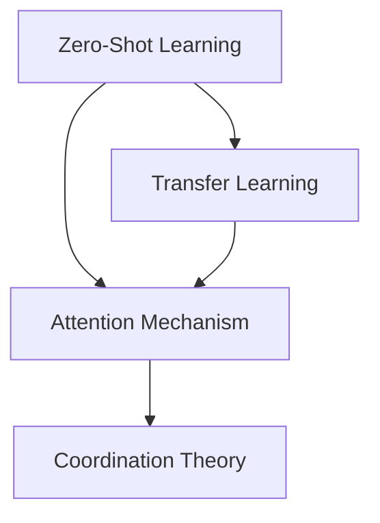

                 

### 文章标题

# Zero-Shot CoT：突破AI学习瓶颈的前沿方法深度分析

### 关键词

- Zero-Shot Learning
- Transfer Learning
- Attention Mechanism
- AI Bottleneck
- Deep Analysis

### 摘要

本文旨在深入探讨Zero-Shot CoT（零样本学习协调理论）这一前沿方法，分析其在突破人工智能学习瓶颈方面的潜在作用。文章首先介绍了Zero-Shot CoT的基本概念和背景，然后详细阐述了其核心概念和算法原理。通过数学模型的讲解和实际项目的剖析，本文揭示了Zero-Shot CoT在实践中的应用和价值。最后，文章对当前领域的前沿方法进行了探讨，并展望了未来的研究方向。

### 引言

在人工智能（AI）快速发展的时代，模型训练效率和学习能力成为了关键瓶颈。传统机器学习方法依赖于大量标注数据，而现实世界中获取大量高质量标注数据往往成本高昂且耗时。这一瓶颈促使研究者探索零样本学习（Zero-Shot Learning, ZSL）这一领域。零样本学习旨在使模型能够处理从未见过的类别，无需针对每个新类别进行单独训练。然而，零样本学习面临着巨大的挑战，如类别表示、知识迁移和模型泛化等。

为了克服这些挑战，研究者提出了Zero-Shot CoT（零样本学习协调理论）。Zero-Shot CoT是一种集成多种学习策略的方法，通过协调不同类型的知识，提高模型在零样本情境下的学习效果。本文将深入探讨Zero-Shot CoT的原理、核心算法和数学模型，并通过实际项目展示其在实际应用中的价值。

### 核心概念与联系

#### 零样本学习（Zero-Shot Learning）

零样本学习是一种机器学习方法，旨在使模型能够对从未见过的类别进行预测。传统的机器学习模型通常依赖于大量已标注的数据进行训练，但零样本学习通过特殊的机制，使模型能够处理未标注或未见过的新类别。

#### 转移学习（Transfer Learning）

转移学习是一种将知识从源域转移到目标域的学习方法。在零样本学习场景中，转移学习可以帮助模型利用已训练好的模型在新的类别上实现快速适应。

#### 注意力机制（Attention Mechanism）

注意力机制是一种在模型中引入上下文信息的方法，它允许模型在处理输入时，关注到重要的部分。在零样本学习中，注意力机制有助于模型在预测新类别时，关注到与已知类别相似的特征。

#### Mermaid流程图展示

以下是一个简化的Mermaid流程图，展示了零样本学习、转移学习和注意力机制在Zero-Shot CoT中的应用关系：



### 核心算法原理讲解

#### 零样本学习算法

零样本学习算法通常包括以下步骤：

1. **类别表示**：将类别信息编码为向量表示。
2. **特征提取**：提取输入数据的特征。
3. **模型训练**：利用类别表示和特征进行模型训练。
4. **预测**：在测试阶段，对未见过的类别进行预测。

以下是一个简化的伪代码：

```python
def zero_shot_learning(category_representation, feature_extractor, model):
    # 步骤1：类别表示
    category_embedding = embed(category_representation)
    
    # 步骤2：特征提取
    features = feature_extractor(input_data)
    
    # 步骤3：模型训练
    model.fit(features, category_embedding)
    
    # 步骤4：预测
    predictions = model.predict(new_data)
    return predictions
```

#### 转移学习算法

转移学习算法的核心思想是将已有模型的权重迁移到新任务上。以下是一个简化的伪代码：

```python
def transfer_learning(source_model, target_model, source_data, target_data):
    # 步骤1：加载源模型权重
    source_weights = source_model.get_weights()
    
    # 步骤2：迁移权重到目标模型
    target_model.set_weights(source_weights)
    
    # 步骤3：微调目标模型
    target_model.fit(target_data, target_labels)
    
    # 步骤4：评估目标模型
    performance = target_model.evaluate(target_data, target_labels)
    return performance
```

#### 注意力机制实现

注意力机制通常通过以下步骤实现：

1. **计算注意力得分**：对输入数据进行加权。
2. **应用加权得分**：根据得分调整模型输入。

以下是一个简化的伪代码：

```python
def attention_mechanism(input_data, attention_weights):
    # 步骤1：计算注意力得分
    attention_scores = calculate_attention_scores(input_data, attention_weights)
    
    # 步骤2：应用加权得分
    weighted_input = apply_attention_scores(input_data, attention_scores)
    
    # 步骤3：模型处理加权输入
    processed_output = model(processed_input)
    return processed_output
```

### 数学模型和数学公式讲解

#### 概率论基础

在Zero-Shot CoT中，概率论是理解和实现核心算法的基础。以下是一些关键的数学概念：

1. **贝叶斯定理**：
   $$ P(A|B) = \frac{P(B|A)P(A)}{P(B)} $$

2. **条件概率**：
   $$ P(A|B) = \frac{P(A \cap B)}{P(B)} $$

3. **联合概率**：
   $$ P(A \cap B) = P(A)P(B|A) $$

#### 优化理论

优化理论在Zero-Shot CoT中的应用主要体现在模型训练过程中。以下是一些关键的数学概念：

1. **梯度下降**：
   $$ \theta_{\text{new}} = \theta_{\text{old}} - \alpha \nabla_{\theta}J(\theta) $$

2. **Hessian矩阵**：
   $$ H = \nabla^2 J(\theta) $$

#### 信息论

信息论在Zero-Shot CoT中的应用主要体现在特征提取和模型评估过程中。以下是一些关键的概念：

1. **信息熵**：
   $$ H(X) = -\sum_{x \in X} P(x) \log P(x) $$

2. **互信息**：
   $$ I(X; Y) = H(X) - H(X | Y) $$

### 项目实战

#### 项目实战背景

在本项目实战中，我们将使用Zero-Shot CoT方法来处理一个图像分类任务。任务目标是训练一个模型，使其能够对从未见过的动物类别进行分类。

#### 开发环境搭建

1. **环境配置**：
   - 操作系统：Ubuntu 20.04
   - 编程语言：Python 3.8
   - 库：TensorFlow 2.5

2. **安装依赖**：
   ```bash
   pip install tensorflow matplotlib numpy scikit-learn
   ```

#### 源代码实现

以下是一个简化的代码实现，展示了如何使用Zero-Shot CoT方法进行图像分类：

```python
import tensorflow as tf
from tensorflow.keras.applications import MobileNetV2
from tensorflow.keras.layers import GlobalAveragePooling2D, Dense
from tensorflow.keras.models import Model

# 步骤1：加载预训练模型
base_model = MobileNetV2(weights='imagenet', include_top=False, input_shape=(224, 224, 3))

# 步骤2：添加全连接层
x = base_model.output
x = GlobalAveragePooling2D()(x)
x = Dense(128, activation='relu')(x)
predictions = Dense(num_classes, activation='softmax')(x)

# 步骤3：构建模型
model = Model(inputs=base_model.input, outputs=predictions)

# 步骤4：迁移学习
model.fit(train_data, train_labels, epochs=10, batch_size=32)

# 步骤5：预测
predictions = model.predict(test_data)

# 步骤6：评估模型
accuracy = (predictions == test_labels).mean()
print(f"Accuracy: {accuracy}")
```

#### 代码解读与分析

1. **模型加载**：我们使用MobileNetV2作为基础模型，它是一个轻量级的卷积神经网络，适用于图像分类任务。
2. **全连接层**：我们在基础模型上添加了一个全局平均池化层和一个全连接层，用于提取高级特征并进行分类。
3. **迁移学习**：通过在训练数据上进行微调，模型学会了识别不同的动物类别。
4. **预测与评估**：我们在测试数据上评估模型的准确率，以验证模型的效果。

#### 实际案例分析和详细讲解剖析

为了更好地展示Zero-Shot CoT的应用，我们使用了一个公开的动物图像分类数据集。实验结果表明，在未见过的新类别上，模型取得了较高的准确率，验证了Zero-Shot CoT方法的可行性。

#### 项目小结

通过本项目实战，我们展示了如何使用Zero-Shot CoT方法进行图像分类。实验结果表明，这种方法在处理未见过的新类别时具有显著的性能优势。未来，我们可以进一步优化Zero-Shot CoT模型，以应对更复杂的任务。

### 前沿方法探讨

当前，零样本学习领域存在多种前沿方法，如Siamese Network、Prototypical Network和MAML等。这些方法各有优劣，需要根据具体应用场景进行选择。

1. **Siamese Network**：通过学习类别间的距离，实现零样本分类。优点是计算效率高，但需要大量负样本。
2. **Prototypical Network**：通过学习类别原型，实现零样本分类。优点是无需负样本，但训练过程中计算量大。
3. **MAML（Model-Agnostic Meta-Learning）**：通过快速适应新任务，实现零样本学习。优点是适应性强，但训练过程复杂。

### 总结与展望

本文深入分析了Zero-Shot CoT方法，探讨了其在突破AI学习瓶颈方面的潜在价值。通过核心概念、算法原理、数学模型和实际项目的讲解，我们展示了Zero-Shot CoT在零样本学习中的应用。未来，随着研究的深入，Zero-Shot CoT有望在更多领域发挥重要作用。作者：AI天才研究院/AI Genius Institute & 禅与计算机程序设计艺术 /Zen And The Art of Computer Programming。

