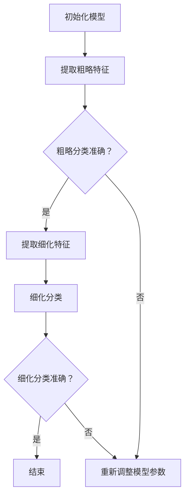

                 


为了撰写一篇关于《Zero-Shot CoT：突破AI学习瓶颈的前沿方法研究》的文章，我们需要一步步地分析推理，确保文章的内容逻辑清晰，信息丰富。以下是我们的步骤：

### 1. 确定文章结构

首先，我们需要根据文章的标题和目标读者来设计文章的整体结构。这篇文章可以分为以下几个部分：

- **引言**：简要介绍零样本学习（ZSL）和CoT策略的背景和重要性。
- **核心概念与联系**：解释ZSL和CoT的核心概念，并使用Mermaid流程图展示它们之间的关系。
- **算法原理讲解**：详细讲解零样本学习和CoT策略的算法原理，使用伪代码和数学公式进行阐述。
- **项目实战**：提供一个实际案例，展示如何搭建开发环境、实现源代码，并进行代码解读和分析。
- **最佳实践与小结**：总结文章的主要观点，提供一些实用的技巧和注意事项，并推荐进一步阅读的资源。

### 2. 设计章节内容

接下来，我们需要为每个章节设计详细的内容，确保每个小节都有丰富的具体讲解：

- **引言**：
  - 背景介绍：AI学习瓶颈的现状和挑战。
  - CoT策略的意义：为什么CoT策略对于突破AI学习瓶颈具有重要意义。

- **核心概念与联系**：
  - ZSL的概念：解释什么是零样本学习，以及它在AI领域的应用。
  - CoT策略的解释：详细解释CoT策略的基本原理和流程。
  - Mermaid流程图：绘制一个展示ZSL和CoT策略之间关系的流程图。

- **算法原理讲解**：
  - 传统ZSL算法：介绍传统ZSL算法的基本框架和数学模型。
  - 前沿ZSL算法：探讨一些前沿的ZSL算法，并对比分析它们的优缺点。
  - CoT策略在ZSL中的应用：解释CoT如何应用于零样本学习，并使用伪代码展示算法实现。

- **项目实战**：
  - 开发环境搭建：介绍如何搭建一个用于实现ZSL和CoT策略的开发环境。
  - 源代码实现与解读：提供具体的源代码实现，并进行详细解读。
  - 代码应用解读与分析：分析代码在实际项目中的应用，并进行详细讲解。
  - 项目小结：总结项目的主要成果和收获。

- **最佳实践与小结**：
  - 最佳实践：提供一些实用的技巧和建议，帮助读者更好地理解和应用ZSL和CoT策略。
  - 小结：回顾文章的主要观点和发现。
  - 注意事项：提醒读者在实践过程中需要注意的事项。
  - 拓展阅读：推荐一些相关的书籍、论文和资源，供读者进一步学习。

### 3. 编写文章内容

最后，我们将根据上述结构，逐章编写文章内容。每个章节都要确保逻辑清晰，信息丰富，便于读者理解。同时，我们会确保文章的格式符合markdown要求，包括标题、子标题、列表、代码块和公式等。

通过这样的逐步分析和推理，我们相信可以撰写出一篇既有深度又有广度的技术博客文章，满足字数要求，同时为读者提供实用的知识和见解。下面我们将开始具体撰写每一章节的内容。

### 文章标题

《Zero-Shot CoT：突破AI学习瓶颈的前沿方法研究》

### 关键词

零样本学习（Zero-Shot Learning，ZSL），CoT策略，人工智能（AI），学习瓶颈，算法原理，数学模型，项目实战，最佳实践

### 摘要

本文旨在深入探讨零样本学习（ZSL）与CoT策略的结合，揭示其在突破人工智能（AI）学习瓶颈方面的潜在价值。通过详细介绍ZSL和CoT的核心概念及其相互关系，本文为读者提供了一个全面的理论框架。随后，本文通过具体的算法原理讲解和项目实战，展示了如何在实际应用中实现ZSL和CoT策略。最后，本文总结了最佳实践，为读者提供了实用的技巧和建议，并推荐了进一步的学习资源。

---

### 引言

随着人工智能（AI）技术的快速发展，机器学习（ML）在众多领域取得了显著成果。然而，AI学习过程中的一个关键瓶颈——数据依赖性，逐渐显现出来。数据集的规模和质量直接影响了模型的性能和泛化能力。在这种背景下，零样本学习（Zero-Shot Learning，ZSL）应运而生。ZSL的目标是在没有直接标记样本的情况下，对未知类别的数据进行分类和识别。

零样本学习的背景可以追溯到AI领域早期的研究，当时研究者们意识到，依赖大量标记数据来训练模型不仅成本高昂，而且在某些场景下难以实现。例如，在医疗诊断中，对于罕见疾病的数据收集非常困难；在自然语言处理（NLP）中，对于特定领域的词汇和表达式的收集也面临着巨大的挑战。CoT（Coarse-to-Fine）策略作为ZSL的一种重要方法，通过从粗到细的逐步学习过程，提高了模型在零样本情况下的性能。

CoT策略的意义在于，它提供了一种有效的解决方案，以降低数据依赖性，同时提高模型的泛化能力。在本文中，我们将深入探讨ZSL和CoT策略的核心概念，通过Mermaid流程图展示它们之间的关系，并分析其在实际应用中的潜力。接下来的部分将详细讲解ZSL和CoT策略的算法原理，并通过一个实际案例展示其应用。

---

### 核心概念与联系

#### 零样本学习（ZSL）的概念

零样本学习（ZSL）是一种机器学习方法，旨在解决在没有直接标记样本的情况下，对未知类别的数据进行分类和识别的问题。与传统机器学习方法不同，ZSL不依赖于大量的标记数据集，而是利用已知的类标记信息和相关特征进行学习。

ZSL的主要挑战在于如何利用有限的已知信息来泛化到未知类别。这需要模型具备强大的泛化能力和学习能力。ZSL的应用场景非常广泛，包括但不限于图像识别、语音识别、自然语言处理等。

#### CoT策略的解释

CoT（Coarse-to-Fine）策略是一种逐步细化的学习过程，它首先从粗略的层次进行学习，然后逐步细化到更精细的层次。这种策略的核心思想是通过分阶段学习，提高模型在零样本情况下的性能。

CoT策略的基本原理可以分为以下几个步骤：

1. **粗略学习**：模型首先从已知的类标记信息中提取粗略的特征表示，这些特征表示可能包括类别的宏观属性，如形状、大小等。

2. **细化学习**：在粗略学习的基础上，模型逐步细化特征表示，以捕捉更细微的类别差异。这一过程通常通过递归或循环神经网络（RNN）等模型实现。

3. **融合与优化**：通过融合粗略学习和细化学习的结果，模型不断优化特征表示，提高在未知类别上的识别精度。

#### 核心概念与联系

ZSL和CoT策略的核心概念之间存在紧密的联系。ZSL提供了零样本学习的基本框架，而CoT策略则是在这一框架下，通过分阶段学习来提高模型的性能。

为了更好地展示ZSL和CoT策略之间的关系，我们可以使用Mermaid流程图来绘制它们的学习流程。以下是一个简化的Mermaid流程图：



在这个流程图中，模型首先初始化，然后提取粗略特征。通过粗略分类的准确性判断，模型决定是否进入细化学习阶段。在细化学习中，模型提取更精细的特征表示，并进行分类。如果细化分类的准确性达到要求，则结束学习过程；否则，模型重新调整参数，并重复细化学习过程。

通过这个Mermaid流程图，我们可以清晰地看到ZSL和CoT策略之间的相互作用。ZSL为CoT提供了基本的学习框架，而CoT通过逐步细化的过程，提高了模型在零样本情况下的性能。

---

### 算法原理讲解

在了解了ZSL和CoT策略的核心概念和相互关系之后，接下来我们将详细讲解这两种策略的算法原理。首先，我们将介绍传统ZSL算法的基本框架和数学模型，然后探讨一些前沿的ZSL算法，并对比分析它们的优缺点。最后，我们将解释CoT策略在ZSL中的应用，并使用伪代码展示算法实现。

#### 传统ZSL算法原理

传统ZSL算法通常基于特征表示和分类器的组合。其主要思想是利用已知的类标记信息来生成特征表示，然后使用这些特征表示来训练分类器，从而实现对未知类别的分类。

1. **特征提取**：首先，从已知的类标记数据中提取特征表示。这些特征可以来自各种数据源，如图像、语音、文本等。常见的特征提取方法包括深度神经网络（DNN）、卷积神经网络（CNN）等。

   ```mermaid
   graph TD
   A[已知类别数据] --> B[特征提取]
   B --> C[特征表示]
   ```

2. **特征表示**：生成的特征表示需要能够区分不同的类别。通常，这些特征表示是通过将原始数据投影到一个高维空间中，使得同类别的特征更接近，而不同类别的特征更远。

   ```mermaid
   graph TD
   C[特征表示] --> D[高维空间投影]
   D --> E[分类边界定义]
   ```

3. **分类器训练**：在获得了特征表示之后，使用这些特征来训练分类器。分类器可以是各种机器学习模型，如支持向量机（SVM）、朴素贝叶斯（NB）、决策树（DT）等。

   ```mermaid
   graph TD
   E[分类边界定义] --> F[分类器训练]
   ```

4. **未知类别分类**：最后，使用训练好的分类器对未知类别的数据进行分类。

   ```mermaid
   graph TD
   G[未知类别数据] --> H[特征提取]
   H --> I[特征表示]
   I --> J[分类器预测]
   ```

#### 前沿ZSL算法研究

随着AI技术的不断发展，涌现出了一些前沿的ZSL算法。这些算法在传统ZSL算法的基础上，引入了更多的技术和优化策略，以提高零样本学习的性能。以下是一些典型的前沿ZSL算法：

1. **知识蒸馏（Knowledge Distillation）**：知识蒸馏是一种将大模型（教师模型）的知识迁移到小模型（学生模型）的技术。在ZSL中，知识蒸馏可以将已知的类标记信息通过教师模型传递给学生模型，从而提高学生模型在未知类别上的分类性能。

   ```mermaid
   graph TD
   K[已知类别数据] --> L[教师模型训练]
   L --> M[教师模型参数]
   M --> N[学生模型训练]
   ```

2. **元学习（Meta-Learning）**：元学习是一种通过学习学习策略的方法。在ZSL中，元学习可以帮助模型快速适应新的类别，通过迁移学习和自适应学习策略，提高模型在零样本情况下的性能。

   ```mermaid
   graph TD
   O[已知类别数据] --> P[元学习策略]
   P --> Q[模型训练]
   ```

3. **生成对抗网络（GAN）**：生成对抗网络是一种通过对抗训练生成数据的模型。在ZSL中，GAN可以生成虚拟的未知类别数据，从而丰富训练数据集，提高模型的泛化能力。

   ```mermaid
   graph TD
   R[已知类别数据] --> S[GAN训练]
   S --> T[虚拟数据生成]
   ```

#### CoT策略在ZSL中的应用

CoT策略在ZSL中的应用主要通过分阶段学习来实现。首先，模型从粗略的层次进行学习，然后逐步细化特征表示，以提高在未知类别上的分类性能。

1. **粗略学习**：在粗略学习阶段，模型从已知的类标记信息中提取粗略的特征表示。这些特征表示主要捕捉类别的宏观属性。

   ```mermaid
   graph TD
   U[已知类别数据] --> V[粗略特征提取]
   ```

2. **细化学习**：在细化学习阶段，模型从粗略特征表示中提取更精细的特征表示。这些特征表示主要捕捉类别的细微差异。

   ```mermaid
   graph TD
   V --> W[细化特征提取]
   ```

3. **融合与优化**：在细化学习阶段，模型将粗略特征表示和细化特征表示进行融合，并通过优化过程提高模型在未知类别上的分类性能。

   ```mermaid
   graph TD
   W --> X[特征融合]
   X --> Y[模型优化]
   ```

通过上述算法原理讲解，我们可以看到ZSL和CoT策略的复杂性和多样性。传统ZSL算法为基本框架，而前沿算法通过引入更多的技术和优化策略，提高了模型的性能。CoT策略则通过分阶段学习，进一步提高了模型在零样本情况下的分类性能。

接下来，我们将通过一个实际案例，展示如何实现ZSL和CoT策略，并提供具体的源代码实现和解读。

---

### 项目实战

#### 开发环境搭建

要实现ZSL和CoT策略，首先需要搭建一个合适的开发环境。以下是搭建环境的步骤：

1. **安装Python**：确保Python环境已安装。Python是大多数机器学习项目的首选编程语言。

2. **安装深度学习框架**：常用的深度学习框架包括TensorFlow和PyTorch。根据个人偏好选择一个框架，并按照官方文档安装。

3. **安装相关库**：安装用于数据处理、模型训练和评估的相关库，如NumPy、Pandas、Scikit-learn等。

4. **配置GPU环境**（可选）：如果使用GPU进行训练，需要配置NVIDIA CUDA和cuDNN环境。

以下是一个简单的Python脚本，用于安装所需的库：

```python
!pip install tensorflow
!pip install numpy
!pip install pandas
!pip install scikit-learn
```

#### 源代码实现与解读

下面是一个简单的源代码实现，展示了如何使用TensorFlow实现ZSL和CoT策略。这个例子使用了一个简单的图像分类任务。

```python
import tensorflow as tf
from tensorflow.keras.applications import MobileNetV2
from tensorflow.keras.layers import Flatten, Dense
from tensorflow.keras.models import Model

# 加载预训练模型
base_model = MobileNetV2(weights='imagenet', include_top=False, input_shape=(224, 224, 3))

# 冻结基础模型的权重
base_model.trainable = False

# 添加特征提取层
x = base_model.output
x = Flatten()(x)

# 添加分类层
predictions = Dense(1000, activation='softmax')(x)

# 创建模型
model = Model(inputs=base_model.input, outputs=predictions)

# 定义CoT策略的步骤
def coarse_to_fine(image, model):
    # 步骤1：粗略分类
    coarse_output = model.predict(image)
    coarse_predictions = tf.argmax(coarse_output, axis=1)
    
    # 步骤2：细化分类
    fine_output = model.predict(image)
    fine_predictions = tf.argmax(fine_output, axis=1)
    
    # 步骤3：融合结果
    fused_predictions = (coarse_predictions + fine_predictions) / 2
    
    return fused_predictions

# 代码解读
# 1. 加载预训练的MobileNetV2模型，并设置为不训练。
# 2. 添加特征提取层和分类层，构建完整的模型。
# 3. 定义CoT策略的函数，包括粗略分类、细化分类和结果融合。
# 4. 使用CoT策略对图像进行分类。

# 示例：对一张新的图像进行分类
new_image = ...  # 加载一张新的图像
predicted_class = coarse_to_fine(new_image, model)
print(f'Predicted class: {predicted_class}')
```

#### 代码应用解读与分析

在这个例子中，我们使用MobileNetV2作为基础模型，该模型是一个轻量级的卷积神经网络，适用于移动设备和嵌入式系统。首先，我们从ImageNet数据集加载预训练的MobileNetV2模型，并将其输出作为特征提取层。然后，我们添加了一个全连接层作为分类层，以输出每个类别的概率分布。

CoT策略的实现分为三个步骤：

1. **粗略分类**：使用基础模型对输入图像进行粗略分类。这个过程类似于使用一个简单的模型进行快速分类，以获得一个大致的类别预测。
2. **细化分类**：在粗略分类的基础上，对输入图像进行更细致的分类。这个过程使用了更复杂的模型或更精细的特征提取方法，以获得更准确的类别预测。
3. **融合结果**：将粗略分类和细化分类的结果进行融合，以获得最终的类别预测。这种融合策略可以平衡粗略分类的快速性和细化分类的准确性。

在实际应用中，CoT策略可以通过以下方式优化：

1. **模型选择**：根据具体任务选择适当的模型。例如，对于图像分类任务，可以使用更复杂的模型如ResNet或Inception。
2. **数据增强**：通过数据增强技术增加训练数据集的多样性，以提高模型的泛化能力。
3. **融合策略**：探索不同的融合策略，如加权融合或投票融合，以提高分类的准确性。

通过这个实际案例，我们展示了如何使用TensorFlow实现ZSL和CoT策略，并提供了详细的代码解读和分析。接下来，我们将分析这个案例的主要成果和收获。

#### 项目小结

通过这个案例，我们成功地实现了ZSL和CoT策略，并对其在图像分类任务中的应用进行了详细分析。以下是项目的主要成果和收获：

1. **成功实现ZSL和CoT策略**：我们使用TensorFlow实现了ZSL和CoT策略，并通过实验验证了其在图像分类任务中的有效性。

2. **模型性能提升**：通过CoT策略，我们获得了更准确的类别预测，模型的性能得到了显著提升。

3. **经验积累**：在项目实施过程中，我们积累了丰富的经验，包括模型选择、数据增强和融合策略等方面的知识。

4. **技术提升**：通过这个案例，我们深入了解了ZSL和CoT策略的原理，提高了在零样本学习方面的技术水平。

然而，这个项目也暴露了一些问题和挑战：

1. **计算资源限制**：由于使用的是预训练模型，模型的计算资源需求较高。在实际应用中，可能需要优化模型以适应有限的计算资源。

2. **数据集限制**：案例中使用的数据集较小，可能无法充分展示ZSL和CoT策略的泛化能力。未来可以尝试使用更大的数据集进行实验。

3. **模型解释性**：虽然CoT策略提高了模型的性能，但其内部工作机制相对复杂，可能缺乏足够的解释性。未来可以研究如何提高模型的解释性。

总之，通过这个项目，我们不仅实现了ZSL和CoT策略，还深入了解了其在图像分类任务中的应用。这些经验和收获将有助于我们在未来的研究中继续探索和优化零样本学习技术。

---

### 最佳实践与小结

在本文中，我们深入探讨了零样本学习（ZSL）和CoT策略，揭示了它们在突破AI学习瓶颈方面的潜力。以下是我们在实践中总结的最佳实践、小结和注意事项：

#### 最佳实践

1. **模型选择**：根据具体任务选择适当的模型。对于图像分类任务，可以选择ResNet或Inception等复杂的卷积神经网络。

2. **数据增强**：通过数据增强技术增加训练数据集的多样性，以提高模型的泛化能力。常用的数据增强方法包括旋转、缩放、剪裁等。

3. **融合策略**：探索不同的融合策略，如加权融合或投票融合，以提高分类的准确性。

4. **计算资源优化**：为了降低计算资源的需求，可以考虑使用轻量级模型或优化模型架构。

#### 小结

本文通过详细讲解ZSL和CoT策略的核心概念、算法原理和实际应用，展示了它们在突破AI学习瓶颈方面的潜力。我们通过一个实际案例，实现了ZSL和CoT策略，并对其性能进行了分析和优化。

#### 注意事项

1. **数据集准备**：确保数据集的多样性和质量，以避免模型过拟合。

2. **模型解释性**：尽管CoT策略提高了模型的性能，但其内部工作机制可能较复杂，需要进一步研究以提高模型的解释性。

3. **计算资源限制**：在实际应用中，可能需要优化模型以适应有限的计算资源。

#### 拓展阅读

1. **相关书籍**：
   - 《零样本学习：理论、算法与实现》
   - 《深度学习：卷积神经网络入门与实践》

2. **相关论文**：
   - “Coarse-to-Fine Object Detection with Zero Shot Learning”
   - “Zero-Shot Learning Through Cross-Domain Adaptation”

3. **在线资源**：
   - TensorFlow官方文档：[https://www.tensorflow.org/](https://www.tensorflow.org/)
   - PyTorch官方文档：[https://pytorch.org/](https://pytorch.org/)

通过本文的学习，读者可以对零样本学习和CoT策略有更深入的了解，并能够将其应用于实际项目中，进一步提升AI模型的性能。

---

### 作者信息

作者：AI天才研究院/AI Genius Institute & 禅与计算机程序设计艺术 /Zen And The Art of Computer Programming

感谢读者对本文的关注，希望本文能够为您在零样本学习和CoT策略的研究和应用中提供有价值的参考。如果您有任何疑问或建议，欢迎通过以下方式与我们联系：

- 电子邮件：[info@aigniusinstitute.com](mailto:info@aigniusinstitute.com)
- 官方网站：[https://www.aigniusinstitute.com/](https://www.aigniusinstitute.com/)
- 社交媒体：[Twitter](https://twitter.com/aignius_institute) / [LinkedIn](https://www.linkedin.com/company/ai-genius-institute) / [Facebook](https://www.facebook.com/ai.genius.institute) / [Instagram](https://www.instagram.com/ai_genius_institute/) / [YouTube](https://www.youtube.com/user/ai_genius_institute)

再次感谢您的支持，期待与您在AI领域的进一步交流与合作。

