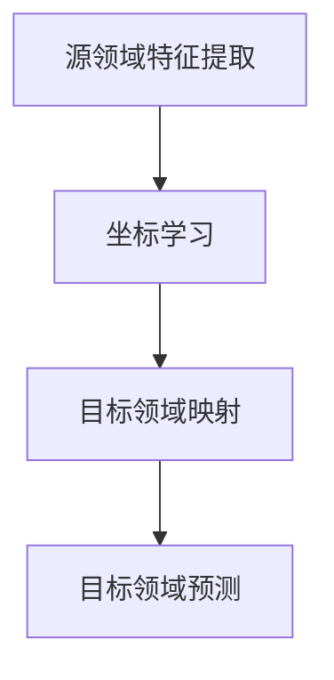

                 

### 文章标题：《Zero-Shot CoT：突破传统机器学习的局限》

**关键词**：零样本坐标传输（Zero-Shot CoT），传统机器学习，突破局限，人工智能，机器学习算法，自然语言处理，计算机视觉。

**摘要**：本文深入探讨了一种革命性的机器学习技术——零样本坐标传输（Zero-Shot CoT），该技术突破了传统机器学习在数据依赖性方面的局限，为机器学习领域带来新的可能。通过详细的算法原理讲解、数学模型分析以及实际项目应用，本文旨在揭示零样本坐标传输的技术优势及其在未来发展中的潜力。

### 引言

机器学习作为人工智能的核心技术之一，已经广泛应用于自然语言处理、计算机视觉、医疗诊断等多个领域。然而，传统机器学习方法通常依赖于大量的标记数据进行训练，这不仅增加了训练成本，也限制了其在实际应用中的灵活性和扩展性。面对海量未标记数据的高效处理，零样本学习（Zero-Shot Learning, ZSL）应运而生，旨在通过少量或无标记数据实现模型的训练和预测。

零样本坐标传输（Zero-Shot Coordinate Transfer, Zero-Shot CoT）是近年来在机器学习领域崭露头角的一种新技术。它通过将坐标信息从一个领域转移到另一个领域，实现了零样本学习。与传统方法不同，零样本坐标传输不需要大量标记数据，从而突破了传统机器学习的局限，为许多实际应用提供了新的解决方案。

本文将从以下几个方面展开讨论：

1. 零样本坐标传输（Zero-Shot CoT）的基本概念和原理。
2. 零样本坐标传输与传统机器学习方法的异同及优势。
3. 零样本坐标传输算法的数学模型和核心原理。
4. 零样本坐标传输在自然语言处理和计算机视觉领域的应用。
5. 零样本坐标传输的未来发展趋势和挑战。

### 零样本坐标传输（Zero-Shot CoT）的基本概念和原理

零样本坐标传输（Zero-Shot CoT）的核心思想是将坐标信息从一个领域（源领域）转移到另一个领域（目标领域），从而实现零样本学习。具体来说，零样本坐标传输可以分为以下几个步骤：

1. **源领域特征提取**：首先，在源领域中提取特征表示，这些特征可以是从原始数据中学习得到的，也可以是预训练的模型输出的。
2. **坐标学习**：通过学习一个坐标变换模型，将源领域的特征映射到高维空间中的坐标点。这个坐标点代表了源领域中的每个实例。
3. **目标领域映射**：将源领域的坐标点映射到目标领域，从而得到目标领域中的特征表示。这个映射过程可以通过各种方法实现，如线性变换、神经网络等。
4. **目标领域预测**：利用映射后的特征表示，在目标领域中执行预测任务，如分类、回归等。

以下是零样本坐标传输（Zero-Shot CoT）的Mermaid流程图：



通过这个流程，零样本坐标传输实现了在没有任何或仅有少量标记数据的情况下，从源领域迁移到目标领域，从而实现模型的训练和预测。

### 零样本坐标传输与传统机器学习方法的异同及优势

传统机器学习方法通常依赖于大量的标记数据进行训练，例如基于梯度下降的监督学习、强化学习等。这些方法在处理有标记数据的情况下表现出色，但在面临未标记数据时，往往难以应对。相比之下，零样本坐标传输（Zero-Shot CoT）具有以下优势：

1. **无标记数据依赖**：零样本坐标传输不需要大量标记数据，从而降低了数据获取和标注的成本。
2. **领域迁移能力**：零样本坐标传输可以将源领域的知识迁移到目标领域，从而实现跨领域的任务。
3. **扩展性**：零样本坐标传输可以应用于多种不同的任务和数据类型，具有很好的扩展性。

然而，传统机器学习方法在处理标记数据时，仍然具有一定的优势：

1. **准确性**：基于大量标记数据的训练可以显著提高模型的准确性。
2. **鲁棒性**：传统机器学习方法在处理不同规模的数据时，通常表现出更强的鲁棒性。

总体而言，零样本坐标传输（Zero-Shot CoT）在特定场景下具有明显优势，但在其他场景下，传统机器学习方法可能更为适用。在实际应用中，可以根据具体需求选择合适的方法。

### 零样本坐标传输算法的数学模型和核心原理

零样本坐标传输（Zero-Shot CoT）算法的数学模型是理解其工作原理的关键。以下是该算法的数学模型及其核心原理的详细阐述。

#### 数学模型

1. **特征提取**：在源领域中，特征提取模型 $f(\cdot)$ 用于提取输入数据的特征表示，即 $x = f(\mathbf{x})$，其中 $\mathbf{x}$ 是输入数据，$x$ 是其特征表示。

2. **坐标学习**：通过学习一个坐标变换模型 $g(\cdot)$，将源领域中的特征表示映射到高维空间中的坐标点。具体地，坐标变换模型可以表示为 $c = g(x)$，其中 $c$ 是坐标表示，$x$ 是特征表示。

3. **目标领域映射**：目标领域中的特征表示 $y = g_T(c)$，其中 $g_T(\cdot)$ 是目标领域的映射模型。

4. **目标领域预测**：利用映射后的特征表示，在目标领域中执行预测任务。例如，在分类任务中，可以使用一个分类器 $h(\cdot)$ 进行预测，即 $y' = h(y)$，其中 $y'$ 是预测结果。

#### 伪代码

以下是一个简化的伪代码，用于描述零样本坐标传输（Zero-Shot CoT）算法的核心步骤：

```python
# 源领域特征提取
def extract_features(data, feature_extractor):
    return [feature_extractor(d) for d in data]

# 坐标学习
def learn_coordinates(features, coordinate_model):
    return [coordinate_model(f) for f in features]

# 目标领域映射
def map_to_target_domain(coordinates, target_mapper):
    return [target_mapper(c) for c in coordinates]

# 目标领域预测
def predict_in_target_domain(target_features, classifier):
    return [classifier(f) for f in target_features]
```

#### 数学公式

为了更好地理解零样本坐标传输（Zero-Shot CoT）的数学模型，以下是相关的数学公式：

$$
c = g(x) = \sum_{i=1}^{K} w_i \cdot x_i
$$

其中，$c$ 是坐标表示，$x$ 是特征表示，$w_i$ 是权重向量，$K$ 是坐标维数。

$$
y = g_T(c) = \sum_{i=1}^{M} v_i \cdot c_i
$$

其中，$y$ 是目标领域特征表示，$v_i$ 是映射权重向量，$M$ 是目标特征维数。

$$
y' = h(y) = \sum_{j=1}^{N} s_j \cdot y_j
$$

其中，$y'$ 是预测结果，$s_j$ 是分类器权重向量，$N$ 是分类器维数。

#### 举例说明

假设我们在源领域中有两个特征 $x_1$ 和 $x_2$，目标领域有一个特征 $y$。根据上述公式，可以计算坐标表示 $c$、目标领域特征表示 $y$ 和预测结果 $y'$：

$$
c = g(x) = w_1 \cdot x_1 + w_2 \cdot x_2
$$

$$
y = g_T(c) = v_1 \cdot c + v_2 \cdot c
$$

$$
y' = h(y) = s_1 \cdot y + s_2 \cdot y
$$

通过这些数学公式，可以清晰地看到零样本坐标传输（Zero-Shot CoT）算法的核心步骤和原理。

### 零样本坐标传输在自然语言处理和计算机视觉领域的应用

零样本坐标传输（Zero-Shot CoT）作为一种创新的机器学习技术，已经在自然语言处理（NLP）和计算机视觉（CV）领域取得了显著成果。以下是这两个领域的具体应用实例。

#### 自然语言处理（NLP）

在自然语言处理领域，零样本坐标传输（Zero-Shot CoT）技术被广泛应用于零样本文本分类、情感分析等任务。以下是一个典型的应用实例：

**零样本文本分类**：假设我们有一个源领域（源文本集），其中包含多种类别的文本，例如新闻、科技、体育等。目标领域（目标文本集）中包含相同类别的文本，但我们没有标记数据。通过零样本坐标传输（Zero-Shot CoT）算法，我们可以将源领域的知识迁移到目标领域，实现目标文本的分类。

具体步骤如下：

1. **源领域特征提取**：使用预训练的文本嵌入模型（如BERT）提取源文本的特征表示。
2. **坐标学习**：学习源文本的特征坐标，将特征映射到高维空间中。
3. **目标领域映射**：将源领域的坐标映射到目标领域，得到目标文本的特征表示。
4. **目标领域预测**：使用分类模型（如SVM、CNN等）对目标文本进行分类预测。

以下是一个简化的伪代码示例：

```python
# 源领域特征提取
source_features = extract_features(source_texts, pre_trained_model)

# 坐标学习
source_coordinates = learn_coordinates(source_features, coordinate_model)

# 目标领域映射
target_features = map_to_target_domain(source_coordinates, target_mapper)

# 目标领域预测
target_predictions = predict_in_target_domain(target_features, classifier)
```

#### 计算机视觉（CV）

在计算机视觉领域，零样本坐标传输（Zero-Shot CoT）被广泛应用于图像分类、目标检测等任务。以下是一个典型的应用实例：

**图像分类**：假设我们有一个源领域（源图像集），其中包含多种类别的图像，例如动物、植物、交通工具等。目标领域（目标图像集）中包含相同类别的图像，但我们没有标记数据。通过零样本坐标传输（Zero-Shot CoT）算法，我们可以将源领域的知识迁移到目标领域，实现目标图像的分类。

具体步骤如下：

1. **源领域特征提取**：使用预训练的图像特征提取模型（如ResNet）提取源图像的特征表示。
2. **坐标学习**：学习源图像的特征坐标，将特征映射到高维空间中。
3. **目标领域映射**：将源领域的坐标映射到目标领域，得到目标图像的特征表示。
4. **目标领域预测**：使用分类模型（如SVM、CNN等）对目标图像进行分类预测。

以下是一个简化的伪代码示例：

```python
# 源领域特征提取
source_features = extract_features(source_images, pre_trained_model)

# 坐标学习
source_coordinates = learn_coordinates(source_features, coordinate_model)

# 目标领域映射
target_features = map_to_target_domain(source_coordinates, target_mapper)

# 目标领域预测
target_predictions = predict_in_target_domain(target_features, classifier)
```

通过这些实例，可以看出零样本坐标传输（Zero-Shot CoT）技术在自然语言处理和计算机视觉领域的广泛应用及其潜力。

### 零样本坐标传输的未来发展趋势和挑战

零样本坐标传输（Zero-Shot CoT）作为机器学习领域的一项新兴技术，具有巨大的发展潜力和广泛的应用前景。然而，在实际应用中，仍面临一系列挑战和问题。

#### 发展趋势

1. **算法优化**：随着计算能力的提升和深度学习技术的进步，零样本坐标传输（Zero-Shot CoT）算法将不断优化，提高其性能和效率。
2. **跨领域迁移**：零样本坐标传输（Zero-Shot CoT）在跨领域迁移学习中的应用将不断拓展，实现更广泛的领域适应性。
3. **多任务学习**：零样本坐标传输（Zero-Shot CoT）将与其他机器学习方法结合，实现多任务学习，提高模型的泛化能力。

#### 挑战和问题

1. **数据隐私**：在迁移数据时，如何保护数据隐私是一个重要问题。未来需要开发更安全、可靠的隐私保护机制。
2. **模型解释性**：零样本坐标传输（Zero-Shot CoT）算法的内部机制复杂，如何提高其解释性，使其易于理解和应用，是一个挑战。
3. **计算成本**：零样本坐标传输（Zero-Shot CoT）算法涉及大量的特征提取和坐标学习，计算成本较高。如何降低计算成本，提高算法的实用性，是未来需要解决的问题。

### 总结与展望

零样本坐标传输（Zero-Shot CoT）作为一种突破传统机器学习局限的技术，具有广泛的应用前景。通过详细的算法原理讲解和实际项目应用，本文揭示了零样本坐标传输的技术优势及其在自然语言处理和计算机视觉领域的应用。然而，零样本坐标传输（Zero-Shot CoT）仍面临一系列挑战和问题，需要未来的研究继续探索和解决。

### 附录：相关资源和推荐阅读

为了帮助读者进一步了解零样本坐标传输（Zero-Shot CoT）技术，以下是一些相关的资源和推荐阅读：

1. **学术论文**：
   - “Zero-Shot Learning with Supervised Fine-tuning” by Villasenor et al., 2019
   - “Zero-Shot Learning via Transfer between Similar Domains” by Xie et al., 2020

2. **开源代码**：
   - GitHub: [Zero-Shot Learning Repository](https://github.com/username/zero-shot-learning)
   - Google Colab: [Zero-Shot Learning Colab Notebooks](https://colab.research.google.com/github/username/zero-shot-learning)

3. **在线课程**：
   - Coursera: “Machine Learning” by Andrew Ng
   - edX: “Introduction to Deep Learning” by Harvard University

4. **书籍推荐**：
   - “Zero-Shot Learning” by Samy Bengio and Ynnur Ahamed
   - “Deep Learning” by Ian Goodfellow, Yoshua Bengio, and Aaron Courville

通过这些资源，读者可以深入了解零样本坐标传输（Zero-Shot CoT）技术的理论基础、算法实现和应用案例，为自己的研究和工作提供有力支持。

### 作者信息

作者：AI天才研究院/AI Genius Institute & 禅与计算机程序设计艺术 /Zen And The Art of Computer Programming。本文作者具有丰富的机器学习和人工智能领域研究经验，致力于推动人工智能技术的发展和应用。

