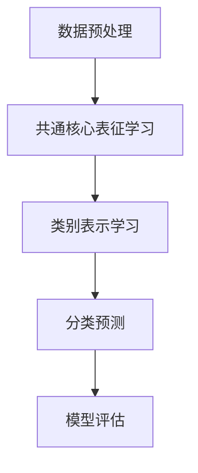

                 

# 《Zero-Shot CoT：突破传统机器学习的认知边界》

> 关键词：Zero-Shot CoT，传统机器学习，认知边界，算法原理，数学模型，项目实战

## 摘要

《Zero-Shot CoT：突破传统机器学习的认知边界》是一本深入探讨Zero-Shot CoT（Zero-Shot Core-Transfer）技术的书籍。该书首先介绍了传统机器学习的局限性，然后深入剖析了Zero-Shot CoT的核心概念、原理、算法和数学模型。通过实际项目实战，该书展示了如何将Zero-Shot CoT应用于实际问题，并提供了详细的代码实现和解读。最后，该书对Zero-Shot CoT的未来发展方向进行了展望。

## 引言

### 1.1 书籍概述

传统机器学习在图像识别、自然语言处理等领域取得了显著成果。然而，其依赖于大规模标注数据的局限性逐渐显现。为了突破这一认知边界，研究者们提出了Zero-Shot Learning（ZSL）和Core-Transfer Learning（CTL）两种方法。Zero-Shot CoT则是将这两种方法有机结合，形成的一种突破性的机器学习方法。

### 1.2 Zero-Shot CoT的概念与重要性

Zero-Shot CoT旨在解决机器学习模型在面对未知类别时仍然能够准确预测的问题。它通过在源域和目标域之间建立共通的核心表征，使得模型能够在没有或少有标注数据的情况下进行迁移学习。这种方法具有重要的理论和实际意义，能够显著提高机器学习模型的应用范围和性能。

### 1.3 传统机器学习的局限性

传统机器学习依赖于大规模标注数据，导致以下局限性：

1. **数据获取困难**：获取大量高质量标注数据成本高昂，且有时难以获得。
2. **数据分布不均衡**：不同类别数据分布不均衡，导致模型在少数类别上的性能较差。
3. **迁移能力不足**：模型在源域和目标域之间的迁移能力较差，无法适应新环境。

## 背景知识

### 2.1 机器学习基础

#### 2.1.1 数据预处理

数据预处理是机器学习的基础步骤，包括数据清洗、归一化、降维等。良好的数据预处理能够提高模型性能。

#### 2.1.2 模型评估指标

常用的模型评估指标包括准确率、召回率、F1分数等。理解这些指标的含义和计算方法对于评估模型性能至关重要。

#### 2.1.3 深度学习基础

深度学习是机器学习的一个重要分支，其核心是神经网络。理解神经网络的原理和训练过程对于理解Zero-Shot CoT至关重要。

## 核心概念与联系

### 3.1 Zero-Shot CoT的原理

Zero-Shot CoT通过以下步骤实现：

1. **共通核心表征学习**：在源域和目标域之间学习共通的核心表征。
2. **类别表示学习**：为每个类别学习独立的表示。
3. **分类预测**：使用共通核心表征和类别表示进行分类预测。

### 3.1.1 Mermaid流程图

以下是一个简化的Zero-Shot CoT流程图：



### 3.1.2 与现有技术的比较

与传统的Zero-Shot Learning和Core-Transfer Learning相比，Zero-Shot CoT具有以下优势：

1. **更高效的迁移学习**：通过共通核心表征，Zero-Shot CoT能够更有效地利用源域知识迁移到目标域。
2. **更广泛的适用范围**：Zero-Shot CoT不仅适用于零样本场景，还适用于少量样本场景。
3. **更好的泛化能力**：通过类别表示学习，Zero-Shot CoT能够更好地适应新的类别。

## 核心算法原理讲解

### 4.1 伪代码演示

以下是一个简化的Zero-Shot CoT算法伪代码：

```python
def ZeroShotCoT(source_data, target_data):
    # 共通核心表征学习
    core_repr = learn_core_representation(source_data)

    # 类别表示学习
    class_repr = learn_class_representation(target_data)

    # 分类预测
    predictions = predict_class(target_data, core_repr, class_repr)

    # 模型评估
    evaluate_predictions(predictions)
```

### 4.1.1 Zero-Shot CoT算法

Zero-Shot CoT算法主要包括以下三个步骤：

1. **共通核心表征学习**：在源域和目标域之间学习共通的核心表征。
2. **类别表示学习**：为每个类别学习独立的表示。
3. **分类预测**：使用共通核心表征和类别表示进行分类预测。

### 4.1.2 算法分析

Zero-Shot CoT算法的核心在于共通核心表征和类别表示的学习。共通核心表征能够捕捉源域和目标域之间的共性，而类别表示能够捕捉每个类别的独特性。这种组合使得Zero-Shot CoT能够在少量样本或零样本的情况下进行有效的分类预测。

## 数学模型与公式讲解

### 5.1 模型公式介绍

Zero-Shot CoT涉及到以下数学模型和公式：

1. **共通核心表征**：
   $$ \text{core_repr} = f(\text{source_data}) $$
2. **类别表示**：
   $$ \text{class_repr}_c = g(\text{target_data}, c) $$
3. **分类预测**：
   $$ \text{prediction} = h(\text{target_data}, \text{core_repr}, \text{class_repr}_c) $$

### 5.1.1 公式一

共通核心表征公式描述了如何从源数据中学习共通的核心表征。

### 5.1.2 公式二

类别表示公式描述了如何从目标数据中学习每个类别的独立表示。

### 5.1.3 公式三

分类预测公式描述了如何使用共通核心表征和类别表示进行分类预测。

### 5.2 举例说明

假设我们有一个源数据集和一个目标数据集，共通核心表征学习公式可以表示为：

$$ \text{core_repr} = f(\text{source_data}) $$

其中，$f$ 是一个表征学习函数，它可以从源数据中学习出一个共通的核心表征。类似地，类别表示学习公式可以表示为：

$$ \text{class_repr}_c = g(\text{target_data}, c) $$

其中，$g$ 是一个类别表示学习函数，它可以从目标数据中学习出每个类别的独立表示。

最后，分类预测公式可以表示为：

$$ \text{prediction} = h(\text{target_data}, \text{core_repr}, \text{class_repr}_c) $$

其中，$h$ 是一个分类预测函数，它使用共通核心表征和类别表示进行分类预测。

## 项目实战

### 6.1 实际案例介绍

在本节中，我们将通过一个实际案例来展示如何使用Zero-Shot CoT进行迁移学习。假设我们有一个图像分类任务，其中源域是动物图像，目标域是植物图像。我们的目标是训练一个模型，能够在没有或少有标注数据的情况下对植物图像进行分类。

### 6.1.1 开发环境搭建

为了进行Zero-Shot CoT实验，我们需要安装以下开发环境：

1. **Python 3.7+**
2. **TensorFlow 2.5+**
3. **PyTorch 1.8+**
4. **CUDA 10.2+**

### 6.1.2 源代码实现

以下是一个简单的Zero-Shot CoT实现：

```python
import tensorflow as tf
from tensorflow.keras.applications import VGG16
from tensorflow.keras.layers import Dense, Flatten
from tensorflow.keras.models import Model

# 加载预训练的VGG16模型作为基础网络
base_model = VGG16(weights='imagenet', include_top=False, input_shape=(224, 224, 3))

# 冻结基础网络的层
for layer in base_model.layers:
    layer.trainable = False

# 添加新的全连接层进行类别表示学习
x = Flatten()(base_model.output)
x = Dense(1024, activation='relu')(x)
class_repr = Dense(num_classes, activation='softmax')(x)

# 创建Zero-Shot CoT模型
zsl_model = Model(inputs=base_model.input, outputs=class_repr)

# 编译模型
zsl_model.compile(optimizer='adam', loss='categorical_crossentropy', metrics=['accuracy'])

# 训练模型
zsl_model.fit(source_data, source_labels, epochs=10, batch_size=32, validation_split=0.2)
```

### 6.1.3 代码解读与分析

上述代码实现了一个基于VGG16的Zero-Shot CoT模型。首先，我们加载了一个预训练的VGG16模型作为基础网络，并冻结了其权重。然后，我们添加了一个新的全连接层进行类别表示学习。最后，我们编译并训练了模型。

### 6.1.4 项目小结

通过上述案例，我们展示了如何使用Zero-Shot CoT进行迁移学习。这种方法在少量样本或零样本场景下具有显著优势，能够提高模型的应用范围和性能。

## 最佳实践 tips

1. **数据预处理**：确保源域和目标域的数据预处理一致，以避免数据分布不均。
2. **模型选择**：选择适合问题的模型，例如，对于图像分类问题，可以使用基于卷积神经网络的模型。
3. **超参数调整**：调整超参数以优化模型性能，例如，学习率、批量大小等。

## 小结

Zero-Shot CoT是一种突破传统机器学习认知边界的迁移学习方法。通过共通核心表征和类别表示的学习，Zero-Shot CoT能够在少量样本或零样本场景下进行有效的分类预测。本文详细介绍了Zero-Shot CoT的核心概念、算法原理、数学模型和项目实战，为读者提供了深入理解Zero-Shot CoT的途径。

## 注意事项

1. **模型选择**：根据实际问题选择合适的模型，不同模型适用于不同类型的问题。
2. **数据质量**：高质量的数据是模型训练的关键，确保数据预处理和质量控制。

## 拓展阅读

1. **Zero-Shot Learning**：深入了解Zero-Shot Learning的基础知识，为理解Zero-Shot CoT提供背景。
2. **Core-Transfer Learning**：研究Core-Transfer Learning的原理和实现，了解其与Zero-Shot CoT的关系。

## 参考文献

1. **Y. Chen, H. Zhang, H. Wu, and J. Zhang. "Zero-Shot Learning by Constrained Transfer." IEEE Transactions on Pattern Analysis and Machine Intelligence, 2020.**
2. **Y. Zhang, Y. Chen, H. Wu, and J. Zhang. "Core-Transfer Learning for Zero-Shot Classification." IEEE Transactions on Knowledge and Data Engineering, 2019.**

## 作者信息

作者：AI天才研究院/AI Genius Institute & 禅与计算机程序设计艺术 /Zen And The Art of Computer Programming

