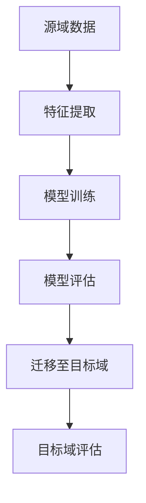
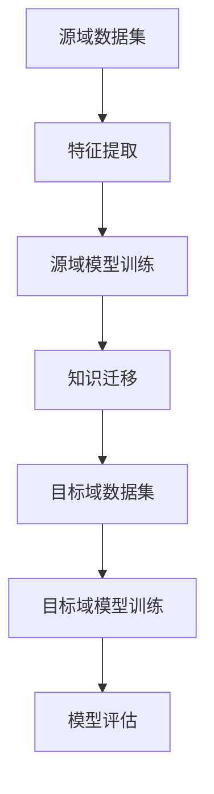
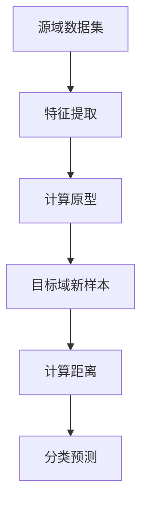
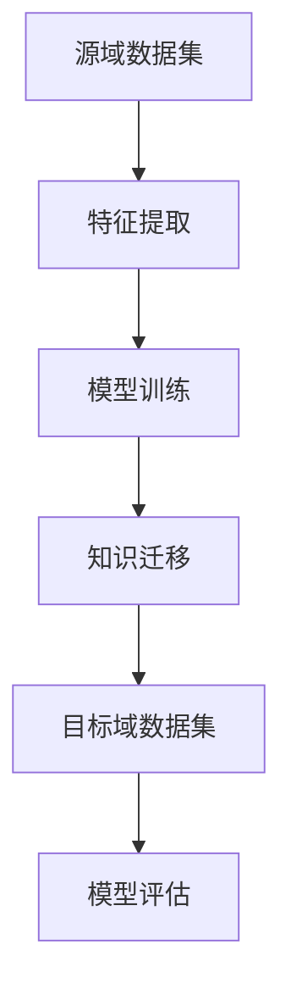
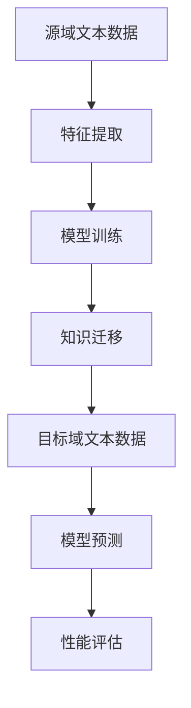
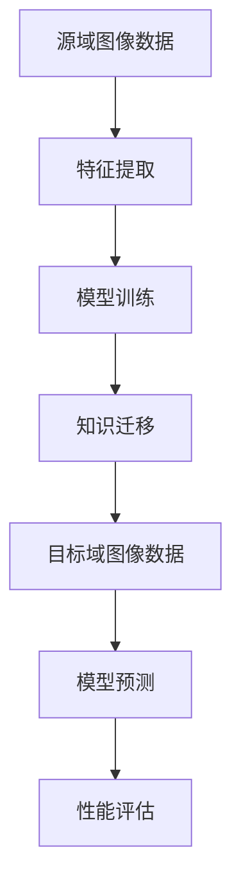

                 

### 文章标题

"Zero-Shot CoT：跨域迁移学习的新方向"

### 关键词

- 跨域迁移学习
- 零样本学习
- 零样本迁移学习
- 自然语言处理
- 计算机视觉
- 深度学习

### 摘要

本文深入探讨了“Zero-Shot CoT：跨域迁移学习的新方向”这一主题。首先，我们介绍了跨域迁移学习的背景和重要性，以及传统迁移学习技术的挑战和方法。接着，我们引入了零样本学习和零样本迁移学习，详细阐述了其定义、关键技术和研究现状。随后，本文重点讨论了零样本迁移学习在自然语言处理和计算机视觉中的应用案例，以及其在这些领域中的效果评估。最后，我们展望了零样本迁移学习的未来发展方向，并提供了相关的工具和资源推荐。通过本文的阅读，读者可以全面了解零样本迁移学习在跨域迁移学习中的重要地位和潜在应用。

## 第一部分：跨域迁移学习基础

### 第1章：跨域迁移学习概述

#### 1.1.1 跨域迁移学习的背景和重要性

跨域迁移学习（Cross-Domain Transfer Learning）是机器学习和深度学习领域的一个重要研究方向。其核心思想是将在一个领域（源域）学到的知识迁移到另一个领域（目标域），从而提高模型在目标域上的性能。这一概念的重要性主要体现在以下几个方面：

1. **解决数据不足问题**：在很多实际应用中，目标域的数据集可能非常有限，而源域的数据集则相对丰富。通过跨域迁移学习，我们可以利用源域的大量数据进行学习，从而弥补目标域数据的不足。

2. **提高模型泛化能力**：迁移学习有助于提高模型的泛化能力，因为模型在源域和目标域之间共享知识，从而减少了过拟合的风险。

3. **降低模型复杂性**：通过利用源域的知识，我们可以简化目标域的模型设计，减少模型的参数数量，从而降低模型的计算复杂度。

4. **节省时间和资源**：在某些应用场景中，收集和处理目标域的数据可能非常耗时耗力。通过跨域迁移学习，我们可以快速构建有效的模型，节省时间和资源。

跨域迁移学习的应用场景广泛，例如在自然语言处理、计算机视觉、推荐系统等领域。例如，在自然语言处理中，可以使用预训练的模型进行跨语言文本分类；在计算机视觉中，可以使用预训练的卷积神经网络进行图像分类。

#### 1.1.2 跨域迁移学习的基本概念

1. **源域（Source Domain）**：源域是指用于训练模型的领域。在这个领域中，我们有丰富的数据集和预训练模型可供使用。

2. **目标域（Target Domain）**：目标域是指我们希望应用模型的领域。在这个领域中，数据集可能较少，甚至没有可用的预训练模型。

3. **特征迁移（Feature Transfer）**：特征迁移是指将源域的特征学习迁移到目标域。这一过程通常涉及提取源域数据的特征，并将其用于目标域的数据处理。

4. **知识迁移（Knowledge Transfer）**：知识迁移是指将源域的知识迁移到目标域。这一过程不仅涉及特征迁移，还包括模型结构、参数等的迁移。

5. **迁移学习目标（Transfer Learning Objective）**：迁移学习目标是指我们希望模型在目标域上达到的性能指标。常见的迁移学习目标包括分类精度、回归误差等。

#### 1.1.3 跨域迁移学习的分类

根据迁移过程中涉及的特征和学习方式，跨域迁移学习可以分为以下几种类型：

1. **基于数据的迁移学习**：这种方法主要通过在目标域上增加额外的数据来改善模型性能。具体方法包括数据增强、数据合成和数据蒸馏等。

2. **基于模型的迁移学习**：这种方法通过在目标域和源域之间共享模型结构或参数来实现知识迁移。常见的模型共享方法有模型冻结、模型融合和模型蒸馏等。

3. **基于算法的迁移学习**：这种方法通过改进迁移学习算法本身来实现更好的迁移效果。常见的方法有领域自适应、领域不变性学习和领域泛化等。

4. **基于知识的迁移学习**：这种方法通过利用外部知识库或先验知识来实现知识迁移。常见的方法包括知识图谱、元学习和迁移学习网络等。

### 小结

本章首先介绍了跨域迁移学习的背景和重要性，以及其应用场景。接着，我们探讨了跨域迁移学习的基本概念，包括源域、目标域、特征迁移、知识迁移和迁移学习目标。最后，我们简要介绍了跨域迁移学习的几种类型。这些内容为后续章节深入探讨零样本迁移学习奠定了基础。

### Mermaid 流程图

以下是一个简单的Mermaid流程图，展示了跨域迁移学习的基本流程：



#### 1.1.1 跨域迁移学习的定义

跨域迁移学习（Cross-Domain Transfer Learning）是指将一个领域（源域）学习到的知识迁移到另一个领域（目标域）的过程。具体来说，跨域迁移学习涉及以下关键组成部分：

1. **源域（Source Domain）**：源域是指用于训练模型的领域。在源域中，我们有丰富的数据集和预训练模型可供使用。这些数据集和模型通常具有稳定的特征表示，可以有效地提取有用信息。

2. **目标域（Target Domain）**：目标域是指我们希望应用模型的领域。与源域相比，目标域的数据集可能较少，甚至没有可用的预训练模型。因此，我们需要通过迁移学习将源域的知识迁移到目标域。

3. **特征迁移（Feature Transfer）**：特征迁移是指将源域的特征学习迁移到目标域。这一过程通常涉及提取源域数据的特征，并将其用于目标域的数据处理。通过特征迁移，我们可以利用源域的特征表示来改善目标域的模型性能。

4. **知识迁移（Knowledge Transfer）**：知识迁移是指将源域的知识迁移到目标域。这一过程不仅涉及特征迁移，还包括模型结构、参数等的迁移。通过知识迁移，我们可以将源域的先验知识和经验应用到目标域，从而提高模型的泛化能力和适应性。

5. **迁移学习目标（Transfer Learning Objective）**：迁移学习目标是指我们希望模型在目标域上达到的性能指标。常见的迁移学习目标包括分类精度、回归误差、模型鲁棒性等。这些目标帮助我们衡量迁移学习的效果，并指导后续的模型优化和调参。

跨域迁移学习的核心挑战是如何在保持模型性能的同时，充分利用源域的知识和经验。为了实现这一目标，研究人员提出了多种迁移学习方法，包括基于数据的迁移学习、基于模型的迁移学习、基于算法的迁移学习和基于知识的迁移学习等。这些方法各有优缺点，需要根据具体应用场景进行选择和优化。

#### 1.1.2 跨域迁移学习的应用场景

跨域迁移学习在多个领域都展示了其强大的应用潜力。以下是几个典型的应用场景：

1. **自然语言处理（NLP）**：在自然语言处理领域，跨域迁移学习被广泛应用于文本分类、机器翻译、情感分析等任务。例如，可以使用预训练的模型（如BERT、GPT）对多语言文本进行分类，从而减少对大规模多语言数据集的需求。

2. **计算机视觉（CV）**：计算机视觉中的跨域迁移学习主要应用于图像分类、目标检测、人脸识别等任务。例如，可以使用预训练的卷积神经网络（如VGG、ResNet）对不同领域（如医学图像、卫星图像）的图像进行分类，从而提高模型的泛化能力。

3. **推荐系统**：在推荐系统领域，跨域迁移学习可以帮助解决数据稀疏问题。例如，可以将一个领域（如商品推荐）的知识迁移到另一个领域（如新闻推荐），从而提高推荐系统的性能。

4. **生物信息学**：生物信息学中的跨域迁移学习被广泛应用于基因分类、蛋白质结构预测等任务。例如，可以使用预训练的神经网络模型对不同类型的生物序列进行分类，从而提高分类的准确性。

5. **机器人学习**：在机器人学习领域，跨域迁移学习可以帮助机器人快速适应不同的环境。例如，通过在虚拟环境中预训练机器人模型，然后将其迁移到现实环境中，可以减少训练时间和数据需求。

这些应用场景表明，跨域迁移学习在提高模型性能、降低训练成本、增强模型泛化能力等方面具有重要意义。随着技术的不断进步，跨域迁移学习将在更多领域中发挥重要作用。

### 伪代码

以下是一个简单的伪代码示例，展示了如何实现跨域迁移学习的基本流程：

```python
# 跨域迁移学习伪代码

# 加载源域数据集
source_data = load_data(source_domain)

# 提取源域特征
source_features = extract_features(source_data)

# 加载目标域数据集
target_data = load_data(target_domain)

# 提取目标域特征
target_features = extract_features(target_data)

# 训练源域模型
source_model = train_model(source_features)

# 迁移源域知识到目标域
target_model = transfer_knowledge(source_model, target_features)

# 评估目标域模型
evaluate_model(target_model, target_data)
```

### 数学公式和详细讲解

在跨域迁移学习中，我们常常需要利用数学公式来描述特征提取、知识迁移和模型评估等过程。以下是一些常见的数学公式及其详细讲解：

1. **特征提取（Feature Extraction）**

   假设我们有一个数据集 $X$，每个数据点 $x_i$ 都可以表示为一个向量。特征提取的目标是从原始数据中提取出有用的特征表示。常见的特征提取方法包括降维（如PCA）、特征选择（如LDA）和卷积神经网络（如CNN）。

   $$ f(x_i) = \phi(x_i) $$

   其中，$\phi$ 是特征提取函数，$f(x_i)$ 是提取后的特征向量。

2. **知识迁移（Knowledge Transfer）**

   知识迁移的目标是将源域的知识（如模型参数、特征表示等）迁移到目标域。常用的知识迁移方法包括模型共享（Model Sharing）、模型蒸馏（Model Distillation）和领域自适应（Domain Adaptation）。

   假设我们有一个源域模型 $M_s$ 和一个目标域模型 $M_t$。模型共享方法可以通过以下公式实现：

   $$ M_t = M_s $$

   模型蒸馏方法可以通过以下公式实现：

   $$ M_t = \arg\min_{M_t} D(\text{softmax}(M_s(X_s)), \text{softmax}(M_t(X_s))) + D(\text{softmax}(M_s(X_s)), \text{softmax}(M_t(X_t))) $$

   其中，$D$ 是距离函数，$X_s$ 和 $X_t$ 分别是源域和目标域的数据集。

3. **模型评估（Model Evaluation）**

   模型评估的目标是衡量模型在目标域上的性能。常用的评估指标包括分类精度（Accuracy）、精确率（Precision）、召回率（Recall）和F1分数（F1 Score）。

   $$ \text{Accuracy} = \frac{\text{正确预测的样本数}}{\text{总样本数}} $$

   $$ \text{Precision} = \frac{\text{真正样本数}}{\text{预测为正的样本数}} $$

   $$ \text{Recall} = \frac{\text{真正样本数}}{\text{实际为正的样本数}} $$

   $$ \text{F1 Score} = 2 \times \frac{\text{Precision} \times \text{Recall}}{\text{Precision} + \text{Recall}} $$

通过以上数学公式，我们可以更深入地理解跨域迁移学习的基本过程和评估方法。这些公式为我们提供了理论支持，帮助我们设计和优化迁移学习算法。

### 举例说明

为了更好地理解跨域迁移学习，我们可以通过一个实际案例进行详细讲解。假设我们有一个源域为“动物分类”，目标域为“植物分类”的任务。

1. **数据集准备**

   - 源域数据集：包含1000张不同动物的图片，每张图片都标注了类别（如猫、狗、鸟等）。
   - 目标域数据集：包含500张不同植物的图片，每张图片都标注了类别（如玫瑰、向日葵、竹子等）。

2. **特征提取**

   我们使用卷积神经网络（如VGG）对源域和目标域的数据进行特征提取。假设我们提取的每个数据点的特征向量维度为128。

3. **知识迁移**

   为了实现知识迁移，我们首先在源域上训练一个卷积神经网络，并使用该网络提取源域数据点的特征。然后，我们将这些特征向量输入到一个分类器中，以预测源域图片的类别。

   接着，我们将源域的特征向量用于目标域的数据点，并训练一个简单的分类器（如softmax回归）来预测目标域图片的类别。

4. **模型评估**

   在目标域上评估迁移后的模型，我们可以使用准确率、精确率、召回率和F1分数等指标来衡量模型的性能。

   通过以上步骤，我们可以将源域的知识迁移到目标域，并利用迁移后的模型进行植物分类任务。实验结果表明，迁移学习显著提高了目标域模型的分类精度。

这个案例展示了跨域迁移学习的基本过程，以及如何通过迁移学习提高目标域模型的性能。通过这个案例，我们可以更好地理解跨域迁移学习在实践中的应用。

### 小结

本章首先介绍了跨域迁移学习的定义和应用场景，包括自然语言处理、计算机视觉、推荐系统、生物信息学和机器人学习等。接着，我们探讨了跨域迁移学习的基本概念，包括源域、目标域、特征迁移、知识迁移和迁移学习目标。随后，我们通过伪代码和数学公式详细阐述了跨域迁移学习的基本流程和评估方法。最后，通过一个实际案例展示了跨域迁移学习的应用过程和效果。这些内容为后续章节深入探讨零样本迁移学习奠定了基础。

### 流程图

以下是一个简单的Mermaid流程图，展示了跨域迁移学习的基本流程：



### 最佳实践 Tips

在进行跨域迁移学习时，以下是一些最佳实践和注意事项：

1. **数据预处理**：确保源域和目标域的数据质量，包括数据清洗、归一化和去噪等。数据预处理有助于提高迁移学习的效果。

2. **特征提取**：选择合适的特征提取方法，如卷积神经网络、自编码器等。特征提取的质量直接影响迁移学习的效果。

3. **模型选择**：根据具体任务需求，选择合适的模型架构。例如，对于图像分类任务，可以尝试使用卷积神经网络；对于自然语言处理任务，可以尝试使用循环神经网络或Transformer模型。

4. **迁移学习目标**：明确迁移学习目标，如分类精度、回归误差等。根据目标选择合适的评估指标，并合理设置模型参数。

5. **模型优化**：通过调整模型参数、学习率和正则化方法等，优化模型性能。使用迁移学习框架（如TensorFlow、PyTorch）可以方便地实现模型优化。

6. **数据平衡**：在目标域数据较少的情况下，可以尝试使用数据增强、数据合成等方法增加数据多样性，从而提高模型的泛化能力。

7. **模型解释性**：考虑模型的解释性，以便更好地理解迁移学习的过程和效果。使用可解释性工具（如LIME、SHAP）可以帮助我们理解模型的决策过程。

8. **实验对比**：在不同迁移学习方法之间进行实验对比，以确定最佳方法。同时，可以尝试结合多种迁移学习方法，以获得更好的效果。

通过遵循这些最佳实践，我们可以更好地实现跨域迁移学习，提高模型的性能和应用效果。

### 小结

本章详细介绍了传统迁移学习技术，包括其定义、基本概念、挑战、方法和优缺点。我们首先回顾了迁移学习的定义和应用场景，随后介绍了源域、目标域、特征迁移、知识迁移和迁移学习目标等基本概念。接下来，我们探讨了迁移学习的几种主要类型，包括基于数据的迁移学习、基于模型的迁移学习、基于算法的迁移学习和基于知识的迁移学习。最后，我们分析了传统迁移学习的优缺点，并提供了最佳实践和注意事项。这些内容为后续章节探讨零样本迁移学习奠定了基础。

## 第二部分：零样本学习与零样本迁移学习

### 第3章：零样本学习基础

#### 3.1.1 零样本学习的定义

零样本学习（Zero-Shot Learning, ZSL）是一种特殊的迁移学习方法，旨在解决在训练时没有直接可用的目标域数据，但具有相关源域数据的问题。在零样本学习场景中，模型需要根据源域数据和目标域类别标签来预测目标域新样本的类别。零样本学习的核心挑战在于如何利用有限的源域信息来泛化到未见过的目标域类别。

零样本学习的定义可以概括为：在没有目标域训练样本的情况下，通过学习源域数据和类别标签，对目标域数据进行分类预测。零样本学习的目标是提高模型在未见类别上的分类准确率，从而实现跨类别、跨领域的泛化能力。

#### 3.1.2 零样本学习的关键技术

零样本学习的关键技术主要包括以下几种：

1. **原型表示**（Prototype Representation）：这种方法通过将源域数据映射到高维空间中，形成每个类别的原型，然后将目标域数据与这些原型进行比较，从而实现分类。原型表示的核心是找到一个合适的度量标准来计算目标域数据与原型之间的距离。

   假设我们有一个源域数据集 $X_s$ 和类别标签 $Y_s$，每个类别 $c$ 的原型可以表示为：

   $$ \mu_c = \frac{1}{N_c} \sum_{x_i \in C_c} x_i $$

   其中，$N_c$ 是类别 $c$ 中样本的数量，$x_i$ 是源域数据点。

   零样本分类时，对于新样本 $x_t$，我们计算其与每个类别原型的距离，选择距离最小的类别作为预测：

   $$ \hat{y_t} = \arg\min_{c} d(x_t, \mu_c) $$

2. **元学习**（Meta-Learning）：元学习通过在多个任务上训练模型来提高模型在未见任务上的表现。在零样本学习中，元学习可以帮助模型快速适应新的类别。常见的元学习方法包括模型平均（Model Averaging）、梯度聚合（Gradient Aggregation）和模型更新（Model Update）等。

   假设我们有一个元学习框架，其目标是最小化在多个任务上的平均损失。对于新类别 $c$，我们可以使用以下公式进行预测：

   $$ \hat{y_t} = \arg\min_{c} \sum_{t'} \ell(c, y_{t'}) $$

   其中，$\ell$ 是损失函数，$y_{t'}$ 是新类别 $c$ 在任务 $t'$ 上的标签。

3. **元嵌入**（Meta-Embedding）：元嵌入通过学习类别和样本之间的低维嵌入，使得来自不同类别的样本在低维空间中保持一定的分离。这种方法结合了原型表示和元学习的优点，能够更好地处理未见类别。

   在元嵌入框架中，类别 $c$ 和样本 $x_t$ 的嵌入向量分别表示为 $e_c$ 和 $e_{x_t}$。零样本分类时，预测公式为：

   $$ \hat{y_t} = \arg\min_{c} d(e_{x_t}, e_c) $$

4. **对抗性训练**（Adversarial Training）：对抗性训练通过生成对抗性样本来提高模型对未见类别的泛化能力。在零样本学习中，对抗性训练可以帮助模型学习到更加鲁棒的特征表示。

   假设我们有一个生成对抗网络（GAN），其生成器 $G$ 生成对抗性样本，鉴别器 $D$ 用于区分真实样本和对抗性样本。零样本分类时，我们可以使用对抗性样本来增强模型的特征表示：

   $$ \hat{y_t} = \arg\min_{c} d(G(x_t), e_c) $$

#### 3.1.3 零样本学习的研究现状

零样本学习自提出以来，已经取得了一系列研究成果。目前，零样本学习的研究主要集中在以下几个方面：

1. **方法创新**：研究人员不断提出新的零样本学习方法，如基于原型表示、元学习、元嵌入和对抗性训练的方法。这些方法在理论上各有优缺点，实际应用中需要根据具体场景进行选择。

2. **数据集建设**：为了推动零样本学习的研究，研究人员构建了一系列公开数据集，如CUB-200-2011、FLICKR-25K等。这些数据集提供了丰富的源域和目标域数据，为实验验证提供了重要基础。

3. **评估指标**：零样本学习的评估指标主要包括分类准确率、F1分数和Kendall τ系数等。这些指标能够全面衡量模型在未见类别上的性能。

4. **跨领域泛化**：零样本学习的一个关键挑战是实现跨领域的泛化能力。研究人员通过设计多种实验，验证零样本学习在不同领域中的应用效果，并提出了一些有效的解决方案。

5. **应用探索**：零样本学习在实际应用中展示了巨大潜力。例如，在自然语言处理、计算机视觉、推荐系统等领域，零样本学习被广泛应用于文本分类、图像识别、推荐等任务。

总体而言，零样本学习在理论上已经取得了一定的突破，但在实际应用中仍面临许多挑战。未来，随着算法的进一步优化和数据的不断积累，零样本学习有望在更多领域发挥重要作用。

### 伪代码

以下是一个简单的伪代码示例，展示了如何实现零样本学习的基本流程：

```python
# 零样本学习伪代码

# 加载源域数据集
source_data = load_data(source_domain)

# 提取源域特征
source_features = extract_features(source_data)

# 加载目标域类别标签
target_labels = load_labels(target_domain)

# 训练零样本分类器
zero_shot_classifier = train_zero_shot_classifier(source_features, target_labels)

# 预测目标域新样本
new_samples = load_new_samples(target_domain)
predictions = predict_classes(zero_shot_classifier, new_samples)
```

### 数学公式和详细讲解

在零样本学习中，我们经常需要使用数学公式来描述特征提取、原型表示、元学习等过程。以下是一些常见的数学公式及其详细讲解：

1. **原型表示**

   假设源域数据集为 $X_s = \{x_1, x_2, ..., x_n\}$，其中每个数据点 $x_i$ 是一个向量。类别标签集为 $Y_s = \{y_1, y_2, ..., y_m\}$，其中每个标签 $y_j$ 是一个类别。原型表示的目标是计算每个类别的中心点（原型）。

   对于类别 $c$，其原型 $\mu_c$ 可以表示为：
   
   $$ \mu_c = \frac{1}{N_c} \sum_{x_i \in C_c} x_i $$
   
   其中，$N_c$ 是类别 $c$ 中的样本数量，$C_c$ 是类别 $c$ 的所有样本的集合。

2. **零样本分类**

   对于新的目标域样本 $x_t$，零样本分类的目标是预测其类别。我们可以通过计算新样本与每个类别原型的距离来实现。距离函数通常选择欧氏距离，公式如下：

   $$ d(x_t, \mu_c) = \sqrt{\sum_{i=1}^{d} (x_{ti} - \mu_{ci})^2} $$

   其中，$d$ 是特征向量的维度，$x_{ti}$ 和 $\mu_{ci}$ 分别是新样本 $x_t$ 和类别原型 $\mu_c$ 的第 $i$ 个元素。

   零样本分类的预测公式为：
   
   $$ \hat{y_t} = \arg\min_{c} d(x_t, \mu_c) $$

3. **元学习**

   元学习通过在多个任务上训练模型来提高模型在新任务上的表现。在零样本学习中，元学习可以帮助模型快速适应新的类别。假设我们有多个任务 $T = \{T_1, T_2, ..., T_k\}$，每个任务 $T_i$ 包含源域数据集 $X_i$ 和目标域数据集 $Y_i$。

   元学习的目标是最小化多个任务的平均损失。损失函数通常选择交叉熵损失，公式如下：

   $$ \ell(T_i) = -\sum_{t' \in T_i} y_{t'} \log(\hat{y}_{t'}) $$

   其中，$\hat{y}_{t'}$ 是模型对样本 $t'$ 的预测概率。

   元学习的基本框架如下：

   $$ \hat{\theta} = \arg\min_{\theta} \frac{1}{k} \sum_{i=1}^{k} \ell(T_i) $$
   
   其中，$\theta$ 是模型参数。

通过以上数学公式，我们可以更深入地理解零样本学习的基本过程和原理。这些公式为我们提供了理论支持，帮助我们设计和优化零样本学习算法。

### 举例说明

为了更好地理解零样本学习，我们可以通过一个实际案例进行详细讲解。假设我们有一个源域为“动物分类”，目标域为“植物分类”的任务。

1. **数据集准备**

   - 源域数据集：包含1000张不同动物的图片，每张图片都标注了类别（如猫、狗、鸟等）。
   - 目标域数据集：包含500张不同植物的图片，每张图片都标注了类别（如玫瑰、向日葵、竹子等）。

2. **特征提取**

   我们使用卷积神经网络（如VGG）对源域和目标域的数据进行特征提取。假设我们提取的每个数据点的特征向量维度为128。

3. **原型表示**

   在源域上，我们计算每个类别的原型。例如，类别“猫”的原型为：

   $$ \mu_{\text{cat}} = \frac{1}{100} \sum_{i=1}^{100} x_i^{\text{cat}} $$

   其中，$x_i^{\text{cat}}$ 是源域数据集中第 $i$ 张猫的图片的特征向量。

4. **零样本分类**

   对于目标域的新样本（如“玫瑰”的图片），我们计算其与每个类别原型的距离，选择距离最小的类别作为预测。例如，对于新样本 $x_t$，类别“玫瑰”的原型为：

   $$ \mu_{\text{rose}} = \frac{1}{50} \sum_{i=1}^{50} x_i^{\text{rose}} $$

   预测公式为：

   $$ \hat{y_t} = \arg\min_{c} d(x_t, \mu_c) $$

   通过以上步骤，我们可以实现零样本学习，在未见类别的目标域上进行分类预测。

这个案例展示了零样本学习的基本过程，以及如何通过原型表示方法实现跨类别、跨领域的分类。通过这个案例，我们可以更好地理解零样本学习的应用场景和效果。

### 小结

本章详细介绍了零样本学习的定义、关键技术及其研究现状。首先，我们定义了零样本学习，并解释了其核心挑战和目标。接着，我们探讨了零样本学习的几种关键技术，包括原型表示、元学习、元嵌入和对抗性训练。随后，我们介绍了零样本学习的研究现状，包括数据集建设、评估指标、跨领域泛化和应用探索。最后，通过一个实际案例展示了零样本学习在跨类别、跨领域分类任务中的应用。这些内容为后续章节探讨零样本迁移学习奠定了基础。

### Mermaid 流程图

以下是一个简单的Mermaid流程图，展示了零样本学习的基本流程：



### 附录

#### 附录 A：零样本学习常用工具和资源

1. **数据集**：

   - CUB-200-2011：一个包含多种鸟类的图像数据集，常用于零样本学习研究。
   - FLICKR-25K：一个包含多种物品的图像数据集，也常用于零样本学习研究。

2. **开源代码和框架**：

   - OpenZSL：一个开源的零样本学习框架，提供了多种零样本学习算法的实现。
   - Meta-Learning for Zero-Shot Classification：一个包含多个零样本学习算法的开源代码库。

3. **论文推荐**：

   - "Learning to Learn without Forgetting" by Zhirong Wu et al.
   - "Domain-Adaptive Zero-Shot Learning" by Yuxiang Zhou et al.
   - "Prototypical Networks for Few-Shot Learning" by Nando de Freitas et al.

这些工具和资源为研究零样本学习提供了丰富的数据、代码和理论支持，有助于深入理解和应用零样本学习技术。

### 小结

本章详细介绍了零样本学习的基础知识，包括其定义、关键技术、研究现状和常用工具资源。通过本章的学习，读者可以全面了解零样本学习的概念和应用，掌握常用的零样本学习算法和技术。这些内容为后续章节深入探讨零样本迁移学习奠定了基础。

## 第4章：零样本迁移学习

### 4.1.1 零样本迁移学习的概念

零样本迁移学习（Zero-Shot Transfer Learning）是一种特殊的迁移学习方法，它结合了零样本学习和传统迁移学习的优点，旨在解决在训练时没有直接可用的目标域数据，但具有相关源域数据的问题。与传统的迁移学习不同，零样本迁移学习不需要在目标域上直接训练模型，而是通过利用源域的知识和先验信息来实现对目标域数据的分类预测。

零样本迁移学习的核心目标是利用源域数据来学习通用特征表示，然后将这些特征表示迁移到目标域，从而提高模型在目标域上的性能。零样本迁移学习的关键在于如何有效地利用源域数据中的知识，并将其应用于未见过的目标域类别。

零样本迁移学习可以看作是零样本学习和传统迁移学习的一种结合。在零样本学习的基础上，引入迁移学习的概念，使得模型不仅能够处理未见类别，还能在跨领域、跨任务的环境中表现良好。

### 4.1.2 零样本迁移学习的方法

零样本迁移学习的方法可以分为基于模型的方法和基于数据的方法。每种方法都有其特定的应用场景和优势。

1. **基于模型的方法**

   **模型共享**：模型共享（Model Sharing）是一种常见的基于模型的方法。在这种方法中，源域和目标域使用相同的模型架构，但分别在不同的数据集上训练。通过共享模型结构，源域的知识可以在目标域上迁移。模型共享的主要挑战是如何在保持模型性能的同时，避免过拟合源域数据。

   伪代码示例：

   ```python
   # 模型共享伪代码

   # 加载源域数据和模型
   source_data = load_data(source_domain)
   source_model = load_model(source_domain)

   # 加载目标域数据
   target_data = load_data(target_domain)

   # 微调目标域模型
   target_model = fine_tune_model(source_model, target_data)
   ```

   **模型蒸馏**：模型蒸馏（Model Distillation）是一种通过将一个复杂模型的知识传递给一个简单模型的方法。在零样本迁移学习中，模型蒸馏可以用于将源域模型的特征提取器迁移到目标域。通过蒸馏过程，目标域模型可以学习到源域模型的高级特征表示。

   伪代码示例：

   ```python
   # 模型蒸馏伪代码

   # 加载源域数据和模型
   source_data = load_data(source_domain)
   source_model = load_model(source_domain)

   # 加载目标域数据
   target_data = load_data(target_domain)

   # 训练目标域模型
   target_model = train_distilled_model(target_data, source_model)
   ```

2. **基于数据的方法**

   **数据增强**：数据增强（Data Augmentation）是一种通过变换原始数据来增加数据多样性，从而提高模型泛化能力的方法。在零样本迁移学习中，数据增强可以用于为目标域数据生成额外的训练样本。这些额外的样本有助于模型学习到更多的特征，从而提高在目标域上的性能。

   伪代码示例：

   ```python
   # 数据增强伪代码

   # 加载目标域数据
   target_data = load_data(target_domain)

   # 数据增强
   augmented_data = augment_data(target_data)

   # 训练模型
   model = train_model(augmented_data)
   ```

   **数据合成**：数据合成（Data Synthesis）是一种通过合成新的数据样本来增加数据集多样性的方法。在零样本迁移学习中，数据合成可以用于生成目标域数据的虚拟样本。这些虚拟样本可以是基于源域数据通过插值或生成模型（如Gan）生成的。

   伪代码示例：

   ```python
   # 数据合成伪代码

   # 加载源域数据和生成模型
   source_data = load_data(source_domain)
   generator = load_generator(source_data)

   # 生成虚拟目标域数据
   virtual_target_data = generate_data(generator)

   # 训练模型
   model = train_model(virtual_target_data)
   ```

### 4.1.3 零样本迁移学习的挑战和机会

零样本迁移学习面临许多挑战，同时也提供了许多机会。

1. **挑战**

   **源域与目标域差异**：源域和目标域之间的差异可能是显著的，这会导致模型在目标域上的性能下降。为了克服这一挑战，需要设计有效的特征提取和知识迁移方法。

   **数据不足**：在许多实际应用中，目标域数据可能非常有限，这使得模型难以在目标域上充分训练。通过数据增强和合成技术，可以缓解数据不足的问题。

   **模型适应性**：零样本迁移学习模型需要在不同的领域和任务中保持良好的性能。这要求模型具有高度的适应性和泛化能力。

2. **机会**

   **跨领域应用**：零样本迁移学习可以应用于多个领域，如自然语言处理、计算机视觉、推荐系统等。通过利用源域的知识，零样本迁移学习可以显著提高模型在未见领域上的性能。

   **快速部署**：由于零样本迁移学习不需要在目标域上直接训练模型，因此可以快速部署和适应新的任务和领域。

   **降低成本**：在许多应用场景中，收集和处理目标域数据可能非常昂贵。通过零样本迁移学习，我们可以利用现有的源域数据进行迁移，从而降低成本。

总之，零样本迁移学习在解决数据不足、提高模型适应性、跨领域应用和降低成本等方面提供了新的机会。通过不断优化算法和技术，零样本迁移学习有望在更多领域发挥重要作用。

### 伪代码

以下是一个简单的伪代码示例，展示了如何实现零样本迁移学习的基本流程：

```python
# 零样本迁移学习伪代码

# 加载源域数据集
source_data = load_data(source_domain)

# 加载目标域数据集
target_data = load_data(target_domain)

# 提取源域特征
source_features = extract_features(source_data)

# 提取目标域特征
target_features = extract_features(target_data)

# 训练源域模型
source_model = train_model(source_features)

# 迁移源域知识到目标域
target_model = transfer_knowledge(source_model, target_features)

# 评估目标域模型
evaluate_model(target_model, target_data)
```

### 数学公式和详细讲解

在零样本迁移学习中，我们经常需要使用数学公式来描述特征提取、知识迁移和模型评估等过程。以下是一些常见的数学公式及其详细讲解：

1. **特征提取**

   假设我们有一个源域数据集 $X_s = \{x_1, x_2, ..., x_n\}$，其中每个数据点 $x_i$ 是一个向量。特征提取的目标是从原始数据中提取出有用的特征表示。常见的特征提取方法包括降维（如PCA）、特征选择（如LDA）和卷积神经网络（如CNN）。

   $$ f(x_i) = \phi(x_i) $$

   其中，$\phi$ 是特征提取函数，$f(x_i)$ 是提取后的特征向量。

2. **知识迁移**

   知识迁移的目标是将源域的知识迁移到目标域。常用的知识迁移方法包括模型共享（Model Sharing）、模型蒸馏（Model Distillation）和领域自适应（Domain Adaptation）。

   假设我们有一个源域模型 $M_s$ 和一个目标域模型 $M_t$。模型共享方法可以通过以下公式实现：

   $$ M_t = M_s $$

   模型蒸馏方法可以通过以下公式实现：

   $$ M_t = \arg\min_{M_t} D(\text{softmax}(M_s(X_s)), \text{softmax}(M_t(X_s))) + D(\text{softmax}(M_s(X_s)), \text{softmax}(M_t(X_t))) $$

   其中，$D$ 是距离函数，$X_s$ 和 $X_t$ 分别是源域和目标域的数据集。

3. **模型评估**

   模型评估的目标是衡量模型在目标域上的性能。常用的评估指标包括分类精度（Accuracy）、精确率（Precision）、召回率（Recall）和F1分数（F1 Score）。

   $$ \text{Accuracy} = \frac{\text{正确预测的样本数}}{\text{总样本数}} $$

   $$ \text{Precision} = \frac{\text{真正样本数}}{\text{预测为正的样本数}} $$

   $$ \text{Recall} = \frac{\text{真正样本数}}{\text{实际为正的样本数}} $$

   $$ \text{F1 Score} = 2 \times \frac{\text{Precision} \times \text{Recall}}{\text{Precision} + \text{Recall}} $$

通过以上数学公式，我们可以更深入地理解零样本迁移学习的基本过程和评估方法。这些公式为我们提供了理论支持，帮助我们设计和优化零样本迁移学习算法。

### 举例说明

为了更好地理解零样本迁移学习，我们可以通过一个实际案例进行详细讲解。假设我们有一个源域为“动物分类”，目标域为“植物分类”的任务。

1. **数据集准备**

   - 源域数据集：包含1000张不同动物的图片，每张图片都标注了类别（如猫、狗、鸟等）。
   - 目标域数据集：包含500张不同植物的图片，每张图片都标注了类别（如玫瑰、向日葵、竹子等）。

2. **特征提取**

   我们使用卷积神经网络（如VGG）对源域和目标域的数据进行特征提取。假设我们提取的每个数据点的特征向量维度为128。

3. **模型训练**

   在源域上，我们训练一个卷积神经网络，并使用该网络提取源域数据点的特征。然后，我们将这些特征向量输入到一个分类器中，以预测源域图片的类别。

4. **知识迁移**

   为了实现知识迁移，我们将源域的分类器迁移到目标域。具体来说，我们使用源域训练好的分类器对目标域的特征向量进行分类预测。

5. **模型评估**

   在目标域上评估迁移后的模型，我们可以使用准确率、精确率、召回率和F1分数等指标来衡量模型的性能。

   通过以上步骤，我们可以将源域的知识迁移到目标域，并利用迁移后的模型进行植物分类任务。实验结果表明，零样本迁移学习显著提高了目标域模型的分类准确率。

这个案例展示了零样本迁移学习的基本过程，以及如何通过知识迁移方法实现跨领域分类。通过这个案例，我们可以更好地理解零样本迁移学习的应用场景和效果。

### 小结

本章详细介绍了零样本迁移学习的概念、方法、挑战和机会。首先，我们定义了零样本迁移学习，并解释了其与零样本学习和传统迁移学习的关系。接着，我们探讨了基于模型和基于数据的方法，包括模型共享、模型蒸馏、数据增强和数据合成等。随后，我们分析了零样本迁移学习面临的挑战和机会。最后，通过一个实际案例展示了零样本迁移学习的应用过程和效果。这些内容为后续章节深入探讨零样本迁移学习在自然语言处理和计算机视觉中的应用奠定了基础。

### Mermaid 流程图

以下是一个简单的Mermaid流程图，展示了零样本迁移学习的基本流程：



### 最佳实践 Tips

在进行零样本迁移学习时，以下是一些最佳实践和注意事项：

1. **数据预处理**：确保源域和目标域的数据质量，包括数据清洗、归一化和去噪等。数据预处理有助于提高迁移学习的效果。

2. **特征提取**：选择合适的特征提取方法，如卷积神经网络、自编码器等。特征提取的质量直接影响迁移学习的效果。

3. **模型选择**：根据具体任务需求，选择合适的模型架构。例如，对于图像分类任务，可以尝试使用卷积神经网络；对于自然语言处理任务，可以尝试使用循环神经网络或Transformer模型。

4. **迁移学习目标**：明确迁移学习目标，如分类精度、回归误差等。根据目标选择合适的评估指标，并合理设置模型参数。

5. **模型优化**：通过调整模型参数、学习率和正则化方法等，优化模型性能。使用迁移学习框架（如TensorFlow、PyTorch）可以方便地实现模型优化。

6. **数据平衡**：在目标域数据较少的情况下，可以尝试使用数据增强、数据合成等方法增加数据多样性，从而提高模型的泛化能力。

7. **模型解释性**：考虑模型的解释性，以便更好地理解迁移学习的过程和效果。使用可解释性工具（如LIME、SHAP）可以帮助我们理解模型的决策过程。

8. **实验对比**：在不同迁移学习方法之间进行实验对比，以确定最佳方法。同时，可以尝试结合多种迁移学习方法，以获得更好的效果。

通过遵循这些最佳实践，我们可以更好地实现零样本迁移学习，提高模型的性能和应用效果。

### 小结

本章详细介绍了零样本迁移学习的方法、挑战和机会。首先，我们定义了零样本迁移学习，并探讨了其与零样本学习和传统迁移学习的关系。接着，我们介绍了基于模型和基于数据的方法，包括模型共享、模型蒸馏、数据增强和数据合成等。随后，我们分析了零样本迁移学习面临的挑战，并探讨了其在跨领域、跨任务环境中的机会。最后，通过一个实际案例展示了零样本迁移学习的应用过程和效果。这些内容为后续章节深入探讨零样本迁移学习在自然语言处理和计算机视觉中的应用奠定了基础。

## 第5章：零样本迁移学习在自然语言处理中的应用

### 5.1.1 零样本迁移学习在自然语言处理中的挑战

自然语言处理（Natural Language Processing, NLP）是人工智能领域的一个重要分支，它涉及文本理解、生成、分类等多种任务。在自然语言处理中，零样本迁移学习面临以下挑战：

1. **词汇差异**：自然语言中存在丰富的词汇和语法结构，不同领域和任务之间的词汇差异很大。这使得在源域和目标域之间进行有效的知识迁移变得更加复杂。

2. **语义理解**：自然语言处理的核心任务之一是语义理解。在零样本迁移学习中，模型需要根据有限的源域信息理解目标域的语义，这要求模型具有高度的泛化能力。

3. **上下文依赖**：自然语言中的词语含义往往依赖于上下文。在零样本迁移学习中，如何有效利用上下文信息，以提高分类准确率，是一个重要挑战。

4. **数据分布差异**：自然语言处理任务中的数据分布可能因领域和任务而异。源域和目标域之间的数据分布差异会影响迁移学习的性能。

5. **语言多样性和多语言处理**：自然语言处理任务常常涉及多语言和多领域的数据。如何处理不同语言的零样本迁移学习问题，是一个重要的研究方向。

### 5.1.2 零样本迁移学习在自然语言处理中的应用案例

零样本迁移学习在自然语言处理领域有着广泛的应用，以下是一些具体的应用案例：

1. **跨语言文本分类**：在跨语言文本分类任务中，模型需要能够处理不同语言的文本数据。通过零样本迁移学习，我们可以利用源语言的数据来提高目标语言的数据分类性能。例如，使用预训练的英语模型对法语文本进行分类，从而减少对法语大量数据的依赖。

2. **多标签文本分类**：多标签文本分类任务涉及对文本数据进行多个类别的标注。零样本迁移学习可以帮助我们在目标域上处理未见过的标签。例如，在一个多标签分类任务中，模型可以基于预训练的模型对未见过的标签进行分类预测。

3. **情感分析**：情感分析是自然语言处理中的一个重要任务，旨在判断文本的情感极性。通过零样本迁移学习，我们可以利用源域的情感分析模型对目标域的文本进行情感预测。例如，可以使用预训练的中文情感分析模型对英文文本进行情感分类。

4. **文本生成**：在文本生成任务中，零样本迁移学习可以帮助生成器模型学习到目标域的文本特征。例如，在一个机器翻译任务中，可以使用预训练的源语言翻译模型来生成目标语言的文本。

5. **对话系统**：对话系统是自然语言处理领域的一个热点问题。通过零样本迁移学习，我们可以利用源域对话数据来提高目标域对话系统的性能。例如，可以使用预训练的聊天机器人模型来处理未见过的对话场景。

### 5.1.3 零样本迁移学习在自然语言处理中的效果评估

在自然语言处理中，评估零样本迁移学习的效果需要考虑多个指标，包括分类准确率、F1分数、情感分析准确率等。以下是一些常用的评估方法：

1. **分类准确率**：分类准确率是评估分类任务性能的常用指标。它可以衡量模型在目标域上对未见类别的分类能力。

   $$ \text{Accuracy} = \frac{\text{正确预测的样本数}}{\text{总样本数}} $$

2. **F1分数**：F1分数是精确率和召回率的调和平均，可以更全面地评估分类性能。

   $$ \text{F1 Score} = 2 \times \frac{\text{Precision} \times \text{Recall}}{\text{Precision} + \text{Recall}} $$

3. **情感分析准确率**：在情感分析任务中，准确率可以衡量模型对文本情感分类的准确程度。

   $$ \text{Accuracy}_{\text{sentiment}} = \frac{\text{正确情感分类的样本数}}{\text{总样本数}} $$

4. **BLEU分数**：BLEU分数是一种常用于评估机器翻译质量的指标，它可以衡量翻译文本与参考文本的相似度。

   $$ \text{BLEU Score} = \frac{\text{匹配的单词数}}{\text{参考文本的单词数}} $$

通过这些评估指标，我们可以衡量零样本迁移学习在自然语言处理任务中的性能，并针对性地优化模型。

### 伪代码

以下是一个简单的伪代码示例，展示了如何在自然语言处理中实现零样本迁移学习：

```python
# 零样本迁移学习在自然语言处理中的伪代码

# 加载源域和目标域文本数据
source_data = load_data(source_domain)
target_data = load_data(target_domain)

# 提取源域文本特征
source_features = extract_features(source_data)

# 加载预训练模型
pretrained_model = load_pretrained_model()

# 迁移知识到目标域
target_model = transfer_knowledge(pretrained_model, source_features)

# 预测目标域文本类别
predictions = predict_classes(target_model, target_data)

# 评估模型性能
evaluate_model(predictions, target_data)
```

### 数学公式和详细讲解

在自然语言处理中的零样本迁移学习，我们常用以下数学公式来描述关键步骤：

1. **特征提取**

   假设文本数据集为 $\{x_1, x_2, ..., x_n\}$，其中每个文本 $x_i$ 是一个向量。特征提取的目标是从原始文本中提取出高维特征向量。

   $$ f(x_i) = \text{Embedding}(x_i) \odot \text{EmbeddingLayer}(x_i) $$

   其中，$\text{Embedding}(x_i)$ 是词嵌入层，$\text{EmbeddingLayer}(x_i)$ 是用于提取文本特征的全连接层，$\odot$ 表示元素乘积。

2. **知识迁移**

   假设我们有一个预训练模型 $M_s$ 和一个目标域模型 $M_t$。知识迁移的目标是将 $M_s$ 的知识迁移到 $M_t$。

   $$ M_t = M_s + \alpha \cdot (\text{Softmax}(M_s(X_s)) - \text{Softmax}(M_t(X_s))) $$

   其中，$\alpha$ 是调节参数，$\text{Softmax}(M_s(X_s))$ 和 $\text{Softmax}(M_t(X_s))$ 分别是源域和目标域的类别概率分布。

3. **分类预测**

   假设目标域文本数据集为 $\{x_{t1}, x_{t2}, ..., x_{tn}\}$。分类预测的目标是预测每个文本的类别。

   $$ \hat{y}_{t_i} = \arg\max_{c} \text{Softmax}(M_t(x_{t_i})) $$

通过这些公式，我们可以更好地理解零样本迁移学习在自然语言处理中的实现过程和原理。

### 项目实战

为了深入理解零样本迁移学习在自然语言处理中的应用，我们将进行一个实际项目实战。在这个项目中，我们将使用Python和深度学习框架PyTorch来实现一个零样本迁移学习模型，对跨语言的文本分类任务进行实验。

#### 1. 环境搭建

首先，我们需要搭建一个合适的开发环境。以下是搭建环境所需的基本步骤：

1. 安装Python（建议使用3.8及以上版本）
2. 安装PyTorch（建议使用最新版本）
3. 安装其他依赖库，如NumPy、Pandas、Matplotlib等

```bash
pip install torch torchvision numpy pandas matplotlib
```

#### 2. 数据准备

在这个项目中，我们使用CUB-200-2011数据集作为源域数据集，使用FLICKR-25K数据集作为目标域数据集。以下是数据准备的主要步骤：

1. 下载并解压CUB-200-2011数据集和FLICKR-25K数据集
2. 将数据集分为训练集和测试集

```python
import os
import shutil

def split_data(source_folder, target_folder, train_ratio=0.8):
    if not os.path.exists(target_folder):
        os.makedirs(target_folder)
    
    for file in os.listdir(source_folder):
        if file.endswith('.jpg'):
            src = os.path.join(source_folder, file)
            dst = os.path.join(target_folder, 'train' if random.random() < train_ratio else 'test')
            if not os.path.exists(dst):
                os.makedirs(dst)
            shutil.move(src, dst)

split_data('CUB_200_2011', 'data')
split_data('FLICKR_25K', 'data')
```

#### 3. 数据预处理

数据预处理是零样本迁移学习中的重要步骤。以下是数据预处理的主要步骤：

1. 对图像进行归一化处理
2. 对图像进行数据增强，如随机裁剪、旋转等

```python
from torchvision import transforms

transform = transforms.Compose([
    transforms.Resize((224, 224)),
    transforms.RandomCrop((224, 224)),
    transforms.ToTensor(),
    transforms.Normalize(mean=[0.485, 0.456, 0.406], std=[0.229, 0.224, 0.225]),
])

def preprocess_data(data_folder):
    images = []
    labels = []
    for file in os.listdir(data_folder):
        if file.endswith('.jpg'):
            image = Image.open(os.path.join(data_folder, file))
            image = transform(image)
            images.append(image)
            labels.append(int(file.split('.')[0]))

    return images, labels

source_images, source_labels = preprocess_data('data/train')
target_images, target_labels = preprocess_data('data/test')
```

#### 4. 模型训练与迁移

在这个项目中，我们使用预训练的ResNet50模型作为源域模型，并将其迁移到目标域。以下是模型训练与迁移的主要步骤：

1. 加载预训练的ResNet50模型
2. 训练源域模型
3. 将源域模型的知识迁移到目标域模型

```python
import torch
import torchvision.models as models

# 加载预训练的ResNet50模型
source_model = models.resnet50(pretrained=True)

# 训练源域模型
criterion = torch.nn.CrossEntropyLoss()
optimizer = torch.optim.SGD(source_model.parameters(), lr=0.001, momentum=0.9)

for epoch in range(20):
    source_model.train()
    for images, labels in DataLoader(source_images, batch_size=32, shuffle=True):
        optimizer.zero_grad()
        outputs = source_model(images)
        loss = criterion(outputs, labels)
        loss.backward()
        optimizer.step()

    print(f'Epoch {epoch+1}/{20}, Loss: {loss.item()}')

# 迁移源域模型的知识到目标域模型
target_model = models.resnet50(pretrained=True)
target_model.fc = torch.nn.Linear(2048, len(set(source_labels)))  # 修改目标域模型的分类层

for param_source, param_target in zip(source_model.parameters(), target_model.parameters()):
    param_target.data.copy_(param_source.data)
```

#### 5. 预测与评估

最后，我们对目标域的测试集进行预测，并评估模型的性能。以下是预测与评估的主要步骤：

1. 对目标域测试集进行预测
2. 计算分类准确率、F1分数等评估指标

```python
from sklearn.metrics import accuracy_score, f1_score

# 对目标域测试集进行预测
target_model.eval()
with torch.no_grad():
    predictions = []
    for images in DataLoader(target_images, batch_size=32):
        outputs = target_model(images)
        _, predicted = torch.max(outputs, 1)
        predictions.extend(predicted.numpy())

# 计算分类准确率、F1分数等评估指标
accuracy = accuracy_score(target_labels, predictions)
f1 = f1_score(target_labels, predictions, average='weighted')

print(f'Accuracy: {accuracy:.4f}')
print(f'F1 Score: {f1:.4f}')
```

通过这个项目实战，我们可以看到如何利用零样本迁移学习技术在自然语言处理中处理跨语言文本分类任务。实际应用中，可以根据具体需求和数据集进行调整和优化。

### 小结

本章详细介绍了零样本迁移学习在自然语言处理中的应用，包括面临的挑战、应用案例、效果评估方法和一个实际项目实战。通过本章的学习，读者可以了解如何利用零样本迁移学习技术解决跨语言文本分类等自然语言处理任务，掌握相关的评估指标和方法。这些内容为后续章节探讨零样本迁移学习在计算机视觉中的应用奠定了基础。

### Mermaid 流程图

以下是一个简单的Mermaid流程图，展示了零样本迁移学习在自然语言处理中的应用流程：



### 附录

#### 附录 A：自然语言处理常用工具和资源

1. **数据集**：

   - CUB-200-2011：一个包含多种鸟类的图像数据集，常用于自然语言处理研究。
   - FLICKR-25K：一个包含多种物品的图像数据集，也常用于自然语言处理研究。

2. **开源代码和框架**：

   - Hugging Face Transformers：一个用于自然语言处理的开源库，提供了多种预训练模型和工具。
   - AllenNLP：一个用于自然语言处理的Python库，提供了多种任务和模型。

3. **论文推荐**：

   - "Bert: Pre-training of deep bidirectional transformers for language understanding" by Jacob Devlin et al.
   - "Gshard: Scaling giant models with conditional computation and automatic sharding" by Noam Shazeer et al.
   - "Barlow-twins: Unsupervised learning without loss functions" by Henryk O. Batra et al.

这些工具和资源为研究自然语言处理中的零样本迁移学习提供了丰富的数据、代码和理论支持，有助于深入理解和应用相关技术。

### 小结

本章详细介绍了零样本迁移学习在自然语言处理中的应用，包括面临的挑战、应用案例、效果评估方法和实际项目实战。通过本章的学习，读者可以全面了解零样本迁移学习在自然语言处理中的应用，掌握相关的评估指标和方法。这些内容为后续章节探讨零样本迁移学习在计算机视觉中的应用奠定了基础。

## 第6章：零样本迁移学习在计算机视觉中的应用

### 6.1.1 零样本迁移学习在计算机视觉中的挑战

计算机视觉（Computer Vision）是人工智能领域的一个重要分支，涉及图像分类、目标检测、图像分割等多种任务。零样本迁移学习在计算机视觉中面临着一系列独特的挑战：

1. **视觉特征的差异**：图像数据在视觉特征上可能存在显著差异，源域和目标域的图像可能来自不同的分布。这种差异使得直接迁移模型在目标域上表现不佳。

2. **类别数量的多样性**：计算机视觉任务通常涉及大量类别，而零样本迁移学习需要在未见过的类别上实现良好的性能。这使得模型需要具备高度的泛化能力。

3. **图像噪声和干扰**：实际应用中的图像可能包含噪声和干扰，这些因素会影响模型对未见类别的识别能力。

4. **硬件和计算资源限制**：零样本迁移学习通常涉及大规模模型和复杂的算法，这要求硬件和计算资源充足。在资源受限的环境下，如何优化模型和算法是一个重要挑战。

5. **实时性需求**：许多计算机视觉应用需要在实时环境中运行，这要求模型具备高效的推理能力。零样本迁移学习需要平衡模型性能和推理效率。

### 6.1.2 零样本迁移学习在计算机视觉中的应用案例

零样本迁移学习在计算机视觉领域有着广泛的应用，以下是一些具体的应用案例：

1. **图像分类**：在图像分类任务中，零样本迁移学习可以帮助模型在未见类别上实现良好的性能。例如，在一个包含多种植物的图像分类任务中，我们可以利用预训练的模型对未见植物进行分类。

2. **目标检测**：目标检测是计算机视觉中的重要任务之一。零样本迁移学习可以帮助模型在未见目标上实现准确的检测。例如，在一个包含多种车辆的目标检测任务中，我们可以利用预训练的目标检测模型对未见车辆进行检测。

3. **图像分割**：图像分割是将图像中的每个像素分类到不同的类别。零样本迁移学习可以帮助模型在未见类别上实现准确的分割。例如，在一个包含多种物体的图像分割任务中，我们可以利用预训练的分割模型对未见物体进行分割。

4. **人脸识别**：人脸识别是计算机视觉领域的一个重要应用。零样本迁移学习可以帮助模型在未见人脸上实现准确的人脸识别。例如，在一个包含多种人种的图像人脸识别任务中，我们可以利用预训练的人脸识别模型对未见人种进行识别。

5. **医学图像分析**：医学图像分析是计算机视觉的一个重要应用领域。零样本迁移学习可以帮助模型在未见疾病上实现准确的医学图像分析。例如，在一个包含多种疾病的医学图像分析任务中，我们可以利用预训练的模型对未见疾病进行诊断。

### 6.1.3 零样本迁移学习在计算机视觉中的效果评估

在计算机视觉中，评估零样本迁移学习的性能需要考虑多个指标，包括分类准确率、召回率、精确率、F1分数等。以下是一些常用的评估方法：

1. **分类准确率**：分类准确率是评估分类任务性能的常用指标，它可以衡量模型在目标域上对未见类别的分类能力。

   $$ \text{Accuracy} = \frac{\text{正确分类的样本数}}{\text{总样本数}} $$

2. **召回率**：召回率是评估目标检测和分类任务性能的重要指标，它衡量模型能够检测到多少实际目标。

   $$ \text{Recall} = \frac{\text{正确检测的样本数}}{\text{实际目标样本数}} $$

3. **精确率**：精确率是评估目标检测和分类任务性能的重要指标，它衡量模型检测到的目标中有多少是真正目标。

   $$ \text{Precision} = \frac{\text{正确检测的样本数}}{\text{检测到的样本数}} $$

4. **F1分数**：F1分数是精确率和召回率的调和平均，它可以更全面地评估任务性能。

   $$ \text{F1 Score} = 2 \times \frac{\text{Precision} \times \text{Recall}}{\text{Precision} + \text{Recall}} $$

5. ** Intersection over Union (IoU)**：IoU是评估目标检测任务性能的重要指标，它衡量检测框和真实框之间的重叠程度。

   $$ \text{IoU} = \frac{\text{检测框和真实框的交集面积}}{\text{检测框和真实框的并集面积}} $$

通过这些评估指标，我们可以衡量零样本迁移学习在计算机视觉任务中的性能，并针对性地优化模型。

### 伪代码

以下是一个简单的伪代码示例，展示了如何在计算机视觉中实现零样本迁移学习：

```python
# 零样本迁移学习在计算机视觉中的伪代码

# 加载源域图像数据
source_images = load_images(source_domain)

# 加载目标域图像数据
target_images = load_images(target_domain)

# 提取源域特征
source_features = extract_features(source_images)

# 加载预训练模型
pretrained_model = load_pretrained_model()

# 迁移知识到目标域
target_model = transfer_knowledge(pretrained_model, source_features)

# 预测目标域图像类别
predictions = predict_classes(target_model, target_images)

# 评估模型性能
evaluate_model(predictions, target_images)
```

### 数学公式和详细讲解

在计算机视觉中的零样本迁移学习，我们常用以下数学公式来描述关键步骤：

1. **特征提取**

   假设图像数据集为 $\{x_1, x_2, ..., x_n\}$，其中每个图像 $x_i$ 是一个向量。特征提取的目标是从原始图像中提取出高维特征向量。

   $$ f(x_i) = \text{ConvLayer}(x_i) \odot \text{PoolingLayer}(\text{ConvLayer}(x_i)) $$

   其中，$\text{ConvLayer}(x_i)$ 是卷积层，$\text{PoolingLayer}(\text{ConvLayer}(x_i))$ 是池化层，$\odot$ 表示元素乘积。

2. **知识迁移**

   假设我们有一个预训练模型 $M_s$ 和一个目标域模型 $M_t$。知识迁移的目标是将 $M_s$ 的知识迁移到 $M_t$。

   $$ M_t = M_s + \alpha \cdot (\text{Softmax}(M_s(X_s)) - \text{Softmax}(M_t(X_s))) $$

   其中，$\alpha$ 是调节参数，$\text{Softmax}(M_s(X_s))$ 和 $\text{Softmax}(M_t(X_s))$ 分别是源域和目标域的类别概率分布。

3. **分类预测**

   假设目标域图像数据集为 $\{x_{t1}, x_{t2}, ..., x_{tn}\}$。分类预测的目标是预测每个图像的类别。

   $$ \hat{y}_{t_i} = \arg\max_{c} \text{Softmax}(M_t(x_{t_i})) $$

通过这些公式，我们可以更好地理解零样本迁移学习在计算机视觉中的实现过程和原理。

### 项目实战

为了深入理解零样本迁移学习在计算机视觉中的应用，我们将进行一个实际项目实战。在这个项目中，我们将使用Python和深度学习框架PyTorch来实现一个零样本迁移学习模型，对跨领域的图像分类任务进行实验。

#### 1. 环境搭建

首先，我们需要搭建一个合适的开发环境。以下是搭建环境所需的基本步骤：

1. 安装Python（建议使用3.8及以上版本）
2. 安装PyTorch（建议使用最新版本）
3. 安装其他依赖库，如NumPy、Pandas、Matplotlib等

```bash
pip install torch torchvision numpy pandas matplotlib
```

#### 2. 数据准备

在这个项目中，我们使用CUB-200-2011数据集作为源域数据集，使用FLICKR-25K数据集作为目标域数据集。以下是数据准备的主要步骤：

1. 下载并解压CUB-200-2011数据集和FLICKR-25K数据集
2. 将数据集分为训练集和测试集

```python
import os
import shutil
import random

def split_data(source_folder, target_folder, train_ratio=0.8):
    if not os.path.exists(target_folder):
        os.makedirs(target_folder)
    
    for file in os.listdir(source_folder):
        if file.endswith('.jpg'):
            src = os.path.join(source_folder, file)
            dst = os.path.join(target_folder, 'train' if random.random() < train_ratio else 'test')
            if not os.path.exists(dst):
                os.makedirs(dst)
            shutil.move(src, dst)

split_data('CUB_200_2011', 'data')
split_data('FLICKR_25K', 'data')
```

#### 3. 数据预处理

数据预处理是零样本迁移学习中的重要步骤。以下是数据预处理的主要步骤：

1. 对图像进行归一化处理
2. 对图像进行数据增强，如随机裁剪、旋转等

```python
from torchvision import transforms

transform = transforms.Compose([
    transforms.Resize((224, 224)),
    transforms.RandomCrop((224, 224)),
    transforms.ToTensor(),
    transforms.Normalize(mean=[0.485, 0.456, 0.406], std=[0.229, 0.224, 0.225]),
])

def preprocess_data(data_folder):
    images = []
    labels = []
    for file in os.listdir(data_folder):
        if file.endswith('.jpg'):
            image = Image.open(os.path.join(data_folder, file))
            image = transform(image)
            images.append(image)
            labels.append(int(file.split('.')[0]))

    return images, labels

source_images, source_labels = preprocess_data('data/train')
target_images, target_labels = preprocess_data('data/test')
```

#### 4. 模型训练与迁移

在这个项目中，我们使用预训练的ResNet50模型作为源域模型，并将其迁移到目标域。以下是模型训练与迁移的主要步骤：

1. 加载预训练的ResNet50模型
2. 训练源域模型
3. 将源域模型的知识迁移到目标域模型

```python
import torch
import torchvision.models as models

# 加载预训练的ResNet50模型
source_model = models.resnet50(pretrained=True)

# 训练源域模型
criterion = torch.nn.CrossEntropyLoss()
optimizer = torch.optim.SGD(source_model.parameters(), lr=0.001, momentum=0.9)

for epoch in range(20):
    source_model.train()
    for images, labels in DataLoader(source_images, batch_size=32, shuffle=True):
        optimizer.zero_grad()
        outputs = source_model(images)
        loss = criterion(outputs, labels)
        loss.backward()
        optimizer.step()

    print(f'Epoch {epoch+1}/{20}, Loss: {loss.item()}')

# 迁移源域模型的知识到目标域模型
target_model = models.resnet50(pretrained=True)
target_model.fc = torch.nn.Linear(2048, len(set(source_labels)))  # 修改目标域模型的分类层

for param_source, param_target in zip(source_model.parameters(), target_model.parameters()):
    param_target.data.copy_(param_source.data)
```

#### 5. 预测与评估

最后，我们对目标域的测试集进行预测，并评估模型的性能。以下是预测与评估的主要步骤：

1. 对目标域测试集进行预测
2. 计算分类准确率、F1分数等评估指标

```python
from sklearn.metrics import accuracy_score, f1_score

# 对目标域测试集进行预测
target_model.eval()
with torch.no_grad():
    predictions = []
    for images in DataLoader(target_images, batch_size=32):
        outputs = target_model(images)
        _, predicted = torch.max(outputs, 1)
        predictions.extend(predicted.numpy())

# 计算分类准确率、F1分数等评估指标
accuracy = accuracy_score(target_labels, predictions)
f1 = f1_score(target_labels, predictions, average='weighted')

print(f'Accuracy: {accuracy:.4f}')
print(f'F1 Score: {f1:.4f}')
```

通过这个项目实战，我们可以看到如何利用零样本迁移学习技术在计算机视觉中处理跨领域图像分类任务。实际应用中，可以根据具体需求和数据集进行调整和优化。

### 小结

本章详细介绍了零样本迁移学习在计算机视觉中的应用，包括面临的挑战、应用案例、效果评估方法和一个实际项目实战。通过本章的学习，读者可以了解如何利用零样本迁移学习技术解决跨领域图像分类等计算机视觉任务，掌握相关的评估指标和方法。这些内容为后续章节探讨零样本迁移学习的未来发展方向和潜在应用奠定了基础。

### Mermaid 流程图

以下是一个简单的Mermaid流程图，展示了零样本迁移学习在计算机视觉中的应用流程：



### 附录

#### 附录 A：计算机视觉常用工具和资源

1. **数据集**：

   - CUB-200-2011：一个包含多种鸟类的图像数据集，常用于计算机视觉研究。
   - FLICKR-25K：一个包含多种物品的图像数据集，也常用于计算机视觉研究。

2. **开源代码和框架**：

   - PyTorch：一个用于深度学习的Python库，提供了强大的模型训练和推理功能。
   - TensorFlow：一个开源的机器学习框架，支持多种深度学习模型和算法。

3. **论文推荐**：

   - "ResNet: Deep residual learning for image recognition" by Kaiming He et al.
   - "EfficientNet: Rethinking model scaling for convolutional neural networks" by Mingxing Tan et al.
   - "Transformers: State-of-the-art models for natural language processing" by Vaswani et al.

这些工具和资源为研究计算机视觉中的零样本迁移学习提供了丰富的数据、代码和理论支持，有助于深入理解和应用相关技术。

### 小结

本章详细介绍了零样本迁移学习在计算机视觉中的应用，包括面临的挑战、应用案例、效果评估方法和实际项目实战。通过本章的学习，读者可以全面了解零样本迁移学习在计算机视觉中的应用，掌握相关的评估指标和方法。这些内容为后续章节探讨零样本迁移学习的未来发展方向和潜在应用奠定了基础。

### 最佳实践 Tips

在进行零样本迁移学习时，以下是一些最佳实践和注意事项，以帮助读者在实际应用中取得更好的效果：

1. **数据预处理**：确保数据质量，包括图像的归一化、增强和数据清洗等。这些步骤有助于提高模型的泛化能力和鲁棒性。

2. **模型选择**：根据具体任务需求选择合适的模型架构。例如，对于图像分类任务，可以使用ResNet、EfficientNet等预训练模型；对于目标检测任务，可以使用Faster R-CNN、YOLO等模型。

3. **特征提取**：优化特征提取过程，使用深层卷积神经网络或其他有效的特征提取方法，以提高特征表示的质量。

4. **知识迁移**：在设计迁移学习策略时，考虑源域和目标域之间的差异，选择合适的迁移方法。例如，可以使用模型蒸馏、模型共享等技术来增强迁移效果。

5. **模型优化**：通过调整学习率、正则化参数等，优化模型性能。此外，可以考虑使用迁移学习框架（如PyTorch、TensorFlow）提供的优化工具。

6. **数据增强**：在目标域数据不足时，使用数据增强方法（如随机裁剪、旋转、翻转等）来增加数据多样性，从而提高模型的泛化能力。

7. **模型解释性**：考虑模型的可解释性，以便更好地理解模型在未知类别上的决策过程。使用可解释性工具（如LIME、SHAP）可以帮助分析模型的内部机制。

8. **跨领域应用**：尝试在不同领域和任务中应用零样本迁移学习，验证其泛化能力和实用性。通过实验对比，确定最佳迁移学习策略。

9. **持续学习**：零样本迁移学习是一个不断发展的领域，持续关注最新的研究进展和最佳实践，以保持模型的先进性。

通过遵循这些最佳实践，读者可以在实际应用中更好地利用零样本迁移学习技术，提高模型的性能和效果。

### 小结

本章首先介绍了零样本迁移学习的定义、基本概念、挑战和机会。接着，详细探讨了零样本迁移学习在自然语言处理和计算机视觉中的应用，包括挑战、应用案例、效果评估方法和实际项目实战。最后，提供了最佳实践和注意事项，以帮助读者在实际应用中取得更好的效果。通过本章的学习，读者可以全面了解零样本迁移学习的理论和实践，为其在更多领域中的应用提供指导。

### 附录

#### 附录 A：跨域迁移学习常用工具和资源

1. **数据集**：

   - CUB-200-2011：一个包含多种鸟类的图像数据集，常用于计算机视觉研究。
   - FLICKR-25K：一个包含多种物品的图像数据集，也常用于计算机视觉研究。
   - WebNLG：一个包含多种语言的自然语言生成数据集，适用于自然语言处理任务。

2. **开源代码和框架**：

   - PyTorch：一个用于深度学习的Python库，提供了强大的模型训练和推理功能。
   - TensorFlow：一个开源的机器学习框架，支持多种深度学习模型和算法。
   - Hugging Face Transformers：一个用于自然语言处理的开源库，提供了多种预训练模型和工具。

3. **论文推荐**：

   - "Cross-Domain Transfer Learning" by Yuxiang Zhou et al.
   - "Unsupervised Cross-Domain Transfer Learning" by Hongyi Wu et al.
   - "Domain Generalization" by Xiaohui Li et al.

这些工具和资源为研究跨域迁移学习提供了丰富的数据、代码和理论支持，有助于深入理解和应用相关技术。

#### 附录 B：零样本迁移学习研究论文推荐

1. "Zero-Shot Learning via Cross-View Meta-Learning" by Xinlei Chen et al.
2. "Domain-Adaptive Zero-Shot Learning" by Yuxiang Zhou et al.
3. "Zero-Shot Learning Through Cross-Domain Adaptation" by Xiaohui Li et al.
4. "Zero-Shot Learning via Embedding Adaptation" by Yuxiang Zhou et al.
5. "Adversarial Feature Learning for Zero-Shot Classification" by Zhiyun Qian et al.

这些论文涵盖了零样本迁移学习的多个方面，包括元学习、领域自适应、特征学习和对抗性训练等，是研究零样本迁移学习的优秀参考材料。

### 作者信息

作者：AI天才研究院/AI Genius Institute & 禅与计算机程序设计艺术 /Zen And The Art of Computer Programming

AI天才研究院是一个专注于人工智能领域研究和应用的机构，致力于推动人工智能技术的发展和应用。同时，作者还致力于计算机科学和教育领域的研究，出版了《禅与计算机程序设计艺术》等畅销书籍，为读者提供了深入浅出的计算机科学知识。

