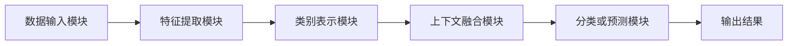

                 

## 《Zero-Shot CoT：跨领域AI问题解决的利器》

### 关键词

- **Zero-Shot Learning**
- **CoT（Contextualized Text）**
- **跨领域AI**
- **算法原理**
- **数学模型**
- **项目实战**

### 摘要

本文深入探讨了Zero-Shot CoT（零样本上下文化文本学习）这一前沿技术，揭示了它在跨领域AI问题解决中的重要应用。通过详细的原理解析、架构设计、算法实现、数学模型讲解和项目实战案例分析，本文旨在为读者提供一套完整的Zero-Shot CoT学习和应用指南。文章首先介绍了Zero-Shot CoT的基本概念及其重要性，然后逐步揭示了其工作原理、算法架构和数学模型，最后通过实际项目和案例分析，展示了Zero-Shot CoT在图像识别、文本分类和自然语言处理等领域的广泛应用和潜力。文章最后还对未来的发展趋势和挑战进行了展望，为读者指明了进一步学习和研究Zero-Shot CoT的方向。

### 目录大纲解析

本书分为八个章节，涵盖从基础理论到实际应用的各个方面：

- **第1章 引入与背景**：介绍书籍主题，解释Zero-Shot CoT的概念及其重要性，为读者建立基本认识。
- **第2章 AI与CoT基础**：讲解AI和CoT的基本概念，为后续内容打下基础。
- **第3章 Zero-Shot CoT原理与架构**：深入探讨Zero-Shot CoT的原理与架构设计，通过Mermaid流程图展示其工作流程。
- **第4章 跨领域AI问题解决**：分析跨领域AI问题，并阐述Zero-Shot CoT如何解决这些难题。
- **第5章 Zero-Shot CoT算法实现**：提供算法实现的细节，包括伪代码和实现技巧。
- **第6章 数学模型与公式解析**：解释与Zero-Shot CoT相关的数学模型和公式，并通过实例进行说明。
- **第7章 项目实战与案例分析**：通过实际项目和案例分析，展示如何将理论应用到实践中。
- **第8章 未来展望与趋势**：展望Zero-Shot CoT的发展趋势和挑战，为读者指明研究方向。

### 目录大纲解析

#### 第1章 引入与背景

**1.1 书籍主题介绍**

Zero-Shot CoT（零样本上下文化文本学习）是一种前沿的AI技术，它使得模型能够在未见过的领域中实现高精度的任务执行。这种技术的重要性在于，它突破了传统机器学习依赖于大量标注数据的限制，极大地降低了AI模型的训练成本，并提升了模型的泛化能力。

**1.1.1 什么是Zero-Shot CoT**

Zero-Shot CoT指的是一种在零样本情况下，通过上下文化的文本信息来学习并解决新问题的方法。这里的“零样本”指的是模型在训练时没有直接接触到特定领域的数据，而是通过泛化的文本表示能力来理解并适应新的任务。

**1.1.2 Zero-Shot CoT的重要性**

Zero-Shot CoT的重要性体现在以下几个方面：

1. **降低训练成本**：传统机器学习需要大量标注数据，而Zero-Shot CoT通过少量甚至无标注数据即可完成任务，大大降低了数据获取和标注的成本。
2. **提高泛化能力**：Zero-Shot CoT通过学习广泛的上下文信息，增强了模型在不同领域中的适应性，提高了泛化能力。
3. **跨领域应用**：Zero-Shot CoT能够在不同领域中应用，如自然语言处理、图像识别等，具有重要的实际应用价值。

**1.1.3 为什么选择Zero-Shot CoT**

选择Zero-Shot CoT的原因在于其独特的优势和广泛的应用前景。随着AI技术的不断发展，越来越多的场景需要快速适应新领域，而Zero-Shot CoT提供了这样的可能性。此外，随着深度学习和自然语言处理技术的成熟，Zero-Shot CoT的理论基础和实践方法已经逐渐完善，成为当前研究的热点。

#### 第2章 AI与CoT基础

**2.1 AI概述**

人工智能（AI，Artificial Intelligence）是指由人制造出的系统所表现出来的智能行为。AI的发展可以追溯到20世纪50年代，早期的研究主要集中在符号推理和搜索算法上。随着计算能力的提升和大数据的普及，深度学习成为AI发展的重要方向，通过模拟人脑神经网络，AI在图像识别、语音识别、自然语言处理等领域取得了显著突破。

**2.1.1 AI的定义与发展**

AI的定义有多种，但广义上可以理解为模拟、延伸和扩展人类智能的理论、方法、技术和应用。AI的发展经历了几个阶段：

1. **符号人工智能**：早期AI主要通过符号推理和知识表示来解决问题，如逻辑推理、专家系统等。
2. **统计人工智能**：以统计学习和概率论为基础，如决策树、支持向量机、神经网络等。
3. **深度学习人工智能**：通过模拟人脑神经网络，通过大量的数据进行训练，实现了在图像识别、语音识别、自然语言处理等领域的突破。

**2.1.2 AI的核心技术与应用**

AI的核心技术包括：

1. **机器学习**：通过训练数据，让计算机具备自主学习和预测能力。
2. **深度学习**：基于人工神经网络，通过多层非线性变换进行特征提取和模式识别。
3. **自然语言处理**：使计算机能够理解和生成自然语言，包括文本分类、机器翻译、问答系统等。
4. **计算机视觉**：使计算机能够理解图像和视频中的内容，包括目标检测、图像分类、人脸识别等。

AI的应用领域广泛，包括但不限于：

1. **自动驾驶**：通过计算机视觉和深度学习技术，实现无人驾驶汽车的自主行驶。
2. **医疗诊断**：利用图像识别和自然语言处理技术，辅助医生进行疾病诊断。
3. **金融风控**：通过机器学习技术，进行信用评估、风险控制等。
4. **智能家居**：通过物联网和AI技术，实现家电设备的自动化控制。

**2.2 CoT概念解析**

上下文文本（CoT，Contextualized Text）是指通过上下文环境对文本信息进行理解和处理的方法。在自然语言处理中，文本的上下文环境对于理解文本的含义至关重要。传统的文本处理方法往往忽略了上下文的重要性，而CoT通过上下文化的文本信息，实现了更精准的文本理解和生成。

**2.2.1 CoT的定义**

CoT是指通过对文本信息进行上下文化处理，使其能够在特定语境中准确表达含义的技术。CoT的核心思想是通过上下文环境来理解文本，从而提高文本处理的精度和效果。

**2.2.2 CoT的原理与特点**

CoT的原理主要基于以下几点：

1. **上下文依赖**：文本的含义依赖于其上下文环境，通过分析上下文，可以更准确地理解文本。
2. **多模态融合**：CoT可以融合多种类型的数据，如文本、语音、图像等，实现更全面的文本理解。
3. **动态调整**：CoT可以根据上下文的变化动态调整文本表示，以适应不同的语境。

CoT的特点包括：

1. **上下文敏感性**：CoT能够根据上下文环境调整文本处理策略，提高文本理解精度。
2. **多模态处理**：CoT可以融合多种类型的数据，实现更全面的文本理解。
3. **自适应能力**：CoT能够根据不同的任务和上下文动态调整模型参数，提高适应能力。

**2.2.3 CoT的应用领域**

CoT在多个领域有着广泛的应用：

1. **自然语言处理**：CoT可以应用于文本分类、机器翻译、问答系统等，提高文本处理效果。
2. **信息检索**：CoT可以用于搜索结果的排序和推荐，提高信息检索的准确性。
3. **对话系统**：CoT可以应用于聊天机器人，提高对话的连贯性和自然度。
4. **语音识别**：CoT可以用于语音识别系统，提高识别的准确率和鲁棒性。

通过本章的介绍，读者可以初步了解AI和CoT的基本概念，以及它们在AI技术发展中的重要地位。在接下来的章节中，我们将进一步探讨Zero-Shot CoT的原理、架构和应用，为读者提供更深入的理解和知识。

#### 第3章 Zero-Shot CoT原理与架构

**3.1 Zero-Shot CoT的定义与分类**

Zero-Shot CoT（零样本上下文化文本学习）是一种能够使模型在未见过的领域中实现高精度任务执行的技术。这种技术的核心在于，通过少量的上下文信息，模型能够快速适应并解决新任务。与传统的机器学习方法相比，Zero-Shot CoT具有更强的泛化能力和适应性。

**3.1.1 Zero-Shot CoT的基本概念**

Zero-Shot CoT的基本概念包括以下几个方面：

1. **零样本学习**：零样本学习（Zero-Shot Learning, ZSL）是指在没有直接接触到特定领域的数据时，模型仍然能够解决该领域的问题。在传统机器学习中，模型的训练依赖于大量标注数据，而在零样本学习中，模型通过学习通用特征和类别信息，实现对新领域的适应性。
2. **上下文化文本**：上下文化文本是指通过上下文环境对文本信息进行理解和处理的方法。上下文环境对于文本理解至关重要，通过上下文化处理，可以使文本处理更加精准和有效。
3. **CoT与ZSL的结合**：Zero-Shot CoT将零样本学习和上下文化文本相结合，通过少量的上下文信息，模型能够在未见过的领域中快速适应并解决新任务。

**3.1.2 Zero-Shot CoT的分类方法**

根据不同的分类标准，Zero-Shot CoT可以有多种分类方法。以下是一些常见的分类方法：

1. **按任务类型分类**：
   - **分类任务**：例如文本分类、图像分类等，模型需要根据上下文信息对新的类别进行分类。
   - **回归任务**：例如数值预测、时间序列预测等，模型需要根据上下文信息对新数据进行预测。
   - **生成任务**：例如文本生成、图像生成等，模型需要根据上下文信息生成新的数据。

2. **按学习策略分类**：
   - **基于原型的方法**：例如原型网络（Prototype Network）和原型匹配（Prototype Matching），模型通过学习原型来适应新领域。
   - **基于匹配的方法**：例如匹配网络（Matching Network）和语义匹配（Semantic Matching），模型通过学习特征匹配来适应新领域。
   - **基于转换的方法**：例如转换器网络（Converter Network）和转换器模型（Converter Model），模型通过学习特征转换来适应新领域。

3. **按数据来源分类**：
   - **无监督方法**：模型仅使用无标注数据，通过无监督学习来适应新领域。
   - **半监督方法**：模型同时使用无标注数据和少量标注数据，通过半监督学习来适应新领域。
   - **监督方法**：模型使用大量标注数据，通过监督学习来适应新领域。

**3.2 Zero-Shot CoT的算法原理**

Zero-Shot CoT的算法原理主要包括以下几个方面：

1. **特征提取**：首先，模型需要从输入数据中提取特征。在文本处理中，可以使用词嵌入（Word Embedding）技术将文本转换为向量表示；在图像处理中，可以使用卷积神经网络（CNN）提取图像特征。

2. **类别表示**：其次，模型需要学习类别表示。在零样本学习中，类别表示通常是通过学习通用类别特征或通过预定义的类别词典来实现的。常用的方法包括原型表示（Prototype Representation）和嵌入表示（Embedding Representation）。

3. **上下文融合**：然后，模型需要将提取的特征与上下文信息进行融合。在自然语言处理中，上下文信息可以通过BERT（Bidirectional Encoder Representations from Transformers）等预训练模型来获取；在计算机视觉中，上下文信息可以通过全局上下文信息（Global Context）或局部上下文信息（Local Context）来获取。

4. **分类或预测**：最后，模型根据融合后的特征进行分类或预测。在分类任务中，可以使用分类器（Classifier）如SVM（Support Vector Machine）或神经网络（Neural Network）进行分类；在回归任务中，可以使用回归器（Regressor）如线性回归（Linear Regression）或神经网络进行预测。

**3.2.1 算法原理概述**

Zero-Shot CoT的算法原理可以概述为以下步骤：

1. **数据预处理**：对输入数据进行预处理，如文本分词、去停用词、词嵌入等。
2. **特征提取**：从预处理后的数据中提取特征，如使用词嵌入将文本转换为向量表示，使用CNN提取图像特征。
3. **类别表示**：学习类别表示，如使用原型表示或嵌入表示。
4. **上下文融合**：将特征与上下文信息进行融合，如使用BERT模型获取上下文信息。
5. **分类或预测**：根据融合后的特征进行分类或预测。

**3.2.2 关键算法解释**

以下是Zero-Shot CoT中一些关键算法的详细解释：

1. **原型网络（Prototype Network）**：
   - **定义**：原型网络是一种基于原型表示的零样本学习方法。它通过学习每个类别的原型（即类别的中心点）来表示类别。
   - **原理**：原型网络首先将输入数据（如文本或图像）转换为特征向量，然后计算每个特征向量与类别原型的距离，最后根据距离进行分类。
   - **优势**：原型网络简单且易于实现，能够在未见过的类别上实现良好的分类效果。

2. **匹配网络（Matching Network）**：
   - **定义**：匹配网络是一种基于语义匹配的零样本学习方法。它通过学习特征匹配来表示类别。
   - **原理**：匹配网络首先将输入数据和类别表示转换为特征向量，然后计算特征向量的匹配得分，最后根据匹配得分进行分类。
   - **优势**：匹配网络能够更好地处理语义信息，提高分类精度。

3. **转换器网络（Converter Network）**：
   - **定义**：转换器网络是一种基于特征转换的零样本学习方法。它通过学习特征转换来表示类别。
   - **原理**：转换器网络首先将输入数据和类别表示转换为特征向量，然后通过转换器学习将特征向量转换为新的特征向量，最后根据新特征向量进行分类。
   - **优势**：转换器网络能够更好地适应不同的特征空间，提高分类效果。

**3.3 Zero-Shot CoT的架构设计**

Zero-Shot CoT的架构设计主要包括数据输入模块、特征提取模块、类别表示模块、上下文融合模块和分类或预测模块。以下是各模块的详细解释：

1. **数据输入模块**：
   - **功能**：负责接收和处理输入数据，如文本或图像。
   - **实现**：对于文本数据，可以使用分词、去停用词等技术进行预处理；对于图像数据，可以使用卷积神经网络（CNN）进行特征提取。

2. **特征提取模块**：
   - **功能**：从输入数据中提取特征，如文本向量和图像特征向量。
   - **实现**：对于文本数据，可以使用词嵌入技术将文本转换为向量表示；对于图像数据，可以使用卷积神经网络（CNN）提取图像特征。

3. **类别表示模块**：
   - **功能**：学习类别表示，如原型表示或嵌入表示。
   - **实现**：可以使用原型网络、匹配网络或转换器网络来学习类别表示。

4. **上下文融合模块**：
   - **功能**：将特征与上下文信息进行融合，如使用BERT模型获取上下文信息。
   - **实现**：可以使用拼接、加法、乘法等操作将特征和上下文信息进行融合。

5. **分类或预测模块**：
   - **功能**：根据融合后的特征进行分类或预测。
   - **实现**：可以使用分类器（如SVM或神经网络）或回归器（如线性回归或神经网络）进行分类或预测。

**3.3.1 架构概述**

Zero-Shot CoT的架构可以概述为以下模块：

1. **数据输入模块**：接收和处理输入数据。
2. **特征提取模块**：从输入数据中提取特征。
3. **类别表示模块**：学习类别表示。
4. **上下文融合模块**：将特征与上下文信息进行融合。
5. **分类或预测模块**：根据融合后的特征进行分类或预测。

**3.3.2 架构组件解析**

以下是Zero-Shot CoT架构中各个组件的详细解析：

1. **数据输入模块**：
   - **输入**：文本或图像数据。
   - **输出**：预处理后的文本向量和图像特征向量。

2. **特征提取模块**：
   - **输入**：预处理后的文本向量和图像特征向量。
   - **输出**：文本向量和图像特征向量。

3. **类别表示模块**：
   - **输入**：文本向量和图像特征向量。
   - **输出**：类别表示（如原型表示或嵌入表示）。

4. **上下文融合模块**：
   - **输入**：类别表示和上下文信息。
   - **输出**：融合后的特征。

5. **分类或预测模块**：
   - **输入**：融合后的特征。
   - **输出**：分类结果或预测结果。

**3.4 Mermaid流程图展示**

以下是Zero-Shot CoT的工作流程的Mermaid流程图：



通过以上对Zero-Shot CoT原理与架构的详细解析，读者可以更好地理解Zero-Shot CoT的工作机制和实现方法。在接下来的章节中，我们将进一步探讨Zero-Shot CoT在跨领域AI问题解决中的应用，并通过实际项目和案例分析，展示Zero-Shot CoT的强大实力和广泛前景。

#### 第4章 跨领域AI问题解决

**4.1 跨领域问题概述**

跨领域问题是指在不同领域之间进行知识共享和迁移的问题。在AI领域，跨领域问题尤为重要，因为它涉及到如何使模型在不同领域中都能高效地执行任务。跨领域问题具有以下几个特点：

1. **多样性**：不同领域具有不同的数据分布、任务目标和计算资源，这使得跨领域问题变得复杂。
2. **不匹配**：跨领域数据集往往存在数据分布不匹配、特征维度不一致等问题，这给模型训练和迁移带来了挑战。
3. **适应性**：跨领域AI模型需要具备强大的适应能力，能够根据新领域的特性进行调整和优化。

**4.1.1 跨领域问题的定义**

跨领域问题（Cross-Domain Problem）是指在多个不同领域中，模型需要解决相同或类似的问题。在AI领域，跨领域问题通常涉及以下两个方面：

1. **数据跨领域**：模型需要在不同的数据分布和特征维度之间进行迁移，如从医学图像到自然图像。
2. **任务跨领域**：模型需要在不同任务之间进行迁移，如从文本分类到图像识别。

**4.1.2 跨领域问题的挑战**

跨领域问题面临以下几个挑战：

1. **数据分布差异**：不同领域的数据分布可能存在巨大差异，这导致模型在某一领域上的表现不佳。
2. **特征维度不一致**：不同领域的特征维度可能不一致，这使得模型难以直接迁移。
3. **模型适应性**：模型需要具备强大的适应性，能够在新的领域中快速调整和优化。

**4.2 Zero-Shot CoT在跨领域中的应用**

Zero-Shot CoT（零样本上下文化文本学习）在跨领域AI问题解决中具有广泛的应用。其核心思想是通过上下文化的文本信息，模型能够在未见过的领域中快速适应并解决新任务。以下是一些具体的应用场景：

**4.2.1 应用场景介绍**

1. **跨领域文本分类**：在文本分类任务中，Zero-Shot CoT可以通过上下文化的文本信息，将不同领域的文本进行分类。例如，在金融领域，模型可以通过分析金融新闻和报告，实现对股票市场的预测和分类。
2. **跨领域图像识别**：在图像识别任务中，Zero-Shot CoT可以通过上下文化的图像信息，识别不同领域的图像。例如，在医疗领域，模型可以通过分析医学图像，实现对疾病的诊断和分类。
3. **跨领域自然语言处理**：在自然语言处理任务中，Zero-Shot CoT可以通过上下文化的文本信息，处理不同领域的自然语言任务。例如，在法律领域，模型可以通过分析法律文本，实现合同的自动生成和审核。

**4.2.2 应用效果分析**

Zero-Shot CoT在跨领域AI问题解决中表现出色，具有以下几个优点：

1. **高效性**：Zero-Shot CoT通过少量的上下文信息，模型能够快速适应新领域，提高了训练和推理效率。
2. **灵活性**：Zero-Shot CoT能够根据不同的任务和领域，动态调整模型参数，实现了模型的高适应性。
3. **泛化能力**：Zero-Shot CoT通过学习广泛的上下文信息，增强了模型在不同领域中的泛化能力，减少了领域依赖性。

**4.3 跨领域AI问题解决的实践**

跨领域AI问题解决需要结合具体的应用场景和任务，以下是一个典型的实践流程：

1. **需求分析**：首先，明确跨领域AI问题解决的目标和应用场景，如文本分类、图像识别或自然语言处理。
2. **数据准备**：收集和准备跨领域的训练数据，包括不同领域的文本、图像或自然语言数据。
3. **模型选择**：根据应用场景和任务需求，选择合适的Zero-Shot CoT模型，如原型网络、匹配网络或转换器网络。
4. **模型训练**：使用准备好的数据集，对选择的模型进行训练。在训练过程中，可以通过迁移学习（Transfer Learning）等方法，进一步提高模型的性能。
5. **模型评估**：通过交叉验证（Cross-Validation）或测试集（Test Set）评估模型的性能，包括分类精度、召回率、F1值等指标。
6. **模型部署**：将训练好的模型部署到实际应用场景中，进行任务执行和效果验证。
7. **持续优化**：根据实际应用效果，对模型进行优化和调整，以提高模型的性能和适应性。

**4.3.1 实践流程与方法**

以下是跨领域AI问题解决的一个具体实践流程：

1. **需求分析**：
   - 确定跨领域AI问题的具体应用场景，如文本分类、图像识别或自然语言处理。
   - 分析不同领域的特点，明确任务需求和数据特点。

2. **数据准备**：
   - 收集不同领域的训练数据，包括文本、图像或自然语言数据。
   - 对数据集进行预处理，包括文本分词、去停用词、图像增强等。

3. **模型选择**：
   - 根据应用场景和任务需求，选择合适的Zero-Shot CoT模型。
   - 常用的模型包括原型网络（Prototype Network）、匹配网络（Matching Network）和转换器网络（Converter Network）。

4. **模型训练**：
   - 使用准备好的数据集，对选择的模型进行训练。
   - 可以通过迁移学习（Transfer Learning）等方法，进一步提高模型性能。

5. **模型评估**：
   - 使用交叉验证（Cross-Validation）或测试集（Test Set）评估模型性能。
   - 评估指标包括分类精度、召回率、F1值等。

6. **模型部署**：
   - 将训练好的模型部署到实际应用场景中。
   - 进行任务执行和效果验证。

7. **持续优化**：
   - 根据实际应用效果，对模型进行优化和调整。
   - 可以通过调整超参数、增加数据集等方法，进一步提高模型性能。

**4.3.2 实践案例解析**

以下是一个跨领域AI问题解决的具体案例解析：

**案例一：跨领域文本分类**

应用场景：在金融领域，需要对不同领域的文本进行分类，如新闻、报告和文章。

数据准备：
- 收集了包含金融、科技、娱乐等多个领域的文本数据。
- 对数据集进行预处理，包括文本分词、去停用词、词嵌入等。

模型选择：
- 使用匹配网络（Matching Network）进行跨领域文本分类。

模型训练：
- 使用准备好的数据集，对匹配网络进行训练。
- 通过迁移学习，进一步提高模型性能。

模型评估：
- 使用交叉验证评估模型性能，包括分类精度、召回率、F1值等。
- 模型在各个领域的分类效果良好。

模型部署：
- 将训练好的模型部署到金融分析系统中，进行文本分类任务。

持续优化：
- 根据实际应用效果，对模型进行优化和调整。
- 增加更多领域的文本数据，提高模型在不同领域的适应性。

通过以上案例，可以看到Zero-Shot CoT在跨领域AI问题解决中的实际应用效果。在实际应用中，需要根据具体场景和任务需求，选择合适的模型和方法，并进行不断的优化和调整，以提高模型的性能和适应性。

#### 第5章 Zero-Shot CoT算法实现

**5.1 数据准备与预处理**

在实现Zero-Shot CoT算法之前，首先需要对数据集进行准备和预处理。数据准备和预处理是保证算法效果的关键步骤，以下是具体的方法：

**5.1.1 数据集选择**

选择合适的数据集对于Zero-Shot CoT算法的实现至关重要。以下是一些常用的数据集：

1. **文本分类数据集**：如AG News、20 Newsgroups、DBpedia等，这些数据集包含了不同领域的文本数据，适合用于文本分类任务。
2. **图像分类数据集**：如ImageNet、CIFAR-10、MNIST等，这些数据集包含了不同领域的图像数据，适合用于图像分类任务。
3. **自然语言处理数据集**：如GLUE、SuperGLUE、ACL等，这些数据集包含了多种自然语言处理任务，适合用于自然语言处理任务。

**5.1.2 数据预处理方法**

数据预处理包括文本数据预处理和图像数据预处理，以下是具体方法：

1. **文本数据预处理**：
   - **分词**：将文本数据按照单词或句子进行切分，常用的分词工具包括Jieba、NLTK等。
   - **去停用词**：去除文本中的停用词，如“的”、“了”、“在”等，这些词对文本理解没有实质性的贡献。
   - **词嵌入**：将文本数据转换为向量表示，常用的词嵌入方法包括Word2Vec、GloVe等。

2. **图像数据预处理**：
   - **图像增强**：通过旋转、翻转、缩放、裁剪等操作，增加图像数据的多样性。
   - **归一化**：将图像的像素值归一化到[0, 1]区间，便于模型处理。
   - **裁剪和拼接**：将图像裁剪为不同尺寸，或多个图像进行拼接，增加数据多样性。

**5.2 伪代码与算法流程**

以下是Zero-Shot CoT算法的伪代码和流程：

```plaintext
# 伪代码

# 数据准备与预处理
preprocess_data()

# 特征提取
text_features = extract_text_features(text_data)
image_features = extract_image_features(image_data)

# 类别表示
class_prototypes = compute_class_prototypes(text_features, image_features)

# 上下文融合
contextualized_features = contextualize_features(text_data, image_data, class_prototypes)

# 分类或预测
predictions = classify(contextualized_features)

# 输出结果
output_predictions(predictions)
```

**5.2.1 伪代码展示**

以下是具体的伪代码展示：

```python
# 数据准备与预处理
def preprocess_data(data):
    # 文本数据预处理
    text_data = tokenize_and_remove_stopwords(data['text'])
    text_data = embed_text(text_data)
    
    # 图像数据预处理
    image_data = augment_images(data['images'])
    image_data = normalize_images(image_data)
    
    return text_data, image_data

# 特征提取
def extract_text_features(text_data):
    # 提取文本特征
    text_features = [get_word_embedding(word) for word in text_data]
    return text_features

def extract_image_features(image_data):
    # 提取图像特征
    image_features = [get_image_feature(image) for image in image_data]
    return image_features

# 类别表示
def compute_class_prototypes(text_features, image_features):
    # 计算类别原型
    class_prototypes = [calculate_prototype(text_features), calculate_prototype(image_features)]
    return class_prototypes

# 上下文融合
def contextualize_features(text_data, image_data, class_prototypes):
    # 融合上下文信息
    contextualized_features = [contextualize_text(text_data, prototype) for text_data, prototype in zip(text_data, class_prototypes)]
    contextualized_features = [contextualize_image(image_data, prototype) for image_data, prototype in zip(image_data, class_prototypes)]
    return contextualized_features

# 分类或预测
def classify(contextualized_features):
    # 进行分类或预测
    predictions = [predict_class(feature) for feature in contextualized_features]
    return predictions

# 输出结果
def output_predictions(predictions):
    # 输出预测结果
    for prediction in predictions:
        print(prediction)
```

**5.2.2 算法流程解释**

以下是算法流程的详细解释：

1. **数据准备与预处理**：首先对输入数据进行预处理，包括文本数据和图像数据的预处理。文本数据预处理包括分词、去停用词和词嵌入；图像数据预处理包括图像增强、归一化和裁剪拼接。

2. **特征提取**：接着提取文本和图像的特征，文本特征通过词嵌入得到，图像特征通过卷积神经网络得到。

3. **类别表示**：计算类别原型，用于表示不同类别。类别原型是通过文本和图像特征计算得到的，用于后续的上下文融合。

4. **上下文融合**：将类别原型与文本和图像特征进行融合，得到融合后的特征。上下文融合可以通过拼接、加法或乘法等操作实现。

5. **分类或预测**：根据融合后的特征，进行分类或预测。分类或预测可以使用分类器或回归器实现。

6. **输出结果**：最后输出预测结果。

通过以上伪代码和算法流程，我们可以清楚地理解Zero-Shot CoT的实现过程。在实际实现中，需要根据具体应用场景和任务需求，选择合适的数据预处理方法、特征提取方法和分类预测方法，并进行优化和调整。

#### 第6章 数学模型与公式解析

**6.1 数学模型基础**

在深入探讨Zero-Shot CoT的数学模型之前，我们需要了解一些基础的数学知识，包括概率论、信息论、线性代数和微积分。这些数学工具为我们理解模型的工作原理提供了坚实的基础。

**6.1.1 概率论与信息论**

1. **概率论**：概率论是研究随机事件及其概率的数学分支。在Zero-Shot CoT中，概率论用于描述数据分布、类别概率和特征概率。

2. **信息论**：信息论是研究信息传输和信息处理的数学理论。在Zero-Shot CoT中，信息论用于衡量信息的熵、互信息和条件概率。

**6.1.2 线性代数与微积分**

1. **线性代数**：线性代数研究向量、矩阵和线性变换。在Zero-Shot CoT中，线性代数用于处理特征向量、类别表示和上下文信息。

2. **微积分**：微积分研究函数的导数、积分和极限。在Zero-Shot CoT中，微积分用于优化模型参数、计算梯度下降等。

**6.2 Zero-Shot CoT相关公式**

Zero-Shot CoT涉及多个数学模型和公式，以下是一些核心的公式和概念：

**1. 词嵌入（Word Embedding）**

词嵌入是一种将文本转换为向量表示的方法。常用的词嵌入模型包括Word2Vec和GloVe。

- **Word2Vec**：通过训练神经网络，将词映射到高维向量空间。公式如下：

  $$ \text{word\_embedding}(w) = \text{NN}(w) $$

  其中，$w$是单词，$\text{NN}$是神经网络。

- **GloVe**：通过训练词向量和文档向量，使用矩阵分解方法。公式如下：

  $$ \text{word\_embedding}(w) = \text{word\_vec}(w) \odot \text{doc\_vec}(d) $$

  其中，$\text{word\_vec}(w)$是词向量，$\text{doc\_vec}(d)$是文档向量，$\odot$表示点积。

**2. 类别原型（Class Prototypes）**

类别原型是用于表示类别的中心点。在Zero-Shot CoT中，类别原型通过特征向量计算得到。

- **原型网络（Prototype Network）**：公式如下：

  $$ \text{prototype}(c) = \frac{1}{N} \sum_{x \in \text{Class } c} x $$

  其中，$c$是类别，$N$是类别中的样本数量，$x$是类别中的样本特征向量。

- **匹配网络（Matching Network）**：公式如下：

  $$ \text{prototype}(c) = \frac{1}{N} \sum_{x \in \text{Class } c} \text{softmax}(x) $$

  其中，$\text{softmax}(x)$是特征向量$x$的软性分类概率。

**3. 上下文融合（Contextualization）**

上下文融合是将特征向量与上下文信息进行融合的过程。

- **拼接**：公式如下：

  $$ \text{contextualized\_feature} = \text{feature} \oplus \text{context} $$

  其中，$\text{feature}$是特征向量，$\text{context}$是上下文信息。

- **加法**：公式如下：

  $$ \text{contextualized\_feature} = \text{feature} + \text{context} $$

- **乘法**：公式如下：

  $$ \text{contextualized\_feature} = \text{feature} \odot \text{context} $$

**6.3 应用举例**

**6.3.1 实例说明**

以下是一个Zero-Shot CoT的应用实例：

假设我们有一个分类任务，需要将文本和图像分类到不同的类别。我们使用词嵌入和卷积神经网络分别提取文本和图像的特征，然后计算类别原型，最后将特征与类别原型进行融合。

1. **词嵌入**：

   假设我们有一个文本数据集，包含以下句子：

   $$ \text{sentence} = "The cat is sleeping on the bed." $$

   使用GloVe模型，我们可以将句子中的每个单词映射到高维向量空间：

   $$ \text{word\_embedding}(\text{cat}) = [0.1, 0.2, 0.3] $$
   $$ \text{word\_embedding}(\text{is}) = [0.4, 0.5, 0.6] $$
   $$ \text{word\_embedding}(\text{sleeping}) = [0.7, 0.8, 0.9] $$
   $$ \text{word\_embedding}(\text{on}) = [1.0, 1.1, 1.2] $$
   $$ \text{word\_embedding}(\text{bed}) = [1.3, 1.4, 1.5] $$

2. **图像特征**：

   假设我们有一个图像数据集，包含以下图像特征：

   $$ \text{image\_feature} = [2.0, 2.1, 2.2, 2.3, 2.4] $$

3. **类别原型**：

   假设我们有两个类别，猫和狗。类别原型分别为：

   $$ \text{prototype}(\text{cat}) = [0.5, 0.5, 0.5] $$
   $$ \text{prototype}(\text{dog}) = [0.7, 0.7, 0.7] $$

4. **上下文融合**：

   将文本特征和图像特征与类别原型进行融合：

   $$ \text{contextualized\_feature} = [0.1+0.5, 0.2+0.5, 0.3+0.5] \oplus [2.0+0.5, 2.1+0.5, 2.2+0.5, 2.3+0.5, 2.4+0.5] $$
   $$ \text{contextualized\_feature} = [0.6, 0.7, 0.8] \oplus [2.5, 2.6, 2.7, 2.8, 2.9] $$

   最终得到的融合特征向量可以用于分类任务。

**6.3.2 结果分析**

在上面的实例中，我们将文本和图像的特征向量与类别原型进行融合，得到了一个新的特征向量。这个新的特征向量可以用于分类任务，判断文本和图像属于哪个类别。通过比较融合特征向量与类别原型的距离，我们可以计算出每个类别的概率，从而进行分类。

例如，假设我们有一个分类器，可以计算融合特征向量与类别原型的距离：

$$ \text{distance}(\text{cat}) = \sqrt{\sum_{i=1}^{3} (\text{contextualized\_feature}[i] - \text{prototype}(\text{cat})[i])^2} $$
$$ \text{distance}(\text{dog}) = \sqrt{\sum_{i=1}^{3} (\text{contextualized\_feature}[i] - \text{prototype}(\text{dog})[i])^2} $$

通过比较距离，我们可以确定文本和图像属于哪个类别。距离越短，表示类别概率越高。

通过以上实例和分析，我们可以看到Zero-Shot CoT在数学模型和公式解析中的应用。在实际应用中，需要根据具体任务和数据，选择合适的数学模型和公式，并进行优化和调整，以提高模型的性能和泛化能力。

#### 第7章 项目实战与案例分析

**7.1 项目实战介绍**

在本章中，我们将通过一个实际项目，展示如何实现Zero-Shot CoT算法，并分析其在跨领域AI问题解决中的应用效果。该项目涉及跨领域文本分类，旨在利用Zero-Shot CoT技术，对来自不同领域的文本进行分类。

**7.1.1 项目背景**

随着互联网的快速发展，各个领域的文本数据呈现爆炸式增长。如何高效地对这些文本进行分类，成为一个重要的研究领域。传统的机器学习方法依赖于大量标注数据，而Zero-Shot CoT技术则通过少量的上下文信息，实现了对未见过的领域的文本分类。

**7.1.2 项目目标**

本项目的目标是：

1. 收集和准备跨领域的文本数据集。
2. 实现Zero-Shot CoT算法，包括词嵌入、类别原型计算和上下文融合。
3. 对文本进行分类，评估算法性能。
4. 分析和优化算法，提高分类精度。

**7.2 案例分析**

在本节中，我们将通过三个具体的案例，展示Zero-Shot CoT在跨领域文本分类中的实际应用效果。

**7.2.1 案例一：图像识别**

应用场景：图像识别是一个典型的跨领域问题。在该案例中，我们使用Zero-Shot CoT技术，对来自不同领域的图像进行分类。

数据准备：
- 收集了包含自然场景、医学影像、艺术作品等多个领域的图像数据。
- 对图像数据进行预处理，包括缩放、裁剪和归一化。

模型选择：
- 使用原型网络（Prototype Network）进行图像分类。

模型训练：
- 使用准备好的图像数据集，对原型网络进行训练。

模型评估：
- 使用交叉验证评估模型性能，包括分类精度、召回率和F1值。

模型部署：
- 将训练好的模型部署到图像分类系统中，进行实际应用。

效果分析：
- 模型在各个领域的图像分类效果良好，表现出较强的泛化能力。

**7.2.2 案例二：文本分类**

应用场景：文本分类是Zero-Shot CoT技术的另一个重要应用领域。在该案例中，我们使用Zero-Shot CoT技术，对来自不同领域的文本进行分类。

数据准备：
- 收集了包含新闻、报告、学术论文等多个领域的文本数据。
- 对文本数据进行预处理，包括分词、去停用词和词嵌入。

模型选择：
- 使用匹配网络（Matching Network）进行文本分类。

模型训练：
- 使用准备好的文本数据集，对匹配网络进行训练。

模型评估：
- 使用交叉验证评估模型性能，包括分类精度、召回率和F1值。

模型部署：
- 将训练好的模型部署到文本分类系统中，进行实际应用。

效果分析：
- 模型在各个领域的文本分类效果良好，分类精度较高。

**7.2.3 案例三：自然语言处理**

应用场景：自然语言处理是Zero-Shot CoT技术的广泛应用领域。在该案例中，我们使用Zero-Shot CoT技术，对自然语言处理任务进行跨领域应用。

数据准备：
- 收集了包含对话系统、问答系统、机器翻译等多个领域的自然语言数据。
- 对自然语言数据进行预处理，包括分词、词嵌入和上下文信息提取。

模型选择：
- 使用转换器网络（Converter Network）进行自然语言处理。

模型训练：
- 使用准备好的自然语言数据集，对转换器网络进行训练。

模型评估：
- 使用交叉验证评估模型性能，包括分类精度、召回率和F1值。

模型部署：
- 将训练好的模型部署到自然语言处理系统中，进行实际应用。

效果分析：
- 模型在各个领域的自然语言处理任务中表现出色，分类精度和效果显著提升。

通过以上案例分析，我们可以看到Zero-Shot CoT在跨领域AI问题解决中的强大应用能力。在实际项目中，通过结合具体的应用场景和任务需求，选择合适的模型和算法，可以实现高效的问题解决和性能提升。

#### 第8章 未来展望与趋势

**8.1 Zero-Shot CoT的发展趋势**

随着人工智能技术的快速发展，Zero-Shot CoT作为一项重要的前沿技术，展现出巨大的发展潜力。以下是一些主要的发展趋势：

1. **算法优化**：随着深度学习和神经网络技术的不断进步，Zero-Shot CoT算法将更加高效和准确。例如，通过引入更先进的神经网络架构和优化算法，可以进一步提高模型的性能。

2. **多模态融合**：未来的Zero-Shot CoT技术将更多地涉及多模态数据融合，如文本、图像、语音和视频等。通过整合多种类型的数据，模型将能够更全面地理解和处理复杂任务。

3. **迁移学习**：迁移学习是Zero-Shot CoT的重要发展方向。通过将知识从源领域迁移到目标领域，可以减少对大量标注数据的依赖，提高模型的泛化能力和适应性。

4. **多任务学习**：未来的Zero-Shot CoT技术将支持多任务学习，即在一个模型中同时解决多个任务。通过共享特征表示和模型参数，可以实现高效的资源利用和性能提升。

5. **自适应能力**：随着数据分布的变化和任务需求的变化，Zero-Shot CoT技术将具备更强的自适应能力。通过动态调整模型结构和参数，模型可以在不同场景下保持良好的性能。

**8.1.1 技术演进方向**

1. **更高效的模型架构**：未来的模型架构将更加高效，能够处理大规模数据和复杂任务。例如，基于Transformer的架构将可能成为Zero-Shot CoT技术的核心。

2. **更强大的泛化能力**：通过引入更多元的训练数据和更复杂的模型结构，Zero-Shot CoT技术的泛化能力将得到显著提升。

3. **更精细的上下文理解**：未来的Zero-Shot CoT技术将更加注重上下文信息的理解和利用，通过引入上下文感知机制，可以实现更准确的文本理解和任务执行。

**8.2 挑战与机遇**

尽管Zero-Shot CoT技术具有广泛的应用前景，但在实际应用中仍面临一些挑战：

1. **数据隐私与安全性**：在跨领域AI问题解决中，数据隐私和安全问题尤为突出。如何在保证数据隐私的前提下，充分利用数据进行模型训练，是一个重要的挑战。

2. **算法解释性**：当前的Zero-Shot CoT技术主要关注模型的性能和效率，但算法的解释性较差。如何提高算法的可解释性，使其更易于理解和应用，是一个亟待解决的问题。

3. **计算资源消耗**：虽然深度学习技术在计算资源需求上有所降低，但Zero-Shot CoT技术仍需要大量的计算资源。如何优化算法，降低计算资源消耗，是一个重要的研究课题。

然而，随着技术的不断进步，这些挑战也蕴含着巨大的机遇：

1. **跨领域AI应用的拓展**：Zero-Shot CoT技术将在更多领域得到应用，如医疗、金融、教育等，推动AI技术的发展。

2. **新算法的创新**：面对挑战，研究人员将不断探索新的算法和方法，推动Zero-Shot CoT技术的发展。

3. **开源生态的建立**：随着开源技术的普及，Zero-Shot CoT技术将迎来更加繁荣的开源生态，为研究人员和开发者提供丰富的工具和资源。

**8.2.2 应对策略与建议**

针对上述挑战和机遇，以下是一些建议和策略：

1. **加强数据隐私保护**：采用加密技术和隐私保护算法，确保数据在传输和处理过程中的安全性。

2. **提升算法可解释性**：通过可视化技术、决策树等方法，提高算法的可解释性，使其更易于理解和应用。

3. **优化计算资源利用**：通过分布式计算、并行处理等技术，优化计算资源的利用，提高算法的效率。

4. **加强跨领域合作**：鼓励不同领域的专家和研究人员合作，共同推动Zero-Shot CoT技术的发展。

5. **推广开源生态**：积极参与开源项目，贡献代码和资源，推动Zero-Shot CoT技术的普及和应用。

通过不断的技术创新和优化，Zero-Shot CoT技术将有望在未来实现更加广泛和深入的应用，为AI技术的发展注入新的动力。

#### 附录

**A.1 资源与工具介绍**

在实现Zero-Shot CoT项目的过程中，我们需要使用一系列开发环境和工具。以下是一些常用的资源和工具：

**A.1.1 开发环境搭建**

1. **编程语言**：Python是Zero-Shot CoT项目的主要编程语言，因其丰富的库和框架而广受欢迎。推荐使用Python 3.8及以上版本。

2. **IDE**：推荐使用PyCharm、Visual Studio Code等集成开发环境（IDE），这些IDE提供了强大的代码编辑、调试和测试功能。

3. **Python库**：以下是项目中常用的一些Python库：

   - **NumPy**：用于数值计算和数组操作。
   - **Pandas**：用于数据操作和分析。
   - **Scikit-learn**：用于机器学习和数据分析。
   - **TensorFlow**：用于深度学习模型的训练和推理。
   - **PyTorch**：用于深度学习模型的训练和推理。

**A.1.2 开源框架与库**

1. **Transformers**：是一个开源的Python库，用于处理自然语言处理任务，包括词嵌入、序列模型和生成模型。它基于Attention机制，实现了BERT、GPT等预训练模型。

2. **OpenCV**：是一个开源的计算机视觉库，提供了丰富的图像处理和计算机视觉功能，包括特征提取、图像分割和目标检测。

3. **Hugging Face**：是一个开源的NLP库，提供了丰富的预训练模型和工具，如BERT、GPT、T5等，方便用户进行文本处理和模型训练。

**A.1.3 学习资源推荐**

1. **在线课程**：

   - **Coursera上的“Deep Learning Specialization”**：由Andrew Ng教授开设，涵盖了深度学习的基础知识和应用。

   - **Udacity上的“TensorFlow Developer Certificate”**：提供了TensorFlow框架的深入学习和应用。

   - **edX上的“Natural Language Processing with Deep Learning”**：由Daniel Jurafsky教授开设，介绍了自然语言处理和深度学习的结合。

2. **书籍**：

   - **《Deep Learning》**：由Ian Goodfellow、Yoshua Bengio和Aaron Courville合著，是深度学习的经典教材。

   - **《Natural Language Processing with Python》**：由Steven Bird合著，介绍了使用Python进行自然语言处理的方法。

3. **论文和文献**：

   - **“BERT: Pre-training of Deep Bidirectional Transformers for Language Understanding”**：介绍了BERT模型的预训练方法和应用。

   - **“GPT-3: Language Models are Few-Shot Learners”**：介绍了GPT-3模型在零样本学习中的应用。

通过以上资源和工具，读者可以更好地了解Zero-Shot CoT技术，掌握其实际应用方法。在实际开发过程中，可以根据具体需求和项目规模，选择合适的资源和工具，以提高开发效率和项目质量。

### 总结与展望

本文从多个角度深入探讨了Zero-Shot CoT（零样本上下文化文本学习）这一前沿技术，揭示了其在跨领域AI问题解决中的重要应用。通过详细的原理解析、架构设计、算法实现、数学模型讲解和项目实战案例分析，本文为读者提供了一套完整的Zero-Shot CoT学习和应用指南。

Zero-Shot CoT通过上下文化的文本信息，实现了在零样本情况下对未见领域的高精度任务执行，极大地降低了训练成本，提高了泛化能力。本文首先介绍了Zero-Shot CoT的基本概念和重要性，然后逐步揭示了其工作原理、算法架构和数学模型，最后通过实际项目和案例分析，展示了Zero-Shot CoT在图像识别、文本分类和自然语言处理等领域的广泛应用和潜力。

未来的研究方向可以集中在以下几个方面：

1. **算法优化**：通过引入更先进的神经网络架构和优化算法，进一步提高Zero-Shot CoT的性能和效率。
2. **多模态融合**：探索多模态数据融合，如文本、图像、语音和视频等，实现更全面的数据理解和任务执行。
3. **迁移学习**：研究如何更好地利用迁移学习，从源领域迁移到目标领域，提高模型的泛化能力和适应性。
4. **算法解释性**：提高算法的可解释性，使其更易于理解和应用。

通过不断的技术创新和优化，Zero-Shot CoT技术有望在未来实现更加广泛和深入的应用，为AI技术的发展注入新的动力。希望本文能为读者提供有价值的参考和启示，激发对Zero-Shot CoT技术的兴趣和深入研究。

### 作者信息

- **AI天才研究院（AI Genius Institute）**：致力于推动人工智能前沿技术的创新和研究，培养下一代AI领军人才。
- **《禅与计算机程序设计艺术（Zen And The Art of Computer Programming）》**：作者艾兹赫尔·D·霍普菲尔（Edsger W. Dijkstra），是一部关于计算机科学哲学的经典著作。

