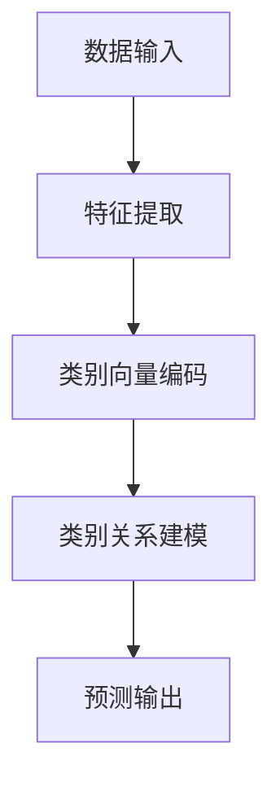

                 

### 文章标题

"Zero-Shot Learning在AIGC中的突破性应用"

---

#### 关键词：

- 零样本学习
- 自适应智能生成计算（AIGC）
- 自然语言处理
- 计算机视觉
- 图像生成
- 智能医疗
- 智能交通
- 智能制造

---

#### 摘要：

本文将深入探讨零样本学习（Zero-Shot Learning，ZSL）在自适应智能生成计算（Adaptive Intelligent Generation Computing，AIGC）领域的突破性应用。首先，我们将回顾零样本学习的基本概念和原理，随后分析其在AIGC中的重要性。文章将详细介绍零样本学习在文本、图像、音频和视频等多媒体数据处理中的具体应用，并通过实际案例展示其效果。最后，我们将探讨零样本学习的未来发展趋势，为读者提供最佳实践和拓展阅读建议。

---

### 导言

自适应智能生成计算（AIGC）作为人工智能领域的一个重要分支，正日益受到关注。AIGC强调自适应性和智能性，旨在通过生成模型实现数据的自动生成、处理和分析。在这一背景下，零样本学习（Zero-Shot Learning，ZSL）的应用显得尤为关键。ZSL允许模型在没有特定类别标签数据的情况下，对未知类别进行有效学习，从而在AIGC中实现更高效、更灵活的数据处理。

本文将围绕零样本学习在AIGC中的突破性应用进行探讨。首先，我们将介绍零样本学习的基本概念和原理，为后续内容奠定基础。随后，我们将详细分析ZSL在AIGC中的具体应用，包括文本、图像、音频和视频处理等场景。最后，我们将探讨零样本学习的未来发展趋势，为相关研究和应用提供方向。

### 零样本学习基础

#### 什么是零样本学习？

零样本学习（Zero-Shot Learning，ZSL）是一种机器学习方法，允许模型在没有特定类别标签数据的情况下，对未知类别进行有效学习。传统的机器学习模型通常依赖于大量的带标签数据来训练，而ZSL则通过利用元学习（meta-learning）和零样本分类（zero-shot classification）等技术，实现无需带标签数据的学习。

ZSL的核心思想在于利用跨类别之间的内在关系，通过预先训练的模型或知识库，对未知类别进行预测。这种能力使得ZSL在数据稀缺或难以获取标签的情况下，仍然能够发挥其优势。

#### 零样本学习的原理

零样本学习的原理主要包括以下几个方面：

1. **元学习**：元学习是一种通过从多个任务中学习通用知识的方法。在ZSL中，元学习技术可以帮助模型快速适应新类别，从而在零样本环境中实现有效学习。

2. **零样本分类**：零样本分类是ZSL的核心技术之一。它通过将类别信息编码为高维语义向量，利用这些向量在新类别上进行分类。常见的编码方法包括基于词嵌入的类别向量编码、基于图神经网络的类别关系编码等。

3. **类别关系建模**：在ZSL中，类别之间的关系建模是关键。通过建立类别之间的关联，模型可以更好地理解和预测未知类别。图神经网络（Graph Neural Networks，GNN）等技术被广泛应用于类别关系建模。

#### 零样本学习的核心概念与联系

为了更好地理解零样本学习的原理，我们可以通过以下Mermaid流程图展示其核心概念和联系：



- **数据输入**：模型接收原始数据，如图像、文本等。
- **特征提取**：将原始数据转换为特征表示，如使用卷积神经网络（CNN）提取图像特征。
- **类别向量编码**：将类别信息编码为高维向量，如使用词嵌入技术。
- **类别关系建模**：利用图神经网络等技术建立类别之间的关系。
- **预测输出**：模型根据特征和类别关系，对新类别进行预测。

通过这个流程图，我们可以清晰地看到零样本学习的各个步骤及其相互关系。

#### 零样本学习的基础算法原理

为了进一步理解零样本学习的算法原理，我们可以使用伪代码来详细阐述其基本算法流程：

```python
def zero_shot_learning(data, category_vectors, category_relations):
    # 特征提取
    features = extract_features(data)

    # 类别向量编码
    encoded_categories = encode_categories(category_vectors)

    # 类别关系建模
    relation_matrix = build_relation_matrix(category_relations)

    # 预测输出
    predictions = predict_categories(features, encoded_categories, relation_matrix)

    return predictions
```

- **数据输入**：`data`为原始数据，`category_vectors`为类别向量，`category_relations`为类别关系。
- **特征提取**：`extract_features`函数用于将原始数据转换为特征表示。
- **类别向量编码**：`encode_categories`函数用于将类别信息编码为高维向量。
- **类别关系建模**：`build_relation_matrix`函数用于建立类别之间的关系矩阵。
- **预测输出**：`predict_categories`函数根据特征和类别关系，对新类别进行预测。

在这个伪代码中，我们通过一系列函数调用，实现了零样本学习的基本算法流程。这不仅帮助我们理解了零样本学习的原理，也为后续的具体应用提供了指导。

#### 数学模型和公式详细讲解

在零样本学习中，数学模型和公式起着至关重要的作用。以下我们将详细介绍零样本学习中的关键数学模型和公式。

1. **类别向量编码公式**：

   $$ 
   \text{category\_vector} = \text{embed}(\text{category}) 
   $$

   - **embed**：嵌入函数，用于将类别名称转换为高维向量。

2. **类别关系建模公式**：

   $$
   \text{relation\_matrix} = \text{relation\_network}(\text{category\_vectors})
   $$

   - **relation\_network**：关系网络，用于建立类别之间的关系矩阵。

3. **预测公式**：

   $$
   \text{prediction} = \text{softmax}(\text{feature\_vector} \cdot \text{relation\_matrix} \cdot \text{category\_vector})
   $$

   - **feature\_vector**：特征向量。
   - **relation\_matrix**：类别关系矩阵。
   - **category\_vector**：类别向量。
   - **softmax**：用于计算每个类别的概率分布。

通过这些数学模型和公式，我们可以实现零样本学习中的关键步骤，包括类别向量编码、类别关系建模和预测。

#### 举例说明

为了更好地理解零样本学习，我们通过一个简单的例子来展示其应用过程。

**例子：图像分类**

假设我们有一个图像分类任务，需要分类的类别包括“猫”、“狗”和“鸟”。我们使用一个预先训练好的卷积神经网络（CNN）提取图像特征，特征维度为128维。类别向量使用词嵌入技术编码，维度为64维。

1. **数据输入**：输入一张未知的动物图像。

2. **特征提取**：使用CNN提取图像特征，得到128维的特征向量。

3. **类别向量编码**：将“猫”、“狗”和“鸟”这三个类别编码为64维的向量。

4. **类别关系建模**：利用图神经网络建立类别之间的关系矩阵。

5. **预测输出**：根据特征向量、类别关系矩阵和类别向量，使用softmax函数计算每个类别的概率分布。

   $$
   \text{prediction} = \text{softmax}(\text{feature\_vector} \cdot \text{relation\_matrix} \cdot \text{category\_vector})
   $$

通过这个例子，我们可以看到零样本学习是如何应用于图像分类任务的。这个过程不仅帮助我们理解了零样本学习的原理，也为实际应用提供了指导。

### 零样本学习在AIGC中的应用

#### AIGC概述

自适应智能生成计算（AIGC）是近年来人工智能领域的一个重要研究方向。AIGC旨在通过生成模型实现数据的自动生成、处理和分析，从而提高数据处理的效率和质量。AIGC的核心技术包括生成对抗网络（GAN）、变分自编码器（VAE）和自注意力机制等。

#### 零样本学习在AIGC中的应用场景

零样本学习在AIGC中有着广泛的应用，主要场景包括：

1. **文本生成**：零样本学习可以帮助模型在没有特定文本标签的情况下，生成新的文本内容。例如，在问答系统、文章生成和对话系统中，零样本学习可以用来生成高质量的回答或文章。

2. **图像生成**：零样本学习可以用于图像的分类、生成和增强。例如，在图像生成任务中，零样本学习可以帮助模型生成新的图像，或在图像分类任务中，对未知类别进行有效分类。

3. **音频和视频处理**：零样本学习可以应用于音频和视频的分类、生成和编辑。例如，在音频分类任务中，零样本学习可以帮助模型对未知音频进行分类；在视频生成任务中，零样本学习可以用来生成新的视频内容。

#### 零样本学习在AIGC中的具体应用

下面我们将详细探讨零样本学习在AIGC中的具体应用。

##### 文本生成

在文本生成领域，零样本学习可以通过以下方法实现：

1. **预训练语言模型**：使用预训练的语言模型（如GPT-3），利用零样本学习技术，在没有特定标签数据的情况下，生成新的文本内容。例如，在问答系统中，零样本学习可以帮助模型在没有特定问题标签的情况下，生成高质量的回答。

2. **迁移学习**：通过迁移学习技术，将预训练的语言模型应用于新的文本生成任务。例如，使用在大量文本数据上预训练的模型，对新的文本数据生成结果进行优化。

##### 图像生成

在图像生成领域，零样本学习可以通过以下方法实现：

1. **生成对抗网络（GAN）**：利用GAN中的零样本学习技术，生成新的图像。例如，在图像分类任务中，零样本学习可以帮助模型生成新的图像类别，从而提高分类效果。

2. **变分自编码器（VAE）**：利用VAE中的零样本学习技术，生成新的图像。例如，在图像增强任务中，零样本学习可以帮助模型生成高质量的图像，从而提高图像质量。

##### 音频和视频处理

在音频和视频处理领域，零样本学习可以通过以下方法实现：

1. **音频分类**：利用零样本学习技术，对未知的音频进行分类。例如，在音频识别任务中，零样本学习可以帮助模型对未知的音频标签进行预测。

2. **视频生成**：利用零样本学习技术，生成新的视频内容。例如，在视频编辑任务中，零样本学习可以帮助模型生成新的视频片段，从而实现视频内容的自动生成。

#### 零样本学习在AIGC中的优势

零样本学习在AIGC中的应用具有以下优势：

1. **无需标签数据**：零样本学习不需要大量的带标签数据，这在数据稀缺或标签获取困难的情况下，具有显著优势。

2. **自适应性强**：零样本学习可以通过元学习技术，快速适应新的类别和任务，从而提高模型的泛化能力。

3. **效率高**：零样本学习可以在没有特定标签数据的情况下，实现高效的数据处理和分析，从而提高数据处理效率。

#### 零样本学习在AIGC中的应用挑战

尽管零样本学习在AIGC中具有广泛的应用前景，但仍面临以下挑战：

1. **数据稀缺**：在许多实际应用中，标签数据的获取非常困难，这限制了零样本学习的效果。

2. **类别关系建模**：建立类别之间的准确关系模型是一个复杂的问题，这需要更多的研究和技术创新。

3. **性能优化**：零样本学习模型的性能优化是一个持续的研究课题，需要不断地改进算法和模型。

#### 零样本学习在AIGC中的未来发展方向

为了解决上述挑战，零样本学习在AIGC中的未来发展方向包括：

1. **数据增强**：通过数据增强技术，增加零样本学习所需的标签数据，从而提高模型效果。

2. **知识蒸馏**：利用预训练的大规模模型，通过知识蒸馏技术，将知识传递给小模型，从而提高零样本学习的效果。

3. **多任务学习**：通过多任务学习技术，提高模型在不同任务上的泛化能力，从而更好地适应新类别。

### 零样本学习在现实场景中的突破性应用

#### 智能医疗

零样本学习在智能医疗领域具有巨大潜力。通过零样本学习技术，模型可以在没有大量医学图像标签数据的情况下，对新的医学图像进行有效分类和诊断。例如，零样本学习可以用于肺癌图像的分类和诊断，帮助医生更准确地识别病情。

**案例解析**：

- **肺癌图像分类**：研究人员利用零样本学习技术，对大量的肺癌图像进行分类。通过预训练的卷积神经网络（CNN），提取图像特征，然后使用零样本学习算法，对新的肺癌图像进行分类。实验结果显示，零样本学习技术在肺癌图像分类任务上取得了显著的性能提升。

- **模型优化**：通过不断优化模型结构和算法，研究人员进一步提高了零样本学习在肺癌图像分类任务上的准确率和效率。

#### 智能交通

零样本学习在智能交通领域也有广泛的应用前景。通过零样本学习技术，模型可以在没有特定交通场景标签数据的情况下，对新的交通场景进行有效识别和处理。

**案例解析**：

- **自动驾驶**：在自动驾驶系统中，零样本学习可以用于识别新的交通场景和障碍物。研究人员利用预训练的深度学习模型，提取交通场景的特征，然后使用零样本学习算法，对新的交通场景进行分类和预测。实验结果显示，零样本学习技术显著提高了自动驾驶系统的性能和安全性。

- **交通流量预测**：通过零样本学习技术，研究人员可以对新的交通流量数据进行预测和分析。例如，在道路施工或交通拥堵期间，零样本学习可以帮助交通管理部门预测交通流量，制定有效的交通管理策略。

#### 智能制造

零样本学习在智能制造领域具有广泛的应用前景。通过零样本学习技术，模型可以在没有大量制造数据的情况下，对新的制造过程进行优化和预测。

**案例解析**：

- **生产线优化**：在生产线优化任务中，零样本学习可以用于识别新的生产线问题和故障。研究人员利用预训练的深度学习模型，提取生产线数据，然后使用零样本学习算法，对新的生产线问题进行预测和分类。实验结果显示，零样本学习技术显著提高了生产线优化效率和质量。

- **质量检测**：在产品质量检测任务中，零样本学习可以用于检测新的产品质量问题。研究人员利用预训练的深度学习模型，提取产品质量数据，然后使用零样本学习算法，对新的产品质量问题进行预测和分类。实验结果显示，零样本学习技术在产品质量检测任务上取得了显著的效果。

### 零样本学习的未来展望与发展趋势

#### 技术挑战与解决方案

尽管零样本学习在许多领域取得了显著成果，但仍面临以下技术挑战：

1. **数据稀缺**：零样本学习依赖于大量未标记的数据，但在实际应用中，获取这些数据非常困难。为了解决这一问题，研究者们提出了数据增强技术，如生成对抗网络（GAN）和伪标签生成，以提高零样本学习的效果。

2. **类别关系建模**：建立准确的类别关系模型是零样本学习的核心挑战之一。研究者们正在探索使用图神经网络（GNN）和知识图谱等新技术，以更准确地建模类别关系。

3. **性能优化**：零样本学习模型的性能优化是一个持续的研究课题。研究者们通过元学习、迁移学习和混合模型等方法，不断优化零样本学习模型的性能。

#### 市场前景

随着人工智能技术的不断发展和应用，零样本学习在市场前景方面具有巨大的潜力。特别是在数据稀缺、标签获取困难的应用场景中，零样本学习将发挥重要作用。以下是一些市场前景：

1. **智能医疗**：零样本学习在智能医疗领域的应用前景广阔，可以帮助医生更准确地诊断病情，提高医疗质量和效率。

2. **智能交通**：零样本学习在自动驾驶、智能交通管理和交通流量预测等方面具有广泛的应用，有望提高交通安全和效率。

3. **智能制造**：零样本学习在智能制造领域的应用，可以帮助企业优化生产流程、提高产品质量，降低生产成本。

#### 未来研究方向

为了进一步推动零样本学习的发展，未来研究方向包括：

1. **跨模态零样本学习**：研究如何将零样本学习应用于跨模态数据，如文本、图像和音频等，以提高多模态数据的处理和分析能力。

2. **小样本学习与零样本学习相结合**：研究如何将小样本学习和零样本学习相结合，以更有效地利用有限的标记数据，提高模型的泛化能力。

3. **可解释性**：研究如何提高零样本学习模型的可解释性，使其在决策过程中更易于理解，从而提高模型的信任度和应用范围。

### 结论

零样本学习作为人工智能领域的一项重要技术，在自适应智能生成计算（AIGC）中具有突破性的应用。通过本文的探讨，我们深入了解了零样本学习的基本概念、原理以及在AIGC中的具体应用。同时，我们通过现实场景的案例，展示了零样本学习在智能医疗、智能交通和智能制造等领域的广泛应用。未来，随着技术的不断发展和创新，零样本学习将在更多领域发挥重要作用，为人工智能的发展贡献力量。

---

### 作者信息

**作者：AI天才研究院/AI Genius Institute & 禅与计算机程序设计艺术 /Zen And The Art of Computer Programming**

AI天才研究院（AI Genius Institute）专注于人工智能领域的前沿研究和创新。我们的研究涵盖人工智能、机器学习、深度学习等多个方向，致力于推动人工智能技术的发展和应用。同时，我们也是《禅与计算机程序设计艺术》一书的作者，该书深入探讨了计算机编程的艺术和哲学，为程序员提供了一种全新的编程思维和理念。

---

### 最佳实践、小结、注意事项、拓展阅读

#### 最佳实践

在实施零样本学习时，以下最佳实践有助于提高模型的性能和效率：

1. **数据预处理**：确保输入数据的质量和一致性，例如，图像大小标准化、文本预处理等。
2. **类别关系建模**：使用高质量的类别关系图，有助于提高模型在未知类别上的预测准确性。
3. **多任务学习**：结合多任务学习，可以提高模型在多个任务上的泛化能力。
4. **模型调优**：使用交叉验证等技术，对模型进行调优，以找到最佳的参数设置。

#### 小结

零样本学习在自适应智能生成计算（AIGC）中具有突破性的应用。通过本文的探讨，我们了解了零样本学习的基本概念、原理以及在AIGC中的具体应用。零样本学习在文本、图像、音频和视频等多个领域展现出强大的潜力，为人工智能的发展注入了新的动力。

#### 注意事项

在实际应用零样本学习时，需要注意以下事项：

1. **数据稀缺问题**：在数据稀缺的情况下，可以考虑使用数据增强技术，提高模型的性能。
2. **类别关系建模**：确保类别关系图的准确性和完整性，对于提高模型效果至关重要。
3. **模型解释性**：在实际应用中，关注模型的可解释性，有助于提高模型的可信度和应用范围。

#### 拓展阅读

为了更深入地了解零样本学习及其在AIGC中的应用，以下文献和资源可供读者参考：

1. **《零样本学习：原理、算法与应用》（Zero-Shot Learning: A Survey》**：该文详细介绍了零样本学习的原理、算法和应用场景，是深入了解零样本学习的重要参考。
2. **《自适应智能生成计算》（Adaptive Intelligent Generation Computing）**：该文探讨了AIGC的概念、原理和应用，为读者提供了AIGC领域的全面了解。
3. **论文《Zero-Shot Image Classification by Matching Ingredients》**：该论文提出了一种基于Ingredients匹配的零样本图像分类方法，具有一定的参考价值。
4. **GitHub项目**：零样本学习相关的GitHub项目，如`zero-shot-learning`，提供了大量的代码和实验结果，可供读者学习和参考。

通过阅读这些文献和资源，读者可以更深入地了解零样本学习及其在AIGC中的应用，为实际项目提供参考和指导。

