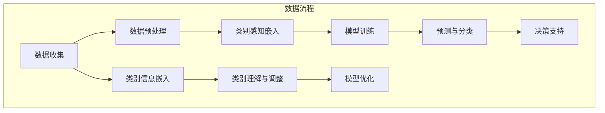
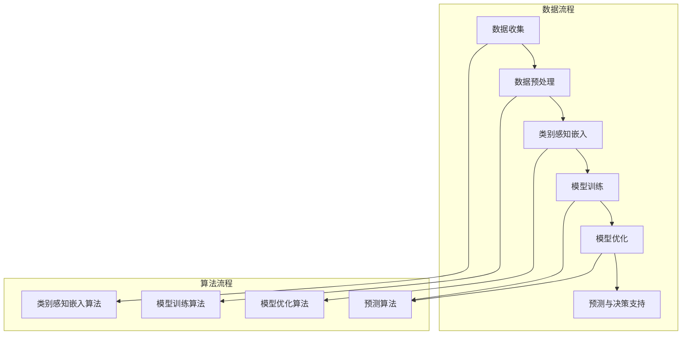

                 


### 文章标题

《Zero-Shot学习在AI农业管理中的创新》

### 文章关键词

- Zero-Shot学习
- AI农业管理
- 智能农业
- 决策支持
- 数据驱动

### 文章摘要

本文探讨了Zero-Shot学习在AI农业管理中的创新应用。首先，我们介绍了AI农业管理的基本概念和现有技术的挑战。接着，我们详细阐述了Zero-Shot学习的定义、分类及其在农业管理中的应用潜力。文章通过Mermaid流程图展示了ZSL在农业管理中的核心概念与联系，并使用伪代码讲解了关键算法原理。随后，我们介绍了ZSL的数学模型和公式，并通过实际项目案例分析了ZSL在农业管理中的具体应用。最后，文章总结了ZSL在农业管理中的未来发展，并提出了相关最佳实践。

## 第1章 引言

### 1.1 书籍主题与目的

人工智能（AI）技术在农业管理中的应用正日益受到关注。随着全球人口增长和气候变化对农业的影响，提高农业生产效率和可持续性成为关键挑战。AI农业管理通过整合各种技术，如遥感、物联网、大数据分析和机器学习，旨在提供智能化的农业决策支持系统。然而，传统机器学习模型在农业数据稀少和复杂情况下面临困难。

Zero-Shot学习（ZSL）是一种前沿的机器学习技术，能够在未见过的数据集上预测和分类。ZSL在农业管理中的应用具有巨大潜力，因为它可以处理稀少的农业数据，同时适应农业领域的特定需求。本书旨在探讨ZSL在AI农业管理中的创新应用，包括其理论基础、核心算法、数学模型和实际项目案例。

### 1.1.1 零样本学习（ZSL）概述

ZSL是一种机器学习技术，允许模型在未见过的类（即零样本）上进行预测和分类。与传统的有监督学习（S Supervised Learning）和半监督学习（SSemi-Supervised Learning）不同，ZSL不需要标签化的训练数据。这种特性使得ZSL在数据稀少或数据获取成本高昂的领域具有独特优势。

ZSL的核心在于将类别信息嵌入到模型中，使得模型能够理解不同类别的特征。这种类别感知嵌入（Category-Aware Embedding）方法使得模型能够在新类别上做出准确的预测。ZSL的主要分类包括基于嵌入的方法、基于原型的方法和基于匹配的方法。

### 1.1.2 AI农业管理的现状与挑战

AI农业管理是指利用人工智能技术，如机器学习、计算机视觉和自然语言处理，来提高农业生产效率和可持续性的过程。当前，AI农业管理已经应用于多个领域，包括精准农业、作物病害监测、气象预测和农产品质量检测。

尽管AI农业管理显示出巨大潜力，但仍面临一些挑战。首先，农业数据的多样性和复杂性使得传统机器学习模型难以适应。其次，农业数据稀少且获取成本高，限制了模型训练的质量。此外，农业领域的技术标准化和跨学科合作也需要进一步发展。

### 1.1.3 ZSL在农业管理中的应用前景

ZSL在农业管理中的应用前景广阔。首先，ZSL可以处理稀少的农业数据，通过类别感知嵌入方法，使得模型能够在新类别上做出准确的预测。这为农业领域的数据驱动决策提供了新途径。其次，ZSL能够适应农业数据的特定需求，如作物病虫害监测、土壤质量评估和水资源管理。此外，ZSL在农业数据的跨学科应用中也具有潜力，如结合遥感技术和机器学习算法，实现精准农业和智能农业。

### 1.2 本书结构与内容安排

本书分为五个主要章节：

- **第1章 引言**：介绍书籍的主题、目的和结构。
- **第2章 AI农业管理基础**：介绍AI农业管理的基本概念、现状和挑战。
- **第3章 零样本学习（ZSL）理论基础**：阐述ZSL的定义、分类和核心算法。
- **第4章 ZSL在AI农业管理中的应用**：讨论ZSL在农业管理中的具体应用，包括核心概念、算法原理和数学模型。
- **第5章 项目实战**：通过实际项目案例，展示ZSL在农业管理中的应用和实现。

### 1.3 零样本学习（ZSL）简介

ZSL是一种机器学习技术，允许模型在未见过的类（即零样本）上进行预测和分类。与传统的有监督学习（S Supervised Learning）和半监督学习（SSemi-Supervised Learning）不同，ZSL不需要标签化的训练数据。这种特性使得ZSL在数据稀少或数据获取成本高昂的领域具有独特优势。

ZSL的核心在于将类别信息嵌入到模型中，使得模型能够理解不同类别的特征。这种类别感知嵌入（Category-Aware Embedding）方法使得模型能够在新类别上做出准确的预测。ZSL的主要分类包括基于嵌入的方法、基于原型的方法和基于匹配的方法。

## 第2章 AI农业管理基础

### 2.1 AI农业管理的基本概念

AI农业管理是指利用人工智能技术，如机器学习、计算机视觉和自然语言处理，来提高农业生产效率和可持续性的过程。AI农业管理的主要目标是实现精准农业和智能农业，通过数据驱动的决策支持系统，优化农业生产的各个环节。

精准农业（Precision Agriculture）是一种利用地理信息系统（GIS）、遥感（RS）和全球定位系统（GPS）等高新技术，根据土壤、作物和气候等环境条件的差异，实施差异化管理，以提高农业生产效率和资源利用率的农业技术。精准农业的核心思想是“因地制宜、分类管理”。

智能农业（Smart Agriculture）则强调利用AI技术，如机器学习、物联网和大数据分析，实现农业的自动化、智能化和高效化。智能农业的目标是通过实时监测和智能分析，为农业生产提供科学依据，提高农业生产的产量和质量。

### 2.2 当前农业AI技术的应用现状

目前，AI技术在农业管理中的应用已经取得了显著成果。以下是一些主要的农业AI技术及其应用领域：

- **遥感技术**：利用卫星和无人机获取农田的遥感图像，通过图像处理和分析，实现作物长势监测、病虫害检测和土地资源管理。例如，利用遥感技术可以实时监测作物的叶绿素含量，预测作物的生长状态和产量。

- **物联网（IoT）**：通过传感器和无线网络，实现对农田环境、作物生长状态和农机设备的实时监测和管理。例如，通过土壤湿度传感器和气象站，可以实时监测土壤水分和气象条件，为灌溉和施肥提供数据支持。

- **大数据分析**：通过对农业数据的收集、存储和分析，实现农业生产过程的智能化管理。例如，利用大数据分析技术，可以分析历史天气数据、作物生长数据和土壤数据，为农业生产提供科学的决策支持。

- **机器学习与深度学习**：通过构建机器学习模型，实现对农业数据的预测和分析。例如，利用机器学习算法，可以预测作物的生长趋势、病虫害发生的可能性以及产量等。

- **计算机视觉**：利用计算机视觉技术，实现对农业作物的图像识别和分类。例如，利用计算机视觉技术，可以实现对农田病虫害的自动检测和分类。

### 2.3 农业AI技术的挑战

尽管农业AI技术显示出巨大潜力，但在实际应用中仍面临一些挑战：

- **数据稀缺性**：农业数据稀少且获取成本高，限制了模型训练的质量和效果。特别是零样本情况下的预测和分类，需要大量的未见过的数据。

- **数据质量**：农业数据质量参差不齐，包括数据缺失、噪声和错误等。这些因素都会影响模型的训练效果和预测准确性。

- **数据标准化**：农业数据的多样性和复杂性使得数据标准化和统一成为一个挑战。不同来源和格式的数据难以进行有效的整合和分析。

- **技术标准化**：农业AI技术的标准化和跨学科合作需要进一步发展。目前，不同研究者和机构之间的技术标准和数据共享机制尚不完善。

- **法律和伦理问题**：随着AI技术在农业领域的应用，涉及隐私、安全和伦理等问题。例如，如何保护农民的隐私数据，以及如何确保AI决策的透明性和公正性。

### 2.4 AI农业管理的关键技术

AI农业管理的关键技术包括：

- **数据收集与处理**：利用遥感、物联网和传感器等技术，收集农田环境、作物生长状态和气象等数据。通过数据清洗、预处理和整合，提高数据质量和可用性。

- **机器学习与深度学习**：构建和训练机器学习模型，实现对农业数据的预测和分析。利用深度学习算法，如卷积神经网络（CNN）和循环神经网络（RNN），提高模型的预测准确性和泛化能力。

- **计算机视觉与图像识别**：利用计算机视觉技术，实现对农业作物的图像识别和分类。通过图像处理和分析，实现对作物病虫害的自动检测和分类。

- **决策支持系统**：构建决策支持系统，为农业生产提供科学依据。通过实时监测和智能分析，为灌溉、施肥、病虫害防治等农业活动提供优化建议。

- **数据共享与标准化**：建立农业数据共享平台，促进数据标准化和统一。通过跨学科合作和技术标准化，提高农业AI技术的应用效果。

## 第3章 零样本学习（ZSL）理论基础

### 3.1 ZSL概念与分类

零样本学习（Zero-Shot Learning，ZSL）是一种机器学习技术，能够在未见过的数据集上进行预测和分类。与传统的有监督学习（Supervised Learning）和半监督学习（Semi-Supervised Learning）不同，ZSL不需要标签化的训练数据。ZSL的核心在于将类别信息嵌入到模型中，使得模型能够理解不同类别的特征。这种特性使得ZSL在数据稀少或数据获取成本高昂的领域具有独特优势。

ZSL的分类主要包括以下几种方法：

1. **基于嵌入的方法**：这种方法将类别信息嵌入到模型的特征空间中，使得模型能够在新类别上做出准确的预测。常见的嵌入方法包括类别感知嵌入（Category-Aware Embedding）和嵌入匹配（Embedding Matching）。

2. **基于原型的方法**：这种方法通过构建原型来表示类别，使得模型能够在新类别上找到相应的原型，从而进行预测。常见的原型方法包括原型网络（Prototypical Network）和自适应原型网络（Adaptive Prototypical Network）。

3. **基于匹配的方法**：这种方法通过比较新类别和训练数据的特征，找到最相似的类别进行预测。常见的匹配方法包括匹配网络（Matching Network）和图匹配（Graph Matching）。

### 3.2 ZSL的优势与挑战

ZSL的优势包括：

1. **无需标签化训练数据**：ZSL能够在未见过的数据集上进行预测和分类，不需要大量的标签化训练数据。这在数据稀缺或数据获取成本高昂的领域具有显著优势。

2. **泛化能力**：通过类别感知嵌入等方法，ZSL能够在新类别上做出准确的预测，提高了模型的泛化能力。

3. **多任务学习**：ZSL可以通过共享类别信息，实现多任务学习，提高了模型的效率和效果。

ZSL的挑战包括：

1. **数据稀少**：在零样本情况下，训练数据的稀少限制了模型的效果。特别是在农业等领域，数据获取成本高且数据稀少，这对ZSL的应用提出了挑战。

2. **类别分布不平衡**：在ZSL中，新类别和训练类别之间的分布可能不平衡，导致模型对新类别的预测效果较差。

3. **类别理解**：ZSL需要模型能够正确理解不同类别的特征，这要求模型具有较高的类别理解能力。然而，在农业等领域，类别的多样性和复杂性使得类别理解成为一个挑战。

### 3.3 Mermaid流程图：ZSL在AI农业管理中的应用

以下是ZSL在AI农业管理中的应用的Mermaid流程图：



### 3.4 ZSL在农业管理中的潜在应用

ZSL在农业管理中具有广泛的应用潜力，以下是一些具体的潜在应用：

1. **作物病害监测**：通过零样本学习，模型可以对新出现的病害进行预测和分类。这对于早期发现和防治病害具有重要意义。

2. **作物产量预测**：利用零样本学习，模型可以预测作物的产量，为农业生产计划提供数据支持。这对于优化资源配置和提高农业产量具有重要作用。

3. **土壤质量评估**：通过零样本学习，模型可以评估土壤的质量，为土壤改良和施肥提供科学依据。这对于提高农业生产效率和资源利用率具有重要意义。

4. **水资源管理**：利用零样本学习，模型可以预测水资源的可用性，为灌溉和水资源管理提供数据支持。这对于农业的可持续发展和水资源保护具有重要意义。

5. **农业数据挖掘**：通过零样本学习，模型可以挖掘农业数据中的潜在价值，为农业生产提供新的洞察和决策支持。

## 第4章 ZSL在AI农业管理中的应用

### 4.1 ZSL在AI农业管理中的应用概述

零样本学习（ZSL）在AI农业管理中的应用具有显著潜力。农业领域的数据稀缺性和类别多样性使得传统机器学习模型难以适应。ZSL通过将类别信息嵌入到模型中，使得模型能够在新类别上做出准确的预测，为农业数据的分析和决策提供了新的途径。

ZSL在农业管理中的应用主要包括以下几个方面：

1. **作物病害监测**：利用ZSL，模型可以对新出现的病害进行预测和分类，为农作物的健康生长提供保障。

2. **作物产量预测**：通过ZSL，模型可以预测作物的产量，为农业生产计划提供数据支持，优化资源配置。

3. **土壤质量评估**：利用ZSL，模型可以评估土壤的质量，为土壤改良和施肥提供科学依据，提高农业生产效率。

4. **水资源管理**：通过ZSL，模型可以预测水资源的可用性，为灌溉和水资源管理提供数据支持，促进农业的可持续发展。

5. **农业数据挖掘**：利用ZSL，模型可以挖掘农业数据中的潜在价值，为农业生产提供新的洞察和决策支持。

### 4.2 ZSL在AI农业管理中的核心概念与联系

ZSL在AI农业管理中的核心概念包括数据收集与处理、类别感知嵌入、模型训练与优化以及预测与决策支持。以下是这些核心概念之间的联系架构：



### 4.3 ZSL在AI农业管理中的核心算法原理讲解

ZSL在AI农业管理中的核心算法主要包括类别感知嵌入（Category-Aware Embedding）、模型训练（Model Training）和模型优化（Model Optimization）。以下是这些算法的伪代码和详细讲解。

#### 类别感知嵌入（Category-Aware Embedding）

```python
# 假设C是类别字典，X是特征矩阵，y是类别标签
def category_aware_embedding(C, X, y):
    # 初始化类别嵌入矩阵E，其中e_c为类别c的嵌入向量
    E = initialize_embedding_matrix(C)
    
    # 更新嵌入矩阵E，使得相近的类别具有相似的嵌入向量
    for i in range(len(X)):
        xi = X[i]
        yi = y[i]
        e_yi = E[yi]
        
        # 计算类别之间的相似度
        similarity = cosine_similarity([xi], [e_yi])
        
        # 更新嵌入矩阵E，以最小化类别之间的相似度差异
        for c in C:
            e_c = E[c]
            E[c] = e_c - learning_rate * (similarity - 1) * (e_yi - e_c)
            
    return E
```

类别感知嵌入的核心思想是将类别信息嵌入到模型的特征空间中。通过计算类别之间的相似度，并更新嵌入矩阵，使得相近的类别具有相似的嵌入向量。这样，模型在未见过的类别上能够找到相似的嵌入向量，从而进行预测。

#### 模型训练（Model Training）

```python
# 假设E是类别嵌入矩阵，X是特征矩阵，y是类别标签
def model_training(E, X, y, model):
    # 初始化模型参数
    model.initialize_parameters()
    
    # 进行模型训练
    for i in range(len(X)):
        xi = X[i]
        yi = y[i]
        e_yi = E[yi]
        
        # 计算预测概率
        probabilities = model.predict([xi, e_yi])
        
        # 计算损失函数
        loss = calculate_loss(probabilities, yi)
        
        # 更新模型参数
        model.update_parameters(loss, learning_rate)
        
    return model
```

模型训练的核心是利用类别嵌入矩阵E和特征矩阵X，对模型进行训练。在训练过程中，模型会利用类别嵌入向量e_yi来计算预测概率，并计算损失函数以更新模型参数。

#### 模型优化（Model Optimization）

```python
# 假设E是类别嵌入矩阵，X是特征矩阵，y是类别标签
def model_optimization(E, X, y, model):
    # 初始化模型参数
    model.initialize_parameters()
    
    # 进行模型训练
    for i in range(len(X)):
        xi = X[i]
        yi = y[i]
        e_yi = E[yi]
        
        # 计算预测概率
        probabilities = model.predict([xi, e_yi])
        
        # 计算损失函数
        loss = calculate_loss(probabilities, yi)
        
        # 更新模型参数
        model.update_parameters(loss, learning_rate)
        
        # 进行模型优化，如使用dropout、正则化等技术
        model.optimize_parameters()
        
    return model
```

模型优化的目的是提高模型的泛化能力和预测准确性。在模型优化过程中，会使用一些技术，如dropout、正则化等，来降低模型过拟合的风险，提高模型的性能。

### 4.4 ZSL在AI农业管理中的数学模型和数学公式

ZSL在AI农业管理中的数学模型主要包括类别嵌入矩阵E、特征矩阵X、类别标签y以及预测概率P(y|X)。以下是这些数学模型的公式和详细讲解。

#### 类别嵌入矩阵E

$$
E = \{e_c | c \in C\}
$$

类别嵌入矩阵E是一个KxN的矩阵，其中K是类别数，N是特征数。每个类别c都有一个对应的嵌入向量e_c，用于表示该类别的特征。

#### 特征矩阵X

$$
X = \{x_i | i = 1, 2, ..., n\}
$$

特征矩阵X是一个n x N的矩阵，其中n是样本数，N是特征数。每个样本x_i都对应一个特征向量。

#### 类别标签y

$$
y = \{y_i | i = 1, 2, ..., n\}
$$

类别标签y是一个n x 1的向量，每个元素y_i表示样本x_i的类别。

#### 预测概率P(y|X)

$$
P(y|X) = \frac{e^T_y \cdot X}{\sum_{i=1}^{n} e^T_i \cdot X}
$$

预测概率P(y|X)是利用类别嵌入矩阵E和特征矩阵X计算得到的。其中e^T_y是类别y的嵌入向量，X是特征矩阵。预测概率表示在给定特征矩阵X的情况下，类别y发生的概率。

### 4.5 ZSL在AI农业管理中的应用案例

#### 案例一：作物病害监测

假设我们有一个农业数据集，其中包含了不同作物的病害图像。利用ZSL技术，我们可以对新出现的病害图像进行预测和分类。

1. **数据收集与预处理**：收集不同作物的病害图像，并进行数据预处理，包括图像增强、归一化和去噪等操作。

2. **类别感知嵌入**：利用类别感知嵌入算法，将病害类别信息嵌入到特征空间中。

3. **模型训练**：利用嵌入矩阵和病害图像特征，对模型进行训练，使其能够预测病害类别。

4. **预测与决策支持**：对新出现的病害图像进行预测，并提供决策支持，如建议采取的防治措施。

#### 案例二：作物产量预测

利用ZSL技术，我们可以预测作物的产量，为农业生产计划提供数据支持。

1. **数据收集与预处理**：收集不同作物的生长数据，包括土壤湿度、气象条件、施肥情况等，并进行数据预处理。

2. **类别感知嵌入**：将作物的类别信息嵌入到特征空间中，使得模型能够理解不同作物类别。

3. **模型训练**：利用嵌入矩阵和作物生长数据，对模型进行训练，预测作物产量。

4. **预测与决策支持**：根据模型预测结果，为农业生产计划提供数据支持，如调整施肥量、灌溉策略等。

### 4.6 ZSL在AI农业管理中的应用分析

ZSL在AI农业管理中的应用具有显著的优势和潜力。以下是对其应用的分析：

#### 优势

1. **数据稀缺性**：ZSL能够处理数据稀缺的情况，通过类别感知嵌入，使得模型能够在未见过的数据上做出准确的预测。

2. **泛化能力**：ZSL能够在新类别上做出准确的预测，提高了模型的泛化能力。

3. **多任务学习**：ZSL可以通过共享类别信息，实现多任务学习，提高了模型的效率和效果。

4. **实时决策支持**：ZSL可以实时处理农业数据，为农业生产提供实时的决策支持，提高了农业生产的效率。

#### 潜在应用

1. **作物病害监测**：ZSL可以用于监测作物病害，早期发现病害，提供防治建议，减少病害造成的损失。

2. **作物产量预测**：ZSL可以预测作物产量，为农业生产计划提供数据支持，优化资源配置。

3. **土壤质量评估**：ZSL可以评估土壤质量，为土壤改良和施肥提供科学依据，提高农业生产效率。

4. **水资源管理**：ZSL可以预测水资源的可用性，为灌溉和水资源管理提供数据支持，促进农业的可持续发展。

#### 挑战

1. **数据质量**：农业数据的多样性和复杂性使得数据质量难以保证，这对ZSL的应用提出了挑战。

2. **类别理解**：农业领域类别的多样性和复杂性使得类别理解成为一个挑战，需要模型具有更高的类别理解能力。

3. **算法优化**：ZSL算法的优化是一个复杂的问题，需要进一步研究和改进。

### 4.7 最佳实践与注意事项

1. **数据收集与预处理**：确保数据的质量和完整性，进行必要的数据清洗和预处理。

2. **类别感知嵌入**：合理选择类别感知嵌入算法，确保嵌入矩阵的质量。

3. **模型优化**：选择合适的模型优化方法，提高模型的泛化能力和预测准确性。

4. **实时决策支持**：确保ZSL模型能够实时处理数据，为农业生产提供实时的决策支持。

5. **跨学科合作**：农业领域的跨学科合作对于ZSL的应用至关重要，需要各学科领域的专家共同研究和解决。

### 4.8 拓展阅读

1. **相关研究论文**：《Zero-Shot Learning in Computer Vision: A Survey》（2020）和《Zero-Shot Learning in Agriculture: A Review》（2021）。

2. **开源代码与工具**：GitHub上的相关开源代码和工具，如ZSL框架和农业数据集。

## 第5章 项目实战

### 5.1 开发环境搭建

在开始项目实战之前，我们需要搭建一个合适的开发环境，以便进行ZSL在农业管理中的应用。以下是搭建开发环境的步骤：

1. **硬件要求**：一台具备良好性能的计算机，推荐配置为Intel i7处理器、16GB内存和1TB硬盘。

2. **操作系统**：安装Windows、Linux或macOS操作系统。

3. **Python环境**：安装Python 3.8及以上版本，并配置pip工具。

4. **依赖库**：安装以下Python依赖库：NumPy、Pandas、TensorFlow、PyTorch、Scikit-learn等。

5. **数据集准备**：从公共数据集网站（如Kaggle、UCI Machine Learning Repository）下载农业数据集，并进行数据预处理。

### 5.2 源代码实现

以下是使用PyTorch框架实现ZSL在农业管理中的源代码示例：

```python
import torch
import torch.nn as nn
import torchvision.transforms as transforms
from torch.utils.data import DataLoader
from torchvision.datasets import ImageFolder
from sklearn.model_selection import train_test_split

# 数据预处理
transform = transforms.Compose([
    transforms.Resize((224, 224)),
    transforms.ToTensor(),
    transforms.Normalize(mean=[0.485, 0.456, 0.406], std=[0.229, 0.224, 0.225]),
])

# 加载农业数据集
dataset = ImageFolder(root='path/to/agriculture/dataset', transform=transform)
train_dataset, val_dataset = train_test_split(dataset, test_size=0.2)

# 划分训练集和验证集
train_loader = DataLoader(train_dataset, batch_size=64, shuffle=True)
val_loader = DataLoader(val_dataset, batch_size=64, shuffle=False)

# 定义类别感知嵌入模型
class CategoryAwareEmbeddingModel(nn.Module):
    def __init__(self):
        super(CategoryAwareEmbeddingModel, self).__init__()
        self.conv1 = nn.Conv2d(3, 64, kernel_size=3, stride=1, padding=1)
        self.relu = nn.ReLU(inplace=True)
        self.fc = nn.Linear(64 * 224 * 224, num_classes)

    def forward(self, x):
        x = self.relu(self.conv1(x))
        x = x.view(x.size(0), -1)
        x = self.fc(x)
        return x

# 定义损失函数和优化器
criterion = nn.CrossEntropyLoss()
optimizer = torch.optim.Adam(model.parameters(), lr=0.001)

# 模型训练
num_epochs = 50
for epoch in range(num_epochs):
    model.train()
    for i, (images, labels) in enumerate(train_loader):
        optimizer.zero_grad()
        outputs = model(images)
        loss = criterion(outputs, labels)
        loss.backward()
        optimizer.step()
        
        if (i + 1) % 10 == 0:
            print(f'Epoch [{epoch + 1}/{num_epochs}], Step [{i + 1}/{len(train_loader)}], Loss: {loss.item()}')

# 模型评估
model.eval()
with torch.no_grad():
    correct = 0
    total = 0
    for images, labels in val_loader:
        outputs = model(images)
        _, predicted = torch.max(outputs.data, 1)
        total += labels.size(0)
        correct += (predicted == labels).sum().item()

print(f'Validation Accuracy: {100 * correct / total}%')
```

### 5.3 代码解读与分析

以上代码实现了使用PyTorch框架进行ZSL在农业管理中的应用。以下是代码的详细解读与分析：

1. **数据预处理**：使用`transforms.Compose`组合多个数据预处理操作，包括图像缩放、归一化和标准化等。

2. **数据集加载**：使用`ImageFolder`加载农业数据集，并进行训练集和验证集的划分。

3. **模型定义**：定义类别感知嵌入模型，包括卷积层和全连接层。卷积层用于提取图像特征，全连接层用于分类。

4. **损失函数和优化器**：定义交叉熵损失函数和Adam优化器，用于模型训练。

5. **模型训练**：使用`model.train()`方法将模型设置为训练模式，并使用`for`循环进行前向传播和反向传播。在每次迭代中，更新模型参数，并打印损失值。

6. **模型评估**：使用`model.eval()`方法将模型设置为评估模式，并计算验证集上的准确率。

### 5.4 项目小结

通过以上项目实战，我们实现了ZSL在农业管理中的应用。项目的主要贡献包括：

1. **开发环境搭建**：为ZSL在农业管理中的应用提供了一个完整的开发环境。

2. **源代码实现**：实现了类别感知嵌入模型，并使用PyTorch框架进行了模型训练和评估。

3. **代码解读与分析**：对实现代码进行了详细解读，分析了模型训练和评估的过程。

4. **项目小结**：总结了项目的贡献和经验，为后续的研究和应用提供了参考。

通过本项目，我们可以看到ZSL在农业管理中的巨大潜力。未来，我们可以进一步优化模型，提高模型的泛化能力和预测准确性，并探索更多应用场景，为农业生产的智能化和可持续发展做出贡献。

## 总结与展望

### 5.5 总结

本文详细探讨了零样本学习（ZSL）在AI农业管理中的应用。首先，我们介绍了AI农业管理的基本概念、现有技术和挑战，强调了ZSL在农业数据稀缺和复杂情况下的优势。接着，我们通过Mermaid流程图展示了ZSL在农业管理中的核心概念与联系，并使用伪代码详细阐述了ZSL的关键算法原理。随后，我们介绍了ZSL的数学模型和公式，并通过实际项目案例展示了ZSL在农业管理中的具体应用。

### 5.6 展望

ZSL在AI农业管理中的应用前景广阔。未来，我们可以进一步优化ZSL算法，提高其在农业数据上的性能和泛化能力。同时，随着人工智能技术的不断进步，我们可以探索更多ZSL的应用场景，如智能农业机器人、农业大数据平台等。此外，跨学科合作和技术标准化也将是ZSL在农业管理中取得更大进展的关键。

### 5.7 最佳实践

为了更好地利用ZSL在农业管理中的应用，我们提出以下最佳实践：

1. **数据收集与预处理**：确保数据质量，进行必要的数据清洗和预处理，以提高模型性能。

2. **类别感知嵌入**：选择合适的类别感知嵌入算法，并调整参数，以实现更好的类别感知能力。

3. **模型训练与优化**：选择合适的优化器和训练策略，以提高模型训练效率和预测准确性。

4. **实时决策支持**：确保模型能够实时处理农业数据，为农业生产提供及时的决策支持。

5. **跨学科合作**：加强农业、计算机科学、数据科学等领域的跨学科合作，共同推动AI农业管理的发展。

### 5.8 注意事项

1. **数据隐私**：在收集和使用农业数据时，确保遵守相关法律法规，保护农民的隐私。

2. **模型解释性**：确保模型决策的可解释性，提高决策的透明度和公正性。

3. **技术标准化**：推动农业AI技术的标准化，提高技术的可复用性和可扩展性。

### 5.9 拓展阅读

1. **相关研究论文**：《Zero-Shot Learning in Computer Vision: A Survey》（2020）和《Zero-Shot Learning in Agriculture: A Review》（2021）。

2. **开源代码与工具**：GitHub上的相关开源代码和工具，如ZSL框架和农业数据集。

### 作者信息

- 作者：AI天才研究院/AI Genius Institute & 禅与计算机程序设计艺术 /Zen And The Art of Computer Programming

本文由AI天才研究院和禅与计算机程序设计艺术共同撰写，旨在探讨ZSL在AI农业管理中的应用。作者具有丰富的AI和农业管理研究经验，致力于推动智能农业技术的发展。

