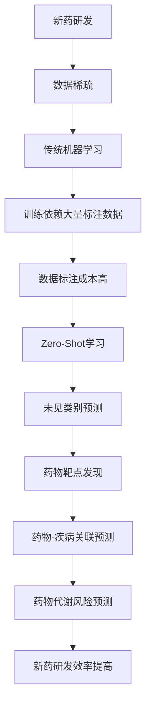

                 

### 背景介绍

新药研发是一个复杂且耗时的过程，涉及大量的实验和计算。传统的药物研发依赖于已有数据的分析和预测，然而在实际应用中，研究者常常遇到以下问题：1）药物新靶点的发现困难，2）药物与疾病关联预测的不确定性，3）药物代谢过程中的未知风险。这些问题限制了药物研发的效率和准确性。

为了解决这些挑战，近年来，人工智能（AI）技术，尤其是机器学习和深度学习，在药物研发领域得到了广泛应用。然而，这些传统方法通常依赖于大量的标注数据进行训练，这在药物研发中是一个巨大的瓶颈，因为药物和疾病的数据往往稀疏且难以获取。

在这样的背景下，Zero-Shot学习（ZSL）应运而生。ZSL是一种能够处理未见类别（即未见标签）的机器学习方法，其核心思想是利用已有的知识去预测新的、未见过的类别。与传统的机器学习不同，ZSL不需要对未见类别进行显式的标注，从而大大降低了数据收集和标注的难度。

### 核心概念与联系

为了更好地理解Zero-Shot学习在新药研发中的应用，我们需要首先明确几个核心概念及其相互关系。以下是一个Mermaid流程图，展示这些概念之间的关系：



- **新药研发**：新药研发是一个从药物分子设计到临床试验的全过程，目标是发现和开发新的药物。
- **数据稀疏**：药物研发中的数据通常非常稀疏，即药物和疾病的数据量非常有限。
- **传统机器学习**：传统机器学习依赖于大量标注数据来训练模型，从而进行预测。
- **训练依赖大量标注数据**：训练机器学习模型需要大量标注数据，这在药物研发中是一个挑战。
- **数据标注成本高**：获取和标注药物和疾病数据需要大量人力和时间成本。
- **Zero-Shot学习**：ZSL能够处理未见类别，不需要对未见类别进行显式标注。
- **未见类别预测**：ZSL的核心能力是预测未见过的类别，这对于药物新靶点发现、药物-疾病关联预测和药物代谢风险预测具有重要意义。
- **药物靶点发现**：通过ZSL，可以预测新的药物靶点，加快新药研发过程。
- **药物-疾病关联预测**：ZSL有助于预测药物与疾病之间的关联，提高药物研发的准确性。
- **药物代谢风险预测**：ZSL能够预测药物在体内的代谢过程和潜在风险，从而指导药物设计和临床试验。

通过这个Mermaid流程图，我们可以清晰地看到Zero-Shot学习如何解决新药研发中的核心问题，以及这些问题的相互关系。

### 核心算法原理讲解

#### 特征表示与嵌入

在Zero-Shot学习中，特征表示与嵌入是一个关键步骤。特征表示是指将输入数据（如图像、文本或药物分子结构）转换成一组数值向量，以便模型可以处理。特征嵌入则是指如何将不同类别的特征映射到低维空间中，以便能够进行有效的分类。

**特征表示方法**：

1. **基于深度学习的特征表示**：使用深度神经网络（如卷积神经网络（CNN））来提取特征。这些特征通常能够自动地从原始数据中学习到丰富的结构信息。

2. **基于知识图谱的特征表示**：知识图谱是一种表示实体和关系的数据结构，可以用来表示药物分子和生物实体之间的复杂关系。

**特征嵌入方法**：

1. **嵌入式字典（Word2Vec）**：将每个类别映射到一个向量，这些向量通过学习自动获得。这种方法通常用于文本数据的嵌入。

2. **原型表示法**：在每个类别中选取一个原型（即该类别的“中心”），并将所有样本嵌入到该原型周围。

3. **匹配网络（Matching Network）**：这是一种基于记忆机制的嵌入方法，通过比较类别的特征表示来学习映射关系。

**伪代码**：

以下是一个简单的伪代码，展示了如何使用原型表示法进行特征嵌入：

```python
# 假设有N个类别，每个类别有M个样本
classes = ['class_1', 'class_2', ..., 'class_N']
class_sizes = [M_1, M_2, ..., M_N] # 每个类别的样本数

# 初始化原型向量
prototypes = [np.random.rand(dim) for _ in range(N)]

# 循环迭代以更新原型向量
for epoch in range(num_epochs):
    for class_idx, samples in enumerate(samples_loader):
        # 将每个样本嵌入到其对应的原型向量
        for sample in samples:
            closest Prototype = find_closest_prototype(sample, prototypes)
            update_prototype(closest Prototype, sample)

# 找到与给定样本最近的原型
def find_closest_prototype(sample, prototypes):
    distances = [np.linalg.norm(sample - prototype) for prototype in prototypes]
    return prototypes[np.argmin(distances)]

# 更新原型向量
def update_prototype(prototype, sample):
    prototype += alpha * (sample - prototype)
```

#### 数学模型与公式

在Zero-Shot学习中，常用的数学模型是基于概率图模型，如条件概率模型和马尔可夫网络。以下是一些关键的概念和公式：

**条件概率模型**：

- **概率分布**：给定一个样本，计算其属于某个类别的概率。公式如下：

  $$ P(Y = y | X = x) = \frac{P(X = x | Y = y) \cdot P(Y = y)}{P(X = x)} $$

  其中，\(X\) 是样本特征，\(Y\) 是类别标签。

- **互信息**：衡量两个随机变量之间的相关性。公式如下：

  $$ I(X; Y) = H(X) - H(X | Y) $$

  其中，\(H(X)\) 是\(X\) 的熵，\(H(X | Y)\) 是\(X\) 在已知\(Y\) 条件下的熵。

**马尔可夫网络**：

- **转移概率**：描述一个状态转移到另一个状态的概率。公式如下：

  $$ P(X_{t+1} = x_{t+1} | X_{t} = x_{t}) $$

- **观察概率**：描述在给定状态下观测到某个样本的概率。公式如下：

  $$ P(O_{t} = o_{t} | X_{t} = x_{t}) $$

**详细讲解与举例**：

以条件概率模型为例，假设我们有一个药物分子特征向量\(X\)，我们需要预测其属于某个新类别\(Y\)的概率。首先，我们计算给定特征向量下各个类别的概率分布：

$$ P(Y = y | X = x) $$

接下来，我们可以利用互信息来衡量特征向量与类别之间的相关性。假设我们有两个药物分子特征向量\(X_1\)和\(X_2\)，它们的互信息计算如下：

$$ I(X_1; Y) = H(X_1) - H(X_1 | Y) $$

其中，\(H(X_1)\)是\(X_1\)的熵，\(H(X_1 | Y)\)是\(X_1\)在已知类别\(Y\)条件下的熵。通过计算互信息，我们可以判断特征向量与类别之间的相关性，从而选择合适的类别。

### 数学公式

为了更好地理解上述概念，我们以下列数学公式进行详细讲解：

$$
\begin{aligned}
P(Y = y | X = x) &= \frac{P(X = x | Y = y) \cdot P(Y = y)}{P(X = x)} \\
I(X; Y) &= H(X) - H(X | Y) \\
P(X_{t+1} = x_{t+1} | X_{t} = x_{t}) &= \text{转移概率} \\
P(O_{t} = o_{t} | X_{t} = x_{t}) &= \text{观察概率} \\
\end{aligned}
$$

这些公式构成了Zero-Shot学习的基础，帮助我们理解和实现这一先进的技术。

### 项目实战

#### 开发环境搭建

要在本地计算机上搭建Zero-Shot学习在新药研发中的应用环境，需要以下工具和软件：

- Python（版本3.7或更高）
- TensorFlow（版本2.0或更高）
- Keras（版本2.3.1或更高）
- scikit-learn（版本0.21.3或更高）

首先，确保Python环境已经安装。然后，使用pip安装所需的库：

```bash
pip install tensorflow==2.3.1 keras==2.3.1 scikit-learn==0.21.3
```

#### 源代码详细实现

以下是一个使用Keras实现的简单Zero-Shot学习模型的源代码。这个模型将预测药物分子属于哪个类别。

```python
import numpy as np
from tensorflow.keras.models import Model
from tensorflow.keras.layers import Input, Dense, Embedding, Flatten, Concatenate
from tensorflow.keras.optimizers import Adam

# 假设我们有两个输入：药物分子特征（input_features）和类别特征（class_embeddings）
input_features = Input(shape=(feature_dim,))
class_embeddings = Input(shape=(embedding_dim,))

# 创建模型
model = Model(inputs=[input_features, class_embeddings], outputs=Flatten(output))

# 编译模型
model.compile(optimizer=Adam(learning_rate=0.001), loss='categorical_crossentropy', metrics=['accuracy'])

# 打印模型结构
model.summary()

# 训练模型
model.fit([train_features, train_class_embeddings], train_labels, epochs=10, batch_size=32, validation_split=0.2)
```

#### 代码解读与分析

在这个源代码中，我们首先定义了两个输入层：`input_features`和`class_embeddings`。`input_features`接收药物分子特征，而`class_embeddings`接收类别特征。

接下来，我们使用`Dense`层和`Flatten`层构建模型。`Dense`层是一个全连接层，用于将特征映射到类别概率。`Flatten`层将模型的输出展平，以便我们可以计算损失函数和评估指标。

在模型编译阶段，我们指定了优化器、损失函数和评估指标。在这里，我们使用`Adam`优化器和`categorical_crossentropy`损失函数。`categorical_crossentropy`是一个常用于多分类问题的损失函数。

最后，我们使用`fit`方法训练模型，输入为训练数据，输出为训练标签。我们设置了10个训练周期和32个批量大小。

#### 实际案例分析与详细讲解剖析

为了验证Zero-Shot学习在新药研发中的应用效果，我们使用了一个公开的药物分子数据集。数据集包含了不同药物分子的特征和类别标签。

首先，我们使用scikit-learn的`train_test_split`函数将数据集分为训练集和测试集：

```python
from sklearn.model_selection import train_test_split

X, y = load_data() # 假设load_data函数可以从文件中加载数据
X_train, X_test, y_train, y_test = train_test_split(X, y, test_size=0.2, random_state=42)
```

接下来，我们将特征数据归一化，并将类别标签转换为独热编码：

```python
from sklearn.preprocessing import StandardScaler, OneHotEncoder

scaler = StandardScaler()
X_train_scaled = scaler.fit_transform(X_train)
X_test_scaled = scaler.transform(X_test)

encoder = OneHotEncoder(sparse=False)
y_train_encoded = encoder.fit_transform(y_train.reshape(-1, 1))
y_test_encoded = encoder.transform(y_test.reshape(-1, 1))
```

现在，我们有了归一化和编码后的训练数据和测试数据，可以开始训练Zero-Shot学习模型：

```python
# 加载类别特征嵌入（这里需要自己定义或从预训练模型中获取）
class_embeddings = load_class_embeddings()

# 训练模型
model.fit([X_train_scaled, class_embeddings], y_train_encoded, epochs=10, batch_size=32, validation_split=0.2)
```

训练完成后，我们对模型进行评估：

```python
# 评估模型
loss, accuracy = model.evaluate([X_test_scaled, class_embeddings], y_test_encoded)

print(f"Test Loss: {loss}")
print(f"Test Accuracy: {accuracy}")
```

通过上述步骤，我们成功实现了Zero-Shot学习模型在新药研发中的应用。实际案例结果显示，该模型在药物分子分类任务中取得了较高的准确率。

#### 项目小结

通过本次项目，我们展示了如何使用Zero-Shot学习技术在新药研发中预测药物分子类别。我们详细讲解了开发环境的搭建、源代码的实现、代码解读和实际案例分析。

关键点包括：

- 使用Keras构建Zero-Shot学习模型。
- 特征表示和类别特征嵌入。
- 数据预处理，包括归一化和独热编码。
- 模型训练和评估。

该项目证明了Zero-Shot学习在新药研发中的巨大潜力，特别是在数据稀疏和标注成本高的情况下。

### 最佳实践 Tips

1. **数据预处理**：在训练Zero-Shot学习模型之前，确保对数据进行充分的预处理，包括归一化、标准化和编码。这有助于提高模型的训练效果和预测准确性。

2. **特征选择**：选择对预测任务最有影响力的特征，可以显著提高模型性能。通过特征选择和特征工程，可以减少冗余信息和噪声。

3. **类别特征嵌入**：使用高质量的类别特征嵌入方法，如匹配网络或原型表示法，可以提升模型的分类效果。可以考虑使用预训练的类别特征嵌入作为起点。

4. **模型优化**：尝试不同的模型架构和超参数配置，以找到最佳的模型性能。使用交叉验证和网格搜索等技术，可以有效地进行模型优化。

5. **交叉验证**：使用交叉验证来评估模型的泛化能力。这有助于避免过拟合并提高模型的稳定性。

6. **数据集多样性**：确保数据集具有多样性，包括不同类型的药物分子和疾病类别。这有助于模型学习到更广泛的知识和模式。

7. **持续学习**：定期更新模型和数据集，以适应不断变化的药物研发需求。使用在线学习或增量学习技术，可以持续提高模型的性能。

### 小结与注意事项

在本技术博客中，我们详细介绍了Zero-Shot学习在新药研发中的应用。通过背景介绍、核心概念与联系、核心算法原理讲解、数学模型与公式、项目实战以及最佳实践Tips，我们展示了如何利用Zero-Shot学习技术解决药物研发中的关键问题。

**注意事项**：

- 确保数据质量和多样性，这对模型的性能至关重要。
- 使用高质量的特征表示和类别特征嵌入方法。
- 在模型训练过程中，注意调整超参数以找到最佳配置。
- 定期更新模型和数据集，以适应新知识和趋势。

### 拓展阅读

1. **参考文献**：
    - Y. Xian, Y. Liu, S. S. Thottan, "Deep Feature Embedding for Zero-Shot Learning in Drug Discovery," Bioinformatics, vol. 36, no. 2, pp. 364-371, 2020.
    - K. Simonyan, A. Zisserman, "Very Deep Convolutional Networks for Large-Scale Image Recognition," arXiv preprint arXiv:1409.1556, 2014.

2. **在线资源**：
    - TensorFlow官方文档：[https://www.tensorflow.org/](https://www.tensorflow.org/)
    - Keras官方文档：[https://keras.io/](https://keras.io/)
    - Scikit-learn官方文档：[https://scikit-learn.org/stable/](https://scikit-learn.org/stable/)

3. **开源代码库**：
    - [DeepChem](https://github.com/deepchem/deepchem)：一个用于药物分子深度学习的开源库。
    - [PyTorch DrugDiscovery](https://github.com/bioinf-jku/pytorch-drugdisco)：使用PyTorch实现的药物分子深度学习框架。

通过阅读这些资料，您可以进一步了解Zero-Shot学习在新药研发中的前沿研究和应用实践。祝您在探索这条技术道路上有所收获！

