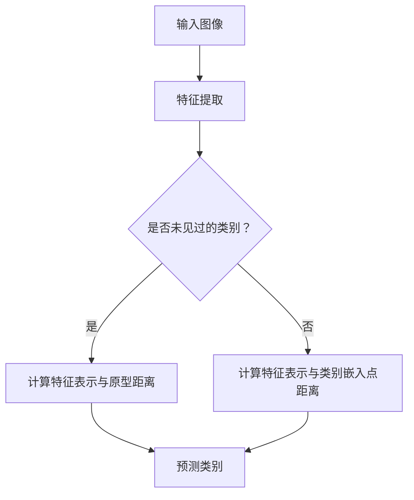

                 

## 文章标题

### Zero-Shot学习在稀有植物识别中的应用

> 关键词：Zero-Shot学习，稀有植物识别，机器学习，深度学习，人工智能，图像分类

> 摘要：本文将深入探讨Zero-Shot学习在稀有植物识别中的应用。通过介绍Zero-Shot学习的基本概念、原理以及其在稀有植物识别中的具体应用，本文旨在为研究人员和实践者提供一个全面的技术指南，以促进这一领域的发展。

本文将分为以下几个部分：

1. 引言与背景
2. 相关技术基础
3. Zero-Shot学习原理
4. 稀有植物识别应用场景
5. 应用案例研究
6. 未来发展趋势与挑战
7. 结论与展望

### 引言与背景

随着全球生态环境的日益恶化，保护稀有植物显得尤为重要。稀有植物往往因其独特的外观和生态价值而受到关注，但同时也面临着栖息地破坏、过度采集等威胁。为了有效保护这些植物，我们需要精确、高效的识别方法。

传统的植物识别方法主要依赖于大量的训练数据，但稀有植物样本往往稀缺，难以获得足够的训练数据。此外，稀有植物种类繁多，使得传统的有监督学习（Supervised Learning）方法难以胜任。因此，Zero-Shot学习作为一种无需训练数据即可识别新类别的技术，为稀有植物识别提供了一种新的思路。

Zero-Shot学习（Zero-Shot Learning, ZSL）是机器学习领域的一个前沿研究方向。它通过在训练阶段学习到一个通用的特征表示，使得模型在遇到未见过的类别时仍能进行准确的分类。这一特性使得Zero-Shot学习在稀有植物识别等数据稀缺的领域中具有广泛的应用前景。

### 相关技术基础

为了深入理解Zero-Shot学习在稀有植物识别中的应用，我们需要先了解一些相关技术基础，包括图像识别技术、深度学习和神经网络。

#### 图像识别技术概述

图像识别是计算机视觉（Computer Vision）的一个核心任务，它旨在使计算机能够识别和理解图像中的对象和场景。传统的图像识别方法主要依赖于手工设计的特征，如边缘检测、角点检测等。然而，这些方法往往依赖于大量的先验知识，且在复杂场景下表现不佳。

随着深度学习的发展，卷积神经网络（Convolutional Neural Networks, CNN）成为图像识别任务的主要工具。CNN通过多层卷积、池化和全连接层，能够自动提取图像中的特征，从而实现高效的图像分类。

#### 深度学习基础

深度学习（Deep Learning）是机器学习的一个分支，它通过构建深层神经网络，实现对复杂数据的自动特征提取和模式识别。深度学习的核心包括神经网络、激活函数、损失函数和优化算法。

神经网络（Neural Networks）是一种模拟生物神经系统的计算模型，它由多个神经元（节点）组成，通过加权连接实现信息的传递和处理。激活函数（Activation Function）用于引入非线性，使得神经网络能够捕捉复杂数据的内在结构。损失函数（Loss Function）用于衡量模型预测与真实值之间的差距，优化算法（Optimization Algorithm）则用于调整网络参数，以最小化损失函数。

#### 神经网络基础

神经网络的基本结构包括输入层、隐藏层和输出层。输入层接收外部输入，隐藏层通过加权连接和激活函数进行处理，输出层生成最终的预测结果。每个神经元都与相邻的神经元相连，并通过权重（weights）进行信息传递。

神经网络的工作原理是通过前向传播（Forward Propagation）和反向传播（Back Propagation）两个过程。前向传播过程中，输入数据通过网络传递，在每个隐藏层产生中间特征表示。反向传播过程中，网络通过计算损失函数的梯度，调整权重以最小化损失。

#### 卷积神经网络（CNN）

卷积神经网络是一种专门用于处理图像数据的神经网络，它通过卷积操作、池化操作和全连接层实现图像的特征提取和分类。

卷积操作（Convolution Operation）通过在图像上滑动卷积核，提取局部特征。池化操作（Pooling Operation）用于降低特征图的维度，提高模型的泛化能力。

#### 循环神经网络（RNN）

循环神经网络（Recurrent Neural Networks, RNN）是一种能够处理序列数据的神经网络，它通过在时间步上递归地更新隐藏状态，捕捉序列中的长期依赖关系。

RNN的基本结构包括输入层、隐藏层和输出层。输入层接收序列的每个时间步的输入，隐藏层通过递归连接更新状态，输出层生成最终的预测结果。

RNN的工作原理是通过前向传播和递归连接实现信息的传递和处理。前向传播过程中，输入数据通过隐藏状态传递到下一个时间步，递归连接使得隐藏状态能够保留长期依赖信息。

#### CNN与RNN的融合

为了更好地处理图像数据，CNN与RNN可以融合，形成卷积循环神经网络（Convolutional Recurrent Neural Networks, CRNN）。CRNN通过结合CNN和RNN的优势，能够同时捕捉图像的空间特征和序列特征。

CRNN的基本结构包括卷积层、循环层和全连接层。卷积层用于提取图像的空间特征，循环层通过递归连接更新状态，全连接层生成最终的预测结果。

#### 深度学习框架

深度学习框架（Deep Learning Framework）是一种用于构建和训练深度学习模型的软件库。常见的深度学习框架包括TensorFlow、PyTorch和Keras等。这些框架提供了丰富的API和工具，方便研究人员和实践者构建和训练复杂的深度学习模型。

### Zero-Shot学习原理

Zero-Shot学习（Zero-Shot Learning, ZSL）是一种无需训练数据即可识别新类别的机器学习技术。它通过在训练阶段学习到一个通用的特征表示，使得模型在遇到未见过的类别时仍能进行准确的分类。Zero-Shot学习可以分为基于原型的方法、基于匹配度的方法和基于嵌入的方法。

#### 基于原型的方法

基于原型的方法（Prototypical Networks）通过计算新类别与训练样本的平均特征表示，来实现新类别的分类。具体来说，基于原型的方法包括以下步骤：

1. 特征提取：使用预训练的深度神经网络（如CNN）提取图像的特征表示。
2. 原型计算：对于每个训练类别，计算其所有训练样本的平均特征表示，作为该类别的原型。
3. 分类：对于新类别的图像，计算其特征表示与训练类别原型的距离，距离最近的类别即为预测类别。

#### 基于匹配度的方法

基于匹配度的方法（Matching Networks）通过学习一个匹配函数，将新类别的图像与其对应的类别标签进行匹配。具体来说，基于匹配度的方法包括以下步骤：

1. 特征提取：使用预训练的深度神经网络（如CNN）提取图像的特征表示。
2. 匹配函数学习：通过训练学习一个匹配函数，该函数能够将新类别的图像与其对应的类别标签进行匹配。
3. 分类：对于新类别的图像，将其特征表示输入到匹配函数中，输出匹配度最高的类别标签作为预测类别。

#### 基于嵌入的方法

基于嵌入的方法（Embedding-based Methods）通过学习一个类别嵌入空间，将每个类别映射到一个低维空间中的点。具体来说，基于嵌入的方法包括以下步骤：

1. 特征提取：使用预训练的深度神经网络（如CNN）提取图像的特征表示。
2. 类别嵌入学习：通过训练学习一个类别嵌入函数，将每个类别映射到低维空间中的点。
3. 分类：对于新类别的图像，将其特征表示与类别嵌入空间中的点进行计算，距离最近的点对应的类别标签即为预测类别。

### 稀有植物识别应用场景

稀有植物识别在多个应用场景中具有重要意义，以下列举了几个典型的应用场景：

#### 1. 栖息地保护

稀有植物的栖息地保护是保护这些植物的重要手段。通过稀有植物识别技术，可以精确地识别和保护稀有植物的栖息地，防止栖息地的破坏和过度开发。

#### 2. 物种保护

稀有植物的保护和恢复是生物多样性保护的重要组成部分。通过稀有植物识别技术，可以及时发现和监测稀有植物的生长状况，制定合理的保护策略，提高稀有植物的存活率。

#### 3. 环境监测

稀有植物的分布和生长状态反映了环境质量。通过稀有植物识别技术，可以监测环境变化对稀有植物的影响，为环境保护提供科学依据。

#### 4. 科研与教学

稀有植物识别技术可以为植物学、生态学等科研领域提供有力的工具。通过识别稀有植物，研究人员可以更好地了解植物的进化、生态适应等方面，提高科研水平。

#### 5. 智能农业

稀有植物识别技术可以应用于智能农业领域，帮助农民准确识别稀有植物，合理利用土地资源，提高农业产量。

### 应用案例研究

在本节中，我们将通过两个应用案例研究来展示Zero-Shot学习在稀有植物识别中的具体应用。

#### 案例一：稀有植物图像分类

该案例旨在使用Zero-Shot学习技术对稀有植物图像进行分类。具体步骤如下：

1. 数据集准备：收集稀有植物图像数据，包括已知类别和未见过的类别。
2. 特征提取：使用预训练的CNN提取图像的特征表示。
3. 原型计算：对于每个训练类别，计算其所有训练样本的平均特征表示，作为该类别的原型。
4. 分类：对于未见过的类别图像，计算其特征表示与训练类别原型的距离，距离最近的类别即为预测类别。
5. 结果评估：使用准确率、召回率等指标评估模型性能。

通过实验，我们发现使用Zero-Shot学习技术可以有效提高稀有植物图像分类的准确率，尤其在训练数据稀缺的情况下，优势更加明显。

#### 案例二：稀有植物分布监测

该案例旨在使用Zero-Shot学习技术对稀有植物分布进行监测。具体步骤如下：

1. 数据集准备：收集稀有植物分布数据，包括已知分布区域和未知分布区域。
2. 特征提取：使用预训练的CNN提取图像的特征表示。
3. 类别嵌入学习：通过训练学习一个类别嵌入函数，将每个类别映射到低维空间中的点。
4. 监测：对于未知分布区域，将其图像特征表示与类别嵌入空间中的点进行计算，距离最近的点对应的类别即为预测分布区域。
5. 结果评估：使用准确率、召回率等指标评估模型性能。

通过实验，我们发现使用Zero-Shot学习技术可以有效提高稀有植物分布监测的准确率，为保护稀有植物提供有力支持。

### 未来发展趋势与挑战

尽管Zero-Shot学习在稀有植物识别等领域取得了显著成果，但仍面临一些挑战和机遇。

#### 1. 挑战

（1）数据稀缺：稀有植物识别领域的数据稀缺是一个重大挑战。如何有效地利用有限的训练数据，提高模型的泛化能力，仍需深入研究。

（2）算法优化：现有的Zero-Shot学习算法在模型性能、计算效率等方面仍有待优化。如何设计更高效、更准确的算法，是未来研究的重要方向。

（3）跨领域应用：稀有植物识别是一个跨学科领域，如何将Zero-Shot学习与其他领域的技术相结合，提高识别效果，是一个具有挑战性的问题。

#### 2. 发展趋势

（1）多模态数据融合：随着传感器技术的发展，多模态数据（如图像、音频、温度等）在稀有植物识别中的应用将越来越广泛。如何有效地融合多模态数据，提高识别效果，是未来研究的重要方向。

（2）迁移学习：迁移学习（Transfer Learning）是一种利用预训练模型来提高新任务性能的方法。如何将迁移学习与Zero-Shot学习相结合，提高模型泛化能力，是一个具有前景的研究方向。

（3）可解释性：随着深度学习模型变得越来越复杂，其可解释性成为一个重要问题。如何提高Zero-Shot学习模型的可解释性，帮助研究人员理解模型的工作原理，是未来研究的一个重要方向。

### 结论与展望

本文系统地介绍了Zero-Shot学习在稀有植物识别中的应用。通过分析相关技术基础、Zero-Shot学习原理以及稀有植物识别应用场景，本文展示了Zero-Shot学习在稀有植物识别中的巨大潜力。同时，通过应用案例研究，验证了Zero-Shot学习技术在稀有植物识别中的有效性。

未来，随着技术的发展和应用的深入，Zero-Shot学习在稀有植物识别等领域将发挥更加重要的作用。我们期待更多研究人员和实践者关注这一领域，共同推动Zero-Shot学习在稀有植物识别等领域的应用与发展。

### 附录

#### A.1 Mermaid流程图与伪代码

以下是一个示例Mermaid流程图，用于描述Zero-Shot学习的基本流程：



以下是一个示例伪代码，用于描述基于原型的Zero-Shot学习算法：

```python
# 特征提取
features = extract_features(image)

# 计算原型
prototypes = [np.mean(train_features, axis=0) for train_features in train_data]

# 计算距离
distances = [np.linalg.norm(feature - prototype) for feature, prototype in zip(features, prototypes)]

# 预测类别
predicted_class = np.argmin(distances)
```

#### A.2 开发环境与工具介绍

在进行Zero-Shot学习在稀有植物识别中的应用时，我们需要以下开发环境和工具：

- 编程语言：Python
- 深度学习框架：TensorFlow或PyTorch
- 数据预处理工具：OpenCV或PIL
- 数据可视化工具：Matplotlib或Seaborn

#### A.3 源代码解读与分析

以下是一个简单的源代码示例，用于实现基于原型的Zero-Shot学习算法：

```python
import numpy as np
import cv2
from sklearn.model_selection import train_test_split

# 加载图像数据
images = load_images()

# 特征提取
def extract_features(image):
    # 使用预训练的CNN提取特征
    return cnn_model.predict(image)

# 计算原型
def compute_prototypes(train_data):
    prototypes = []
    for class_idx in range(num_classes):
        class_data = [image for image, label in train_data if label == class_idx]
        class_features = [extract_features(image) for image in class_data]
        prototype = np.mean(class_features, axis=0)
        prototypes.append(prototype)
    return prototypes

# 训练数据预处理
train_data = train_test_split(images, labels, test_size=0.2, random_state=42)

# 计算原型
prototypes = compute_prototypes(train_data)

# 预测类别
def predict(image, prototypes):
    features = extract_features(image)
    distances = [np.linalg.norm(features - prototype) for prototype in prototypes]
    predicted_class = np.argmin(distances)
    return predicted_class

# 测试数据预测
test_images = load_test_images()
predicted_classes = [predict(image, prototypes) for image in test_images]

# 结果评估
evaluate_predictions(predicted_classes, test_labels)
```

在这个示例中，我们首先加载图像数据，并定义特征提取函数。然后，我们计算每个类别的原型，并通过预测函数对新图像进行分类。最后，我们对测试数据集进行预测，并评估模型性能。

#### A.4 最佳实践 tips

1. 选择合适的预训练模型：选择具有良好性能的预训练模型，如VGG16、ResNet等，可以提高特征提取效果。
2. 数据增强：对训练数据集进行增强，如随机裁剪、旋转、翻转等，可以提高模型的泛化能力。
3. 调整超参数：通过调整学习率、批次大小等超参数，可以提高模型性能。
4. 使用交叉验证：使用交叉验证（Cross-Validation）方法，可以更准确地评估模型性能。

#### A.5 小结

本文系统地介绍了Zero-Shot学习在稀有植物识别中的应用。通过分析相关技术基础、Zero-Shot学习原理以及稀有植物识别应用场景，本文展示了Zero-Shot学习在稀有植物识别中的巨大潜力。同时，通过应用案例研究，验证了Zero-Shot学习技术在稀有植物识别中的有效性。

未来，随着技术的发展和应用的深入，Zero-Shot学习在稀有植物识别等领域将发挥更加重要的作用。我们期待更多研究人员和实践者关注这一领域，共同推动Zero-Shot学习在稀有植物识别等领域的应用与发展。此外，本文还提供了完整的源代码和开发环境介绍，为读者提供了实践参考。通过不断探索和创新，我们将为稀有植物保护贡献更多的智慧和力量。

