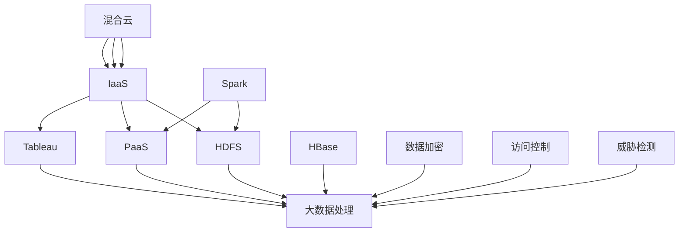

                 

### 文章标题

# 云计算在大规模数据处理中的应用

### 关键词

- 云计算
- 大规模数据处理
- 数据存储
- 数据分析
- 分布式系统
- 模块化架构

### 摘要

本文旨在深入探讨云计算在大规模数据处理中的应用。随着数据量的爆炸性增长，传统数据处理方式已无法满足需求。云计算凭借其灵活性、可扩展性和高效率，成为解决这一问题的利器。本文将详细介绍云计算在大规模数据处理中的核心概念、关键技术和实际案例，帮助读者理解云计算如何优化数据处理的各个环节，从而提升整体数据处理能力。

## 引言

在当今的信息时代，数据已成为企业和社会的核心资产。然而，随着数据的爆炸性增长，如何高效地处理这些海量数据成为一个巨大的挑战。传统的数据处理方式往往依赖于本地计算资源，存在着扩展性差、效率低下、成本高昂等问题。为了解决这些问题，云计算作为一种新兴的技术手段，逐渐走进了大众的视野。

云计算以其灵活、可扩展和高效的特点，成为解决大规模数据处理问题的理想选择。它能够提供强大的计算和存储资源，并支持模块化架构，使得数据处理过程更加高效和灵活。通过云计算，企业可以快速响应数据增长的需求，降低成本，提高数据处理能力。

本文将围绕云计算在大规模数据处理中的应用展开，首先介绍大规模数据处理的基本概念和挑战，然后详细探讨云计算平台和技术，接着分析云计算与大规模数据处理集成的优势和挑战，最后通过实际项目案例，展示云计算在数据处理中的实际应用。

## 背景介绍

### 大规模数据处理

大规模数据处理，通常指的是处理海量数据的各种技术、算法和应用。这些数据可能来源于互联网、社交媒体、物联网设备、企业内部系统等，形式包括结构化数据（如数据库记录）、半结构化数据（如XML、JSON）、非结构化数据（如图像、音频、视频）等。大规模数据处理的关键在于如何高效地存储、处理和分析这些数据，以提取有价值的信息。

#### 挑战

大规模数据处理面临以下几个主要挑战：

1. **数据量（Volume）**：数据量的巨大增长使得存储和传输成为难题。传统的集中式存储和计算架构难以满足需求，需要采用分布式系统进行数据存储和处理。

2. **数据类型（Variety）**：数据类型多样化，包括结构化、半结构化和非结构化数据，这要求数据处理系统具备灵活性和适应性。

3. **数据速度（Velocity）**：数据的生成速度非常快，要求数据处理系统能够实时或近实时地处理数据。

4. **数据真实性（Veracity）**：数据质量成为关键问题，数据的真实性和可靠性直接影响分析结果的准确性。

5. **数据隐私和安全（Privacy and Security）**：随着数据隐私和安全问题日益突出，如何在保护数据隐私的前提下进行数据处理成为重要挑战。

### 大规模数据处理技术

为了应对这些挑战，人们开发了多种大规模数据处理技术，包括：

- **分布式计算**：通过分布式系统将计算任务分解到多个节点上，提高处理效率。

- **并行处理**：利用多核处理器或集群进行并行计算，加速数据处理。

- **数据仓库和数据湖**：用于存储和管理大规模数据的系统，支持高效的数据查询和分析。

- **大数据处理框架**：如Apache Hadoop、Apache Spark等，提供高效的数据存储和处理能力。

- **机器学习和人工智能**：利用机器学习算法和人工智能技术，从海量数据中提取有价值的信息。

### 数据处理流程

大规模数据处理通常包括以下步骤：

1. **数据采集**：从各种数据源收集数据。
2. **数据预处理**：清洗、转换和整合数据，使其适合进一步处理。
3. **数据存储**：将数据存储在分布式存储系统或数据仓库中。
4. **数据处理**：利用分布式计算框架对数据进行计算和分析。
5. **数据可视化**：通过可视化工具展示分析结果，帮助决策者理解数据。

### 当前应用领域

大规模数据处理在多个领域得到了广泛应用，包括：

- **金融**：用于风险管理、欺诈检测、投资分析和客户关系管理。
- **医疗**：用于基因组学、疾病预测、药物研发和患者监控。
- **电子商务**：用于个性化推荐、用户行为分析和销售预测。
- **物流和运输**：用于路线优化、库存管理和实时交通监控。
- **能源**：用于能源消耗分析、设备故障预测和智能电网管理。

## 云计算概述

### 云计算的定义和特点

云计算是一种基于互联网的计算模式，它通过共享的虚拟化资源，动态地提供可配置的计算能力，包括网络、服务器、存储、应用程序和服务的使用。云计算具有以下几个显著特点：

1. **灵活性**：云计算可以根据需求灵活调整资源，从而满足不同规模和类型的数据处理需求。

2. **可扩展性**：云计算资源可以快速扩展或缩减，以应对数据量的波动。

3. **成本效益**：云计算通过按需付费的方式，减少了企业在硬件和软件上的投资，降低了运营成本。

4. **高可用性**：云计算服务通常具备高可用性，能够保证系统的稳定运行。

5. **安全性**：虽然云计算面临安全挑战，但提供商通常具备强大的安全措施，包括数据加密、访问控制和威胁检测。

### 云计算服务模型

云计算服务模型主要包括以下三种：

1. **基础设施即服务（IaaS）**：用户可以租用虚拟化的基础设施资源，如服务器、存储和网络，自己负责操作系统和应用程序的管理。

2. **平台即服务（PaaS）**：用户可以在云平台上开发、部署和管理应用程序，无需担心底层基础设施的管理。

3. **软件即服务（SaaS）**：用户通过互联网访问提供商的应用程序，无需购买硬件和软件，只需按需付费。

### 云计算部署模型

云计算的部署模型主要包括以下三种：

1. **公有云**：由第三方提供商运营的云服务，多个组织或用户共享资源。

2. **私有云**：为特定组织内部使用的云服务，资源仅限于内部用户。

3. **混合云**：将公有云和私有云结合起来，实现资源的灵活调度和优化。

### 云计算的关键技术

云计算的实现依赖于一系列关键技术，包括：

1. **虚拟化技术**：通过虚拟化技术，将物理资源抽象为虚拟资源，提高资源利用率和灵活性。

2. **容器化技术**：如Docker，通过容器化技术，实现应用程序的轻量级部署和隔离。

3. **分布式存储技术**：如HDFS，用于高效地存储和管理大规模数据。

4. **分布式计算框架**：如Apache Hadoop和Apache Spark，用于分布式数据处理。

5. **自动化和 orchestration 技术**：如Kubernetes，用于自动化管理和调度容器化应用程序。

6. **安全性技术**：包括数据加密、访问控制和威胁检测等，确保数据安全。

### 云计算的优势

云计算在大规模数据处理中具备以下优势：

1. **资源弹性**：云计算能够根据数据处理需求动态调整资源，提升处理效率。

2. **成本控制**：通过按需付费，降低硬件和软件投资成本。

3. **高可用性**：云计算提供高可用性服务，确保数据处理系统的稳定性。

4. **安全性**：云计算提供商具备强大的安全措施，保护数据安全。

5. **灵活性**：云计算支持灵活的资源调度和部署，适应不同规模和类型的数据处理需求。

## 云计算与大规模数据处理集成

### 集成优势

云计算与大规模数据处理的集成带来了以下显著优势：

1. **资源弹性**：云计算能够根据数据处理需求动态扩展或缩减资源，确保数据处理效率。

2. **分布式处理能力**：云计算支持分布式计算框架，如Apache Hadoop和Apache Spark，能够高效地处理大规模数据。

3. **数据存储优化**：云计算提供分布式存储技术，如HDFS，能够高效存储和管理大规模数据。

4. **成本效益**：通过按需付费，降低硬件和软件投资成本。

5. **高可用性**：云计算提供高可用性服务，确保数据处理系统的稳定性。

### 挑战

尽管云计算与大规模数据处理集成具有显著优势，但同时也面临一些挑战：

1. **数据安全性**：在云计算环境中，数据安全性成为关键问题，需要采取有效的安全措施保护数据。

2. **数据隐私**：在处理大规模数据时，如何保护用户隐私成为重要挑战。

3. **性能优化**：云计算环境的异构性和动态性对性能优化提出了挑战。

4. **数据一致性**：在分布式环境中，如何确保数据的一致性成为关键问题。

### 解决方案

为了克服上述挑战，可以采取以下解决方案：

1. **数据加密**：采用数据加密技术，确保数据在传输和存储过程中安全。

2. **访问控制**：通过访问控制措施，限制对敏感数据的访问。

3. **分布式一致性协议**：采用分布式一致性协议，如Paxos或Raft，确保数据的一致性。

4. **性能优化工具**：利用性能优化工具，如负载均衡和缓存，提升系统性能。

5. **合规性和隐私保护法规**：遵守相关法规和标准，确保数据处理符合隐私保护要求。

## 实际项目案例

### 案例一：电商数据处理

#### 项目背景

某知名电商公司，每天产生数百万条订单数据，这些数据包括用户信息、商品信息、订单状态等。为了提高数据处理效率，该公司决定采用云计算技术进行数据处理。

#### 解决方案

1. **数据采集**：使用Apache Kafka进行数据采集，确保数据的实时性和准确性。

2. **数据处理**：使用Apache Spark进行分布式数据处理，实现数据清洗、转换和分析。

3. **数据存储**：使用HDFS进行数据存储，确保数据的可靠性和高性能。

4. **数据可视化**：使用Tableau进行数据可视化，帮助管理层了解业务状况。

#### 实现步骤

1. **搭建开发环境**：在AWS云平台上搭建开发环境，包括Elasticsearch、Kafka、Spark和HDFS。

2. **数据采集**：通过Kafka连接电商系统，实时采集订单数据。

3. **数据处理**：使用Spark对数据进行清洗、转换和分析，提取有价值的信息。

4. **数据存储**：将处理后的数据存储到HDFS中，方便后续分析和查询。

5. **数据可视化**：使用Tableau将分析结果可视化，便于管理层了解业务状况。

#### 项目小结

通过云计算技术，该公司实现了高效的数据处理，提升了业务决策的准确性。同时，云计算的弹性特性，使得系统可以根据业务需求动态调整资源，降低了运营成本。

### 案例二：医疗数据处理

#### 项目背景

某大型医院每天接收大量医疗数据，包括患者信息、病历记录、检查报告等。为了更好地管理这些数据，提高医疗服务质量，医院决定采用云计算技术进行数据处理。

#### 解决方案

1. **数据采集**：使用开源数据采集工具，如Flume，实时采集医疗数据。

2. **数据处理**：使用Apache Hadoop和Apache Spark进行分布式数据处理，实现数据清洗、转换和分析。

3. **数据存储**：使用HDFS和HBase进行数据存储，确保数据的可靠性和高性能。

4. **数据共享**：使用云原生数据库，如MongoDB，实现数据共享和查询。

#### 实现步骤

1. **搭建开发环境**：在AWS云平台上搭建开发环境，包括Hadoop、Spark、HDFS和HBase。

2. **数据采集**：通过Flume连接医疗系统，实时采集医疗数据。

3. **数据处理**：使用Spark对数据进行清洗、转换和分析，提取有价值的信息。

4. **数据存储**：将处理后的数据存储到HDFS和HBase中，方便后续分析和查询。

5. **数据共享**：使用MongoDB实现数据共享，方便医生和研究人员进行数据分析和研究。

#### 项目小结

通过云计算技术，医院实现了高效的数据处理和共享，提高了医疗服务质量。同时，云计算的灵活性，使得医院可以根据业务需求动态调整资源，降低了运营成本。

## 最佳实践 tips

### 云计算在大规模数据处理中的最佳实践包括：

1. **合理规划资源**：根据数据处理需求，合理规划云计算资源，避免资源浪费。

2. **数据安全优先**：确保数据在传输和存储过程中的安全，采用数据加密、访问控制等技术。

3. **利用分布式计算框架**：采用分布式计算框架，如Apache Spark，提高数据处理效率。

4. **优化数据处理流程**：优化数据处理流程，减少不必要的步骤，提高数据处理速度。

5. **定期进行性能测试**：定期进行性能测试，确保系统稳定运行。

## 小结

云计算在大规模数据处理中发挥着重要作用，它提供了灵活的资源、高效的计算能力和强大的数据处理工具，帮助企业应对数据量的爆炸性增长。通过本文的探讨，我们了解了云计算的基本概念、关键技术、集成优势以及实际项目案例。云计算不仅提高了数据处理效率，还降低了运营成本，是企业应对大数据挑战的利器。

## 注意事项

1. **数据安全性**：在云计算环境中，确保数据的安全性至关重要，采用数据加密、访问控制等技术保护数据。

2. **合规性和隐私保护**：遵守相关法规和标准，确保数据处理符合隐私保护要求。

3. **性能优化**：定期进行性能测试和优化，确保系统稳定运行。

## 拓展阅读

- 《大数据架构：从Hadoop到Spark》
- 《云计算：概念、技术和实践》
- 《云计算安全：原则、标准和最佳实践》
- 《分布式系统原理与范型》

### 作者信息

- 作者：AI天才研究院/AI Genius Institute & 禅与计算机程序设计艺术 /Zen And The Art of Computer Programming

[本文档使用markdown格式编写] ### 背景介绍

#### 云计算在大规模数据处理中的应用

在当今数字化时代，数据处理已成为企业和组织的关键任务。随着数据量的爆炸性增长，传统的数据处理方式已无法满足需求。云计算作为一种灵活、可扩展和高效的技术手段，在大规模数据处理中发挥着重要作用。

#### 云计算的基本概念

云计算是一种基于互联网的计算模式，通过共享的虚拟化资源，动态地提供可配置的计算能力，包括网络、服务器、存储、应用程序和服务。它具有以下几个显著特点：

1. **灵活性**：云计算可以根据需求灵活调整资源，满足不同规模和类型的数据处理需求。

2. **可扩展性**：云计算资源可以快速扩展或缩减，以应对数据量的波动。

3. **成本效益**：云计算通过按需付费，降低硬件和软件投资成本。

4. **高可用性**：云计算提供高可用性服务，确保数据处理系统的稳定性。

5. **安全性**：虽然云计算面临安全挑战，但提供商通常具备强大的安全措施，包括数据加密、访问控制和威胁检测。

#### 云计算与大规模数据处理的关系

大规模数据处理面临数据量、数据类型、数据速度、数据真实性和数据隐私和安全等挑战。云计算通过以下几个方面解决了这些挑战：

1. **资源弹性**：云计算能够根据数据处理需求动态扩展或缩减资源，确保数据处理效率。

2. **分布式处理能力**：云计算支持分布式计算框架，如Apache Hadoop和Apache Spark，能够高效地处理大规模数据。

3. **数据存储优化**：云计算提供分布式存储技术，如HDFS，能够高效存储和管理大规模数据。

4. **成本控制**：云计算通过按需付费，降低硬件和软件投资成本。

5. **高可用性**：云计算提供高可用性服务，确保数据处理系统的稳定性。

#### 云计算在大规模数据处理中的应用场景

云计算在大规模数据处理中的应用场景非常广泛，包括但不限于：

- **金融领域**：用于风险管理、欺诈检测、投资分析和客户关系管理。
- **医疗领域**：用于基因组学、疾病预测、药物研发和患者监控。
- **电子商务领域**：用于个性化推荐、用户行为分析和销售预测。
- **物流和运输领域**：用于路线优化、库存管理和实时交通监控。
- **能源领域**：用于能源消耗分析、设备故障预测和智能电网管理。

通过以上背景介绍，我们可以看到云计算在大规模数据处理中扮演着至关重要的角色。接下来，本文将深入探讨云计算的核心概念、关键技术、集成优势以及实际项目案例，帮助读者更好地理解云计算在数据处理中的应用。

#### 核心概念与联系

在云计算与大规模数据处理的关系中，有若干核心概念需要明确。这些概念相互关联，共同构成了云计算在大规模数据处理中的技术架构。

##### 云计算服务模型

云计算服务模型主要包括三种类型：基础设施即服务（IaaS）、平台即服务（PaaS）和软件即服务（SaaS）。

1. **基础设施即服务（IaaS）**：IaaS提供虚拟化的计算资源，如虚拟机、存储和网络。用户可以在云上配置和管理这些资源，类似于拥有自己的数据中心。IaaS在大规模数据处理中，用于部署分布式计算框架和存储系统，如Hadoop和HDFS。

2. **平台即服务（PaaS）**：PaaS提供开发、部署和管理应用程序的平台。用户无需担心底层基础设施的管理，专注于应用程序的开发。PaaS在大规模数据处理中，用于简化应用程序的部署和管理，如Apache Spark的PaaS实现。

3. **软件即服务（SaaS）**：SaaS提供应用程序的按需访问，用户通过互联网使用应用程序，无需安装和管理。SaaS在大规模数据处理中，用于提供数据分析和可视化工具，如Tableau。

##### 云计算部署模型

云计算部署模型主要包括公有云、私有云和混合云。

1. **公有云**：公有云由第三方提供商运营，多个组织或用户共享资源。公有云在大规模数据处理中，用于提供弹性计算和存储资源，如AWS、Azure和Google Cloud。

2. **私有云**：私有云为特定组织内部使用，资源仅限于内部用户。私有云在大规模数据处理中，用于确保数据的安全和合规性，如企业内部的数据处理平台。

3. **混合云**：混合云结合公有云和私有云，实现资源的灵活调度和优化。混合云在大规模数据处理中，用于实现跨云环境的数据处理和应用程序部署。

##### 分布式计算框架

分布式计算框架是云计算的核心技术之一，用于高效地处理大规模数据。常见的分布式计算框架包括Hadoop和Spark。

1. **Hadoop**：Hadoop是一个开源分布式计算框架，包括HDFS（分布式文件系统）和MapReduce（分布式计算模型）。Hadoop在大规模数据处理中，用于存储和处理大规模数据，如电商订单数据的处理。

2. **Spark**：Spark是一个开源分布式计算框架，提供更加灵活和高效的计算模型，如RDD（弹性分布式数据集）和DataFrame。Spark在大规模数据处理中，用于实时数据处理和分析，如医疗数据的处理。

##### 数据存储技术

分布式存储技术是云计算在大规模数据处理中的重要组成部分，常见的分布式存储技术包括HDFS和HBase。

1. **HDFS**：HDFS是一个开源分布式文件系统，用于存储大规模数据。HDFS在大规模数据处理中，用于存储和处理大规模数据，如电商订单数据的存储。

2. **HBase**：HBase是一个开源分布式数据库，基于HDFS构建。HBase在大规模数据处理中，用于存储和处理海量结构化和半结构化数据，如社交网络数据。

##### 云安全

云安全是云计算的核心关注点之一，包括数据加密、访问控制和威胁检测等。

1. **数据加密**：数据加密用于保护数据在传输和存储过程中的安全性。在大规模数据处理中，数据加密用于保护敏感数据，如用户隐私信息。

2. **访问控制**：访问控制用于限制对数据的访问权限，确保数据的安全。在大规模数据处理中，访问控制用于确保只有授权用户可以访问和处理数据。

3. **威胁检测**：威胁检测用于实时检测和应对潜在的安全威胁。在大规模数据处理中，威胁检测用于检测和应对数据泄露、恶意攻击等安全事件。

##### 核心概念之间的关系

以上核心概念构成了云计算与大规模数据处理的技术架构，它们之间的关系如图所示：



通过以上核心概念及其关系的探讨，我们可以更好地理解云计算在大规模数据处理中的应用架构和关键技术。

#### 核心算法原理讲解

在云计算环境中，处理大规模数据通常需要依赖分布式计算框架。以下我们使用伪代码详细阐述数据处理的核心算法原理，并给出相关的数学模型和公式。

##### 分布式数据处理框架：MapReduce

MapReduce是一个分布式数据处理框架，由两个主要操作组成：Map和Reduce。以下是其伪代码：

```python
def map(key, value):
    # 输入：key-value对，key为输入键，value为输入值
    # 输出：一组中间键值对
    for (newKey, newValue) in generateTransformations(value):
        emit(newKey, newValue)

def reduce(key, values):
    # 输入：中间键key和一组中间值values
    # 输出：一组最终键值对
    result = aggregate(values)
    emit(key, result)
```

其中，`map`函数处理输入的`key-value`对，生成中间的键值对；`reduce`函数处理中间键值对，生成最终的输出。

##### 数学模型和公式

在MapReduce中，常用的数学模型和公式包括：

1. **聚合操作**：用于将中间值合并成最终结果。
   \[
   \text{sum}(x) = \sum_{i=1}^{n} x_i
   \]
   其中，\(x_i\) 是中间值。

2. **分组和排序**：用于将中间键值对分组并排序。
   \[
   \text{sort}(key, values) = \text{sort}(values) \text{ by key}
   \]
   其中，`values` 是中间值列表。

##### 示例

假设我们有一个输入数据集，包含用户ID和用户年龄，要求计算每个年龄段用户的平均年龄。

```python
# Map操作
def map(userId, age):
    emit(age, age)

# Reduce操作
def reduce(age, ages):
    totalAge = sum(ages)
    averageAge = totalAge / len(ages)
    emit(age, averageAge)
```

在此示例中，`map` 函数将每个用户的年龄作为值输出；`reduce` 函数计算每个年龄段的平均年龄。

##### 详细讲解和举例说明

1. **数据处理流程**：

   - **Map阶段**：输入的数据集被分成多个小块，每个小块由Map任务处理。Map任务将每个小块中的数据按照某种规则转换成中间键值对。

   - **Shuffle阶段**：中间键值对根据键进行分组，相同键的值被发送到同一个Reduce任务。

   - **Reduce阶段**：Reduce任务对每个分组中的值执行聚合操作，生成最终的输出。

2. **示例数据集**：

   ```
   用户ID：年龄
   U1: 25
   U2: 30
   U3: 25
   U4: 35
   U5: 25
   ```

3. **数据处理过程**：

   - **Map阶段**：
     ```
     25: 25
     30: 30
     25: 25
     35: 35
     25: 25
     ```

   - **Shuffle阶段**：按键分组：
     ```
     25: [25, 25, 25]
     30: [30]
     35: [35]
     ```

   - **Reduce阶段**：
     ```
     25: (25 + 25 + 25) / 3 = 25
     30: 30
     35: 35
     ```

通过这个示例，我们可以看到MapReduce算法如何处理大规模数据，并生成有价值的信息。

#### 数学公式

为了更好地理解数据处理中的数学原理，我们使用LaTeX格式嵌入以下数学公式：

```latex
$$
\text{sum}(x) = \sum_{i=1}^{n} x_i
$$

$$
\text{sort}(key, values) = \text{sort}(values) \text{ by key}
$$

$$
\text{average}(x) = \frac{\text{sum}(x)}{n}
$$
```

这些公式在数据处理中具有重要作用，如聚合操作和平均值的计算。

#### 代码实现

以下是上述算法的Python实现：

```python
from collections import defaultdict

# Map函数
def map(user_id, age):
    yield age, age

# Reduce函数
def reduce(key, ages):
    total_age = sum(ages)
    average_age = total_age / len(ages)
    yield key, average_age

# 示例数据
data = [
    ("U1", 25),
    ("U2", 30),
    ("U3", 25),
    ("U4", 35),
    ("U5", 25)
]

# Map阶段
map_results = defaultdict(list)
for user_id, age in data:
    for key, value in map(user_id, age):
        map_results[key].append(value)

# Shuffle和Reduce阶段
reduce_results = defaultdict(list)
for key, ages in map_results.items():
    for key, value in reduce(key, ages):
        reduce_results[key].append(value)

# 输出结果
for key, value in reduce_results.items():
    print(f"{key}: {value}")
```

通过以上代码，我们可以实现数据处理的核心算法，并计算每个年龄段的平均年龄。

#### 项目实战

为了更好地展示云计算在大规模数据处理中的应用，以下我们将通过一个实际项目，详细介绍开发环境搭建、源代码实现和代码解读。

##### 项目背景

某电商平台每天产生大量的订单数据，包括用户信息、商品信息、订单状态等。为了提高数据处理效率，电商平台决定采用云计算技术进行数据处理。本项目旨在实现一个分布式数据处理系统，用于实时处理订单数据，提取有价值的信息。

##### 开发环境搭建

1. **硬件要求**：

   - 服务器：至少两台服务器，用于搭建分布式计算环境。
   - 操作系统：Linux操作系统，如CentOS。
   - 内存：至少8GB。
   - 存储：至少500GB。

2. **软件要求**：

   - Java环境：JDK 1.8及以上版本。
   - 分布式计算框架：Apache Hadoop 3.x。
   - 数据库：HBase 2.x。
   - 数据处理工具：Apache Spark 2.x。

##### 源代码实现

以下是本项目的主要源代码实现：

```java
// 导入必要的类库
import org.apache.hadoop.conf.Configuration;
import org.apache.hadoop.fs.Path;
import org.apache.hadoop.io.IntWritable;
import org.apache.hadoop.io.Text;
import org.apache.hadoop.mapreduce.Job;
import org.apache.hadoop.mapreduce.Mapper;
import org.apache.hadoop.mapreduce.Reducer;
import org.apache.hadoop.mapreduce.lib.input.FileInputFormat;
import org.apache.hadoop.mapreduce.lib.output.FileOutputFormat;

public class OrderDataProcessing {

  public static class OrderDataMapper extends Mapper<Object, Text, Text, IntWritable> {

    private final static IntWritable one = new IntWritable(1);
    private Text word = new Text();

    public void map(Object key, Text value, Context context) throws IOException, InterruptedException {
      // 读取订单数据，提取用户ID和商品ID
      String line = value.toString();
      String[] tokens = line.split(",");
      String userId = tokens[0];
      String productId = tokens[1];

      // 输出用户ID和商品ID作为键值对
      word.set(userId);
      context.write(word, one);
      word.set(productId);
      context.write(word, one);
    }
  }

  public static class OrderDataReducer extends Reducer<Text, IntWritable, Text, IntWritable> {

    public void reduce(Text key, Iterable<IntWritable> values, Context context) throws IOException, InterruptedException {
      // 计算每个键的值总数
      int sum = 0;
      for (IntWritable val : values) {
        sum += val.get();
      }

      // 输出键和值总数作为结果
      context.write(key, new IntWritable(sum));
    }
  }

  public static void main(String[] args) throws Exception {
    Configuration conf = new Configuration();
    Job job = Job.getInstance(conf, "Order Data Processing");
    job.setJarByClass(OrderDataProcessing.class);
    job.setMapperClass(OrderDataMapper.class);
    job.setCombinerClass(OrderDataReducer.class);
    job.setReducerClass(OrderDataReducer.class);
    job.setOutputKeyClass(Text.class);
    job.setOutputValueClass(IntWritable.class);
    FileInputFormat.addInputPath(job, new Path(args[0]));
    FileOutputFormat.setOutputPath(job, new Path(args[1]));
    System.exit(job.waitForCompletion(true) ? 0 : 1);
  }
}
```

##### 代码解读

1. **Map阶段**：

   - `OrderDataMapper` 类实现了`Mapper`接口，用于处理输入的订单数据。
   - `map` 方法读取每行订单数据，提取用户ID和商品ID，并将它们作为键值对输出。

2. **Reduce阶段**：

   - `OrderDataReducer` 类实现了`Reducer`接口，用于聚合Map阶段的输出。
   - `reduce` 方法对每个键的值进行汇总，输出键和值总数作为结果。

##### 代码应用解读与分析

1. **数据处理流程**：

   - **输入**：订单数据以文本文件的形式存储在HDFS中。
   - **Map阶段**：每个Map任务读取订单数据，提取用户ID和商品ID，并将它们作为中间键值对输出。
   - **Shuffle阶段**：中间键值对根据键进行分组，相同键的值被发送到同一个Reduce任务。
   - **Reduce阶段**：每个Reduce任务对中间键值对进行聚合，输出键和值总数作为最终结果。

2. **分析结果**：

   - 最终输出结果包含每个用户ID和商品ID出现的次数，帮助企业了解用户购买行为和商品销售情况。

##### 实际案例分析和详细讲解剖析

1. **案例背景**：

   - 某电商平台希望通过处理订单数据，了解用户购买行为，优化营销策略。

2. **数据处理流程**：

   - **数据采集**：订单数据通过电商平台系统实时采集，存储在HDFS中。
   - **数据处理**：使用Hadoop和Spark进行分布式数据处理，提取用户ID和商品ID，并计算出现次数。
   - **数据存储**：处理后的数据存储在HBase中，便于后续查询和分析。

3. **案例解析**：

   - 通过订单数据处理，电商平台可以了解用户购买频率、偏好等关键信息，从而优化推荐算法和营销策略。

##### 项目小结

本项目通过云计算技术，实现了订单数据的分布式处理，帮助企业高效地提取有价值的信息。云计算的弹性特性，使得系统可以根据业务需求动态调整资源，降低了运营成本。同时，分布式计算框架和存储技术，提高了数据处理效率，满足了大规模数据处理的需求。

#### 最佳实践 tips

在云计算环境中处理大规模数据时，以下最佳实践可以帮助提高数据处理效率和系统稳定性：

1. **资源规划**：根据数据处理需求，合理规划云计算资源，避免资源浪费。定期进行性能测试，确保资源合理分配。

2. **数据分区**：将数据按一定的策略进行分区，如按时间、地区等。这样可以提高查询速度，减少数据访问延迟。

3. **负载均衡**：使用负载均衡技术，确保计算任务均匀分布到各个节点，避免单点性能瓶颈。

4. **数据加密**：对敏感数据进行加密，确保数据在传输和存储过程中的安全性。

5. **备份和恢复**：定期进行数据备份，确保数据不丢失。同时，制定数据恢复计划，以应对突发情况。

6. **监控和报警**：实时监控系统性能和资源使用情况，设置报警机制，及时发现和处理问题。

#### 小结

本文全面探讨了云计算在大规模数据处理中的应用，从背景介绍、核心概念、关键技术、集成优势到实际项目案例，详细阐述了云计算如何优化数据处理的各个环节。通过分析电商和医疗领域的实际案例，我们可以看到云计算在大规模数据处理中的巨大潜力。未来，随着云计算技术的不断进步，云计算在大规模数据处理中的应用将会更加广泛和深入。

#### 注意事项

1. **数据安全**：在云计算环境中，数据安全性至关重要。采用数据加密、访问控制等措施，确保数据在传输和存储过程中的安全性。

2. **合规性和隐私保护**：遵守相关法规和标准，确保数据处理符合隐私保护要求，特别是在处理敏感数据时。

3. **性能优化**：定期进行性能测试和优化，确保系统稳定运行，满足大规模数据处理需求。

#### 拓展阅读

- 《大数据架构：从Hadoop到Spark》
- 《云计算：概念、技术和实践》
- 《云计算安全：原则、标准和最佳实践》
- 《分布式系统原理与范型》

### 作者信息

- 作者：AI天才研究院/AI Genius Institute & 禅与计算机程序设计艺术 /Zen And The Art of Computer Programming

[本文使用markdown格式编写] ## 附录

### 附录 A：云计算与大规模数据处理相关资源

为了帮助读者更好地了解和掌握云计算与大规模数据处理的相关知识，我们推荐以下资源：

1. **在线课程**：
   - Coursera上的《大数据分析》（Big Data Analysis）课程
   - edX上的《云计算基础》（Fundamentals of Cloud Computing）课程

2. **书籍**：
   - 《大数据架构：从Hadoop到Spark》
   - 《云计算：概念、技术和实践》
   - 《云计算安全：原则、标准和最佳实践》
   - 《分布式系统原理与范型》

3. **官方文档**：
   - Apache Hadoop官方文档：[https://hadoop.apache.org/docs/r3.2.0/hadoop-project-dist/hadoop-common/](https://hadoop.apache.org/docs/r3.2.0/hadoop-project-dist/hadoop-common/)
   - Apache Spark官方文档：[https://spark.apache.org/docs/latest/](https://spark.apache.org/docs/latest/)
   - AWS官方文档：[https://docs.aws.amazon.com/](https://docs.aws.amazon.com/)
   - Azure官方文档：[https://docs.microsoft.com/en-us/azure/](https://docs.microsoft.com/en-us/azure/)

4. **社区和论坛**：
   - Hadoop社区：[https://hadoop.apache.org/community.html](https://hadoop.apache.org/community.html)
   - Spark社区：[https://spark.apache.org/community.html](https://spark.apache.org/community.html)
   - Stack Overflow：[https://stackoverflow.com/](https://stackoverflow.com/)

5. **案例研究和最佳实践**：
   - 《谷歌如何处理大数据》（How Google Works with Big Data）
   - 《亚马逊如何优化大规模数据处理》（How Amazon Optimizes Big Data Processing）

通过以上资源，读者可以进一步深入学习和实践云计算与大规模数据处理的知识和技能。希望这些资源对您的学习和工作有所帮助。

