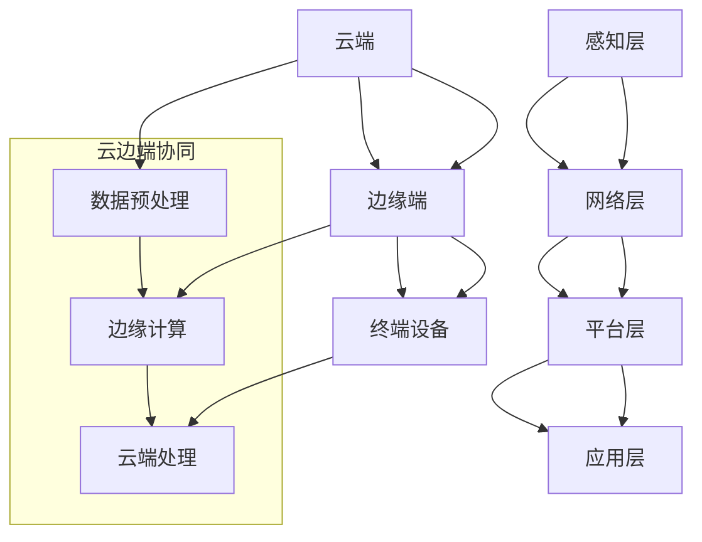
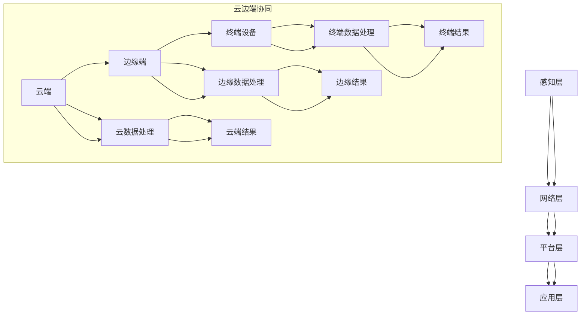

                 

### 第1章：物联网基础知识

#### 背景介绍

物联网（Internet of Things，IoT）作为现代信息技术的重要组成部分，其核心思想是通过网络将各种设备互联起来，实现信息的智能采集、传输和处理。物联网的发展起源于20世纪80年代，最早的物联网概念是由凯文·阿什顿（Kevin Ashton）在1999年提出的，他提出了“物联网”这个词汇，以描述通过RFID（射频识别）技术实现的智能连接。随着时间的推移，物联网逐渐从理论走向实际应用，成为推动社会发展的重要力量。

物联网的核心概念包括传感器网络、M2M通信、数据采集与分析等。传感器网络是实现物联网感知层的基础，通过传感器采集环境数据，为后续的数据处理提供原始信息。M2M通信则是指机器与机器之间的通信，是实现物联网信息传输的关键。数据采集与分析则是物联网应用的核心，通过对采集到的数据进行处理，实现智能化决策。

#### 核心概念与联系

物联网的核心概念包括以下几个方面：

1. **传感器网络**：传感器网络是由大量传感器节点组成的分布式网络系统。每个传感器节点都具备数据采集、数据处理和通信功能，能够实时监测并采集环境数据。传感器网络的作用在于实现物联网的感知功能，为物联网系统的运行提供基础数据支持。

2. **M2M通信**：M2M通信是指机器与机器之间的通信，是实现物联网信息传输的关键。M2M通信技术包括无线通信、有线通信等多种方式，能够确保物联网设备之间的高效、稳定连接。M2M通信技术的应用，使得物联网系统可以实现远程监控、自动化控制等功能。

3. **数据采集与分析**：数据采集与分析是物联网应用的核心。通过对传感器网络采集到的数据进行处理、分析，可以实现对环境的智能感知、预测和决策。数据采集与分析技术的应用，使得物联网系统可以实现智能化、自动化管理。

物联网架构通常分为感知层、网络层、平台层和应用层四个层级。感知层主要负责数据的采集，通过传感器网络实现对环境的实时监测；网络层负责数据的传输，通过M2M通信技术将采集到的数据传输到平台层；平台层负责数据处理，通过数据采集与分析技术对采集到的数据进行处理、分析，为应用层提供支持；应用层负责数据的利用，通过智能应用实现对环境的智能化管理。

下图展示了物联网架构中云、边缘、端三者的关系与协作：



#### Mermaid流程图

在物联网架构中，云、边缘和端三者的协同工作至关重要。以下是一个简单的Mermaid流程图，展示了感知层、网络层、平台层和应用层之间的关系，以及云、边缘和端之间的数据流动：



通过这个流程图，我们可以清晰地看到感知层的数据如何通过网络层传输到平台层，再由平台层进行处理，最终通过应用层实现智能化的管理和决策。同时，云、边缘和端三者的协同工作，也使得物联网系统在数据预处理、边缘计算和云端处理方面能够更加高效地运行。

### 第2章：云计算在物联网中的应用

#### 云计算的基本概念

云计算是一种通过互联网提供计算服务的技术，它将计算资源（如服务器、存储、网络等）以服务的形式提供给用户，用户可以根据需求随时扩展或缩减资源，从而实现高效、灵活的计算资源管理。云计算的主要服务模式包括IaaS（基础设施即服务）、PaaS（平台即服务）和SaaS（软件即服务）。

- **IaaS（Infrastructure as a Service）**：IaaS提供了虚拟化的计算资源，如虚拟机、存储和网络等，用户可以根据需求自行配置和管理这些资源。IaaS的优点是灵活性强、成本低、资源利用率高。

- **PaaS（Platform as a Service）**：PaaS提供了一个开发平台，包括开发工具、数据库、Web服务器等，用户可以在平台上开发、测试和部署应用程序。PaaS的优点是开发效率高、易于集成和管理。

- **SaaS（Software as a Service）**：SaaS提供了完整的软件服务，用户无需购买和安装软件，只需通过网络访问即可使用。SaaS的优点是方便、成本低、易于维护和升级。

#### 云边端协同原理

云边端协同是指云计算、边缘计算和终端设备之间的协同工作，通过充分利用云、边缘和端三者的优势，实现物联网系统的高效、稳定运行。云边端协同的架构通常包括以下三个层次：

1. **数据层**：数据层包括感知层、网络层和平台层，主要负责数据的采集、传输和处理。感知层通过传感器网络采集环境数据，网络层通过M2M通信技术传输数据，平台层通过数据采集与分析技术对数据进行分析和处理。

2. **计算层**：计算层包括云端、边缘端和终端设备，主要负责数据的计算和处理。云端提供强大的计算能力，可以处理海量数据；边缘端提供近端计算能力，可以处理实时数据；终端设备提供本地计算能力，可以处理本地数据。

3. **应用层**：应用层包括物联网应用系统和用户界面，主要负责数据的展示和应用。物联网应用系统通过处理和分析数据，实现智能化的管理和决策；用户界面通过图形化展示，方便用户查看和管理数据。

云边端协同的原理在于充分利用云、边缘和端三者的计算能力，实现数据的分布式处理。具体来说，云边端协同包括以下几种策略：

1. **负载均衡**：通过在云、边缘和端之间合理分配计算任务，实现负载均衡，避免某一层过载或闲置。

2. **数据优化**：通过数据压缩、去重、缓存等技术，减少数据传输量和存储需求，提高数据传输效率。

3. **资源分配**：根据任务的性质和需求，动态调整云、边缘和端之间的资源分配，实现最优的资源利用。

#### 核心算法讲解

在云边端协同中，常用的核心算法包括数据预处理算法、边缘计算算法和云端处理算法。以下是一个简单的伪代码示例，用于说明这些算法的基本原理：

```python
# 云边端协同算法伪代码

def cloud_edge_collaboration(data):
    # 数据预处理
    preprocessed_data = preprocess_data(data)
    
    # 边缘计算
    edge_results = edge_computing(preprocessed_data)
    
    # 云端处理
    cloud_results = cloud_computing(edge_results)
    
    return cloud_results

# 数据预处理
def preprocess_data(data):
    # 数据压缩
    compressed_data = compress_data(data)
    
    # 数据去重
    unique_data = remove_duplicates(compressed_data)
    
    # 数据缓存
    cached_data = cache_data(unique_data)
    
    return cached_data

# 边缘计算
def edge_computing(data):
    # 实时数据处理
    real_time_data = real_time_processing(data)
    
    return real_time_data

# 云端处理
def cloud_computing(data):
    # 数据分析
    analyzed_data = data_analysis(data)
    
    # 智能决策
    decision = intelligent_decision(analyzed_data)
    
    return decision
```

在这个示例中，`cloud_edge_collaboration` 函数实现了云边端协同的基本流程，包括数据预处理、边缘计算和云端处理。数据预处理函数 `preprocess_data` 主要进行数据压缩、去重和缓存等操作，以提高数据传输效率和存储利用率。边缘计算函数 `edge_computing` 主要进行实时数据处理，以应对低延迟和高并发的场景。云端处理函数 `cloud_computing` 主要进行数据分析、智能决策等操作，以实现物联网应用的智能化管理。

通过这个示例，我们可以看到云边端协同算法的基本原理和实现方式，为物联网系统的高效运行提供了技术支持。

### 第3章：边缘计算技术

#### 边缘计算的概念与优势

边缘计算（Edge Computing）是一种分布式计算架构，它将计算、存储和网络功能分布到网络边缘，以接近数据源的位置进行处理。边缘计算的核心思想是将数据处理推向边缘，减少数据传输量，降低延迟，提高系统的响应速度和实时性。与传统的云计算相比，边缘计算具有以下优势：

1. **低延迟**：由于数据处理在靠近数据源的位置进行，可以显著降低数据传输延迟，提高系统的响应速度。

2. **高带宽**：边缘计算可以释放更多的网络带宽，减少数据传输过程中的拥塞，提高数据传输效率。

3. **数据隐私和安全**：边缘计算将数据处理分散到边缘设备，可以更好地保护数据隐私和安全，减少数据泄露的风险。

4. **可靠性和可用性**：边缘计算通过分布式架构提高了系统的可靠性和可用性，即使部分设备或节点发生故障，系统仍能正常运行。

5. **带宽优化**：边缘计算可以减少数据传输量，降低网络带宽需求，优化网络资源利用。

#### 边缘设备技术

边缘设备是边缘计算的核心组成部分，主要包括硬件和软件两个方面。

1. **硬件选择**

   边缘设备的硬件选择取决于应用场景和性能需求。常见的硬件包括：

   - **CPU**：中央处理器（CPU）是边缘设备的核心计算单元，负责执行各种计算任务。常见的CPU包括ARM架构的处理器和Intel的Atom处理器。

   - **GPU**：图形处理单元（GPU）在边缘计算中主要用于并行计算和图像处理。NVIDIA的GPU在边缘计算领域具有广泛应用。

   - **FPGA**：现场可编程门阵列（FPGA）是一种可编程逻辑器件，具有高性能和低延迟的特点，适用于实时数据处理和高速通信。

   - **其他硬件**：如物联网模块、传感器、存储设备等，用于扩展边缘设备的功能。

2. **软件平台**

   边缘设备的软件平台包括操作系统、中间件和开发工具等。

   - **操作系统**：常见的边缘操作系统包括Linux、Windows IoT Core、real-time Linux等，适用于不同的应用场景。

   - **中间件**：中间件用于提供边缘设备与云计算平台之间的连接和通信，如MQTT、CoAP等。

   - **开发工具**：开发工具包括编程语言、集成开发环境（IDE）和开发框架，如Python、Node.js、TensorFlow等，用于开发边缘应用程序。

#### 边缘计算应用实例

边缘计算在物联网应用中具有广泛的应用场景，以下列举几个典型的应用实例：

1. **智能家居**：智能家居系统通过边缘设备（如智能音箱、智能灯泡等）实现对家庭设备的远程控制、自动化管理，如语音控制、定时开关等。

2. **工业物联网**：工业物联网系统通过边缘设备实现对生产线的实时监控、故障诊断、设备维护等，提高生产效率和设备可靠性。

3. **智慧城市**：智慧城市系统通过边缘设备实现对交通流量、环境监测、公共安全等数据的实时处理和分析，提高城市管理的智能化水平。

4. **医疗健康**：医疗健康系统通过边缘设备实现对患者的实时监测、远程诊断等，提高医疗服务的质量和效率。

5. **农业物联网**：农业物联网系统通过边缘设备实现对农田环境、作物生长状况的实时监测和管理，提高农业生产效率和农产品质量。

#### 总结

边缘计算作为一种分布式计算架构，在物联网应用中具有广泛的应用前景。通过将计算、存储和网络功能分布到网络边缘，边缘计算可以显著提高系统的响应速度、降低延迟、优化带宽利用，实现高效、可靠的物联网应用。随着物联网技术的不断发展，边缘计算将在未来发挥越来越重要的作用。边缘设备技术的发展和软件平台的成熟，将为边缘计算应用提供更加丰富的工具和资源，推动物联网应用的不断创新和进步。

### 第4章：项目实战一——智能家居系统设计

#### 项目背景与需求分析

智能家居系统是一种将家庭设备通过物联网技术进行连接，实现远程控制、自动化管理，提高生活便利性和舒适度的系统。随着物联网技术的不断发展，智能家居系统已经成为了现代家庭生活的重要组成部分。本项目旨在设计一套智能家居系统，实现对家庭设备的远程控制和自动化管理。

**需求分析：**
1. **设备控制**：用户能够通过智能手机或其他设备远程控制家庭设备，如灯光、空调、门锁等。
2. **自动化场景**：系统能够根据用户的设定，自动执行一系列操作，如离家模式、睡眠模式等。
3. **安全监控**：系统能够实现家庭安全监控，如门窗状态监测、烟雾报警等。
4. **数据统计**：系统能够记录家庭设备的运行状态，并提供数据统计和分析，帮助用户了解家庭能耗情况。

#### 系统架构设计

智能家居系统通常分为感知层、网络层、平台层和应用层四个层级，每个层级都有其特定的功能和组件。以下是对各层的设计说明：

**感知层**：
感知层是智能家居系统的数据采集部分，主要包括各种传感器和执行器。传感器用于采集家庭环境的数据，如温度、湿度、光照等，执行器则用于控制家庭设备，如灯光开关、窗帘电机等。

**网络层**：
网络层负责数据的传输，通过无线通信协议（如Wi-Fi、Zigbee、蓝牙等）将感知层采集到的数据传输到平台层。同时，网络层也负责家庭设备之间的通信，实现设备间的互联互通。

**平台层**：
平台层是智能家居系统的数据处理和分析部分，通过云计算和边缘计算技术，对采集到的数据进行分析和处理，实现设备的自动化控制、场景设定、安全监控等功能。

**应用层**：
应用层是用户与智能家居系统的交互接口，用户可以通过智能手机、平板电脑等设备访问智能家居系统，实现对家庭设备的远程控制和查看系统状态。

#### 系统实现与测试

**硬件搭建：**
1. **传感器**：选择适合家庭环境的传感器，如温度传感器、湿度传感器、光照传感器等。
2. **执行器**：选择适合家庭设备的执行器，如继电器、电机等。
3. **无线模块**：选择支持Wi-Fi或Zigbee等通信协议的无线模块，实现设备之间的无线通信。

**软件实现：**
1. **边缘计算脚本**：编写边缘计算脚本，实现数据的采集、处理和传输，如使用Python编写传感器数据采集脚本，使用MQTT协议实现数据传输。
2. **云平台接口**：搭建云平台，实现数据的存储、分析和处理，如使用AWS、阿里云等云服务平台。

**测试与优化：**
1. **功能测试**：测试系统的各项功能，如远程控制、自动化场景、安全监控等。
2. **性能测试**：测试系统的响应速度、数据传输效率等性能指标，进行优化和调整。
3. **稳定性测试**：在模拟实际使用场景下，测试系统的稳定性，确保系统在长时间运行下不会出现故障。

#### 项目小结

智能家居系统设计是物联网技术在家庭应用中的典型例子。通过感知层、网络层、平台层和应用层的协同工作，实现了家庭设备的远程控制、自动化管理和安全监控。本项目通过硬件搭建、软件实现和测试优化，成功构建了一个智能家居系统，为用户提供了便捷、高效、安全的家庭生活体验。随着物联网技术的不断发展和智能家居设备的不断升级，未来的智能家居系统将更加智能、更加便捷，为用户带来更好的生活品质。

### 第5章：项目实战二——智能工厂设计

#### 项目背景与需求分析

智能工厂是指利用物联网技术、大数据分析和人工智能算法等先进技术，实现生产过程的自动化、智能化和精细化管理。随着工业4.0的推进，智能工厂已成为现代制造业发展的趋势。本项目旨在设计一个智能工厂系统，通过物联网技术实现对生产线的实时监控、故障诊断和设备维护。

**需求分析：**
1. **生产线监控**：实时监控生产线的运行状态，包括设备状态、生产线速度、产品良率等。
2. **故障诊断**：自动检测设备故障，快速定位故障原因，减少停机时间。
3. **设备维护**：根据设备运行数据，合理安排设备维护计划，延长设备使用寿命。
4. **数据分析**：对生产线运行数据进行分析，优化生产流程，提高生产效率。
5. **远程控制**：支持生产线的远程控制，实现对生产过程的远程监控和操作。

#### 系统架构设计

智能工厂系统架构包括感知层、网络层、平台层和应用层，各层级的具体功能如下：

**感知层**：
感知层是智能工厂的数据采集部分，主要包括各种传感器和执行器。传感器用于采集生产线的各项运行数据，如温度、湿度、振动、压力等，执行器用于控制生产设备，如电机、阀门等。

**网络层**：
网络层负责数据的传输和通信，通过无线通信协议（如Wi-Fi、Zigbee、以太网等）将感知层采集到的数据传输到平台层。同时，网络层还负责生产设备之间的通信，实现设备间的互联互通。

**平台层**：
平台层是智能工厂的数据处理部分，通过云计算和边缘计算技术，对采集到的数据进行分析和处理，实现生产线的自动化控制、故障诊断和设备维护。平台层还提供数据存储和可视化功能，帮助用户实时了解生产线状态。

**应用层**：
应用层是用户与智能工厂系统的交互接口，用户可以通过计算机、平板电脑等设备访问智能工厂系统，实现对生产线的远程监控、控制和分析。

#### 系统实现与测试

**硬件搭建：**
1. **传感器**：根据生产需求选择合适的传感器，如温度传感器、湿度传感器、振动传感器等。
2. **执行器**：根据生产需求选择合适的执行器，如电机、阀门等。
3. **无线模块**：选择支持Wi-Fi、Zigbee等通信协议的无线模块，实现设备之间的无线通信。

**软件实现：**
1. **边缘计算脚本**：编写边缘计算脚本，实现数据的采集、处理和传输，如使用Python编写传感器数据采集脚本，使用MQTT协议实现数据传输。
2. **云平台接口**：搭建云平台，实现数据的存储、分析和处理，如使用AWS、阿里云等云服务平台。
3. **数据可视化**：使用数据可视化工具，如Kibana、Grafana等，实现生产数据的实时监控和可视化展示。

**测试与优化：**
1. **功能测试**：测试系统的各项功能，如生产线监控、故障诊断、设备维护等。
2. **性能测试**：测试系统的响应速度、数据传输效率等性能指标，进行优化和调整。
3. **稳定性测试**：在模拟实际生产场景下，测试系统的稳定性，确保系统在长时间运行下不会出现故障。

#### 项目小结

智能工厂设计是物联网技术在工业应用中的重要应用，通过感知层、网络层、平台层和应用层的协同工作，实现了生产线的实时监控、故障诊断和设备维护。本项目通过硬件搭建、软件实现和测试优化，成功构建了一个智能工厂系统，为工厂提供了高效、智能、稳定的生产环境。随着物联网技术的不断发展和工业4.0的推进，未来的智能工厂将更加智能、更加高效，为工业生产带来巨大的变革和提升。

### 最佳实践 Tips

在设计和实施物联网系统时，以下是一些最佳实践和注意事项，以帮助确保项目的成功：

1. **需求分析与规划**：
   - 在项目启动阶段，充分了解用户需求和业务目标，确保项目目标明确、可实现。
   - 制定详细的系统架构和开发计划，合理安排时间、资源和预算。

2. **数据安全与隐私**：
   - 采取严格的数据加密和访问控制措施，确保数据在传输和存储过程中的安全。
   - 遵守相关法律法规，保护用户隐私，避免数据泄露。

3. **系统可扩展性与灵活性**：
   - 设计系统时考虑未来的扩展性和灵活性，以便应对业务需求的变化。
   - 采用模块化设计，便于系统升级和维护。

4. **实时性与稳定性**：
   - 优化系统架构，确保数据传输的实时性和系统运行的稳定性。
   - 进行充分的性能测试和稳定性测试，确保系统在高负载、高并发情况下仍能正常运行。

5. **用户界面与体验**：
   - 设计直观、易用的用户界面，提供良好的用户体验。
   - 定期收集用户反馈，不断优化和改进系统功能。

6. **持续监控与维护**：
   - 实时监控系统运行状态，及时发现和处理潜在问题。
   - 定期进行系统升级和优化，确保系统保持最佳性能。

通过遵循这些最佳实践，可以有效提升物联网系统的可靠性、稳定性和用户体验，从而确保项目的成功实施。

### 小结

本文通过深入探讨物联网架构中云边端协同的应用，从背景介绍、核心概念、技术基础、项目实战等方面进行了全面的分析和阐述。通过本文，读者可以了解到物联网系统中的云、边缘和端三者的协同关系，以及如何在实际项目中实现云边端协同，从而提高物联网系统的效率、稳定性和用户体验。

未来，随着物联网技术的不断发展和创新，云边端协同将在更多领域得到应用，为各行业带来巨大的变革和提升。建议读者关注最新的物联网技术动态，持续学习和实践，以应对未来的技术挑战，为物联网技术的发展贡献力量。同时，也欢迎对本文提出宝贵意见和反馈，共同推动物联网技术的进步。

