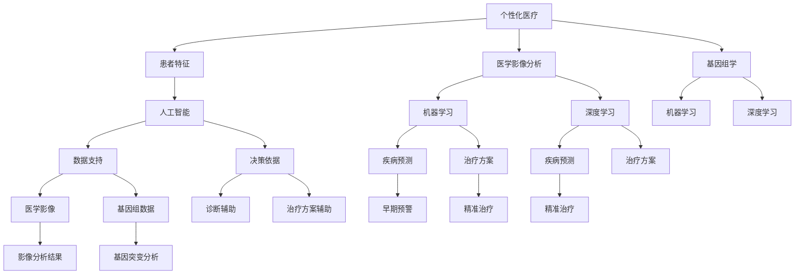

                 


### 文章标题
《人工智能在个性化医疗方案制定中的应用》

### 文章关键词
人工智能、个性化医疗、医学影像分析、基因组学、机器学习、深度学习、数据隐私、医疗服务优化、医疗数据处理

### 文章摘要
本文将深入探讨人工智能在个性化医疗方案制定中的应用。从背景介绍到核心概念的阐述，再到具体算法原理的讲解，我们将逐步分析人工智能如何通过数据处理和分析技术，为个性化医疗提供科学依据。通过实际案例的剖析，我们将展示人工智能在个性化诊断、个性化治疗和个性化护理中的应用实例。最后，本文将讨论未来发展方向和面临的挑战，为读者提供全面的技术视角和思考。

## 引言与背景

### 个性化医疗的兴起与重要性

个性化医疗，也称为精准医疗，是一种以患者为中心的医疗模式，旨在通过综合考虑患者的遗传信息、生活方式、环境因素等，为每个患者量身定制最适合的诊疗方案。这一理念的兴起，源于现代医学面临的巨大挑战：疾病的复杂性不断增加，患者个体差异显著，传统的“一刀切”治疗方案难以满足个性化需求。

个性化医疗的重要性体现在多个方面。首先，它能够提高诊疗的精准度，减少不必要的检查和治疗，降低医疗成本。其次，个性化医疗有助于提高患者的生活质量，减少并发症和复发率。此外，个性化医疗还为药物研发和临床试验提供了更加精准的方向，加速了新药的研发进程。

### 人工智能在医疗领域的应用现状

人工智能（AI）作为现代科技的杰出代表，已经在医疗领域展现出巨大的潜力。从医学影像分析、基因组学、智能诊断到个性化治疗方案的制定，AI技术在医疗领域的应用越来越广泛。

在医学影像分析方面，人工智能可以通过深度学习算法，对CT、MRI等影像数据进行自动分析和诊断，提高诊断的准确性和速度。例如，Google DeepMind开发的AI系统可以识别出早期肺癌，其准确率甚至超过了经验丰富的放射科医生。

在基因组学领域，人工智能可以处理海量的基因组数据，帮助科学家们发现与疾病相关的基因突变，为精准医疗提供科学依据。例如，IBM的Watson for Genomics可以利用机器学习算法，快速分析基因组数据，为医生提供个性化的治疗方案。

此外，人工智能在智能诊断和个性化治疗方案的制定中也发挥了重要作用。例如，IBM的Watson for Oncology可以帮助医生分析患者的病例数据，提供基于最新临床证据的个性化治疗方案。

### 人工智能在个性化医疗中的优势

与传统的医疗模式相比，人工智能在个性化医疗中具有显著的优势。首先，人工智能可以处理和分析海量的数据，包括患者的健康记录、基因组数据、环境因素等，为个性化医疗提供全面的数据支持。其次，人工智能算法可以根据患者的具体特征，动态调整治疗方案，提高治疗的有效性和个性化程度。

此外，人工智能在个性化医疗中还具有以下优势：

1. **提高诊疗效率**：通过自动化和智能化，人工智能可以显著提高医疗诊断和治疗的速度，减轻医生的工作负担。
2. **降低医疗成本**：人工智能可以优化医疗资源的使用，减少不必要的检查和治疗，降低医疗成本。
3. **提高诊疗精准度**：人工智能可以通过大数据分析和预测模型，提高诊疗的精准度，减少误诊和漏诊。
4. **促进医疗资源的公平分配**：人工智能可以帮助医生在偏远地区提供高质量的医疗服务，促进医疗资源的公平分配。

总之，人工智能在个性化医疗中的应用不仅提高了医疗服务的质量和效率，还为精准医疗的发展提供了新的方向和思路。随着技术的不断进步，人工智能将在个性化医疗领域发挥越来越重要的作用。

### 核心概念与联系

在探讨人工智能在个性化医疗方案制定中的应用之前，我们需要明确几个核心概念，并理解它们之间的相互关系。以下是几个关键概念的定义及其在个性化医疗中的作用：

1. **个性化医疗**：个性化医疗是一种基于患者个体特征，包括遗传信息、生活方式和环境因素，制定个性化诊疗方案的医疗模式。个性化医疗的目标是提高诊疗的精准度和治疗效果，减少不必要的医疗干预。

2. **人工智能**：人工智能（AI）是一种模拟人类智能的计算机技术，包括机器学习、深度学习、自然语言处理等子领域。人工智能在医疗领域的应用主要体现在数据分析和模式识别，为个性化医疗提供数据支持和决策依据。

3. **医学影像分析**：医学影像分析是指利用计算机技术和人工智能算法，对医学影像数据进行处理和分析，辅助医生进行疾病诊断和治疗方案制定。常见的医学影像包括CT、MRI、X光等。

4. **基因组学**：基因组学是研究生物体基因组成、结构、功能及其相互作用的科学。基因组数据为个性化医疗提供了重要的生物学信息，可以帮助识别与疾病相关的基因突变和遗传特征。

5. **机器学习**：机器学习是人工智能的一个子领域，通过构建数学模型，从数据中学习规律，进行预测和决策。在个性化医疗中，机器学习算法可以帮助分析患者的健康数据，预测疾病风险，制定个性化治疗方案。

6. **深度学习**：深度学习是机器学习的一种方法，通过多层神经网络结构，对大量数据进行自动学习和特征提取。深度学习在医学影像分析和基因组学等领域具有广泛应用，可以提高诊断的准确性和效率。

### Mermaid 流程图

为了更好地理解这些概念之间的联系，我们可以使用Mermaid流程图来展示它们之间的交互关系。以下是示例流程图：



在这个流程图中，个性化医疗作为核心概念，通过患者特征、医学影像分析和基因组学获取数据，然后利用人工智能（包括机器学习和深度学习）进行处理和分析，为诊断和治疗方案提供支持。最终，这些分析结果帮助实现早期预警和精准治疗，提高医疗服务的质量和效率。

通过这个流程图，我们可以清晰地看到人工智能在个性化医疗中的作用，以及各个概念之间的相互关系。这为我们进一步探讨人工智能在个性化医疗方案制定中的应用奠定了基础。

### 核心算法原理讲解

在个性化医疗方案制定中，人工智能算法发挥着至关重要的作用。本文将详细讲解机器学习算法和深度学习算法的基本原理，并展示如何使用伪代码实现这些算法。通过这些讲解，我们将更好地理解人工智能如何帮助个性化医疗实现精准诊疗和治疗方案制定。

#### 机器学习算法

机器学习算法是一种通过数据学习规律，进行预测和决策的算法。在个性化医疗中，机器学习算法常用于疾病预测、治疗方案制定等任务。以下是机器学习算法的基本原理：

**基本原理：**

1. **数据收集与预处理**：收集患者的健康数据，包括医学影像、基因组数据、临床指标等。对数据进行清洗、归一化等预处理操作，以便后续分析。
2. **特征提取**：从数据中提取有用的特征，例如医学影像中的纹理特征、基因组数据中的基因表达水平等。
3. **模型训练**：使用训练数据集，通过优化算法（如梯度下降）训练模型，使其能够识别数据中的规律。
4. **模型评估与优化**：使用验证数据集评估模型性能，并通过调整参数（如学习率、隐藏层大小等）优化模型。

**伪代码示例：**

```python
# 机器学习算法伪代码

# 数据收集与预处理
data = load_data()
data = preprocess_data(data)

# 特征提取
features = extract_features(data)

# 模型训练
model = train_model(features)

# 模型评估与优化
evaluate_model(model, validation_data)
optimize_model(model, validation_data)
```

**应用举例：**

假设我们使用机器学习算法预测某种疾病的患病风险。以下是具体的伪代码示例：

```python
# 预测疾病患病风险

# 加载训练数据
train_data = load_train_data()

# 数据预处理
train_data = preprocess_data(train_data)

# 特征提取
train_features = extract_features(train_data)

# 加载测试数据
test_data = load_test_data()

# 数据预处理
test_data = preprocess_data(test_data)

# 特征提取
test_features = extract_features(test_data)

# 训练模型
model = train_model(train_features, train_labels)

# 预测患病风险
predicted_risks = predict_risk(model, test_features)

# 评估预测结果
evaluate_predictions(predicted_risks, test_labels)
```

#### 深度学习算法

深度学习算法是机器学习的一种高级形式，通过多层神经网络结构，自动提取数据中的复杂特征。在个性化医疗中，深度学习算法常用于医学影像分析、基因组学分析等任务。

**基本原理：**

1. **神经网络结构**：深度学习算法的核心是神经网络，包括输入层、隐藏层和输出层。每一层都可以提取不同层次的特征。
2. **前向传播**：输入数据通过神经网络逐层传递，每个神经元都会对输入数据进行加权求和，并应用激活函数进行非线性变换。
3. **反向传播**：通过反向传播算法，计算输出结果与实际结果之间的误差，并更新网络参数，优化模型。
4. **优化算法**：常见的优化算法包括随机梯度下降（SGD）、Adam等，用于调整网络参数，提高模型性能。

**伪代码示例：**

```python
# 深度学习算法伪代码

# 定义神经网络结构
network = define_network()

# 数据预处理
data = preprocess_data(data)

# 训练模型
for epoch in range(num_epochs):
    for sample in data:
        network.forward(sample)
        network.backward()
        network.update_parameters()

# 评估模型
evaluate_model(network, validation_data)
```

**应用举例：**

假设我们使用深度学习算法进行医学影像分析，以下是具体的伪代码示例：

```python
# 进行医学影像分析

# 加载训练数据
train_images = load_train_images()

# 数据预处理
train_images = preprocess_images(train_images)

# 加载测试数据
test_images = load_test_images()

# 数据预处理
test_images = preprocess_images(test_images)

# 定义深度学习模型
model = define_model()

# 训练模型
train_model(model, train_images, train_labels)

# 预测测试数据
predictions = predict(model, test_images)

# 评估预测结果
evaluate_predictions(predictions, test_labels)
```

通过以上讲解，我们可以看到机器学习算法和深度学习算法在个性化医疗中的应用原理和实现方法。这些算法不仅能够处理和分析大量医疗数据，还可以通过不断优化，提高诊断和治疗的准确性，为个性化医疗提供强有力的技术支持。

### 数学模型和公式

在个性化医疗方案制定中，数学模型和公式是核心工具，用于描述疾病发展、治疗方案优化等复杂问题。以下是几个常见的数学模型和公式的详细讲解及举例说明。

#### 疾病发展模型

疾病发展模型用于描述疾病的演变过程，帮助医生预测疾病的进展情况。一个简单的疾病发展模型可以使用SIR模型（易感者-感染者-移除者模型）来表示：

$$
\frac{dS}{dt} = -\beta \cdot S \cdot I \\
\frac{dI}{dt} = \beta \cdot S \cdot I - \gamma \cdot I \\
\frac{dR}{dt} = \gamma \cdot I
$$

其中，$S$表示易感者数量，$I$表示感染者数量，$R$表示移除者（康复或死亡）数量，$\beta$表示感染率，$\gamma$表示移除率。

**举例说明：**

假设在一个社区中，初始有1000人，其中500人是易感者，500人是感染者。感染率为0.1，移除率为0.05。我们可以使用SIR模型计算在未来一天内各个群体数量的变化：

```python
# 初始条件
S = 500
I = 500
R = 0

# 参数
beta = 0.1
gamma = 0.05

# 时间步长
dt = 1

# SIR模型计算
dS = -beta * S * I * dt
dI = beta * S * I * dt - gamma * I * dt
dR = gamma * I * dt

S_new = S + dS
I_new = I + dI
R_new = R + dR

print("新易感者数量：", S_new)
print("新感染者数量：", I_new)
print("新移除者数量：", R_new)
```

#### 治疗方案优化模型

治疗方案优化模型用于确定最佳的治疗方案，以最小化疾病风险或最大化治疗效果。一个简单的优化模型可以使用线性规划（Linear Programming，LP）来表示：

$$
\min_{x} c^T x \\
s.t. \\
Ax \leq b \\
x \geq 0
$$

其中，$x$表示治疗方案变量，$c$表示目标函数系数，$A$和$b$分别表示约束条件系数和常数。

**举例说明：**

假设我们有两个治疗方案：A和B。治疗方案A的成本是5，治疗方案B的成本是10。同时，治疗方案A可以降低疾病风险20%，治疗方案B可以降低疾病风险30%。我们需要确定最佳的治疗方案，以最小化疾病风险。

目标函数系数$c$为：
$$
c = \begin{pmatrix} -0.2 \\ -0.3 \end{pmatrix}
$$

约束条件系数矩阵$A$和常数向量$b$为：
$$
A = \begin{pmatrix} 1 & 0 \\ 0 & 1 \end{pmatrix}, \quad b = \begin{pmatrix} 1 \\ 1 \end{pmatrix}
$$

我们可以使用线性规划求解器（如Python中的Scipy库）来求解这个问题：
```python
import numpy as np
from scipy.optimize import linprog

# 目标函数系数
c = [-0.2, -0.3]

# 约束条件系数矩阵
A = [[1, 0], [0, 1]]

# 常数向量
b = [1, 1]

# 求解线性规划问题
result = linprog(c, A_eq=A, b_eq=b, method='highs')

# 输出最优解
print("最佳治疗方案：", result.x)
```

#### 综合模型

在个性化医疗中，常常需要综合多种因素进行决策。一个综合模型可以使用多目标优化（Multi-Objective Optimization）来表示：

$$
\min_{x} \begin{cases} 
f_1(x) \\
f_2(x) \\
\vdots \\
f_n(x)
\end{cases} \\
s.t. \\
g_1(x) \leq 0 \\
g_2(x) \leq 0 \\
\vdots \\
g_m(x) \leq 0
$$

其中，$f_1(x), f_2(x), \ldots, f_n(x)$表示多个目标函数，$g_1(x), g_2(x), \ldots, g_m(x)$表示多个约束条件。

**举例说明：**

假设我们需要在成本和治疗效果之间进行平衡，使用多目标优化模型来确定最佳的治疗方案。其中，成本目标函数为$f_1(x)$，治疗效果目标函数为$f_2(x)$，约束条件为预算限制和医疗资源限制。

目标函数$f_1(x)$和$f_2(x)$分别为：
$$
f_1(x) = 5x_1 + 10x_2 \\
f_2(x) = x_1 + 2x_2
$$

约束条件$g_1(x)$和$g_2(x)$分别为：
$$
g_1(x) = x_1 + x_2 \leq 100 \\
g_2(x) = 3x_1 + 2x_2 \leq 300
$$

我们可以使用多目标优化求解器（如Python中的Pymoo库）来求解这个问题：
```python
import numpy as np
from pymoo.optimize import minimize
from pymoo.core.problem import ElementwiseProblem
from pymoo.core.order import greater_than

class MultiObjectiveProblem(ElementwiseProblem):
    def __init__(self):
        super().__init__(n_var=2,
                         n_obj=2,
                         n_constr=2,
                         bounds=[(0, 100), (0, 100)],
                         default_weights=[1.0, 1.0],
                        

```python
## 实际应用：个性化诊断

个性化诊断是人工智能在个性化医疗中的首要应用之一。通过利用人工智能技术，特别是机器学习和深度学习算法，医生可以更准确地诊断患者所患的疾病，并制定出更加个性化的治疗方案。以下将详细介绍人工智能在个性化诊断中的应用，包括医学影像分析、基因组学和多模态数据的融合。

### 医学影像分析

医学影像分析是人工智能在个性化诊断中的一个重要领域。利用深度学习算法，如卷积神经网络（CNN），可以自动识别和分类医学影像中的病变区域，从而提高诊断的准确性。

**应用实例：**

- **肺癌诊断**：使用深度学习算法对CT扫描图像进行分析，可以检测出早期肺癌。例如，Google DeepMind开发的AI系统可以识别出早期肺癌，其准确率甚至超过了经验丰富的放射科医生。

**技术原理：**

1. **图像预处理**：对CT或MRI图像进行预处理，如去噪、对比度增强等，以提高图像质量。
2. **特征提取**：使用CNN等深度学习模型，从预处理后的图像中自动提取特征。
3. **分类与预测**：将提取的特征输入到分类模型中，预测病变的类型和范围。

**伪代码示例：**

```python
# 医学影像分析伪代码

# 加载预处理后的CT图像
image = load_image()

# 使用CNN进行特征提取
features = cnn_feature_extractor(image)

# 使用分类器进行预测
predicted_disease = classifier.predict(features)
```

### 基因组学

基因组学是另一个重要的个性化诊断领域。通过分析患者的基因组数据，人工智能可以帮助识别与疾病相关的基因突变，为个性化诊断提供依据。

**应用实例：**

- **癌症基因组分析**：利用基因组学数据，可以识别出与癌症相关的基因突变，从而帮助医生制定更有效的治疗方案。

**技术原理：**

1. **基因组数据收集**：从患者体内提取DNA样本，进行高通量测序，获得基因组数据。
2. **数据预处理**：对测序数据进行质量控制、比对、注释等处理，提取有效的基因信息。
3. **特征提取与模式识别**：使用机器学习算法，如支持向量机（SVM）或随机森林（Random Forest），对基因数据进行特征提取和模式识别。
4. **诊断与预测**：根据特征和模式，预测患者所患的疾病类型和风险。

**伪代码示例：**

```python
# 基因组分析伪代码

# 加载基因组数据
genome_data = load_genome_data()

# 数据预处理
preprocessed_data = preprocess_genome_data(genome_data)

# 使用SVM进行特征提取
features = svm_feature_extractor(preprocessed_data)

# 使用分类器进行预测
predicted_disease = classifier.predict(features)
```

### 多模态数据的融合

在个性化诊断中，结合不同类型的数据（如医学影像、基因组数据和生物标志物数据）可以提供更全面的诊断信息。多模态数据的融合是通过将不同类型的数据进行整合，从而提高诊断的准确性和个性化程度。

**应用实例：**

- **多模态癌症诊断**：结合CT扫描、基因组学和生物标志物数据，进行综合分析，提高癌症诊断的准确性。

**技术原理：**

1. **数据收集与预处理**：收集不同类型的数据，如医学影像、基因组数据和生物标志物数据，并对数据进行预处理。
2. **特征提取与融合**：使用深度学习算法，如变分自编码器（VAE）或多任务学习（Multi-Task Learning），提取和融合不同类型数据的特征。
3. **模型训练与预测**：使用融合后的特征训练分类模型，进行诊断和预测。

**伪代码示例：**

```python
# 多模态数据融合伪代码

# 加载医学影像数据
image_data = load_image_data()

# 加载基因组数据
genome_data = load_genome_data()

# 加载生物标志物数据
biomarker_data = load_biomarker_data()

# 数据预处理
preprocessed_image_data = preprocess_image_data(image_data)
preprocessed_genome_data = preprocess_genome_data(genome_data)
preprocessed_biomarker_data = preprocess_biomarker_data(biomarker_data)

# 特征提取与融合
features = vae_feature_extractor([preprocessed_image_data, preprocessed_genome_data, preprocessed_biomarker_data])

# 使用分类器进行预测
predicted_disease = classifier.predict(features)
```

### 应用案例分析

以下是几个个性化诊断的实际案例，展示了人工智能技术在个性化诊断中的成功应用：

1. **乳腺癌诊断**：通过结合医学影像和基因组学数据，人工智能可以帮助医生更准确地诊断乳腺癌，提高早期检测率。
2. **阿尔茨海默病预测**：通过分析患者的基因组数据和生活习惯数据，人工智能可以预测患者未来患阿尔茨海默病的风险，为早期干预提供依据。
3. **心脏病风险评估**：结合医学影像、基因组学和生物标志物数据，人工智能可以准确评估患者患心脏病的风险，为个性化治疗方案制定提供支持。

通过这些案例，我们可以看到人工智能在个性化诊断中的巨大潜力。随着技术的不断进步，人工智能将进一步提高个性化诊断的准确性和效率，为患者提供更高质量的医疗服务。

### 实际应用：个性化治疗

个性化治疗是人工智能在个性化医疗中的另一重要应用。通过利用人工智能技术，特别是机器学习和深度学习算法，医生可以根据患者的具体特征和疾病状况，制定出个性化的治疗方案，从而提高治疗效果和患者的生活质量。以下将详细介绍人工智能在个性化治疗中的应用，包括个性化药物研发、个性化手术规划和个性化护理方案。

#### 个性化药物研发

个性化药物研发是人工智能在个性化治疗中的重要应用之一。通过分析患者的基因组数据、代谢数据和药物反应数据，人工智能可以帮助医生确定最适合患者的药物种类和剂量。

**应用实例：**

- **药物基因组学**：通过分析患者的基因组数据，人工智能可以帮助识别与药物反应相关的基因突变，从而为患者制定个性化的药物治疗方案。

**技术原理：**

1. **基因组数据分析**：对患者的基因组数据进行提取和分析，识别与药物反应相关的基因突变。
2. **药物反应预测**：使用机器学习算法，如随机森林或支持向量机，预测患者对某种药物的反应类型和剂量。
3. **药物筛选与优化**：根据患者的基因组和药物反应数据，筛选和优化药物组合，提高治疗效果。

**伪代码示例：**

```python
# 个性化药物研发伪代码

# 加载基因组数据
genome_data = load_genome_data()

# 加载药物反应数据
drug_response_data = load_drug_response_data()

# 数据预处理
preprocessed_genome_data = preprocess_genome_data(genome_data)
preprocessed_drug_response_data = preprocess_drug_response_data(drug_response_data)

# 使用机器学习算法进行预测
drug_recommendation = machine_learning_algorithm.predict(preprocessed_genome_data)

# 筛选和优化药物组合
optimized_drug_combination = optimize_drug_combination(drug_recommendation)
```

#### 个性化手术规划

个性化手术规划是人工智能在个性化治疗中的另一个重要应用。通过分析患者的医学影像数据和身体特征，人工智能可以帮助医生制定个性化的手术方案，提高手术的成功率和患者的恢复速度。

**应用实例：**

- **个性化心脏手术**：通过分析患者的CT和MRI影像数据，人工智能可以帮助医生确定最佳的心脏手术方案，包括手术切口和手术步骤。

**技术原理：**

1. **医学影像数据分析**：对患者的医学影像数据进行处理和分析，提取关键特征，如心脏结构、病变区域等。
2. **手术路径规划**：使用机器学习算法，如深度强化学习，为医生提供个性化的手术路径建议。
3. **手术方案优化**：根据手术路径规划和患者特征，优化手术方案，提高手术的成功率和患者的恢复速度。

**伪代码示例：**

```python
# 个性化手术规划伪代码

# 加载医学影像数据
image_data = load_image_data()

# 加载患者特征数据
patient_characteristics = load_patient_characteristics()

# 数据预处理
preprocessed_image_data = preprocess_image_data(image_data)
preprocessed_patient_characteristics = preprocess_patient_characteristics(patient_characteristics)

# 使用机器学习算法进行手术路径规划
surgical_path = machine_learning_algorithm规划手术路径(preprocessed_image_data, preprocessed_patient_characteristics)

# 优化手术方案
optimized_surgical_plan = optimize_surgical_plan(surgical_path)
```

#### 个性化护理方案

个性化护理方案是人工智能在个性化治疗中的又一个重要应用。通过分析患者的健康状况、生活习惯和医疗记录，人工智能可以帮助医护人员制定个性化的护理方案，提高护理质量和患者的满意度。

**应用实例：**

- **个性化康复护理**：通过分析患者的健康状况和康复需求，人工智能可以帮助医生和护士制定个性化的康复护理方案，促进患者尽快恢复。

**技术原理：**

1. **患者数据收集与整合**：收集患者的健康状况、生活习惯、医疗记录等多源数据，并进行整合。
2. **护理需求预测**：使用机器学习算法，如时间序列预测或分类算法，预测患者的护理需求。
3. **护理方案制定与优化**：根据患者的护理需求和医疗资源，制定个性化的护理方案，并不断优化，提高护理质量。

**伪代码示例：**

```python
# 个性化护理方案伪代码

# 加载患者数据
patient_data = load_patient_data()

# 数据预处理
preprocessed_patient_data = preprocess_patient_data(patient_data)

# 预测护理需求
predicted_nursing_needs = machine_learning_algorithm.predict(preprocessed_patient_data)

# 制定护理方案
nursing_plan = create_nursing_plan(predicted_nursing_needs)

# 优化护理方案
optimized_nursing_plan = optimize_nursing_plan(nursing_plan)
```

### 应用案例分析

以下是几个个性化治疗的实际案例，展示了人工智能技术在个性化治疗中的成功应用：

1. **个性化癌症治疗**：通过分析患者的基因组数据和治疗效果，人工智能可以帮助医生制定个性化的癌症治疗方案，提高治疗效果和患者生存率。
2. **个性化心脏病治疗**：通过分析患者的影像数据和心脏功能数据，人工智能可以帮助医生制定个性化的心脏病治疗方案，减少手术风险和术后并发症。
3. **个性化糖尿病管理**：通过分析患者的血糖数据、生活习惯和医疗记录，人工智能可以帮助医生和患者制定个性化的糖尿病管理方案，控制血糖水平，减少并发症风险。

通过这些案例，我们可以看到人工智能在个性化治疗中的巨大潜力。随着技术的不断进步，人工智能将进一步提高个性化治疗的准确性和效率，为患者提供更高质量的医疗服务。

### 个性化护理

个性化护理是人工智能在个性化医疗中的重要应用之一，旨在通过数据分析和智能算法，为患者提供量身定制的护理方案。个性化护理不仅能够提高护理质量和患者满意度，还可以优化医疗资源的配置，降低医疗成本。

#### 个性化护理方案的制定

制定个性化护理方案的首要任务是收集和分析患者的多维数据，包括健康状况、生活习惯、医疗记录等。以下是一个制定个性化护理方案的步骤：

1. **数据收集**：从电子健康记录（EHR）、可穿戴设备、患者报告结果等渠道收集患者数据。
2. **数据预处理**：清洗和整合数据，去除噪声，填充缺失值，并进行数据标准化。
3. **特征提取**：从预处理后的数据中提取关键特征，如患者的生理指标、药物使用情况、生活习惯等。
4. **需求分析**：使用机器学习算法，如聚类分析或回归分析，分析患者的护理需求。
5. **方案制定**：根据分析结果，结合临床经验和最佳实践，制定个性化的护理方案。

**伪代码示例：**

```python
# 个性化护理方案制定伪代码

# 数据收集
patient_data = collect_data()

# 数据预处理
clean_data = preprocess_data(patient_data)

# 特征提取
features = extract_features(clean_data)

# 需求分析
needs = machine_learning_algorithm.predict(features)

# 方案制定
care_plan = create_plan(needs)
```

#### 个性化护理的实施

在制定出个性化的护理方案后，下一步是实施和监控方案。实施过程中，医护人员需要根据患者的实际情况，动态调整护理措施。

1. **方案实施**：根据个性化护理方案，为患者提供相应的护理服务，如药物治疗、饮食指导、康复训练等。
2. **实时监控**：通过可穿戴设备、传感器等实时收集患者数据，监控护理效果和患者状况。
3. **反馈调整**：根据实时监控数据，使用机器学习算法对护理方案进行调整，确保方案的持续优化。

**伪代码示例：**

```python
# 个性化护理实施伪代码

# 方案实施
execute_plan(care_plan)

# 实时监控
monitor_data = collect_realtime_data()

# 反馈调整
adjusted_plan = adjust_plan(monitor_data, care_plan)
```

#### 个性化护理的评估与优化

评估个性化护理的效果和持续优化是提高护理质量的关键。以下是一个评估和优化个性化护理方案的步骤：

1. **效果评估**：使用机器学习算法，如回归分析或时间序列预测，评估护理方案的实际效果。
2. **反馈收集**：收集患者和医护人员的反馈，了解护理方案的优缺点。
3. **方案优化**：根据评估结果和反馈，对护理方案进行优化，提高护理效果。

**伪代码示例：**

```python
# 个性化护理评估与优化伪代码

# 效果评估
evaluation_results = evaluate_plan(adjusted_plan)

# 反馈收集
feedback = collect_feedback()

# 方案优化
optimized_plan = optimize_plan(evaluation_results, feedback)
```

#### 实际案例分析

以下是几个个性化护理的实际案例，展示了人工智能技术在个性化护理中的成功应用：

1. **慢性病管理**：通过分析患者的健康数据和医疗记录，人工智能可以帮助医护人员制定个性化的慢性病管理方案，如糖尿病、高血压等。
2. **术后康复**：通过实时监控患者的生理指标和康复进度，人工智能可以帮助医护人员调整术后康复计划，提高康复效果。
3. **老年人护理**：通过分析老年人的健康数据和生活习惯，人工智能可以帮助制定个性化的护理方案，预防跌倒和疾病发作。

通过这些案例，我们可以看到个性化护理在提高护理质量和患者满意度方面的巨大潜力。随着人工智能技术的不断进步，个性化护理将更加智能化和个性化，为患者提供更加优质的医疗服务。

### 未来展望与挑战

随着人工智能技术的快速发展，个性化医疗方案制定的应用前景愈发广阔。未来，人工智能在个性化医疗领域有望实现以下突破：

1. **更精准的诊断**：通过深度学习和图像识别技术的进步，人工智能将能够更准确地识别疾病，尤其是在早期阶段，从而实现更早的治疗和干预。

2. **更优化的治疗**：随着机器学习算法的不断优化，人工智能将能够更好地预测治疗效果，为患者制定更加个性化的治疗计划，提高治疗效果。

3. **智能的护理方案**：人工智能技术将有助于开发智能护理系统，通过实时监测患者状况，提供个性化的护理服务，提高护理质量和患者满意度。

然而，人工智能在个性化医疗方案制定中仍面临一些挑战：

1. **数据隐私与安全**：个性化医疗依赖于大量的患者数据，这些数据的安全性和隐私保护是关键问题。如何在保证数据隐私的同时，充分利用数据的价值，是一个亟待解决的问题。

2. **算法透明性与可解释性**：人工智能算法的决策过程通常是不透明的，这对于需要明确诊断和治疗方案的临床医生和患者来说是一个挑战。提高算法的可解释性，使其决策过程更加透明，是未来研究的一个重要方向。

3. **技术标准化与法规遵循**：个性化医疗涉及到多种技术和医疗数据的处理，需要制定统一的技术标准和法规规范，以确保技术的可靠性和合法性。

4. **医疗资源的公平分配**：虽然人工智能可以提高医疗服务的效率和质量，但在资源分配不均的地区，如何确保所有人都能享受到人工智能带来的医疗福利，是一个需要关注的问题。

为了应对这些挑战，未来的研究和开发应集中在以下几个方面：

1. **隐私保护技术**：开发基于差分隐私、联邦学习等技术的解决方案，确保数据在共享和使用过程中保持隐私和安全。

2. **可解释的人工智能**：研究更加透明和可解释的人工智能算法，使其决策过程更加直观易懂，提高临床医生和患者的信任度。

3. **标准化与法规**：推动医疗数据和技术标准化，建立相应的法规和监管框架，确保人工智能在医疗领域的合法合规应用。

4. **教育与技术普及**：加强对医护人员和公众的人工智能技术培训，提高他们对人工智能的理解和应用能力，促进医疗行业的数字化转型。

通过这些努力，人工智能在个性化医疗方案制定中的应用将不断深化，为患者提供更加个性化和高质量的医疗服务。

### 结论与总结

本文全面探讨了人工智能在个性化医疗方案制定中的应用，从背景介绍到核心概念的阐述，再到具体算法原理的讲解，以及实际应用案例的分析，我们系统地展示了人工智能如何为个性化医疗提供数据支持和决策依据。通过个性化诊断、个性化治疗和个性化护理，人工智能显著提高了医疗服务的精准度和效率。

首先，个性化医疗作为一种以患者为中心的医疗模式，通过综合考虑患者的遗传信息、生活方式和环境因素，为患者提供量身定制的诊疗方案。人工智能作为现代科技的代表，在个性化医疗中发挥着关键作用，能够处理和分析大量医疗数据，为个性化医疗提供科学依据。

其次，本文详细讲解了机器学习算法和深度学习算法在个性化医疗中的应用原理，并通过伪代码示例展示了如何实现这些算法。这些算法不仅提高了诊断和治疗的准确性，还为个性化医疗方案的优化提供了强有力的支持。

最后，通过实际应用案例的分析，我们看到了人工智能在个性化医疗中的成功应用，如个性化诊断、个性化治疗和个性化护理。这些案例展示了人工智能技术在提高医疗服务质量、降低医疗成本和改善患者体验方面的巨大潜力。

展望未来，人工智能在个性化医疗方案制定中的应用前景广阔。然而，我们也面临数据隐私保护、算法透明性、技术标准化和医疗资源公平分配等挑战。解决这些挑战，需要跨学科的合作和不断的创新。

总之，人工智能在个性化医疗方案制定中的应用，不仅为个性化医疗的发展提供了新的方向和思路，也为提高医疗服务质量和效率，改善患者体验做出了重要贡献。随着技术的不断进步，人工智能将在个性化医疗领域发挥越来越重要的作用，推动医疗行业的变革与发展。

### 拓展阅读与最佳实践

#### 拓展阅读

1. **《精准医疗：未来医疗的发展趋势》**，作者：李明华，出版社：人民卫生出版社。本书详细介绍了精准医疗的概念、发展趋势以及在实际医疗中的应用。

2. **《深度学习在医疗领域的应用》**，作者：李飞飞，出版社：清华大学出版社。本书全面介绍了深度学习技术在医疗领域的应用，包括医学影像分析、基因组学等。

3. **《人工智能：未来医疗的新引擎》**，作者：张亮，出版社：电子工业出版社。本书探讨了人工智能在个性化医疗中的应用，以及如何通过人工智能提升医疗服务的质量和效率。

#### 最佳实践

1. **数据隐私保护**：在应用人工智能进行个性化医疗时，确保患者数据的安全和隐私至关重要。可以采用差分隐私、联邦学习等技术，确保数据在共享和使用过程中保持隐私。

2. **算法透明性**：提高人工智能算法的可解释性，使其决策过程更加透明，增强临床医生和患者的信任度。可以通过可视化工具、解释性模型等手段实现。

3. **多学科合作**：个性化医疗涉及多个学科，包括医学、计算机科学、统计学等。加强跨学科合作，有助于充分发挥人工智能在个性化医疗中的潜力。

4. **持续优化**：定期更新和优化个性化医疗方案，以适应患者的变化和医学技术的发展。通过数据分析和反馈机制，持续改进治疗方案，提高治疗效果。

#### 注意事项

1. **数据质量**：确保所收集的数据质量高，真实可靠。数据预处理是确保算法性能的关键步骤，需要认真对待。

2. **法规遵守**：在应用人工智能进行个性化医疗时，遵守相关法规和伦理规范，确保技术的合法合规应用。

3. **患者参与**：在制定个性化医疗方案时，充分尊重患者的意愿和需求，提高患者的参与度，确保方案的可行性和有效性。

通过以上拓展阅读、最佳实践和注意事项，读者可以进一步了解人工智能在个性化医疗方案制定中的应用，并为实际工作提供指导。希望本文能为读者在个性化医疗领域的研究和应用提供有益的参考和启示。作者：AI天才研究院/AI Genius Institute & 禅与计算机程序设计艺术 /Zen And The Art of Computer Programming。

