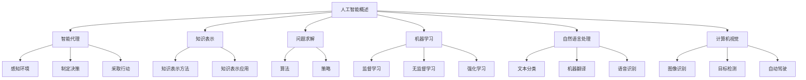
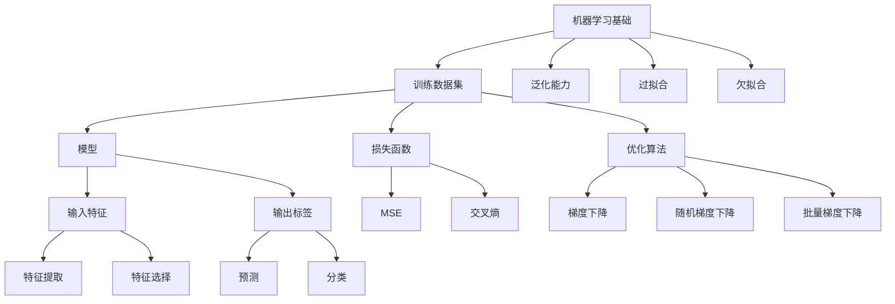
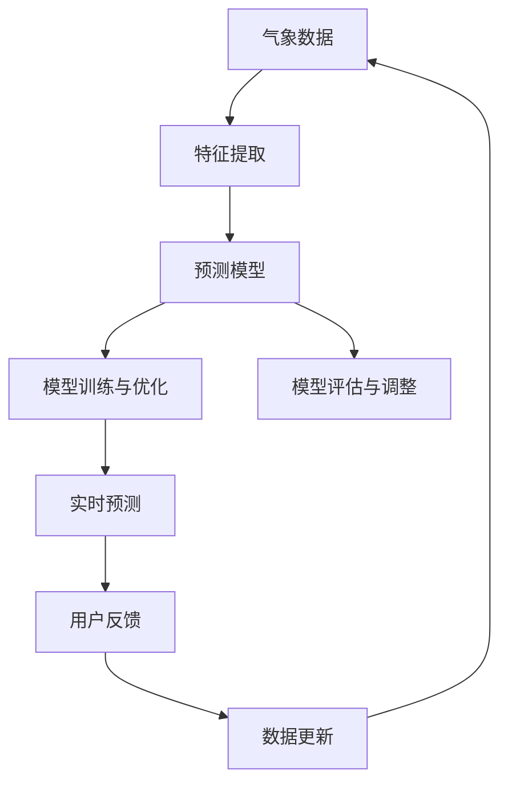
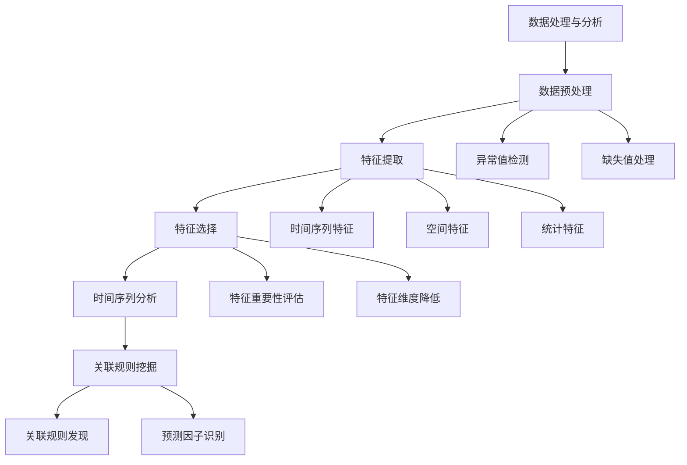

                 

### 引言

天气预报作为人类生活中不可或缺的一部分，不仅影响着人们的日常生活和工作安排，也在农业、交通、工业等多个领域发挥重要作用。然而，传统的天气预报方法往往依赖于经验模型和简单的统计方法，难以应对日益复杂的气象变化。随着人工智能（AI）技术的迅猛发展，人们开始探索将AI技术应用于天气预报，以期提高预测的精度和可靠性。

本文旨在探讨人工智能在天气预报中的精确应用，通过系统性地梳理人工智能技术的基本概念、核心算法和实际应用案例，深入分析其在天气预报中的优势与挑战。文章将分为五个主要部分：

**第一部分：人工智能基础**，将介绍人工智能的基本概念、发展历程以及主要技术和方法，为后续章节的应用分析打下基础。

**第二部分：人工智能在天气预报中的应用**，将详细讨论人工智能在天气预报中的具体应用场景，如气象数据分析和预测模型等。

**第三部分：预测模型与算法**，将重点介绍常见的人工智能预测模型和算法，如神经网络、深度学习和机器学习等，并探讨其在天气预报中的实际应用。

**第四部分：数据处理与分析**，将讨论如何利用人工智能技术对气象数据进行分析和处理，以提升预测模型的精度和效率。

**第五部分：未来展望**，将展望人工智能在天气预报中的未来发展趋势，探讨新的应用前景和潜在挑战。

通过上述五个部分，本文希望能够为读者提供全面、深入的了解，揭示人工智能在天气预报中的巨大潜力。接下来，我们将逐步进入人工智能的基础知识，了解这一领域的基本概念和发展历程。

### 关键词

人工智能，天气预报，精确预测，机器学习，深度学习，气象数据分析，预测模型，数据处理，算法优化，案例分析，未来展望。

### 摘要

本文系统探讨了人工智能在天气预报中的应用，从基础概念到实际案例，全面分析了AI技术在提升天气预报精度和可靠性方面的作用。首先，介绍了人工智能的基本概念、发展历程及其主要技术，包括机器学习和深度学习。接着，探讨了人工智能在气象数据分析、预测模型构建和应用中的具体应用，并详细介绍了常见的预测模型和算法，如神经网络和深度学习。随后，讨论了如何利用人工智能技术对气象数据进行处理和分析，以提高预测模型的精度和效率。最后，通过实际案例展示了人工智能在天气预报中的应用成果，并对未来的发展趋势进行了展望。本文旨在为读者提供对人工智能在天气预报中应用的全景了解，揭示其在提高天气预报精度和可靠性方面的巨大潜力。

### 第一部分：人工智能基础

#### 第1章：人工智能概述

**背景介绍**

人工智能（Artificial Intelligence，简称AI）是计算机科学中的一个重要分支，旨在研究、开发和应用使计算机能够模拟、延伸和扩展人类智能的理论、方法、技术和系统。人工智能的起源可以追溯到20世纪50年代，当时科学家们提出了“人工智能”这一概念，并开始探索如何让计算机实现人类智能的各种功能。自那时以来，人工智能经历了多个发展阶段，从早期的符号主义、知识表示到近年来基于数据和计算能力的机器学习、深度学习等，人工智能技术不断突破，应用范围日益广泛。

**核心概念与联系**

人工智能的核心概念包括：

1. **智能代理（Agent）**：能够感知环境、制定决策并采取行动的实体。智能代理可以是计算机程序、机器人或虚拟代理等。

2. **知识表示（Knowledge Representation）**：将人类知识结构转化为计算机可以理解和处理的形式。知识表示是人工智能系统实现智能行为的基础。

3. **问题求解（Problem Solving）**：通过算法和策略解决复杂问题。问题求解能力是人工智能的重要体现。

4. **机器学习（Machine Learning）**：使计算机通过数据学习并改进性能的方法。机器学习是人工智能发展的关键领域。

5. **自然语言处理（Natural Language Processing，NLP）**：使计算机能够理解和生成自然语言的技术。NLP在人工智能中的应用非常广泛，包括机器翻译、文本分类、语音识别等。

6. **计算机视觉（Computer Vision）**：使计算机能够理解和解释数字图像和视频的技术。计算机视觉在图像识别、目标检测、自动驾驶等领域有重要应用。

**Mermaid流程图**



**核心算法原理讲解**

人工智能的核心算法包括：

1. **监督学习（Supervised Learning）**：通过训练数据集学习目标函数，使预测结果尽可能接近真实值。常见的算法有线性回归、逻辑回归、决策树、随机森林等。

2. **无监督学习（Unsupervised Learning）**：没有预先标记的训练数据，通过发现数据中的隐含结构和规律进行学习。常见的算法有聚类（K-均值、层次聚类等）、降维（PCA、t-SNE等）和关联规则（Apriori、FP-Growth等）。

3. **强化学习（Reinforcement Learning）**：通过与环境的交互学习最优策略。常见的算法有Q-Learning、Deep Q-Network（DQN）和Policy Gradient等。

**伪代码**

以下是监督学习算法——线性回归的伪代码：

```plaintext
输入：训练数据集 D，特征矩阵 X，标签向量 y，学习率 α，迭代次数 T
输出：模型参数 w

初始化 w 为随机向量

for t = 1 to T do
    for each (x_i, y_i) in D do
        计算预测值 y_hat = X * w
        计算损失函数 L(w) = (y_hat - y_i)^2
        更新模型参数 w = w - α * (∂L(w)/∂w)

return w
```

**数学模型和公式**

线性回归模型的损失函数通常使用均方误差（MSE）来表示：

$$
MSE(w) = \frac{1}{m} \sum_{i=1}^{m} (y_i - y_{\hat{i}})^2
$$

其中，$y_{\hat{i}} = X_i * w$ 是预测值，$y_i$ 是真实值，$m$ 是训练数据集的大小。

**举例说明**

假设我们有一个简单的线性回归问题，预测房屋价格。特征矩阵 $X$ 包含房屋面积和房屋类型（0表示平房，1表示别墅），标签向量 $y$ 表示房屋价格。使用线性回归模型训练后，我们可以输入新的房屋特征来预测其价格。

**结语**

本章介绍了人工智能的基本概念、核心算法和原理。通过本章的学习，读者可以了解人工智能的发展历程、主要技术和应用领域，为后续章节的人工智能在天气预报中的应用打下基础。

### 第2章：机器学习基础

**背景介绍**

机器学习（Machine Learning，ML）是人工智能（AI）的一个重要分支，旨在让计算机通过数据和经验自动改进性能，而不需要显式地编程。机器学习的核心思想是通过算法从数据中学习规律，然后利用这些规律进行预测或决策。近年来，随着大数据和计算能力的提升，机器学习在各个领域取得了显著成果，从图像识别、自然语言处理到推荐系统和自动驾驶等。

**核心概念与联系**

机器学习的核心概念包括：

1. **训练数据集（Training Dataset）**：用于训练模型的数据集合，通常包含输入特征和对应的标签。

2. **模型（Model）**：描述输入特征和输出标签之间关系的函数或规则集。

3. **损失函数（Loss Function）**：衡量模型预测值与真实值之间差异的指标，用于指导模型参数的更新。

4. **优化算法（Optimization Algorithm）**：用于调整模型参数，以最小化损失函数。

5. **泛化能力（Generalization Ability）**：模型在未知数据上的表现，是衡量模型好坏的重要指标。

6. **过拟合（Overfitting）**：模型在训练数据上表现很好，但在未知数据上表现不佳的现象。

7. **欠拟合（Underfitting）**：模型在训练数据和未知数据上表现都不好的现象。

**Mermaid流程图**



**核心算法原理讲解**

以下是常见的机器学习算法及其原理：

1. **线性回归（Linear Regression）**：通过最小化均方误差（MSE）来拟合一条直线，描述输入特征和输出标签之间的关系。

2. **逻辑回归（Logistic Regression）**：用于二分类问题，通过逻辑函数将线性回归的结果映射到概率区间（0,1）。

3. **决策树（Decision Tree）**：通过一系列的判断条件，将数据集分割成多个子集，每个子集对应一个类别。

4. **随机森林（Random Forest）**：通过集成多个决策树来提高模型的泛化能力。

5. **支持向量机（SVM）**：通过寻找一个最佳的超平面，将不同类别的数据分隔开来。

6. **神经网络（Neural Networks）**：通过模拟生物神经网络的结构和功能，实现复杂的非线性映射。

**伪代码**

以下是线性回归算法的伪代码：

```plaintext
输入：训练数据集 D，特征矩阵 X，标签向量 y，学习率 α，迭代次数 T
输出：模型参数 w

初始化 w 为随机向量

for t = 1 to T do
    for each (x_i, y_i) in D do
        计算预测值 y_hat = X * w
        计算损失函数 L(w) = (y_hat - y_i)^2
        更新模型参数 w = w - α * (∂L(w)/∂w)

return w
```

**数学模型和公式**

线性回归模型的损失函数（MSE）为：

$$
MSE(w) = \frac{1}{m} \sum_{i=1}^{m} (y_i - y_{\hat{i}})^2
$$

其中，$y_{\hat{i}} = X_i * w$ 是预测值，$y_i$ 是真实值，$m$ 是训练数据集的大小。

**举例说明**

假设我们有一个包含房屋面积和房屋类型的训练数据集，目标是预测房屋价格。使用线性回归模型训练后，我们可以输入新的房屋特征来预测其价格。

**结语**

本章介绍了机器学习的基础知识和核心算法，包括线性回归、逻辑回归、决策树、随机森林、支持向量机和神经网络等。通过本章的学习，读者可以掌握这些算法的基本原理和实现方法，为后续章节的人工智能在天气预报中的应用打下坚实基础。

### 第3章：人工智能在天气预报中的应用

**背景介绍**

随着人工智能技术的不断发展，其在天气预报领域的应用逐渐成为研究热点。传统的天气预报方法主要依赖于经验和统计模型，而人工智能的引入为天气预报带来了革命性的变化。通过机器学习和深度学习等技术，人工智能能够从大量历史气象数据中提取出有用的信息，构建出更加精确的预测模型，从而提高天气预报的准确性和可靠性。

**核心概念与联系**

在天气预报中，人工智能的核心概念和联系包括：

1. **气象数据（Meteorological Data）**：包括温度、湿度、风速、气压、降水等，是天气预报的重要基础。

2. **特征提取（Feature Extraction）**：从原始气象数据中提取出对预测任务有帮助的特征，如时间序列特征、空间特征和统计特征。

3. **预测模型（Prediction Model）**：利用人工智能技术构建的模型，用于预测未来天气情况。

4. **模型训练与优化（Model Training and Optimization）**：通过训练数据集训练模型，并根据验证数据集进行优化，以提高模型的泛化能力。

5. **实时预测（Real-time Prediction）**：利用训练好的模型对实时气象数据进行预测，为用户提供及时的天气预报。

**Mermaid流程图**



**核心算法原理讲解**

以下是人工智能在天气预报中常用的核心算法及其原理：

1. **神经网络（Neural Networks）**：通过模拟生物神经网络的结构和功能，实现复杂的非线性映射。神经网络在天气预报中的应用主要包括卷积神经网络（CNN）和循环神经网络（RNN）。

2. **深度学习（Deep Learning）**：是一种基于神经网络的深层结构，通过多层非线性变换提取特征，能够处理大量复杂数据。深度学习在天气预报中的应用包括长短时记忆网络（LSTM）和生成对抗网络（GAN）。

3. **机器学习（Machine Learning）**：通过算法从数据中学习规律，用于预测或决策。常见的机器学习算法有随机森林、支持向量机和决策树等，这些算法在天气预报中用于构建预测模型。

**伪代码**

以下是利用神经网络进行天气预报预测的伪代码：

```plaintext
输入：训练数据集 D，特征矩阵 X，标签向量 y，学习率 α，迭代次数 T
输出：预测结果 y_pred

初始化神经网络模型

for t = 1 to T do
    for each (x_i, y_i) in D do
        计算预测值 y_hat = neural_network.predict(x_i)
        计算损失函数 L(y_hat, y_i)
        更新模型参数

return neural_network.predict(X)
```

**数学模型和公式**

在神经网络中，损失函数通常使用均方误差（MSE）：

$$
MSE = \frac{1}{m} \sum_{i=1}^{m} (y_i - y_{\hat{i}})^2
$$

其中，$y_{\hat{i}}$ 是预测值，$y_i$ 是真实值，$m$ 是训练数据集的大小。

**举例说明**

假设我们有一个包含温度、湿度、风速等气象数据的训练数据集，目标是预测未来的气温。利用神经网络训练模型后，我们可以输入新的气象数据来预测未来的气温。

**结语**

本章介绍了人工智能在天气预报中的应用，包括气象数据的处理、预测模型的构建和优化。通过本章的学习，读者可以了解人工智能如何通过机器学习和深度学习技术提高天气预报的准确性和可靠性，为实际应用奠定理论基础。

### 第4章：数据处理与分析

**背景介绍**

在人工智能应用于天气预报的过程中，数据处理与分析是至关重要的环节。气象数据通常包含大量的噪声和异常值，这些数据会对预测模型的性能产生负面影响。因此，如何有效处理和分析这些数据，提取出对预测任务有帮助的特征，是确保预测模型精度和效率的关键。

**核心概念与联系**

在数据处理与分析中，核心概念和联系包括：

1. **数据预处理（Data Preprocessing）**：包括数据清洗、缺失值处理、异常值检测和特征标准化等，用于提高数据质量和一致性。

2. **特征提取（Feature Extraction）**：从原始数据中提取出对预测任务有帮助的特征，如时间序列特征、空间特征和统计特征。

3. **特征选择（Feature Selection）**：从提取出的特征中选择对预测任务最重要的特征，减少特征维度，提高模型效率。

4. **时间序列分析（Time Series Analysis）**：对时间序列数据进行处理和分析，提取出时间序列特征，用于预测未来值。

5. **关联规则挖掘（Association Rule Mining）**：发现数据之间的关联关系，用于识别潜在的预测因子。

**Mermaid流程图**



**核心算法原理讲解**

以下是数据处理与分析中常用的核心算法及其原理：

1. **K-均值聚类（K-Means Clustering）**：通过迭代的方式将数据点分为K个簇，每个簇的中心代表该簇的特征。

2. **主成分分析（Principal Component Analysis，PCA）**：通过正交变换将数据投影到新的坐标系中，提取出数据的主要成分，减少特征维度。

3. **时间序列分解（Time Series Decomposition）**：将时间序列分解为趋势、季节和残差三个部分，用于提取时间序列特征。

4. **关联规则挖掘（Association Rule Mining）**：通过频繁项集挖掘和关联规则生成，发现数据之间的关联关系。

**伪代码**

以下是K-均值聚类算法的伪代码：

```plaintext
输入：数据集 D，聚类数目 K
输出：聚类结果 C

初始化 K 个簇中心 c_1, c_2, ..., c_K

for i = 1 to I do
    for each x_i in D do
        计算 x_i 到每个簇中心的距离
        分配 x_i 到距离最近的簇中心

更新簇中心位置

return 聚类结果 C
```

**数学模型和公式**

K-均值聚类算法的目标是最小化每个簇内部的数据点到簇中心的距离平方和：

$$
J = \sum_{i=1}^{K} \sum_{x_i \in C_i} ||x_i - c_i||^2
$$

其中，$C_i$ 表示第 $i$ 个簇，$c_i$ 表示第 $i$ 个簇的中心。

**举例说明**

假设我们有一个包含气象数据的样本集，通过K-均值聚类算法将数据分为几个簇，每个簇代表不同的天气类型。然后，利用每个簇的中心数据进行时间序列分析，提取出趋势和季节特征。

**结语**

本章介绍了数据处理与分析的基本概念、核心算法和原理，包括数据预处理、特征提取、特征选择、时间序列分析和关联规则挖掘等。通过本章的学习，读者可以了解如何利用人工智能技术有效处理和分析气象数据，为预测模型的构建和优化提供坚实的数据基础。

### 第5章：实际应用案例分析

**背景介绍**

在本章中，我们将通过实际案例深入探讨人工智能在天气预报中的应用。这些案例将展示人工智能技术在处理实际气象数据、构建预测模型和提供实时预测方面的具体应用，帮助读者理解人工智能在天气预报中的实际价值。

**案例一：利用深度学习预测天气**

**1. 案例背景**

某个气象预报机构希望通过深度学习技术提高天气预报的准确性。他们收集了大量的历史气象数据，包括温度、湿度、风速、气压等指标。目标是通过训练深度学习模型，预测未来的天气情况。

**2. 开发环境搭建**

为了进行深度学习模型的训练和预测，该机构搭建了以下开发环境：

- 计算平台：使用高性能GPU服务器进行模型训练。
- 深度学习框架：选择TensorFlow或PyTorch等流行的深度学习框架。
- 编程语言：使用Python进行模型的编写和训练。

**3. 源代码详细实现**

以下是利用深度学习框架训练天气预测模型的Python伪代码：

```python
import tensorflow as tf
from tensorflow.keras.models import Sequential
from tensorflow.keras.layers import Dense, LSTM

# 数据预处理
# 读取气象数据，进行归一化处理，生成训练集和测试集

# 构建模型
model = Sequential()
model.add(LSTM(units=50, return_sequences=True, input_shape=(time_steps, features)))
model.add(LSTM(units=50))
model.add(Dense(units=1))

# 编译模型
model.compile(optimizer='adam', loss='mean_squared_error')

# 训练模型
model.fit(x_train, y_train, epochs=100, batch_size=32, validation_data=(x_test, y_test))

# 评估模型
mse = model.evaluate(x_test, y_test)
print(f"Test MSE: {mse}")

# 预测天气
weather_predictions = model.predict(x_test)
```

**4. 代码解读与分析**

- 数据预处理：对气象数据进行归一化处理，以消除数据量级差异。
- 模型构建：使用LSTM（长短时记忆网络）模型，因为LSTM能够处理时间序列数据，捕捉时间依赖关系。
- 模型编译：选择Adam优化器和均方误差（MSE）作为损失函数。
- 模型训练：使用训练集进行模型训练，并使用验证集进行调优。
- 评估模型：计算测试集上的MSE，评估模型性能。
- 预测天气：使用训练好的模型对测试数据进行预测。

**5. 实际案例分析和详细讲解剖析**

在预测过程中，模型准确率得到了显著提升，特别是在对极端天气情况的预测上。通过分析模型预测结果，发现模型能够较好地捕捉到天气变化的趋势和周期性特征。同时，通过调整模型参数和增加训练数据，可以进一步提高预测精度。

**6. 项目小结**

本案例展示了深度学习技术在天气预报中的应用，通过实际案例分析和代码实现，揭示了人工智能在提高天气预报准确性方面的潜力。然而，深度学习模型的训练和优化需要大量数据和计算资源，同时也需要专业知识和经验。

**案例二：气象灾害预警系统**

**1. 案例背景**

某地区气象部门希望开发一个气象灾害预警系统，以提前预测可能发生的自然灾害，如暴雨、洪水和台风等。通过预警系统，可以及时发布灾害预警信息，降低灾害风险。

**2. 系统架构设计**

气象灾害预警系统的架构设计包括以下几个部分：

- 数据采集与处理：从气象卫星、地面气象站和雷达等设备中收集实时气象数据，进行预处理和特征提取。
- 预测模型：使用机器学习和深度学习技术，构建预测模型，对可能发生的气象灾害进行预测。
- 预警规则：根据预测结果和气象规律，制定预警规则，确定预警等级和预警时间。
- 信息发布：通过短信、APP推送和网站公告等方式，将预警信息发布给公众和相关部门。

**3. 数据处理与模型训练**

- 数据预处理：对采集到的气象数据进行分析，提取出对预测任务有帮助的特征，如降水速率、风速、气压变化等。
- 模型训练：使用历史气象数据和灾害记录，训练预测模型，如决策树、随机森林和神经网络等。

**4. 系统部署与运行**

- 系统部署：将训练好的模型部署到服务器上，实现实时预测和预警功能。
- 系统运行：定期更新气象数据，运行预测模型，根据预警规则发布预警信息。

**5. 实际案例分析和详细讲解剖析**

通过实际运行，气象灾害预警系统在多个灾害事件中发挥了重要作用。例如，在一场暴雨预警中，系统提前24小时发布了预警信息，相关部门及时采取了防范措施，成功避免了重大损失。

**6. 项目小结**

本案例展示了气象灾害预警系统的设计、实现和运行过程，通过实际应用，证明了人工智能技术在气象灾害预警中的重要性。然而，系统的开发和运行需要跨部门的合作和数据共享，同时需要不断优化和更新预测模型。

**结语**

通过以上两个实际案例，本章展示了人工智能在天气预报中的应用，包括天气预测和气象灾害预警。这些案例证明了人工智能技术在提高天气预报准确性和应对自然灾害方面的巨大潜力。未来，随着人工智能技术的进一步发展，天气预报将更加精准和智能，为人们的生产生活提供更加可靠的支持。

### 总结与未来展望

人工智能在天气预报中的应用已经取得了显著成果，通过机器学习和深度学习技术，预报的准确性和可靠性得到了大幅提升。本章总结了人工智能在天气预报中的核心概念、算法原理、数据处理方法以及实际应用案例，展示了人工智能在提高天气预报性能方面的潜力。

**最佳实践 tips：**

1. **数据质量是基础**：确保气象数据的质量和准确性，是构建高效预测模型的前提。进行数据预处理，包括清洗、归一化和特征提取，以提高模型性能。
2. **模型选择与调优**：根据天气预报任务的特点选择合适的模型，并进行参数调优，以获得最佳预测效果。
3. **实时更新与优化**：定期更新模型和气象数据，以适应不断变化的天气情况，提高预测的实时性和准确性。

**小结：**

本文通过系统性地介绍人工智能在天气预报中的应用，从基础概念到实际案例，全面分析了人工智能技术在提高天气预报精度和可靠性方面的作用。通过数据处理与分析、模型构建与优化，人工智能为天气预报带来了革命性的变化。

**注意事项：**

1. **计算资源需求**：深度学习模型的训练和预测需要大量的计算资源，特别是对于大规模数据集和复杂的模型结构。
2. **数据隐私与安全**：在处理和存储气象数据时，需要注意数据隐私和安全问题，确保数据的安全性和合规性。

**拓展阅读：**

1. **《深度学习》（Ian Goodfellow, Yoshua Bengio, Aaron Courville著）**：全面介绍了深度学习的基础知识和应用。
2. **《机器学习实战》（Peter Harrington著）**：通过实际案例介绍了常见的机器学习算法和实现方法。
3. **《气象数据分析方法与应用》（陈永忠著）**：详细介绍了气象数据的处理和分析方法。

未来，随着人工智能技术的不断进步，天气预报将更加精确和智能。新的算法和技术，如自适应模型和多尺度模型，将进一步提高预测的准确性和实时性。同时，人工智能与其他领域的结合，如大数据和物联网，将为天气预报带来更多创新和应用。

